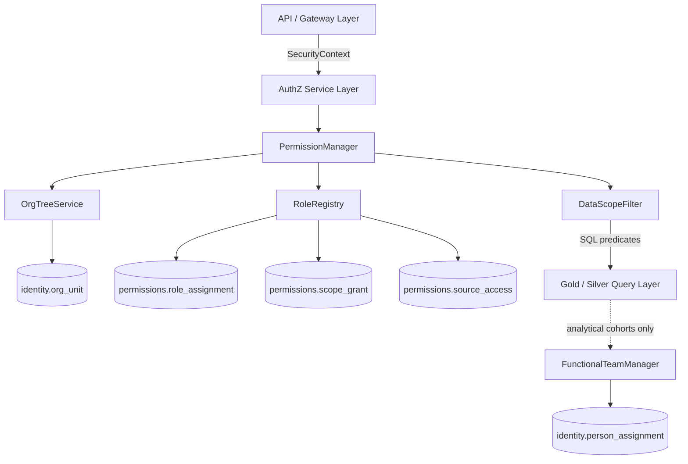
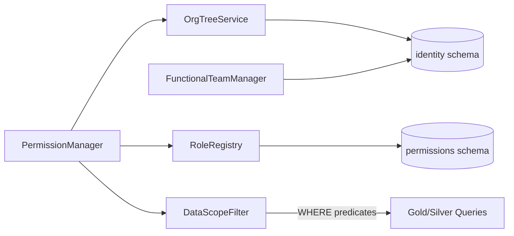
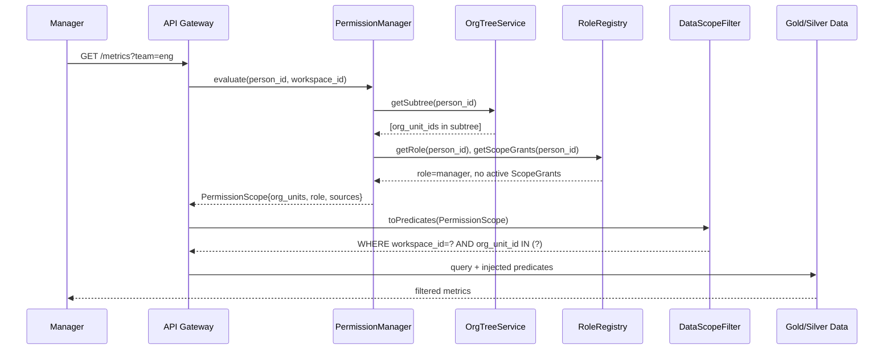
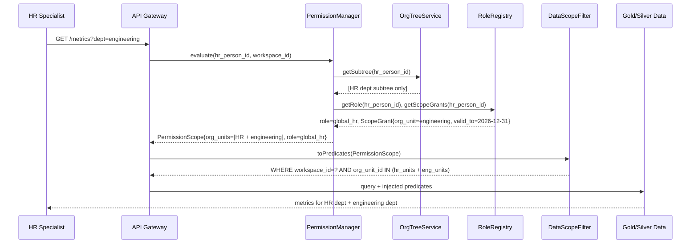

# Technical Design — Permission Architecture

<!-- toc -->

- [1. Architecture Overview](#1-architecture-overview)
  - [1.1 Architectural Vision](#11-architectural-vision)
  - [1.2 Architecture Drivers](#12-architecture-drivers)
    - [Functional Drivers](#functional-drivers)
    - [NFR Allocation](#nfr-allocation)
  - [1.3 Architecture Layers](#13-architecture-layers)
- [2. Principles & Constraints](#2-principles-constraints)
  - [2.1 Design Principles](#21-design-principles)
    - [Least Privilege](#least-privilege)
    - [Separation of Access Control and Analytical Cohorts](#separation-of-access-control-and-analytical-cohorts)
    - [Filter at Source](#filter-at-source)
    - [Explicit Cross-Cutting Grants](#explicit-cross-cutting-grants)
  - [2.2 Constraints](#22-constraints)
    - [Identity Foundation Is Read-Only](#identity-foundation-is-read-only)
    - [Tenant Isolation Is Non-Negotiable](#tenant-isolation-is-non-negotiable)
    - [ScopeGrants Must Be Time-Bounded](#scopegrants-must-be-time-bounded)
- [3. Technical Architecture](#3-technical-architecture)
  - [3.1 Domain Model](#31-domain-model)
  - [3.2 Component Model](#32-component-model)
    - [PermissionManager](#permissionmanager)
      - [Why this component exists](#why-this-component-exists)
      - [Responsibility scope](#responsibility-scope)
      - [Responsibility boundaries](#responsibility-boundaries)
      - [Related components (by ID)](#related-components-by-id)
    - [OrgTreeService](#orgtreeservice)
      - [Why this component exists](#why-this-component-exists-1)
      - [Responsibility scope](#responsibility-scope-1)
      - [Responsibility boundaries](#responsibility-boundaries-1)
      - [Related components (by ID)](#related-components-by-id-1)
    - [RoleRegistry](#roleregistry)
      - [Why this component exists](#why-this-component-exists-2)
      - [Responsibility scope](#responsibility-scope-2)
      - [Responsibility boundaries](#responsibility-boundaries-2)
      - [Related components (by ID)](#related-components-by-id-2)
    - [DataScopeFilter](#datascopefilter)
      - [Why this component exists](#why-this-component-exists-3)
      - [Responsibility scope](#responsibility-scope-3)
      - [Responsibility boundaries](#responsibility-boundaries-3)
      - [Related components (by ID)](#related-components-by-id-3)
    - [FunctionalTeamManager](#functionalteammanager)
      - [Why this component exists](#why-this-component-exists-4)
      - [Responsibility scope](#responsibility-scope-4)
      - [Responsibility boundaries](#responsibility-boundaries-4)
      - [Related components (by ID)](#related-components-by-id-4)
  - [3.3 API Contracts](#33-api-contracts)
  - [3.4 Internal Dependencies](#34-internal-dependencies)
  - [3.5 External Dependencies](#35-external-dependencies)
  - [3.6 Interactions & Sequences](#36-interactions-sequences)
    - [Standard Hierarchical Data Query](#standard-hierarchical-data-query)
    - [Cross-Cutting Access via ScopeGrant (HR Use Case)](#cross-cutting-access-via-scopegrant-hr-use-case)
  - [3.7 Database Schemas & Tables](#37-database-schemas-tables)
    - [Table: `permissions.role_assignment`](#table-permissionsroleassignment)
    - [Table: `permissions.scope_grant`](#table-permissionsscopegrant)
    - [Table: `permissions.source_access`](#table-permissionssourceaccess)
- [4. Additional Context](#4-additional-context)
- [5. Traceability](#5-traceability)

<!-- /toc -->

## 1. Architecture Overview

### 1.1 Architectural Vision

The Permission Architecture defines how Insight controls access to data and features across multi-tenant workspaces. It operates as a dedicated layer built on top of the existing identity model (see [IDENTITY_RESOLUTION_V3](../IDENTITY_RESOLUTION_V3.md)) and is responsible for answering a single question at query time: *what data is this user allowed to see?*

Access control is resolved through three complementary mechanisms: role-based grants (what a user is broadly allowed to do), org-hierarchy scoping (which part of the org tree a user's role applies to), and explicit cross-cutting ScopeGrants (time-bounded overrides that allow access outside the natural hierarchy). These mechanisms are deliberately kept separate from analytical cohorts (functional teams), which are used for benchmarking and comparisons rather than for access control.

The architecture is designed to be enforced at query time through SQL predicate injection, ensuring that no data escapes its intended visibility scope regardless of how queries are composed.

### 1.2 Architecture Drivers

**ADRs**: `cpt-insightspec-adr-role-scope-grant-vs-abac`, `cpt-insightspec-adr-workspace-isolation`

#### Functional Drivers

| Requirement | Design Response |
|---|---|
| Hierarchical data visibility | OrgTreeService resolves user's org subtree; DataScopeFilter injects path-prefix predicate |
| Cross-cutting access (HR, Finance) | ScopeGrant provides time-bounded, audited access to org units outside the natural hierarchy |
| Source-domain access control | SourceAccess grants explicit access to specific data source domains (e.g., Allure, HubSpot) |
| Time-bounded access | ScopeGrant and SourceAccess carry `valid_from`/`valid_to`; expired grants are ignored at evaluation time |
| Admin control over grants | RoleRegistry exposes a management interface; all grants require `granted_by` and `reason` |

#### NFR Allocation

| NFR | NFR Summary | Allocated To | Design Response | Verification Approach |
|---|---|---|---|---|
| Tenant isolation | No data leaks between workspaces | DataScopeFilter | `workspace_id` predicate injected at all query boundaries | Integration tests with cross-tenant queries |
| Auditability | All access decisions must be traceable | PermissionManager + DB audit log | Every grant carries `granted_by`, `valid_from`, `valid_to`, `reason` | Audit log coverage review |
| Query performance | Permission evaluation must not degrade p95 query latency | DataScopeFilter | Scope resolved once per request, injected as indexed predicate (`idx_org_path_prefix`) | Query plan analysis |

### 1.3 Architecture Layers

- [ ] `p3` - **ID**: `cpt-insightspec-tech-permission-layer`

| Layer | Responsibility | Technology |
|---|---|---|
| API / Gateway | Token validation, user identity injection into SecurityContext | Existing API layer |
| AuthZ Service | RBAC evaluation, org-scope resolution, ScopeGrant lookup | PostgreSQL-backed service |
| Data Visibility Filter | SQL predicate generation from resolved permission scope | SQL WHERE clause injection |
| Identity Foundation | Org hierarchy, person assignments (read-only from permission layer) | `identity` schema (IDENTITY_RESOLUTION_V3) |

## 2. Principles & Constraints

### 2.1 Design Principles

#### Least Privilege

- [ ] `p1` - **ID**: `cpt-insightspec-principle-least-privilege`

Every user starts with the minimum access required for their role. No data is visible by default. Access must be explicitly granted through a role, org-scope assignment, or ScopeGrant.

**ADRs**: [ADR-001](./ADR_001_ROLE_SCOPE_GRANT.md)

#### Separation of Access Control and Analytical Cohorts

- [ ] `p1` - **ID**: `cpt-insightspec-principle-separation-of-concerns`

Org structure (who reports to whom) controls data visibility. Functional teams (Dev-Backend, QA, etc.) are used only for benchmarking cohorts. These two concepts must never be conflated. A person may belong to a functional team that crosses org boundaries without that affecting their access scope.

**ADRs**: [ADR-001](./ADR_001_ROLE_SCOPE_GRANT.md)

#### Filter at Source

- [ ] `p1` - **ID**: `cpt-insightspec-principle-filter-at-source`

Visibility constraints are enforced at query time through SQL predicate injection by DataScopeFilter. Data is never retrieved and then filtered in application code. This ensures no over-fetching regardless of query composition.

#### Explicit Cross-Cutting Grants

- [ ] `p2` - **ID**: `cpt-insightspec-principle-explicit-grants`

Access outside a user's natural org-hierarchy position (e.g., HR accessing metrics in a different branch) is granted only through explicit, time-bounded ScopeGrants created by a workspace administrator. There is no implicit or attribute-derived cross-branch access.

**ADRs**: [ADR-001](./ADR_001_ROLE_SCOPE_GRANT.md)

### 2.2 Constraints

#### Identity Foundation Is Read-Only

- [ ] `p1` - **ID**: `cpt-insightspec-constraint-identity-foundation`

The permission layer reads from but never writes to the `identity` schema (`org_unit`, `person_assignment`, `canonical_person`). Org hierarchy and identity resolution remain owned by IDENTITY_RESOLUTION_V3.

**ADRs**: [ADR-002](./ADR_002_WORKSPACE_ISOLATION.md)

#### Tenant Isolation Is Non-Negotiable

- [ ] `p1` - **ID**: `cpt-insightspec-constraint-tenant-isolation`

Every query against Silver or Gold data must include a `workspace_id` predicate. The DataScopeFilter is the sole authority for injecting this predicate and must be invoked on every data request.

**ADRs**: [ADR-002](./ADR_002_WORKSPACE_ISOLATION.md)

#### ScopeGrants Must Be Time-Bounded

- [ ] `p1` - **ID**: `cpt-insightspec-constraint-grant-time-bound`

Every ScopeGrant must carry both `valid_from` and `valid_to`. Perpetual grants are not supported. Maximum grant duration is governed by workspace policy (default: 1 year). This ensures access is automatically revoked when an HR person changes role or the business relationship ends.

## 3. Technical Architecture

### 3.1 Domain Model

**Location**: [`IDENTITY_RESOLUTION_V3.md`](../IDENTITY_RESOLUTION_V3.md) (identity foundation), `permissions` schema (permission-specific entities)

**Core Entities**:

| Entity | Description | Schema |
|---|---|---|
| `OrgNode` | Hierarchical org unit with materialized path | `identity.org_unit` (IDENTITY_RESOLUTION_V3 §6.4.1) |
| `FunctionalTeam` | Analytical cohort, cross-hierarchy | `identity.person_assignment` where `assignment_type = 'functional_team'` |
| `Role` | Named permission set scoped to a workspace | `permissions.role_assignment` |
| `SourceAccess` | Explicit grant for a data source domain | `permissions.source_access` |
| `ScopeGrant` | Time-bounded cross-hierarchy access override | `permissions.scope_grant` |

**Relationships**:

- `Role` → `OrgNode`: a role assignment applies to a user within an org scope (their subtree by default)
- `ScopeGrant` → `OrgNode`: grants access to a specific org subtree outside the user's natural position
- `SourceAccess` → `Role`: source-domain access may be tied to a role (e.g., `global_hr`) or granted individually
- `FunctionalTeam` → `OrgNode`: functional teams span org boundaries; they do not affect access scope

### 3.2 Component Model

#### PermissionManager

- [ ] `p1` - **ID**: `cpt-insightspec-component-permission-manager`

##### Why this component exists

Single point of authority for all access decisions. Prevents permission logic from leaking into individual query handlers or API endpoints.

##### Responsibility scope

Accepts a `(person_id, workspace_id, requested_resource)` tuple and returns a resolved `PermissionScope` containing: allowed org unit IDs, allowed source domains, and applicable role. Aggregates inputs from OrgTreeService (natural hierarchy), RoleRegistry (role + source access), and ScopeGrant lookups.

##### Responsibility boundaries

Does not execute queries against business data. Does not manage or create grants. Does not know about analytical cohorts (FunctionalTeamManager is separate).

##### Related components (by ID)

- `cpt-insightspec-component-org-tree-service` — provides resolved org subtree for the user's natural position
- `cpt-insightspec-component-role-registry` — provides role, source access, and ScopeGrant records
- `cpt-insightspec-component-data-scope-filter` — consumes resolved PermissionScope to generate SQL predicates

---

#### OrgTreeService

- [ ] `p1` - **ID**: `cpt-insightspec-component-org-tree-service`

##### Why this component exists

Encapsulates all hierarchy traversal logic against `identity.org_unit`. Prevents direct SQL path-prefix queries from being scattered across the codebase.

##### Responsibility scope

Given a `(person_id, workspace_id)`, returns the set of `org_unit_id`s the person is entitled to see under their natural org position — their own node plus all descendant nodes via materialized path. Also supports manager-of lookup for PermissionManager.

##### Responsibility boundaries

Read-only access to `identity` schema. Does not apply roles or ScopeGrants — those are resolved by PermissionManager after OrgTreeService returns the baseline scope.

##### Related components (by ID)

- `cpt-insightspec-component-permission-manager` — sole consumer of OrgTreeService results

---

#### RoleRegistry

- [ ] `p1` - **ID**: `cpt-insightspec-component-role-registry`

##### Why this component exists

Centralises management of role assignments, ScopeGrants, and source-domain access records. Provides the admin surface for access management.

##### Responsibility scope

Stores and retrieves `role_assignment`, `scope_grant`, and `source_access` records. Validates that ScopeGrants are time-bounded and that the granting user has sufficient privilege. Exposes management APIs for workspace administrators.

##### Responsibility boundaries

Does not evaluate whether a grant permits a specific query — that is PermissionManager's job. Does not interact with the `identity` schema directly.

##### Related components (by ID)

- `cpt-insightspec-component-permission-manager` — reads role, ScopeGrant, and source-access records at evaluation time

---

#### DataScopeFilter

- [ ] `p1` - **ID**: `cpt-insightspec-component-data-scope-filter`

##### Why this component exists

Ensures permission constraints are enforced at the data layer rather than in application code. Centralises predicate injection so no query path can bypass visibility rules.

##### Responsibility scope

Accepts a resolved `PermissionScope` from PermissionManager and produces SQL WHERE predicates to be injected into Gold/Silver queries: `workspace_id = ?`, `org_unit_id IN (?)`, and source-domain filters where applicable.

##### Responsibility boundaries

Does not evaluate permissions. Does not know about roles or grants. Purely a translation layer from PermissionScope to SQL predicates. Must be invoked for every data request — bypassing it is a policy violation.

##### Related components (by ID)

- `cpt-insightspec-component-permission-manager` — provides PermissionScope as input

---

#### FunctionalTeamManager

- [ ] `p2` - **ID**: `cpt-insightspec-component-functional-team-manager`

##### Why this component exists

Manages analytical cohorts (functional teams) independently from access control. Prevents conflation of "who you can see" (access) with "who you are compared against" (benchmarking).

##### Responsibility scope

Reads and manages `person_assignment` records where `assignment_type = 'functional_team'`. Provides cohort membership for the analytics and AI layers. Has no bearing on data visibility permissions.

##### Responsibility boundaries

No interaction with PermissionManager, RoleRegistry, or DataScopeFilter. Purely an analytics-layer concern.

##### Related components (by ID)

- `cpt-insightspec-component-permission-manager` — explicitly NOT a dependency; functional teams do not affect access scope

### 3.3 API Contracts

- [ ] `p1` - **ID**: `cpt-insightspec-interface-authz-api`

- **Technology**: Internal service API (REST)
- **Consumers**: API Gateway, Gold/Silver query orchestration layer

**Endpoints Overview**:

| Method | Path | Description | Stability |
|---|---|---|---|
| `POST` | `/authz/evaluate` | Resolve PermissionScope for a (person_id, workspace_id) pair | stable |
| `GET` | `/admin/scope-grants` | List active ScopeGrants for a workspace | stable |
| `POST` | `/admin/scope-grants` | Create a new ScopeGrant | stable |
| `DELETE` | `/admin/scope-grants/{id}` | Revoke a ScopeGrant before expiry | stable |
| `GET` | `/admin/role-assignments` | List role assignments for a workspace | stable |
| `PUT` | `/admin/role-assignments/{person_id}` | Assign or update a user's role | stable |

### 3.4 Internal Dependencies

| Dependency Module | Interface Used | Purpose |
|---|---|---|
| Identity Manager (IDENTITY_RESOLUTION_V3) | Read-only access to `identity.org_unit`, `identity.person_assignment` | Org hierarchy traversal and canonical person resolution |
| Gold / Silver Query Layer | SQL predicate injection via DataScopeFilter | Enforcing visibility at data retrieval |

**Dependency Rules**:

- No circular dependencies
- Permission layer reads identity schema; identity schema has no knowledge of the permission layer
- DataScopeFilter must be invoked before any Gold/Silver data is returned to the application layer

### 3.5 External Dependencies

| Dependency | Interface Used | Purpose |
|---|---|---|
| HR Systems (BambooHR, Workday, LDAP) | Via existing HR connectors → Bronze → identity schema | Source of org structure and role assignments |
| PostgreSQL / MariaDB | SQL | Persistence for `permissions` schema tables |

### 3.6 Interactions & Sequences

#### Standard Hierarchical Data Query

**ID**: `cpt-insightspec-seq-hierarchical-query`

**Actors**: Authenticated user (Manager)

**Description**: Standard request where a manager queries metrics for their team. PermissionManager combines the org subtree (from OrgTreeService) with role and grant data (from RoleRegistry) into a PermissionScope, which DataScopeFilter translates to SQL predicates injected into the data query.

---

#### Cross-Cutting Access via ScopeGrant (HR Use Case)

**ID**: `cpt-insightspec-seq-cross-cutting-query`

**Actors**: HR specialist (in a different org branch)

**Description**: HR specialist has a `global_hr` role (broad people-metrics access) plus an explicit ScopeGrant for the Engineering org unit (time-bounded, created by a workspace admin). PermissionManager merges the natural hierarchy scope with the ScopeGrant, resulting in a union of allowed org units. When the ScopeGrant expires, access automatically reverts to the HR specialist's natural org subtree only.

### 3.7 Database Schemas & Tables

#### Table: `permissions.role_assignment`

| Column | Type | Description |
|---|---|---|
| `person_id` | UUID | FK → `identity.canonical_person.person_id` |
| `workspace_id` | UUID | Tenant boundary |
| `role` | ENUM | `workspace_admin`, `manager`, `member`, `viewer`, `global_hr`, `global_finance` |
| `assigned_by` | UUID | Person who created this assignment |
| `valid_from` | DATE | Start of assignment |
| `valid_to` | DATE | End of assignment (NULL = no expiry for structural roles) |
| `created_at` | TIMESTAMPTZ | Audit timestamp |

**PK**: `(person_id, workspace_id, role, valid_from)`

---

#### Table: `permissions.scope_grant`

| Column | Type | Description |
|---|---|---|
| `grant_id` | UUID | Surrogate PK |
| `grantee_person_id` | UUID | FK → `identity.canonical_person.person_id` |
| `workspace_id` | UUID | Tenant boundary |
| `org_unit_id` | UUID | FK → `identity.org_unit.org_unit_id` (subtree root being granted) |
| `role_constraint` | ENUM | Role context in which this grant applies (NULL = any role) |
| `granted_by` | UUID | Workspace admin who created the grant |
| `valid_from` | DATE | Start of grant (required) |
| `valid_to` | DATE | End of grant (required — perpetual grants not permitted) |
| `reason` | TEXT | Business justification (required) |
| `created_at` | TIMESTAMPTZ | Audit timestamp |

**PK**: `grant_id`

**Constraints**: `valid_to IS NOT NULL`, `valid_to > valid_from`

---

#### Table: `permissions.source_access`

| Column | Type | Description |
|---|---|---|
| `person_id` | UUID | FK → `identity.canonical_person.person_id` |
| `workspace_id` | UUID | Tenant boundary |
| `source_domain` | TEXT | e.g., `allure`, `hubspot`, `salesforce` |
| `granted_by` | UUID | Workspace admin |
| `valid_from` | DATE | Start of access |
| `valid_to` | DATE | End of access (NULL = tied to role lifecycle) |
| `created_at` | TIMESTAMPTZ | Audit timestamp |

**PK**: `(person_id, workspace_id, source_domain)`

## 4. Additional Context

This design deliberately does not define the authentication mechanism (AuthN) — token validation and identity injection at the gateway level are outside this document's scope and will be addressed separately.

The `global_hr` and `global_finance` roles provide broad access to people-metrics without requiring individual ScopeGrants per org unit. When a person with such a role also holds explicit ScopeGrants, PermissionManager unions all permitted org units. When the role is revoked (e.g., an HR specialist changes job function), all role-derived access is immediately lost; active ScopeGrants remain valid until their `valid_to` date or are explicitly revoked by an admin.

Functional teams (`FunctionalTeamManager`) deliberately have no path into the permission evaluation pipeline. Benchmarking cohorts must never become access control vectors.

**Date**: 2026-03-11

## 5. Traceability

- **PRD**: [PRODUCT_SPECIFICATION.md](../PRODUCT_SPECIFICATION.md) §645 — People Grouping & Access
- **Identity Foundation**: [IDENTITY_RESOLUTION_V3.md](../IDENTITY_RESOLUTION_V3.md) §6.4 — Organizational Assignments
- **ADRs**:
  - [ADR-001 — Role + Explicit Scope Grant vs ABAC](./ADR_001_ROLE_SCOPE_GRANT.md)
  - [ADR-002 — Multi-tenant Workspace Isolation](./ADR_002_WORKSPACE_ISOLATION.md)
