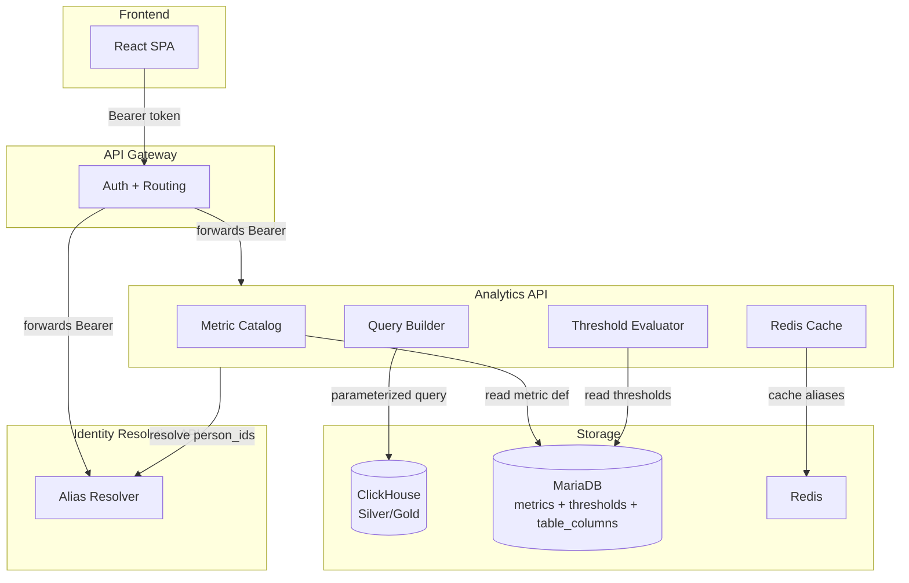
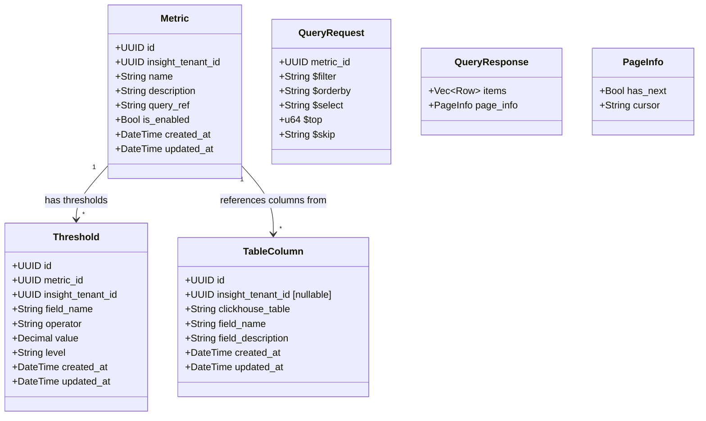
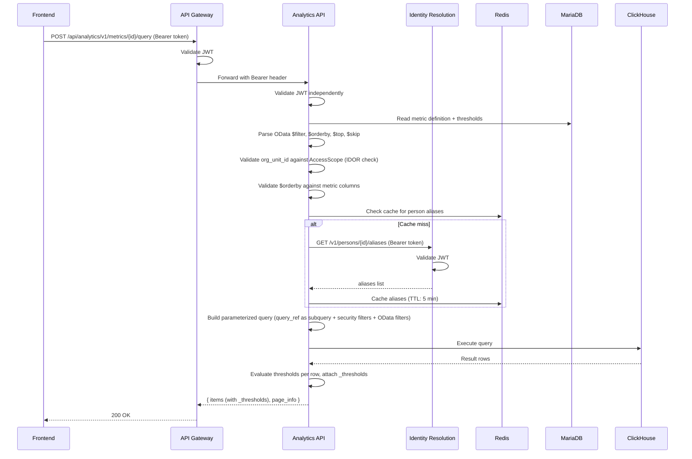

# Technical Design -- Analytics API

- [ ] `p1` - **ID**: `cpt-insightspec-design-analytics-api`

<!-- toc -->

- [1. Architecture Overview](#1-architecture-overview)
  - [1.1 Architectural Vision](#11-architectural-vision)
  - [1.2 Architecture Drivers](#12-architecture-drivers)
  - [1.3 Architecture Layers](#13-architecture-layers)
- [2. Principles & Constraints](#2-principles--constraints)
  - [2.1 Design Principles](#21-design-principles)
  - [2.2 Constraints](#22-constraints)
- [3. Technical Architecture](#3-technical-architecture)
  - [3.1 Domain Model](#31-domain-model)
  - [3.2 Component Model](#32-component-model)
  - [3.3 API Contracts](#33-api-contracts)
  - [3.4 Internal Dependencies](#34-internal-dependencies)
  - [3.5 External Dependencies](#35-external-dependencies)
  - [3.6 Interactions & Sequences](#36-interactions--sequences)
  - [3.7 Database Schemas & Tables](#37-database-schemas--tables)
- [4. Additional Context](#4-additional-context)
  - [Inter-Service Authentication](#inter-service-authentication)
  - [Multi-Tenant OIDC](#multi-tenant-oidc)
- [5. Traceability](#5-traceability)

<!-- /toc -->

## 1. Architecture Overview

### 1.1 Architectural Vision

The Analytics API is a read-only query service over predefined ClickHouse queries (Silver/Gold materialized views). It does not expose raw ClickHouse tables. Instead, admins define **metrics** — named SQL queries stored in MariaDB — and the frontend queries them by UUID. Each metric has a `query_ref` field containing raw ClickHouse SQL. The query engine wraps it as a subquery, appends security filters and OData-style user filters as parameterized WHERE clauses, then executes against ClickHouse.

Person filtering requires Identity Resolution integration: frontend sends Insight person IDs (golden records), the service resolves them to source-specific aliases via a generic Identity Resolution API, then queries ClickHouse with the resolved identifiers.

Each metric can have associated **thresholds** — rules that define good/warning/critical levels per column. The query engine evaluates thresholds server-side and attaches a `_thresholds` map to every response row, enabling frontend cell coloring without client-side threshold computation.

The API Gateway mounts this service at `/api/analytics`. All endpoints are versioned: `/v1/...`.

### 1.2 Architecture Drivers

#### Functional Drivers

| Requirement | Design Response |
|-------------|------------------|
| `cpt-insightspec-fr-be-analytics-read` | Query ClickHouse metrics with OData-style filtering scoped to user's org visibility |
| `cpt-insightspec-fr-be-metrics-catalog` | `metrics` and `table_columns` MariaDB tables — catalog of available metrics and Silver/Gold columns |
| `cpt-insightspec-fr-be-dashboard-config` | Metrics stored in MariaDB — admin-defined SQL queries referenced by UUID |
| `cpt-insightspec-fr-be-visibility-policy` | Security filters injected automatically: `insight_tenant_id`, org unit (validated via AuthZEN PolicyEnforcer), membership time range |
| `cpt-insightspec-fr-be-identity-resolution-service` | Person ID resolution via Identity Resolution API before ClickHouse query |
| `cpt-insightspec-fr-be-threshold-eval` | Server-side threshold evaluation per metric; `_thresholds` in every response row |

#### NFR Allocation

| NFR ID | NFR Summary | Allocated To | Design Response | Verification Approach |
|--------|-------------|--------------|-----------------|----------------------|
| `cpt-insightspec-nfr-be-query-safety` | No SQL injection | Query builder | Parameterized bind values only; `$orderby` and `$select` validated against metric columns | Integration test with injection payloads |
| `cpt-insightspec-nfr-be-tenant-isolation` | Tenant data isolation | Query builder | `insight_tenant_id = ?` injected on every query from SecurityContext | Cross-tenant query test |
| `cpt-insightspec-nfr-be-api-conventions` | RFC 9457, cursor pagination | All endpoints | `{ items, page_info }` envelopes, Problem Details errors, OData query conventions | Response format tests |
| `cpt-insightspec-nfr-be-rate-limiting` | Per-route rate limiting | API Gateway (upstream) | Governor-based rate limiter | Load test |
| `cpt-insightspec-nfr-be-idor-prevention` | IDOR on org_unit_id | Query engine | `org_unit_id` from `$filter` validated against user's AccessScope before query execution | Cross-org-unit query test |

### 1.3 Architecture Layers



- [ ] `p1` - **ID**: `cpt-insightspec-tech-analytics-layers`

| Layer | Responsibility | Technology |
|-------|---------------|------------|
| API | REST endpoints, OData query parsing, request validation | Axum (via cyberfabric api-gateway) |
| Metric Catalog | CRUD for metric definitions, column catalog, threshold CRUD | MariaDB (modkit-db / SeaORM) |
| Query Builder | Build parameterized ClickHouse SQL from metric's `query_ref` + OData filters + security scope | insight-clickhouse crate |
| Threshold Evaluator | Evaluate each result row against metric's thresholds, attach `_thresholds` map | In-process (loaded from MariaDB per query) |
| Person Resolution | Resolve Insight person IDs to source aliases | HTTP call to Identity Resolution API, Redis cache |
| Authentication | JWT validation per request | OIDC plugin (same as API Gateway — each service validates independently) |

## 2. Principles & Constraints

### 2.1 Design Principles

#### Metrics, Not Raw Tables

- [ ] `p1` - **ID**: `cpt-insightspec-principle-analytics-views`

The service never exposes ClickHouse table names to the frontend. All queries go through admin-defined metrics stored in MariaDB. The frontend references metrics by UUID, not by table name. Each metric's `query_ref` contains the raw ClickHouse SQL; the query engine wraps it as a subquery and appends filters.

**Why**: Decouples the frontend from ClickHouse schema. Admins control what data is queryable. Table renames or schema changes don't break the frontend.

#### Security Filters Are Mandatory

- [ ] `p1` - **ID**: `cpt-insightspec-principle-analytics-security-filters`

Every ClickHouse query includes `insight_tenant_id` and org-unit scope filters injected from the SecurityContext and AccessScope. User-supplied OData `$filter` values are ANDed with security filters. Users can narrow their view but never widen it.

**IDOR prevention**: When the frontend includes `org_unit_id eq 'uuid'` in `$filter`, the query engine validates that the requested org unit is within the user's AccessScope before executing the query. Accepting a client-supplied UUID without authorization check would allow any user within a tenant to query any team's data by guessing or enumerating UUIDs.

**Why**: Tenant isolation and org-scoped visibility are enforced at the query level, not at the application level.

#### Frontend Speaks Person IDs Only

- [ ] `p1` - **ID**: `cpt-insightspec-principle-analytics-person-ids`

The frontend sends Insight person IDs (golden records from Identity Resolution). The service resolves them to source-specific aliases transparently. The frontend never knows about emails, usernames, or source account IDs.

**Why**: Source-specific identifiers are an implementation detail. The frontend works with a unified person model.

#### Server-Side Threshold Evaluation

- [ ] `p1` - **ID**: `cpt-insightspec-principle-analytics-thresholds`

Threshold evaluation is performed by the backend, not the frontend. Each metric can have associated thresholds (good/warning/critical per field). The query engine evaluates every result row against the metric's thresholds and attaches a `_thresholds` map to the response.

**Why**: Centralizes threshold logic. Frontend reads `_thresholds` for cell coloring and "Attention Needed" blocks without duplicating evaluation rules.

### 2.2 Constraints

#### Read-Only ClickHouse Access

- [ ] `p1` - **ID**: `cpt-insightspec-constraint-analytics-readonly`

The service has read-only access to ClickHouse. It does not write to Silver/Gold tables. Metric definitions, thresholds, and column catalog are stored in MariaDB.

#### Generic Identity Resolution API

- [ ] `p1` - **ID**: `cpt-insightspec-constraint-analytics-generic-ir`

The service calls Identity Resolution via a generic HTTP API contract (resolve person_id -> aliases). The contract is:

```
GET /v1/persons/{person_id}/aliases
-> { "aliases": [{ "alias_type": "email", "alias_value": "...", "insight_source_id": "..." }] }
```

The specific Identity Resolution implementation is not a concern of this service.

#### OData Query Conventions

- [ ] `p1` - **ID**: `cpt-insightspec-constraint-analytics-odata`

All query endpoints use OData-style parameters per DNA REST conventions: `$filter`, `$orderby`, `$select`, `$top` (default 25, max 200), `$skip` (cursor). Parameters are passed in the request body of `POST .../query` endpoints.

## 3. Technical Architecture

### 3.1 Domain Model



#### Metric

A metric is a predefined, admin-configured ClickHouse SQL query stored in MariaDB. The `query_ref` field holds raw ClickHouse SQL (e.g. `SELECT person_id, avg_hours, metric_date FROM gold.pr_cycle_time`). The query engine wraps it as a subquery, appending security filters + OData filters as parameterized WHERE clauses.

Metrics are created by admins after connectors are configured and dbt models produce Silver/Gold tables. The `metrics` table starts empty. Admins use the `table_columns` catalog to see what's available when building metrics.

#### Threshold

A threshold defines a condition on a metric column that classifies rows into `good`, `warning`, or `critical` levels. Each threshold specifies: `field_name` (column to evaluate), `operator` (`gt`/`ge`/`lt`/`le`/`eq`), `value` (decimal), `level` (good/warning/critical).

The query engine loads thresholds for the queried metric and evaluates every result row. Each row in `items[]` includes a `_thresholds` field with the highest matched threshold level per field:

```json
{
  "focus_time_pct": 0.58,
  "pr_cycle_time_h": 26.4,
  "_thresholds": {
    "focus_time_pct": "warning",
    "pr_cycle_time_h": "critical"
  }
}
```

### 3.2 Component Model

#### Metric Catalog

- [ ] `p1` - **ID**: `cpt-insightspec-component-analytics-view-registry`

##### Why this component exists

Metrics are the abstraction layer between the frontend and ClickHouse. The catalog stores metric definitions, thresholds, and the column catalog.

##### Responsibility scope

CRUD for `metrics` table. CRUD for `thresholds` table (nested under metrics). CRUD for `table_columns` table. Validation that `query_ref` is well-formed. Tenant scoping on all operations.

##### Responsibility boundaries

Does NOT execute ClickHouse queries. Does NOT handle authentication or authorization.

##### Related components (by ID)

- `cpt-insightspec-component-analytics-query-engine` -- depends on: reads metric definitions and thresholds to build and evaluate queries

#### Query Engine

- [ ] `p1` - **ID**: `cpt-insightspec-component-analytics-query-engine`

##### Why this component exists

Translates a metric definition + OData filters + security scope into a parameterized ClickHouse query, executes it, evaluates thresholds, and returns paginated results.

##### Responsibility scope

Build parameterized SQL from metric's `query_ref` (wrapped as subquery). Parse OData `$filter`, `$orderby`, `$select`, `$top`, `$skip` parameters. Inject security filters (`insight_tenant_id`, org unit scope validated against AccessScope, membership time ranges). Validate `$orderby` columns against metric schema. Execute query via insight-clickhouse crate. Cursor-based pagination. Load metric thresholds and evaluate each result row, attaching `_thresholds` map.

##### Responsibility boundaries

Does NOT manage metric definitions (Metric Catalog). Does NOT validate JWT (API Gateway / OIDC plugin). Does NOT resolve person IDs (delegates to Person Resolver).

##### Related components (by ID)

- `cpt-insightspec-component-analytics-view-registry` -- depends on: reads metric definitions and thresholds
- `cpt-insightspec-component-analytics-person-resolver` -- depends on: resolves person IDs before query

#### Person Resolver

- [ ] `p2` - **ID**: `cpt-insightspec-component-analytics-person-resolver`

##### Why this component exists

Frontend sends Insight person IDs. ClickHouse Silver tables may only have source-native identifiers (email, username). This component bridges the gap.

##### Responsibility scope

Call Identity Resolution API to resolve person_id -> list of aliases. Cache responses in Redis (TTL: 5 min). Invalidate cache on merge/split events from Redpanda (`insight.identity.resolved` topic). Determine whether a metric's table has a resolved `person_id` column (skip resolution) or needs source-alias lookup.

##### Responsibility boundaries

Does NOT implement identity resolution logic. Does NOT manage aliases or golden records. Only consumes the Identity Resolution API.

##### Related components (by ID)

- `cpt-insightspec-component-analytics-query-engine` -- called by: provides resolved aliases for person filtering

### 3.3 API Contracts

All endpoints are service-local. API Gateway mounts at `/api/analytics`.

- [ ] `p1` - **ID**: `cpt-insightspec-interface-analytics-views`

- **Technology**: REST/JSON
- **Auth**: All endpoints require valid JWT except where noted
- **Query convention**: OData-style parameters (`$filter`, `$orderby`, `$select`, `$top`, `$skip`) per DNA REST conventions

| Method | Path | Description | Auth | RBAC |
|--------|------|-------------|------|------|
| `GET` | `/v1/metrics` | List enabled metrics for tenant | Required | Viewer+ |
| `GET` | `/v1/metrics/{id}` | Get metric details | Required | Viewer+ |
| `POST` | `/v1/metrics` | Create metric | Required | Tenant Admin |
| `PUT` | `/v1/metrics/{id}` | Update metric | Required | Tenant Admin |
| `DELETE` | `/v1/metrics/{id}` | Soft-delete metric | Required | Tenant Admin |
| `POST` | `/v1/metrics/{id}/query` | Execute metric query | Required | Viewer+ |
| `GET` | `/v1/metrics/{id}/thresholds` | List thresholds for metric | Required | Viewer+ |
| `POST` | `/v1/metrics/{id}/thresholds` | Create threshold | Required | Tenant Admin |
| `PUT` | `/v1/metrics/{id}/thresholds/{tid}` | Update threshold | Required | Tenant Admin |
| `DELETE` | `/v1/metrics/{id}/thresholds/{tid}` | Delete threshold | Required | Tenant Admin |
| `GET` | `/v1/columns` | List available columns for tenant | Required | Tenant Admin |
| `GET` | `/v1/columns/{table}` | List columns for a specific table | Required | Tenant Admin |

**`POST /v1/metrics/{id}/query` request** (OData parameters in body):

```json
{
  "$filter": "metric_date ge '2026-03-01' and metric_date lt '2026-04-01' and org_unit_id eq 'uuid-of-team'",
  "$orderby": "metric_date desc",
  "$select": "person_id, avg_hours, metric_date",
  "$top": 25,
  "$skip": null
}
```

**`POST /v1/metrics/{id}/query` response**:

```json
{
  "items": [
    {
      "person_id": "...",
      "avg_hours": 4.2,
      "metric_date": "2026-03-15",
      "_thresholds": {
        "avg_hours": "good"
      }
    }
  ],
  "page_info": {
    "has_next": true,
    "cursor": "eyJ..."
  }
}
```

**Threshold CRUD**:

`POST /v1/metrics/{id}/thresholds` request:

```json
{
  "field_name": "focus_time_pct",
  "operator": "lt",
  "value": 0.5,
  "level": "critical"
}
```

Operators: `gt`, `ge`, `lt`, `le`, `eq`. Levels: `good`, `warning`, `critical`.

**Identity Resolution contract** (consumed, not owned):

```
GET /v1/persons/{person_id}/aliases
-> { "aliases": [{ "alias_type": "email", "alias_value": "anna@acme.com", "insight_source_id": "..." }] }
```

**Error responses** (RFC 9457 Problem Details):

| HTTP | Error | Condition |
|------|-------|-----------|
| 400 | `invalid_filter` | Unknown filter field, invalid OData expression, or invalid value |
| 400 | `invalid_order_by` | Column not in metric's schema |
| 404 | `metric_not_found` | Metric ID doesn't exist or is disabled |
| 401 | `unauthorized` | Missing or invalid JWT |
| 403 | `forbidden` | RBAC role insufficient or org_unit_id not in user's AccessScope |

### 3.4 Internal Dependencies

| Dependency | Interface | Purpose |
|-----------|-----------|---------|
| Identity Resolution API | HTTP `GET /v1/persons/{id}/aliases` | Resolve person IDs to source aliases |
| API Gateway | JWT forwarding | Incoming requests carry `Authorization: Bearer` header |
| AuthZ plugin | AccessScope in request | Org-unit visibility and time range constraints; validates `org_unit_id` from `$filter` |

### 3.5 External Dependencies

| Dependency | Purpose |
|-----------|---------|
| ClickHouse | Read Silver/Gold tables (parameterized queries via insight-clickhouse crate) |
| MariaDB | Metric definitions, thresholds, column catalog (modkit-db / SeaORM) |
| Redis | Person alias cache (TTL: 5 min, invalidated via Redpanda) |
| Redpanda | Consume `insight.identity.resolved` topic for cache invalidation |

### 3.6 Interactions & Sequences

#### Query Metric with Person Filter

**ID**: `cpt-insightspec-seq-analytics-query-person`



### 3.7 Database Schemas & Tables

- [ ] `p1` - **ID**: `cpt-insightspec-db-analytics`

#### Table: `metrics`

**ID**: `cpt-insightspec-dbtable-analytics-metrics`

Metric definitions — admin-configured SQL queries against ClickHouse.

| Column | Type | Constraints | Description |
|--------|------|-------------|-------------|
| `id` | `UUID` | `NOT NULL DEFAULT uuid_v7() PRIMARY KEY` | Metric identifier |
| `insight_tenant_id` | `UUID` | `NOT NULL` | Tenant scope |
| `name` | `VARCHAR(255)` | `NOT NULL` | Human-readable name (e.g. "PR Cycle Time", "Exec Summary") |
| `description` | `TEXT` | | Purpose of this metric |
| `query_ref` | `TEXT` | `NOT NULL` | Raw ClickHouse SQL (SELECT statement; query engine wraps as subquery, appends WHERE/ORDER/LIMIT) |
| `is_enabled` | `BOOL` | `NOT NULL DEFAULT TRUE` | Soft-disable without deleting |
| `created_at` | `DATETIME(3)` | `NOT NULL DEFAULT CURRENT_TIMESTAMP(3)` | Creation time |
| `updated_at` | `DATETIME(3)` | `NOT NULL DEFAULT CURRENT_TIMESTAMP(3) ON UPDATE CURRENT_TIMESTAMP(3)` | Last modification |

**Indexes**: `(insight_tenant_id, is_enabled)` for list queries.

**Note**: `query_ref` contains ClickHouse SQL, not MariaDB SQL. MariaDB stores it as opaque text. Functions like `toStartOfWeek`, `quantile`, `ARRAY_AGG` are ClickHouse-specific and must not be validated or parsed by MariaDB.

#### Table: `thresholds`

**ID**: `cpt-insightspec-dbtable-analytics-thresholds`

Threshold rules per metric — evaluated server-side on every query response row.

| Column | Type | Constraints | Description |
|--------|------|-------------|-------------|
| `id` | `UUID` | `NOT NULL DEFAULT uuid_v7() PRIMARY KEY` | Threshold identifier |
| `metric_id` | `UUID` | `NOT NULL REFERENCES metrics(id)` | Parent metric |
| `insight_tenant_id` | `UUID` | `NOT NULL` | Tenant scope (denormalized for query performance) |
| `field_name` | `VARCHAR(255)` | `NOT NULL` | Column to evaluate (e.g. "focus_time_pct") |
| `operator` | `VARCHAR(10)` | `NOT NULL` | Comparison: `gt`, `ge`, `lt`, `le`, `eq` |
| `value` | `DECIMAL(20,6)` | `NOT NULL` | Threshold boundary value |
| `level` | `VARCHAR(20)` | `NOT NULL` | Result level: `good`, `warning`, `critical` |
| `created_at` | `DATETIME(3)` | `NOT NULL DEFAULT CURRENT_TIMESTAMP(3)` | Creation time |
| `updated_at` | `DATETIME(3)` | `NOT NULL DEFAULT CURRENT_TIMESTAMP(3) ON UPDATE CURRENT_TIMESTAMP(3)` | Last modification |

**Indexes**: `(metric_id)` for loading thresholds during query evaluation.

#### Table: `table_columns`

**ID**: `cpt-insightspec-dbtable-analytics-columns`

Catalog of available columns in Silver/Gold ClickHouse tables.

| Column | Type | Constraints | Description |
|--------|------|-------------|-------------|
| `id` | `UUID` | `NOT NULL DEFAULT uuid_v7() PRIMARY KEY` | Column record ID |
| `insight_tenant_id` | `UUID` | `NULL` | NULL = shared (all tenants), UUID = tenant-specific custom field |
| `clickhouse_table` | `VARCHAR(255)` | `NOT NULL` | ClickHouse table name |
| `field_name` | `VARCHAR(255)` | `NOT NULL` | Column name |
| `field_description` | `TEXT` | | Human-readable description |
| `created_at` | `DATETIME(3)` | `NOT NULL DEFAULT CURRENT_TIMESTAMP(3)` | Creation time |
| `updated_at` | `DATETIME(3)` | `NOT NULL DEFAULT CURRENT_TIMESTAMP(3) ON UPDATE CURRENT_TIMESTAMP(3)` | Last modification |

**Unique**: `(insight_tenant_id, clickhouse_table, field_name)`

**Query pattern**: `WHERE insight_tenant_id IS NULL OR insight_tenant_id = ?`

## 4. Additional Context

### Inter-Service Authentication

Each service (API Gateway, Analytics API, Identity Resolution) validates the JWT independently. The API Gateway forwards the original `Authorization: Bearer` header. No trust in internal headers.

See CLEAR-DESIGN.md section 5 for full auth flow details.

### Multi-Tenant OIDC

MVP: single OIDC issuer. Future: multiple issuers mapped to tenants, eventually stored in MariaDB for self-service onboarding.

See CLEAR-DESIGN.md section 7 for details.

## 5. Traceability

- **Backend PRD**: `docs/components/backend/specs/PRD.md`
- **Backend DESIGN**: `docs/components/backend/specs/DESIGN.md`
- **CLEAR-DESIGN**: `src/backend/services/analytics-api/CLEAR-DESIGN.md`
- **Frontend Data Requirements**: `docs/components/backend/specs/analytics-views-api.md`

| Design Element | Requirement |
|---|---|
| Metric Catalog (3.2) | `cpt-insightspec-fr-be-analytics-read`, `cpt-insightspec-fr-be-metrics-catalog`, `cpt-insightspec-fr-be-dashboard-config` |
| Query Engine (3.2) | `cpt-insightspec-fr-be-analytics-read`, `cpt-insightspec-fr-be-visibility-policy`, `cpt-insightspec-nfr-be-query-safety` |
| Threshold Evaluator (3.2) | `cpt-insightspec-fr-be-threshold-eval` |
| Person Resolver (3.2) | `cpt-insightspec-fr-be-identity-resolution-service` |
| Security filters (3.2, 4) | `cpt-insightspec-nfr-be-tenant-isolation`, `cpt-insightspec-principle-analytics-security-filters`, `cpt-insightspec-nfr-be-idor-prevention` |
| API conventions (3.3) | `cpt-insightspec-nfr-be-api-conventions` |
| Metrics not tables (2.1) | `cpt-insightspec-principle-analytics-views` |
| Server-side thresholds (2.1) | `cpt-insightspec-principle-analytics-thresholds` |
| OData conventions (2.2) | `cpt-insightspec-constraint-analytics-odata` |
