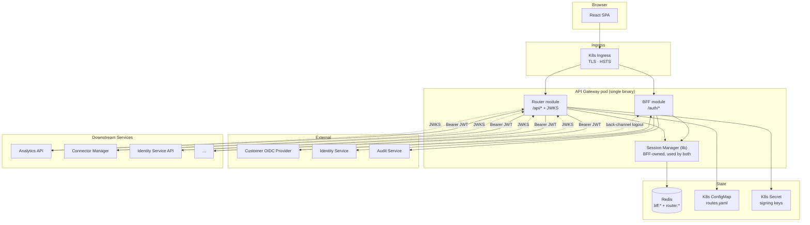
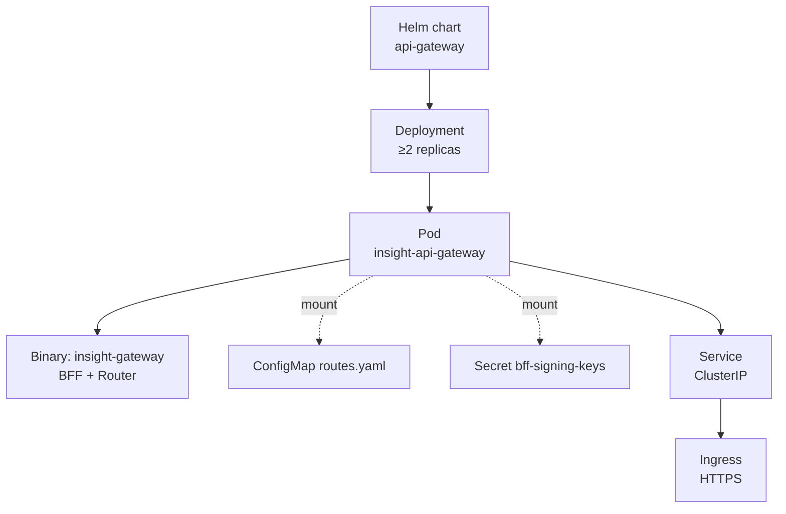

# DESIGN -- API Gateway

- [ ] `p3` - **ID**: `cpt-insightspec-design-gw`

<!-- toc -->

- [1. Architecture Overview](#1-architecture-overview)
- [2. Module Boundary](#2-module-boundary)
- [3. Shared Infrastructure](#3-shared-infrastructure)
- [4. Deployment Topology](#4-deployment-topology)
- [5. Cross-Cutting Concerns](#5-cross-cutting-concerns)
- [6. Traceability](#6-traceability)

<!-- /toc -->

---

## 1. Architecture Overview

The API Gateway is a single Rust binary built on cyberfabric-core ModKit. Two modules, one process, one TLS endpoint:

Detailed component models, sequence diagrams, and data models live in the module DESIGNs:

- [BFF DESIGN](./bff/DESIGN.md) -- session lifecycle, OIDC, Redis layout, gateway JWT contract.
- [Router DESIGN](./router/DESIGN.md) -- JWT mint, JWKS, route table, reverse proxy.

## 2. Module Boundary

| Concern | Owner | Notes |
|---|---|---|
| OIDC handshake | BFF | Router never talks to the IdP |
| Session create / refresh / revoke | BFF | Owns the Lua scripts |
| Cookie issue / clear | BFF | Router never sets cookies |
| CSRF token issue & verify on `/auth/*` | BFF | Router relies on `SameSite=Strict` for `/api/*` |
| IdP access-token refresh | BFF | Triggered on `/auth/refresh` |
| Cookie validation on `/api/*` | Router (read-only via shared session manager) | Calls into the BFF-owned library |
| Gateway JWT mint + sign | Router | EdDSA, claims defined in BFF DESIGN §3.8 |
| JWKS publication | Router | `/.well-known/jwks.json` |
| Reverse proxy `/api/*` | Router | Forwards with `Authorization: Bearer <jwt>` |
| Route table + hot reload | Router | ConfigMap-driven |
| Signing key store + rotation | Router | K8s Secret-driven |
| Session manager library | BFF | Used by Router as a Rust crate |

## 3. Shared Infrastructure

| Resource | Used by | Notes |
|---|---|---|
| Redis client | both | Single connection pool, multiplexed; `bff:*` keys vs `router:*` keys |
| Audit emitter | both | Single Redpanda producer; auth events from BFF, key-rotation and config-reload events from Router |
| Metrics registry | both | Single Prometheus endpoint at `/metrics`; metrics prefixed `bff_*` or `router_*` |
| Logger | both | Single structured-JSON logger with `correlation_id` |
| HTTP server | both | Single `axum` router; `/auth/*` to BFF, everything else to Router |
| Config | both | Helm values surface both modules' knobs in one place |

## 4. Deployment Topology

- [ ] `p3` - **ID**: `cpt-insightspec-topology-gw`

- One Helm chart, one Deployment, ≥2 replicas.
- Single ClusterIP Service; cluster Ingress is the only TLS terminator.
- Mounts: `K8s ConfigMap routes.yaml` (Router), `K8s Secret bff-signing-keys` (Router).
- Connects to Redis (cluster Service) and the K8s API for ConfigMap/Secret watch.
- Liveness probe: process up. Readiness probe: Redis reachable + signing keys loaded + non-empty route table + Identity Service reachable.

## 5. Cross-Cutting Concerns

### 5.1 Configuration Surface

Helm values that affect both modules:

| Value | Default | Description |
|---|---|---|
| `gateway.replicas` | 2 | Pod count |
| `gateway.image` | (chart) | Container image |
| `gateway.session_ttl_seconds` | 120 | Session cookie TTL (BFF) |
| `gateway.session_refresh_safety_margin_seconds` | 30 | `refresh_at = expires_at − safety_margin` returned to the SPA |
| `gateway.session_absolute_lifetime_seconds` | 28800 | Hard cap (BFF) |
| `gateway.jwt_ttl_seconds` | 120 | Gateway JWT TTL (Router); must be ≤300 |
| `gateway.websocket_max_lifetime_seconds` | 3600 | Hard cap on WebSocket connection lifetime (Router); bounds post-revoke staleness, see [Router DD-ROUTER-07](./router/DESIGN.md#dd-router-07-websocket-jwt-frozen-at-upgrade-time-bounded-by-max-lifetime) |
| `gateway.csrf_origins` | [] | Allowlist of acceptable `Origin` values for `/auth/*` mutations |
| `gateway.routes_configmap` | `gateway-routes` | ConfigMap with the route table |
| `gateway.signing_keys_secret` | `bff-signing-keys` | Secret with signing keys |
| `gateway.oidc.issuer_url` | (required) | Customer OIDC issuer |
| `gateway.oidc.client_id` | (required) | OIDC client ID |
| `gateway.oidc.client_secret` | (required) | OIDC client secret |

### 5.2 Observability

Metrics, logs, and audit events are described in each module's DESIGN. They share:

- One Prometheus endpoint, metric names prefixed `bff_*` or `router_*`.
- One structured-JSON log stream with `correlation_id` propagated across modules and into downstream calls.
- One audit topic in Redpanda, consumed by Audit Service.

### 5.3 Failure Handling

- Redis unreachable → 503 from `/api/*`, 401 from `/auth/*` mutations, readiness fails. No local cache, no degraded mode -- see [BFF DD-BFF-06](./bff/DESIGN.md#dd-bff-06-redis-outage--no-auth-fail-closed).
- Signing-key Secret missing → readiness fails, no requests served.
- Route ConfigMap invalid at startup → readiness fails. Invalid at runtime → keep current table, alert.
- IdP unreachable during login → 502 with retry-after; existing sessions continue to work until they need IdP refresh.

## 6. Traceability

- **Umbrella PRD**: [PRD.md](./PRD.md)
- **Module PRDs**: [BFF PRD](./bff/PRD.md), [Router PRD](./router/PRD.md)
- **Module DESIGNs**: [BFF DESIGN](./bff/DESIGN.md), [Router DESIGN](./router/DESIGN.md)
- **Parent**: [Backend PRD](../specs/PRD.md), [Backend DESIGN](../specs/DESIGN.md)
