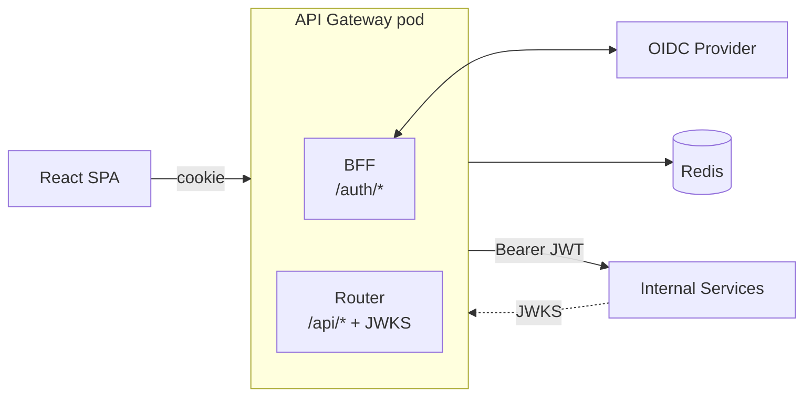

# PRD -- API Gateway

<!-- toc -->

- [1. Overview](#1-overview)
- [2. Composition](#2-composition)
- [3. Scope](#3-scope)
  - [3.1 In Scope](#31-in-scope)
  - [3.2 Out of Scope](#32-out-of-scope)
- [4. Shared Non-Functional Requirements](#4-shared-non-functional-requirements)
- [5. Public Surface](#5-public-surface)
- [6. Dependencies](#6-dependencies)
- [7. Related Documents](#7-related-documents)

<!-- /toc -->

## 1. Overview

The API Gateway is the single entry point between the Insight SPA and the rest of the backend. One Kubernetes pod, one TLS endpoint, one binary -- but two modules with separate concerns:

- **BFF** -- runs OIDC, owns the user session, exposes `/auth/*`.
- **Router** -- validates the cookie, mints the gateway JWT, routes `/api/*` to internal services, publishes JWKS.

This umbrella PRD describes only what is shared across the two modules. Each module has its own PRD and DESIGN with detailed requirements.

## 2. Composition

| Module | Path | Owns |
|---|---|---|
| BFF | [bff/](./bff/) | OIDC handshake, session lifecycle, session cookie, `/auth/*` API, CSRF, audit |
| Router | [router/](./router/) | Cookie validation (read-only), gateway JWT mint + cache, JWKS publication, route table, reverse proxy `/api/*`, header rewriting, hot config reload |

## 3. Scope

### 3.1 In Scope

Everything in [BFF PRD §4.1](./bff/PRD.md#41-in-scope) and [Router PRD §4.1](./router/PRD.md#41-in-scope), plus shared concerns covered here in §4.

### 3.2 Out of Scope

- A separate public API gateway for M2M / partner integrations -- future v2; would live next to this module, not inside it.
- Service mesh / sidecar deployment -- the gateway is the only auth-aware entry point.
- Authorization decisions (roles, scopes, license) -- each downstream service enforces its own policies. The gateway only carries identity.

## 4. Shared Non-Functional Requirements

The following NFRs apply to the whole gateway and are not duplicated in the module PRDs.

#### Single Pod, Single Binary

- [ ] `p1` - **ID**: `cpt-insightspec-nfr-gw-single-binary`

The BFF and Router **MUST** be packaged in one Rust binary and one Kubernetes Deployment. They **MUST** share the same TLS endpoint, the same Redis client, and the same metrics/logging/audit pipeline.

**Threshold**: One Helm chart, one image, one replica set.

**Rationale**: Avoids a network hop between auth and routing; lets the Router link to the BFF's session manager as a library; keeps operations simple.

#### HTTPS Enforcement and HSTS

- [ ] `p1` - **ID**: `cpt-insightspec-nfr-gw-https-only`

Every response from the gateway **MUST** be served over HTTPS at the ingress with `Strict-Transport-Security: max-age=31536000; includeSubDomains; preload`. Plain HTTP **MUST** be rejected at the ingress.

**Threshold**: Zero responses served over HTTP.

#### Stateless Horizontal Scaling

- [ ] `p1` - **ID**: `cpt-insightspec-nfr-gw-stateless`

The gateway **MUST** hold no per-user state in process memory. All session and JWT-cache state lives in Redis. Adding or removing a pod **MUST NOT** affect any active session.

**Threshold**: Killing any one pod does not log any user out.

#### End-to-End Latency Budget

- [ ] `p1` - **ID**: `cpt-insightspec-nfr-gw-latency`

Combined gateway overhead (BFF cookie validation + Router JWT mint-or-cache + proxy hop) **MUST** be ≤ 15 ms p95 under nominal load.

**Threshold**: 15 ms p95 added latency.

#### Fail Closed

- [ ] `p1` - **ID**: `cpt-insightspec-nfr-gw-fail-closed`

If Redis is unreachable, signing keys are missing, or the route table is empty, the gateway **MUST** return 503 and report not-ready to Kubernetes. It **MUST NOT** serve `/api/*` with stale state, no JWT, or guessed routes.

**Threshold**: Zero requests forwarded without a valid session and a valid signed JWT.

## 5. Public Surface

| Path | Owner | Purpose |
|---|---|---|
| `/auth/*` | BFF | Login, refresh, logout, session management, CSRF, OIDC back-channel |
| `/.well-known/jwks.json` | Router | Public keys for downstream JWT verification |
| `/api/**` | Router | Reverse-proxied to internal services with gateway JWT |
| `/healthz`, `/ready` | shared | Kubernetes probes |
| `/metrics` | shared | Prometheus scrape |

Detailed contracts:

- [BFF auth API contract](./bff/PRD.md#71-public-api-surface)
- [Router proxy and JWKS contracts](./router/PRD.md#71-public-api-surface)
- [Gateway JWT claim contract](./bff/DESIGN.md#38-gateway-jwt-claim-contract) -- defined by BFF, minted by Router, consumed by every downstream service.

## 6. Dependencies

| Dependency | Purpose | Used by |
|---|---|---|
| Redis | Session store, JWT cache | BFF + Router |
| Customer OIDC provider | Authentication, refresh, logout | BFF |
| Identity Service | Map IdP `sub` to internal `user_id` and `tenant_id` | BFF |
| Audit Service | Sink for auth events | BFF |
| Ingress / TLS terminator | HTTPS termination, HSTS, host routing | shared |
| K8s ConfigMap / Secret | Route table and signing keys | Router |
| Downstream services | Targets of `/api/*` forwarding; verify JWT via JWKS | Router |

## 7. Related Documents

- **Module PRDs**: [BFF](./bff/PRD.md), [Router](./router/PRD.md)
- **Module DESIGNs**: [BFF](./bff/DESIGN.md), [Router](./router/DESIGN.md)
- **Umbrella DESIGN**: [DESIGN.md](./DESIGN.md)
- **Parent**: [Backend PRD](../specs/PRD.md), [Backend DESIGN](../specs/DESIGN.md)
