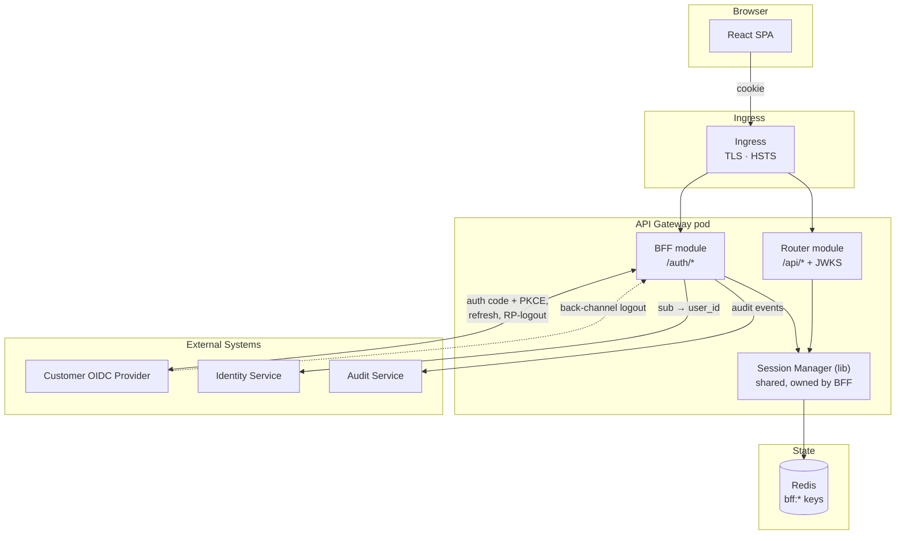
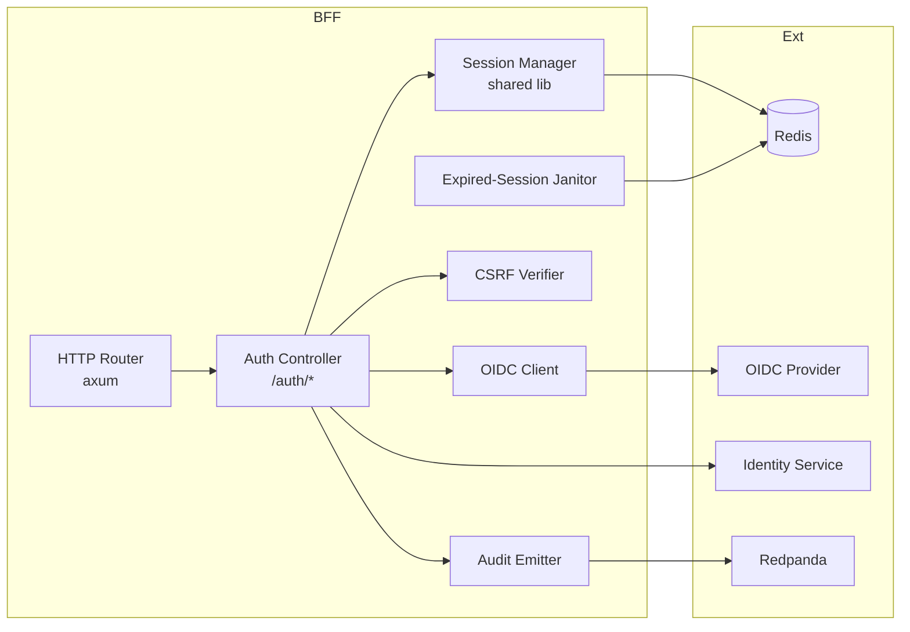
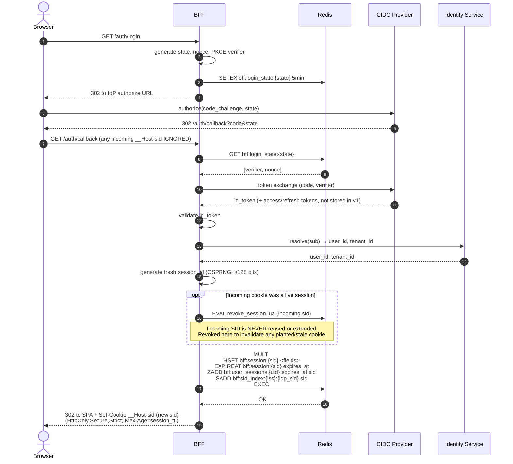
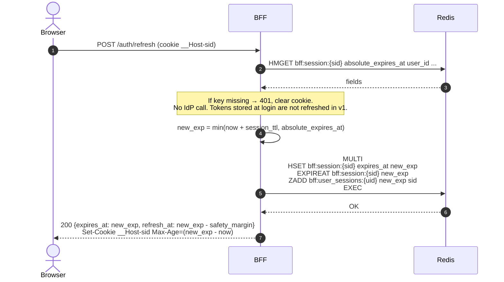
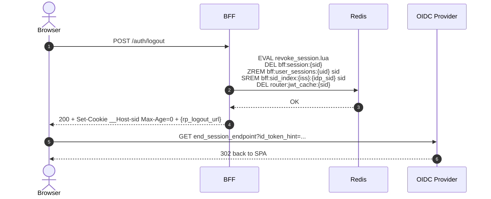
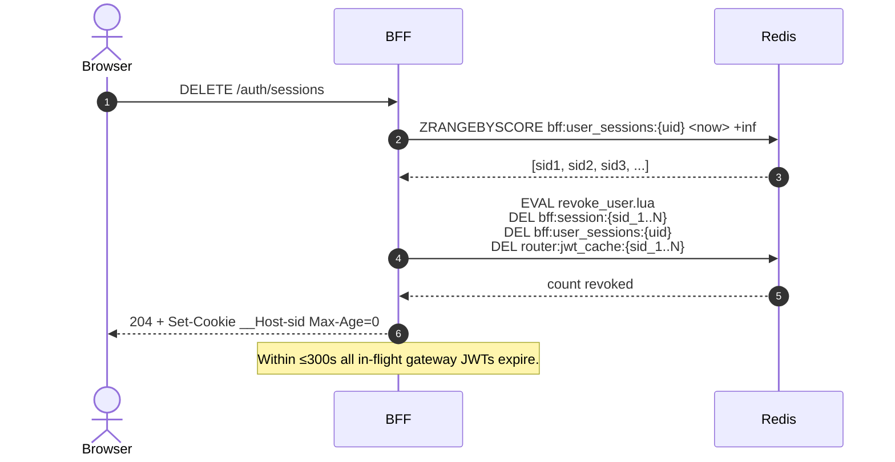
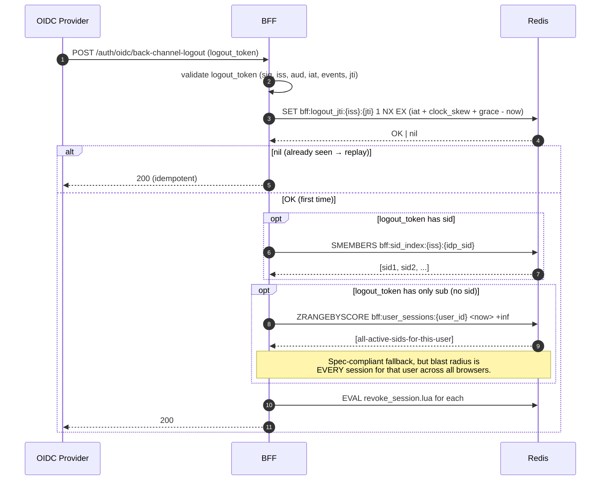
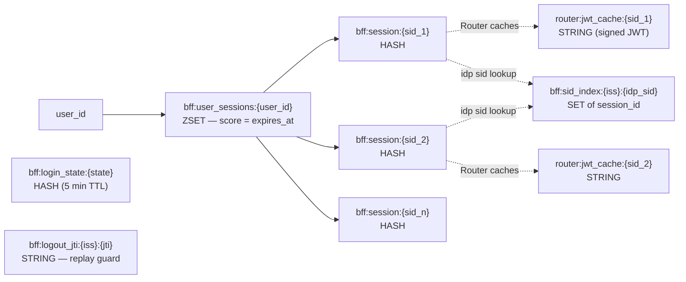
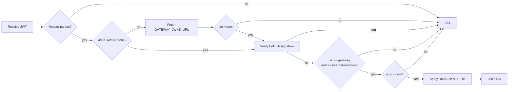
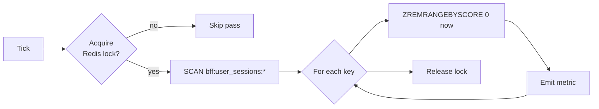

# DESIGN -- BFF (Backend-for-Frontend) Service

- [ ] `p3` - **ID**: `cpt-insightspec-design-bff`

<!-- toc -->

- [1. Architecture Overview](#1-architecture-overview)
  - [1.1 Architectural Vision](#11-architectural-vision)
  - [1.2 Architecture Drivers](#12-architecture-drivers)
  - [1.3 Architecture Layers](#13-architecture-layers)
- [2. Principles & Constraints](#2-principles--constraints)
  - [2.1 Design Principles](#21-design-principles)
  - [2.2 Constraints](#22-constraints)
- [3. Technical Architecture](#3-technical-architecture)
  - [3.1 Domain Model](#31-domain-model)
  - [3.2 Component Model](#32-component-model)
  - [3.3 API Contracts](#33-api-contracts)
  - [3.4 Internal Dependencies](#34-internal-dependencies)
  - [3.5 External Dependencies](#35-external-dependencies)
  - [3.6 Interactions & Sequences](#36-interactions--sequences)
  - [3.7 Database schemas & tables](#37-database-schemas--tables)
  - [3.8 Gateway JWT Claim Contract](#38-gateway-jwt-claim-contract)
  - [3.9 Boundary with the Router](#39-boundary-with-the-router)
- [4. Cross-Cutting Concerns](#4-cross-cutting-concerns)
  - [4.1 Cookie Hardening](#41-cookie-hardening)
  - [4.2 CSRF Defense](#42-csrf-defense)
  - [4.3 Janitor for Expired Sessions](#43-janitor-for-expired-sessions)
  - [4.4 Rate Limiting on `/auth/*`](#44-rate-limiting-on-auth)
  - [4.5 Observability](#45-observability)
- [5. Design Decisions](#5-design-decisions)
  - [DD-BFF-01: Opaque Session vs JWT Cookie](#dd-bff-01-opaque-session-vs-jwt-cookie)
  - [DD-BFF-02: Explicit Session Refresh, No Sliding TTL](#dd-bff-02-explicit-session-refresh-no-sliding-ttl)
  - [DD-BFF-03: ZSET (Not SET) for User-Session Index](#dd-bff-03-zset-not-set-for-user-session-index)
  - [DD-BFF-04: BFF-Prefixed Redis Keys](#dd-bff-04-bff-prefixed-redis-keys)
  - [DD-BFF-05: EdDSA Algorithm for Gateway JWT Contract](#dd-bff-05-eddsa-algorithm-for-gateway-jwt-contract)
  - [DD-BFF-06: Redis Outage = No Auth (Fail Closed)](#dd-bff-06-redis-outage--no-auth-fail-closed)
  - [DD-BFF-07: `/auth/refresh` Returns Next-Refresh Deadline](#dd-bff-07-authrefresh-returns-next-refresh-deadline)
  - [DD-BFF-08: `SameSite=Strict` Today, Pluggable Cookie Classes Later](#dd-bff-08-samesitestrict-today-pluggable-cookie-classes-later)
  - [DD-BFF-09: Janitor Coordinates via Redis Lock](#dd-bff-09-janitor-coordinates-via-redis-lock)
- [6. Traceability](#6-traceability)

<!-- /toc -->

---

## 1. Architecture Overview

### 1.1 Architectural Vision

The BFF is the auth half of the API Gateway. It owns the OIDC handshake, the session lifecycle, and the `/auth/*` API the SPA talks to. It does **not** mint gateway JWTs and does **not** proxy `/api/*` -- both belong to the sibling [Router](../router/DESIGN.md).

The browser-facing contract is small and explicit: one opaque session cookie with a short hard TTL, extended only by `POST /auth/refresh`. No sliding TTL, no implicit extension on activity. The SPA decides when the user is "active" by calling refresh on a cadence below the TTL.

All session state lives in Redis under the `bff:` key prefix. The BFF process is stateless beyond its config and JWT signing keys are not its concern.

The BFF is built on **cyberfabric-core ModKit** (same framework as the rest of the backend) and runs in the same pod as the Router.

### 1.2 Architecture Drivers

#### Functional Drivers

| Requirement | Design Response |
|---|---|
| `cpt-insightspec-fr-bff-oidc-login` | Confidential OIDC client with PKCE; tokens stored in Redis only |
| `cpt-insightspec-fr-bff-session-cookie` | `__Host-`-prefixed opaque session ID with short configurable TTL, set on `/auth/callback` |
| `cpt-insightspec-fr-bff-session-refresh` | `POST /auth/refresh` runs Lua script that extends `bff:session:{id}` and updates `ZADD` score |
| `cpt-insightspec-fr-bff-session-store` | `bff:session:{id}` HASH + `bff:user_sessions:{user_id}` ZSET with score = `expires_at` |
| `cpt-insightspec-fr-bff-session-list` | `ZRANGEBYSCORE bff:user_sessions:{uid} <now> +inf` |
| `cpt-insightspec-fr-bff-session-revoke` | Single Lua script removes session record(s), `ZREM` from index, and `DEL router:jwt_cache:{sid}` in one round-trip |
| `cpt-insightspec-fr-bff-gateway-jwt` | Claim contract owned here; minting performed by Router |
| `cpt-insightspec-fr-bff-logout` | `/auth/logout` for local + RP-initiated; `/auth/oidc/back-channel-logout` for IdP-initiated |
| `cpt-insightspec-fr-bff-csrf` | Double-submit token bound to session ID + `Origin` allowlist |

#### NFR Allocation

| NFR | Component | Verification |
|---|---|---|
| `cpt-insightspec-nfr-bff-https-only` | Ingress + middleware reject plain HTTP; HSTS header set globally | Curl over HTTP returns 308/400; `Strict-Transport-Security` present on every response |
| `cpt-insightspec-nfr-bff-session-lookup-p95` | Redis pipelined HMGET; no extra DB call on hot path | Load test, measure p95 |
| `cpt-insightspec-nfr-bff-session-ttl` | `session_ttl` and `absolute_lifetime` from Helm values; cookie `Max-Age` and Redis TTL match | Integration test sets TTLs; verify cookie + Redis expire together |
| `cpt-insightspec-nfr-bff-jwt-algorithm` | EdDSA-only contract on the JWT minted by the Router | Reject any non-EdDSA token in downstream verification tests |
| `cpt-insightspec-nfr-bff-cookie-attrs` | Single `set_session_cookie` helper; fail-closed if attribute set incomplete | Snapshot test on `Set-Cookie` headers |
| `cpt-insightspec-nfr-bff-audit` | Auth events published to Redpanda topic consumed by Audit Service | Integration test verifies event emission per auth action |

#### Architecture Decision Records

ADRs to be authored alongside implementation; decisions captured inline in §5 (Design Decisions) until then:

- Opaque server-side session, not JWT, for the browser-facing cookie -- see DD-BFF-01.
- Session TTL extended only by explicit `POST /auth/refresh` -- see DD-BFF-02.
- ZSET (not SET) for `bff:user_sessions:*` -- see DD-BFF-03.

### 1.3 Architecture Layers



| Layer | Responsibility | Technology |
|---|---|---|
| Edge | TLS termination, HSTS, host routing | K8s ingress |
| Auth | OIDC handshake, session lifecycle, CSRF, `/auth/*` API | ModKit + `openidconnect` Rust crate |
| State | Sessions, user-sessions ZSET, login state, sid index | Redis (cluster mode optional) |
| Sibling | Gateway JWT mint + JWKS + `/api/*` proxy | [Router](../router/DESIGN.md) |

- [ ] `p3` - **ID**: `cpt-insightspec-tech-bff`

## 2. Principles & Constraints

### 2.1 Design Principles

#### Opaque to the browser

- [ ] `p2` - **ID**: `cpt-insightspec-principle-bff-opaque-cookie`

The browser only ever sees an opaque session ID. No JWTs, no IdP tokens, no claims. A stolen cookie buys access only on this host until the next TTL boundary.

#### Explicit refresh, no sliding TTL

- [ ] `p2` - **ID**: `cpt-insightspec-principle-bff-explicit-refresh`

The session TTL is short and hard. Extension only happens via `POST /auth/refresh`, called by the SPA on a fixed cadence. Regular API traffic never extends the session. This keeps the model simple, predictable, and easy to reason about.

#### Stateless service, stateful store

- [ ] `p2` - **ID**: `cpt-insightspec-principle-bff-stateless`

The BFF process holds no session state. Any pod can serve any request. All session state goes through Redis.

#### Fail closed on auth

- [ ] `p2` - **ID**: `cpt-insightspec-principle-bff-fail-closed`

If Redis is unreachable, the cookie is malformed, the session is past its absolute cap, or the IdP rejects a refresh -- return 401 and clear the cookie. Never serve a request with a guess.

### 2.2 Constraints

#### First-party cookie domain

- [ ] `p2` - **ID**: `cpt-insightspec-constraint-bff-same-domain`

The SPA and the gateway must be served from the same registrable domain. `__Host-` forbids `Domain=` and pins the cookie to one host.

#### OIDC provider feature set

- [ ] `p2` - **ID**: `cpt-insightspec-constraint-bff-oidc-features`

Customer IdP must support: authorization code with PKCE, refresh tokens, RP-initiated logout, and OIDC back-channel logout.

## 3. Technical Architecture

### 3.1 Domain Model

| Entity | Purpose | Storage |
|---|---|---|
| `Session` | Active browser session for one user on one device | Redis HASH `bff:session:{id}` |
| `UserSessionIndex` | All session IDs for one user, scored by expiry | Redis ZSET `bff:user_sessions:{user_id}` |
| `SidIndex` | Map (OIDC issuer, OIDC sid) → local session IDs | Redis SET `bff:sid_index:{iss}:{idp_sid}` |
| `LoginState` | Per-login transient state (PKCE verifier, nonce) | Redis HASH `bff:login_state:{state}`, TTL 5 min |

Relationships:
- `User` (owned by Identity Service) → 0..N `Session`
- `Session` → 1 `User`
- `Session` → 0..1 entry in `SidIndex` (only if IdP supplies `sid`)

### 3.2 Component Model



#### Auth Controller

- [ ] `p2` - **ID**: `cpt-insightspec-component-bff-auth-controller`

##### Why this component exists
The single owner of every endpoint under `/auth/*` -- the only place where session state changes start. Without it, session creation, refresh, and revocation would be scattered across the codebase.

##### Responsibility scope
Login start, OIDC callback, session refresh, logout, session list / revoke (single + all), back-channel logout receiver, CSRF token issuance, `/auth/me`.

##### Responsibility boundaries
Does not authorize business operations -- downstream services do that. Does not own user data -- Identity Service does. Does not mint gateway JWTs or proxy `/api/*` -- the Router does.

##### Related components (by ID)
- `cpt-insightspec-component-bff-session-manager` -- creates / reads / refreshes / revokes sessions.
- `cpt-insightspec-component-bff-oidc-client` -- runs the OIDC handshake.
- `cpt-insightspec-component-bff-csrf-verifier` -- issues and checks CSRF tokens.
- `cpt-insightspec-component-bff-audit-emitter` -- publishes auth events.

#### Session Manager (shared library)

- [ ] `p2` - **ID**: `cpt-insightspec-component-bff-session-manager`

##### Why this component exists
The single entry point for every read or write of session state. Centralising Redis access here keeps atomicity guarantees and metrics uniform, and lets the Router link to the same code as a library for read-only session validation.

##### Responsibility scope
Create, read, refresh, list-by-user, revoke (single, all-but-current, all). Keeps `bff:session:*` and `bff:user_sessions:*` consistent using the cheapest Redis primitive that meets the atomicity requirement of each op:

- **Create** — single `MULTI`/`EXEC` pipeline (`HSET` + `EXPIREAT` + `ZADD` + `SADD`). No conditional logic, no read-then-write, so no Lua. See §3.6 Login.
- **Refresh** — single `HMGET` + `MULTI`/`EXEC` pipeline (`HSET expires_at` + `EXPIREAT` + `ZADD`). Parallel refreshes converge on the same `new_exp` ±1 s — no CAS, no lock. See §3.6 Session Refresh.
- **Revoke single / revoke user** — atomicity mechanism documented per-op in §3.6. (Specifics under review.)

##### Responsibility boundaries
Does not call the OIDC provider. Does not authenticate requests by itself -- callers (Auth Controller, Router) do. Does not own the cookie format.

##### Related components (by ID)
- `cpt-insightspec-component-bff-auth-controller` -- primary writer.
- `cpt-insightspec-component-router-auth` (Router-side) -- read-only consumer.

#### OIDC Client

- [ ] `p2` - **ID**: `cpt-insightspec-component-bff-oidc-client`

##### Why this component exists
Encapsulates the OIDC protocol so the rest of the BFF treats it as a small set of operations: authorize, exchange, refresh, end-session, validate logout token.

##### Responsibility scope
Authorization code + PKCE flow, ID token validation (`iss`, `aud`, `nonce`, `exp`, signature), RP-initiated logout, back-channel logout token validation per OIDC spec. v1 does not call the IdP refresh-token endpoint -- access tokens are not stored or used inside the gateway.

##### Responsibility boundaries
Does not store sessions. Does not maintain user-side state. Holds no IdP tokens beyond the lifetime of one operation.

##### Related components (by ID)
- `cpt-insightspec-component-bff-auth-controller` -- only caller.
- `cpt-insightspec-component-bff-session-manager` -- recipient of the tokens that result from each OIDC operation.

#### CSRF Verifier

- [ ] `p2` - **ID**: `cpt-insightspec-component-bff-csrf-verifier`

##### Why this component exists
Provides defence-in-depth on top of `SameSite=Strict` for state-changing `/auth/*` methods.

##### Responsibility scope
Issue per-session CSRF tokens at login (and rotate on privilege change), constant-time compare them on POST/PUT/PATCH/DELETE, fall back to verifying `Origin` against the allowlist when no token is present.

##### Responsibility boundaries
Does not protect `/api/*` -- those rely on `SameSite=Strict` and the ingress. Does not store the token outside the session record.

##### Related components (by ID)
- `cpt-insightspec-component-bff-auth-controller` -- consumer.
- `cpt-insightspec-component-bff-session-manager` -- holds `csrf_token` inside `bff:session:*`.

#### Audit Emitter

- [ ] `p2` - **ID**: `cpt-insightspec-component-bff-audit-emitter`

##### Why this component exists
Centralises audit event publication so every auth-relevant action lands on the Redpanda topic with the same envelope and correlation fields.

##### Responsibility scope
Publish auth events (login OK / fail, refresh OK / fail, logout, IdP-refresh-fail, revoke single / all / admin, back-channel logout) to the audit topic consumed by Audit Service.

##### Responsibility boundaries
Does not run audit policy or retention -- Audit Service does. Does not log to disk -- the standard logger does.

##### Related components (by ID)
- `cpt-insightspec-component-bff-auth-controller` -- only caller.

#### Expired-Session Janitor

- [ ] `p2` - **ID**: `cpt-insightspec-component-bff-janitor`

##### Why this component exists
Per-session Redis TTL removes the record itself, but the user-index ZSET still lists the expired `session_id` until it is explicitly removed. Without the janitor, the index grows unbounded for users who never log out.

##### Responsibility scope
Periodic pass that elects one pod via a Redis lock, scans `bff:user_sessions:*`, and trims expired members with `ZREMRANGEBYSCORE`. Emits backlog and removed-count metrics.

##### Responsibility boundaries
Does not delete session records (they expire on their own). Does not run on every BFF pod simultaneously -- one elected pod per pass.

##### Related components (by ID)
- `cpt-insightspec-component-bff-session-manager` -- shares the same key conventions; janitor reads only.

### 3.3 API Contracts

- [ ] `p2` - **ID**: `cpt-insightspec-design-bff-auth-api-spec`

This section specifies the implementation of the auth API declared in [PRD §7.1](./PRD.md#71-public-api-surface) (`cpt-insightspec-interface-bff-auth-api`).

- **Contracts**: `cpt-insightspec-contract-bff-gateway-jwt`, `cpt-insightspec-contract-bff-oidc`, `cpt-insightspec-contract-bff-jwks-url`
- **Technology**: REST / OpenAPI 3.1
- **Location**: [openapi.yaml](./openapi.yaml) -- to be authored alongside implementation

| Method | Path | Auth | Description | Stability |
|---|---|---|---|---|
| GET | `/auth/login` | none | Start OIDC flow; 302 to IdP | stable |
| GET | `/auth/callback` | none | OIDC redirect target; sets session cookie | stable |
| POST | `/auth/refresh` | session | Extend session TTL, re-issue cookie | stable |
| POST | `/auth/logout` | session | Revoke current session, clear cookie, return RP-logout URL | stable |
| GET | `/auth/me` | session | Return current user and tenant | stable |
| GET | `/auth/sessions` | session | List active sessions for current user | stable |
| DELETE | `/auth/sessions/{id}` | session | Revoke a specific session | stable |
| DELETE | `/auth/sessions` | session | Revoke all sessions of current user | stable |
| POST | `/auth/oidc/back-channel-logout` | OIDC `logout_token` | IdP-initiated logout receiver | stable |
| GET | `/auth/csrf` | session | Issue CSRF token for the session | stable |

JWKS and `/api/*` reverse proxy live in the [Router](../router/DESIGN.md), not here.

### 3.4 Internal Dependencies

| Dependency | Interface | Purpose |
|---|---|---|
| Identity Service | REST (SDK client) | Resolve IdP `sub` → internal `user_id` and `tenant_id` |
| Audit Service | Redpanda producer | Publish auth events |
| Router (sibling) | Shared Redis (direct DEL of `router:jwt_cache:*`) | Invalidate cached gateway JWTs on session revoke. No RPC, no Redpanda -- both modules share the same Redis client. |

### 3.5 External Dependencies

| System | Protocol | Purpose |
|---|---|---|
| Customer OIDC provider | OIDC 1.0 (HTTPS) | Login, refresh, RP-initiated logout, back-channel logout |
| Redis | RESP (TCP/TLS) | Session store + user-sessions index |

### 3.6 Interactions & Sequences

#### Login (OIDC Authorization Code + PKCE)

**ID**: `cpt-insightspec-seq-bff-login`

**Use cases**: `cpt-insightspec-usecase-bff-login`



**Session-fixation guard.** Any `__Host-sid` value present on the incoming `/auth/callback` request is treated as untrusted and **never** carried into the new session. The new `session_id` is generated server-side from a CSPRNG and bears no relation to any browser-supplied value. If the incoming cookie happens to map to a live session in Redis, that session is revoked first so an attacker who planted a known SID cannot recover it after the victim logs in. `__Host-` prefix prevents subdomain-injection on the same host, but cannot prevent a wildcard parent-domain ingress from setting cookies; the explicit revoke + regenerate covers that case.

#### Session Refresh

**ID**: `cpt-insightspec-seq-bff-refresh`

**Use cases**: `cpt-insightspec-usecase-bff-refresh`



**Concurrency.** Parallel refreshes from the same SPA (tab restored + timer fires) both write the same `new_exp` (within ±1 s clock skew). Both writes are idempotent on `(expires_at, ZSET score)`; last writer wins by ≤1 s, the cookie value (`session_id`) is unchanged, the user stays logged in. No CAS, no lock.

**Cap behaviour.** Once the rolling `new_exp` reaches `absolute_expires_at`, the `min()` clamps it. After that point, EXPIREAT may set a past timestamp, which Redis treats as immediate eviction — the next request finds the key gone and returns 401, exactly as intended.

**Why no IdP call.** The BFF stores `id_token` at login (used by `/auth/logout` for `id_token_hint`) but does not store IdP access/refresh tokens. v1 never calls IdP-protected APIs on the user's behalf, so there is nothing to refresh. If a v2 feature needs fresh IdP tokens, it will be added as a separate concern (in-process event with Redis-backed dedup), not coupled into `/auth/refresh`.

#### Logout -- Local + RP-Initiated

**ID**: `cpt-insightspec-seq-bff-logout`



#### Logout Everywhere

**ID**: `cpt-insightspec-seq-bff-logout-all`

**Use cases**: `cpt-insightspec-usecase-bff-logout-everywhere`



#### Back-Channel Logout from IdP

**ID**: `cpt-insightspec-seq-bff-back-channel-logout`



**`jti` replay protection.** Every accepted `logout_token` is recorded as `bff:logout_jti:{iss}:{jti}` with a Redis `SET ... NX` (set-if-not-exists). On collision the request is treated as a replay and short-circuits to `200` without performing any revoke -- the IdP gets the same idempotent answer it would for a successful first delivery, but no session work happens. TTL on the key is `(iat + max_clock_skew + grace) - now` (defaults: `max_clock_skew = 60s`, `grace = 60s`). After the TTL the JTI may legitimately be reused by the IdP (extremely rare in practice but cheap to allow).

**`(iss, sub)` fallback blast radius.** When the IdP issues a `logout_token` carrying `sub` only (no `sid`), spec-compliant behaviour is to revoke every active session for that user across every browser. We do that, but operators **MUST** be aware: a misconfigured IdP that omits `sid` will turn every back-channel logout into a "log out everywhere" event, with no way for the BFF to tell the difference. Documented in [Risks](./PRD.md#12-risks).

### 3.7 Database schemas & tables

- [ ] `p3` - **ID**: `cpt-insightspec-db-bff-redis`

This module's "database" is Redis. The schema below describes the keyspace.

All BFF-owned keys carry the `bff:` prefix. The Router owns one prefix (`router:`) for its JWT cache; cross-references between the two are explicit.



#### Key: `bff:session:{session_id}`

**Type**: Redis HASH

| Field | Type | Description |
|---|---|---|
| `user_id` | String | Internal user identifier |
| `tenant_id` | String | Tenant the user logged into |
| `idp_iss` | String | OIDC issuer URL |
| `idp_sub` | String | OIDC subject |
| `idp_sid` | String | OIDC `sid` claim (for back-channel logout) |
| `id_token` | String | OIDC `id_token` from initial exchange. Used as `id_token_hint` on RP-initiated logout. Not refreshed in v1; eventual staleness tolerated by most IdPs. |
| `created_at` | Int (epoch s) | Session creation time |
| `expires_at` | Int (epoch s) | Current session expiry; advanced by `/auth/refresh`. Mirror of the key's Redis TTL, kept here so `/auth/sessions` can list all active sessions and their expiries from one HMGET batch without an extra `EXPIRETIME` per key. |
| `absolute_expires_at` | Int (epoch s) | Hard cap; cannot be extended past this. Enforced in `/auth/refresh` by `min(now + session_ttl, absolute_expires_at)`. |
| `user_agent` | String | Captured at login |
| `ip` | String | Captured at login |
| `csrf_token` | String | CSRF token bound to this session |

**Redis TTL**: matches `expires_at`. Re-set on every refresh.

#### Key: `bff:user_sessions:{user_id}`

**Type**: Redis ZSET

**Member**: `session_id`

**Score**: `expires_at` (epoch seconds)

**Why ZSET, not SET**:

- `ZRANGEBYSCORE bff:user_sessions:{uid} <now> +inf` returns active sessions (for `/auth/sessions`).
- `ZRANGEBYSCORE bff:user_sessions:{uid} 0 <now>` returns expired ones (for the janitor).
- `ZREMRANGEBYSCORE bff:user_sessions:{uid} 0 <now>` cleans them in one call.

**Maintenance**: Mutated together with `bff:session:*` in a single MULTI/EXEC pipeline (create, refresh) or in a per-op atomicity model documented in §3.6 (revoke).

#### Key: `bff:sid_index:{iss}:{idp_sid}`

**Type**: Redis SET

**Members**: `session_id` strings

**Purpose**: Resolve OIDC back-channel `logout_token` (`iss` + `sid`) to local sessions. SET is sufficient -- no expiry-based queries needed; entries are removed on session revoke.

#### Key: `bff:login_state:{state}`

**Type**: Redis HASH

**Fields**: `pkce_verifier`, `nonce`, `redirect_to`

**TTL**: 5 minutes. One-shot -- deleted on callback.

#### Key: `bff:logout_jti:{iss}:{jti}`

**Type**: Redis STRING (value: `1`, semantically a presence flag).

**Purpose**: Replay protection for OIDC back-channel `logout_token`. Set with `NX` on first valid delivery; subsequent deliveries with the same `(iss, jti)` short-circuit to a `200` without performing any revoke.

**TTL**: `(iat + max_clock_skew + grace) - now` (defaults: `max_clock_skew = 60s`, `grace = 60s`). After TTL the `jti` may legitimately be reissued by the IdP.

#### Note on `router:jwt_cache:{session_id}`

Owned by the Router, not by the BFF. The BFF deletes these keys as part of revoke operations to invalidate cached gateway JWTs immediately. See [Router DESIGN §3.4](../router/DESIGN.md#34-redis-keys-read-only-and-jwt-cache).

### 3.8 Gateway JWT Claim Contract

- [ ] `p2` - **ID**: `cpt-insightspec-design-bff-jwt-claim-spec`

This section is the technical specification for the contract `cpt-insightspec-contract-bff-gateway-jwt` declared in [PRD §7.2](./PRD.md#72-external-integration-contracts). The BFF defines the contract; the Router mints; downstream services verify.

**Header**:

```json
{
  "alg": "EdDSA",
  "typ": "JWT",
  "kid": "<key id from JWKS>"
}
```

**Required JWT claims (RFC 7519)**:

| Claim | Type | Description |
|---|---|---|
| `iss` | String | `https://<gateway-host>/` |
| `aud` | String | `internal-services` |
| `sub` | String | Internal `user_id` |
| `iat` | Int | Issued at (epoch seconds) |
| `exp` | Int | `iat + 60..300` |
| `jti` | String | UUID v7 -- traceable, monotonic |

**Insight custom claims**:

| Claim | Type | Description |
|---|---|---|
| `tid` | String | `tenant_id` |
| `sid` | String | BFF session ID (opaque to downstream, used for tracing only) |

**Out of scope for v1**: `lic`, `roles`, `scopes`. Authorization is performed inside each downstream service against its own data sources. These claims may be added in a later major version of the contract.

**JWKS distribution**: each downstream service is configured (Helm value `gateway.jwks_url`, env `GATEWAY_JWKS_URL`) with the absolute URL of the gateway's JWKS endpoint. Services fetch on startup, cache for 1 h, and re-fetch on unknown `kid`. There is no service discovery; the URL is explicit.

**Verification at downstream**:



### 3.9 Boundary with the Router

| Concern | Owner | Notes |
|---|---|---|
| OIDC handshake | BFF | Router never talks to the IdP |
| Session create / refresh / revoke | BFF | Owns the Lua scripts |
| Cookie issue / clear | BFF | Router never sets cookies |
| CSRF token issue | BFF | Router enforces nothing CSRF-related on `/api/*` (relies on `SameSite=Strict`) |
| IdP access-token refresh | _(not in v1)_ | Tokens stored at login are not refreshed; v1 never calls IdP-protected APIs on the user's behalf. |
| Gateway JWT mint + sign | Router | Reads claims from session via shared session manager |
| JWKS publication | Router | Endpoint `/.well-known/jwks.json` |
| Reverse proxy `/api/*` | Router | Forwards with `Authorization: Bearer <jwt>` |
| Session manager library | BFF | Used by Router as a Rust crate |
| `bff:*` Redis keys | BFF | Router has read-only access to `bff:session:*` |
| `router:jwt_cache:*` Redis keys | Router | BFF deletes them as part of revoke |

## 4. Cross-Cutting Concerns

### 4.1 Cookie Hardening

A single helper sets every session cookie. Attributes are hard-coded in code, only `Max-Age` is from config:

- Name: `__Host-sid` (forces Secure + Path=/ + no Domain).
- `HttpOnly`.
- `Secure`.
- `SameSite=Strict`.
- `Path=/`.
- `Max-Age` = configured `session_ttl` (default 120 s) or `0` for clears.

A unit test asserts the exact `Set-Cookie` header for set and clear cases. Any other code path setting cookies fails review.

### 4.2 CSRF Defense

Primary: `SameSite=Strict`.

Secondary, on POST/PUT/PATCH/DELETE on `/auth/*`:

1. Read `X-CSRF-Token` header.
2. Compare against `session.csrf_token` (constant-time).
3. If absent or mismatched, check `Origin` against the configured SPA origin allowlist.
4. If both fail, return 403.

**Rotation cadence.** The CSRF token is generated once per session, on login (`/auth/callback`). It is **not** rotated on every refresh -- the cookie SID rotation already isolates the post-login session from any pre-login attacker state, and the CSRF token is bound to the session record, so it dies with the session. We deliberately do **not** rotate on "privilege change" today: the BFF's claim contract carries only `sub`, `tid`, `sid` (no `roles`/`license`/`scopes` in v1), and the BFF receives no privilege-change events from Identity Service. If a future version adds richer claims plus a notification channel, this section is the place to add a per-session bump on those events.

**Empty `csrf_origins`.** When `gateway.csrf_origins` is left empty (default), the `Origin` fallback never matches and any state-changing `/auth/*` request without a valid `X-CSRF-Token` is rejected with `403`. This is intentional fail-closed behaviour. Operators who set `csrf_origins` opt into a more permissive mode where `Origin` alone is sufficient on requests that legitimately drop the CSRF header.

**SPA contract.** The SPA fetches the CSRF token once via `GET /auth/csrf` after login (or on receiving a `403` with `WWW-Authenticate: csrf-required`) and caches it for the rest of the session. `/auth/me` echoes the same token so a fresh SPA load can prime the cache without an extra round-trip.

### 4.3 Janitor for Expired Sessions

A background task on every BFF pod (one elected leader via Redis lock) runs every `janitor_interval` seconds (default 30 s):

1. `SCAN MATCH bff:user_sessions:*` to enumerate user index keys.
2. For each, `ZREMRANGEBYSCORE key 0 <now>` to drop expired entries.
3. Emit `bff_janitor_removed_total` metric and `bff_janitor_backlog_size` (entries removed in last pass).

Per-session Redis TTL on `bff:session:{id}` already removes the record itself. The janitor exists only to keep the index clean so `/auth/sessions` and revoke-all stay fast.



### 4.4 Rate Limiting on `/auth/*`

Two layers, both in-process (axum middleware), both fail-closed on Redis loss:

1. **Per-IP token bucket** on `/auth/login`, `/auth/callback`, `/auth/refresh`. Backed by a fixed-window counter in Redis (`bff:rl:auth:{ip}`, TTL = window). Default: `10 req/min` (`auth_rate_per_ip`) with burst `20` (`auth_burst_per_ip`). Helm-tunable.
2. **Global cap on active login attempts.** A counter (`bff:rl:login_state_count`) tracks the number of live `bff:login_state:*` entries. `/auth/login` increments-and-checks; if the count exceeds `auth_login_state_max` (default `1000` per pod), the request is rejected `429` before any Redis HASH is written. Counter is decremented on successful callback or on key expiry (via a Redis keyspace notification listener; if notifications are not enabled the counter drifts down via the janitor's reconcile pass).

Both layers run before any expensive work (Redis HASH write, IdP redirect, token exchange). Both emit metrics so alerts can fire on sustained pressure.

**Why not just rely on the ingress.** The cluster ingress can rate-limit by IP, but the *global* cap on login-state entries is BFF-specific data the ingress cannot see. The two layers compose: ingress catches the volumetric flood; the BFF catches the slower-trickle Redis-exhaustion attack.

### 4.5 Observability

Metrics (Prometheus):

- `bff_auth_login_total{result}` -- ok / fail / state_mismatch
- `bff_auth_refresh_total{result}` -- ok / expired / past_cap / idp_fail
- `bff_session_active` -- gauge from periodic Redis sample
- `bff_session_lookup_duration_seconds` -- histogram
- `bff_back_channel_logout_total{result}`
- `bff_janitor_removed_total`
- `bff_janitor_backlog_size`

Logs (structured JSON): every auth event with `correlation_id`, `session_id` (hashed), `user_id`, `tenant_id`. Never log cookies, raw tokens, or refresh tokens.

Audit (via Audit Service): login OK, login fail, refresh, logout, revoke (single / all / admin), back-channel logout.

## 5. Design Decisions

### DD-BFF-01: Opaque Session vs JWT Cookie

**Decision**: Opaque session ID + Redis lookup, not a cookie-borne JWT.

**Why**:
- Revocation must be instant (offboarding, suspected compromise) -- only possible with a server-side store.
- Opaque IDs leak less on theft -- they only work on this host, not as a portable bearer.
- Cookie size stays tiny.

**Consequences**: Hard dependency on Redis. No local cache, no degraded mode (see DD-BFF-06).

### DD-BFF-02: Explicit Session Refresh, No Sliding TTL

**Decision**: Session TTL is short and hard. Only `POST /auth/refresh` extends it.

**Why**:
- Sliding TTL on every API call requires a Redis write on the hot path. Explicit refresh moves writes off the hot path.
- The SPA already knows when the user is active; making refresh explicit gives it control and keeps the BFF predictable.
- Hard TTL bounds the window for stolen-cookie reuse.

**Consequences**: SPA must implement a refresh loop. Documented as part of the SPA contract; the BFF returns 401 on expiry, and the SPA redirects to `/auth/login`.

### DD-BFF-03: ZSET (Not SET) for User-Session Index

**Decision**: `bff:user_sessions:{user_id}` is a Redis sorted set with score = `expires_at`.

**Why**:
- Plain SET cannot answer "which of these sessions are expired" without reading every member's record.
- ZSET makes both "active sessions" and "expired entries" O(log N) lookups via `ZRANGEBYSCORE`.
- Janitor cleanup is a single `ZREMRANGEBYSCORE` per user.

**Consequences**: Slightly more Redis memory per entry (score + element vs element only). Negligible at our scale.

### DD-BFF-04: BFF-Prefixed Redis Keys

**Decision**: Every Redis key owned by the BFF starts with `bff:`. Router uses `router:`. Future modules pick their own prefix.

**Why**:
- Single Redis instance is shared across modules. Owner-prefixed names eliminate collisions.
- Operators reading Redis keys can identify the owner from the prefix.
- Migration of one module's data is a single prefix scan.

**Consequences**: Slightly longer keys. Worth it.

### DD-BFF-05: EdDSA Algorithm for Gateway JWT Contract

**Decision**: The gateway JWT contract mandates EdDSA (Ed25519). No other algorithms.

**Why**:
- Small signatures (~64 bytes) keep header size down.
- Fast verification (~10× faster than RS256).
- Single private/public key pair, no padding choices.

**Consequences**: Verifier libraries in downstream services must support EdDSA. Documented as a constraint on adding new downstream services.

### DD-BFF-06: Redis Outage = No Auth (Fail Closed)

**Decision**: When Redis is unreachable, the BFF returns 401 on `/auth/*` mutations and 503 on the readiness probe. There is no local in-memory session cache and no degraded read-only mode.

**Why**:
- A local cache is expensive to keep coherent across pods -- a revoke on pod A would have to invalidate the cache on every other pod.
- Coherent session state is the whole reason we keep sessions in Redis. A "best-effort" local cache contradicts that.
- The Router also fails closed on Redis loss, so a degraded mode in the BFF would not actually let users do anything useful.

**Consequences**: Redis availability is the auth availability. HA Redis is mandatory in the production Helm values; documented in the operator runbook.

### DD-BFF-07: `/auth/refresh` Returns Next-Refresh Deadline

**Decision**: `POST /auth/refresh` returns `200` with a JSON body:

```json
{
  "expires_at": 1714320120,
  "refresh_at": 1714320060
}
```

`expires_at` is the absolute moment the session will expire if not refreshed again. `refresh_at` is the recommended next-refresh moment (`expires_at - safety_margin`, default `safety_margin` = 30 s, configurable).

**Why**:
- The SPA needs to know when to call refresh next; computing it client-side from `Max-Age` plus a hard-coded fudge factor is fragile and silently goes wrong if the operator changes `session_ttl`.
- A server-supplied deadline lets the operator tune the cadence without an SPA change.

**Consequences**: SPA implements a single timer `setTimeout(refresh, refresh_at - now)`. On 401, it redirects to `/auth/login`. The same body is returned by `/auth/me` so the SPA can prime the timer at startup.

### DD-BFF-08: `SameSite=Strict` Today, Pluggable Cookie Classes Later

**Decision**: The session cookie stays `SameSite=Strict` for v1. We accept the deep-link drawback (external links land users on the login page).

**Why**:
- Strict gives the strongest CSRF baseline.
- Mixing a Lax companion cookie now would complicate revoke / refresh logic for marginal UX gain at this stage.

**Future**: When we have a real need (e.g. shareable dashboard links, embedded views, or a public read-only token class), we'll introduce a second cookie class with its own attributes and lifecycle, kept separate from the primary session.

### DD-BFF-09: Janitor Coordinates via Redis Lock

**Decision**: A single distributed Redis lock (`bff:lock:janitor`, TTL slightly longer than the pass interval) elects one pod per pass. No external CronJob.

**Why**:
- One process inside the BFF binary keeps deployment simple -- no extra K8s object to manage or version.
- Redis is already a hard dependency; reusing it for coordination adds no new failure mode.
- Pass interval (default 30 s) is short enough that a missed pass costs little.

**Consequences**: Pod with the lock takes the work; others skip. Backlog metric alerts if no pod runs the pass for more than `2 × interval`.

## 6. Traceability

- **PRD**: [PRD.md](./PRD.md)
- **Sibling**: [Router PRD](../router/PRD.md), [Router DESIGN](../router/DESIGN.md) -- gateway JWT minting, JWKS, `/api/*` proxy, route config
- **Parent**: [API Gateway PRD](../PRD.md), [API Gateway DESIGN](../DESIGN.md) -- umbrella docs
- **Backend**: [Backend PRD](../../specs/PRD.md), [Backend DESIGN](../../specs/DESIGN.md)
- **ADRs**: [ADR/](./ADR/) -- to be authored alongside implementation. Decisions captured inline as DD-BFF-01..09 in §5 until then.
