# DESIGN -- BFF (Backend-for-Frontend) Service

- [ ] `p3` - **ID**: `cpt-insightspec-design-bff`

<!-- toc -->

- [1. Architecture Overview](#1-architecture-overview)
  - [1.1 Architectural Vision](#11-architectural-vision)
  - [1.2 Architecture Drivers](#12-architecture-drivers)
  - [1.3 Architecture Layers](#13-architecture-layers)
- [2. Principles & Constraints](#2-principles--constraints)
- [3. Technical Architecture](#3-technical-architecture)
  - [3.1 Domain Model](#31-domain-model)
  - [3.2 Component Model](#32-component-model)
  - [3.3 API Contracts](#33-api-contracts)
  - [3.4 Internal Dependencies](#34-internal-dependencies)
  - [3.5 External Dependencies](#35-external-dependencies)
  - [3.6 Interactions & Sequences](#36-interactions--sequences)
  - [3.7 Redis Data Model](#37-redis-data-model)
  - [3.8 Gateway JWT Claim Contract](#38-gateway-jwt-claim-contract)
  - [3.9 Boundary with the Router](#39-boundary-with-the-router)
- [4. Cross-Cutting Concerns](#4-cross-cutting-concerns)
  - [4.1 Cookie Hardening](#41-cookie-hardening)
  - [4.2 CSRF Defense](#42-csrf-defense)
  - [4.3 Janitor for Expired Sessions](#43-janitor-for-expired-sessions)
  - [4.4 Observability](#44-observability)
- [5. Design Decisions](#5-design-decisions)
- [6. Open Questions](#6-open-questions)
- [7. Traceability](#7-traceability)

<!-- /toc -->

---

## 1. Architecture Overview

### 1.1 Architectural Vision

The BFF is the auth half of the API Gateway. It owns the OIDC handshake, the session lifecycle, and the `/auth/*` API the SPA talks to. It does **not** mint gateway JWTs and does **not** proxy `/api/*` -- both belong to the sibling [Router](../router/DESIGN.md).

The browser-facing contract is small and explicit: one opaque session cookie with a short hard TTL, extended only by `POST /auth/refresh`. No sliding TTL, no implicit extension on activity. The SPA decides when the user is "active" by calling refresh on a cadence below the TTL.

All session state lives in Redis under the `bff:` key prefix. The BFF process is stateless beyond its config and JWT signing keys are not its concern.

The BFF is built on **cyberfabric-core ModKit** (same framework as the rest of the backend) and runs in the same pod as the Router.

### 1.2 Architecture Drivers

#### Functional Drivers

| Requirement | Design Response |
|---|---|
| `cpt-insightspec-fr-bff-oidc-login` | Confidential OIDC client with PKCE; tokens stored in Redis only |
| `cpt-insightspec-fr-bff-session-cookie` | `__Host-`-prefixed opaque session ID with short configurable TTL, set on `/auth/callback` |
| `cpt-insightspec-fr-bff-session-refresh` | `POST /auth/refresh` runs Lua script that extends `bff:session:{id}` and updates `ZADD` score |
| `cpt-insightspec-fr-bff-session-store` | `bff:session:{id}` HASH + `bff:user_sessions:{user_id}` ZSET with score = `expires_at` |
| `cpt-insightspec-fr-bff-session-list` | `ZRANGEBYSCORE bff:user_sessions:{uid} <now> +inf` |
| `cpt-insightspec-fr-bff-session-revoke` | Single Lua script removes session record(s) and `ZREM` from index; instructs Router to drop `router:jwt_cache:{sid}` |
| `cpt-insightspec-fr-bff-gateway-jwt` | Claim contract owned here; minting performed by Router |
| `cpt-insightspec-fr-bff-logout` | `/auth/logout` for local + RP-initiated; `/auth/oidc/back-channel-logout` for IdP-initiated |
| `cpt-insightspec-fr-bff-csrf` | Double-submit token bound to session ID + `Origin` allowlist |
| `cpt-insightspec-fr-bff-idp-refresh` | BFF refreshes IdP access token on demand using stored refresh token; failure → session revoke |

#### NFR Allocation

| NFR | Component | Verification |
|---|---|---|
| `cpt-insightspec-nfr-bff-https-only` | Ingress + middleware reject plain HTTP; HSTS header set globally | Curl over HTTP returns 308/400; `Strict-Transport-Security` present on every response |
| `cpt-insightspec-nfr-bff-session-lookup-p95` | Redis pipelined HMGET; no extra DB call on hot path | Load test, measure p95 |
| `cpt-insightspec-nfr-bff-session-ttl` | `session_ttl` and `absolute_lifetime` from Helm values; cookie `Max-Age` and Redis TTL match | Integration test sets TTLs; verify cookie + Redis expire together |
| `cpt-insightspec-nfr-bff-jwt-algorithm` | EdDSA-only contract on the JWT minted by the Router | Reject any non-EdDSA token in downstream verification tests |
| `cpt-insightspec-nfr-bff-cookie-attrs` | Single `set_session_cookie` helper; fail-closed if attribute set incomplete | Snapshot test on `Set-Cookie` headers |
| `cpt-insightspec-nfr-bff-audit` | Auth events published to Redpanda topic consumed by Audit Service | Integration test verifies event emission per auth action |

#### Architecture Decision Records

| ADR | Decision |
|---|---|
| `cpt-insightspec-adr-bff-opaque-session` | Use opaque server-side session, not JWT, for the browser-facing cookie. Driven by revocation, blast radius, and simplicity of "log out everywhere". (Draft.) |
| `cpt-insightspec-adr-bff-explicit-refresh` | Session TTL extended only by explicit `POST /auth/refresh`, not by sliding TTL on `/api/*` traffic. (Draft.) |
| `cpt-insightspec-adr-bff-zset-user-index` | Use ZSET (not SET) for `bff:user_sessions:*` so expired entries are findable in O(log N). (Draft.) |

### 1.3 Architecture Layers

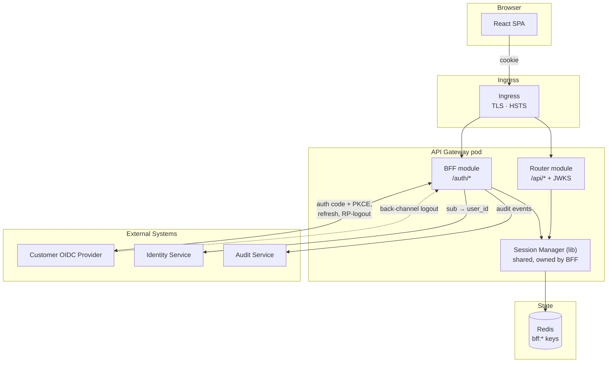

| Layer | Responsibility | Technology |
|---|---|---|
| Edge | TLS termination, HSTS, host routing | K8s ingress |
| Auth | OIDC handshake, session lifecycle, CSRF, `/auth/*` API | ModKit + `openidconnect` Rust crate |
| State | Sessions, user-sessions ZSET, login state, sid index | Redis (cluster mode optional) |
| Sibling | Gateway JWT mint + JWKS + `/api/*` proxy | [Router](../router/DESIGN.md) |

- [ ] `p3` - **ID**: `cpt-insightspec-tech-bff`

## 2. Principles & Constraints

#### Opaque to the browser

- [ ] `p2` - **ID**: `cpt-insightspec-principle-bff-opaque-cookie`

The browser only ever sees an opaque session ID. No JWTs, no IdP tokens, no claims. A stolen cookie buys access only on this host until the next TTL boundary.

#### Explicit refresh, no sliding TTL

- [ ] `p2` - **ID**: `cpt-insightspec-principle-bff-explicit-refresh`

The session TTL is short and hard. Extension only happens via `POST /auth/refresh`, called by the SPA on a fixed cadence. Regular API traffic never extends the session. This keeps the model simple, predictable, and easy to reason about.

#### Stateless service, stateful store

- [ ] `p2` - **ID**: `cpt-insightspec-principle-bff-stateless`

The BFF process holds no session state. Any pod can serve any request. All session state goes through Redis.

#### Fail closed on auth

- [ ] `p2` - **ID**: `cpt-insightspec-principle-bff-fail-closed`

If Redis is unreachable, the cookie is malformed, the session is past its absolute cap, or the IdP rejects a refresh -- return 401 and clear the cookie. Never serve a request with a guess.

### 2.2 Constraints

#### First-party cookie domain

- [ ] `p2` - **ID**: `cpt-insightspec-constraint-bff-same-domain`

The SPA and the gateway must be served from the same registrable domain. `__Host-` forbids `Domain=` and pins the cookie to one host.

#### OIDC provider feature set

- [ ] `p2` - **ID**: `cpt-insightspec-constraint-bff-oidc-features`

Customer IdP must support: authorization code with PKCE, refresh tokens, RP-initiated logout, and OIDC back-channel logout.

## 3. Technical Architecture

### 3.1 Domain Model

| Entity | Purpose | Storage |
|---|---|---|
| `Session` | Active browser session for one user on one device | Redis HASH `bff:session:{id}` |
| `UserSessionIndex` | All session IDs for one user, scored by expiry | Redis ZSET `bff:user_sessions:{user_id}` |
| `SidIndex` | Map (OIDC issuer, OIDC sid) → local session IDs | Redis SET `bff:sid_index:{iss}:{idp_sid}` |
| `LoginState` | Per-login transient state (PKCE verifier, nonce) | Redis HASH `bff:login_state:{state}`, TTL 5 min |

Relationships:
- `User` (owned by Identity Service) → 0..N `Session`
- `Session` → 1 `User`
- `Session` → 0..1 entry in `SidIndex` (only if IdP supplies `sid`)

### 3.2 Component Model

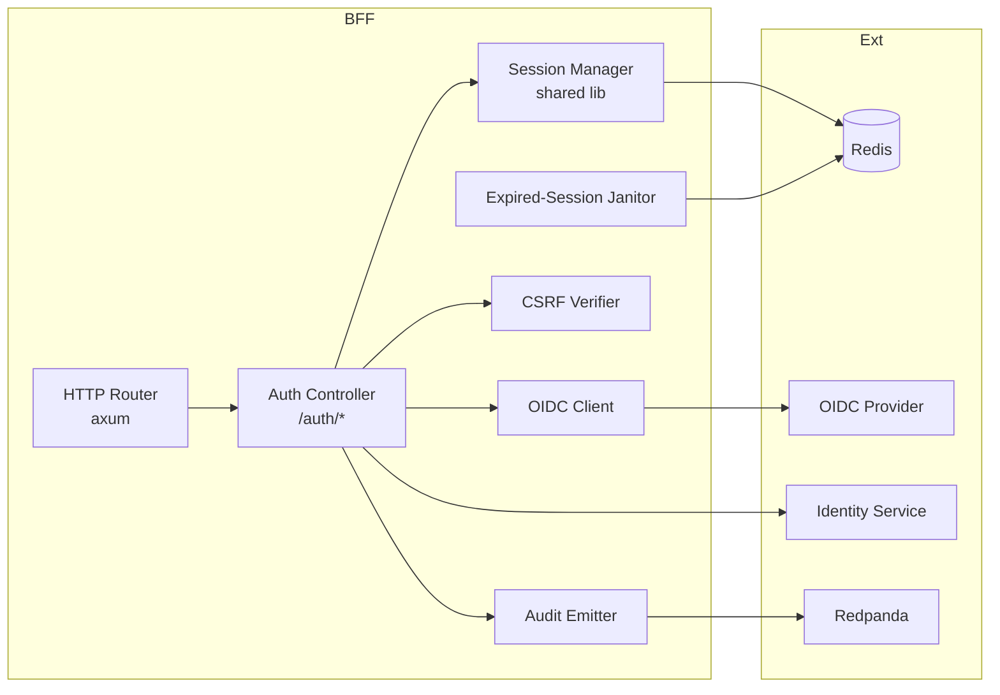

#### Auth Controller

- [ ] `p2` - **ID**: `cpt-insightspec-component-bff-auth-controller`

Owns every endpoint under `/auth/*`: login, callback, refresh, logout, sessions list/revoke, back-channel logout, CSRF, `/auth/me`. Does not authorize business operations -- downstream services do that.

#### Session Manager (shared library)

- [ ] `p2` - **ID**: `cpt-insightspec-component-bff-session-manager`

The single entry point for every read or write of session state. Used by the BFF for writes; the Router links to it for read-only validation. All Lua scripts (`create_session`, `refresh_session`, `revoke_session`, `revoke_user`) live here.

#### OIDC Client

- [ ] `p2` - **ID**: `cpt-insightspec-component-bff-oidc-client`

Authorization code + PKCE flow, ID token validation (`iss`, `aud`, `nonce`, `exp`, signature), access-token refresh, RP-initiated logout, back-channel logout token validation.

#### CSRF Verifier

- [ ] `p2` - **ID**: `cpt-insightspec-component-bff-csrf-verifier`

Issues CSRF tokens bound to the session ID, verifies them on state-changing `/auth/*` methods, falls back to `Origin` allowlist.

#### Audit Emitter

- [ ] `p2` - **ID**: `cpt-insightspec-component-bff-audit-emitter`

Publishes auth events (login, refresh, logout, IdP-refresh-fail, revoke, back-channel logout) to the Redpanda audit topic.

#### Expired-Session Janitor

- [ ] `p2` - **ID**: `cpt-insightspec-component-bff-janitor`

Periodically scans `bff:user_sessions:*` keys, removes members with score in the past via `ZREMRANGEBYSCORE`, and emits a metric on backlog size.

### 3.3 API Contracts

- [ ] `p2` - **ID**: `cpt-insightspec-interface-bff-auth-api`

- **Contracts**: `cpt-insightspec-contract-bff-gateway-jwt`, `cpt-insightspec-contract-bff-oidc`, `cpt-insightspec-contract-bff-jwks-url`
- **Technology**: REST / OpenAPI 3.1
- **Location**: [openapi.yaml](./openapi.yaml) -- to be authored alongside implementation

| Method | Path | Auth | Description | Stability |
|---|---|---|---|---|
| GET | `/auth/login` | none | Start OIDC flow; 302 to IdP | stable |
| GET | `/auth/callback` | none | OIDC redirect target; sets session cookie | stable |
| POST | `/auth/refresh` | session | Extend session TTL, re-issue cookie | stable |
| POST | `/auth/logout` | session | Revoke current session, clear cookie, return RP-logout URL | stable |
| GET | `/auth/me` | session | Return current user and tenant | stable |
| GET | `/auth/sessions` | session | List active sessions for current user | stable |
| DELETE | `/auth/sessions/{id}` | session | Revoke a specific session | stable |
| DELETE | `/auth/sessions` | session | Revoke all sessions of current user | stable |
| POST | `/auth/oidc/back-channel-logout` | OIDC `logout_token` | IdP-initiated logout receiver | stable |
| GET | `/auth/csrf` | session | Issue CSRF token for the session | stable |

JWKS and `/api/*` reverse proxy live in the [Router](../router/DESIGN.md), not here.

### 3.4 Internal Dependencies

| Dependency | Interface | Purpose |
|---|---|---|
| Identity Service | REST (SDK client) | Resolve IdP `sub` → internal `user_id` and `tenant_id` |
| Audit Service | Redpanda producer | Publish auth events |
| Router (sibling) | In-process function calls (cache invalidation) | Notify Router to drop `router:jwt_cache:{sid}` on revoke |

### 3.5 External Dependencies

| System | Protocol | Purpose |
|---|---|---|
| Customer OIDC provider | OIDC 1.0 (HTTPS) | Login, refresh, RP-initiated logout, back-channel logout |
| Redis | RESP (TCP/TLS) | Session store + user-sessions index |

### 3.6 Interactions & Sequences

#### Login (OIDC Authorization Code + PKCE)

**ID**: `cpt-insightspec-seq-bff-login`

**Use cases**: `cpt-insightspec-usecase-bff-login`

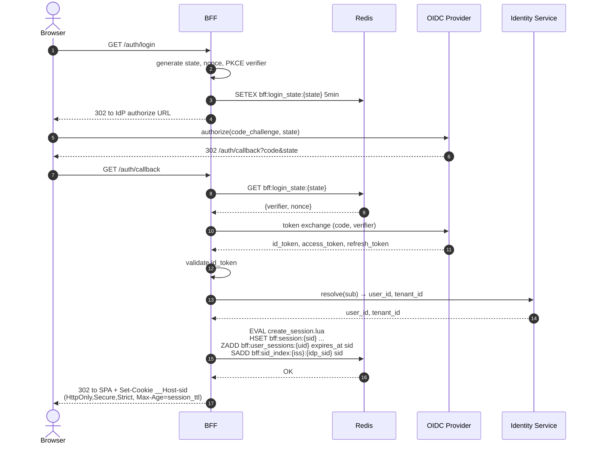

#### Session Refresh

**ID**: `cpt-insightspec-seq-bff-refresh`

**Use cases**: `cpt-insightspec-usecase-bff-refresh`

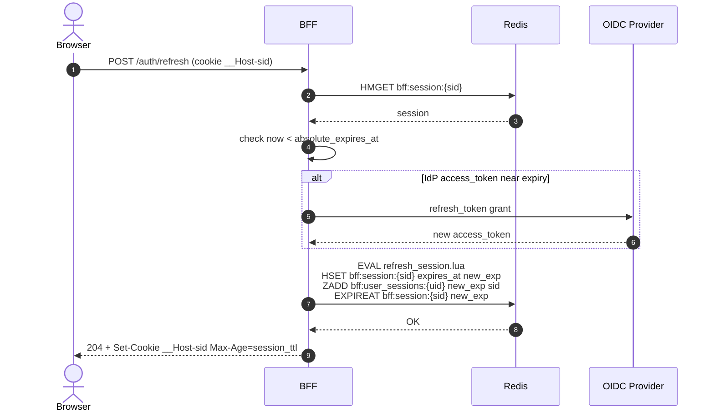

#### IdP Token Refresh Failure

**ID**: `cpt-insightspec-seq-bff-idp-refresh-fail`

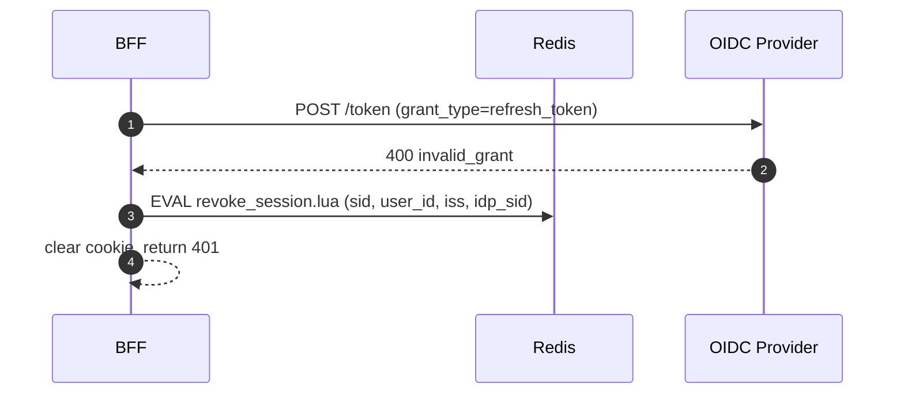

#### Logout -- Local + RP-Initiated

**ID**: `cpt-insightspec-seq-bff-logout`

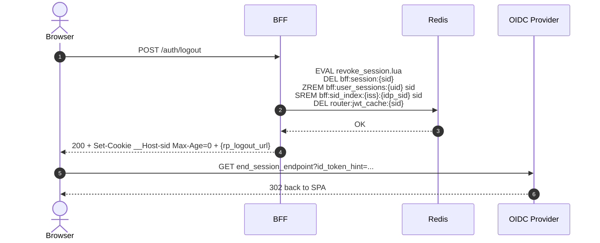

#### Logout Everywhere

**ID**: `cpt-insightspec-seq-bff-logout-all`

**Use cases**: `cpt-insightspec-usecase-bff-logout-everywhere`

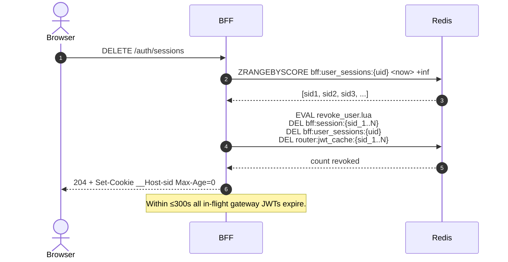

#### Back-Channel Logout from IdP

**ID**: `cpt-insightspec-seq-bff-back-channel-logout`

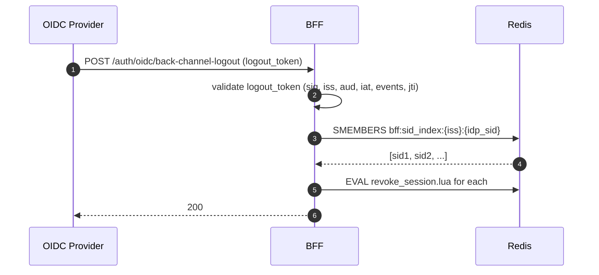

### 3.7 Redis Data Model

- [ ] `p3` - **ID**: `cpt-insightspec-db-bff-redis`

All BFF-owned keys carry the `bff:` prefix. The Router owns one prefix (`router:`) for its JWT cache; cross-references between the two are explicit.

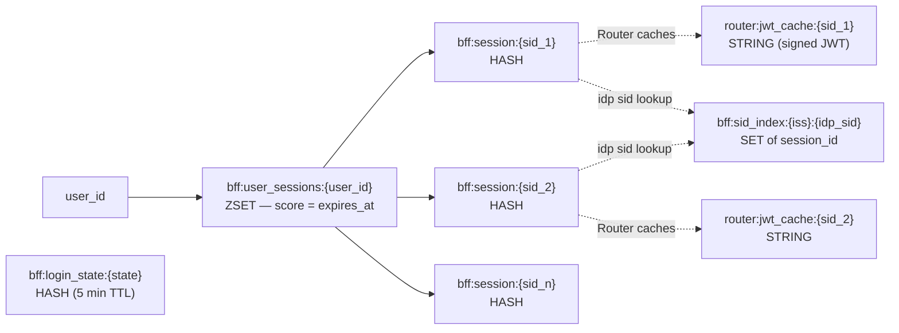

#### Key: `bff:session:{session_id}`

**ID**: `cpt-insightspec-dbtable-bff-session`

**Type**: Redis HASH

| Field | Type | Description |
|---|---|---|
| `user_id` | String | Internal user identifier |
| `tenant_id` | String | Tenant the user logged into |
| `idp_iss` | String | OIDC issuer URL |
| `idp_sub` | String | OIDC subject |
| `idp_sid` | String | OIDC `sid` claim (for back-channel logout) |
| `access_token` | String | Encrypted IdP access token |
| `refresh_token` | String | Encrypted IdP refresh token |
| `access_expires_at` | Int (epoch s) | When IdP access token expires |
| `created_at` | Int (epoch s) | Session creation time |
| `expires_at` | Int (epoch s) | Current session expiry; advanced by `/auth/refresh` |
| `absolute_expires_at` | Int (epoch s) | Hard cap; cannot be extended past this |
| `user_agent` | String | Captured at login |
| `ip` | String | Captured at login |
| `csrf_token` | String | CSRF token bound to this session |

**Redis TTL**: matches `expires_at`. Re-set on every refresh.

#### Key: `bff:user_sessions:{user_id}`

**ID**: `cpt-insightspec-dbtable-bff-user-sessions`

**Type**: Redis ZSET

**Member**: `session_id`

**Score**: `expires_at` (epoch seconds)

**Why ZSET, not SET**:

- `ZRANGEBYSCORE bff:user_sessions:{uid} <now> +inf` returns active sessions (for `/auth/sessions`).
- `ZRANGEBYSCORE bff:user_sessions:{uid} 0 <now>` returns expired ones (for the janitor).
- `ZREMRANGEBYSCORE bff:user_sessions:{uid} 0 <now>` cleans them in one call.

**Maintenance**: Mutated atomically with `bff:session:*` via Lua scripts.

#### Key: `bff:sid_index:{iss}:{idp_sid}`

**ID**: `cpt-insightspec-dbtable-bff-sid-index`

**Type**: Redis SET

**Members**: `session_id` strings

**Purpose**: Resolve OIDC back-channel `logout_token` (`iss` + `sid`) to local sessions. SET is sufficient -- no expiry-based queries needed; entries are removed on session revoke.

#### Key: `bff:login_state:{state}`

**Type**: Redis HASH

**Fields**: `pkce_verifier`, `nonce`, `redirect_to`

**TTL**: 5 minutes. One-shot -- deleted on callback.

#### Note on `router:jwt_cache:{session_id}`

Owned by the Router, not by the BFF. The BFF deletes these keys as part of revoke operations to invalidate cached gateway JWTs immediately. See [Router DESIGN §3.4](../router/DESIGN.md#34-redis-keys-read-only-and-jwt-cache).

### 3.8 Gateway JWT Claim Contract

- [ ] `p2` - **ID**: `cpt-insightspec-contract-bff-gateway-jwt`

The BFF defines the contract. The Router mints. Downstream services verify.

**Header**:

```json
{
  "alg": "EdDSA",
  "typ": "JWT",
  "kid": "<key id from JWKS>"
}
```

**Required JWT claims (RFC 7519)**:

| Claim | Type | Description |
|---|---|---|
| `iss` | String | `https://<gateway-host>/` |
| `aud` | String | `internal-services` |
| `sub` | String | Internal `user_id` |
| `iat` | Int | Issued at (epoch seconds) |
| `exp` | Int | `iat + 60..300` |
| `jti` | String | UUID v7 -- traceable, monotonic |

**Insight custom claims**:

| Claim | Type | Description |
|---|---|---|
| `tid` | String | `tenant_id` |
| `sid` | String | BFF session ID (opaque to downstream, used for tracing only) |

**Out of scope for v1**: `lic`, `roles`, `scopes`. Authorization is performed inside each downstream service against its own data sources. These claims may be added in a later major version of the contract.

**JWKS distribution**: each downstream service is configured (Helm value `gateway.jwks_url`, env `GATEWAY_JWKS_URL`) with the absolute URL of the gateway's JWKS endpoint. Services fetch on startup, cache for 1 h, and re-fetch on unknown `kid`. There is no service discovery; the URL is explicit.

**Verification at downstream**:

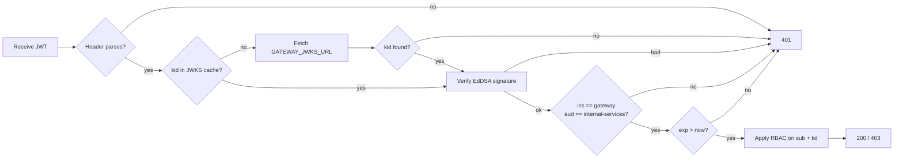

### 3.9 Boundary with the Router

| Concern | Owner | Notes |
|---|---|---|
| OIDC handshake | BFF | Router never talks to the IdP |
| Session create / refresh / revoke | BFF | Owns the Lua scripts |
| Cookie issue / clear | BFF | Router never sets cookies |
| CSRF token issue | BFF | Router enforces nothing CSRF-related on `/api/*` (relies on `SameSite=Strict`) |
| IdP access-token refresh | BFF | Triggered on `/auth/refresh` |
| Gateway JWT mint + sign | Router | Reads claims from session via shared session manager |
| JWKS publication | Router | Endpoint `/.well-known/jwks.json` |
| Reverse proxy `/api/*` | Router | Forwards with `Authorization: Bearer <jwt>` |
| Session manager library | BFF | Used by Router as a Rust crate |
| `bff:*` Redis keys | BFF | Router has read-only access to `bff:session:*` |
| `router:jwt_cache:*` Redis keys | Router | BFF deletes them as part of revoke |

## 4. Cross-Cutting Concerns

### 4.1 Cookie Hardening

A single helper sets every session cookie. Attributes are hard-coded in code, only `Max-Age` is from config:

- Name: `__Host-sid` (forces Secure + Path=/ + no Domain).
- `HttpOnly`.
- `Secure`.
- `SameSite=Strict`.
- `Path=/`.
- `Max-Age` = configured `session_ttl` (default 120 s) or `0` for clears.

A unit test asserts the exact `Set-Cookie` header for set and clear cases. Any other code path setting cookies fails review.

### 4.2 CSRF Defense

Primary: `SameSite=Strict`.

Secondary, on POST/PUT/PATCH/DELETE on `/auth/*`:

1. Read `X-CSRF-Token` header.
2. Compare against `session.csrf_token` (constant-time).
3. If absent or mismatched, check `Origin` against the configured SPA origin allowlist.
4. If both fail, return 403.

The CSRF token is rotated on login. The SPA fetches it once via `GET /auth/csrf` after login.

### 4.3 Janitor for Expired Sessions

A background task on every BFF pod (one elected leader via Redis lock) runs every `janitor_interval` seconds (default 30 s):

1. `SCAN MATCH bff:user_sessions:*` to enumerate user index keys.
2. For each, `ZREMRANGEBYSCORE key 0 <now>` to drop expired entries.
3. Emit `bff_janitor_removed_total` metric and `bff_janitor_backlog_size` (entries removed in last pass).

Per-session Redis TTL on `bff:session:{id}` already removes the record itself. The janitor exists only to keep the index clean so `/auth/sessions` and revoke-all stay fast.

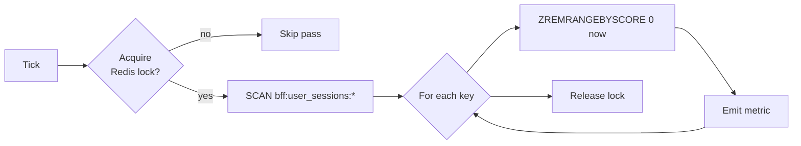

### 4.4 Observability

Metrics (Prometheus):

- `bff_auth_login_total{result}` -- ok / fail / state_mismatch
- `bff_auth_refresh_total{result}` -- ok / expired / past_cap / idp_fail
- `bff_session_active` -- gauge from periodic Redis sample
- `bff_session_lookup_duration_seconds` -- histogram
- `bff_idp_refresh_total{result}` -- ok / fail
- `bff_back_channel_logout_total{result}`
- `bff_janitor_removed_total`
- `bff_janitor_backlog_size`

Logs (structured JSON): every auth event with `correlation_id`, `session_id` (hashed), `user_id`, `tenant_id`. Never log cookies, raw tokens, or refresh tokens.

Audit (via Audit Service): login OK, login fail, refresh, logout, revoke (single / all / admin), back-channel logout, IdP refresh failure.

## 5. Design Decisions

### DD-BFF-01: Opaque Session vs JWT Cookie

**Decision**: Opaque session ID + Redis lookup, not a cookie-borne JWT.

**Why**:
- Revocation must be instant (offboarding, suspected compromise) -- only possible with a server-side store.
- Opaque IDs leak less on theft -- they only work on this host, not as a portable bearer.
- Cookie size stays tiny.

**Consequences**: Hard dependency on Redis. Mitigated by HA Redis; degraded-mode policy is OQ-BFF-01.

### DD-BFF-02: Explicit Session Refresh, No Sliding TTL

**Decision**: Session TTL is short and hard. Only `POST /auth/refresh` extends it.

**Why**:
- Sliding TTL on every API call requires a Redis write on the hot path. Explicit refresh moves writes off the hot path.
- The SPA already knows when the user is active; making refresh explicit gives it control and keeps the BFF predictable.
- Hard TTL bounds the window for stolen-cookie reuse.

**Consequences**: SPA must implement a refresh loop. Documented as part of the SPA contract; the BFF returns 401 on expiry, and the SPA redirects to `/auth/login`.

### DD-BFF-03: ZSET (Not SET) for User-Session Index

**Decision**: `bff:user_sessions:{user_id}` is a Redis sorted set with score = `expires_at`.

**Why**:
- Plain SET cannot answer "which of these sessions are expired" without reading every member's record.
- ZSET makes both "active sessions" and "expired entries" O(log N) lookups via `ZRANGEBYSCORE`.
- Janitor cleanup is a single `ZREMRANGEBYSCORE` per user.

**Consequences**: Slightly more Redis memory per entry (score + element vs element only). Negligible at our scale.

### DD-BFF-04: BFF-Prefixed Redis Keys

**Decision**: Every Redis key owned by the BFF starts with `bff:`. Router uses `router:`. Future modules pick their own prefix.

**Why**:
- Single Redis instance is shared across modules. Owner-prefixed names eliminate collisions.
- Operators reading Redis keys can identify the owner from the prefix.
- Migration of one module's data is a single prefix scan.

**Consequences**: Slightly longer keys. Worth it.

### DD-BFF-05: EdDSA Algorithm for Gateway JWT Contract

**Decision**: The gateway JWT contract mandates EdDSA (Ed25519). No other algorithms.

**Why**:
- Small signatures (~64 bytes) keep header size down.
- Fast verification (~10× faster than RS256).
- Single private/public key pair, no padding choices.

**Consequences**: Verifier libraries in downstream services must support EdDSA. Documented as a constraint on adding new downstream services.

## 6. Open Questions

### OQ-BFF-01: Redis Outage Degraded Mode

How long should the BFF accept an existing session cookie when Redis is unreachable? Options: zero tolerance (fail closed immediately); local in-memory verification window for ≤30 s; read-only mode where mutations 503 but reads continue. Decision deferred until SRE confirms Redis HA SLO.

### OQ-BFF-02: Recommended Refresh Cadence

Default `session_ttl` is 120 s, with the SPA expected to call `/auth/refresh` every 60 s. Should the BFF return the next-refresh deadline in the `/auth/refresh` response so the SPA can self-tune? Pending UX input.

### OQ-BFF-03: SPA Deep-Link Behavior

`SameSite=Strict` causes externally followed links (email, Slack) to land logged-out even if a session cookie exists. Should we run a separate `__Host-sidlax` cookie with `SameSite=Lax` solely to recognize the user and trigger a same-site re-auth? Decision needs UX input.

### OQ-BFF-04: Janitor Coordination

The janitor uses a Redis lock to elect a single pod per pass. Is that strong enough, or do we need a dedicated CronJob? Pending operational review.

## 7. Traceability

- **PRD**: [PRD.md](./PRD.md)
- **Sibling**: [Router PRD](../router/PRD.md), [Router DESIGN](../router/DESIGN.md) -- gateway JWT minting, JWKS, `/api/*` proxy, route config
- **Parent**: [API Gateway PRD](../PRD.md), [API Gateway DESIGN](../DESIGN.md) -- umbrella docs
- **Backend**: [Backend PRD](../../specs/PRD.md), [Backend DESIGN](../../specs/DESIGN.md)
- **ADRs**: [ADR/](./ADR/) -- to be authored:
  - `cpt-insightspec-adr-bff-opaque-session`
  - `cpt-insightspec-adr-bff-explicit-refresh`
  - `cpt-insightspec-adr-bff-zset-user-index`
