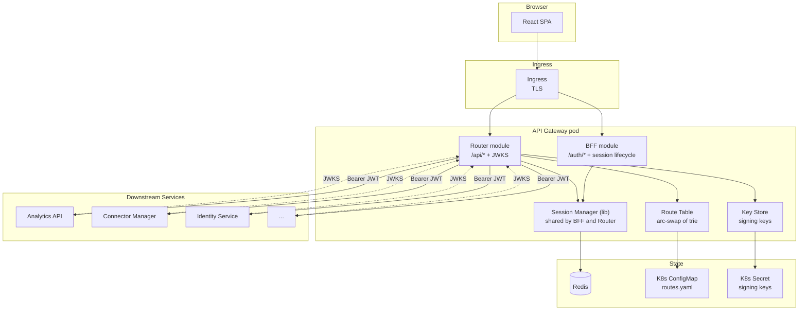
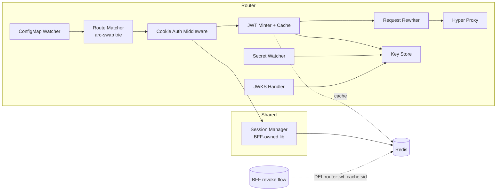
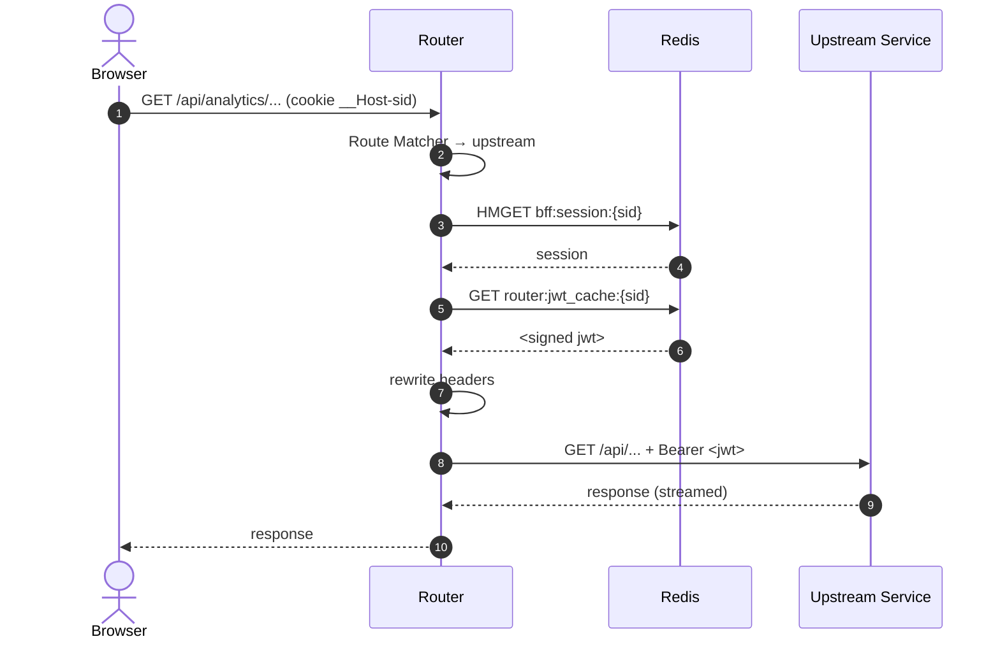
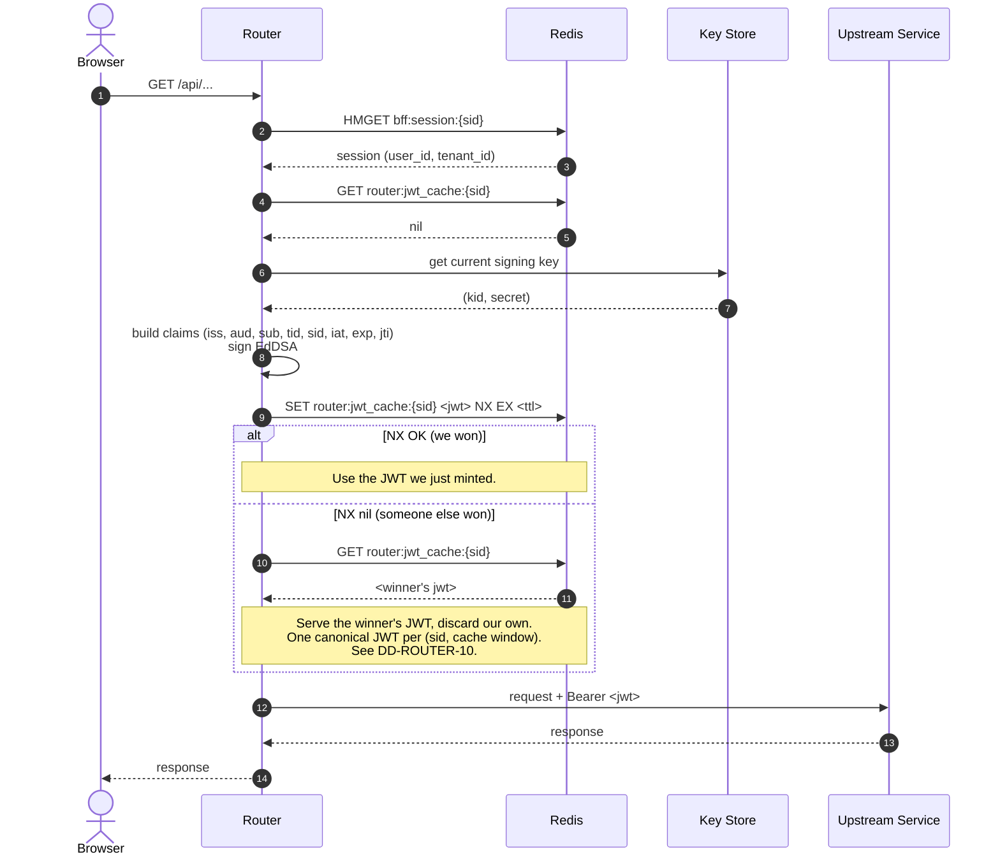
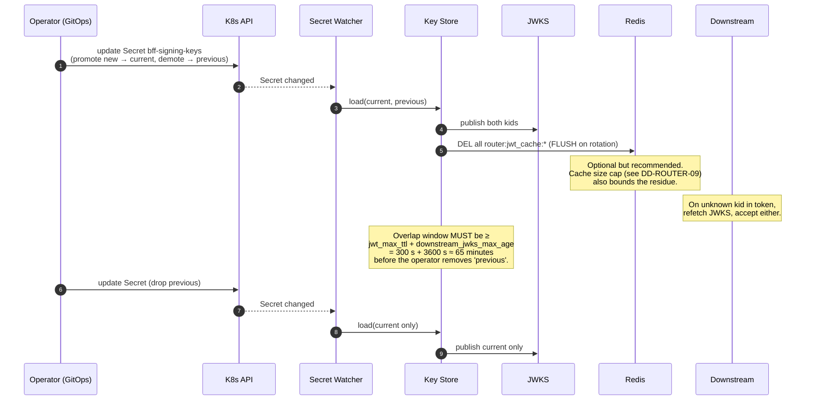
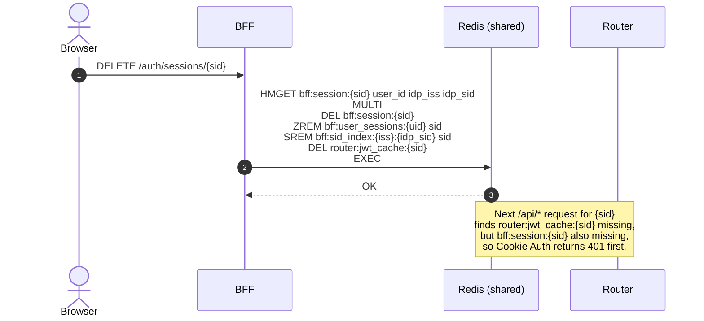

# DESIGN -- API Gateway Router

- [ ] `p3` - **ID**: `cpt-insightspec-design-router`

<!-- toc -->

- [1. Architecture Overview](#1-architecture-overview)
  - [1.1 Architectural Vision](#11-architectural-vision)
  - [1.2 Architecture Drivers](#12-architecture-drivers)
  - [1.3 Architecture Layers](#13-architecture-layers)
- [2. Principles & Constraints](#2-principles--constraints)
  - [2.1 Design Principles](#21-design-principles)
  - [2.2 Constraints](#22-constraints)
- [3. Technical Architecture](#3-technical-architecture)
  - [3.1 Domain Model](#31-domain-model)
  - [3.2 Component Model](#32-component-model)
  - [3.3 API Contracts](#33-api-contracts)
  - [3.4 Internal Dependencies](#34-internal-dependencies)
  - [3.5 External Dependencies](#35-external-dependencies)
  - [3.6 Interactions & Sequences](#36-interactions--sequences)
  - [3.7 Database schemas & tables](#37-database-schemas--tables)
  - [3.8 Route Configuration Schema](#38-route-configuration-schema)
  - [3.9 Redis Keys (read-only and JWT cache)](#39-redis-keys-read-only-and-jwt-cache)
  - [3.10 Boundary with the BFF](#310-boundary-with-the-bff)
- [4. Cross-Cutting Concerns](#4-cross-cutting-concerns)
  - [4.1 Caching](#41-caching)
  - [4.2 Failure Handling](#42-failure-handling)
  - [4.3 Observability](#43-observability)
- [5. Design Decisions](#5-design-decisions)
  - [DD-ROUTER-01: Same Pod as BFF](#dd-router-01-same-pod-as-bff)
  - [DD-ROUTER-02: ConfigMap Routes Over Service Discovery](#dd-router-02-configmap-routes-over-service-discovery)
  - [DD-ROUTER-03: Redis-backed JWT Cache (not in-memory)](#dd-router-03-redis-backed-jwt-cache-not-in-memory)
  - [DD-ROUTER-04: arc-swap for Route Table](#dd-router-04-arc-swap-for-route-table)
  - [DD-ROUTER-05: Gateway Does Basic Auth Checks Only](#dd-router-05-gateway-does-basic-auth-checks-only)
  - [DD-ROUTER-06: No Request Body Size Limits in v1](#dd-router-06-no-request-body-size-limits-in-v1)
  - [DD-ROUTER-07: WebSocket JWT Frozen at Upgrade Time, Bounded by Max Lifetime](#dd-router-07-websocket-jwt-frozen-at-upgrade-time-bounded-by-max-lifetime)
  - [DD-ROUTER-08: Header Strip List = Hardcoded + Config](#dd-router-08-header-strip-list--hardcoded--config)
  - [DD-ROUTER-09: JWT Cache Size Cap](#dd-router-09-jwt-cache-size-cap)
  - [DD-ROUTER-10: Cache Fill on Miss Uses `SET … NX EX`](#dd-router-10-cache-fill-on-miss-uses-set--nx-ex)
- [6. Traceability](#6-traceability)

<!-- /toc -->

---

## 1. Architecture Overview

### 1.1 Architectural Vision

The Router is the hot path of the API Gateway. Every browser request to `/api/*` goes through it and nothing else. It does five things in order on every request:

1. Match the path to a route.
2. Read the session from Redis.
3. Get a gateway JWT (from cache or fresh mint).
4. Rewrite headers.
5. Stream to the upstream and back.

It is stateless, hot-reloadable, and built on the same `axum` + `hyper` stack as the BFF. It shares the same process, the same Redis client, and the same ModKit framework. It does not duplicate session logic -- it links to the BFF's session manager as a library.

### 1.2 Architecture Drivers

#### Functional Drivers

| Requirement | Design Response |
|---|---|
| `cpt-insightspec-fr-router-session-validate` | Read-only access to BFF's session manager; Redis hit on every request unless cookie is absent |
| `cpt-insightspec-fr-router-jwt-mint` | EdDSA signer + Redis-backed cache `jwt_cache:{sid}`, TTL ≤ 60 s |
| `cpt-insightspec-fr-router-route-resolve` | In-memory longest-prefix trie rebuilt from ConfigMap |
| `cpt-insightspec-fr-router-proxy` | `hyper` reverse proxy with body streaming and WebSocket upgrade support |
| `cpt-insightspec-fr-router-header-rewrite` | Single `RequestRewriter` middleware; whitelist for cookies and headers |
| `cpt-insightspec-fr-router-jwks` | Static handler over the public keys held by `KeyStore` |
| `cpt-insightspec-fr-router-config-load` | Schema-validated YAML deserialization at startup; readiness gate |
| `cpt-insightspec-fr-router-config-reload` | K8s API watch; atomic swap via `arc-swap` |
| `cpt-insightspec-fr-router-key-rotation` | Same `KeyStore` watching the signing-key Secret; JWKS overlap |

#### NFR Allocation

| NFR | Component | Verification |
|---|---|---|
| `cpt-insightspec-nfr-router-latency` | Cache-first JWT, in-memory route table, no extra hops | Load test, p95 measured at the gateway |
| `cpt-insightspec-nfr-router-cache-hit` | 60 s JWT cache + per-session keying | Metric `router_jwt_mint_total{cache="hit"}` |
| `cpt-insightspec-nfr-router-reload-time` | K8s watch + atomic swap | Integration test: write ConfigMap, time first request hitting new route |
| `cpt-insightspec-nfr-router-fail-closed` | Readiness probe checks Redis + key presence + non-empty route table | Kill dependencies; verify 503 + not-ready |

### 1.3 Architecture Layers



| Layer | Responsibility | Technology |
|---|---|---|
| Edge | TLS termination, HSTS | K8s Ingress |
| Routing | Path-prefix match, hot reload | `axum` Router + `arc-swap` |
| Auth read | Cookie validation via shared session manager | `modkit-auth` (BFF-owned) |
| Crypto | EdDSA signing + JWKS | `jsonwebtoken` + K8s Secret watch |
| Proxy | Body streaming, WebSocket upgrade | `hyper` |

- [ ] `p3` - **ID**: `cpt-insightspec-tech-router`

## 2. Principles & Constraints

### 2.1 Design Principles

#### Hot path stays small

- [ ] `p2` - **ID**: `cpt-insightspec-principle-router-hot-path`

Every per-request operation is in-memory or one Redis call. No database, no external HTTP except the proxy hop itself, no serialization beyond JWT signing.

#### Read-only on session state

- [ ] `p2` - **ID**: `cpt-insightspec-principle-router-read-only-sessions`

The Router never writes to `session:*` or `user_sessions:*`. Sliding-TTL updates and refresh handling are the BFF's job. This keeps the boundary clean and makes Router behavior predictable.

#### Hot reload, never restart for config

- [ ] `p2` - **ID**: `cpt-insightspec-principle-router-hot-reload`

Adding a service or rotating a key must not require a redeploy. The Router watches K8s objects and swaps state atomically.

#### Reject before forwarding

- [ ] `p2` - **ID**: `cpt-insightspec-principle-router-reject-early`

Rejection (404 unmatched, 401 no session, 503 not-ready) happens before any upstream call. Internal services see only valid, signed traffic.

### 2.2 Constraints

#### Same-pod with the BFF

- [ ] `p2` - **ID**: `cpt-insightspec-constraint-router-same-pod`

The Router runs in the same Rust binary as the BFF. It links the BFF's session manager as a library, not over RPC. Splitting the modules into separate processes is not supported in v1.

#### Routes loaded from K8s ConfigMap

- [ ] `p2` - **ID**: `cpt-insightspec-constraint-router-configmap`

Route configuration lives in a single K8s ConfigMap watched by the pod. No service discovery, no Consul, no service mesh. Adding a service requires a ConfigMap edit.

## 3. Technical Architecture

### 3.1 Domain Model

The Router holds no business entities. The runtime objects it owns are:

| Entity | Purpose | Storage |
|---|---|---|
| `RouteTable` | In-memory longest-prefix trie of routes | `arc-swap` in-process |
| `SigningKey` | EdDSA key pair (current + optional previous) | K8s Secret + in-process cache |
| `JwtCacheEntry` | Last minted gateway JWT for a session | Redis `router:jwt_cache:{sid}` |

It reads the BFF-owned `Session` entity ([BFF DESIGN §3.1](../bff/DESIGN.md#31-domain-model)) read-only.

### 3.2 Component Model



#### Route Matcher

- [ ] `p2` - **ID**: `cpt-insightspec-component-router-matcher`

##### Why this component exists
First gate on every request. Without it, no other component knows which upstream to forward to.

##### Responsibility scope
Holds an `arc-swap<RouteTable>`. Performs longest-prefix match. Returns matched route or 404.

##### Responsibility boundaries
Does not enforce auth. Does not call upstreams. Does not parse cookies.

##### Related components (by ID)
- `cpt-insightspec-component-router-cfgwatcher` -- supplies the table.
- `cpt-insightspec-component-router-auth` -- runs after match.

#### Cookie Auth Middleware

- [ ] `p2` - **ID**: `cpt-insightspec-component-router-auth`

##### Why this component exists
The Router cannot mint a JWT for a non-user. This middleware is the gate that ensures every forwarded request is tied to a valid session.

##### Responsibility scope
Reads `__Host-sid` cookie, calls `SessionManager::lookup`, attaches the session record to the request extensions or returns 401.

##### Responsibility boundaries
No write operations on session state. Does not handle CSRF -- `SameSite=Strict` covers `/api/*`; CSRF tokens are a `/auth/*` concern owned by the BFF.

##### Related components (by ID)
- `cpt-insightspec-component-bff-session-manager` -- read-only consumer of this BFF-owned library.
- `cpt-insightspec-component-router-jwt-minter` -- runs next, with the resolved session in hand.

#### JWT Minter + Cache

- [ ] `p2` - **ID**: `cpt-insightspec-component-router-jwt-minter`

##### Why this component exists
Internal services must receive a fresh, signed identity claim per request without round-tripping to a central authz service. This component produces that claim.

##### Responsibility scope
On each request, fetch `router:jwt_cache:{sid}` from Redis. On miss, build claims (`iss`, `aud`, `sub`, `tid`, `sid`, `iat`, `exp`, `jti`) from the session record, sign with `KeyStore.current`, then `SET router:jwt_cache:{sid} <jwt> NX EX <ttl>`. If `NX` returns `nil` (a parallel request already filled the cache), re-`GET` and serve the winner's JWT instead of the freshly-minted one. See DD-ROUTER-10.

##### Responsibility boundaries
Does not refresh IdP access tokens. Does not validate JWTs (downstream services do that). Does not include `lic`, `roles`, or `scopes` -- those are not part of the v1 contract.

##### Related components (by ID)
- `cpt-insightspec-component-router-keystore` -- supplies the signing key.
- `cpt-insightspec-component-bff-auth-controller` -- invalidates this cache by `DEL router:jwt_cache:{sid}` on session revoke (shared Redis, same MULTI/EXEC pipeline as the rest of the BFF revoke).

#### Request Rewriter

- [ ] `p2` - **ID**: `cpt-insightspec-component-router-rewriter`

##### Why this component exists
Browser-supplied `Authorization` headers and gateway-internal cookies must never reach internal services. This middleware is the boundary.

##### Responsibility scope
Strip browser `Authorization` and gateway-reserved cookies. Strip any client-supplied `X-Correlation-Id` and regenerate it as a fresh UUID v7. Inject `Authorization: Bearer ...`, the regenerated `X-Correlation-Id`, `X-Forwarded-For`, `X-Forwarded-Proto`, `X-Forwarded-Host`. Apply operator-configured `strip_request_headers`. Apply `strip_prefix` if the route says so.

##### Responsibility boundaries
Does not modify request body. Does not modify response headers (apart from stripping reserved `Set-Cookie`). Does not enforce header allowlists.

##### Related components (by ID)
- `cpt-insightspec-component-router-jwt-minter` -- supplier of the JWT to inject.
- `cpt-insightspec-component-router-proxy` -- next stage.

#### Hyper Proxy

- [ ] `p2` - **ID**: `cpt-insightspec-component-router-proxy`

##### Why this component exists
The terminal stage of the request path -- everything else feeds into the upstream call.

##### Responsibility scope
Open the upstream connection (pooled `hyper::Client`), stream request body, await response, stream response body back. Enforce `timeout_ms`. Handle WebSocket upgrade for routes flagged `websocket: true`. For each upgraded socket, enforce the route's effective max lifetime: per-route `websocket_max_lifetime_seconds` if present, otherwise the global `gateway.websocket_max_lifetime_seconds` (see DD-ROUTER-07) -- close the socket with a normal-closure code when the deadline is reached. Each open WebSocket is registered in an in-process table keyed by `(route_prefix, socket_id)` so the ConfigMap Watcher can close sockets bound to a removed route on hot reload.

##### Responsibility boundaries
No retries. No payload transformation. No per-tenant rate limiting -- that's the ingress and per-service middleware.

##### Related components (by ID)
- `cpt-insightspec-component-router-rewriter` -- previous stage.

#### JWKS Handler

- [ ] `p2` - **ID**: `cpt-insightspec-component-router-jwks`

##### Why this component exists
Internal services need a stable, cacheable URL to fetch the public keys used to verify gateway JWTs.

##### Responsibility scope
Serve `GET /.well-known/jwks.json` from the `KeyStore` snapshot. Set `Cache-Control: public, max-age=3600`.

##### Responsibility boundaries
Stateless read-only handler. Does not authenticate clients (the endpoint is public by design).

##### Related components (by ID)
- `cpt-insightspec-component-router-keystore` -- source of the keys.

#### ConfigMap Watcher

- [ ] `p2` - **ID**: `cpt-insightspec-component-router-cfgwatcher`

##### Why this component exists
Adding a new internal service or changing a route's timeout must not require a redeploy. This watcher applies ConfigMap changes hot.

##### Responsibility scope
Watch the route ConfigMap via the K8s API. On change: parse + validate, then **diff against the previous table**:

1. Build the new `RouteTable`.
2. Compute the set of route prefixes that disappeared (removed entirely or whose `upstream` changed).
3. Atomically swap the live `RouteTable` via `arc-swap`.
4. For every removed/changed prefix, walk the Hyper Proxy's open-WebSocket registry and close every socket whose `(route_prefix)` matches with a normal-closure code. Clients reconnect against the new table.

If validation fails, keep the old table, emit an alert, do not touch active sockets.

##### Responsibility boundaries
Does not match routes itself (that's the matcher). Does not validate signing keys (separate watcher). Does not close HTTP requests on reload -- they hold an `Arc` to the previous table for their lifetime, which is bounded by per-route `timeout_ms`.

##### Related components (by ID)
- `cpt-insightspec-component-router-matcher` -- consumer of the table it builds.
- `cpt-insightspec-component-router-proxy` -- maintains the open-WebSocket registry the watcher walks on reload.

#### Key Store

- [ ] `p2` - **ID**: `cpt-insightspec-component-router-keystore`

##### Why this component exists
Signing keys must be rotatable without downtime. This component holds and swaps them safely.

##### Responsibility scope
Hold `current` and optional `previous` EdDSA keys. Provide signing handles to the JWT minter. Provide public-key view to JWKS. Reload on Secret change. Refuse to start if no keys are present.

##### Responsibility boundaries
Does not run rotation policy itself -- the operator triggers rotation by editing the Secret.

##### Related components (by ID)
- `cpt-insightspec-component-router-jwt-minter` -- consumer of signing keys.
- `cpt-insightspec-component-router-jwks` -- consumer of public keys.

> **Note on cache invalidation**: There is no Router-side subscriber. The Router and BFF share the same Redis instance, so the BFF's revoke flow performs `DEL router:jwt_cache:{sid}` directly inside the same MULTI/EXEC pipeline that drops the session record. No Redpanda, no in-process callback, no eventual-consistency window beyond the single Redis round-trip.

### 3.3 API Contracts

The Router exposes the **Reverse Proxy** and **JWKS** interfaces declared in [PRD §7.1](./PRD.md#71-public-api-surface) (`cpt-insightspec-interface-router-proxy`, `cpt-insightspec-interface-router-jwks`). It owns the contracts declared in PRD §7.2 (`cpt-insightspec-contract-router-gateway-jwt`, `cpt-insightspec-contract-router-config`).

| Path | Implementation |
|---|---|
| `GET /.well-known/jwks.json` | `JWKS Handler` over `Key Store` |
| `ANY /api/**` | Route Matcher → Cookie Auth → JWT Minter → Request Rewriter → Hyper Proxy |

### 3.4 Internal Dependencies

| Dependency | Interface | Purpose |
|---|---|---|
| BFF Session Manager (sibling) | Rust crate | Read-only session validation; no RPC |
| BFF Auth Controller | Shared Redis | Invalidates `router:jwt_cache:{sid}` directly inside the BFF revoke MULTI/EXEC pipeline. No RPC, no Redpanda. |
| Audit Service | Redpanda producer | Emit config-reload, key-rotation, suspicious-event audit records |

### 3.5 External Dependencies

| System | Protocol | Purpose |
|---|---|---|
| Redis | RESP (TCP/TLS) | Session reads (`bff:session:*`), JWT cache (`router:jwt_cache:*`) |
| K8s API | watch | ConfigMap and Secret hot reload |
| Downstream services | HTTP/1.1 + HTTP/2 + WebSocket | Targets of `/api/*` forwarding |

### 3.6 Interactions & Sequences

#### Request flow (cache hit)

**ID**: `cpt-insightspec-seq-router-request-hit`



#### Request flow (cache miss)

**ID**: `cpt-insightspec-seq-router-request-miss`



#### Config reload

**ID**: `cpt-insightspec-seq-router-config-reload`

```mermaid
sequenceDiagram
    autonumber
    participant K8s as K8s API
    participant W as ConfigMap Watcher
    participant V as Validator
    participant T as Route Table (arc-swap)
    participant P as Hyper Proxy<br/>(WS registry)
    participant HTTP as Live HTTP handlers

    K8s-->>W: ConfigMap changed
    W->>V: parse + validate new YAML
    alt valid
        V-->>W: ok (new RouteTable, removed_prefixes)
        W->>T: store(new)
        Note over HTTP: New requests use new table.<br/>In-flight HTTP requests keep their existing<br/>match (bounded by route timeout_ms).
        loop for each prefix in removed_prefixes
            W->>P: close all sockets registered for prefix
            P-->>W: closed N sockets (normal-closure)
        end
        Note over P: Clients reconnect; they either land on the<br/>renamed/replaced upstream or get a 404.
    else invalid
        V-->>W: errors
        W->>W: emit alert, keep old table
        Note over P: WebSocket sweep is NOT performed on<br/>validation failure -- existing sockets stay open.
    end
```

#### Signing key rotation

**ID**: `cpt-insightspec-seq-router-key-rotate`



**Overlap window math.** A downstream service caches JWKS up to `Cache-Control: max-age=3600` (1 h). After `previous` is removed from the Router's JWKS, a downstream service that has not yet refetched JWKS still has the old `kid` in its in-process cache and continues to verify old-key tokens. But a downstream service that *did* refetch -- because it saw an unknown `kid` from the new key -- now has only the new key, and any cached gateway JWT still signed with `previous` (TTL ≤ 60 s) is rejected. Worst-case window the operator runbook **MUST** wait before removing `previous` is therefore:

```text
overlap_min = gateway.jwt_ttl_seconds (≤ 300) + downstream JWKS max-age (3600)
            ≈ 65 minutes
```

`gateway.websocket_max_lifetime_seconds` (default 3600 s, see DD-ROUTER-07) is *not* an additional addend here -- WebSocket connections retain the JWT minted at upgrade and never re-verify against fresh JWKS, so they are unaffected by JWKS-cache eviction. They are bounded separately by their own lifetime cap.

**Optional but recommended on rotation.** Flushing `router:jwt_cache:*` (a single Redis-side `SCAN + UNLINK` or, if a future DD-ROUTER-09 caps cache size, just clearing the cap'd structure) eliminates the residue of JWTs signed under the previous key. Cost: a transient mint storm for active sessions, mitigated by the `SET ... NX` cache-fill from DD-ROUTER-10.

#### Cache busting on session revoke

**ID**: `cpt-insightspec-seq-router-cache-bust`



### 3.7 Database schemas & tables

This module's "database" is Redis, shared with the BFF. The Router reads keys defined and owned by the BFF (see [BFF DESIGN §3.7](../bff/DESIGN.md#37-database-schemas--tables)) and writes one key family of its own. The full layout is in §3.9 below.

### 3.8 Route Configuration Schema

- [ ] `p2` - **ID**: `cpt-insightspec-design-router-config-schema`

This section is the technical specification for the contract `cpt-insightspec-contract-router-config` declared in [PRD §7.2](./PRD.md#72-external-integration-contracts). ConfigMap key: `routes.yaml`.

```yaml
version: 1
defaults:
  timeout_ms: 30000
  strip_prefix: false
  websocket: false
  # Operator-extensible deny-list of request headers. The hardcoded
  # gateway-reserved set (Authorization, X-Correlation-Id,
  # X-Forwarded-*, gateway cookies) is always stripped in addition.
  strip_request_headers:
    - X-Real-IP
    - Forwarded
routes:
  - prefix: /api/v1/analytics
    upstream: http://analytics-api.insight.svc.cluster.local:8080
    timeout_ms: 60000
    strip_prefix: false

  - prefix: /api/v1/connectors
    upstream: http://connector-manager.insight.svc.cluster.local:8080

  - prefix: /api/v1/identity
    upstream: http://identity-service.insight.svc.cluster.local:8080

  - prefix: /api/v1/identity-resolution
    upstream: http://identity-resolution.insight.svc.cluster.local:8080

  - prefix: /api/v1/transforms
    upstream: http://transform-service.insight.svc.cluster.local:8080

  - prefix: /api/v1/alerts
    upstream: http://alerts-service.insight.svc.cluster.local:8080

  - prefix: /api/v1/audit
    upstream: http://audit-service.insight.svc.cluster.local:8080

  - prefix: /api/v1/stream
    upstream: http://analytics-api.insight.svc.cluster.local:8080
    websocket: true
    timeout_ms: 0
    # Per-route override for the global gateway.websocket_max_lifetime_seconds.
    # Tighter ceiling for high-sensitivity streams; bounds post-revoke staleness.
    websocket_max_lifetime_seconds: 600
```

Validation rules (enforced on load and on every reload):

- `version` must be a known schema version.
- `prefix` unique across the table.
- `prefix` must start with `/api/`.
- `upstream` must be a valid URL with hostname and port.
- `timeout_ms ≥ 0`. `0` only allowed when `websocket: true`.
- No two routes share an exact prefix.
- `strip_request_headers` entries must be valid HTTP header names; reserved gateway headers (`Authorization`, `X-Correlation-Id`, `X-Forwarded-*`, gateway cookies) **MUST NOT** appear in this list -- they are stripped unconditionally.
- `websocket_max_lifetime_seconds` (per-route) is permitted only when `websocket: true`. Must be `>= 30` and `<=` the global `gateway.websocket_max_lifetime_seconds`. Falls back to the global value if absent.

### 3.9 Redis Keys (read-only and JWT cache)

The Router reads keys defined and owned by the BFF; see [BFF DESIGN §3.7](../bff/DESIGN.md#37-database-schemas--tables). It writes only to one key family of its own (`router:jwt_cache:*`).

| Key | Type | Owner | Router access |
|---|---|---|---|
| `bff:session:{sid}` | HASH | BFF | read |
| `bff:user_sessions:{user_id}` | ZSET (score = `expires_at`) | BFF | none on the hot path |
| `bff:sid_index:{iss}:{idp_sid}` | SET | BFF | none |
| `bff:login_state:{state}` | HASH | BFF | none |
| `router:jwt_cache:{sid}` | STRING | Router | read + write |

`router:jwt_cache:{sid}` value is the full signed JWT, TTL = `min(60, jwt_remaining)`. The BFF deletes these keys as part of session-revoke flows so revocations propagate within one TTL.

### 3.10 Boundary with the BFF

| Concern | Owner | Notes |
|---|---|---|
| OIDC handshake | BFF | Router never talks to the IdP |
| Session create / extend / revoke | BFF | Router calls only `SessionManager::lookup` |
| Cookie issue / clear | BFF | Router never sets cookies |
| CSRF token issue | BFF | Router enforces nothing CSRF-related on `/api/*`; CSRF is a BFF concern on `/auth/*`. State-changing `/api/*` calls rely on `SameSite=Strict`. |
| Refresh of IdP access token | BFF | Router does not see IdP tokens |
| Gateway JWT mint + sign | Router | Was in BFF DESIGN; ownership moves here |
| JWKS publication | Router | Was in BFF DESIGN; ownership moves here |
| Reverse proxy | Router | Was in BFF DESIGN; ownership moves here |
| Session manager library | BFF | Used by Router as a Rust crate; no network call |

A note on the parent BFF DESIGN: the JWT minter, JWT cache, JWKS endpoint, and reverse proxy described there are now implemented in the Router. The BFF DESIGN's claim schema (section 3.8) and key-rotation diagram still describe the contract; ownership is what changes.

## 4. Cross-Cutting Concerns

### 4.1 Caching

Three caches, all bounded:

- **Route table**: in-process `arc-swap`; replaced atomically on ConfigMap change.
- **JWT cache**: Redis, TTL ≤ 60 s, keyed by session ID.
- **JWKS at downstream services**: 1 h TTL with kid-driven refresh on miss.

No per-request cache for sessions (they change too often -- TTL slides on use).

### 4.2 Failure Handling

| Failure | Behavior |
|---|---|
| No cookie | 401, no upstream call |
| Cookie present but session not in Redis | 401 + clear cookie |
| Redis unreachable | 503, readiness probe fails |
| ConfigMap missing or invalid at startup | Pod stays unready |
| ConfigMap update invalid at runtime | Keep old table, emit alert |
| Signing key Secret missing at startup | Pod stays unready |
| `current` key removed at runtime | Refuse to mint; 503 + alert |
| Upstream connection refused | 502 |
| Upstream timeout | 504 with `Retry-After` |
| Upstream 5xx | Pass through |
| WebSocket upgrade target dead | 502 |

### 4.3 Observability

Metrics:

- `router_request_total{route, status}`
- `router_request_duration_seconds{route}` (histogram)
- `router_jwt_mint_total{cache="hit"|"miss"}`
- `router_jwt_mint_duration_seconds`
- `router_session_lookup_duration_seconds`
- `router_config_reload_total{result="ok"|"invalid"}`
- `router_key_rotation_total`
- `router_route_count` (gauge)

Logs (structured JSON): one line per request with `correlation_id`, route prefix, upstream, status, duration, cache result. Never log cookies, JWTs, or session IDs in clear -- session ID hashed if needed.

Audit (via Audit Service): config reload (with diff), key rotation, JWKS fetch failures from downstream (treated as suspicious).

## 5. Design Decisions

### DD-ROUTER-01: Same Pod as BFF

**Context**: Could deploy the Router as a separate Deployment in front of the BFF.

**Decision**: One pod, one binary, two modules.

**Why**:
- Avoids a network hop for `/auth/*` routing.
- Lets the Router link to the session manager as a library, not over RPC.
- One signing-key Secret, one set of metrics, one log stream.

**Consequences**: Scaling is coupled (BFF and Router scale together). Acceptable -- BFF is also stateless.

### DD-ROUTER-02: ConfigMap Routes Over Service Discovery

**Context**: Could use Consul, K8s service discovery + label selectors, or a service mesh.

**Decision**: Explicit YAML route table in a ConfigMap.

**Why**:
- Tiny number of internal services (<20). Discovery is overkill.
- Reviewable in Git, validated on load, easy to audit.
- No new runtime dependency.

**Consequences**: New services need a ConfigMap edit. Documented in operator runbook.

### DD-ROUTER-03: Redis-backed JWT Cache (not in-memory)

**Context**: Could cache minted JWTs per process in memory.

**Decision**: Cache in Redis under `jwt_cache:{sid}`.

**Why**:
- Multi-pod deployment -- in-memory cache hit rate degrades with replicas.
- Cache invalidation is a single `DEL` from the BFF on shared Redis -- works regardless of replica count, reaches every pod's view immediately, no per-pod fan-out.
- Cache miss cost is one EdDSA sign (~50 µs), so even with no cache the system would work; Redis cache mainly cuts pressure under bursts.

**Consequences**: One extra Redis call per request. Measured at <1 ms p99, well inside the latency budget.

### DD-ROUTER-04: arc-swap for Route Table

**Context**: Need atomic, lock-free reads of the route table on every request.

**Decision**: `arc_swap::ArcSwap<RouteTable>`.

**Why**:
- Lock-free reads -- the hot path never blocks.
- `store` is atomic, so no half-applied table.
- Old table is reclaimed once all in-flight requests release their `Arc`.

**Consequences**: In-flight requests may finish under the previous table; that's the desired behavior.

### DD-ROUTER-05: Gateway Does Basic Auth Checks Only

**Decision**: The Router validates that the request has a valid session and a freshly-minted gateway JWT. It does **not** check license tier, roles, scopes, or tenant access. Those are downstream-service responsibilities.

**Why**:
- Authorization belongs next to the data. Each downstream service already enforces RBAC and visibility against its own model -- duplicating it at the gateway would create two sources of truth.
- The JWT carries `sub` and `tid`. Anything richer (roles, license, scopes) is intentionally absent from the v1 claim contract; see [BFF DESIGN §3.8](../bff/DESIGN.md#38-gateway-jwt-claim-contract).
- The gateway must stay a thin, fast hot-path component. Adding policy here adds latency and a redeploy surface for every authz change.

**Consequences**: A user with no permission for a feature still reaches the downstream service, which returns 403. That's the right place for the decision.

### DD-ROUTER-06: No Request Body Size Limits in v1

**Decision**: The Router does not enforce `max_body_bytes`. No per-route upload caps.

**Why**:
- v1 has no end-user upload features. CSV exports are downloads (response body), not uploads. Connector configuration payloads are tiny.
- Adding a knob with no real consumer is YAGNI and risks misconfiguration that silently breaks a future feature.

**Consequences**: When an upload feature lands, this gets revisited as a normal config addition.

### DD-ROUTER-07: WebSocket JWT Frozen at Upgrade Time, Bounded by Max Lifetime

**Decision**: A WebSocket connection carries the JWT minted at upgrade. The Router does **not** re-mint or re-inject during the connection's lifetime. To bound the post-revoke staleness window, the Router enforces a configurable **max socket lifetime** with a global default and a per-route override:

- Global default: Helm value `gateway.websocket_max_lifetime_seconds`, default `3600` = 1 hour.
- Per-route override: `websocket_max_lifetime_seconds` in the route entry of the ConfigMap (see §3.8). Must be `>= 30` and `<=` the global value. Used for high-sensitivity streams (admin operations, live pipeline events) that need a tighter ceiling than the dashboard default.

When the effective deadline is reached, the Router closes the socket with a normal-closure code; the client reconnects and re-authenticates, picking up the current session state (or 401 if the session is gone). Open WebSocket connections are also closed by the ConfigMap Watcher when their matched route is removed or its upstream changes (see §3.6 Config reload).

**Why**:
- v1 has no plan for in-band JWT refresh on a live socket -- complicates the protocol, complicates client code, and the only real benefit is faster claim freshness which the JWT TTL bound (≤ 300 s) already covers for non-WebSocket traffic.
- Downstream services are inside the trust boundary -- a stale `tid`/`sub` on a long-lived socket is not a security concern in itself, and authorization is enforced against current data on each operation anyway.
- A bounded max lifetime caps the worst case for sockets opened just before a revoke. Without it, a malicious or buggy client could hold the connection open indefinitely after offboarding.
- Implementing the cap in the **Router** keeps the policy in one place. The **BFF** still owns session revoke; the Router does not need to subscribe to revoke events for this control to work.

**Consequences**:
- Worst-case post-revoke window for an open socket = `websocket_max_lifetime_seconds`. Default (1 h) is acceptable for analytics dashboard streams; tighten via Helm if a deployment needs faster turnaround.
- Clients on long-lived sockets see a connection close roughly every hour and **MUST** reconnect cleanly. This is documented in the SPA WebSocket client guidelines.
- A revocation-triggered disconnect is **not** part of v1. If a future deployment needs near-zero post-revoke staleness on sockets, the design path is: BFF publishes `(sid)` on a Redis pub/sub channel inside the revoke MULTI/EXEC pipeline (still shared Redis, still no Redpanda), and the Router subscribes per-pod and closes any socket bound to that `sid`. That mechanism is deferred until a real driver appears.

### DD-ROUTER-08: Header Strip List = Hardcoded + Config

**Decision**: The Router strips two categories of headers before forwarding:

1. **Hardcoded gateway-reserved**: `Authorization` (always replaced with the minted JWT), `X-Correlation-Id` (always set by the gateway), `X-Forwarded-For`, `X-Forwarded-Proto`, `X-Forwarded-Host`, plus the gateway's session and CSRF cookies (`__Host-sid`, CSRF cookie).
2. **Operator-configured**: an explicit list in the route ConfigMap (`defaults.strip_request_headers`) that callers want stripped for cluster hygiene (e.g. `X-Real-IP`, `Forwarded`, anything that conflicts with internal conventions).

Everything else passes through.

**Why**:
- Hardcoded list covers the security-critical headers that must never be operator-removable (a misconfig that lets a browser-supplied `Authorization` reach a downstream service is a breach).
- Config list lets operators harden the deployment without a code change.
- A pure allowlist would force a config update for every new debugging header used by an internal service -- friction with no real safety gain inside the trust boundary.

**Consequences**: New downstream services can rely on any non-reserved header passing through. The config-driven strip list is reviewed at deploy time alongside the route table.

### DD-ROUTER-09: JWT Cache Size Cap

**Decision**: `router:jwt_cache:*` is bounded both by per-entry TTL (≤ 60 s) and by an upper bound on total active session count enforced through Redis `maxmemory-policy=allkeys-lru` on the Redis instance (or a dedicated logical DB if the operator wants strict isolation). The Router does not maintain its own LRU.

**Why**:
- An upper bound on cache size prevents an attacker who can rapidly create sessions from inflating the JWT cache to memory pressure.
- Relying on Redis eviction policy is operationally simple. The cache is a true cache -- losing entries only costs an EdDSA sign on the next request.
- Per-key TTL alone is not enough to bound steady-state memory if active session count grows.

**Consequences**: Operators must size the Redis instance for `(active_sessions × avg_jwt_size) + (active_sessions × avg_session_record_size)` plus headroom; `allkeys-lru` evicts cache entries before session records when the JWT cache key has shorter idle time, which is the desired behaviour.

### DD-ROUTER-10: Cache Fill on Miss Uses `SET … NX EX`

**Decision**: On JWT cache miss, the Router fills with `SET router:jwt_cache:{sid} <jwt> NX EX <ttl>`. On `nil` return (someone else won the race), the Router re-`GET`s and serves the winner's JWT instead of using its own freshly-minted one.

**Why**:
- A SPA opening N parallel API calls right after login otherwise causes N parallel cache misses, N EdDSA signs, and N `SETEX` writes (last-writer-wins). All but one of the minted JWTs are immediately stale in the cache, each with a unique `jti`.
- `SET ... NX` is atomic at Redis. Cost of the conflict path is one extra `GET`. Cost of the happy path is unchanged.
- Removes a future foot-gun: a `jti` denylist (out of scope today, but plausible) would have to track every minted JWT regardless of cache outcome. With NX-fill there is one canonical JWT per session per cache window.

**Consequences**: Single canonical cached JWT per session per cache window. Transient `SET-NX` collisions visible in metrics on traffic bursts; expected and benign.

## 6. Traceability

- **PRD**: [PRD.md](./PRD.md)
- **Sibling**: [BFF PRD](../bff/PRD.md), [BFF DESIGN](../bff/DESIGN.md) -- session lifecycle, OIDC, gateway JWT schema (3.8), Redis data model (3.7)
- **Parent**: [Backend PRD](../../specs/PRD.md), [Backend DESIGN](../../specs/DESIGN.md)
- **ADRs**: [ADR/](./ADR/) -- to be authored alongside implementation. Decisions captured inline as DD-ROUTER-01..10 in §5 until then.
