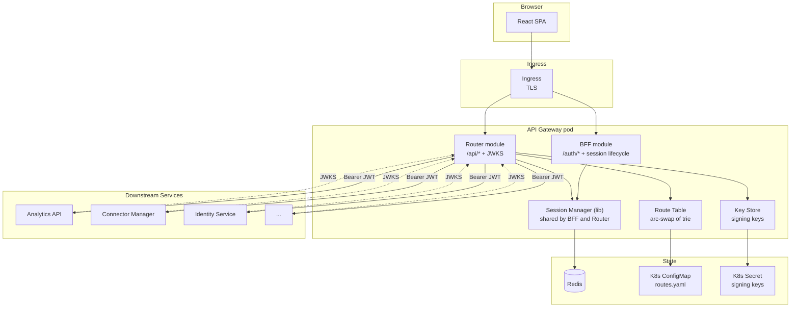
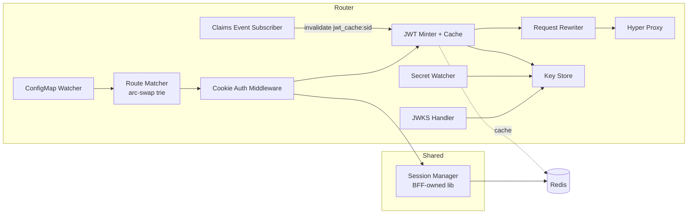
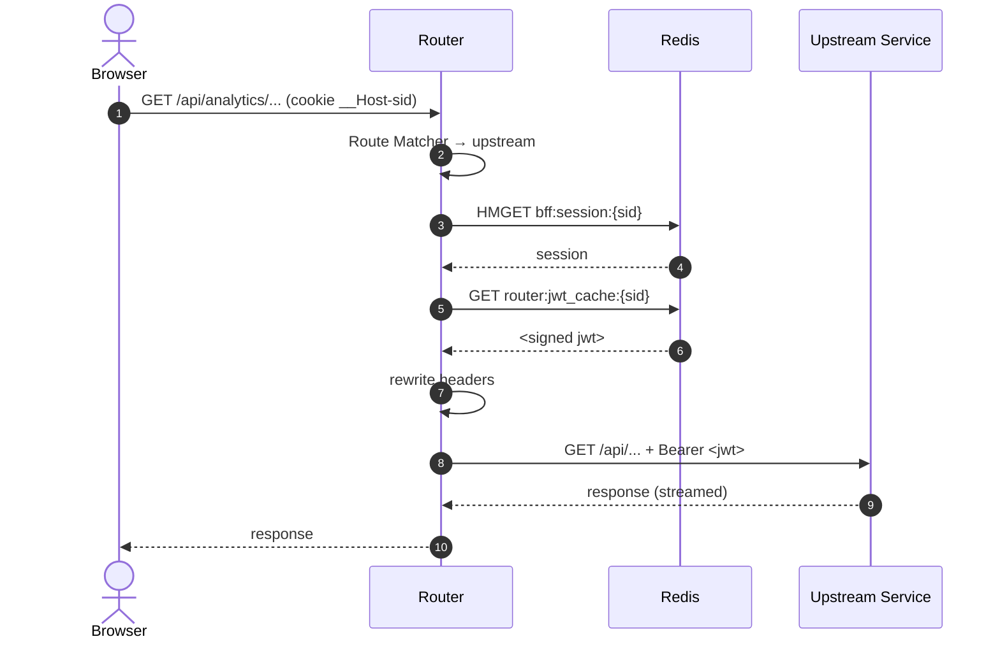
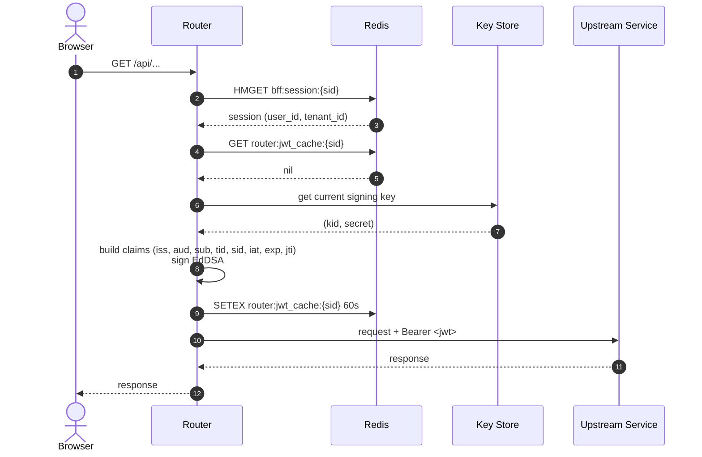
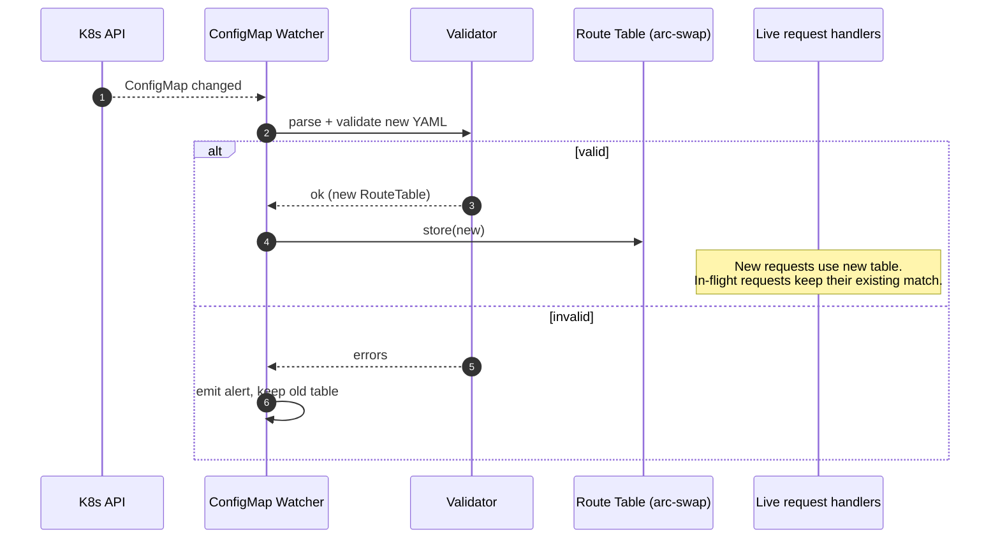
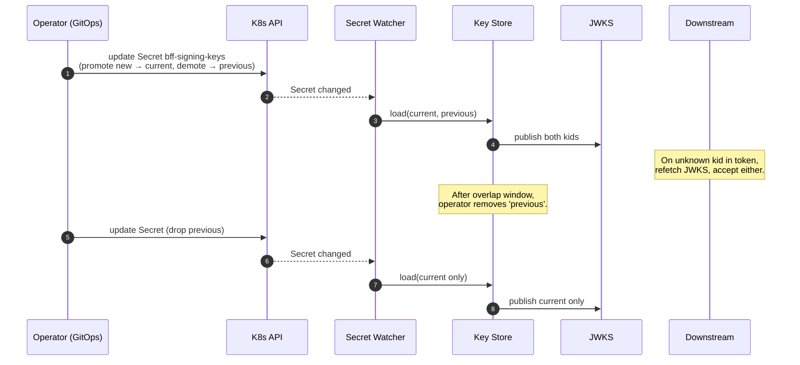
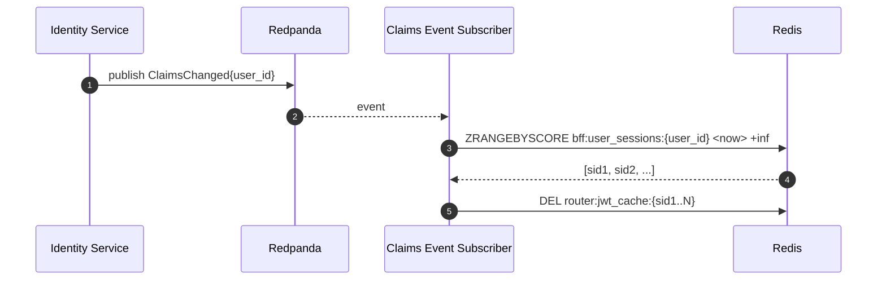

# DESIGN -- API Gateway Router

- [ ] `p3` - **ID**: `cpt-insightspec-design-router`

<!-- toc -->

- [1. Architecture Overview](#1-architecture-overview)
  - [1.1 Architectural Vision](#11-architectural-vision)
  - [1.2 Architecture Drivers](#12-architecture-drivers)
  - [1.3 Architecture Layers](#13-architecture-layers)
- [2. Principles & Constraints](#2-principles--constraints)
- [3. Technical Architecture](#3-technical-architecture)
  - [3.1 Component Model](#31-component-model)
  - [3.2 Interactions & Sequences](#32-interactions--sequences)
  - [3.3 Route Configuration Schema](#33-route-configuration-schema)
  - [3.4 Redis Keys (read-only and JWT cache)](#34-redis-keys-read-only-and-jwt-cache)
  - [3.5 Boundary with the BFF](#35-boundary-with-the-bff)
- [4. Cross-Cutting Concerns](#4-cross-cutting-concerns)
  - [4.1 Caching](#41-caching)
  - [4.2 Failure Handling](#42-failure-handling)
  - [4.3 Observability](#43-observability)
- [5. Design Decisions](#5-design-decisions)
- [6. Open Questions](#6-open-questions)
- [7. Traceability](#7-traceability)

<!-- /toc -->

---

## 1. Architecture Overview

### 1.1 Architectural Vision

The Router is the hot path of the API Gateway. Every browser request to `/api/*` goes through it and nothing else. It does five things in order on every request:

1. Match the path to a route.
2. Read the session from Redis.
3. Get a gateway JWT (from cache or fresh mint).
4. Rewrite headers.
5. Stream to the upstream and back.

It is stateless, hot-reloadable, and built on the same `axum` + `hyper` stack as the BFF. It shares the same process, the same Redis client, and the same ModKit framework. It does not duplicate session logic -- it links to the BFF's session manager as a library.

### 1.2 Architecture Drivers

#### Functional Drivers

| Requirement | Design Response |
|---|---|
| `cpt-insightspec-fr-router-session-validate` | Read-only access to BFF's session manager; Redis hit on every request unless cookie is absent |
| `cpt-insightspec-fr-router-jwt-mint` | EdDSA signer + Redis-backed cache `jwt_cache:{sid}`, TTL ≤ 60 s |
| `cpt-insightspec-fr-router-route-resolve` | In-memory longest-prefix trie rebuilt from ConfigMap |
| `cpt-insightspec-fr-router-proxy` | `hyper` reverse proxy with body streaming and WebSocket upgrade support |
| `cpt-insightspec-fr-router-header-rewrite` | Single `RequestRewriter` middleware; whitelist for cookies and headers |
| `cpt-insightspec-fr-router-jwks` | Static handler over the public keys held by `KeyStore` |
| `cpt-insightspec-fr-router-config-load` | Schema-validated YAML deserialization at startup; readiness gate |
| `cpt-insightspec-fr-router-config-reload` | K8s API watch; atomic swap via `arc-swap` |
| `cpt-insightspec-fr-router-key-rotation` | Same `KeyStore` watching the signing-key Secret; JWKS overlap |

#### NFR Allocation

| NFR | Component | Verification |
|---|---|---|
| `cpt-insightspec-nfr-router-latency` | Cache-first JWT, in-memory route table, no extra hops | Load test, p95 measured at the gateway |
| `cpt-insightspec-nfr-router-cache-hit` | 60 s JWT cache + per-session keying | Metric `router_jwt_mint_total{cache="hit"}` |
| `cpt-insightspec-nfr-router-reload-time` | K8s watch + atomic swap | Integration test: write ConfigMap, time first request hitting new route |
| `cpt-insightspec-nfr-router-fail-closed` | Readiness probe checks Redis + key presence + non-empty route table | Kill dependencies; verify 503 + not-ready |

### 1.3 Architecture Layers



| Layer | Responsibility | Technology |
|---|---|---|
| Edge | TLS termination, HSTS | K8s Ingress |
| Routing | Path-prefix match, hot reload | `axum` Router + `arc-swap` |
| Auth read | Cookie validation via shared session manager | `modkit-auth` (BFF-owned) |
| Crypto | EdDSA signing + JWKS | `jsonwebtoken` + K8s Secret watch |
| Proxy | Body streaming, WebSocket upgrade | `hyper` |

- [ ] `p3` - **ID**: `cpt-insightspec-tech-router`

## 2. Principles & Constraints

#### Hot path stays small

- [ ] `p2` - **ID**: `cpt-insightspec-principle-router-hot-path`

Every per-request operation is in-memory or one Redis call. No database, no external HTTP except the proxy hop itself, no serialization beyond JWT signing.

#### Read-only on session state

- [ ] `p2` - **ID**: `cpt-insightspec-principle-router-read-only-sessions`

The Router never writes to `session:*` or `user_sessions:*`. Sliding-TTL updates and refresh handling are the BFF's job. This keeps the boundary clean and makes Router behavior predictable.

#### Hot reload, never restart for config

- [ ] `p2` - **ID**: `cpt-insightspec-principle-router-hot-reload`

Adding a service or rotating a key must not require a redeploy. The Router watches K8s objects and swaps state atomically.

#### Reject before forwarding

- [ ] `p2` - **ID**: `cpt-insightspec-principle-router-reject-early`

Rejection (404 unmatched, 401 no session, 503 not-ready) happens before any upstream call. Internal services see only valid, signed traffic.

## 3. Technical Architecture

### 3.1 Component Model



#### Route Matcher

- [ ] `p2` - **ID**: `cpt-insightspec-component-router-matcher`

##### Why this component exists
First gate on every request. Determines the upstream and per-route options.

##### Responsibility scope
Holds an `arc-swap<RouteTable>`. Performs longest-prefix match. Returns matched route or 404.

##### Responsibility boundaries
Does not enforce auth. Does not call upstreams. Does not parse cookies.

#### Cookie Auth Middleware

- [ ] `p2` - **ID**: `cpt-insightspec-component-router-auth`

##### Responsibility scope
Reads `__Host-sid` cookie, calls `SessionManager::lookup`, attaches the session record to the request extensions or returns 401.

##### Responsibility boundaries
No write operations. Does not handle CSRF (CSRF lives in the BFF and only matters on state-changing routes that the BFF owns; per-API CSRF is enforced by the BFF middleware that runs in the same chain when the request is to `/auth/*`, and by `Origin` checks here for safety).

#### JWT Minter + Cache

- [ ] `p2` - **ID**: `cpt-insightspec-component-router-jwt-minter`

##### Responsibility scope
On each request, fetch `jwt_cache:{sid}` from Redis. On miss, build claims from the session record + Identity Service snapshot held in the session, sign with `KeyStore.current`, write back to cache.

##### Responsibility boundaries
Does not refresh IdP access tokens. Does not validate JWTs (that's the downstream services' job).

#### Request Rewriter

- [ ] `p2` - **ID**: `cpt-insightspec-component-router-rewriter`

##### Responsibility scope
Strip browser `Authorization` and gateway-reserved cookies. Inject `Authorization: Bearer ...`, `X-Correlation-Id`, `X-Forwarded-*`. Apply `strip_prefix` if the route says so.

#### Hyper Proxy

- [ ] `p2` - **ID**: `cpt-insightspec-component-router-proxy`

##### Responsibility scope
Open the upstream connection (with pooled `hyper::Client`), stream request body, await response, stream response body back. Enforce `timeout_ms`. Handle WebSocket upgrade.

#### JWKS Handler

- [ ] `p2` - **ID**: `cpt-insightspec-component-router-jwks`

##### Responsibility scope
Serve `GET /.well-known/jwks.json` from the `KeyStore` snapshot. Cache header set to 1 h.

#### ConfigMap Watcher

- [ ] `p2` - **ID**: `cpt-insightspec-component-router-cfgwatcher`

##### Responsibility scope
Watch the route ConfigMap via the K8s API. On change, parse + validate. Atomically swap the live `RouteTable` if valid; emit alert and keep old table if not.

#### Key Store

- [ ] `p2` - **ID**: `cpt-insightspec-component-router-keystore`

##### Responsibility scope
Hold `current` and `previous` EdDSA keys. Signed handles for the JWT minter. Public-key view for JWKS. Reloads on Secret change.

#### Claims Event Subscriber

- [ ] `p2` - **ID**: `cpt-insightspec-component-router-claims-sub`

##### Responsibility scope
Subscribe to a Redpanda topic published by the Identity Service when a user's roles or license change. On event, delete `jwt_cache:{sid}` for every active session of that user. The BFF publishes session-revoke events to the same topic; this subscriber also reacts to those.

### 3.2 Interactions & Sequences

#### Request flow (cache hit)

**ID**: `cpt-insightspec-seq-router-request-hit`



#### Request flow (cache miss)

**ID**: `cpt-insightspec-seq-router-request-miss`



#### Config reload

**ID**: `cpt-insightspec-seq-router-config-reload`



#### Signing key rotation

**ID**: `cpt-insightspec-seq-router-key-rotate`



#### Claims-change cache busting

**ID**: `cpt-insightspec-seq-router-claims-bust`



### 3.3 Route Configuration Schema

- [ ] `p2` - **ID**: `cpt-insightspec-contract-router-config`

ConfigMap key: `routes.yaml`.

```yaml
version: 1
defaults:
  timeout_ms: 30000
  strip_prefix: false
  websocket: false
routes:
  - prefix: /api/v1/analytics
    upstream: http://analytics-api.insight.svc.cluster.local:8080
    timeout_ms: 60000
    strip_prefix: false

  - prefix: /api/v1/connectors
    upstream: http://connector-manager.insight.svc.cluster.local:8080

  - prefix: /api/v1/identity
    upstream: http://identity-service.insight.svc.cluster.local:8080

  - prefix: /api/v1/identity-resolution
    upstream: http://identity-resolution.insight.svc.cluster.local:8080

  - prefix: /api/v1/transforms
    upstream: http://transform-service.insight.svc.cluster.local:8080

  - prefix: /api/v1/alerts
    upstream: http://alerts-service.insight.svc.cluster.local:8080

  - prefix: /api/v1/audit
    upstream: http://audit-service.insight.svc.cluster.local:8080

  - prefix: /api/v1/stream
    upstream: http://analytics-api.insight.svc.cluster.local:8080
    websocket: true
    timeout_ms: 0
```

Validation rules (enforced on load and on every reload):

- `version` must be a known schema version.
- `prefix` unique across the table.
- `prefix` must start with `/api/`.
- `upstream` must be a valid URL with hostname and port.
- `timeout_ms ≥ 0`. `0` only allowed when `websocket: true`.
- No two routes share an exact prefix.

### 3.4 Redis Keys (read-only and JWT cache)

The Router reads keys defined and owned by the BFF; see [BFF DESIGN §3.7](../bff/DESIGN.md#37-redis-data-model). It writes only to one key family of its own (`router:jwt_cache:*`).

| Key | Type | Owner | Router access |
|---|---|---|---|
| `bff:session:{sid}` | HASH | BFF | read |
| `bff:user_sessions:{user_id}` | ZSET (score = `expires_at`) | BFF | none on the hot path |
| `bff:sid_index:{iss}:{idp_sid}` | SET | BFF | none |
| `bff:login_state:{state}` | HASH | BFF | none |
| `router:jwt_cache:{sid}` | STRING | Router | read + write |

`router:jwt_cache:{sid}` value is the full signed JWT, TTL = `min(60, jwt_remaining)`. The BFF deletes these keys as part of session-revoke flows so revocations propagate within one TTL.

### 3.5 Boundary with the BFF

| Concern | Owner | Notes |
|---|---|---|
| OIDC handshake | BFF | Router never talks to the IdP |
| Session create / extend / revoke | BFF | Router calls only `SessionManager::lookup` |
| Cookie issue / clear | BFF | Router never sets cookies |
| CSRF token issue | BFF | Router enforces nothing CSRF-related on `/api/*` (state-changing browser calls hit `/api/*` and rely on `SameSite=Strict`; per-route CSRF check by `Origin` is also applied here) |
| Refresh of IdP access token | BFF | Router does not see IdP tokens |
| Gateway JWT mint + sign | Router | Was in BFF DESIGN; ownership moves here |
| JWKS publication | Router | Was in BFF DESIGN; ownership moves here |
| Reverse proxy | Router | Was in BFF DESIGN; ownership moves here |
| Session manager library | BFF | Used by Router as a Rust crate; no network call |

A note on the parent BFF DESIGN: the JWT minter, JWT cache, JWKS endpoint, and reverse proxy described there are now implemented in the Router. The BFF DESIGN's claim schema (section 3.8) and key-rotation diagram still describe the contract; ownership is what changes.

## 4. Cross-Cutting Concerns

### 4.1 Caching

Three caches, all bounded:

- **Route table**: in-process `arc-swap`; replaced atomically on ConfigMap change.
- **JWT cache**: Redis, TTL ≤ 60 s, keyed by session ID.
- **JWKS at downstream services**: 1 h TTL with kid-driven refresh on miss.

No per-request cache for sessions (they change too often -- TTL slides on use).

### 4.2 Failure Handling

| Failure | Behavior |
|---|---|
| No cookie | 401, no upstream call |
| Cookie present but session not in Redis | 401 + clear cookie |
| Redis unreachable | 503, readiness probe fails |
| ConfigMap missing or invalid at startup | Pod stays unready |
| ConfigMap update invalid at runtime | Keep old table, emit alert |
| Signing key Secret missing at startup | Pod stays unready |
| `current` key removed at runtime | Refuse to mint; 503 + alert |
| Upstream connection refused | 502 |
| Upstream timeout | 504 with `Retry-After` |
| Upstream 5xx | Pass through |
| WebSocket upgrade target dead | 502 |

### 4.3 Observability

Metrics:

- `router_request_total{route, status}`
- `router_request_duration_seconds{route}` (histogram)
- `router_jwt_mint_total{cache="hit"|"miss"}`
- `router_jwt_mint_duration_seconds`
- `router_session_lookup_duration_seconds`
- `router_config_reload_total{result="ok"|"invalid"}`
- `router_key_rotation_total`
- `router_route_count` (gauge)

Logs (structured JSON): one line per request with `correlation_id`, route prefix, upstream, status, duration, cache result. Never log cookies, JWTs, or session IDs in clear -- session ID hashed if needed.

Audit (via Audit Service): config reload (with diff), key rotation, JWKS fetch failures from downstream (treated as suspicious).

## 5. Design Decisions

### DD-ROUTER-01: Same Pod as BFF

**Context**: Could deploy the Router as a separate Deployment in front of the BFF.

**Decision**: One pod, one binary, two modules.

**Why**:
- Avoids a network hop for `/auth/*` routing.
- Lets the Router link to the session manager as a library, not over RPC.
- One signing-key Secret, one set of metrics, one log stream.

**Consequences**: Scaling is coupled (BFF and Router scale together). Acceptable -- BFF is also stateless.

### DD-ROUTER-02: ConfigMap Routes Over Service Discovery

**Context**: Could use Consul, K8s service discovery + label selectors, or a service mesh.

**Decision**: Explicit YAML route table in a ConfigMap.

**Why**:
- Tiny number of internal services (<20). Discovery is overkill.
- Reviewable in Git, validated on load, easy to audit.
- No new runtime dependency.

**Consequences**: New services need a ConfigMap edit. Documented in operator runbook.

### DD-ROUTER-03: Redis-backed JWT Cache (not in-memory)

**Context**: Could cache minted JWTs per process in memory.

**Decision**: Cache in Redis under `jwt_cache:{sid}`.

**Why**:
- Multi-pod deployment -- in-memory cache hit rate degrades with replicas.
- Claims-change events from Identity Service can invalidate every pod's cache by deleting one Redis key.
- Cache miss cost is one EdDSA sign (~50 µs), so even with no cache the system would work; Redis cache mainly cuts pressure under bursts.

**Consequences**: One extra Redis call per request. Measured at <1 ms p99, well inside the latency budget.

### DD-ROUTER-04: arc-swap for Route Table

**Context**: Need atomic, lock-free reads of the route table on every request.

**Decision**: `arc_swap::ArcSwap<RouteTable>`.

**Why**:
- Lock-free reads -- the hot path never blocks.
- `store` is atomic, so no half-applied table.
- Old table is reclaimed once all in-flight requests release their `Arc`.

**Consequences**: In-flight requests may finish under the previous table; that's the desired behavior.

## 6. Open Questions

### OQ-ROUTER-01: Per-Route Authorization Hints

Should the route table optionally carry a list of required roles per route, so the Router rejects with 403 before forwarding when the JWT's roles don't match? Pros: cheaper rejection. Cons: duplicates authorization logic; downstream must still enforce, so this is best-effort only. Decision pending UX of tenant-admin error messaging.

### OQ-ROUTER-02: Streaming Limits for Uploads

Should the Router cap request body size per route (e.g., 100 MB CSV uploads)? If yes, we need a per-route `max_body_bytes` field. Pending product input on largest legitimate upload size.

### OQ-ROUTER-03: WebSocket Reauth

Long-lived WebSockets carry one JWT minted at upgrade time. After 5 min the JWT expires, but the connection is still open. Options: (a) periodically inject a refreshed JWT in a custom protocol frame, (b) require the server to re-validate via session lookup periodically, (c) accept the gap. v1 likely picks (c) since downstream services are inside the trust boundary; revisit if WebSocket usage grows.

### OQ-ROUTER-04: Header Allowlist for Forwarding

Today: strip a few reserved headers, pass the rest. Should we instead allowlist headers and drop unknowns? Safer, but might break debugging headers (`X-Request-Trace`, `X-Tenant-Hint`). Decision pending audit of which headers internal services actually use.

## 7. Traceability

- **PRD**: [PRD.md](./PRD.md)
- **Sibling**: [BFF PRD](../bff/PRD.md), [BFF DESIGN](../bff/DESIGN.md) -- session lifecycle, OIDC, gateway JWT schema (3.8), Redis data model (3.7)
- **Parent**: [Backend PRD](../../specs/PRD.md), [Backend DESIGN](../../specs/DESIGN.md)
- **ADRs**: [ADR/](./ADR/) -- to be authored:
  - `cpt-insightspec-adr-router-configmap-routes`
  - `cpt-insightspec-adr-router-redis-jwt-cache`
