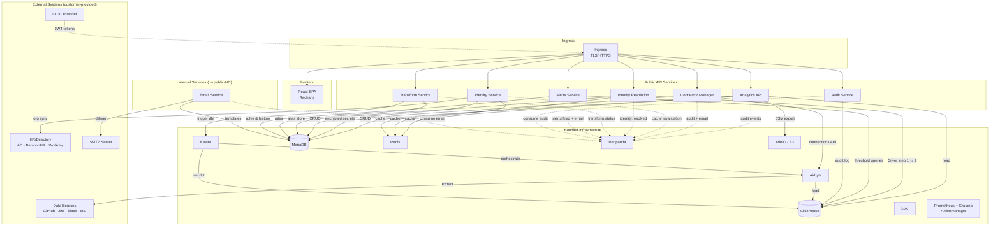
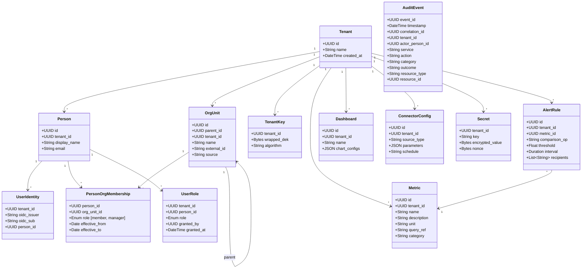
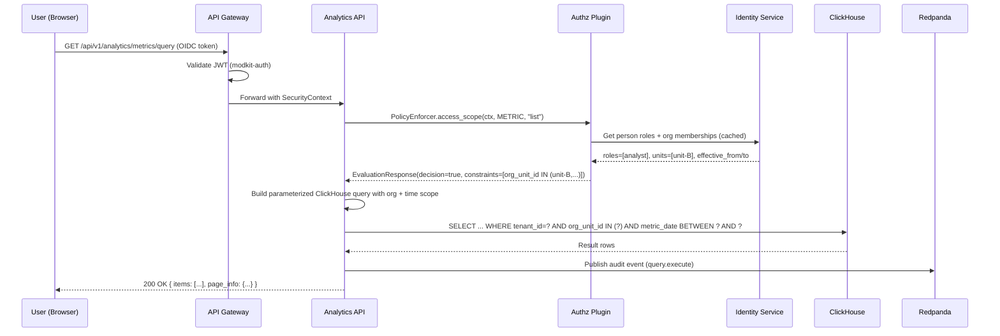
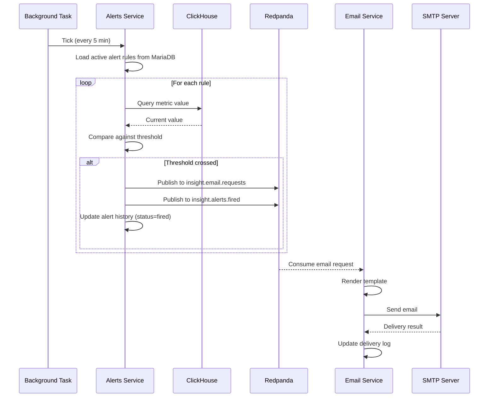
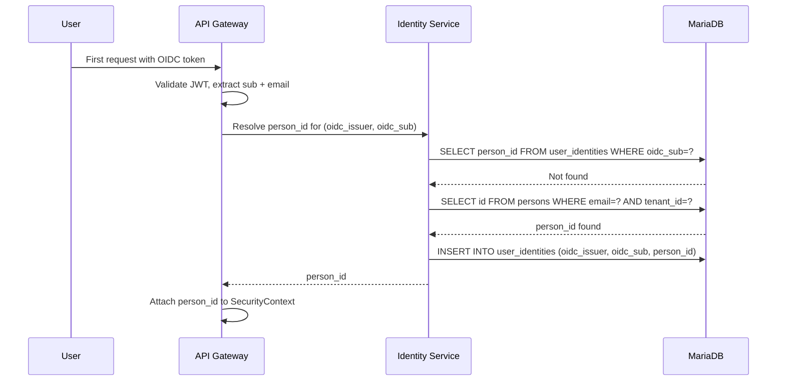

# DESIGN -- Backend

<!-- toc -->

- [1. Architecture Overview](#1-architecture-overview)
  - [1.1 Architectural Vision](#11-architectural-vision)
  - [1.2 Architecture Drivers](#12-architecture-drivers)
  - [1.3 Architecture Layers](#13-architecture-layers)
- [2. Principles & Constraints](#2-principles--constraints)
  - [2.1 Design Principles](#21-design-principles)
  - [2.2 Constraints](#22-constraints)
- [3. Technical Architecture](#3-technical-architecture)
  - [3.1 Domain Model](#31-domain-model)
  - [3.2 Component Model](#32-component-model)
  - [3.3 API Contracts](#33-api-contracts)
  - [3.4 Internal Dependencies](#34-internal-dependencies)
  - [3.5 External Dependencies](#35-external-dependencies)
  - [3.6 Interactions & Sequences](#36-interactions--sequences)
  - [3.7 Database Schemas & Tables](#37-database-schemas--tables)
  - [3.8 Event Streaming (Redpanda Topic Catalog)](#38-event-streaming-redpanda-topic-catalog)
- [4. Cross-Cutting Concerns](#4-cross-cutting-concerns)
  - [4.1 Authentication](#41-authentication)
  - [4.2 Authorization (RBAC + Org Tree)](#42-authorization-rbac--org-tree)
  - [4.3 Multi-Tenancy](#43-multi-tenancy)
  - [4.4 Caching](#44-caching)
  - [4.5 Retry Strategy](#45-retry-strategy)
  - [4.6 Graceful Shutdown](#46-graceful-shutdown)
  - [4.7 Logging](#47-logging)
  - [4.8 Observability](#48-observability)
- [5. Deployment](#5-deployment)
  - [5.1 Packaging (Helm Chart)](#51-packaging-helm-chart)
  - [5.2 Customer Installation](#52-customer-installation)
  - [5.3 Scaling](#53-scaling)
  - [5.4 Upgrades](#54-upgrades)
  - [5.5 Data Retention](#55-data-retention)
- [6. CI/CD](#6-cicd)
- [7. Testing Strategy](#7-testing-strategy)
- [8. Open Questions](#8-open-questions)
  - [OQ-BE-01: Airbyte API Integration Surface](#oq-be-01-airbyte-api-integration-surface)
  - [OQ-BE-02: Circuit Breaker Implementation](#oq-be-02-circuit-breaker-implementation)
  - [OQ-BE-03: Dashboard Sharing Model](#oq-be-03-dashboard-sharing-model)
- [9. Traceability](#9-traceability)

<!-- /toc -->

---

## 1. Architecture Overview

### 1.1 Architectural Vision

The Insight Backend is the API and business logic tier of the Decision Intelligence Platform. It provides a read API over ClickHouse Silver & Gold analytics layers, manages connector configurations and encrypted credentials, maintains the organizational hierarchy imported from HR/directory systems (Active Directory, BambooHR, Workday, or similar), delivers business alerts and audit capabilities, and centralizes email delivery.

The backend is built on **cyberfabric-core ModKit** -- a modular Rust microservice framework that provides authentication (OIDC/JWT), authorization (AuthZEN 1.0), multi-tenant data isolation, OData query capabilities, RFC 9457 error handling, and database access patterns out of the box. Each microservice is a ModKit module with its own database, its own API version, and its own client SDK crate.

The system is deployed as a **standalone product** on Kubernetes via a single Helm chart. It has no dependency on any specific cloud provider, secret management infrastructure, or identity provider beyond standard OIDC.

### 1.2 Architecture Drivers

#### Functional Drivers

| Requirement | Design Response |
|---|---|
| `cpt-insightspec-fr-be-analytics-read` | Analytics API service reads ClickHouse Silver/Gold via `clickhouse` crate with OData filtering |
| `cpt-insightspec-fr-be-metrics-catalog` | Analytics API manages metric definitions in MariaDB via modkit-db |
| `cpt-insightspec-fr-be-dashboard-config` | Analytics API stores chart/dashboard configs in MariaDB; frontend renders via Recharts |
| `cpt-insightspec-fr-be-csv-export` | Analytics API exports query results as CSV to S3 (MinIO) with 1-week expiry |
| `cpt-insightspec-fr-be-connector-crud` | Connector Manager handles connector configs in MariaDB and triggers syncs via Airbyte API |
| `cpt-insightspec-fr-be-secret-management` | Connector Manager stores secrets with envelope encryption (per-tenant DEK, KEK from env) |
| `cpt-insightspec-fr-be-org-tree-sync` | Identity Service syncs org tree from HR/directory sources (AD/LDAP, BambooHR, Workday) via pluggable adapters |
| `cpt-insightspec-fr-be-identity-resolution` | Identity Service maps OIDC sub to person_id via email-based matching |
| `cpt-insightspec-fr-be-visibility-policy` | Follow-the-unit-strict: time-scoped access per person per org unit |
| `cpt-insightspec-fr-be-rbac` | Five roles (Viewer, Analyst, Connector Admin, Identity Admin, Tenant Admin) via custom authz plugin |
| `cpt-insightspec-fr-be-business-alerts` | Alerts Service evaluates metric thresholds on schedule, sends email via Email Service |
| `cpt-insightspec-fr-be-audit-trail` | Audit Service consumes events from Redpanda, stores in ClickHouse |
| `cpt-insightspec-fr-be-email-delivery` | Email Service consumes from Redpanda, renders templates, delivers via SMTP |
| `cpt-insightspec-fr-be-oidc-auth` | modkit-auth validates OIDC/JWT tokens from customer IdP |
| `cpt-insightspec-fr-be-identity-resolution-service` | Identity Resolution Service maps cross-source aliases to canonical person_id, golden record, merge/split |
| `cpt-insightspec-fr-be-transform-rules` | Transform Service manages dbt model configs, Silver/Gold rules, field mappings, triggers dbt runs via Kestra |
| `cpt-insightspec-fr-be-forward-only-migrations` | Forward-only MariaDB migrations via modkit-db (SeaORM); no rollback scripts |
| `cpt-insightspec-fr-be-migration-on-startup` | Each service provides migration binary; executed as K8s Job (Helm pre-upgrade hook) before pod rollout |

#### NFR Allocation

| NFR | Component | Verification |
|-----|-----------|-------------|
| `cpt-insightspec-nfr-be-tenant-isolation` | modkit-db SecureConn + AccessScope, ClickHouse row-level filter | Query as tenant A; verify no tenant B data returned |
| `cpt-insightspec-nfr-be-query-safety` | Parameterized ClickHouse queries only | Code review + integration test with injection payloads |
| `cpt-insightspec-nfr-be-secret-isolation` | Per-tenant DEK envelope encryption | Compromise one tenant DEK; verify other tenants unaffected |
| `cpt-insightspec-nfr-be-rate-limiting` | api-gateway governor-based rate limiter | Load test per-route; verify 429 returned at threshold |
| `cpt-insightspec-nfr-be-graceful-shutdown` | ModKit CancellationToken + 60s grace period | Send SIGTERM; verify in-flight requests complete, offsets committed |
| `cpt-insightspec-nfr-be-retry-resilience` | Exponential backoff with jitter on all retryable ops | Kill dependency; verify recovery within retry budget |
| `cpt-insightspec-nfr-be-api-versioning` | `/api/v1/...` per service from day one | Deploy v2; verify v1 clients still work |

#### Architecture Decision Records

| ADR | Decision |
|-----|----------|
| [ADR-0001](ADR/0001-redpanda-over-kafka.md) `cpt-insightspec-adr-be-redpanda-over-kafka` | Use Redpanda over Apache Kafka -- Kafka API compatible, lower resource requirements, simpler operations |

### 1.3 Architecture Layers



**Services (8 custom + 1 infra stack)**:
- **Analytics API** — query ClickHouse, metrics catalog, dashboards, CSV export
- **Connector Manager** — connector CRUD, credentials, Airbyte API
- **Identity Service** — org tree, OIDC mapping, RBAC, HR/directory sync
- **Identity Resolution Service** — cross-source alias matching, golden records, Silver step 2
- **Transform Service** — dbt rules, Silver/Gold configs, Kestra orchestration
- **Alerts Service** — metric thresholds, email notifications
- **Audit Service** — append-only audit trail (ClickHouse)
- **Email Service** — centralized SMTP delivery (internal, no public API)
- **Observability Stack** — Prometheus + Grafana + Alertmanager (bundled infra)

## 2. Principles & Constraints

### 2.1 Design Principles

#### Service Owns Its Data

- [ ] `p1` - **ID**: `cpt-insightspec-principle-be-service-owns-data`

Each service owns its own MariaDB database. No shared schemas between services. Services interact only through SDK clients (HTTP) and Redpanda events.

**Why**: Prevents coupling between services, allows independent schema evolution and deployment.

#### Secure by Default

- [ ] `p1` - **ID**: `cpt-insightspec-principle-be-secure-by-default`

All database access goes through `SecureConn` + `AccessScope` (modkit-db). All ClickHouse queries use parameterized bind parameters only. No string interpolation in query building. Secrets encrypted with per-tenant keys.

**Why**: Eliminates entire classes of vulnerabilities (SQL injection, cross-tenant data leaks, credential exposure).

#### Two-Layer Authorization

- [ ] `p1` - **ID**: `cpt-insightspec-principle-be-two-layer-authz`

RBAC controls what actions a user can perform. Org tree controls what data a user can see (with time scoping). Both layers apply simultaneously to every request.

**Why**: Managers see their unit's metrics, not all metrics. Analysts create charts, viewers cannot. Neither layer alone is sufficient.

#### Follow the Unit (Strict)

- [ ] `p1` - **ID**: `cpt-insightspec-principle-be-follow-unit-strict`

When a person transfers between org units, data visibility follows the unit membership period. Manager A sees a transferred person's metrics only before the transfer date; Manager B sees only from the transfer date onward.

**Why**: Prevents data leakage across org boundaries even historically. Clean audit trail.

#### Event-Driven Async

- [ ] `p1` - **ID**: `cpt-insightspec-principle-be-event-driven`

Cross-service side-effects (audit logging, email delivery, cache invalidation) flow through Redpanda topics, not synchronous calls. Services remain decoupled and resilient to downstream failures.

**Why**: Audit or email downtime does not block analytics queries. Services can be deployed and scaled independently.

#### API Versioned from Day One

- [ ] `p1` - **ID**: `cpt-insightspec-principle-be-api-versioned`

Every service exposes `/api/v1/...`. Each service publishes a client SDK crate. Standalone product deployed to customer environments requires backwards-compatible upgrades.

**Why**: Customers cannot be force-upgraded. Older API versions must continue working during rolling updates.

### 2.2 Constraints

#### Standalone Deployment

- [ ] `p1` - **ID**: `cpt-insightspec-constraint-be-standalone`

The product is deployed on customer Kubernetes clusters with no dependency on specific cloud providers, external secret managers, or bundled identity providers. All infrastructure is bundled in the Helm chart.

#### OIDC-Only Authentication

- [ ] `p1` - **ID**: `cpt-insightspec-constraint-be-oidc-only`

Authentication relies entirely on the customer's OIDC provider. No bundled IdP, no user/password management within the product.

#### cyberfabric-core as Foundation

- [ ] `p1` - **ID**: `cpt-insightspec-constraint-be-cyberfabric-core`

All services are built on cyberfabric-core ModKit. Use modkit-db for MariaDB, modkit-auth for OIDC, modkit-odata for filtering, api-gateway for HTTP, authz-resolver SDK for authorization.

#### Redpanda Now, Kafka-Compatible

- [ ] `p1` - **ID**: `cpt-insightspec-constraint-be-redpanda`

Event streaming uses Redpanda with the `rdkafka` crate. Drop-in replaceable with Apache Kafka if requirements grow. No Redpanda-specific APIs.

## 3. Technical Architecture

### 3.1 Domain Model



### 3.2 Component Model

#### Analytics API

- [ ] `p2` - **ID**: `cpt-insightspec-component-be-analytics-api`

##### Why this component exists

Frontend needs a read API over ClickHouse with filtering, pagination, and export. Metric and dashboard definitions need CRUD storage in MariaDB.

##### Responsibility scope

ClickHouse read queries (Silver/Gold), metrics catalog CRUD, dashboard config CRUD, CSV export to S3. Storage: ClickHouse (read-only), MariaDB (own DB), S3 (CSV exports). Key tech: `clickhouse` crate, modkit-odata, modkit-db.

##### Responsibility boundaries

Does NOT write to ClickHouse. Does NOT manage connectors or secrets. Does NOT sync org tree.

##### Related components (by ID)

- `cpt-insightspec-component-be-identity-service` -- depends on: resolves person_id to org scope for query filtering
- `cpt-insightspec-component-be-audit-service` -- publishes to: emits audit events via Redpanda

#### Connector Manager

- [ ] `p2` - **ID**: `cpt-insightspec-component-be-connector-manager`

##### Why this component exists

Connectors need configuration (sources, schedules, parameters) and secure credential storage. Syncs are triggered via Airbyte API.

##### Responsibility scope

Connector config CRUD, secret management (envelope encryption), Airbyte API integration, sync status monitoring. Storage: MariaDB (own DB -- configs + encrypted secrets). Key tech: modkit-db, custom `db-credstore-plugin`, modkit-http (Airbyte API calls).

##### Responsibility boundaries

Does NOT run connectors directly. Does NOT access ClickHouse for analytics. Does NOT manage org tree.

##### Related components (by ID)

- `cpt-insightspec-component-be-identity-service` -- depends on: validates tenant context for connector operations
- `cpt-insightspec-component-be-email-service` -- publishes to: sends connector sync failure notifications
- `cpt-insightspec-component-be-audit-service` -- publishes to: emits audit events via Redpanda

#### Identity Service

- [ ] `p2` - **ID**: `cpt-insightspec-component-be-identity-service`

##### Why this component exists

Org-tree-based visibility requires knowing who belongs where and when. OIDC subjects must map to person records. RBAC roles must be stored.

##### Responsibility scope

Org tree sync from HR/directory sources via pluggable adapters (AD/LDAP, BambooHR API, Workday API), org tree CRUD, person-org memberships with temporal validity, OIDC-to-person_id mapping, role assignments. Storage: MariaDB (own DB -- org_units, person_org_membership, user_identities, user_roles).

##### Responsibility boundaries

Does NOT query analytics data. Does NOT manage connectors. Does NOT send emails.

##### Related components (by ID)

- `cpt-insightspec-component-be-authz-plugin` -- owns: authz plugin runs within Identity Service context
- `cpt-insightspec-component-be-analytics-api` -- publishes to: cache invalidation events when org tree or roles change

#### Authz Plugin (within Identity Service)

- [ ] `p2` - **ID**: `cpt-insightspec-component-be-authz-plugin`

##### Why this component exists

cyberfabric-core's static-authz-plugin is a dev stub. Insight needs RBAC + org-tree data scoping via a custom AuthZEN 1.0 plugin.

##### Responsibility scope

Custom `AuthZResolverPluginClient` implementation. Two-step evaluation: (1) RBAC permission check, (2) org-tree data scope constraints.

##### Responsibility boundaries

Returns `EvaluationResponse` with constraints. Does NOT enforce at the database level directly -- enforcement is via `PolicyEnforcer` to `AccessScope`.

##### Related components (by ID)

- `cpt-insightspec-component-be-identity-service` -- owned by: runs within Identity Service, reads its MariaDB tables

#### Alerts Service

- [ ] `p2` - **ID**: `cpt-insightspec-component-be-alerts-service`

##### Why this component exists

Users need business alerts when metric thresholds are crossed (e.g., "PR cycle time exceeded 5 days").

##### Responsibility scope

Alert rule CRUD, periodic threshold evaluation (query ClickHouse on schedule), publish email requests to Redpanda, alert history tracking. Storage: MariaDB (own DB -- alert rules, history). Key tech: modkit-db, `clickhouse` crate, `rdkafka` (producer).

##### Responsibility boundaries

Does NOT send emails directly. Does NOT manage org tree or connectors.

##### Related components (by ID)

- `cpt-insightspec-component-be-analytics-api` -- depends on: resolves metric definitions for threshold queries
- `cpt-insightspec-component-be-email-service` -- publishes to: sends email requests via Redpanda
- `cpt-insightspec-component-be-audit-service` -- publishes to: emits audit events and alert-fired events

#### Audit Service

- [ ] `p2` - **ID**: `cpt-insightspec-component-be-audit-service`

##### Why this component exists

Compliance requires a queryable trail of who did what, when, on which resource.

##### Responsibility scope

Consume audit events from Redpanda, store in ClickHouse, expose query API with OData filtering. Storage: ClickHouse (append-only audit log). Key tech: `clickhouse` crate, `rdkafka` (consumer), modkit-odata (query API).

##### Responsibility boundaries

Does NOT generate audit events -- other services produce them. Does NOT use MariaDB.

##### Related components (by ID)

- `cpt-insightspec-component-be-analytics-api` -- subscribes to: receives audit events
- `cpt-insightspec-component-be-connector-manager` -- subscribes to: receives audit events
- `cpt-insightspec-component-be-identity-service` -- subscribes to: receives audit events
- `cpt-insightspec-component-be-alerts-service` -- subscribes to: receives audit and alert-fired events

#### Identity Resolution Service

- [ ] `p1` - **ID**: `cpt-insightspec-component-be-identity-resolution`

##### Why this component exists

Analytics data flows through multiple connectors (GitHub, GitLab, Jira, Slack, etc.) where the same person appears under different aliases (emails, usernames, employee IDs). Cross-source analytics (e.g., correlating a person's commits with their Jira tasks) requires mapping all aliases to a canonical person_id. This is fundamentally different from org tree management (Identity Service) -- it operates on Silver data, not HR/directory sources.

##### Responsibility scope

Cross-source person alias matching (email, username, employee ID). Golden record building (assembling best-value person attributes from multiple sources). Merge and split operations with audit trail. Bootstrap job (seed identity store from `class_people` Silver table). Resolution service (enrich Silver step 1 tables with `person_id` to produce Silver step 2). Conflict detection and manual override UI. GDPR erasure support. Storage: MariaDB (own DB -- alias mappings, golden records, merge history). Reads from ClickHouse Silver step 1, writes person_id back via ClickHouse Dictionary integration. Key tech: modkit-db, `clickhouse` crate.

Full architecture documented in [Identity Resolution DESIGN](../../domain/identity-resolution/specs/DESIGN.md).

##### Responsibility boundaries

Does NOT manage org tree or RBAC roles (Identity Service). Does NOT manage OIDC-to-person mapping for authentication (Identity Service). Does NOT run connectors or manage credentials (Connector Manager). Does NOT define dbt transform rules (Transform Service).

##### Related components (by ID)

- `cpt-insightspec-component-be-identity-service` -- depends on: shares person records; org tree memberships reference person_ids produced by this service
- `cpt-insightspec-component-be-transform-service` -- depends on: transforms consume Silver step 2 (identity-resolved) tables produced by this service
- `cpt-insightspec-component-be-audit-service` -- publishes to: emits audit events for merge/split operations and manual overrides

#### Transform Service

- [ ] `p1` - **ID**: `cpt-insightspec-component-be-transform-service`

##### Why this component exists

dbt transforms operate on Silver/Gold layers and merge data across multiple connectors (e.g., `class_commits` unions GitHub + GitLab + Bitbucket). This cross-source logic is fundamentally different from per-source connector config and requires its own management surface.

##### Responsibility scope

dbt model configuration CRUD (which Bronze sources map to which `class_*` Silver tables, field mappings, union rules). Gold rule configuration (metric formulas, aggregation windows, dimensions). Dependency graph management (which transforms depend on which connectors). Trigger dbt runs via Kestra API and monitor transform status. Storage: MariaDB (own DB -- transform rules, field mappings, dependency graph). Key tech: modkit-db, modkit-http (Kestra API calls).

##### Responsibility boundaries

Does NOT run dbt directly -- delegates to Kestra. Does NOT manage connector configs or credentials (Connector Manager). Does NOT perform identity resolution across sources (Identity Resolution Service). Does NOT query analytics data for end users (Analytics API).

##### Related components (by ID)

- `cpt-insightspec-component-be-connector-manager` -- depends on: reads connector metadata to build dependency graph (which syncs feed which transforms)
- `cpt-insightspec-component-be-audit-service` -- publishes to: emits audit events for transform rule changes and dbt run triggers

#### Email Service

- [ ] `p2` - **ID**: `cpt-insightspec-component-be-email-service`

##### Why this component exists

Multiple services need to send emails. Centralizing avoids SMTP config duplication, enables retry/rate-limiting/template management in one place.

##### Responsibility scope

Consume email requests from Redpanda, render templates, deliver via SMTP, track delivery status. Storage: MariaDB (own DB -- templates, delivery log). Key tech: modkit-db, `lettre` crate (SMTP), `rdkafka` (consumer).

##### Responsibility boundaries

No public API. Purely internal (Redpanda consumer + SMTP producer). Does NOT authenticate users.

##### Related components (by ID)

- `cpt-insightspec-component-be-alerts-service` -- subscribes to: receives email requests
- `cpt-insightspec-component-be-connector-manager` -- subscribes to: receives email requests

### 3.3 API Contracts

Single Ingress routes to all services by path prefix. Each service owns its prefix and versions independently. Email Service has no public API.

```text
https://insight.customer.com/
├── /                                          → Frontend (React SPA)
│
├── /api/v1/analytics/
│   ├── GET    /metrics                        → List metrics catalog
│   ├── POST   /metrics                        → Create metric definition
│   ├── GET    /metrics/{id}                   → Get metric definition
│   ├── PUT    /metrics/{id}                   → Update metric definition
│   ├── DELETE /metrics/{id}                   → Delete metric definition
│   ├── POST   /metrics/query                  → Execute analytics query (OData)
│   ├── POST   /metrics/export                 → Trigger CSV export → returns job ID
│   ├── GET    /exports/{id}                   → Get export status / download link
│   ├── GET    /dashboards                     → List dashboards
│   ├── POST   /dashboards                     → Create dashboard
│   ├── GET    /dashboards/{id}                → Get dashboard with chart configs
│   ├── PUT    /dashboards/{id}                → Update dashboard
│   └── DELETE /dashboards/{id}                → Delete dashboard
│
├── /api/v1/connectors/
│   ├── GET    /connections                    → List configured connectors
│   ├── POST   /connections                    → Create connector config
│   ├── GET    /connections/{id}               → Get connector config
│   ├── PUT    /connections/{id}               → Update connector config
│   ├── DELETE /connections/{id}               → Delete connector config
│   ├── POST   /connections/{id}/sync          → Trigger sync
│   ├── GET    /connections/{id}/status        → Get sync status/history
│   ├── GET    /connections/{id}/secrets       → List secret keys (no values)
│   ├── PUT    /connections/{id}/secrets/{key} → Set secret value
│   └── DELETE /connections/{id}/secrets/{key} → Delete secret
│
├── /api/v1/identity/
│   ├── GET    /org-units                      → List org tree
│   ├── GET    /org-units/{id}                 → Get org unit with children
│   ├── GET    /org-units/{id}/members         → List members of org unit
│   ├── GET    /persons/{id}                   → Get person details + memberships
│   ├── GET    /persons/me                     → Current user profile + scope
│   ├── GET    /roles                          → List role assignments (Tenant Admin)
│   ├── POST   /roles                          → Assign role (Tenant Admin)
│   ├── DELETE /roles/{id}                     → Revoke role (Tenant Admin)
│   └── POST   /sync/trigger                   → Force org source sync (Identity Admin)
│
├── /api/v1/alerts/
│   ├── GET    /rules                          → List alert rules
│   ├── POST   /rules                          → Create alert rule
│   ├── GET    /rules/{id}                     → Get alert rule
│   ├── PUT    /rules/{id}                     → Update alert rule
│   ├── DELETE /rules/{id}                     → Delete alert rule
│   ├── GET    /history                        → List fired alerts
│   └── POST   /history/{id}/acknowledge       → Acknowledge alert
│
├── /api/v1/identity-resolution/
│   ├── GET    /persons                        → List resolved persons (golden records)
│   ├── GET    /persons/{id}                   → Get person golden record with all aliases
│   ├── GET    /persons/{id}/aliases           → List all aliases for a person
│   ├── POST   /persons/merge                  → Merge two person records
│   ├── POST   /persons/split                  → Split a person record
│   ├── GET    /conflicts                      → List unresolved identity conflicts
│   ├── POST   /conflicts/{id}/resolve         → Manually resolve a conflict
│   ├── POST   /bootstrap/trigger              → Trigger bootstrap job (seed from class_people)
│   └── GET    /bootstrap/status               → Get bootstrap job status
│
├── /api/v1/transforms/
│   ├── GET    /silver-rules                   → List Silver transform rules
│   ├── POST   /silver-rules                   → Create Silver transform rule
│   ├── GET    /silver-rules/{id}              → Get Silver transform rule
│   ├── PUT    /silver-rules/{id}              → Update Silver transform rule
│   ├── DELETE /silver-rules/{id}              → Delete Silver transform rule
│   ├── GET    /gold-rules                     → List Gold metric rules
│   ├── POST   /gold-rules                     → Create Gold metric rule
│   ├── GET    /gold-rules/{id}                → Get Gold metric rule
│   ├── PUT    /gold-rules/{id}                → Update Gold metric rule
│   ├── DELETE /gold-rules/{id}                → Delete Gold metric rule
│   ├── GET    /dependencies                   → Get transform dependency graph
│   ├── POST   /runs/trigger                   → Trigger dbt run via Kestra
│   └── GET    /runs/{id}/status               → Get dbt run status
│
├── /api/v1/audit/
│   └── GET    /events                         → Query audit trail (OData)
```

Ingress routing rules:
- `/` → frontend (nginx)
- `/api/v1/analytics/*` → analytics-api service
- `/api/v1/connectors/*` → connector-manager service
- `/api/v1/identity/*` → identity-service
- `/api/v1/alerts/*` → alerts-service
- `/api/v1/identity-resolution/*` → identity-resolution-service
- `/api/v1/transforms/*` → transform-service
- `/api/v1/audit/*` → audit-service

All responses use RFC 9457 Problem Details for errors. All list endpoints support OData `$filter`, `$orderby`, `$select`, cursor-based pagination per [DNA REST conventions](../../../../DNA/REST/API.md).

### 3.4 Internal Dependencies

| From | To | Protocol | Purpose |
|------|------|----------|---------|
| Analytics API | Identity Service | HTTP (SDK) | Resolve person_id → org scope for query filtering |
| Connector Manager | Identity Service | HTTP (SDK) | Validate tenant context for connector operations |
| Alerts Service | Analytics API | HTTP (SDK) | Resolve metric definitions for threshold queries |
| Identity Resolution Service | ClickHouse | SQL (clickhouse crate) | Read Silver step 1, write person_id for Silver step 2 |
| Identity Resolution Service | Identity Service | HTTP (SDK) | Share person records; org memberships reference resolved person_ids |
| Transform Service | Identity Resolution Service | Redpanda | Transforms wait for identity resolution before Silver step 2 → Gold |
| Transform Service | Connector Manager | HTTP (SDK) | Read connector metadata for dependency graph |
| Transform Service | Kestra | HTTP (modkit-http) | Trigger dbt runs and monitor status |
| All services | Audit Service | Redpanda | Emit audit events |
| Alerts Service, Connector Manager | Email Service | Redpanda | Emit email requests |
| Identity Service, Analytics API | All services | Redpanda | Cache invalidation events |

### 3.5 External Dependencies

#### cyberfabric-core Components

| Component | Used by | Purpose |
|-----------|---------|---------|
| modkit | All services | Module framework, lifecycle |
| modkit-db / modkit-db-macros | Analytics, Connector, Identity, Identity Resolution, Alerts, Transform, Email | MariaDB access via SeaORM |
| modkit-auth | Analytics, Connector, Identity, Identity Resolution, Alerts, Transform, Audit | OIDC/JWT authentication |
| modkit-odata / modkit-odata-macros | Analytics API, Audit | Query filtering, sorting, pagination |
| modkit-errors | Analytics, Connector, Identity, Identity Resolution, Alerts, Transform, Audit | RFC 9457 error responses |
| modkit-macros | All services | Domain model macros |
| modkit-sdk | All services | SDK pattern for inter-module contracts |
| modkit-security | Analytics, Connector, Identity, Identity Resolution, Alerts, Transform, Audit | Security context |
| modkit-http | Connector Manager, Transform Service | Outbound calls to Airbyte/Kestra APIs |
| api-gateway | Analytics, Connector, Identity, Identity Resolution, Alerts, Transform, Audit | Axum HTTP server, OpenAPI, CORS, rate limiting |
| authn-resolver | Analytics, Connector, Identity, Identity Resolution, Alerts, Transform, Audit | Authentication resolution |
| authz-resolver | Analytics, Connector, Identity, Identity Resolution, Alerts, Transform, Audit | Custom plugin for org-tree + RBAC access |
| tenant-resolver | Analytics, Connector, Identity, Identity Resolution, Alerts, Transform, Audit | Multi-tenant routing |
| credstore | Connector Manager | Secret management -- custom db-credstore-plugin |

#### External Crates

| Crate | Version | Used by | Purpose |
|-------|---------|---------|---------|
| `clickhouse` | latest | Analytics API, Alerts, Audit | ClickHouse async client |
| `rdkafka` | latest | All services | Kafka-compatible producer/consumer (Redpanda) |
| `lettre` | latest | Email Service | SMTP client |

#### Bundled Infrastructure

| Component | Purpose |
|-----------|---------|
| ClickHouse | Analytics storage (Bronze/Silver/Gold) + audit log |
| MariaDB | One database per service (catalog, config, secrets, org tree, alerts, email) |
| Redis | Caching + rate limiting |
| Redpanda | Event streaming (Kafka-compatible; replaceable with Kafka) |
| MinIO | S3-compatible storage for CSV exports |
| Airbyte + Kestra | Ingestion/orchestration layer (managed by [Ingestion Layer](../../domain/ingestion/specs/DESIGN.md)) |
| Loki | Log aggregation (Grafana datasource) |
| Prometheus + Grafana + Alertmanager | Ops monitoring |

#### Customer-Provided

| Component | Purpose |
|-----------|---------|
| OIDC provider | Authentication |
| HR/directory system (AD, BambooHR, Workday, etc.) | Org structure source |
| Data sources (GitHub, Jira, Slack, etc.) | Via Airbyte connectors |
| SMTP server | Email delivery |

### 3.6 Interactions & Sequences

#### SEQ-BE-01: Analytics Query with Org-Scoped Access

**ID**: `cpt-insightspec-seq-analytics-query`



#### SEQ-BE-02: Alert Threshold Evaluation

**ID**: `cpt-insightspec-seq-alert-evaluation`



#### SEQ-BE-03: First Login (OIDC to person_id Mapping)

**ID**: `cpt-insightspec-seq-first-login`



### 3.7 Database Schemas & Tables

#### Identity Service (MariaDB)

| Table | Column | Type | Description |
|-------|--------|------|-------------|
| **org_units** | id | UUID | Primary key |
| | parent_id | UUID (nullable) | Parent org unit (null for root) |
| | tenant_id | UUID | Tenant scope |
| | name | VARCHAR(255) | Display name |
| | external_id | VARCHAR(255) | ID in source system (AD DN, BambooHR ID) |
| | source | VARCHAR(50) | Source system identifier |
| **person_org_membership** | person_id | UUID | FK to persons |
| | org_unit_id | UUID | FK to org_units |
| | role | ENUM('member','manager') | Role within the unit |
| | effective_from | DATE | Start of membership |
| | effective_to | DATE (nullable) | End of membership (null = current) |
| **user_identities** | tenant_id | UUID | Tenant scope |
| | oidc_issuer | VARCHAR(255) | OIDC issuer URL |
| | oidc_sub | VARCHAR(255) | OIDC subject claim |
| | person_id | UUID | Resolved person |
| | created_at | DATETIME | First login time |
| **user_roles** | tenant_id | UUID | Tenant scope |
| | person_id | UUID | FK to persons |
| | role | ENUM('viewer','analyst','connector_admin','identity_admin','tenant_admin') | Assigned role |
| | granted_by | UUID | Who assigned the role |
| | granted_at | DATETIME | When assigned |

#### Connector Manager (MariaDB)

| Table | Column | Type | Description |
|-------|--------|------|-------------|
| **tenant_keys** | tenant_id | UUID | One DEK per tenant |
| | wrapped_dek | VARBINARY(512) | DEK encrypted with KEK |
| | algorithm | VARCHAR(20) | Encryption algorithm (AES-256-GCM) |
| | created_at | DATETIME | Key creation time |
| **secrets** | tenant_id | UUID | Tenant scope |
| | key | VARCHAR(255) | Secret reference name |
| | encrypted_value | VARBINARY(4096) | Value encrypted with tenant DEK |
| | nonce | VARBINARY(32) | AES-GCM nonce |
| | created_at | DATETIME | Creation time |
| | updated_at | DATETIME | Last update time |

#### Audit Service (ClickHouse)

```sql
CREATE TABLE insight_audit.events (
    event_id        UUID,
    timestamp       DateTime64(3, 'UTC'),
    correlation_id  UUID,
    tenant_id       UUID,

    actor_person_id UUID,
    actor_ip        IPv6,
    actor_user_agent String,

    service         LowCardinality(String),
    action          LowCardinality(String),
    category        LowCardinality(String),
    outcome         LowCardinality(String),

    resource_type   LowCardinality(String),
    resource_id     Nullable(UUID),
    resource_name   Nullable(String),

    details         String,
    change_before   Nullable(String),
    change_after    Nullable(String)
)
ENGINE = MergeTree()
PARTITION BY toYYYYMM(timestamp)
ORDER BY (tenant_id, timestamp, event_id)
TTL timestamp + INTERVAL 1 YEAR
SETTINGS index_granularity = 8192;
```

**Audit event categories**: `authentication`, `data_access`, `configuration`, `secret_access`, `identity`, `system`.

**Audit action catalog**:

| Service | Actions |
|---------|---------|
| Analytics API | `query.execute`, `query.export_csv`, `metric.create`, `metric.update`, `metric.delete`, `dashboard.create`, `dashboard.update`, `dashboard.delete`, `dashboard.view` |
| Connector Manager | `connector.create`, `connector.update`, `connector.delete`, `connector.sync_trigger`, `secret.read`, `secret.write`, `secret.rotate`, `secret.delete` |
| Identity Service | `org_unit.create`, `org_unit.update`, `org_unit.delete`, `membership.create`, `membership.update`, `membership.delete`, `role.assign`, `role.revoke`, `identity.map`, `identity.unmap`, `ldap.sync` |
| Alerts Service | `alert_rule.create`, `alert_rule.update`, `alert_rule.delete`, `alert.fire`, `alert.acknowledge`, `alert.resolve` |
| Email Service | `email.send`, `email.fail` |
| Auth (cross-cutting) | `auth.login`, `auth.logout`, `auth.token_refresh`, `auth.denied` |

### 3.8 Event Streaming (Redpanda Topic Catalog)

All async communication flows through Redpanda. All messages include `tenant_id`, `timestamp`, and `correlation_id`. Serialization: JSON with versioned message envelopes.

| Topic | Producer(s) | Consumer(s) | Payload |
|-------|------------|-------------|---------|
| `insight.audit.events` | All services | Audit Service | Audit event (see 3.7) |
| `insight.email.requests` | Alerts Service, Connector Manager | Email Service | Template + recipients + params |
| `insight.cache.invalidation` | Identity Service, Analytics API | All services | Entity type + ID to evict |
| `insight.connector.status` | Connector Manager | Alerts Service, Transform Service | Sync started/completed/failed |
| `insight.identity.resolved` | Identity Resolution Service | Transform Service | Person_id batch resolved; Silver step 2 ready for transforms |
| `insight.transform.status` | Transform Service | Alerts Service | dbt run started/completed/failed |
| `insight.alerts.fired` | Alerts Service | Audit Service | Alert triggered + metric values |

**Email request contract**:

```json
{
  "tenant_id": "uuid",
  "template": "alert_fired",
  "recipients": ["user@example.com"],
  "params": {
    "metric_name": "PR Cycle Time",
    "threshold": "5 days",
    "actual": "7.2 days"
  },
  "priority": "normal"
}
```

## 4. Cross-Cutting Concerns

### 4.1 Authentication

OIDC only -- connects to customer's existing identity provider. No bundled IdP.

- modkit-auth validates inbound JWT/OIDC tokens
- OIDC `sub` → `person_id` mapping via Identity Service `user_identities` table
- First login triggers email-based matching (see SEQ-BE-03)

### 4.2 Authorization (RBAC + Org Tree)

Two simultaneous authorization layers implemented as a custom `authz-resolver` plugin using the cyberfabric-core AuthZEN 1.0 SDK.

| Layer | Controls | Source |
|-------|----------|--------|
| RBAC | What **actions** a user can perform | `user_roles` table |
| Org tree | What **data** a user can see (time-scoped) | `person_org_membership` table |

**Roles**:

| Role | Permissions |
|------|------------|
| Viewer | View dashboards and metrics within org scope |
| Analyst | Viewer + create/edit chart configs and dashboards |
| Connector Admin | Configure connectors, manage credentials |
| Identity Admin | Edit org tree, manage identity resolution, override mappings |
| Tenant Admin | All of the above + manage role assignments, notification rules |

**Plugin evaluation flow**:

1. Look up subject's roles in `user_roles` → check if role grants the requested action on the resource type → deny if not permitted
2. Look up subject's org memberships in `person_org_membership` → compute visible org unit subtree → return `In` constraints on `org_unit_id` + time-range constraints from `effective_from/effective_to`

### 4.3 Multi-Tenancy

Single K8s deployment serves multiple tenants. Data isolation by `tenant_id` at the application layer:

- **MariaDB**: Every table includes `tenant_id`. All queries scoped via `SecureConn` + `AccessScope` (modkit-db enforces this).
- **ClickHouse**: Silver/Gold tables include `tenant_id`. Row-level filtering on all read queries.
- **Redpanda**: Messages include `tenant_id` in payload. Single topic per event type. Consumers filter by tenant.
- **Redis**: Cache keys prefixed with `tenant_id`.
- **S3**: CSV exports stored under `tenant_id/` prefix.

**Bootstrap**: Identity Service's first migration seeds a root tenant and an initial Tenant Admin user (OIDC subject configured via Helm values).

### 4.4 Caching

Each service uses Redis for caching. Separate Redis DB or instance per service.

**What is cached**: authz roles + org memberships + computed access scopes, metrics catalog, dashboard configs, OIDC-to-person_id mappings.

**Invalidation**:
- **TTL**: 5 minutes for authz, 1 hour for catalog.
- **Event-driven**: Cache invalidation events published to `insight.cache.invalidation` Redpanda topic.

### 4.5 Retry Strategy

All retryable operations use **exponential backoff with jitter**.

**Formula**: `delay = min(base * 2^attempt + random(0, jitter), max_delay)`

**Defaults**: base=100ms, max_delay=30s, jitter=0-100ms, max_attempts=5.

| Operation | Retryable | Max attempts | Base | Max delay | Notes |
|-----------|-----------|-------------|------|-----------|-------|
| Inter-service HTTP | Yes (5xx, timeout, conn refused) | 3 | 200ms | 5s | Do NOT retry 4xx |
| ClickHouse queries | Yes (conn error, timeout) | 3 | 500ms | 10s | Do NOT retry syntax errors |
| MariaDB queries | Yes (conn lost, deadlock) | 3 | 100ms | 5s | Deadlock retries include tx replay |
| Redis operations | Yes (conn error) | 3 | 100ms | 2s | Fail open on cache miss |
| Redpanda produce | Yes (broker unavailable) | 5 | 200ms | 10s | Built into rdkafka config |
| Redpanda consume | Yes (automatic) | infinite | -- | -- | rdkafka reconnects automatically |
| Org source sync (LDAP/API) | Yes (conn error, timeout) | 5 | 1s | 60s | Directory/HR systems may be slow to recover |
| Airbyte API | Yes (5xx, timeout) | 3 | 500ms | 10s | Do NOT retry 4xx |
| SMTP delivery | Yes (conn error, 4xx temp) | 5 | 1s | 30s | Dead-letter after max; do NOT retry 5xx |
| S3 upload | Yes (conn error, 5xx) | 3 | 500ms | 10s | -- |

**Implementation**: Shared `insight-retry` crate. Circuit breaker planned for v2.

**Observability**: Every retry emits `tracing::warn!`. After max attempts, emits `tracing::error!` and publishes audit event with `outcome: "failure"`.

### 4.6 Graceful Shutdown

All services follow the same shutdown sequence via ModKit's `CancellationToken`:

1. K8s sends SIGTERM → `CancellationToken` triggered
2. Stop accepting new HTTP requests → readiness probe returns 503
3. Drain in-flight HTTP requests → wait up to 30s
4. Stop background tasks → finish current iteration
5. Commit Redpanda offsets → no message loss
6. Close database connections → flush connection pools
7. Exit

K8s `terminationGracePeriodSeconds`: 60s.

### 4.7 Logging

Structured JSON to stdout (K8s standard). Collected by Loki.

**Fields**: `timestamp`, `level`, `service`, `tenant_id`, `correlation_id`, `message`, `fields`.

**Stack**: `tracing` + `tracing-subscriber` (JSON formatter) → stdout → K8s log collector → Loki → Grafana.

### 4.8 Observability

Bundled Prometheus + Grafana + Alertmanager stack for platform operators.

- Each service exposes `/health` (liveness) and `/ready` (readiness)
- Readiness checks: MariaDB, ClickHouse, Redis, Redpanda reachable (org source for Identity Service)
- Prometheus scrapes request latency, error rates, queue depths, ClickHouse query times
- Grafana dashboards for ops; Alertmanager routes to admin (email, Slack)

## 5. Deployment

### 5.1 Packaging (Helm Chart)

Single `helm install insight` deploys the entire platform. Works on any K8s cluster (AWS EKS, GCP GKE, Azure AKS, on-prem).

```text
insight-helm/
├── Chart.yaml
├── values.yaml
├── templates/
│   ├── _helpers.tpl
│   ├── analytics-api/
│   │   ├── deployment.yaml
│   │   ├── service.yaml
│   │   ├── hpa.yaml
│   │   ├── migration-job.yaml        # Helm pre-upgrade hook
│   │   └── sealedsecret.yaml
│   ├── connector-manager/
│   ├── identity-service/
│   ├── alerts-service/
│   ├── audit-service/
│   ├── email-service/
│   ├── identity-resolution-service/
│   ├── transform-service/
│   ├── frontend/
│   ├── ingress.yaml
│   └── configmaps.yaml
└── subcharts/
    ├── clickhouse/
    ├── mariadb/
    ├── redis/
    ├── redpanda/
    ├── minio/
    ├── airbyte/
    ├── kestra/
    ├── loki/
    ├── prometheus/
    └── sealed-secrets/
```

### 5.2 Customer Installation

**Prerequisites**: K8s 1.27+, `kubectl` + `helm`, domain name + TLS certificate.

**Customer provides** (via `values-override.yaml` or Sealed Secrets):

```yaml
oidc:
  issuerUrl: "https://login.customer.com/realms/main"
  clientId: "insight"

ldap:
  url: "ldaps://ad.customer.com:636"
  baseDn: "DC=customer,DC=com"
  bindDn: "CN=insight-svc,OU=Service Accounts,DC=customer,DC=com"
  bindPassword: "<sealed>"

smtp:
  host: "smtp.customer.com"
  port: 587
  username: "insight@customer.com"
  password: "<sealed>"

ingress:
  host: "insight.customer.com"
  tlsSecret: "insight-tls"

bootstrap:
  tenantName: "Customer Corp"
  adminOidcSub: "admin-user-oidc-subject"
```

**Install**:

```bash
helm repo add insight https://charts.cyberfabric.io
helm install insight insight/insight -f values-override.yaml -n insight --create-namespace
```

**Configuration per service** (env vars from Sealed Secrets):
- MariaDB DSN (own DB per service)
- ClickHouse DSN (shared, read-only for most)
- Redis DSN
- Redpanda broker URL
- OIDC issuer URL + client ID
- KEK (Connector Manager only)
- Org source connection -- LDAP URL or HR API credentials (Identity Service only)
- Airbyte API URL (Connector Manager only)
- SMTP settings (Email Service only)
- S3 endpoint + credentials (Analytics API only)

### 5.3 Scaling

- **Stateless services** (Analytics, Connector, Alerts, Identity Resolution, Transform, Audit, Email): HPA based on CPU/request rate
- **Identity Service**: HPA with leader election via K8s Lease for org source sync singleton
- **Frontend**: Static SPA via nginx, scales trivially
- **ClickHouse**: Vertical first; sharding for large deployments (future)
- **MariaDB**: Single instance for metadata workloads; read replicas if needed
- **Redis**: Single instance; Sentinel for HA

### 5.4 Upgrades

- `helm upgrade insight insight/insight -f values-override.yaml`
- **Forward-only migrations**: No rollback scripts. A broken migration is fixed by shipping a new forward migration. Destructive changes (column drops, table drops) are deferred to a follow-up migration after old code is fully decommissioned.
- **Migration execution**: Each service provides a migration binary. Migrations run as Kubernetes Jobs (Helm pre-upgrade hooks or ArgoCD sync waves) before new pods roll out. The Job must complete successfully before deployment proceeds. Migrations are idempotent.
- **Backward-compatible schemas**: Every migration must be compatible with the previous application version, allowing old and new pods to coexist during rolling deployment.
- API versioning ensures older clients work during rolling updates
- Zero-downtime via K8s rolling deployment strategy and ArgoCD sync

### 5.5 Data Retention

| Data Layer | Storage | Retention | Notes |
|-----------|---------|-----------|-------|
| Bronze (raw) | ClickHouse | Forever | Source of truth; Silver/Gold rebuildable |
| Silver (unified) | ClickHouse | Configurable per tenant (default: 2 years) | Rebuildable from Bronze |
| Gold (aggregated) | ClickHouse | Configurable per tenant (default: 2 years) | Rebuildable from Silver |
| Audit log | ClickHouse | Configurable per tenant (default: 1 year) | Compliance-driven |
| Email delivery log | MariaDB | 90 days | Auto-purged by Email Service |
| Alert history | MariaDB | Configurable per tenant (default: 1 year) | Matches audit retention |
| CSV exports | S3 | 1 week | Auto-expire via S3 lifecycle policy |

Tenant Admin can trigger Silver/Gold rebuild from Bronze via Connector Manager → Kestra/dbt pipeline.

## 6. CI/CD

**Repository structure**: Polyrepo -- one repository per service + shared libraries.

| Repository | Contents |
|-----------|----------|
| `insight-analytics-api` | Analytics API service |
| `insight-connector-manager` | Connector Manager service |
| `insight-identity-service` | Identity Service |
| `insight-alerts-service` | Alerts Service |
| `insight-audit-service` | Audit Service |
| `insight-email-service` | Email Service |
| `insight-identity-resolution-service` | Identity Resolution Service |
| `insight-transform-service` | Transform Service |
| `insight-frontend` | React SPA |
| `insight-helm` | Helm chart (subcharts, values, templates) |
| `insight-sdk` | Shared SDK crates (published to private registry) |

**Build** (GitHub Actions CI per repo):
- Lint (clippy, fmt) → Unit tests → Integration tests (testcontainers) → Build Docker image → Push to container registry

**Deployment** (ArgoCD):

```text
GitHub Actions (per service repo)
  → build + test + push image to registry
  → update image tag in insight-helm repo

ArgoCD (watches insight-helm)
  → detect change → sync → rolling deployment to K8s
```

## 7. Testing Strategy

- **Unit tests**: Per-crate, standard Rust `#[test]`. Domain logic, query builders, encryption, permission checks.
- **Integration tests**: Against real databases via testcontainers (MariaDB, ClickHouse, Redis, Redpanda). Full request → DB → response flows per service.
- **SDK contract tests**: Each service SDK crate includes contract tests to verify client-server compatibility across versions.
- **Manual QA**: End-to-end flows -- login, configure connector, view dashboard, trigger alert, verify email.

## 8. Open Questions

### OQ-BE-01: Airbyte API Integration Surface

**Question**: Which Airbyte API endpoints does Connector Manager call? Config API v1? How are connection specs passed?

**Current approach**: TBD -- requires investigation of Airbyte API during implementation.

**Owner**: TBD. **Target**: Before Connector Manager implementation begins.

### OQ-BE-02: Circuit Breaker Implementation

**Question**: Should v1 include circuit breakers per downstream dependency, or is retry-with-backoff sufficient?

**Current approach**: Retry only in v1. `insight-retry` crate designed for future circuit breaker extension.

**Owner**: TBD. **Target**: Post-v1 evaluation based on production behavior.

### OQ-BE-03: Dashboard Sharing Model

**Question**: Can dashboards be shared across users? Org-unit-scoped? Personal only?

**Current approach**: Out of scope for v1. Data model should not preclude sharing (dashboard has `tenant_id` + optional `owner_person_id`).

**Owner**: TBD. **Target**: v2 planning.

## 9. Traceability

| Design Element | Requirement / Principle |
|---|---|
| Analytics API (3.2) | `cpt-insightspec-fr-be-analytics-read`, `cpt-insightspec-fr-be-metrics-catalog`, `cpt-insightspec-fr-be-dashboard-config`, `cpt-insightspec-fr-be-csv-export` |
| Connector Manager (3.2) | `cpt-insightspec-fr-be-connector-crud`, `cpt-insightspec-fr-be-secret-management` |
| Identity Service (3.2) | `cpt-insightspec-fr-be-org-tree-sync`, `cpt-insightspec-fr-be-identity-resolution`, `cpt-insightspec-fr-be-rbac` |
| Authz Plugin (3.2) | `cpt-insightspec-fr-be-rbac`, `cpt-insightspec-fr-be-visibility-policy`, `cpt-insightspec-principle-be-two-layer-authz`, `cpt-insightspec-principle-be-follow-unit-strict` |
| Alerts Service (3.2) | `cpt-insightspec-fr-be-business-alerts` |
| Audit Service (3.2) | `cpt-insightspec-fr-be-audit-trail` |
| Identity Resolution Service (3.2) | `cpt-insightspec-fr-be-identity-resolution-service` |
| Transform Service (3.2) | `cpt-insightspec-fr-be-transform-rules` |
| Email Service (3.2) | `cpt-insightspec-fr-be-email-delivery` |
| Parameterized queries (3.2, 4.5) | `cpt-insightspec-nfr-be-query-safety`, `cpt-insightspec-principle-be-secure-by-default` |
| Envelope encryption (3.7) | `cpt-insightspec-nfr-be-secret-isolation` |
| Per-route rate limiting (4.8) | `cpt-insightspec-nfr-be-rate-limiting` |
| Graceful shutdown (4.6) | `cpt-insightspec-nfr-be-graceful-shutdown` |
| Retry strategy (4.5) | `cpt-insightspec-nfr-be-retry-resilience` |
| API versioning (3.3) | `cpt-insightspec-nfr-be-api-versioning`, `cpt-insightspec-principle-be-api-versioned` |
| Multi-tenancy (4.3) | `cpt-insightspec-nfr-be-tenant-isolation`, `cpt-insightspec-constraint-be-standalone` |
| OIDC auth (4.1) | `cpt-insightspec-fr-be-oidc-auth`, `cpt-insightspec-constraint-be-oidc-only` |
| Redpanda events (3.8) | `cpt-insightspec-principle-be-event-driven`, `cpt-insightspec-constraint-be-redpanda` |
| Service-owns-data (all) | `cpt-insightspec-principle-be-service-owns-data` |
| cyberfabric-core (3.5) | `cpt-insightspec-constraint-be-cyberfabric-core` |
