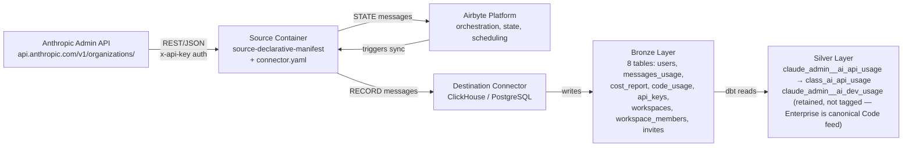
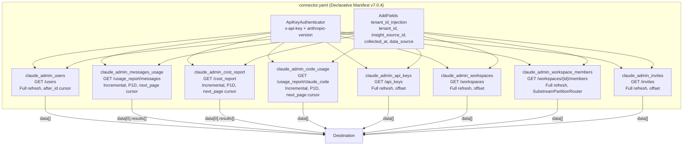
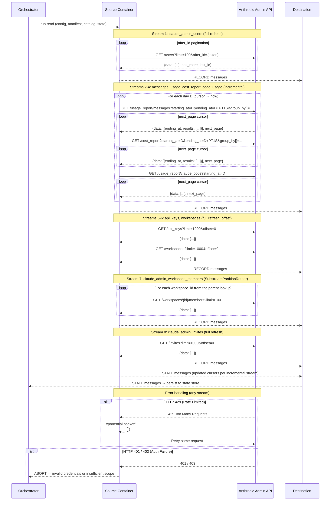

# DESIGN — Claude Admin Connector

- [ ] `p3` - **ID**: `cpt-insightspec-design-claude-admin-connector`

<!-- toc -->

- [1. Architecture Overview](#1-architecture-overview)
  - [1.1 Architectural Vision](#11-architectural-vision)
  - [1.2 Architecture Drivers](#12-architecture-drivers)
  - [1.3 Architecture Layers](#13-architecture-layers)
- [2. Principles & Constraints](#2-principles--constraints)
  - [2.1 Design Principles](#21-design-principles)
  - [2.2 Constraints](#22-constraints)
- [3. Technical Architecture](#3-technical-architecture)
  - [3.1 Domain Model](#31-domain-model)
  - [3.2 Component Model](#32-component-model)
  - [3.3 API Contracts](#33-api-contracts)
  - [3.4 Internal Dependencies](#34-internal-dependencies)
  - [3.5 External Dependencies](#35-external-dependencies)
  - [3.6 Interactions & Sequences](#36-interactions--sequences)
  - [3.7 Database schemas & tables](#37-database-schemas--tables)
  - [3.8 Deployment Topology](#38-deployment-topology)
- [4. Additional context](#4-additional-context)
  - [Identity Resolution Strategy](#identity-resolution-strategy)
  - [Silver / Gold Mappings](#silver--gold-mappings)
  - [Incremental Sync Strategy](#incremental-sync-strategy)
  - [Capacity Estimates](#capacity-estimates)
  - [Migration from claude-api and claude-team](#migration-from-claude-api-and-claude-team)
  - [Open Questions](#open-questions)
  - [Non-Applicable Domains](#non-applicable-domains)
  - [Architecture Decision Records](#architecture-decision-records)
- [5. Traceability](#5-traceability)

<!-- /toc -->

## 1. Architecture Overview

### 1.1 Architectural Vision

The Claude Admin connector is a declarative no-code ETL component implemented as an Airbyte `DeclarativeSource` manifest (`connector.yaml`). It extracts organization-level administrative data (users, workspaces, membership, invites, API keys), daily token usage, daily cost reports, and daily Claude Code usage from the Anthropic Admin API at `https://api.anthropic.com` and writes to the Bronze layer.

The connector replaces two predecessor connectors (`claude-api` and `claude-team`) that both hit the same API with the same credential. Merging them deduplicates the `workspaces` and `invites` endpoints, unifies the `data_source` discriminator to `insight_claude_admin`, and produces a single Bronze namespace `bronze_claude_admin` with 8 canonical streams.

Two dbt Silver models ship with this connector:

- `claude_admin__ai_api_usage` — Bronze `claude_admin_messages_usage` → `class_ai_api_usage` (enriched with API key names and workspace names)
- `claude_admin__ai_dev_usage` — Bronze `claude_admin_code_usage` filtered to `actor_type = 'user'`. **Not tagged for `silver:class_ai_dev_usage` as of PR #239** — Claude Enterprise (`claude_enterprise__ai_dev_usage`) is the canonical Code feed for orgs on the Enterprise subscription (per-user attribution without api_key resolution). This model is retained as the Admin-only fallback path; activate the `silver:class_ai_dev_usage` tag for tenants without Enterprise.

#### System Context



### 1.2 Architecture Drivers

**PRD**: [PRD.md](./PRD.md)

#### Functional Drivers

| Requirement | Design Response |
|-------------|-----------------|
| `cpt-insightspec-fr-claude-admin-users-collect` | Stream `claude_admin_users` → `GET /v1/organizations/users` (full refresh, `after_id` cursor pagination) |
| `cpt-insightspec-fr-claude-admin-invites-collect` | Stream `claude_admin_invites` → `GET /v1/organizations/invites` (full refresh, offset pagination). Uses `created_at` (project convention) not `invited_at`. |
| `cpt-insightspec-fr-claude-admin-messages-usage` | Stream `claude_admin_messages_usage` → `GET /v1/organizations/usage_report/messages` with 5-dim `group_by` (incremental, cursor pagination) |
| `cpt-insightspec-fr-claude-admin-cost-report` | Stream `claude_admin_cost_report` → `GET /v1/organizations/cost_report` (incremental, cursor pagination) |
| `cpt-insightspec-fr-claude-admin-usage-incremental` | `DatetimeBasedCursor` on `date`, `step: P1D`, `cursor_granularity: PT1S` on both usage/cost streams |
| `cpt-insightspec-fr-claude-admin-code-usage-collect` | Stream `claude_admin_code_usage` → `GET /v1/organizations/usage_report/claude_code` (incremental, `next_page` cursor pagination) |
| `cpt-insightspec-fr-claude-admin-code-usage-incremental` | `DatetimeBasedCursor` on `date`, `step: P1D`, date-only format `%Y-%m-%d`, `start_time_option: starting_at` (no `end_time_option`) |
| `cpt-insightspec-fr-claude-admin-keys` | Stream `claude_admin_api_keys` → `GET /v1/organizations/api_keys` (full refresh, offset pagination); flattens `created_by.{id,name,type}` via `AddFields` |
| `cpt-insightspec-fr-claude-admin-workspaces` | Stream `claude_admin_workspaces` → `GET /v1/organizations/workspaces` (full refresh, offset pagination); serializes nested `data_residency` as JSON string with `''` fallback |
| `cpt-insightspec-fr-claude-admin-workspace-members-collect` | Stream `claude_admin_workspace_members` → `GET /v1/organizations/workspaces/{id}/members` via `SubstreamPartitionRouter` parented to a workspaces lookup |
| `cpt-insightspec-fr-claude-admin-deduplication` | Primary keys: `id` (users / api_keys / workspaces / invites), `unique` (messages_usage / cost_report / code_usage / workspace_members) |
| `cpt-insightspec-fr-claude-admin-tenant-tagging` | `tenant_id_injection` definition (`AddFields`) applied to every stream — injects `tenant_id`, `insight_source_id`, `collected_at`, `data_source = 'insight_claude_admin'` |
| `cpt-insightspec-fr-claude-admin-identity-key` | `email` present on users / invites; `actor_identifier` flattened from `actor.api_key_name \|\| actor.email` on code usage |
| `cpt-insightspec-fr-claude-admin-code-usage-user-filter` | Silver model `claude_admin__ai_dev_usage` filters `WHERE actor_type = 'user'` |

#### NFR Allocation

| NFR ID | NFR Summary | Allocated To | Design Response | Verification Approach |
|--------|-------------|--------------|-----------------|----------------------|
| `cpt-insightspec-nfr-claude-admin-auth` | Admin API key auth + version header | `api_key_authenticator` definition | `ApiKeyAuthenticator` with `header: x-api-key`; `anthropic_headers` definition with `anthropic-version: 2023-06-01` | Integration test with valid/invalid keys |
| `cpt-insightspec-nfr-claude-admin-rate-limiting` | Exponential backoff on 429 | Airbyte default error handler | Framework default behaviour; can be extended per the `claude-enterprise` pattern if needed | Observed behaviour during backfill |
| `cpt-insightspec-nfr-claude-admin-data-source` | `data_source = 'insight_claude_admin'` on all rows | `tenant_id_injection` | Hard-coded constant injected into every stream | Row-level assertion in integration tests |
| `cpt-insightspec-nfr-claude-admin-idempotent` | No duplicates on re-sync | Primary key definitions | `unique` composite for usage / cost / code / members; `id` for directory tables | Run sync twice; verify row counts unchanged |
| `cpt-insightspec-nfr-claude-admin-freshness` | 48h latency | Scheduler config | Daily schedule; `start_date` lookback covers D-2 | SLA monitoring dashboard |

#### Architecture Decision Records

No new ADRs have been authored for this merged connector. Inherited decisions from the predecessor connectors (now consolidated) are captured inline in §2.2 Constraints and in the Migration section (§4):

- **Drop `inference_geo` from `group_by`** — API max-5 limit; `inference_geo` and `speed` remain nullable Bronze fields. (Inherited from the former `claude-api` ADR-001.)
- **Nested response extraction with P1D step + `AddFields` mapping** — `field_path: [data, "0", results]` for messages and cost; field name mapping `cache_read_input_tokens → cache_read_tokens`, `cache_creation.ephemeral_5m_input_tokens → cache_creation_5m_tokens`, etc. (Inherited from the former `claude-api` ADR-002.)
- **Cursor granularity `PT1S`** — avoid empty date-boundary windows; applied to all incremental streams. (Inherited from the former `claude-api` ADR-003 and `claude-team` ADR-001.)

When future decisions are made (e.g., how to route this connector's streams to class-level Silver tags, or how to handle a new Admin API field), they will be captured under `specs/ADR/`.

### 1.3 Architecture Layers

- [ ] `p3` - **ID**: `cpt-insightspec-tech-claude-admin-connector`

| Layer | Responsibility | Technology |
|-------|---------------|------------|
| Source API | Anthropic Admin API endpoints | REST / JSON (GET only) |
| Authentication | API key via `x-api-key` header | `ApiKeyAuthenticator` with `anthropic-version: 2023-06-01` request header |
| Connector | Stream definitions, pagination, incremental sync | Airbyte declarative manifest (YAML, `version: "7.0.4"`) |
| Execution | Container runtime for source and destination | Airbyte Declarative Connector framework |
| Bronze | Raw data storage with source-native schema | Destination connector (ClickHouse / PostgreSQL) |
| Silver | Bronze → class_ai_* transformations | dbt (`claude_admin__ai_api_usage`, `claude_admin__ai_dev_usage`) |

## 2. Principles & Constraints

### 2.1 Design Principles

#### Single Connector per External System

- [ ] `p1` - **ID**: `cpt-insightspec-principle-claude-admin-single-connector`

One external system (Anthropic Admin API) with one credential and one base URL is represented by one Airbyte connector, one K8s Secret, and one Bronze namespace. This principle drove the merger of the predecessor `claude-api` and `claude-team` connectors: splitting by "use case" (programmatic API vs seats/code-usage) when the underlying API and credential were identical created unjustified duplication.

#### Declarative Manifest First

- [ ] `p1` - **ID**: `cpt-insightspec-principle-claude-admin-declarative`

The connector is defined entirely as a YAML manifest using the Airbyte CDK declarative framework. No custom Python code is required. Shared patterns (authenticator, headers, paginators, tenant injection) are extracted into `definitions` and referenced via `$ref`.

#### Source-Native Schema with Selective Flattening

- [ ] `p2` - **ID**: `cpt-insightspec-principle-claude-admin-source-native-schema`

Bronze tables preserve the original Admin API field names. Nested objects are selectively flattened: `created_by.{id,name,type}` on api_keys, `actor.{type,api_key_name,email}` on code_usage, selected counters from `core_metrics` and `tool_actions`. Deep-structured objects (`data_residency`, `core_metrics`, `tool_actions`, `model_breakdown`) are also serialized to JSON-string columns (`core_metrics_json`, `tool_actions_json`, `model_breakdown_json`) for forward compatibility. Framework fields (`tenant_id`, `insight_source_id`, `collected_at`, `data_source`) are injected via the `tenant_id_injection` `AddFields` transformation.

#### Email as the Sole Cross-System Identity Key

- [ ] `p2` - **ID**: `cpt-insightspec-principle-claude-admin-email-identity`

`email` (users / invites) and `actor_identifier` (code usage, when `actor_type = 'user'`) are the only fields treated as cross-system identity keys. Anthropic's internal `id` (user ID) is retained in Bronze for debugging but is not consumed downstream for person resolution. API-key creator attribution (`created_by_id` / `created_by_name`) is a secondary signal used only when `created_by_type = 'user'`.

#### Full Refresh for Dimension Tables

- [ ] `p2` - **ID**: `cpt-insightspec-principle-claude-admin-full-refresh`

Users, API keys, workspaces, workspace members, and invites are small, slowly-changing dimension tables. Full refresh on each run ensures data consistency without the complexity of change detection on endpoints that do not expose a cursor or updated-since filter.

### 2.2 Constraints

#### API Key Authentication with Version Header

- [ ] `p2` - **ID**: `cpt-insightspec-constraint-claude-admin-api-key-auth`

The Admin API uses `x-api-key` authentication. Every request must include `anthropic-version: 2023-06-01`. The manifest uses `ApiKeyAuthenticator` with `header: x-api-key` and attaches `anthropic-version` + `Content-Type` + `Cache-Control` via the `anthropic_headers` definition.

#### All Endpoints are GET

- [ ] `p2` - **ID**: `cpt-insightspec-constraint-claude-admin-get-endpoints`

All eight endpoints use HTTP GET with query parameters for pagination, date ranges, and dimension grouping. There are no POST endpoints and no request bodies.

#### 31-Day Range Limit on Usage / Cost Endpoints

- [ ] `p2` - **ID**: `cpt-insightspec-constraint-claude-admin-date-range`

The messages-usage and cost-report endpoints enforce a maximum date range of 31 days per request. The connector uses `step: P1D` (one day per request) rather than `P31D` because Airbyte's `DatetimeBasedCursor` computes `ending_at = start + step - cursor_granularity`; with `P31D` + `P1D` granularity the boundary days are silently dropped. P1D + PT1S granularity guarantees a valid non-empty window for every day.

The cost-report and messages-usage responses are nested: `{ data: [{ ending_at, results: [...] }], next_page }`. The manifest uses `DpathExtractor` with `field_path: [data, "0", results]` to extract individual records from the single daily bucket. The `date` field is injected from `stream_interval['start_time']` via `AddFields` (the nested records do not carry a date field themselves).

#### Cursor Granularity `PT1S`

- [ ] `p2` - **ID**: `cpt-insightspec-constraint-claude-admin-cursor-granularity`

Applied to all incremental streams (messages_usage, cost_report, code_usage). Prevents the empty-window bug (`starting_at == ending_at`) that the Admin API rejects with HTTP 400. For code_usage the setting is defensive (the stream sends only `starting_at`, not `ending_at`) but consistent with the other two streams.

#### `group_by` Max 5 Dimensions

- [ ] `p2` - **ID**: `cpt-insightspec-constraint-claude-admin-group-by-limit`

The `/usage_report/messages` endpoint accepts at most 5 `group_by[]` dimensions. The manifest uses: `model`, `api_key_id`, `workspace_id`, `service_tier`, `context_window`. `inference_geo` and `speed` are not `group_by` dimensions but are retained as nullable Bronze fields (the API may return them in the record payload). Both are excluded from the `unique` composite primary key.

#### Code Usage Endpoint Accepts Only `starting_at`

- [ ] `p2` - **ID**: `cpt-insightspec-constraint-claude-admin-code-usage-params`

The `/usage_report/claude_code` endpoint uses a date-only `starting_at` parameter (`YYYY-MM-DD`). Unlike messages / cost endpoints, it does **not** accept `ending_at` or `bucket_width`. The manifest's `DatetimeBasedCursor` for this stream omits `end_time_option` and uses `datetime_format: "%Y-%m-%d"`.

#### Pagination Varies per Endpoint

- [ ] `p2` - **ID**: `cpt-insightspec-constraint-claude-admin-pagination`

The manifest defines three paginators in `definitions` and `$ref`s them per stream:

- `after_id_paginator` — `CursorPagination` driven by `response.has_more` + `response.last_id`, passed as `after_id` query param. Used by `claude_admin_users`.
- `cursor_paginator` — `CursorPagination` driven by `response.next_page` (opaque string), passed as `page` query param. Used by messages_usage, cost_report, code_usage.
- `offset_paginator` — `OffsetIncrement` with `page_size: 1000`, passed as `offset` + `limit` query params. Used by api_keys, workspaces, invites.
- Workspace members is a substream: no top-level pagination (each workspace returns a single page), iterated by `SubstreamPartitionRouter` over the workspaces parent stream.

#### Substream Pattern for Workspace Members

- [ ] `p2` - **ID**: `cpt-insightspec-constraint-claude-admin-substream`

Workspace members requires iterating over every workspace ID from `/v1/organizations/workspaces` and fetching `GET /v1/organizations/workspaces/{id}/members` for each. Implemented via `SubstreamPartitionRouter` with `parent_key: id` and `partition_field: workspace_id`. The parent stream inside the router is a standalone workspaces lookup (not a `$ref` to the top-level `claude_admin_workspaces`) to keep the substream self-contained and matching the historical `claude-team` implementation.

## 3. Technical Architecture

### 3.1 Domain Model

**Technology**: Airbyte CDK declarative streams (YAML-defined)

**Core Entities**:

| Entity | Description | Maps To |
|--------|-------------|---------|
| `User` | A seat assignment in the organization. Key: `id`. | `claude_admin_users` |
| `MessagesUsageBucket` | Daily token usage aggregate per dimensional combination. Key: composite. | `claude_admin_messages_usage` |
| `CostBucket` | Daily cost aggregate per workspace and description. Key: composite. | `claude_admin_cost_report` |
| `CodeUsage` | One user's daily Claude Code usage, flattened and with nested JSON preserved. Key: composite. | `claude_admin_code_usage` |
| `ApiKey` | API key metadata with flattened creator fields. Key: `id`. | `claude_admin_api_keys` |
| `Workspace` | Organizational workspace. Key: `id`. | `claude_admin_workspaces` |
| `WorkspaceMember` | User-to-workspace assignment. Key: composite `{user_id}:{workspace_id}`. | `claude_admin_workspace_members` |
| `Invite` | Pending organization invitation. Key: `id`. | `claude_admin_invites` |

**Relationships**:

- `Workspace` 1:N → `WorkspaceMember` (via `workspace_id`)
- `Workspace` 1:N → `ApiKey`, `Invite`, `MessagesUsageBucket`, `CostBucket` (via `workspace_id`)
- `ApiKey` 1:N → `MessagesUsageBucket` (via `api_key_id`)
- `User` ←→ `WorkspaceMember` (`user_id`) — transitive link to Workspace
- `User.email` → `person_id` via Identity Manager
- `CodeUsage.actor_identifier` (when `actor_type = 'user'`) → `person_id` via Identity Manager
- `ApiKey.created_by_id` / `created_by_name` (when `created_by_type = 'user'`) → `person_id` via Identity Manager
- `Invite.email` → `person_id` via Identity Manager

**Schema format**: Airbyte declarative manifest YAML with inline JSON Schema definitions per stream.
**Schema location**: `src/ingestion/connectors/ai/claude-admin/connector.yaml`.

### 3.2 Component Model

The Claude Admin connector is a single declarative manifest defining 8 data streams. No custom code components.

#### Component Diagram



#### Connector Package Structure

```text
src/ingestion/connectors/ai/claude-admin/
+-- connector.yaml          # Airbyte declarative manifest (nocode)
+-- descriptor.yaml         # Package metadata: namespace, schedule, dbt_select
+-- README.md               # Operator-facing documentation
+-- dbt/
    +-- schema.yml          # dbt source + model definitions
    +-- claude_admin__ai_api_usage.sql   # Bronze → class_ai_api_usage
    +-- claude_admin__ai_dev_usage.sql   # Bronze → class_ai_dev_usage (untagged — Enterprise is canonical)
```

#### Connector Package Descriptor

- [ ] `p2` - **ID**: `cpt-insightspec-component-claude-admin-descriptor`

The `descriptor.yaml` registers the connector with the platform:

```yaml
name: claude-admin
version: '1.0'
schedule: '0 2 * * *'        # daily at 02:00 UTC
dbt_select: 'tag:claude-admin+'
workflow: sync
connection:
  namespace: bronze_claude_admin
```

`dbt_select: 'tag:claude-admin+'` selects every dbt model tagged `claude-admin` and its downstream nodes. Class-level Silver tags (`silver:class_ai_api_usage`, `silver:class_ai_dev_usage`) are intentionally NOT added in this iteration — they will be introduced in a separate PR as part of the Silver framework rollout.

#### Claude Admin Connector Manifest

- [ ] `p2` - **ID**: `cpt-insightspec-component-claude-admin-manifest`

##### Why this component exists

Single YAML file defining all 8 streams, authentication, pagination, incremental sync, framework field injection, and inline JSON Schema.

##### Responsibility scope

- Declare 8 data streams with per-stream schema, retriever, paginator, and transformations.
- Authenticate with `x-api-key` header via `ApiKeyAuthenticator`.
- Attach `anthropic-version: 2023-06-01` header on every request.
- Inject framework fields (`tenant_id`, `insight_source_id`, `collected_at`, `data_source = 'insight_claude_admin'`) via the `tenant_id_injection` definition.
- Generate composite `unique` keys for usage / cost / code_usage / workspace_members via `AddFields`.
- Handle three pagination patterns (`after_id`, `next_page`, `offset`) via shared paginator definitions.
- Iterate workspace members via `SubstreamPartitionRouter` on the workspaces parent.

##### Responsibility boundaries

- Does NOT implement Silver/Gold transformations (owned by dbt models in `dbt/`).
- Does NOT implement identity resolution (owned by Identity Manager in Silver step 2).
- Does NOT implement collection run logging (owned by Argo orchestrator in Phase 1).

##### Related components (by ID)

- `cpt-insightspec-component-claude-admin-descriptor` — package metadata
- Airbyte Declarative Connector framework (`source-declarative-manifest` image) — executes this manifest
- dbt models — Bronze → Silver transformations

#### dbt Transformation Models

- [ ] `p2` - **ID**: `cpt-insightspec-component-claude-admin-dbt`

##### Why these components exist

Two SQL transformations that route the connector's usage-type Bronze streams to cross-provider Silver streams.

##### `claude_admin__ai_api_usage.sql`

Reads from `claude_admin_messages_usage`; left-joins `claude_admin_api_keys` (for `key_name`) and `claude_admin_workspaces` (for `workspace_name`). Emits derived `cache_creation_tokens`, `total_input_tokens`, `total_tokens`. Sets `data_source = 'insight_claude_admin'`. `person_id` is NULL at this stage (programmatic API usage has no direct user attribution). Materialization: `incremental`, unique key: `unique_id`.

##### `claude_admin__ai_dev_usage.sql`

Reads from `claude_admin_code_usage` filtered to `WHERE actor_type = 'user'`. Maps `actor_identifier` → `email`. Sets `data_source = 'insight_claude_admin'`, `provider = 'anthropic'`, `client = 'claude_code'`. `person_id` is NULL at this stage, resolved in Silver step 2 via Identity Manager. Materialization: `incremental`, unique key: `unique_id`.

### 3.3 API Contracts

#### Anthropic Admin API Endpoints

- [ ] `p2` - **ID**: `cpt-insightspec-interface-claude-admin-api-endpoints`

- **Contracts**: `cpt-insightspec-contract-claude-admin-anthropic-api`
- **Technology**: REST / JSON

| Stream | Endpoint | Method | Pagination | Date Params |
|--------|----------|--------|------------|-------------|
| `claude_admin_users` | `GET /v1/organizations/users` | GET | `after_id` cursor; `limit=100` | None |
| `claude_admin_messages_usage` | `GET /v1/organizations/usage_report/messages?group_by[]=...` | GET | `next_page` cursor as `page` | `starting_at`, `ending_at` (ISO 8601) |
| `claude_admin_cost_report` | `GET /v1/organizations/cost_report?group_by[]=...` | GET | `next_page` cursor as `page` | `starting_at`, `ending_at` |
| `claude_admin_code_usage` | `GET /v1/organizations/usage_report/claude_code` | GET | `next_page` cursor as `page` | `starting_at` only (date-only) |
| `claude_admin_api_keys` | `GET /v1/organizations/api_keys` | GET | Offset (`limit`, `offset`) | None |
| `claude_admin_workspaces` | `GET /v1/organizations/workspaces` | GET | Offset | None |
| `claude_admin_workspace_members` | `GET /v1/organizations/workspaces/{id}/members` | GET | None (one page per workspace) | None |
| `claude_admin_invites` | `GET /v1/organizations/invites` | GET | Offset | None |

**Response structure**:

| Stream | Response root | Records path |
|--------|--------------|--------------|
| `claude_admin_users` | `{data: [...], has_more, last_id}` | `data` |
| `claude_admin_messages_usage` | `{data: [{ending_at, results: [...]}], next_page}` | `data.0.results` |
| `claude_admin_cost_report` | `{data: [{ending_at, results: [...]}], next_page}` | `data.0.results` |
| `claude_admin_code_usage` | `{data: [...], next_page}` | `data` |
| `claude_admin_api_keys` | `{data: [...]}` | `data` |
| `claude_admin_workspaces` | `{data: [...]}` | `data` |
| `claude_admin_workspace_members` | `{data: [...]}` | `data` |
| `claude_admin_invites` | `{data: [...]}` | `data` |

**Authentication**:

- Header: `x-api-key: {admin_api_key}`
- Required header: `anthropic-version: 2023-06-01`
- Manifest: `ApiKeyAuthenticator` with `header: x-api-key`, plus `anthropic_headers` definition for the version header.

#### Source Config Schema

- [ ] `p2` - **ID**: `cpt-insightspec-interface-claude-admin-source-config`

```json
{
  "tenant_id": "Tenant isolation identifier (UUID) — required",
  "admin_api_key": "Anthropic Admin API key — required, airbyte_secret",
  "insight_source_id": "Optional connector instance identifier (default: empty string)",
  "start_date": "Optional earliest date for usage/cost/code-usage backfill (ISO 8601 or YYYY-MM-DD). Default: 90 days ago."
}
```

`tenant_id` and `admin_api_key` are required. `admin_api_key` is marked `airbyte_secret: true` and is never logged.

### 3.4 Internal Dependencies

| Component | Depends On | Interface |
|-----------|------------|-----------|
| Claude Admin Manifest | Airbyte Declarative Connector framework | Executed by `source-declarative-manifest` image |
| `claude_admin__ai_api_usage` dbt model | `claude_admin_messages_usage`, `claude_admin_api_keys`, `claude_admin_workspaces` Bronze tables | SQL read |
| `claude_admin__ai_dev_usage` dbt model | `claude_admin_code_usage` Bronze table | SQL read |
| Silver pipeline | Claude Admin Bronze tables | Reads `email` / `actor_identifier` + activity fields |
| Identity Manager (Silver step 2) | `email` / `actor_identifier` fields | Resolves email → canonical `person_id` |
| Identity seed models (`seed_persons_from_claude_admin`, `seed_aliases_from_claude_admin`, `seed_identity_inputs_from_claude_admin`) | `claude_admin_users` Bronze table | SQL read for initial person / alias seeding |

### 3.5 External Dependencies

#### Anthropic Admin API

| Dependency | Purpose | Notes |
|------------|---------|-------|
| `api.anthropic.com/v1/organizations/` | All 8 endpoints | Rate-limited; API key auth with `anthropic-version: 2023-06-01` |

#### Docker Hub Images

| Image | Purpose |
|-------|---------|
| `airbyte/source-declarative-manifest` | Executes the Claude Admin manifest |
| `airbyte/destination-clickhouse` (or other) | Writes to Bronze layer |

### 3.6 Interactions & Sequences

#### Incremental Sync Run

**ID**: `cpt-insightspec-seq-claude-admin-sync`

**Use cases**: `cpt-insightspec-usecase-claude-admin-incremental-sync`

**Actors**: `cpt-insightspec-actor-claude-admin-scheduler`



### 3.7 Database schemas & tables

Bronze tables are created by the destination (ClickHouse). In addition to the connector-defined columns, the destination adds framework columns to every table:

| Column | Type | Description |
|--------|------|-------------|
| `_airbyte_raw_id` | String | Airbyte dedup key — auto-generated |
| `_airbyte_extracted_at` | DateTime64 | Extraction timestamp — auto-generated |

#### Table: `claude_admin_users`

**ID**: `cpt-insightspec-dbtable-claude-admin-users`

| Field | Type | Description |
|-------|------|-------------|
| `tenant_id` | String | Tenant isolation key — framework-injected |
| `insight_source_id` | String | Connector instance identifier — framework-injected, DEFAULT '' |
| `id` | String | Anthropic user ID — primary key |
| `type` | String (nullable) | Record type (e.g., `user`) |
| `email` | String | User email — primary identity key → `person_id` |
| `name` | String (nullable) | User display name |
| `role` | String | `admin` / `user` / `owner` |
| `status` | String (nullable) | `active` / `inactive` / `pending` |
| `added_at` | String (nullable) | Seat assignment timestamp (ISO 8601) |
| `last_active_at` | String (nullable) | Last-observed activity (ISO 8601) |
| `collected_at` | String | Collection timestamp |
| `data_source` | String | Always `insight_claude_admin` |

**PK**: `id`. Current-state snapshot — no versioning.

---

#### Table: `claude_admin_messages_usage`

**ID**: `cpt-insightspec-dbtable-claude-admin-messages-usage`

| Field | Type | Description |
|-------|------|-------------|
| `tenant_id` | String | Tenant isolation key — framework-injected |
| `insight_source_id` | String | Connector instance identifier — framework-injected, DEFAULT '' |
| `unique` | String | Composite key: `{date}\|{model}\|{api_key_id}\|{workspace_id}\|{service_tier}\|{context_window}` |
| `date` | String | Usage date (YYYY-MM-DD), injected from stream_interval start |
| `model` | String (nullable) | Model ID (e.g. `claude-opus-4-6`) |
| `api_key_id` | String (nullable) | API key identifier |
| `workspace_id` | String (nullable) | Workspace identifier |
| `service_tier` | String (nullable) | Service tier (`scale`, `standard`) |
| `context_window` | String (nullable) | Context window size |
| `inference_geo` | String (nullable) | Not in `group_by` (max-5 cap); retained for schema forward-compat |
| `speed` | String (nullable) | Not a valid `group_by`; retained for forward-compat |
| `uncached_input_tokens` | Number | Input tokens not served from cache |
| `cache_read_tokens` | Number | Tokens served from prompt cache (from `cache_read_input_tokens`) |
| `cache_creation_5m_tokens` | Number | Tokens written to 5-minute prompt cache (from `cache_creation.ephemeral_5m_input_tokens`) |
| `cache_creation_1h_tokens` | Number | Tokens written to 1-hour prompt cache (from `cache_creation.ephemeral_1h_input_tokens`) |
| `output_tokens` | Number | Output tokens generated |
| `web_search_requests` | Number | Web search invocations (from `server_tool_use.web_search_requests`) |
| `collected_at` | String | Collection timestamp |
| `data_source` | String | Always `insight_claude_admin` |

**PK**: `unique`. Granularity: one row per `(date, model, api_key_id, workspace_id, service_tier, context_window)`.

---

#### Table: `claude_admin_cost_report`

**ID**: `cpt-insightspec-dbtable-claude-admin-cost-report`

| Field | Type | Description |
|-------|------|-------------|
| `tenant_id` | String | Framework-injected |
| `insight_source_id` | String | Framework-injected, DEFAULT '' |
| `unique` | String | Composite key: `{date}\|{workspace_id}\|{description}` |
| `date` | String | Cost date (YYYY-MM-DD), injected from stream_interval start |
| `workspace_id` | String (nullable) | Workspace ID |
| `description` | String (nullable) | Cost category description |
| `amount` | String (nullable) | Cost amount (string, USD) |
| `currency` | String (nullable) | Currency (e.g. `USD`) |
| `cost_type` | String (nullable) | Category type |
| `model` | String (nullable) | Model associated with cost line |
| `service_tier` | String (nullable) | Service tier |
| `context_window` | String (nullable) | Context window size |
| `token_type` | String (nullable) | Token type |
| `inference_geo` | String (nullable) | Inference geography |
| `collected_at` | String | Collection timestamp |
| `data_source` | String | Always `insight_claude_admin` |

**PK**: `unique`. Granularity: one row per `(date, workspace_id, description)`.

---

#### Table: `claude_admin_code_usage`

**ID**: `cpt-insightspec-dbtable-claude-admin-code-usage`

| Field | Type | Description |
|-------|------|-------------|
| `tenant_id` | String | Framework-injected |
| `insight_source_id` | String | Framework-injected, DEFAULT '' |
| `unique` | String | Composite key: `{date}\|{actor_type}\|{actor_identifier}\|{terminal_type}` |
| `date` | String | Activity date (YYYY-MM-DD), from `record.date[:10]` — cursor |
| `actor_type` | String (nullable) | `user` / `api_actor` — flattened from `actor.type` |
| `actor_identifier` | String (nullable) | email (when `user`) or API key name (when `api_actor`) — flattened from `actor.api_key_name \|\| actor.email` |
| `terminal_type` | String (nullable) | Terminal/client type |
| `customer_type` | String (nullable) | Customer type (e.g., `api`) |
| `session_count` | Number (nullable) | From `core_metrics.num_sessions` |
| `lines_added` | Number (nullable) | From `core_metrics.lines_of_code.added` |
| `lines_removed` | Number (nullable) | From `core_metrics.lines_of_code.removed` |
| `tool_use_accepted` | Number (nullable) | Sum of `tool_actions.{edit,write,multi_edit,notebook_edit}_tool.accepted` |
| `tool_use_rejected` | Number (nullable) | Sum of `tool_actions.{edit,write,multi_edit,notebook_edit}_tool.rejected` |
| `core_metrics_json` | String (JSON) (nullable) | Full `core_metrics` object |
| `tool_actions_json` | String (JSON) (nullable) | Full `tool_actions` object |
| `model_breakdown_json` | String (JSON) (nullable) | Full `model_breakdown` array (per-model tokens + estimated cost) |
| `collected_at` | String | Collection timestamp |
| `data_source` | String | Always `insight_claude_admin` |

**PK**: `unique`. Granularity: one row per `(date, actor_type, actor_identifier, terminal_type)`.

---

#### Table: `claude_admin_api_keys`

**ID**: `cpt-insightspec-dbtable-claude-admin-api-keys`

| Field | Type | Description |
|-------|------|-------------|
| `tenant_id` | String | Framework-injected |
| `insight_source_id` | String | Framework-injected, DEFAULT '' |
| `id` | String | API key identifier — primary key |
| `name` | String | API key name |
| `status` | String | `active` / `disabled` |
| `created_at` | String (nullable) | Creation timestamp |
| `created_by_id` | String (nullable) | Flattened from `created_by.id` |
| `created_by_name` | String (nullable) | Flattened from `created_by.name` |
| `created_by_type` | String (nullable) | Flattened from `created_by.type` (`user` / `api_actor` / `service_account`) |
| `workspace_id` | String (nullable) | Assigned workspace |
| `partial_key_hint` | String (nullable) | Last characters of the API key |
| `collected_at` | String | Collection timestamp |
| `data_source` | String | Always `insight_claude_admin` |

**PK**: `id`.

---

#### Table: `claude_admin_workspaces`

**ID**: `cpt-insightspec-dbtable-claude-admin-workspaces`

| Field | Type | Description |
|-------|------|-------------|
| `tenant_id` | String | Framework-injected |
| `insight_source_id` | String | Framework-injected, DEFAULT '' |
| `id` | String | Workspace ID — primary key |
| `name` | String | Workspace slug name |
| `display_name` | String (nullable) | Human-readable name |
| `created_at` | String (nullable) | Creation timestamp |
| `archived_at` | String (nullable) | Archival timestamp |
| `data_residency` | String (nullable) | Serialized JSON of nested data residency object, `''` when absent |
| `collected_at` | String | Collection timestamp |
| `data_source` | String | Always `insight_claude_admin` |

**PK**: `id`. Full refresh — one row per workspace.

---

#### Table: `claude_admin_workspace_members`

**ID**: `cpt-insightspec-dbtable-claude-admin-workspace-members`

| Field | Type | Description |
|-------|------|-------------|
| `tenant_id` | String | Framework-injected |
| `insight_source_id` | String | Framework-injected, DEFAULT '' |
| `unique` | String | Primary key: `{user_id}:{workspace_id}` |
| `type` | String (nullable) | Record type |
| `user_id` | String | Anthropic user ID — joins to `claude_admin_users.id` |
| `workspace_id` | String | Workspace ID (from parent stream partition) |
| `workspace_role` | String | Role in this workspace |
| `collected_at` | String | Collection timestamp |
| `data_source` | String | Always `insight_claude_admin` |

**PK**: `unique`. Full refresh — one row per user-workspace pair. Produced by `SubstreamPartitionRouter` over the workspaces parent lookup.

---

#### Table: `claude_admin_invites`

**ID**: `cpt-insightspec-dbtable-claude-admin-invites`

| Field | Type | Description |
|-------|------|-------------|
| `tenant_id` | String | Framework-injected |
| `insight_source_id` | String | Framework-injected, DEFAULT '' |
| `id` | String | Invite ID — primary key |
| `email` | String | Invited user's email |
| `role` | String | Invited role |
| `status` | String | Invitation status |
| `created_at` | String (nullable) | Invite creation timestamp (ISO 8601). NOTE: the legacy `claude-team` schema used `invited_at`; the merged connector standardizes on `created_at` to match the project-wide convention. |
| `expires_at` | String (nullable) | Invite expiry timestamp |
| `workspace_id` | String (nullable) | Target workspace |
| `collected_at` | String | Collection timestamp |
| `data_source` | String | Always `insight_claude_admin` |

**PK**: `id`. Full refresh — one row per invite.

---

#### Orchestrator-Produced Table: `claude_admin_collection_runs`

Produced by the Argo orchestrator pipeline, **not** by the Airbyte manifest. Monitoring table — not an analytics source.

| Field | Type | Description |
|-------|------|-------------|
| `tenant_id` | String | Framework-injected |
| `insight_source_id` | String | Framework-injected |
| `run_id` | String | Unique run identifier — primary key |
| `started_at` | DateTime | Run start time |
| `completed_at` | DateTime | Run end time |
| `status` | String | `running` / `completed` / `failed` |
| `users_collected` | Number | Rows collected for `claude_admin_users` |
| `messages_usage_collected` | Number | Rows collected for `claude_admin_messages_usage` |
| `cost_report_collected` | Number | Rows collected for `claude_admin_cost_report` |
| `code_usage_collected` | Number | Rows collected for `claude_admin_code_usage` |
| `api_keys_collected` | Number | Rows collected for `claude_admin_api_keys` |
| `workspaces_collected` | Number | Rows collected for `claude_admin_workspaces` |
| `workspace_members_collected` | Number | Rows collected for `claude_admin_workspace_members` |
| `invites_collected` | Number | Rows collected for `claude_admin_invites` |
| `api_calls` | Number | Total API calls made |
| `errors` | Number | Errors encountered |
| `settings` | String (JSON) | Collection configuration |

### 3.8 Deployment Topology

- [ ] `p3` - **ID**: `cpt-insightspec-topology-claude-admin-connector`

```text
Package: src/ingestion/connectors/ai/claude-admin/
+-- connector.yaml (declarative manifest — 8 streams)
+-- descriptor.yaml (package metadata)
+-- dbt/ (Bronze → Silver)

Connection: claude-admin-{org_name}-daily
+-- Schedule: daily 02:00 UTC (via orchestrator cron)
+-- Source image: airbyte/source-declarative-manifest
+-- Source config: {tenant_id, admin_api_key, start_date?, insight_source_id?}
+-- Streams: 8 (see §3.7)
+-- Destination: ClickHouse Bronze (namespace: bronze_claude_admin)
+-- State: per-stream cursors (date cursor for messages_usage / cost_report / code_usage)
```

## 4. Additional context

### Identity Resolution Strategy

Email is the sole cross-system identity key emitted by this connector:

- `claude_admin_users.email` — primary; one row per active seat
- `claude_admin_code_usage.actor_identifier` where `actor_type = 'user'` — secondary; daily per-user code activity
- `claude_admin_invites.email` — secondary; provides early identity signals for users not yet seated
- `claude_admin_api_keys.created_by_name` (with `created_by_type = 'user'`) — tertiary; attributes key creation to a person

Anthropic's internal `id` fields (user ID, API key creator ID) are retained in Bronze for debugging but are not used for cross-system resolution.

**Cross-platform note**: The same user typically appears in this connector (admin view), the `claude-enterprise` connector (engagement view), and IDE-tool connectors (Cursor / Windsurf). All three use `email` as the identity key and map to the same `person_id` via the Identity Manager in Silver step 2, enabling per-person aggregation across surfaces without additional join mapping.

**Seed models**: Three dbt models under `src/ingestion/dbt/identity/` seed `person.persons` and `identity.aliases` / `staging.identity_inputs_*` from `claude_admin_users`:

- `seed_persons_from_claude_admin.sql`
- `seed_aliases_from_claude_admin.sql`
- `seed_identity_inputs_from_claude_admin.sql`

These were renamed from their `claude_team` predecessors via `git mv` (history preserved).

### Silver / Gold Mappings

#### Messages Usage → `class_ai_api_usage`

| Bronze (`claude_admin_messages_usage`) | Silver (`class_ai_api_usage`) | Transformation |
|------------------------------------------|-------------------------------|---------------|
| `tenant_id` | `tenant_id` | Pass through |
| `insight_source_id` | `insight_source_id` | Pass through |
| `date` | `report_date` | Rename |
| `model` | `model` | Pass through |
| `api_key_id` | `api_key_id` | Pass through |
| — | `key_name` | LEFT JOIN `claude_admin_api_keys.name` |
| `workspace_id` | `workspace_id` | Pass through |
| — | `workspace_name` | LEFT JOIN `claude_admin_workspaces.display_name` |
| `service_tier` | `service_tier` | Pass through |
| `context_window` | `context_window` | Pass through |
| `uncached_input_tokens` | `uncached_input_tokens` | Pass through |
| `cache_read_tokens` | `cache_read_tokens` | Pass through |
| `cache_creation_5m_tokens`, `cache_creation_1h_tokens` | `cache_creation_tokens` | Sum |
| `output_tokens` | `output_tokens` | Pass through |
| `web_search_requests` | `web_search_requests` | Pass through |
| — | `total_input_tokens` | uncached + cache_read + cache_creation_5m + cache_creation_1h |
| — | `total_tokens` | total_input_tokens + output_tokens |
| — | `person_id` | NULL (no user attribution at API level) |
| — | `provider` | `'anthropic'` constant |
| `data_source` | `data_source` | `'insight_claude_admin'` |

#### Code Usage → `class_ai_dev_usage`

| Bronze (`claude_admin_code_usage`) | Silver (`class_ai_dev_usage`) | Transformation |
|-------------------------------------|-------------------------------|---------------|
| `tenant_id`, `insight_source_id` | Pass through | — |
| `date` | `report_date` | Rename |
| `actor_identifier` | `email` | Rename (filtered to `actor_type='user'`) |
| `terminal_type` | `terminal_type` | Pass through |
| `session_count` | `session_count` | Pass through |
| `lines_added` | `lines_added` | Pass through |
| `lines_removed` | `lines_removed` | Pass through |
| `tool_use_accepted` | `tool_use_accepted` | Pass through |
| `tool_use_rejected` | `tool_use_rejected` | Pass through |
| — | `person_id` | NULL at Silver step 1; resolved in step 2 |
| — | `provider` | `'anthropic'` constant |
| — | `client` | `'claude_code'` constant |
| `data_source` | `data_source` | `'insight_claude_admin'` |

Per-model token data (input / output / cache) is preserved in `model_breakdown_json` on Bronze; extraction to individual Silver columns is deferred (downstream dbt can `LATERAL FLATTEN` when needed).

#### Silver/Gold Summary

| Bronze table | Silver target | Status |
|-------------|--------------|--------|
| `claude_admin_users` | Identity Manager (`email` → `person_id`) + seed_* models | In production |
| `claude_admin_messages_usage` | `class_ai_api_usage` | In production (via `claude_admin__ai_api_usage`) |
| `claude_admin_cost_report` | `class_ai_api_usage` (cost enrichment) | Deferred (OQ-CADM-1) |
| `claude_admin_code_usage` | `class_ai_dev_usage` | Retained but **untagged** — Claude Enterprise (`claude_enterprise__ai_dev_usage`) is the canonical Code feed. Re-tag for Admin-only tenants. |
| `claude_admin_api_keys` | `class_ai_api_usage` (dimension: `key_name`) | In production (JOIN) |
| `claude_admin_workspaces` | `class_ai_api_usage` (dimension: `workspace_name`) | In production (JOIN) |
| `claude_admin_workspace_members` | No direct target | Available for future org-structure analytics |
| `claude_admin_invites` | Identity Manager input | Routed to Silver step 2 |

**Gold**: API spend per key / workspace / model / service tier; Claude Code adoption rate per team; cross-tool comparison (Claude Code vs Cursor vs Windsurf) per `person_id`; cross-provider API cost comparison (Claude vs OpenAI).

### Incremental Sync Strategy

| Stream | Sync mode | Cursor field | Cursor format | Start (first run) | End |
|--------|-----------|-------------|---------------|-------------------|-----|
| `claude_admin_users` | Full refresh | — | — | — | — |
| `claude_admin_messages_usage` | Incremental | `date` | `%Y-%m-%dT%H:%M:%SZ` | Configurable `start_date` (default 90 days ago) | Now (per-run) |
| `claude_admin_cost_report` | Incremental | `date` | `%Y-%m-%dT%H:%M:%SZ` | Same | Same |
| `claude_admin_code_usage` | Incremental | `date` | `%Y-%m-%d` | Configurable `start_date[:10]` (default 90 days ago) | Now |
| `claude_admin_api_keys` | Full refresh | — | — | — | — |
| `claude_admin_workspaces` | Full refresh | — | — | — | — |
| `claude_admin_workspace_members` | Full refresh (substream) | — | — | — | — |
| `claude_admin_invites` | Full refresh | — | — | — | — |

All incremental streams use `step: P1D` and `cursor_granularity: PT1S`. On subsequent runs, the cursor resumes from the last stored `date` position. Unlike the `claude-enterprise` connector, the Admin API has no reporting-lag upper bound — data for day `D` is queryable on day `D` (or `D+1`).

### Capacity Estimates

Expected data volumes for typical deployments (see `OQ-CADM-4` for backfill sizing):

| Stream | Volume per sync | Estimated sync time |
|--------|----------------|---------------------|
| `claude_admin_users` | 10–500 rows | < 10s |
| `claude_admin_messages_usage` | 50–500 rows/day (medium org, 10–50 keys, 3–5 models, 2–3 tiers) | < 30s/day |
| `claude_admin_cost_report` | 10–50 rows/day | < 10s/day |
| `claude_admin_code_usage` | 10–500 rows/day | < 30s/day |
| `claude_admin_api_keys` | 50–200 rows | < 5s |
| `claude_admin_workspaces` | 5–20 rows | < 5s |
| `claude_admin_workspace_members` | 10–500 rows (across all workspaces) | 5–30s (proportional to workspace count) |
| `claude_admin_invites` | 0–50 rows | < 5s |

A full daily sync for a 200-person team with 10 workspaces takes approximately 2–5 minutes total.

### Migration from claude-api and claude-team

This connector replaces two predecessors. Summary of the merge:

| Predecessor Stream | New Stream | Notes |
|--------------------|------------|-------|
| `claude_api_messages_usage` | `claude_admin_messages_usage` | Same schema; `data_source` flipped |
| `claude_api_cost_report` | `claude_admin_cost_report` | Same schema; `data_source` flipped |
| `claude_api_keys` | `claude_admin_api_keys` | Same schema; `data_source` flipped |
| `claude_api_workspaces` | `claude_admin_workspaces` | **Canonical workspaces stream** — chosen over `claude_team_workspaces` because its `data_residency` transformation uses `''` fallback (more defensive than the `claude-team` variant which used `none`) |
| `claude_api_invites` | `claude_admin_invites` | **Canonical invites stream** — chosen over `claude_team_invites` because it uses `created_at` (project-wide convention) instead of `invited_at` |
| `claude_team_users` | `claude_admin_users` | Same schema; `data_source` flipped |
| `claude_team_code_usage` | `claude_admin_code_usage` | Same schema; `data_source` flipped |
| `claude_team_workspaces` | *(removed — replaced by `claude_admin_workspaces`)* | Deduplicated |
| `claude_team_workspace_members` | `claude_admin_workspace_members` | Same schema; `data_source` flipped; parent substream lookup renamed |
| `claude_team_invites` | *(removed — replaced by `claude_admin_invites`)* | Deduplicated; `invited_at` field replaced by `created_at` |

**Data-source discriminator**: every Bronze row now carries `data_source = 'insight_claude_admin'` instead of the prior `insight_claude_api` / `insight_claude_team` split. Downstream consumers that filtered by the old values must be updated.

**Bronze namespace**: `bronze_claude_admin` replaces both `bronze_claude_api` and `bronze_claude_team`.

**dbt Silver models**: `claude_admin__ai_api_usage` replaces `to_ai_api_usage`; `claude_admin__ai_dev_usage` replaces `to_ai_dev_usage`. The `to_ai_tool_usage` placeholder (disabled model in `claude-team`) is not carried forward — the data is unavailable from this API.

**Identity seeds**: `seed_*_from_claude_team.sql` were renamed to `seed_*_from_claude_admin.sql` via `git mv`; internal references updated accordingly (Bronze source, identity source_type constants, alias field names).

**Migration safety**: this merge is acceptable despite breaking Bronze namespace names because no production data yet depends on the legacy schemas (per PRD §12 risk mitigation).

### Open Questions

See PRD §13 for the complete list. The key open items carried over from the predecessor connectors:

- **OQ-CADM-1**: Cost allocation to individual usage rows at Silver level (currently separate dimensions; proportional allocation deferred to Gold).
- **OQ-CADM-2**: Web/mobile Claude usage — not available from the Admin API; covered (partially) by the `claude-enterprise` connector.
- **OQ-CADM-3**: Unified schema for `class_ai_dev_usage` across Claude Code / Cursor / Windsurf.
- **OQ-CADM-4**: Backfill depth (current default 90 days; adaptive backfill not supported by declarative framework).
- **OQ-CADM-5**: Separate vs aggregated cache-creation token billing.

### Non-Applicable Domains

| Domain | Reason |
|--------|--------|
| **PERF (Performance)** | Batch data pipeline with native API pagination. Rate-limit handling is the only performance concern. |
| **SEC (Security)** | Authentication delegated to Airbyte framework; API key stored as `airbyte_secret`. |
| **SAFE (Safety)** | Pure data-extraction pipeline. |
| **REL (Reliability)** | Idempotent extraction via deduplication keys; framework-managed retry and state. |
| **UX (Usability)** | No user-facing interface; configuration is a K8s Secret. |
| **MAINT (Maintainability)** | Declarative YAML manifest — no custom code to maintain. |
| **COMPL (Compliance)** | Work emails are personal data; retention / deletion / access controls delegated to the destination operator. |
| **OPS (Operations)** | Deployed as a standard Airbyte connection; orchestrator produces the `collection_runs` monitoring table. |
| **TEST (Testing)** | Airbyte framework checks plus PRD §9 acceptance criteria. No custom code to unit-test. |

### Architecture Decision Records

No new ADRs have been authored for this merged connector. The inherited decisions from the predecessors are summarized in §1.2 "Architecture Decision Records" and in §2.2 Constraints. When decisions are made in the future (class-level Silver routing, volume-sharding strategy, handling of new Admin API fields), they will be captured under `specs/ADR/`.

## 5. Traceability

- **PRD**: [PRD.md](./PRD.md)
- **ADRs**: [ADR/](./ADR/) *(empty for now)*
- **Connector manifest**: `src/ingestion/connectors/ai/claude-admin/connector.yaml`
- **Connector descriptor**: `src/ingestion/connectors/ai/claude-admin/descriptor.yaml`
- **dbt source + models**: `src/ingestion/connectors/ai/claude-admin/dbt/schema.yml`, `dbt/claude_admin__ai_api_usage.sql`, `dbt/claude_admin__ai_dev_usage.sql`
- **Identity seeds**: `src/ingestion/dbt/identity/seed_{persons,aliases,identity_inputs}_from_claude_admin.sql`
- **Ad-hoc seeds**: `src/ingestion/scripts/adhoc/seed_from_claude_admin_manual.sql`
- **AI Tool domain**: [docs/components/connectors/ai/](../../)
- **Sibling connector**: [claude-enterprise](../../claude-enterprise/specs/DESIGN.md)
