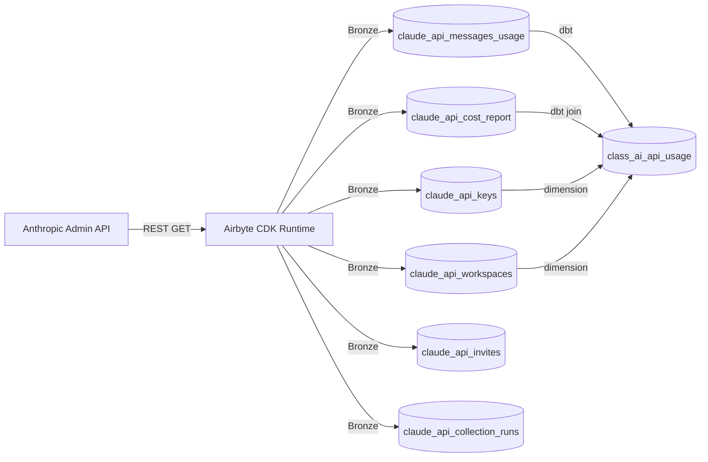
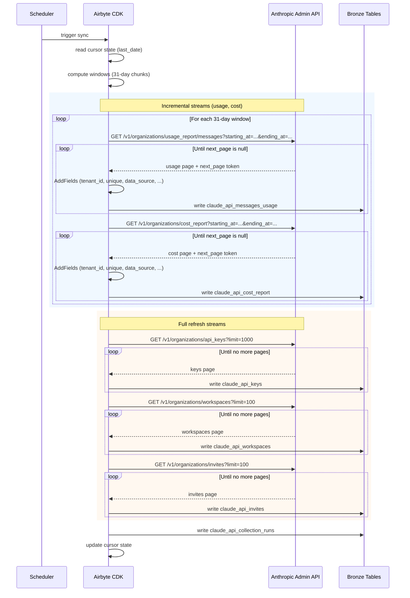

# DESIGN — Claude API Connector

- [ ] `p3` - **ID**: `cpt-insightspec-design-claude-api-connector`

> Version 2.0 — March 2026
> Based on: [PRD.md](./PRD.md), Anthropic Admin API documentation

<!-- toc -->

- [1. Architecture Overview](#1-architecture-overview)
  - [1.1 Architectural Vision](#11-architectural-vision)
  - [1.2 Architecture Drivers](#12-architecture-drivers)
  - [1.3 Architecture Layers](#13-architecture-layers)
- [2. Principles & Constraints](#2-principles--constraints)
  - [2.1 Design Principles](#21-design-principles)
  - [2.2 Constraints](#22-constraints)
- [3. Technical Architecture](#3-technical-architecture)
  - [3.1 Domain Model](#31-domain-model)
  - [3.2 Component Model](#32-component-model)
  - [3.3 API Contracts](#33-api-contracts)
  - [3.4 Internal Dependencies](#34-internal-dependencies)
  - [3.5 External Dependencies](#35-external-dependencies)
  - [3.6 Interactions & Sequences](#36-interactions--sequences)
  - [3.7 Database Schemas & Tables](#37-database-schemas--tables)
  - [3.8 Deployment Topology](#38-deployment-topology)
- [4. Additional Context](#4-additional-context)
  - [4.1 Identity Resolution](#41-identity-resolution)
  - [4.2 Silver / Gold Mappings](#42-silver--gold-mappings)
  - [4.3 Incremental Sync Strategy](#43-incremental-sync-strategy)
  - [4.4 Capacity Estimates](#44-capacity-estimates)
  - [4.5 Open Questions](#45-open-questions)
  - [OQ-DESIGN-1: Cost allocation to usage rows](#oq-design-1-cost-allocation-to-usage-rows)
  - [OQ-DESIGN-2: Cache token billing rates](#oq-design-2-cache-token-billing-rates)
  - [4.6 Non-Applicable Domains](#46-non-applicable-domains)
  - [4.7 ADRs](#47-adrs)
- [5. Traceability](#5-traceability)

<!-- /toc -->

---

## 1. Architecture Overview

### 1.1 Architectural Vision

The Claude API connector is a declarative no-code ETL component implemented as an Airbyte `DeclarativeSource` manifest (`connector.yaml`). It collects programmatic API usage and cost data from the Anthropic Admin API, writes to Bronze tables, and feeds the `class_ai_api_usage` Silver stream via a dbt transformation model.

The connector uses `data_source = 'insight_claude_api'` as a discriminator, enabling cross-provider analytics alongside OpenAI API data in the same Silver tables.



### 1.2 Architecture Drivers

**PRD Reference**: [PRD.md](./PRD.md)

#### Functional Drivers

| Requirement | Design Response |
|-------------|-----------------|
| `cpt-insightspec-fr-claude-api-messages-usage` | `claude_api_messages_usage` stream with `DatetimeBasedCursor` and cursor-based pagination |
| `cpt-insightspec-fr-claude-api-cost-report` | `claude_api_cost_report` stream with `DatetimeBasedCursor` and cursor-based pagination |
| `cpt-insightspec-fr-claude-api-keys` | `claude_api_keys` stream with offset-based pagination, full refresh |
| `cpt-insightspec-fr-claude-api-workspaces` | `claude_api_workspaces` stream with offset-based pagination, full refresh |
| `cpt-insightspec-fr-claude-api-invites` | `claude_api_invites` stream with offset-based pagination, full refresh |
| `cpt-insightspec-fr-claude-api-collection-runs` | `claude_api_collection_runs` monitoring stream (framework-managed) |
| `cpt-insightspec-fr-claude-api-framework-fields` | `AddFields` transformation injects `tenant_id`, `insight_source_id`, `data_source`, `collected_at`, `_version` |
| `cpt-insightspec-fr-claude-api-usage-unique-key` | `AddFields` generates composite `unique` key from dimensional columns |
| `cpt-insightspec-fr-claude-api-cost-unique-key` | `AddFields` generates composite `unique` key from `(date, workspace_id, description)` |

#### NFR Allocation

| NFR ID | NFR Summary | Allocated To | Design Response | Verification Approach |
|--------|-------------|--------------|-----------------|----------------------|
| `cpt-insightspec-nfr-claude-api-auth` | Admin API key auth + version header | `base_requester` | `ApiKeyAuthenticator` with `header: x-api-key`; `request_headers` with `anthropic-version` | Integration test with valid/invalid keys |
| `cpt-insightspec-nfr-claude-api-rate-limiting` | Exponential backoff on 429 | `error_handler` | `DefaultErrorHandler` with `ExponentialBackoffStrategy` | Unit test retry logic |
| `cpt-insightspec-nfr-claude-api-data-source` | `data_source = 'insight_claude_api'` on all rows | `AddFields` transformation | Hard-coded constant injected into every stream | Row-level assertion in integration tests |
| `cpt-insightspec-nfr-claude-api-idempotent` | No duplicates on re-sync | Primary key definitions | `unique` composite key for usage/cost; `id` for dimension tables | Run sync twice; verify row counts unchanged |
| `cpt-insightspec-nfr-claude-api-freshness` | 48h latency | Scheduler config | Daily schedule; lookback window covers D-2 | SLA monitoring dashboard |

#### Architecture Decision Records

| ADR ID | Decision | Impact |
|--------|----------|--------|
| `cpt-insightspec-adr-claude-api-001` | Drop `inference_geo` from `group_by` (API max-5 limit) | Unique key reduced to 6 components; inference_geo nullable in Bronze |
| `cpt-insightspec-adr-claude-api-002` | Nested response extraction with P1D step + AddFields mapping | `field_path: [data, "0", results]`; field names mapped; cost_report schema expanded |
| `cpt-insightspec-adr-claude-api-003` | Cursor granularity `PT1S` to avoid empty date-boundary windows | `cursor_granularity: PT1S` on incremental streams; prevents `starting_at == ending_at` |

### 1.3 Architecture Layers

```
+-----------------------------------------------------------------------+
|  Orchestrator / Scheduler                                              |
|  (triggers Airbyte sync)                                               |
+-----------------------------+-----------------------------------------+
                              |
+-----------------------------v-----------------------------------------+
|  Airbyte CDK Runtime (DeclarativeSource)                               |
|  +-- connector.yaml (manifest)                                         |
|  |   +-- base_requester (auth, headers, error handling)                |
|  |   +-- claude_api_messages_usage (incremental, cursor-paginated)     |
|  |   +-- claude_api_cost_report (incremental, cursor-paginated)        |
|  |   +-- claude_api_keys (full refresh, offset-paginated)              |
|  |   +-- claude_api_workspaces (full refresh, offset-paginated)        |
|  |   +-- claude_api_invites (full refresh, offset-paginated)           |
|  +-- spec (connection_specification)                                   |
+-----------------------------+-----------------------------------------+
                              |
+-----------------------------v-----------------------------------------+
|  Bronze Tables (ClickHouse)                                            |
|  claude_api_messages_usage, claude_api_cost_report,                    |
|  claude_api_keys, claude_api_workspaces,                               |
|  claude_api_invites, claude_api_collection_runs                        |
+-----------------------------+-----------------------------------------+
                              |
+-----------------------------v-----------------------------------------+
|  dbt Transformation (to_ai_api_usage.sql)                              |
|  Bronze -> Silver: class_ai_api_usage                                  |
+-----------------------------------------------------------------------+
```

| Layer | Responsibility | Technology |
|-------|---------------|------------|
| Orchestration | Trigger, schedule, run monitoring | Airbyte platform / scheduler |
| Collection | API calls, pagination, incremental cursors | Airbyte CDK (DeclarativeSource YAML) |
| Transformation | Bronze to Silver field mapping | dbt SQL model |
| Identity | Email/name to `person_id` resolution | Identity Manager (external service) |
| Storage | Bronze tables, Silver tables | ClickHouse (or configured target DB) |

---

## 2. Principles & Constraints

### 2.1 Design Principles

#### Declarative Manifest First

- [ ] `p1` - **ID**: `cpt-insightspec-principle-claude-api-declarative`

The connector is defined entirely as a YAML manifest (`connector.yaml`) using the Airbyte CDK declarative framework. No custom Python code is required. This maximizes maintainability and reduces the operational surface area.

#### Date-Range Incremental Sync

- [ ] `p1` - **ID**: `cpt-insightspec-principle-claude-api-incremental`

Usage and cost streams use `DatetimeBasedCursor` for incremental sync. The cursor tracks the last synced date, and each run fetches only new data. The API's 31-day window limit is respected by the cursor's `step` configuration.

#### Full Refresh for Dimension Tables

- [ ] `p2` - **ID**: `cpt-insightspec-principle-claude-api-full-refresh`

API keys, workspaces, and invites are small, slowly-changing dimension tables. Full refresh on each run ensures data consistency without the complexity of change detection on endpoints that do not support cursor-based filtering.

#### Framework Field Injection

- [ ] `p1` - **ID**: `cpt-insightspec-principle-claude-api-framework-fields`

All streams inject `tenant_id`, `source_instance_id`, `data_source`, and `collected_at` via `AddFields` transformations. This is consistent across all Insight connectors and enables multi-tenant operation. Note: `_version` and `metadata` (full API response JSON) are documented in Bronze table schemas for forward compatibility but are **not implemented** in the declarative manifest — the Airbyte `AddFields` transformation cannot capture the full response payload or generate deduplication versions. These fields may be added by a destination-side post-processing step if needed.

### 2.2 Constraints

#### Anthropic Admin API Only

- [ ] `p1` - **ID**: `cpt-insightspec-constraint-claude-api-admin-api`

The connector targets the Anthropic Admin API at `https://api.anthropic.com`. It requires an Admin API key (not a standard API key) with organization-level read permissions.

#### 31-Day Date Range Limit

- [ ] `p1` - **ID**: `cpt-insightspec-constraint-claude-api-date-range`

The usage and cost report endpoints enforce a maximum date range of 31 days per request. The `DatetimeBasedCursor` `step` parameter is set to `P1D` (one day per request). This is required because the API returns a nested response structure (`data[].results[]`) where each `data` element is a date bucket containing a `results` array of individual usage records. The `DpathExtractor` uses `field_path: [data, "0", results]` to extract individual records from the single bucket returned per P1D request. The `date` field is injected from `stream_interval['start_time']` since individual result records do not contain a date field. API field names are mapped via `AddFields` transformations: `cache_read_input_tokens` → `cache_read_tokens`, `cache_creation.ephemeral_5m_input_tokens` → `cache_creation_5m_tokens`, `cache_creation.ephemeral_1h_input_tokens` → `cache_creation_1h_tokens`, `server_tool_use.web_search_requests` → `web_search_requests`.

#### No Per-Request Granularity

- [ ] `p1` - **ID**: `cpt-insightspec-constraint-claude-api-no-per-request`

The Anthropic Admin API provides daily aggregated usage reports, not per-request logs. The `group_by` parameter accepts max 5 dimensions; the connector uses: `model`, `api_key_id`, `workspace_id`, `service_tier`, `context_window` (matching the reference implementation). `inference_geo` and `speed` are not included in `group_by` but are retained in the Bronze schema as nullable fields — the API may return them in the response. Both are excluded from the composite unique key. The finest granularity for the unique key is `(date, model, api_key_id, workspace_id, service_tier, context_window)`.

#### GET-Only Endpoints

- [ ] `p2` - **ID**: `cpt-insightspec-constraint-claude-api-get-only`

All Anthropic Admin API endpoints used by this connector are HTTP GET. No POST, PUT, or DELETE requests are needed.

---

## 3. Technical Architecture

### 3.1 Domain Model

**Technology**: Airbyte CDK declarative streams (YAML-defined)

**Core Entities**:

| Entity | Description | Maps To |
|--------|-------------|---------|
| `MessagesUsageBucket` | Daily token usage aggregate per dimensional combination | `claude_api_messages_usage` |
| `CostBucket` | Daily cost aggregate per workspace and description | `claude_api_cost_report` |
| `ApiKey` | API key metadata with creation context | `claude_api_keys` |
| `Workspace` | Organizational workspace definition | `claude_api_workspaces` |
| `Invite` | Pending organization invitation | `claude_api_invites` |
| `CollectionRun` | Connector execution metadata | `claude_api_collection_runs` |

**Relationships**:
- `Workspace` 1:N -> `ApiKey` (via `workspace_id`)
- `Workspace` 1:N -> `Invite` (via `workspace_id`)
- `Workspace` 1:N -> `MessagesUsageBucket` (via `workspace_id`)
- `Workspace` 1:N -> `CostBucket` (via `workspace_id`)
- `ApiKey` 1:N -> `MessagesUsageBucket` (via `api_key_id`)

### 3.2 Component Model

#### Package Structure

```
src/ingestion/connectors/ai/claude-api/
  connector.yaml          # Airbyte declarative manifest
  descriptor.yaml         # Connector package descriptor
  dbt/
    to_ai_api_usage.sql   # Bronze -> Silver transformation
    schema.yml            # dbt source/model definitions
```

#### DeclarativeSource Manifest

- [ ] `p1` - **ID**: `cpt-insightspec-component-claude-api-manifest`

##### Why this component exists

Single YAML file that defines all streams, authentication, pagination strategies, schema, and transformations for the Airbyte CDK runtime.

##### Responsibility scope

- Declares 5 data streams: `claude_api_messages_usage`, `claude_api_cost_report`, `claude_api_keys`, `claude_api_workspaces`, `claude_api_invites`.
- Defines `ApiKeyAuthenticator` with `header: x-api-key` for authentication.
- Defines `request_headers` with `anthropic-version: 2023-06-01` on each requester.
- Implements `DatetimeBasedCursor` for incremental streams (usage, cost) with `P1D` step and `PT1S` cursor granularity (see [ADR-003](./ADR/ADR-003-cursor-granularity-boundary-fix.md)).
- Implements `CursorPagination` for usage/cost streams using `next_page` token.
- Implements `OffsetIncrement` pagination for keys/workspaces/invites.
- Implements `AddFields` transformations for framework fields and composite unique keys.
- Declares inline JSON Schema for each stream.

##### Responsibility boundaries

- Does NOT implement Silver/Gold transformations (owned by dbt models).
- Does NOT implement identity resolution (owned by Identity Manager).
- Does NOT implement collection run logging (owned by framework).

##### Related components (by ID)

- `cpt-insightspec-component-claude-api-descriptor` — Connector Descriptor (package metadata)
- Identity Manager — resolves `created_by` and invite emails to `person_id` (Silver step 2)
- dbt models (`to_ai_api_usage.sql`) — Bronze → Silver transformation

#### Connector Descriptor

- [ ] `p2` - **ID**: `cpt-insightspec-component-claude-api-descriptor`

##### Why this component exists

Package metadata file that registers the connector's streams, Bronze table mappings, primary keys, cursor fields, and Silver targets with the Insight platform.

##### Responsibility scope

- Declares connector name, version, and type (`nocode`).
- Lists Silver target: `class_ai_api_usage`.
- Maps each stream to its Bronze table, primary key, and cursor field.

#### dbt Transformation Model

- [ ] `p2` - **ID**: `cpt-insightspec-component-claude-api-dbt`

##### Why this component exists

SQL transformation that maps `claude_api_messages_usage` Bronze data to the `class_ai_api_usage` Silver schema, optionally joining with `claude_api_cost_report` for cost enrichment and `claude_api_keys`/`claude_api_workspaces` for dimension enrichment.

##### Responsibility scope

- Reads from `claude_api_messages_usage` Bronze table.
- Left-joins `claude_api_cost_report` for cost data.
- Left-joins `claude_api_keys` for key name resolution.
- Left-joins `claude_api_workspaces` for workspace name resolution.
- Maps fields to `class_ai_api_usage` Silver schema.
- Injects `data_source = 'insight_claude_api'`.

### 3.3 API Contracts

- [ ] `p2` - **ID**: `cpt-insightspec-interface-claude-api-contracts`

**Technology**: Airbyte DeclarativeSource (YAML manifest)

**Contracts**: `cpt-insightspec-contract-claude-api-anthropic`, `cpt-insightspec-contract-claude-api-identity-mgr`

**Anthropic Admin API Endpoints**:

| Endpoint | Method | Pagination | Incremental | Purpose |
|----------|--------|------------|-------------|---------|
| `/v1/organizations/usage_report/messages` | GET | Cursor (`next_page`) | Date-range (`starting_at`, `ending_at`) | Daily messages usage |
| `/v1/organizations/cost_report` | GET | Cursor (`next_page`) | Date-range (`starting_at`, `ending_at`) | Daily cost report |
| `/v1/organizations/api_keys` | GET | Offset (`limit`, `offset`) | Full refresh | API key metadata |
| `/v1/organizations/workspaces` | GET | Offset (`limit`) | Full refresh | Workspace definitions |
| `/v1/organizations/invites` | GET | Offset (`limit`) | Full refresh | Organization invites |

**Connection Specification** (`spec.connection_specification`):

| Field | Type | Required | Description |
|-------|------|----------|-------------|
| `tenant_id` | string | Yes | Tenant isolation identifier (UUID) |
| `admin_api_key` | string (secret) | Yes | Anthropic Admin API key |
| `insight_source_id` | string | No | Source instance discriminator (default: empty) |
| `start_date` | string | No | Earliest date to collect (ISO 8601, default: 90 days ago) |

### 3.4 Internal Dependencies

| Dependency Module | Interface Used | Purpose |
|-------------------|----------------|---------|
| `claude_api_messages_usage` table | SQL read/write | Usage data Bronze storage |
| `claude_api_cost_report` table | SQL read/write | Cost data Bronze storage |
| `claude_api_keys` table | SQL read/write | API key dimension table |
| `claude_api_workspaces` table | SQL read/write | Workspace dimension table |
| `claude_api_invites` table | SQL read/write | Invite dimension table |
| `claude_api_collection_runs` table | SQL write | Run monitoring metadata |

**Dependency Rules**:
- No circular dependencies between streams.
- All streams write to independent Bronze tables.
- The dbt model reads from multiple Bronze tables but writes only to the Silver table.

### 3.5 External Dependencies

#### Anthropic Admin API

| Aspect | Value |
|--------|-------|
| Base URL | `https://api.anthropic.com` |
| Auth | `x-api-key: {admin_api_key}` + `anthropic-version: 2023-06-01` |
| Date format | ISO 8601 (e.g., `2026-03-01T00:00:00Z`) |
| Field naming | snake_case |
| Pagination (usage/cost) | Cursor-based: `next_page` token in response |
| Pagination (keys/workspaces/invites) | Offset-based: `limit` + `offset` parameters |
| Date range limit | 31 days maximum per request for usage/cost endpoints |

#### Identity Manager Service

| Aspect | Value |
|--------|-------|
| Interface | Internal service call |
| Input | `email`, `name`, `source_label = "anthropic"` |
| Output | `person_id` string or None |
| Criticality | Non-blocking -- unresolved identities stored with `person_id = NULL` |

#### Airbyte CDK

| Aspect | Value |
|--------|-------|
| Version | 6.2.0+ |
| Type | DeclarativeSource |
| Runtime | Python-based CDK with YAML manifest parsing |

### 3.6 Interactions & Sequences

#### Incremental Sync Run

**ID**: `cpt-insightspec-seq-claude-api-sync`

**Use cases**: `cpt-insightspec-usecase-claude-api-sync`

**Actors**: `cpt-insightspec-actor-claude-api-scheduler`



### 3.7 Database Schemas & Tables

- [ ] `p2` - **ID**: `cpt-insightspec-db-claude-api-bronze`

#### Table: `claude_api_messages_usage`

**ID**: `cpt-insightspec-dbtable-claude-api-messages-usage`

| Column | Type | Description |
|--------|------|-------------|
| `tenant_id` | String | Tenant isolation identifier (UUID) -- framework-injected |
| `source_instance_id` | String | Source instance discriminator -- framework-injected, DEFAULT '' |
| `unique` | String | Composite key: `{date}\|{model}\|{api_key_id}\|{workspace_id}\|{service_tier}\|{context_window}` |
| `date` | String | Usage date (ISO 8601 date) |
| `model` | String | Model ID (e.g., `claude-opus-4-6`, `claude-sonnet-4-6`) |
| `api_key_id` | String | API key identifier |
| `workspace_id` | String | Workspace identifier |
| `service_tier` | String | Service tier (e.g., `scale`, `standard`) |
| `context_window` | String | Context window size |
| `inference_geo` | String (nullable) | Inference geographic region — not in `group_by` (max 5 limit); retained in schema |
| `speed` | String (nullable) | Speed tier — not a valid `group_by` dimension; retained for forward compatibility |
| `uncached_input_tokens` | Integer | Input tokens not served from cache |
| `cache_read_tokens` | Integer | Tokens served from prompt cache |
| `cache_creation_5m_tokens` | Integer | Tokens written to prompt cache with 5-minute TTL |
| `cache_creation_1h_tokens` | Integer | Tokens written to prompt cache with 1-hour TTL |
| `output_tokens` | Integer | Output tokens generated |
| `web_search_requests` | Integer | Web search tool invocations |
| `collected_at` | String | Collection timestamp (ISO 8601) |
| `data_source` | String | Always `insight_claude_api` |
| `_version` | String | Deduplication version |
| `metadata` | String | Full API response as JSON |

**PK**: `unique`

**Granularity**: One row per `(date, model, api_key_id, workspace_id, service_tier, context_window)`.

---

#### Table: `claude_api_cost_report`

**ID**: `cpt-insightspec-dbtable-claude-api-cost-report`

| Column | Type | Description |
|--------|------|-------------|
| `tenant_id` | String | Tenant isolation identifier (UUID) -- framework-injected |
| `insight_source_id` | String | Source instance discriminator -- framework-injected, DEFAULT '' |
| `unique` | String | Composite key: `{date}\|{workspace_id}\|{description}` |
| `date` | String | Cost date (ISO 8601 date) |
| `workspace_id` | String | Workspace identifier |
| `description` | String | Cost category description |
| `amount` | String | Cost amount in USD (string representation) |
| `currency` | String (nullable) | Currency code (e.g., `USD`) |
| `cost_type` | String (nullable) | Cost category type (e.g., `tokens`, `web_search`) |
| `model` | String (nullable) | Model associated with the cost line |
| `service_tier` | String (nullable) | Service tier |
| `context_window` | String (nullable) | Context window size |
| `token_type` | String (nullable) | Token type (e.g., `uncached_input_tokens`, `output_tokens`, `cache_read_input_tokens`) |
| `inference_geo` | String (nullable) | Inference geography |
| `collected_at` | String | Collection timestamp (ISO 8601) |
| `data_source` | String | Always `insight_claude_api` |
| `_version` | String | Deduplication version |
| `metadata` | String | Full API response as JSON |

**PK**: `unique`

**Granularity**: One row per `(date, workspace_id, description)`.

---

#### Table: `claude_api_keys`

**ID**: `cpt-insightspec-dbtable-claude-api-keys`

| Column | Type | Description |
|--------|------|-------------|
| `tenant_id` | String | Tenant isolation identifier (UUID) -- framework-injected |
| `insight_source_id` | String | Source instance discriminator -- framework-injected, DEFAULT '' |
| `id` | String | API key identifier |
| `name` | String | API key name |
| `status` | String | Key status (e.g., `active`, `disabled`) |
| `created_at` | String | Creation timestamp (ISO 8601) |
| `created_by` | Object | Nested: `id`, `name`, `type` of the creator |
| `workspace_id` | String | Workspace the key is assigned to |
| `partial_key_hint` | String | Last characters of the API key for identification |
| `collected_at` | String | Collection timestamp (ISO 8601) |
| `data_source` | String | Always `insight_claude_api` |
| `_version` | String | Deduplication version |
| `metadata` | String | Full API response as JSON |

**PK**: `id`

---

#### Table: `claude_api_workspaces`

**ID**: `cpt-insightspec-dbtable-claude-api-workspaces`

| Column | Type | Description |
|--------|------|-------------|
| `tenant_id` | String | Tenant isolation identifier (UUID) -- framework-injected |
| `insight_source_id` | String | Source instance discriminator -- framework-injected, DEFAULT '' |
| `id` | String | Workspace identifier |
| `name` | String | Workspace name |
| `display_name` | String | Workspace display name |
| `created_at` | String | Creation timestamp (ISO 8601) |
| `archived_at` | String | Archive timestamp (ISO 8601), nullable |
| `data_residency` | Object | Nested data residency configuration |
| `collected_at` | String | Collection timestamp (ISO 8601) |
| `data_source` | String | Always `insight_claude_api` |
| `_version` | String | Deduplication version |
| `metadata` | String | Full API response as JSON |

**PK**: `id`

---

#### Table: `claude_api_invites`

**ID**: `cpt-insightspec-dbtable-claude-api-invites`

| Column | Type | Description |
|--------|------|-------------|
| `tenant_id` | String | Tenant isolation identifier (UUID) -- framework-injected |
| `insight_source_id` | String | Source instance discriminator -- framework-injected, DEFAULT '' |
| `id` | String | Invite identifier |
| `email` | String | Invitee email address |
| `role` | String | Organization role assigned |
| `status` | String | Invite status (e.g., `pending`, `accepted`) |
| `created_at` | String | Invite creation timestamp (ISO 8601) |
| `expires_at` | String | Invite expiration timestamp (ISO 8601) |
| `workspace_id` | String | Workspace the invitee is assigned to |
| `collected_at` | String | Collection timestamp (ISO 8601) |
| `data_source` | String | Always `insight_claude_api` |
| `_version` | String | Deduplication version |
| `metadata` | String | Full API response as JSON |

**PK**: `id`

---

#### Table: `claude_api_collection_runs`

**ID**: `cpt-insightspec-dbtable-claude-api-collection-runs`

| Column | Type | Description |
|--------|------|-------------|
| `tenant_id` | String | Tenant isolation identifier (UUID) -- framework-injected |
| `insight_source_id` | String | Source instance discriminator -- framework-injected, DEFAULT '' |
| `run_id` | String | Unique run identifier |
| `started_at` | String | Run start time (ISO 8601) |
| `completed_at` | String | Run end time (ISO 8601) |
| `status` | String | `running` / `completed` / `failed` |
| `messages_usage_records` | Integer | Rows collected for `claude_api_messages_usage` |
| `cost_report_records` | Integer | Rows collected for `claude_api_cost_report` |
| `keys_records` | Integer | Rows collected for `claude_api_keys` |
| `workspaces_records` | Integer | Rows collected for `claude_api_workspaces` |
| `invites_records` | Integer | Rows collected for `claude_api_invites` |
| `api_calls` | Integer | Admin API calls made |
| `errors` | Integer | Errors encountered |
| `settings` | String | Collection configuration (JSON) |
| `collected_at` | String | Collection timestamp (ISO 8601) |
| `data_source` | String | Always `insight_claude_api` |
| `_version` | String | Deduplication version |
| `metadata` | String | Full run metadata as JSON |

**PK**: `run_id`

Monitoring table -- not an analytics source.

---

### 3.8 Deployment Topology

The connector is deployed as a standard Airbyte source connector. The YAML manifest is loaded by the Airbyte CDK runtime within the Airbyte platform. No custom Docker image or Python code is required.

| Component | Deployment | Notes |
|-----------|-----------|-------|
| `connector.yaml` | Airbyte source definition | Declarative manifest |
| `descriptor.yaml` | Platform registry | Connector metadata |
| `dbt/to_ai_api_usage.sql` | dbt project | Silver transformation |
| `dbt/schema.yml` | dbt project | Source and model definitions |

---

## 4. Additional Context

### 4.1 Identity Resolution

Identity resolution is limited for the Claude API connector:

- **Messages usage**: No user-level attribution. Usage is attributable only to `api_key_id` and `workspace_id`.
- **Cost report**: No user-level attribution. Cost is attributable only to `workspace_id` and `description`.
- **API keys**: `created_by.id` and `created_by.name` can be resolved to `person_id` when `created_by.type = 'user'`. This enables "who created this key" analytics.
- **Invites**: `email` can be resolved to `person_id` via the Identity Manager.
- **Workspaces**: No user-level fields.

The mapping from `created_by` fields and invite emails to `person_id` is handled by the Identity Manager in the Silver pipeline, not by the connector itself.

### 4.2 Silver / Gold Mappings

#### Messages Usage to `class_ai_api_usage`

| Bronze Field (`claude_api_messages_usage`) | Silver Field (`class_ai_api_usage`) | Transformation |
|--------------------------------------------|-------------------------------------|---------------|
| `tenant_id` | `tenant_id` | Pass through |
| `date` | `report_date` | Rename |
| `model` | `model` | Pass through |
| `api_key_id` | `api_key_id` | Pass through |
| `workspace_id` | `workspace_id` | Pass through |
| -- | `workspace_name` | JOIN `claude_api_workspaces.display_name` |
| -- | `api_key_name` | JOIN `claude_api_keys.name` |
| `service_tier` | `service_tier` | Pass through |
| `context_window` | `context_window` | Pass through |
| `uncached_input_tokens` | `uncached_input_tokens` | Pass through |
| `cache_read_tokens` | `cache_read_tokens` | Pass through |
| `cache_creation_5m_tokens` | `cache_creation_tokens` | `cache_creation_5m_tokens + cache_creation_1h_tokens` |
| `output_tokens` | `output_tokens` | Pass through |
| `web_search_requests` | `web_search_requests` | Pass through |
| -- | `total_input_tokens` | `uncached_input_tokens + cache_read_tokens + cache_creation_5m_tokens + cache_creation_1h_tokens` |
| -- | `total_tokens` | `uncached_input_tokens + cache_read_tokens + cache_creation_5m_tokens + cache_creation_1h_tokens + output_tokens` |
| -- | `cost_cents` | JOIN `claude_api_cost_report` (approximate; see OQ) |
| `data_source` | `data_source` | `'insight_claude_api'` |
| -- | `provider` | `'anthropic'` (constant) |
| -- | `person_id` | NULL (no user attribution at API level) |
| `source_instance_id` | `source_instance_id` | Pass through |

#### Silver/Gold Summary

| Bronze table | Silver target | Status |
|-------------|--------------|--------|
| `claude_api_messages_usage` | `class_ai_api_usage` | Planned -- primary usage feed |
| `claude_api_cost_report` | `class_ai_api_usage` (cost enrichment) | Planned -- joined for cost data |
| `claude_api_keys` | `class_ai_api_usage` (dimension) | Planned -- key name enrichment |
| `claude_api_workspaces` | `class_ai_api_usage` (dimension) | Planned -- workspace name enrichment |
| `claude_api_invites` | None (identity resolution input) | Planned -- feeds Identity Manager |

**Gold**: AI API cost analytics (spend per API key, per workspace, per model, per service tier), usage trends, cache efficiency metrics, cross-provider comparison with OpenAI API data.

### 4.3 Incremental Sync Strategy

**Usage and cost streams**:
- Cursor field: `date`
- Cursor granularity: `PT1S` (one second; prevents empty date-boundary windows — see [ADR-003](./ADR/ADR-003-cursor-granularity-boundary-fix.md))
- Step size: `P1D` (one day per request — see ADR-002 for nested response extraction)
- Lookback: configurable `start_date` for first run; subsequent runs start from last cursor + 1 day
- No billing period boundary issues: Anthropic API data is finalized daily

**Full refresh streams** (keys, workspaces, invites):
- No cursor; full refresh on every run
- Small dataset sizes make full refresh efficient
- Upsert semantics prevent duplicates

**Date windowing example** (P1D step, PT1S granularity, one day per request):
1. `starting_at=2026-03-25T00:00:00Z`, `ending_at=2026-03-25T23:59:59Z`
2. `starting_at=2026-03-26T00:00:00Z`, `ending_at=2026-03-26T23:59:59Z`
3. `starting_at=2026-03-27T00:00:00Z`, `ending_at=2026-03-27T23:59:59Z`
4. ... (one request per day until today, inclusive)

### 4.4 Capacity Estimates

| Metric | Estimate | Assumption |
|--------|----------|------------|
| Messages usage rows/day | 50-500 | Medium org with 10-50 API keys, 3-5 models, 2-3 service tiers |
| Cost report rows/day | 10-50 | Medium org with 5-10 workspaces, 3-5 cost categories |
| API keys (total) | 50-200 | Medium org |
| Workspaces (total) | 5-20 | Medium org |
| Invites (total) | 10-50 | Medium org |
| API calls per daily sync | 10-30 | 2-5 pages per stream, 5 streams |
| Sync duration | 1-5 minutes | Including pagination and backoff |

### 4.5 Open Questions

### OQ-DESIGN-1: Cost allocation to usage rows

**Question**: The cost report provides workspace-level daily costs by description category. Usage reports provide dimensional breakdowns by model, API key, etc. How should cost be allocated to individual usage rows in the Silver table?

**Options**:
1. Leave cost as a separate dimension; do not attempt per-row allocation.
2. Proportional allocation based on token volume within each workspace-day.
3. Direct join on `(date, workspace_id)` with cost spread evenly across usage rows.

**Current approach**: Option 1 (separate dimension); cost allocation deferred to Gold analytics.

### OQ-DESIGN-2: Cache token billing rates

**Question**: Are `cache_creation_5m_tokens` and `cache_creation_1h_tokens` billed at different rates? Should they be kept separate or aggregated in the Silver table?

**Current approach**: Keep separate in Bronze; aggregate to `cache_creation_tokens` in Silver for simplicity; retain both in `metadata` for future disaggregation.

### 4.6 Non-Applicable Domains

| Domain | Disposition | Reason |
|--------|-------------|--------|
| PERF-DESIGN-002 -- Scalability Architecture | Not applicable | Scheduled batch pull job. Dataset sizes are small (hundreds of rows per day). |
| SEC-DESIGN-003 -- Data Protection (tokens at rest) | Deferred to deployment | Token storage and credential encryption are controlled by the deployment platform. |
| SEC-DESIGN-005 -- Threat Modeling | Not applicable | Internal tool collecting API usage metadata from the organization's own Anthropic account. |
| REL-DESIGN-004 -- Recovery Architecture | Not applicable | No persistent state beyond Bronze table rows. Recovery = re-run from cursor. |
| DATA-DESIGN-003 -- Data Governance | Not applicable | Data lineage and catalog integration are owned by the Gold-layer platform team. |
| INT-DESIGN-003 -- Event Architecture | Not applicable | Pull-only batch connector. No event bus or pub/sub. |
| INT-DESIGN-004 -- API Versioning/Evolution | Not applicable | Single stable external API; versioned via `anthropic-version` header. |
| OPS-DESIGN-001 -- Deployment Architecture | Not applicable | Deployed as standard Airbyte source; no custom infrastructure. |
| OPS-DESIGN-002 -- Observability Architecture | Not applicable | Logging owned by Airbyte platform; run metadata in `claude_api_collection_runs`. |
| OPS-DESIGN-003 -- Infrastructure as Code | Not applicable | IaC owned by platform infrastructure team. |
| OPS-DESIGN-004 -- SLO / Observability Targets | Not applicable | SLOs defined at platform level. |
| MAINT-DESIGN-002 -- Technical Debt | Not applicable | New design; no known technical debt. |
| MAINT-DESIGN-003 -- Documentation Strategy | Not applicable | Documentation strategy owned by platform-level PRD. |
| TEST-DESIGN-002 -- Testing Strategy | Deferred to DECOMPOSITION | Test approach documented when implementation is planned. |
| COMPL-DESIGN-001 -- Compliance Architecture | Not applicable | Collects API usage metadata only; no PII or prompt content. |
| COMPL-DESIGN-002 -- Privacy Architecture | Not applicable | No personal data collected; API key names and invite emails are organizational data. |
| UX-DESIGN-001 -- User-Facing Architecture | Not applicable | YAML manifest for platform engineers only. |
| ARCH-DESIGN-010 -- Capacity and Cost Budgets | Not applicable | Bounded by Anthropic API rate limits and small dataset sizes. |

### 4.7 ADRs

| ADR | Title | Status |
|-----|-------|--------|
| [ADR-001](./ADR/ADR-001-group-by-limit-inference-geo.md) (`cpt-insightspec-adr-claude-api-001`) | Drop `inference_geo` from `group_by` dimensions (API max-5 limit) | Accepted |
| [ADR-002](./ADR/ADR-002-api-response-structure.md) (`cpt-insightspec-adr-claude-api-002`) | API response structure — nested records, field mapping, cost_report schema expansion | Accepted |
| [ADR-003](./ADR/ADR-003-cursor-granularity-boundary-fix.md) (`cpt-insightspec-adr-claude-api-003`) | Cursor granularity `PT1S` to avoid empty date-boundary windows | Accepted |

---

## 5. Traceability

- **PRD**: [PRD.md](./PRD.md)
- **Connector manifest**: `src/ingestion/connectors/ai/claude-api/connector.yaml`
- **Connector descriptor**: `src/ingestion/connectors/ai/claude-api/descriptor.yaml`
- **dbt transformation**: `src/ingestion/connectors/ai/claude-api/dbt/to_ai_api_usage.sql`
- **dbt schema**: `src/ingestion/connectors/ai/claude-api/dbt/schema.yml`
