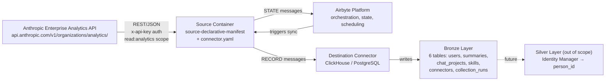
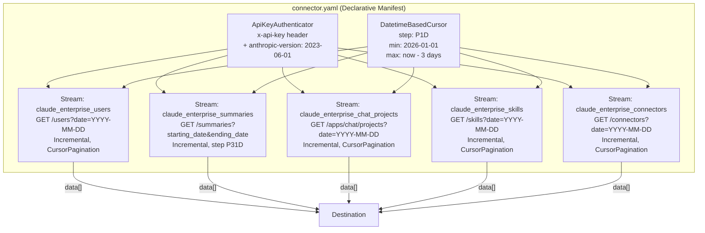

# DESIGN — Claude Enterprise Connector

- [ ] `p3` - **ID**: `cpt-insightspec-design-claude-enterprise-connector`

<!-- toc -->

- [1. Architecture Overview](#1-architecture-overview)
  - [1.1 Architectural Vision](#11-architectural-vision)
  - [1.2 Architecture Drivers](#12-architecture-drivers)
  - [1.3 Architecture Layers](#13-architecture-layers)
- [2. Principles & Constraints](#2-principles--constraints)
  - [2.1 Design Principles](#21-design-principles)
  - [2.2 Constraints](#22-constraints)
- [3. Technical Architecture](#3-technical-architecture)
  - [3.1 Domain Model](#31-domain-model)
  - [3.2 Component Model](#32-component-model)
  - [3.3 API Contracts](#33-api-contracts)
  - [3.4 Internal Dependencies](#34-internal-dependencies)
  - [3.5 External Dependencies](#35-external-dependencies)
  - [3.6 Interactions & Sequences](#36-interactions--sequences)
  - [3.7 Database schemas & tables](#37-database-schemas--tables)
  - [3.8 Deployment Topology](#38-deployment-topology)
- [4. Additional context](#4-additional-context)
  - [Identity Resolution Strategy](#identity-resolution-strategy)
  - [Data Ownership & Lineage](#data-ownership--lineage)
  - [Silver / Gold Mappings](#silver--gold-mappings)
  - [Incremental Sync Strategy](#incremental-sync-strategy)
  - [Reporting Lag & Minimum Date Handling](#reporting-lag--minimum-date-handling)
  - [Base URL Override](#base-url-override)
  - [Capacity Estimates](#capacity-estimates)
  - [Open Questions](#open-questions)
  - [Addressed Domains](#addressed-domains)
  - [Non-Applicable Domains](#non-applicable-domains)
  - [Architecture Decision Records](#architecture-decision-records)
- [5. Traceability](#5-traceability)

<!-- /toc -->

## 1. Architecture Overview

### 1.1 Architectural Vision

The Claude Enterprise connector extracts per-user daily activity, organization-wide summaries, chat project usage, and skill/connector adoption from five Anthropic Enterprise Analytics API endpoints and delivers them to the Bronze layer of the Insight platform. The connector is implemented as an Airbyte declarative manifest — a YAML file that defines all streams, authentication, pagination, incremental sync, and schemas without code. Silver and Gold transformations are out of scope for this connector iteration.

The connector defines five data streams and one monitoring stream:

1. **`claude_enterprise_users`** — per-user-per-day engagement metrics via `GET /v1/organizations/analytics/users` (incremental, date-based)
2. **`claude_enterprise_summaries`** — daily organization summary via `GET /v1/organizations/analytics/summaries` (incremental, date-based, multi-day response)
3. **`claude_enterprise_chat_projects`** — per-project-per-day chat activity via `GET /v1/organizations/analytics/apps/chat/projects` (incremental)
4. **`claude_enterprise_skills`** — per-skill-per-day adoption via `GET /v1/organizations/analytics/skills` (incremental)
5. **`claude_enterprise_connectors`** — per-connector-per-day adoption via `GET /v1/organizations/analytics/connectors` (incremental)

A sixth stream (`claude_enterprise_collection_runs`) captures connector execution metadata for operational monitoring.

All per-user data flows through `user_email` (in `users`) and `created_by_email` (in `chat_projects`) as identity keys. Aggregate streams (`summaries`, `skills`, `connectors`) do not carry per-user identity. The monitoring stream does not carry any user identity.

#### System Context



### 1.2 Architecture Drivers

**PRD**: [PRD.md](./PRD.md)

#### Functional Drivers

| Requirement | Design Response |
|-------------|-----------------|
| `cpt-insightspec-fr-claude-enterprise-users-collect` | Stream `claude_enterprise_users` → `GET /v1/organizations/analytics/users` (incremental, cursor-paginated per day) |
| `cpt-insightspec-fr-claude-enterprise-users-incremental` | `DatetimeBasedCursor` on `date`; `step: P1D`; one request per day |
| `cpt-insightspec-fr-claude-enterprise-summaries-collect` | Stream `claude_enterprise_summaries` → `GET /v1/organizations/analytics/summaries` (incremental, multi-day response) |
| `cpt-insightspec-fr-claude-enterprise-summaries-chunking` | `DatetimeBasedCursor` with `step: P31D` to stay within the 31-day API window |
| `cpt-insightspec-fr-claude-enterprise-projects-collect` | Stream `claude_enterprise_chat_projects` → `GET /v1/organizations/analytics/apps/chat/projects` (incremental) |
| `cpt-insightspec-fr-claude-enterprise-projects-incremental` | `DatetimeBasedCursor` on `date`; `step: P1D` |
| `cpt-insightspec-fr-claude-enterprise-skills-collect` | Stream `claude_enterprise_skills` → `GET /v1/organizations/analytics/skills` (incremental) |
| `cpt-insightspec-fr-claude-enterprise-skills-incremental` | `DatetimeBasedCursor` on `date`; `step: P1D` |
| `cpt-insightspec-fr-claude-enterprise-connectors-collect` | Stream `claude_enterprise_connectors` → `GET /v1/organizations/analytics/connectors` (incremental) |
| `cpt-insightspec-fr-claude-enterprise-connectors-incremental` | `DatetimeBasedCursor` on `date`; `step: P1D` |
| `cpt-insightspec-fr-claude-enterprise-collection-runs` | Stream `claude_enterprise_collection_runs` — connector execution log |
| `cpt-insightspec-fr-claude-enterprise-min-date-enforcement` | `start_datetime.min_datetime = 2026-01-01`; configured `start_date` clamped to this floor |
| `cpt-insightspec-fr-claude-enterprise-reporting-lag` | `end_datetime = now_utc() - 3 days`; requests beyond this upper bound are deferred |
| `cpt-insightspec-fr-claude-enterprise-deduplication` | Primary keys: `unique_key` (users/chat_projects/skills/connectors), `date` (summaries), `run_id` (collection_runs) |
| `cpt-insightspec-fr-claude-enterprise-tenant-tagging` | `AddFields` transformation injects `tenant_id`, `insight_source_id`, `data_source`, `collected_at` on every record |
| `cpt-insightspec-fr-claude-enterprise-identity-key` | `user_email` in `claude_enterprise_users`; `created_by_email` in `claude_enterprise_chat_projects` |
| `cpt-insightspec-fr-claude-enterprise-identity-email-only` | Anthropic `user.id` and `created_by.id` retained but not marked as identity keys |

#### NFR Allocation

| NFR ID | NFR Summary | Allocated To | Design Response | Verification Approach |
|--------|-------------|--------------|-----------------|----------------------|
| `cpt-insightspec-nfr-claude-enterprise-freshness` | Bronze data for day D available by end of D+4 | Orchestrator scheduling | Daily scheduled run; cursor starts from last sync position; upper bound = today−3 | Compare latest `date` in Bronze with `today() - 4` |
| `cpt-insightspec-nfr-claude-enterprise-completeness` | 100% extraction per stream per run | Pagination | All paginated endpoints use `CursorPagination` until `next_page` is null | Compare record count with API pagination metadata |
| `cpt-insightspec-nfr-claude-enterprise-schema-stability` | No unannounced breaking changes | Manifest schema | Inline schema definitions; additive changes non-breaking | Schema diff on version updates |

#### Architecture Decision Records

The Enterprise Analytics API is new enough that no project-specific ADRs have been authored yet. Open design questions are captured in §13 of the PRD and in [Open Questions](#open-questions) below. When decisions are made (for example, on volume sizing or Office/Cowork mapping), they will be captured as ADRs under `specs/ADR/`.

### 1.3 Architecture Layers

- [ ] `p3` - **ID**: `cpt-insightspec-tech-claude-enterprise-connector`

| Layer | Responsibility | Technology |
|-------|---------------|------------|
| Source API | Anthropic Enterprise Analytics API endpoints | REST / JSON (GET only) |
| Authentication | API key via `x-api-key` header with `read:analytics` scope | `ApiKeyAuthenticator` + `anthropic-version: 2023-06-01` request header |
| Connector | Stream definitions, pagination, incremental sync, lag enforcement | Airbyte declarative manifest (YAML) |
| Execution | Container runtime for source and destination | Airbyte Declarative Connector framework (latest) |
| Bronze | Raw data storage with source-native schema | Destination connector (ClickHouse / PostgreSQL) |

## 2. Principles & Constraints

### 2.1 Design Principles

#### One Stream per Endpoint

- [ ] `p2` - **ID**: `cpt-insightspec-principle-claude-enterprise-one-stream-per-endpoint`

Each Enterprise Analytics API endpoint maps to exactly one stream. This preserves the API's data model without transformation and keeps each stream independently configurable, retryable, and deduplicable.

#### Source-Native Schema with Selective Flattening

- [ ] `p2` - **ID**: `cpt-insightspec-principle-claude-enterprise-source-native-schema`

Bronze tables preserve the original Enterprise Analytics API field names where possible. Nested objects (`user`, `chat_metrics`, `claude_code_metrics`, `office_metrics`, `cowork_metrics`, `created_by`) are **selectively flattened**: headline counters (message counts, commit counts, session counts, etc.) become top-level columns for easy querying, and the full nested object is also preserved as a JSON blob (`{group}_json`) for forward compatibility. Framework fields (`tenant_id`, `insight_source_id`, `collected_at`, `data_source`) are injected via `AddFields`.

#### Email as the Sole Cross-System Identity Key

- [ ] `p2` - **ID**: `cpt-insightspec-principle-claude-enterprise-email-identity`

`user_email` (from `/users`) and `created_by_email` (from chat projects) are the only fields treated as cross-system identity keys. Anthropic's `user.id` / `created_by.id` are retained in Bronze for debugging but are not consumed downstream for person resolution.

#### Bronze-Only Scope

- [ ] `p2` - **ID**: `cpt-insightspec-principle-claude-enterprise-bronze-only`

This connector iteration delivers Bronze tables and tenant tagging. Silver routing (to `class_ai_*` streams) and Gold aggregations are explicitly out of scope and are covered by later work. The `descriptor.yaml` declares `dbt_select: ""` (no Silver models in scope). `silver_targets` is prohibited per Connector Spec §4.10.

### 2.2 Constraints

#### API Key Authentication with Read-Analytics Scope

- [ ] `p2` - **ID**: `cpt-insightspec-constraint-claude-enterprise-api-key-auth`

The Enterprise Analytics API uses API key authentication via the `x-api-key` header. The key must be created at `claude.ai/analytics/api-keys` by a Primary Owner and must carry the `read:analytics` scope. Every request also includes `anthropic-version: 2023-06-01` for consistency with other Anthropic APIs (the header is not documented as required but is tolerated). Requests with a missing or wrong-scope key return HTTP 404; the connector surfaces this as an authentication failure.

#### All Endpoints are GET with Date Parameters

- [ ] `p2` - **ID**: `cpt-insightspec-constraint-claude-enterprise-get-endpoints`

All five endpoints use HTTP GET with query parameters. `/users`, `/apps/chat/projects`, `/skills`, `/connectors` accept a single `date` parameter (YYYY-MM-DD). `/summaries` accepts `starting_date` and optional `ending_date` (exclusive). There are no POST endpoints and no request bodies.

#### Cursor-Based Pagination

- [ ] `p2` - **ID**: `cpt-insightspec-constraint-claude-enterprise-cursor-pagination`

`/users`, `/apps/chat/projects`, `/skills`, `/connectors` all use cursor pagination: clients pass an opaque `page` token (from the previous response's `next_page`) and receive records in `data`. Pagination stops when `next_page` is absent or null. The manifest uses `CursorPagination` for these streams. `/summaries` returns all days in a single response within the 31-day window and does not paginate.

#### 31-Day Maximum Range on Summaries

- [ ] `p2` - **ID**: `cpt-insightspec-constraint-claude-enterprise-summaries-window`

The `/summaries` endpoint rejects requests where `ending_date - starting_date > 31 days` with HTTP 400. The manifest uses `DatetimeBasedCursor` with `step: P31D` to automatically chunk long windows into successive 31-day requests.

#### Three-Day Reporting Lag

- [ ] `p2` - **ID**: `cpt-insightspec-constraint-claude-enterprise-reporting-lag`

The API makes data for day `N-1` queryable only starting on day `N+2` (i.e., three full days after aggregation). Requests for dates within the lag window return HTTP 400. The manifest's `DatetimeBasedCursor` sets `end_datetime` to `now_utc() - 3 days`, truncated to day boundary. Dates beyond this upper bound are deferred to the next run.

#### Minimum Queryable Date (2026-01-01)

- [ ] `p2` - **ID**: `cpt-insightspec-constraint-claude-enterprise-min-date`

The API rejects any date earlier than 2026-01-01 with HTTP 400. The manifest enforces this with `MinMaxDatetime.min_datetime = "2026-01-01"`, which silently clamps any earlier `start_date` to the minimum. The clamp is logged on first run.

#### Configurable Base URL

- [ ] `p2` - **ID**: `cpt-insightspec-constraint-claude-enterprise-base-url-override`

The manifest's `url_base` is resolved from the connector config (`base_url` parameter, default `https://api.anthropic.com`). This lets operators point the connector at a local stub during development without changing the manifest. Production deployments must leave the default in place.

#### Rate Limits Honoured via DefaultErrorHandler

- [ ] `p2` - **ID**: `cpt-insightspec-constraint-claude-enterprise-rate-limits`

The API enforces organization-level rate limits (default values are not documented and are adjustable with Anthropic CSM). The manifest uses `DefaultErrorHandler` with a `WaitTimeFromHeader` backoff on `Retry-After` and a `HttpResponseFilter` that retries on HTTP 429 and 503 and fails on 401/404. No custom throttling is implemented.

## 3. Technical Architecture

### 3.1 Domain Model

| Entity | Description |
|--------|-------------|
| `UserActivity` | One user's daily engagement across Claude products. Key: composite `(date, user.id)`. Contains chat, Claude Code, Office, and Cowork metric groups and `web_search_count`. |
| `OrgSummary` | One day's organization-wide engagement snapshot. Key: `date`. Contains DAU/WAU/MAU, seat counts, and Cowork active-user counts. |
| `ChatProject` | One chat project's daily activity. Key: composite `(date, project_id)`. Contains user/conversation/message counts and ownership. |
| `SkillAdoption` | One skill's daily adoption. Key: composite `(date, skill_name)`. Contains distinct user count and per-surface session/conversation counts. |
| `ConnectorAdoption` | One MCP connector's daily adoption. Key: composite `(date, connector_name)`. Contains distinct user count and per-surface session/conversation counts. |
| `CollectionRun` | One connector execution. Key: `run_id`. Contains timestamps, per-stream counts, API call count, error count. |

**Relationships**:

- `UserActivity` → provides `user_email` → identity key for cross-system resolution
- `ChatProject.created_by_email` → identity key for project ownership
- `OrgSummary`, `SkillAdoption`, `ConnectorAdoption` → aggregated across users; carry no per-user identity
- All user-facing entities → `email` → resolved to `person_id` by Identity Manager (Silver, out of scope for this connector)

**Schema format**: Airbyte declarative manifest YAML with inline JSON Schema definitions per stream.
**Schema location**: `src/ingestion/connectors/ai/claude-enterprise/connector.yaml`.

### 3.2 Component Model

The Claude Enterprise connector is a single declarative manifest that defines five data streams and one monitoring stream. There are no custom code components.

#### Component Diagram



#### Connector Package Structure

The Claude Enterprise connector is packaged as a self-contained unit following the standard connector package layout:

```text
src/ingestion/connectors/ai/claude-enterprise/
+-- connector.yaml          # Airbyte declarative manifest (nocode)
+-- descriptor.yaml         # Package metadata: streams, Silver targets
```

`dbt/` is **intentionally absent** for this connector iteration: Silver/Gold mapping is out of scope. The directory will be added when Silver routing is designed.

#### Connector Package Descriptor

- [ ] `p2` - **ID**: `cpt-insightspec-component-claude-enterprise-descriptor`

The `descriptor.yaml` registers the connector package with the platform. For this Bronze-only iteration, `dbt_select` is empty and `silver_targets` is omitted (prohibited per Connector Spec §4.10):

```yaml
name: claude-enterprise
version: "1.0"
type: nocode

# silver_targets is prohibited per Connector Spec §4.10 — Silver determined by dbt_select tags.
# streams is prohibited per Connector Spec §4.10 — stream definitions owned by Airbyte connector.
dbt_select: ""
```

#### Claude Enterprise Connector Manifest

- [ ] `p2` - **ID**: `cpt-insightspec-component-claude-enterprise-manifest`

##### Why this component exists

Defines the complete Claude Enterprise connector as a YAML declarative manifest executed by the Airbyte Declarative Connector framework. No code required.

##### Responsibility scope

Defines all 5 data streams with: Enterprise Analytics API endpoint paths, API key authentication with `read:analytics` scope, cursor-based pagination, date-range-based incremental sync with reporting-lag upper bound and 2026-01-01 floor, summary range chunking, and inline JSON schemas.

##### Manifest Skeleton

> **Note**: The YAML block below is a **structural skeleton** included to illustrate Airbyte framework usage (authenticator, cursor, retriever, transformations) — not a full manifest. The authoritative configuration is the file at `src/ingestion/connectors/ai/claude-enterprise/connector.yaml` once implementation begins. If this skeleton and the real manifest ever diverge, **the file wins**; the skeleton is reference-only and may go stale between DESIGN revisions.

The manifest follows the Airbyte declarative framework structure. Key structural elements:

```yaml
version: "6.2.0"
type: DeclarativeSource
check:
  type: CheckStream
  stream_names: [claude_enterprise_summaries]

definitions:
  api_key_authenticator:
    type: ApiKeyAuthenticator
    api_token: "{{ config['analytics_api_key'] }}"
    header: x-api-key

  anthropic_headers:
    anthropic-version: "2023-06-01"
    Content-Type: application/json

  retryable_error_handler:
    type: DefaultErrorHandler
    backoff_strategies:
      - type: WaitTimeFromHeader
        header: Retry-After
    response_filters:
      - type: HttpResponseFilter
        action: RETRY
        http_codes: [429, 503]
      - type: HttpResponseFilter
        action: FAIL
        http_codes: [401, 404]

  cursor_paginator:
    type: DefaultPaginator
    pagination_strategy:
      type: CursorPagination
      cursor_value: "{{ response.get('next_page', '') }}"
      stop_condition: "{{ response.get('next_page') is none or response.get('next_page') == '' }}"
    page_token_option:
      type: RequestOption
      inject_into: request_parameter
      field_name: page

streams:
  - type: DeclarativeStream
    name: claude_enterprise_users
    primary_key: [unique_key]
    incremental_sync:
      type: DatetimeBasedCursor
      cursor_field: date
      cursor_datetime_formats: ["%Y-%m-%d"]
      datetime_format: "%Y-%m-%d"
      start_datetime:
        type: MinMaxDatetime
        datetime: "{{ config.get('start_date', day_delta(-14, format='%Y-%m-%d')) }}"
        datetime_format: "%Y-%m-%d"
        min_datetime: "2026-01-01"
      end_datetime:
        type: MinMaxDatetime
        datetime: "{{ (now_utc() - duration('P3D')).strftime('%Y-%m-%d') }}"
        datetime_format: "%Y-%m-%d"
      step: P1D
      cursor_granularity: P1D
      start_time_option:
        type: RequestOption
        field_name: date
        inject_into: request_parameter
    retriever:
      type: SimpleRetriever
      requester:
        type: HttpRequester
        url_base: "{{ config.get('base_url', 'https://api.anthropic.com') }}"
        path: /v1/organizations/analytics/users
        http_method: GET
        authenticator: { $ref: "#/definitions/api_key_authenticator" }
        request_headers: { $ref: "#/definitions/anthropic_headers" }
        error_handler: { $ref: "#/definitions/retryable_error_handler" }
      record_selector:
        type: RecordSelector
        extractor:
          type: DpathExtractor
          field_path: [data]
      paginator: { $ref: "#/definitions/cursor_paginator" }
    transformations:
      - type: AddFields
        fields:
          - { path: [tenant_id],         value: "{{ config['tenant_id'] }}" }
          - { path: [insight_source_id], value: "{{ config.get('insight_source_id', '') }}" }
          - { path: [collected_at],      value: "{{ now_utc().strftime('%Y-%m-%dT%H:%M:%SZ') }}" }
          - { path: [data_source],       value: "insight_claude_enterprise" }
          - { path: [user_id],           value: "{{ record.get('user', {}).get('id') }}" }
          - { path: [user_email],        value: "{{ record.get('user', {}).get('email_address') }}" }
          - { path: [unique],            value: "{{ stream_interval['start_time'] }}:{{ record.get('user', {}).get('id') }}" }
  # ... remaining streams follow the same pattern

  - type: DeclarativeStream
    name: claude_enterprise_summaries
    primary_key: [date]
    incremental_sync:
      type: DatetimeBasedCursor
      cursor_field: date
      step: P31D            # <-- summaries-specific; stays within API's 31-day window
      # ... start/end as above
      start_time_option:
        type: RequestOption
        field_name: starting_date
        inject_into: request_parameter
      end_time_option:
        type: RequestOption
        field_name: ending_date
        inject_into: request_parameter
    retriever:
      # ... (no paginator needed — single response per window)

spec:
  type: Spec
  connection_specification:
    type: object
    required: [tenant_id, analytics_api_key]
    properties:
      tenant_id:        { type: string, title: Tenant ID,              order: 0 }
      analytics_api_key:{ type: string, title: Analytics API Key,      airbyte_secret: true, order: 1 }
      insight_source_id:{ type: string, title: Source Instance ID,     default: "",  order: 2 }
      start_date:       { type: string, title: Start Date,             default: "",  order: 3 }
      base_url:         { type: string, title: Base URL (override),    default: "https://api.anthropic.com", order: 4 }
```

This is a structural skeleton — the full manifest will live in `src/ingestion/connectors/ai/claude-enterprise/connector.yaml` once implementation begins.

##### Responsibility boundaries

Orchestration, scheduling, and state storage are handled by the Airbyte platform. Silver/Gold transformations, destination-specific configuration, and mock/stub services are out of scope.

##### Related components (by ID)

- Airbyte Declarative Connector framework (`source-declarative-manifest` image) — executes this manifest
- `cpt-insightspec-component-claude-enterprise-descriptor` — package metadata

#### tenant_id Injection Component

- [ ] `p1` - **ID**: `cpt-insightspec-component-claude-enterprise-tenant-id-injection`

Ensures every record emitted by all streams contains `tenant_id`, `insight_source_id`, `data_source`, and `collected_at`. Implemented as an `AddFields` transformation in the manifest, applied to every stream.

### 3.3 API Contracts

#### Anthropic Enterprise Analytics API Endpoints

- [ ] `p2` - **ID**: `cpt-insightspec-interface-claude-enterprise-api-endpoints`

- **Contracts**: `cpt-insightspec-contract-claude-enterprise-analytics-api`
- **Technology**: REST / JSON

| Stream | Endpoint | Pagination | Date Params |
|--------|----------|------------|-------------|
| `claude_enterprise_users` | `GET /v1/organizations/analytics/users` | Cursor: `page` param (from response `next_page`), default `limit=20`, max `1000` | Query: `date` (YYYY-MM-DD) |
| `claude_enterprise_summaries` | `GET /v1/organizations/analytics/summaries` | None (single response within 31-day window) | Query: `starting_date`, `ending_date` (YYYY-MM-DD, exclusive); max 31-day range |
| `claude_enterprise_chat_projects` | `GET /v1/organizations/analytics/apps/chat/projects` | Cursor: `page` param, default `limit=100`, max `1000` | Query: `date` |
| `claude_enterprise_skills` | `GET /v1/organizations/analytics/skills` | Cursor: `page` param, default `limit=100`, max `1000` | Query: `date` |
| `claude_enterprise_connectors` | `GET /v1/organizations/analytics/connectors` | Cursor: `page` param, default `limit=100`, max `1000` | Query: `date` |

**Response structure**:

| Stream | Response root | Records path |
|--------|--------------|--------------|
| `claude_enterprise_users` | `{data: [...], next_page: string\|null}` | `data` |
| `claude_enterprise_summaries` | `{data: [...]}` | `data` |
| `claude_enterprise_chat_projects` | `{data: [...], next_page: string\|null}` | `data` |
| `claude_enterprise_skills` | `{data: [...], next_page: string\|null}` | `data` |
| `claude_enterprise_connectors` | `{data: [...], next_page: string\|null}` | `data` |

**Error handling**:

| HTTP code | Meaning | Connector response |
|-----------|---------|-------------------|
| 200 | Success | Emit records |
| 400 | Invalid query parameter (bad date, future date, pre-2026 date, range > 31 days) | Fail stream; operator reviews `start_date` / `end_date` / range logic |
| 404 | Missing/invalid key or missing `read:analytics` scope | Fail (authentication error) |
| 429 | Rate limited | Retry with `Retry-After` backoff |
| 503 | Transient failure | Retry with backoff |

**Authentication**:

- Header: `x-api-key: {analytics_api_key}`
- Required scope: `read:analytics`
- Sent alongside: `anthropic-version: 2023-06-01`
- Manifest: `ApiKeyAuthenticator` with `header: x-api-key`, plus `request_headers` for the version header

#### Source Config Schema

- [ ] `p2` - **ID**: `cpt-insightspec-interface-claude-enterprise-source-config`

The source config for the Claude Enterprise connector:

```json
{
  "tenant_id": "Tenant isolation identifier (UUID)",
  "analytics_api_key": "Enterprise Analytics API key with read:analytics scope",
  "insight_source_id": "Optional connector instance identifier",
  "start_date": "Optional earliest date to collect from (YYYY-MM-DD), default: 14 days ago; clamped to 2026-01-01",
  "base_url": "Optional API base URL override for development, default: https://api.anthropic.com"
}
```

`tenant_id` and `analytics_api_key` are required. `analytics_api_key` is marked `airbyte_secret: true` — it is never logged or displayed. `base_url` defaults to production Anthropic; production deployments must leave the default in place.

### 3.4 Internal Dependencies

| Component | Depends On | Interface |
|-----------|------------|-----------|
| Claude Enterprise Manifest | Airbyte Declarative Connector framework | Executed by `source-declarative-manifest` image |
| Identity Manager (future) | `user_email` / `created_by_email` fields | Resolves email → canonical `person_id` |

### 3.5 External Dependencies

#### Anthropic Enterprise Analytics API

| Dependency | Purpose | Notes |
|------------|---------|-------|
| `api.anthropic.com/v1/organizations/analytics/` | All five endpoints | Org-level rate limits; API key with `read:analytics` scope; 3-day lag; min date 2026-01-01 |

#### Docker Hub Images

| Image | Purpose |
|-------|---------|
| `airbyte/source-declarative-manifest` | Executes the Claude Enterprise manifest |
| `airbyte/destination-clickhouse` (or other) | Writes to Bronze layer |

### 3.6 Interactions & Sequences

#### Incremental Sync Run

**ID**: `cpt-insightspec-seq-claude-enterprise-sync`

**Use cases**: `cpt-insightspec-usecase-claude-enterprise-incremental-sync`

**Actors**: `cpt-insightspec-actor-claude-enterprise-operator`

```mermaid
sequenceDiagram
    participant Orch as Orchestrator
    participant Src as Source Container
    participant AApi as Enterprise Analytics API
    participant Dest as Destination

    Orch->>Src: run read (config, manifest, catalog, state)

    Note over Src: Compute upper bound = today - 3 days<br/>Clamp start_date to max(start_date, 2026-01-01, last_cursor)

    Note over Src,AApi: Stream 1: claude_enterprise_users (incremental, daily)
    loop For each day D (cursor -> upper bound)
        loop Cursor pagination (page token)
            Src->>AApi: GET /analytics/users?date=D&page={token}<br/>[x-api-key, anthropic-version]
            AApi-->>Src: {data: [...], next_page: string|null}
        end
    end
    Src-->>Dest: RECORD messages (one per user-day)

    Note over Src,AApi: Stream 2: claude_enterprise_summaries (incremental, 31-day chunks)
    loop For each 31-day window W (cursor -> upper bound)
        Src->>AApi: GET /analytics/summaries?starting_date=W.start&ending_date=W.end
        AApi-->>Src: {data: [...]}    (one record per day in range)
    end
    Src-->>Dest: RECORD messages

    Note over Src,AApi: Streams 3-5: chat_projects, skills, connectors (incremental, daily)
    loop For each day D and each of streams 3-5
        loop Cursor pagination
            Src->>AApi: GET /analytics/{app}?date=D&page={token}
            AApi-->>Src: {data: [...], next_page: string|null}
        end
    end
    Src-->>Dest: RECORD messages

    Src-->>Dest: STATE messages (updated cursors per stream)
    Dest-->>Orch: STATE messages -> persist to state store

    Note over Src,AApi: Error handling (any stream)
    alt HTTP 429 / 503 (retryable)
        AApi-->>Src: 429 or 503
        Src->>Src: Wait per Retry-After / exponential backoff
        Src->>AApi: Retry same request
    end
    alt HTTP 400 (bad date / range / pre-2026)
        AApi-->>Src: 400 Bad Request
        Src-->>Orch: FAIL stream; operator reviews configuration
    end
    alt HTTP 404 (auth / scope)
        AApi-->>Src: 404 Not Found
        Src-->>Orch: FAIL all streams (authentication error)
    end
```

**Description**: The connector first computes the effective upper bound of the sync window (`today() - 3 days`) and clamps the lower bound to `max(configured start_date, 2026-01-01, last stored cursor)`. For `/users`, `/apps/chat/projects`, `/skills`, `/connectors` it iterates day-by-day and paginates each day to exhaustion. For `/summaries` it walks forward in 31-day windows, each returning multiple days in a single response. All five streams share the same cursor/lag semantics. After all streams complete, per-stream cursor state is persisted.

### 3.7 Database schemas & tables

Bronze tables are created by the destination (ClickHouse). In addition to the connector-defined columns listed below, the destination automatically adds framework columns to every table:

| Column | Type | Description |
|--------|------|-------------|
| `_airbyte_raw_id` | String | Airbyte deduplication key — auto-generated |
| `_airbyte_extracted_at` | DateTime64 | Extraction timestamp — auto-generated |

These columns are not defined in the manifest schema but are present in all Bronze tables at runtime.

#### Table: `claude_enterprise_users`

| Field | Type | Description |
|-------|------|-------------|
| `tenant_id` | UUID | Workspace isolation key — framework-injected |
| `insight_source_id` | String | Connector instance identifier — framework-injected, DEFAULT '' |
| `unique_key` | String | Primary key — computed as `{date}:{user_id}` |
| `date` | String | Activity date (YYYY-MM-DD) — cursor |
| `user_id` | String | Anthropic user ID — flattened from `user.id` |
| `user_email` | String | User email — flattened from `user.email_address`; primary identity key |
| `chat_conversation_count` | Int64 (nullable) | From `chat_metrics.distinct_conversation_count` |
| `chat_message_count` | Int64 (nullable) | From `chat_metrics.message_count` |
| `chat_projects_created_count` | Int64 (nullable) | From `chat_metrics.distinct_projects_created_count` |
| `chat_projects_used_count` | Int64 (nullable) | From `chat_metrics.distinct_projects_used_count` |
| `chat_files_uploaded_count` | Int64 (nullable) | From `chat_metrics.distinct_files_uploaded_count` |
| `chat_artifacts_created_count` | Int64 (nullable) | From `chat_metrics.distinct_artifacts_created_count` |
| `chat_thinking_message_count` | Int64 (nullable) | From `chat_metrics.thinking_message_count` |
| `chat_skills_used_count` | Int64 (nullable) | From `chat_metrics.distinct_skills_used_count` |
| `chat_connectors_used_count` | Int64 (nullable) | From `chat_metrics.connectors_used_count` |
| `code_commit_count` | Int64 (nullable) | From `claude_code_metrics.core_metrics.commit_count` |
| `code_pull_request_count` | Int64 (nullable) | From `claude_code_metrics.core_metrics.pull_request_count` |
| `code_lines_added` | Int64 (nullable) | From `claude_code_metrics.core_metrics.lines_of_code.added_count` |
| `code_lines_removed` | Int64 (nullable) | From `claude_code_metrics.core_metrics.lines_of_code.removed_count` |
| `code_session_count` | Int64 (nullable) | From `claude_code_metrics.core_metrics.distinct_session_count` |
| `code_tool_accepted_count` | Int64 (nullable) | Sum of `tool_actions.{edit,multi_edit,write,notebook_edit}_tool.accepted_count` |
| `code_tool_rejected_count` | Int64 (nullable) | Sum of `tool_actions.{edit,multi_edit,write,notebook_edit}_tool.rejected_count` |
| `web_search_count` | Int64 (nullable) | From `web_search_count` |
| `excel_session_count` | Int64 (nullable) | From `office_metrics.excel.distinct_session_count` |
| `excel_message_count` | Int64 (nullable) | From `office_metrics.excel.message_count` |
| `powerpoint_session_count` | Int64 (nullable) | From `office_metrics.powerpoint.distinct_session_count` |
| `powerpoint_message_count` | Int64 (nullable) | From `office_metrics.powerpoint.message_count` |
| `cowork_session_count` | Int64 (nullable) | From `cowork_metrics.distinct_session_count` |
| `cowork_message_count` | Int64 (nullable) | From `cowork_metrics.message_count` |
| `cowork_action_count` | Int64 (nullable) | From `cowork_metrics.action_count` |
| `cowork_dispatch_turn_count` | Int64 (nullable) | From `cowork_metrics.dispatch_turn_count` |
| `cowork_skills_used_count` | Int64 (nullable) | From `cowork_metrics.distinct_skills_used_count` |
| `chat_metrics_json` | String (JSON) | Full `chat_metrics` object |
| `claude_code_metrics_json` | String (JSON) | Full `claude_code_metrics` object |
| `office_metrics_json` | String (JSON) | Full `office_metrics` object |
| `cowork_metrics_json` | String (JSON) | Full `cowork_metrics` object |
| `collected_at` | DateTime | Collection timestamp |
| `data_source` | String | Always `insight_claude_enterprise` |

One row per `(date, user_id)`. Incremental by `date`.

#### Table: `claude_enterprise_summaries`

| Field | Type | Description |
|-------|------|-------------|
| `tenant_id` | UUID | Workspace isolation key — framework-injected |
| `insight_source_id` | String | Connector instance identifier — framework-injected, DEFAULT '' |
| `date` | String | Summary date (YYYY-MM-DD) — primary key + cursor |
| `daily_active_user_count` | Int64 | DAU |
| `weekly_active_user_count` | Int64 | WAU (7-day rolling window ending on `date`) |
| `monthly_active_user_count` | Int64 | MAU (30-day rolling window ending on `date`) |
| `assigned_seat_count` | Int64 | Currently-assigned seats |
| `pending_invite_count` | Int64 | Unaccepted invitations |
| `cowork_daily_active_user_count` | Int64 | Cowork DAU |
| `cowork_weekly_active_user_count` | Int64 | Cowork WAU |
| `cowork_monthly_active_user_count` | Int64 | Cowork MAU |
| `collected_at` | DateTime | Collection timestamp |
| `data_source` | String | Always `insight_claude_enterprise` |

One row per day. Incremental by `date`. Each API request covers up to 31 days.

#### Table: `claude_enterprise_chat_projects`

| Field | Type | Description |
|-------|------|-------------|
| `tenant_id` | UUID | Workspace isolation key — framework-injected |
| `insight_source_id` | String | Connector instance identifier — framework-injected, DEFAULT '' |
| `unique_key` | String | Primary key — computed as `{date}:{project_id}` |
| `date` | String | Activity date (YYYY-MM-DD) — cursor |
| `project_id` | String | Normalized project ID (format `claude_proj_{id}`) |
| `project_name` | String (nullable) | User-visible project name |
| `distinct_user_count` | Int64 (nullable) | Unique users interacting with project that day |
| `distinct_conversation_count` | Int64 (nullable) | Distinct conversations |
| `message_count` | Int64 (nullable) | Total messages in project |
| `created_at` | String (nullable) | Project creation timestamp (ISO 8601) |
| `created_by_id` | String (nullable) | Creator's Anthropic user ID — flattened from `created_by.id` |
| `created_by_email` | String (nullable) | Creator's email — flattened from `created_by.email_address`; identity key |
| `collected_at` | DateTime | Collection timestamp |
| `data_source` | String | Always `insight_claude_enterprise` |

One row per `(date, project_id)`. Incremental by `date`.

#### Table: `claude_enterprise_skills`

| Field | Type | Description |
|-------|------|-------------|
| `tenant_id` | UUID | Workspace isolation key — framework-injected |
| `insight_source_id` | String | Connector instance identifier — framework-injected, DEFAULT '' |
| `unique_key` | String | Primary key — computed as `{date}:{skill_name}` |
| `date` | String | Activity date (YYYY-MM-DD) — cursor |
| `skill_name` | String | Skill identifier |
| `distinct_user_count` | Int64 (nullable) | Unique users who used skill that day |
| `chat_conversation_skill_used_count` | Int64 (nullable) | From `chat_metrics.distinct_conversation_skill_used_count` |
| `code_session_skill_used_count` | Int64 (nullable) | From `claude_code_metrics.distinct_session_skill_used_count` |
| `excel_session_skill_used_count` | Int64 (nullable) | From `office_metrics.excel.distinct_session_skill_used_count` |
| `powerpoint_session_skill_used_count` | Int64 (nullable) | From `office_metrics.powerpoint.distinct_session_skill_used_count` |
| `cowork_session_skill_used_count` | Int64 (nullable) | From `cowork_metrics.distinct_session_skill_used_count` |
| `surface_metrics_json` | String (JSON) | Full nested per-surface metrics object |
| `collected_at` | DateTime | Collection timestamp |
| `data_source` | String | Always `insight_claude_enterprise` |

One row per `(date, skill_name)`. Incremental by `date`.

#### Table: `claude_enterprise_connectors`

| Field | Type | Description |
|-------|------|-------------|
| `tenant_id` | UUID | Workspace isolation key — framework-injected |
| `insight_source_id` | String | Connector instance identifier — framework-injected, DEFAULT '' |
| `unique_key` | String | Primary key — computed as `{date}:{connector_name}` |
| `date` | String | Activity date (YYYY-MM-DD) — cursor |
| `connector_name` | String | Normalized connector name (e.g., "atlassian" covers multiple naming variants) |
| `distinct_user_count` | Int64 (nullable) | Unique users who invoked connector that day |
| `chat_conversation_connector_used_count` | Int64 (nullable) | From `chat_metrics.distinct_conversation_connector_used_count` |
| `code_session_connector_used_count` | Int64 (nullable) | From `claude_code_metrics.distinct_session_connector_used_count` |
| `excel_session_connector_used_count` | Int64 (nullable) | From `office_metrics.excel.distinct_session_connector_used_count` |
| `powerpoint_session_connector_used_count` | Int64 (nullable) | From `office_metrics.powerpoint.distinct_session_connector_used_count` |
| `cowork_session_connector_used_count` | Int64 (nullable) | From `cowork_metrics.distinct_session_connector_used_count` |
| `surface_metrics_json` | String (JSON) | Full nested per-surface metrics object |
| `collected_at` | DateTime | Collection timestamp |
| `data_source` | String | Always `insight_claude_enterprise` |

One row per `(date, connector_name)`. Incremental by `date`.

#### Table: `claude_enterprise_collection_runs`

| Field | Type | Description |
|-------|------|-------------|
| `tenant_id` | UUID | Workspace isolation key — framework-injected |
| `insight_source_id` | String | Connector instance identifier — framework-injected, DEFAULT '' |
| `run_id` | String | Unique run identifier — primary key |
| `started_at` | DateTime | Run start time |
| `completed_at` | DateTime | Run end time |
| `status` | String | `running` / `completed` / `failed` |
| `users_collected` | Int64 | Rows collected for `claude_enterprise_users` |
| `summaries_collected` | Int64 | Rows collected for `claude_enterprise_summaries` |
| `chat_projects_collected` | Int64 | Rows collected for `claude_enterprise_chat_projects` |
| `skills_collected` | Int64 | Rows collected for `claude_enterprise_skills` |
| `connectors_collected` | Int64 | Rows collected for `claude_enterprise_connectors` |
| `api_calls` | Int64 | Total API calls made |
| `errors` | Int64 | Errors encountered |
| `settings` | String (JSON) | Collection configuration |

Monitoring table — not an analytics source.

#### Destination Ordering, Partitioning, and Migration

**Recommended ClickHouse physical layout** (the destination operator owns the final choice; these are the defaults DESIGN assumes for reasoning about performance and storage):

| Table | Suggested `ORDER BY` | Suggested `PARTITION BY` |
|-------|----------------------|--------------------------|
| `claude_enterprise_users` | `(tenant_id, date, user_id)` | `toYYYYMM(toDate(date))` |
| `claude_enterprise_summaries` | `(tenant_id, date)` | `toYYYYMM(toDate(date))` |
| `claude_enterprise_chat_projects` | `(tenant_id, date, project_id)` | `toYYYYMM(toDate(date))` |
| `claude_enterprise_skills` | `(tenant_id, date, skill_name)` | `toYYYYMM(toDate(date))` |
| `claude_enterprise_connectors` | `(tenant_id, date, connector_name)` | `toYYYYMM(toDate(date))` |
| `claude_enterprise_collection_runs` | `(tenant_id, started_at)` | `toYYYYMM(started_at)` |

**Typical Silver query patterns** (for downstream sizing and index planning):

- **Per-person daily roll-up**: `SELECT ... FROM claude_enterprise_users WHERE tenant_id = X AND date BETWEEN ... GROUP BY user_email, date` — served efficiently by the ordering above.
- **Org-level trend**: `SELECT ... FROM claude_enterprise_summaries WHERE tenant_id = X AND date BETWEEN ...` — single-table scan over a date range.
- **Skill/connector adoption**: `SELECT ... FROM claude_enterprise_skills WHERE tenant_id = X AND date = Y` — point lookup by partition.
- **Project ownership join**: `claude_enterprise_chat_projects.created_by_email` → Identity Manager → `person_id` → cross-source joins.

**Schema migration strategy**:

- **Additive changes** (new flattened columns, new `*_json` groups when the API adds surfaces) propagate automatically via Airbyte schema evolution. The NFR `cpt-insightspec-nfr-claude-enterprise-schema-stability` commits to additive-only behaviour by default.
- **Renames and removals** are breaking and require a versioned table (e.g., `claude_enterprise_users_v2`) with a migration bridge. The connector manifest increments its `version` in `descriptor.yaml` to signal the break.
- **Nested structure preserved**: `*_json` columns (e.g., `chat_metrics_json`) retain the full API response per group, so future field additions are recoverable from Bronze even before the manifest is updated to flatten them.

### 3.8 Deployment Topology

- [ ] `p3` - **ID**: `cpt-insightspec-topology-claude-enterprise-connector`

The Claude Enterprise connector uses one manifest and one Airbyte connection (daily schedule):

```text
Package: src/ingestion/connectors/ai/claude-enterprise/
+-- connector.yaml (declarative manifest — 6 streams)
+-- descriptor.yaml (package metadata — dbt_select: "", Bronze-only)

Connection: claude-enterprise-{org_name}-daily
+-- Schedule: daily (via orchestrator cron)
+-- Source image: airbyte/source-declarative-manifest
+-- Source config: {tenant_id, analytics_api_key, start_date?, base_url?, insight_source_id?}
+-- Streams: claude_enterprise_users, claude_enterprise_summaries,
|            claude_enterprise_chat_projects, claude_enterprise_skills,
|            claude_enterprise_connectors, claude_enterprise_collection_runs
+-- Destination: ClickHouse (Bronze)
+-- State: per-stream date cursors
```

## 4. Additional context

### Identity Resolution Strategy

`user_email` (in `claude_enterprise_users`) and `created_by_email` (in `claude_enterprise_chat_projects`) are the identity keys. The Identity Manager resolves `email` → canonical `person_id` in Silver step 2 (out of scope for this connector). Anthropic's `user.id` / `created_by.id` are retained for debugging but are not used for cross-system resolution.

**Cross-platform note**: The same user can appear in the Admin API connector (future `claude-admin`) and in this Enterprise Analytics connector. Both sources use `email` as the identity key, so cross-source joins at `person_id` work without additional mapping.

Aggregate streams (`summaries`, `skills`, `connectors`) carry no per-user identity — they are already aggregated by the API.

### Data Ownership & Lineage

**Ownership** (per PRD §11 Assumptions):

- **Controller**: the deploying organization — responsible for lawful basis, consent, and data-subject rights for the personal data (`user_email`, `created_by_email`) collected by the connector
- **Processor — upstream**: Anthropic — processes the organization's data to produce the Enterprise Analytics API responses
- **Joint processors — downstream**: the Airbyte platform and the destination operator — process Bronze rows on behalf of the controller

**Lineage**:

```text
api.anthropic.com/v1/organizations/analytics/*   (source)
    │
    └─► source-declarative-manifest container    (Airbyte extraction, AddFields injection)
            │
            └─► destination connector             (ClickHouse / PostgreSQL)
                    │
                    └─► Bronze tables (claude_enterprise_*)
```

Every Bronze row carries `collected_at` (timestamp of extraction) and `insight_source_id` (instance discriminator), enabling tie-back to a specific `claude_enterprise_collection_runs` record for full provenance. `tenant_id` on every row provides the multi-tenant partitioning key. Retention, erasure, and cross-border transfer controls are delegated to the destination operator and out of scope for this connector.

### Silver / Gold Mappings

Silver routing is **explicitly out of scope** for this connector iteration. The `descriptor.yaml` sets `dbt_select: ""` to make this explicit (`silver_targets` is prohibited per §4.10). When Silver routing is designed (future work), candidate mappings are:

| Bronze table | Candidate Silver target | Notes |
|--------------|-------------------------|-------|
| `claude_enterprise_users` | Identity Manager + (new or extended) engagement stream | Per-user-per-day across all surfaces; mapping to `class_ai_dev_usage` (Claude Code fields only) and to a new engagement stream is an open question |
| `claude_enterprise_summaries` | Organization-level engagement stream (new) | No existing Silver target fits — new stream expected |
| `claude_enterprise_chat_projects` | Project engagement stream (new) | No existing Silver target |
| `claude_enterprise_skills` | Adoption stream (new) | No existing Silver target |
| `claude_enterprise_connectors` | Adoption stream (new) | No existing Silver target |

These mappings will be designed in a follow-up DESIGN iteration after Bronze is validated.

### Incremental Sync Strategy

All five data streams use incremental sync on `date`:

| Stream | Cursor field | Step | First-run start | End |
|--------|-------------|------|-----------------|-----|
| `claude_enterprise_users` | `date` (YYYY-MM-DD) | `P1D` | `max(configured start_date, 2026-01-01)`; default 14 days ago | `now_utc() - 3 days` |
| `claude_enterprise_summaries` | `date` | `P31D` | Same | Same |
| `claude_enterprise_chat_projects` | `date` | `P1D` | Same | Same |
| `claude_enterprise_skills` | `date` | `P1D` | Same | Same |
| `claude_enterprise_connectors` | `date` | `P1D` | Same | Same |
| `claude_enterprise_collection_runs` | None (full refresh, append-only) | — | — | — |

**Why `P1D` for most streams**: Each endpoint returns all data for a single date, so per-day requests are the natural unit. Paginate within a day with cursor tokens; advance the date cursor after pagination completes.

**Why `P31D` for summaries**: The summaries endpoint returns multiple days in a single response within its 31-day window. Walking in 31-day steps maximizes efficiency without violating the API's range limit.

**Default start**: `day_delta(-14)` (14 days ago), not 90 as in claude-team. Rationale: the minimum queryable date is 2026-01-01, the lag is 3 days, and per-user records are the largest stream — a shorter default keeps the first run fast.

### Reporting Lag & Minimum Date Handling

The manifest encodes both constraints in its `DatetimeBasedCursor`:

```yaml
incremental_sync:
  type: DatetimeBasedCursor
  cursor_field: date
  cursor_datetime_formats: ["%Y-%m-%d"]
  datetime_format: "%Y-%m-%d"
  start_datetime:
    type: MinMaxDatetime
    datetime: "{{ config.get('start_date', day_delta(-14, format='%Y-%m-%d')) }}"
    datetime_format: "%Y-%m-%d"
    min_datetime: "2026-01-01"    # <-- enforces min date
  end_datetime:
    type: MinMaxDatetime
    datetime: "{{ (now_utc() - duration('P3D')).strftime('%Y-%m-%d') }}"    # <-- enforces lag
    datetime_format: "%Y-%m-%d"
  step: P1D
```

- **Minimum date**: any `start_date` earlier than 2026-01-01 is silently clamped by `MinMaxDatetime.min_datetime`. The `start_date` override is logged by the framework on first use.
- **Reporting lag**: `end_datetime` is dynamically computed as `today - 3 days` at the start of each run. Dates within the lag window are simply not requested; they show up on the next run.

Both are framework-native features — no custom validation code required.

### Base URL Override

The connector's `url_base` is a template expression: `{{ config.get('base_url', 'https://api.anthropic.com') }}`. Operators can override it via the `base_url` config field for local development against a stub service. In production, the default points at Anthropic.

Rationale: zero code paths differ between production and development. The connector sees a mock and the real API identically. The stub service itself is outside the scope of this connector (it is a separate dev aid and not part of the spec).

### Capacity Estimates

Expected data volumes for typical deployments (see `OQ-CE-5` for formal sizing):

| Stream | Volume per day | Estimated sync time (per day) |
|--------|----------------|-------------------------------|
| `claude_enterprise_users` | ≤ 10,000 rows (one per seat active that day) | 10–60s depending on page count (default 20/page) |
| `claude_enterprise_summaries` | 1 row / day, 31 rows per 31-day chunk | < 5s per chunk |
| `claude_enterprise_chat_projects` | 10–500 rows | < 30s |
| `claude_enterprise_skills` | 10–200 rows | < 10s |
| `claude_enterprise_connectors` | 10–100 rows | < 10s |

First-run backfill of 14 days at ~10,000 seats: approximately 140,000 user-day rows plus smaller amounts for the other streams. Estimated first-run duration 5–20 minutes depending on API rate limits. Subsequent daily runs: 1–3 minutes.

**Cost**: Direct API cost is zero — the Enterprise Analytics API is included with the Enterprise seat fee paid by the deploying organization. There are no per-request charges or billable quotas at the connector level. Incremental cost drivers are:

- **Destination-side storage**: Bronze rows accumulate over time. For a 10,000-seat organization, the `users` stream alone adds ~10,000 rows/day × ~1 KB/row × 365 days ≈ 3.7 GB/year before compression. The other four streams contribute an order of magnitude less.
- **Orchestrator compute time**: see sync durations above.
- **Network egress** (if the destination is in a different region than the connector): negligible for the data volumes involved.

**Cost optimization**: The `start_date` default of 14 days keeps first-run cost low; operators needing deeper history set a longer backfill explicitly. Bronze retention and archival are delegated to the destination operator (see PRD §3.1).

### Open Questions

**OQ-CE-1: Backfill depth on first run** — Current default is 14 days ago. Is this enough for typical first-run deployments, or should it be longer (e.g., 30 or 90 days)? The PRD lists this as an open question for DESIGN; the conservative default prevents long first-run times for large organizations but may force a re-configure for teams wanting deeper history.

**OQ-CE-2: `project_id` format** — The API returns project IDs in the form `claude_proj_{id}`. Bronze preserves the verbatim format. Whether to parse/strip the prefix for Silver is deferred to Silver design.

**OQ-CE-3: Users stream vs summaries overlap** — Both streams report active-user counts (users can be aggregated; summaries report DAU/WAU/MAU directly). Silver will need to reconcile these. Open until Silver design.

**OQ-CE-4: Future surfaces** — If Anthropic exposes additional product surfaces (beyond Excel/PowerPoint Office agents), the connector will need to absorb them. The `{group}_metrics_json` columns preserve the raw structure so new fields are non-breaking, but explicit flattening would require a manifest update.

**OQ-CE-5: Volume ceiling per instance** — Informal guidance: ≤ 10,000 seats per instance. Larger organizations may require sharding (e.g., by workspace if/when the API exposes a workspace filter) or separate connector instances. To be resolved during early deployments.

### Addressed Domains

The following checklist domains are addressed in this DESIGN:

| Domain | Where addressed |
|--------|-----------------|
| ARCH (Architecture) | §1 Architecture Overview, §2 Principles & Constraints, §3 Technical Architecture |
| SEM (PRD/ADR Traceability) | §1.2 driver tables, §5 Traceability |
| DATA (Data Architecture & Governance) | §3.1 Domain Model, §3.7 Bronze tables + ordering/migration, §4 Data Ownership & Lineage |
| INT (Integration) | §3.3 API Contracts, §3.5 External Dependencies |
| BIZ (Business Alignment) | §1.2 driver tables |
| DOC (Non-Applicability) | §4 this section + next (Non-Applicable Domains) |

### Non-Applicable Domains

The following checklist domains have been evaluated and are not applicable for this connector:

| Domain | Reason |
|--------|--------|
| **PERF (Performance)** | Batch data pipeline with native API pagination. Rate-limit handling via `DefaultErrorHandler` (documented in Constraints SS2.2) is the only performance-related concern. |
| **SEC (Security)** | Authentication is delegated to the Airbyte framework: the API key is stored as `airbyte_secret`, never logged or exposed. The declarative manifest contains no custom security logic. |
| **SAFE (Safety)** | Pure data-extraction pipeline. No interaction with physical systems. |
| **REL (Reliability)** | Idempotent extraction via deduplication keys. Recovery = re-run the sync; the Airbyte framework manages cursor state and retry. |
| **UX (Usability)** | No user-facing interface. Only UX surface is the Airbyte connection configuration form. |
| **MAINT (Maintainability)** | Declarative YAML manifest with no custom code. |
| **COMPL (Compliance)** | Personal data (work emails) is in scope; retention, deletion, and access controls are delegated to the Airbyte platform and destination operator. |
| **OPS (Operations)** | Deployed as a standard Airbyte connection — no custom infrastructure, no IaC. Topology documented in SS3.8; execution log in the `collection_runs` stream. |
| **TEST (Testing)** | Declarative connector validated by Airbyte framework checks (connection, schema) plus PRD §9 acceptance criteria. Stub-based dev testing is the operator's tool, not a design concern. |

### Architecture Decision Records

No ADRs have been authored yet for this connector. Architectural decisions are captured inline in SS2.2 Constraints:

- **API key with `read:analytics` scope**: SS2.2 `cpt-insightspec-constraint-claude-enterprise-api-key-auth`
- **Cursor-based pagination**: SS2.2 `cpt-insightspec-constraint-claude-enterprise-cursor-pagination`
- **31-day chunking for summaries**: SS2.2 `cpt-insightspec-constraint-claude-enterprise-summaries-window`
- **3-day reporting lag upper bound**: SS2.2 `cpt-insightspec-constraint-claude-enterprise-reporting-lag`
- **2026-01-01 minimum date enforcement**: SS2.2 `cpt-insightspec-constraint-claude-enterprise-min-date`
- **Configurable base URL for dev**: SS2.2 `cpt-insightspec-constraint-claude-enterprise-base-url-override`
- **Bronze-only scope (no Silver)**: SS2.1 `cpt-insightspec-principle-claude-enterprise-bronze-only`

Decisions crossing into ADR territory (e.g., a volume-sharding strategy from `OQ-CE-5`) will be captured under `specs/ADR/` when made.

## 5. Traceability

- **PRD**: [PRD.md](./PRD.md)
- **ADRs**: [ADR/](./ADR/) *(empty for now)*
- **Connector directory** (target): `src/ingestion/connectors/ai/claude-enterprise/`
- **AI Tool domain**: [docs/components/connectors/ai/](../../)
