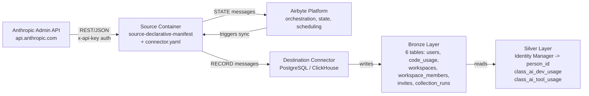
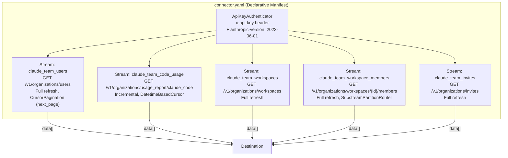
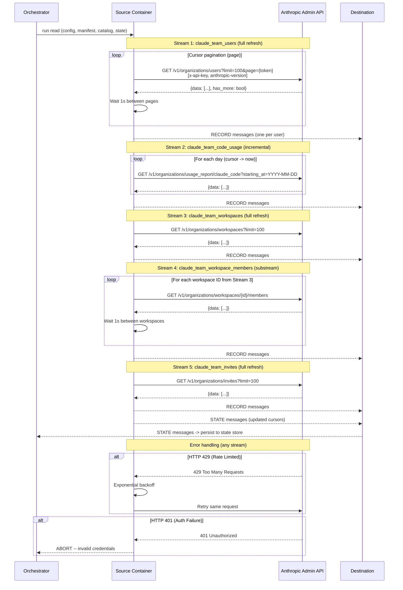

# DESIGN — Claude Team Connector

- [ ] `p3` - **ID**: `cpt-insightspec-design-claude-team-connector`

<!-- toc -->

- [1. Architecture Overview](#1-architecture-overview)
  - [1.1 Architectural Vision](#11-architectural-vision)
  - [1.2 Architecture Drivers](#12-architecture-drivers)
  - [1.3 Architecture Layers](#13-architecture-layers)
- [2. Principles & Constraints](#2-principles--constraints)
  - [2.1 Design Principles](#21-design-principles)
  - [2.2 Constraints](#22-constraints)
- [3. Technical Architecture](#3-technical-architecture)
  - [3.1 Domain Model](#31-domain-model)
  - [3.2 Component Model](#32-component-model)
  - [3.3 API Contracts](#33-api-contracts)
  - [3.4 Internal Dependencies](#34-internal-dependencies)
  - [3.5 External Dependencies](#35-external-dependencies)
  - [3.6 Interactions & Sequences](#36-interactions--sequences)
  - [3.7 Database schemas & tables](#37-database-schemas--tables)
  - [3.8 Deployment Topology](#38-deployment-topology)
- [4. Additional context](#4-additional-context)
  - [Identity Resolution Strategy](#identity-resolution-strategy)
  - [Silver / Gold Mappings](#silver--gold-mappings)
  - [Incremental Sync Strategy](#incremental-sync-strategy)
  - [Capacity Estimates](#capacity-estimates)
  - [Open Questions](#open-questions)
  - [Non-Applicable Domains](#non-applicable-domains)
  - [Architecture Decision Records](#architecture-decision-records)
- [5. Traceability](#5-traceability)

<!-- /toc -->

## 1. Architecture Overview

### 1.1 Architectural Vision

The Claude Team connector extracts team membership, Claude Code usage reports, workspace structures, workspace membership, and pending invitations from five Anthropic Admin API endpoints and delivers them to the Bronze layer of the Insight platform. The connector is implemented as an Airbyte declarative manifest -- a YAML file that defines all streams, authentication, pagination, incremental sync, and schemas without code.

The connector defines five data streams and one monitoring stream:

1. **`claude_team_users`** -- seat roster via `GET /v1/organizations/users` (full refresh, cursor-paginated)
2. **`claude_team_code_usage`** -- daily Claude Code metrics via `GET /v1/organizations/usage_report/claude_code` (incremental, date-based)
3. **`claude_team_workspaces`** -- workspace structure via `GET /v1/organizations/workspaces` (full refresh)
4. **`claude_team_workspace_members`** -- per-workspace membership via `GET /v1/organizations/workspaces/{id}/members` (full refresh, substream of workspaces)
5. **`claude_team_invites`** -- pending invitations via `GET /v1/organizations/invites` (full refresh)

A sixth stream (`claude_team_collection_runs`) captures connector execution metadata for operational monitoring.

All data streams share the identity key `email` (field name varies: `email` in users/invites, `actor_identifier` in code usage). The monitoring stream does not carry a user identity field.

#### System Context



### 1.2 Architecture Drivers

**PRD**: [PRD.md](./PRD.md)

#### Functional Drivers

| Requirement | Design Response |
|-------------|-----------------|
| `cpt-insightspec-fr-claude-team-users-collect` | Stream `claude_team_users` -> `GET /v1/organizations/users` (full refresh, cursor-paginated) |
| `cpt-insightspec-fr-claude-team-code-usage-collect` | Stream `claude_team_code_usage` -> `GET /v1/organizations/usage_report/claude_code` (incremental) |
| `cpt-insightspec-fr-claude-team-workspaces-collect` | Stream `claude_team_workspaces` -> `GET /v1/organizations/workspaces` (full refresh) |
| `cpt-insightspec-fr-claude-team-workspace-members-collect` | Stream `claude_team_workspace_members` -> `GET /v1/organizations/workspaces/{id}/members` (substream) |
| `cpt-insightspec-fr-claude-team-invites-collect` | Stream `claude_team_invites` -> `GET /v1/organizations/invites` (full refresh) |
| `cpt-insightspec-fr-claude-team-collection-runs` | Stream `claude_team_collection_runs` -- connector execution log |
| `cpt-insightspec-fr-claude-team-deduplication` | Primary keys: `id` (users/workspaces/invites), `unique` (code_usage/workspace_members), `run_id` (collection_runs) |
| `cpt-insightspec-fr-claude-team-identity-key` | `email`/`actor_identifier` present in user-facing streams |

#### NFR Allocation

| NFR ID | NFR Summary | Allocated To | Design Response | Verification Approach |
|--------|-------------|--------------|-----------------|----------------------|
| `cpt-insightspec-nfr-claude-team-freshness` | Data in Bronze within 48h of activity | Orchestrator scheduling | Daily scheduled runs; cursor starts from last sync position | Compare latest `date` in Bronze with current date |
| `cpt-insightspec-nfr-claude-team-completeness` | 100% extraction per stream per run | Pagination | All endpoints paginated to exhaustion | Compare record count with API pagination metadata |
| `cpt-insightspec-nfr-claude-team-schema-stability` | No unannounced breaking changes | Manifest schema | Inline schema definitions; versioned connector | Schema diff on version updates |

#### Architecture Decision Records

| ADR ID | Decision | Impact |
|--------|----------|--------|
| `cpt-insightspec-adr-claude-team-001` | Cursor granularity `PT1S` for consistency with claude-api date-boundary fix | Defensive measure; prevents latent bug if `end_time_option` is added |

### 1.3 Architecture Layers

- [ ] `p3` - **ID**: `cpt-insightspec-tech-claude-team-connector`

| Layer | Responsibility | Technology |
|-------|---------------|------------|
| Source API | Anthropic Admin API endpoints | REST / JSON (GET only) |
| Authentication | API key via `x-api-key` header | `ApiKeyAuthenticator` with `anthropic-version: 2023-06-01` |
| Connector | Stream definitions, pagination, incremental sync | Airbyte declarative manifest (YAML) |
| Execution | Container runtime for source and destination | Airbyte Declarative Connector framework (latest) |
| Bronze | Raw data storage with source-native schema | Destination connector (PostgreSQL / ClickHouse) |

## 2. Principles & Constraints

### 2.1 Design Principles

#### One Stream per Endpoint

- [ ] `p2` - **ID**: `cpt-insightspec-principle-claude-team-one-stream-per-endpoint`

Each Anthropic Admin API endpoint maps to exactly one stream. `GET /v1/organizations/users` -> `claude_team_users`. `GET /v1/organizations/usage_report/claude_code` -> `claude_team_code_usage`. `GET /v1/organizations/workspaces` -> `claude_team_workspaces`. `GET /v1/organizations/workspaces/{id}/members` -> `claude_team_workspace_members`. `GET /v1/organizations/invites` -> `claude_team_invites`. This preserves the API's data model without transformation and keeps each stream independently configurable.

#### Source-Native Schema

- [ ] `p2` - **ID**: `cpt-insightspec-principle-claude-team-source-native-schema`

Bronze tables preserve the original Anthropic Admin API field names in their native casing (snake_case) where possible. Framework fields (`tenant_id`, `source_instance_id`, `collected_at`, `data_source`) are injected via `AddFields`. Additionally, the `code_usage` stream derives several flattened fields from nested API objects: `actor_type` and `actor_identifier` (from `actor`), `session_count`, `lines_added`, `lines_removed` (from `core_metrics`), `tool_use_accepted`, `tool_use_rejected` (summed from `tool_actions`), and serializes `core_metrics_json`, `tool_actions_json`, `model_breakdown_json` as JSON strings. All streams compute a `unique` composite key. Nested objects like `data_residency` (workspaces) are serialized to JSON strings via `tojson`. Note: `_version` and `metadata` are documented in Bronze table schemas for forward compatibility but are **not implemented** in the declarative manifest.

### 2.2 Constraints

#### API Key Authentication with Version Header

- [ ] `p2` - **ID**: `cpt-insightspec-constraint-claude-team-api-key-auth`

The Anthropic Admin API uses API key authentication via the `x-api-key` header. Every request must also include the `anthropic-version: 2023-06-01` header. This differs from Bearer token auth and from Basic auth (as used by Cursor). The manifest must use `ApiKeyAuthenticator` with `header: x-api-key` and add `anthropic-version` as a request header on each requester.

#### All Endpoints are GET

- [ ] `p2` - **ID**: `cpt-insightspec-constraint-claude-team-get-endpoints`

All five Anthropic Admin API endpoints use HTTP GET with query parameters for pagination and date ranges. This differs from the Cursor connector where two endpoints use POST with JSON body. All parameters are passed as query strings.

#### Cursor-Based Pagination

- [ ] `p2` - **ID**: `cpt-insightspec-constraint-claude-team-cursor-pagination`

The users endpoint uses cursor-based pagination with `next_page` token returned in the API response. The manifest passes this token back as the `page` query parameter on subsequent requests. Pagination stops when `next_page` is absent or empty in the response. This differs from the page-increment pagination used by Cursor. The manifest must use `CursorPagination` for streams that support it.

#### Substream Pattern for Workspace Members

- [ ] `p2` - **ID**: `cpt-insightspec-constraint-claude-team-substream`

Workspace members requires iterating over all workspaces from the `claude_team_workspaces` stream and fetching members for each workspace. In the Airbyte declarative framework, this is implemented via `SubstreamPartitionRouter` keyed on workspace `id` values. A 1-second delay between workspace iterations prevents rate limiting.

#### ISO 8601 Date Parameters

- [ ] `p2` - **ID**: `cpt-insightspec-constraint-claude-team-iso-dates`

The code usage endpoint uses a date-only parameter `starting_at` (format `YYYY-MM-DD`). Unlike the `messages` and `cost_report` endpoints, `claude_code` does **not** accept `ending_at` or `bucket_width` parameters — only `starting_at` is permitted. The connector sends one request per day with `starting_at=YYYY-MM-DD` and the API returns all usage for that date. The manifest's `DatetimeBasedCursor` uses `datetime_format: "%Y-%m-%d"` and does not inject `end_time_option`.

## 3. Technical Architecture

### 3.1 Domain Model

| Entity | Description |
|--------|-------------|
| `User` | A seat assignment in the Claude Team workspace. Key: `id`. Contains email, name, role, status, activity timestamps. |
| `CodeUsage` | One user's daily Claude Code usage. Key: composite `(date, actor_type, actor_identifier, terminal_type)`. Contains token metrics, tool call counts, session counts. |
| `Workspace` | An organizational unit. Key: `id`. Contains name, display name, creation/archival timestamps, data residency. |
| `WorkspaceMember` | A user-to-workspace assignment. Key: composite `{user_id}:{workspace_id}`. Contains workspace role. |
| `Invite` | A pending seat invitation. Key: `id`. Contains email, role, status, creation/expiry timestamps, target workspace. |

**Relationships**:

- `User` -> provides `email` -> identity key for cross-system resolution
- `CodeUsage` -> keyed by `actor_identifier` (email) + `date` -> daily usage roll-up per user
- `Workspace` -> parent of `WorkspaceMember` (1:N)
- `WorkspaceMember` -> links `User` to `Workspace` (M:N join)
- `Invite` -> references target `Workspace` via `workspace_id`
- All entities -> `email`/`actor_identifier` -> resolved to `person_id` by Identity Manager (Silver)

**Schema format**: Airbyte declarative manifest YAML with inline JSON Schema definitions per stream.
**Schema location**: `src/ingestion/connectors/ai/claude-team/connector.yaml`.

### 3.2 Component Model

The Claude Team connector is a single declarative manifest that defines five data streams and one monitoring stream. There are no custom code components.

#### Component Diagram



#### Connector Package Structure

The Claude Team connector is packaged as a self-contained unit following the standard connector package layout:

```text
src/ingestion/connectors/ai/claude-team/
+-- connector.yaml          # Airbyte declarative manifest (nocode)
+-- descriptor.yaml         # Package metadata: streams, Silver targets
+-- dbt/
    +-- to_ai_dev_usage.sql # dbt model: Bronze -> Silver (class_ai_dev_usage)
    +-- to_ai_tool_usage.sql# dbt model: placeholder (class_ai_tool_usage)
    +-- schema.yml          # Column documentation + dbt tests
```

The dbt model `to_ai_dev_usage.sql` transforms `claude_team_code_usage` Bronze table into the unified `class_ai_dev_usage` Silver table. `tenant_id` MUST be preserved and tested with a `not_null` dbt test. The `data_source` column (set to `'insight_claude_team'` in Bronze) MUST be carried through to Silver as the canonical source discriminator.

The dbt model `to_ai_tool_usage.sql` is a placeholder -- the Anthropic Admin API does not currently expose web/mobile activity data through a separate endpoint. This model documents the architectural gap and will be implemented when the data becomes available.

#### Connector Package Descriptor

- [ ] `p2` - **ID**: `cpt-insightspec-component-claude-team-descriptor`

The `descriptor.yaml` registers the connector package with the platform, declaring its streams, Bronze table mappings, and Silver layer targets:

```yaml
name: claude-team
version: "1.0"
type: nocode

silver_targets:
  - class_ai_dev_usage
  - class_ai_tool_usage

streams:
  - name: claude_team_users
    bronze_table: claude_team_users
    primary_key: [id]
    cursor_field: null

  - name: claude_team_code_usage
    bronze_table: claude_team_code_usage
    primary_key: [unique]
    cursor_field: date

  - name: claude_team_workspaces
    bronze_table: claude_team_workspaces
    primary_key: [id]
    cursor_field: null

  - name: claude_team_workspace_members
    bronze_table: claude_team_workspace_members
    primary_key: [unique]
    cursor_field: null

  - name: claude_team_invites
    bronze_table: claude_team_invites
    primary_key: [id]
    cursor_field: null

  - name: claude_team_collection_runs
    bronze_table: claude_team_collection_runs
    primary_key: [run_id]
    cursor_field: null
```

**Descriptor fields**:

| Field | Type | Description |
|-------|------|-------------|
| `name` | String | Unique connector identifier |
| `version` | String | Package semantic version |
| `type` | Enum | `nocode` (declarative manifest) or `cdk` (custom Python) |
| `silver_targets` | Array(String) | Silver tables this connector populates |
| `streams[].name` | String | Airbyte stream name |
| `streams[].bronze_table` | String | ClickHouse Bronze table name |
| `streams[].primary_key` | Array(String) | Deduplication key fields |
| `streams[].cursor_field` | String / null | Incremental sync cursor field (`null` for full refresh or monitoring streams) |

#### Claude Team Connector Manifest

- [ ] `p2` - **ID**: `cpt-insightspec-component-claude-team-manifest`

##### Why this component exists

Defines the complete Claude Team connector as a YAML declarative manifest executed by the Airbyte Declarative Connector framework. No code required.

##### Responsibility scope

Defines all 5 data streams with: Anthropic Admin API endpoint paths, API key authentication, cursor-based pagination, date-range-based incremental sync (code usage), substream routing (workspace members), and inline JSON schemas.

##### Manifest Skeleton

The manifest follows the Airbyte declarative framework structure (latest stable version). Key structural elements:

```yaml
version: "6.2.0"
type: DeclarativeSource
check:
  type: CheckStream
  stream_names: [claude_team_users]

definitions:
  api_key_authenticator:
    type: ApiKeyAuthenticator
    api_token: "{{ config['admin_api_key'] }}"
    header: x-api-key

streams:
  - type: DeclarativeStream
    name: claude_team_users
    primary_key: [id]
    schema_loader:
      type: InlineSchemaLoader
      schema:
        type: object
        properties:
          tenant_id: { type: string }
          id: { type: string }
          email: { type: string }
          # ... remaining fields per S3.7 table schema
    retriever:
      type: SimpleRetriever
      requester:
        type: HttpRequester
        url_base: https://api.anthropic.com
        path: /v1/organizations/users
        http_method: GET
        authenticator:
          $ref: "#/definitions/api_key_authenticator"
        request_headers:
          anthropic-version: "2023-06-01"
        request_parameters:
          limit: "100"
      record_selector:
        type: RecordSelector
        extractor:
          type: DpathExtractor
          field_path: [data]
      paginator:
        type: DefaultPaginator
        pagination_strategy:
          type: CursorPagination
          cursor_value: "{{ response.get('next_page', '') }}"
          stop_condition: "{{ response.get('next_page') is none or response.get('next_page') == '' }}"
        page_token_option:
          type: RequestOption
          inject_into: request_parameter
          field_name: page
    transformations:
      - type: AddFields
        fields:
          - path: [tenant_id]
            value: "{{ config['tenant_id'] }}"
          - path: [insight_source_id]
            value: "{{ config.get('insight_source_id', '') }}"
          - path: [collected_at]
            value: "{{ now_utc().strftime('%Y-%m-%dT%H:%M:%SZ') }}"
          - path: [data_source]
            value: "insight_claude_team"
  # ... remaining streams follow same pattern

spec:
  type: Spec
  connection_specification:
    type: object
    required: [tenant_id, admin_api_key]
    properties:
      tenant_id:
        type: string
        title: Tenant ID
        order: 0
      admin_api_key:
        type: string
        title: Admin API Key
        airbyte_secret: true
        order: 1
```

This is a structural skeleton -- the full manifest is in `src/ingestion/connectors/ai/claude-team/connector.yaml`.

##### Responsibility boundaries

Orchestration, scheduling, and state storage are handled by the Airbyte platform. Silver/Gold transformations and destination-specific configuration are out of scope.

##### Related components (by ID)

- Airbyte Declarative Connector framework (`source-declarative-manifest` image) -- executes this manifest

#### tenant_id Injection Component

- [ ] `p1` - **ID**: `cpt-insightspec-component-claude-team-tenant-id-injection`

Ensures every record emitted by all streams contains `tenant_id` from the connector config. Implemented as an `AddFields` transformation in the manifest, applied to every stream. See SS3.3 Source Config Schema for the injection pattern.

### 3.3 API Contracts

#### Anthropic Admin API Endpoints

- [ ] `p2` - **ID**: `cpt-insightspec-interface-claude-team-api-endpoints`

- **Contracts**: `cpt-insightspec-contract-claude-team-admin-api`
- **Technology**: REST / JSON

| Stream | Endpoint | Method | Pagination | Date Params |
|--------|----------|--------|------------|-------------|
| `claude_team_users` | `GET /v1/organizations/users` | GET | Cursor: `page` param (from response `next_page`), `limit=100` | None |
| `claude_team_code_usage` | `GET /v1/organizations/usage_report/claude_code` | GET | Cursor-based | Query: `starting_at` (YYYY-MM-DD only; no `ending_at` or `bucket_width`) |
| `claude_team_workspaces` | `GET /v1/organizations/workspaces` | GET | `limit` param | None |
| `claude_team_workspace_members` | `GET /v1/organizations/workspaces/{id}/members` | GET | `limit` param | None |
| `claude_team_invites` | `GET /v1/organizations/invites` | GET | `limit` param | None |

**Pagination details**:

| Stream | Pagination mechanism | Stop condition |
|--------|---------------------|----------------|
| `claude_team_users` | `next_page` token from response → sent as `page` param | `next_page` absent or empty in response |
| `claude_team_code_usage` | Cursor-based | No more pages returned |
| `claude_team_workspaces` | Single page (all results with `limit`) | Single response |
| `claude_team_workspace_members` | Per-workspace, single page each | Iterated over all workspace IDs |
| `claude_team_invites` | Single page (all results with `limit`) | Single response |

**Response structure**:

| Stream | Response root | Records path |
|--------|--------------|--------------|
| `claude_team_users` | `{data: [...], has_more: bool}` | `data` |
| `claude_team_code_usage` | `{data: [...]}` | `data` |
| `claude_team_workspaces` | `{data: [...]}` | `data` |
| `claude_team_workspace_members` | `{data: [...]}` | `data` |
| `claude_team_invites` | `{data: [...]}` | `data` |

**Authentication**:

API key authentication:
- Header: `x-api-key: {admin_api_key}`
- Required header: `anthropic-version: 2023-06-01`
- In Airbyte manifest: `ApiKeyAuthenticator` with `header: x-api-key`, plus `request_headers` for the version header

#### Source Config Schema

- [ ] `p2` - **ID**: `cpt-insightspec-interface-claude-team-source-config`

The source config (credentials) for the Claude Team connector:

```json
{
  "tenant_id": "Tenant isolation identifier (UUID)",
  "admin_api_key": "Anthropic Admin API key (Team/Enterprise workspace)"
}
```

Both fields are required. `tenant_id` is a platform invariant -- every connector must accept it. `admin_api_key` is marked `airbyte_secret: true` -- it is never logged or displayed.

#### tenant_id Injection

Per the ingestion layer tenant isolation principle, every record emitted by the connector MUST contain `tenant_id`. This is achieved via an `AddFields` transformation in the manifest:

```yaml
# In spec.connection_specification:
required: [tenant_id, admin_api_key]
properties:
  tenant_id:
    type: string
    title: Tenant ID
    description: Tenant isolation identifier
    order: 0
  admin_api_key:
    type: string
    title: Admin API Key
    airbyte_secret: true
    order: 1

# In each stream's transformations:
transformations:
  - type: AddFields
    fields:
      - path: [tenant_id]
        value: "{{ config['tenant_id'] }}"
      - path: [insight_source_id]
        value: "{{ config.get('insight_source_id', '') }}"
      - path: [collected_at]
        value: "{{ now_utc().strftime('%Y-%m-%dT%H:%M:%SZ') }}"
      - path: [data_source]
        value: "insight_claude_team"
```

This transformation is applied to **every stream** in the manifest, ensuring `tenant_id`, `insight_source_id`, `collected_at`, and `data_source` are present in every record before it reaches the destination.

### 3.4 Internal Dependencies

| Component | Depends On | Interface |
|-----------|------------|-----------|
| Claude Team Manifest | Airbyte Declarative Connector framework | Executed by `source-declarative-manifest` image |
| Silver pipeline | Claude Team Bronze tables | Reads `email`/`actor_identifier`, activity fields |
| Identity Manager | `email`/`actor_identifier` fields | Resolves email -> canonical `person_id` |

### 3.5 External Dependencies

#### Anthropic Admin API

| Dependency | Purpose | Notes |
|------------|---------|-------|
| `api.anthropic.com` | All five endpoints | Rate-limited; API key auth with version header |

#### Docker Hub Images

| Image | Purpose |
|-------|---------|
| `airbyte/source-declarative-manifest` | Executes the Claude Team manifest |
| `airbyte/destination-postgres` (or other) | Writes to Bronze layer |

### 3.6 Interactions & Sequences

#### Incremental Sync Run

**ID**: `cpt-insightspec-seq-claude-team-sync`

**Use cases**: `cpt-insightspec-usecase-claude-team-incremental-sync`

**Actors**: `cpt-insightspec-actor-claude-team-operator`



**Description**: The connector authenticates via `x-api-key` header on every request, with `anthropic-version: 2023-06-01` included. It first fetches the full user directory (cursor-paginated), then incrementally fetches code usage for the date range from the last cursor to now. Workspaces are fetched in full, followed by per-workspace member iteration using the SubstreamPartitionRouter pattern. Finally, invites are fetched in full. After all streams complete, the updated cursor state is persisted.

### 3.7 Database schemas & tables

Bronze tables are created by the Airbyte destination (ClickHouse). In addition to the connector-defined columns listed below, the Airbyte destination automatically adds framework columns to every table:

| Column | Type | Description |
|--------|------|-------------|
| `_airbyte_raw_id` | String | Airbyte deduplication key -- auto-generated |
| `_airbyte_extracted_at` | DateTime64 | Extraction timestamp -- auto-generated |

These columns are not defined in the manifest schema but are present in all Bronze tables at runtime.

#### Table: `claude_team_users`

| Field | Type | Description |
|-------|------|-------------|
| `tenant_id` | UUID | Workspace isolation key -- framework-injected |
| `insight_source_id` | String | Connector instance identifier -- framework-injected, DEFAULT '' |
| `id` | String | Anthropic platform user ID -- primary key |
| `type` | String (nullable) | Record type (e.g., `user`) |
| `email` | String | User email -- primary identity key -> `person_id` |
| `name` | String (nullable) | User display name |
| `role` | String | `admin` / `user` |
| `status` | String (nullable) | `active` / `inactive` / `pending` -- may be absent from API response |
| `added_at` | String (nullable) | When the seat was assigned (ISO 8601) |
| `last_active_at` | String (nullable) | Last recorded activity across all clients (ISO 8601) -- may be absent |
| `collected_at` | DateTime | Collection timestamp |
| `data_source` | String | Always `insight_claude_team` |
| `_version` | Int | Deduplication version |
| `metadata` | String (JSON) | Full API response |

One row per user. Current-state only -- no versioning.

#### Table: `claude_team_code_usage`

| Field | Type | Description |
|-------|------|-------------|
| `tenant_id` | UUID | Workspace isolation key -- framework-injected |
| `insight_source_id` | String | Connector instance identifier -- framework-injected, DEFAULT '' |
| `unique` | String | Primary key -- computed composite of date + actor fields + terminal_type |
| `date` | String | Activity date (`YYYY-MM-DD`) -- cursor for incremental sync |
| `actor_type` | String (nullable) | Actor type: `api_actor` or `user` -- flattened from `actor.type` |
| `actor_identifier` | String (nullable) | API key name (for `api_actor`) or email (for `user`) -- flattened from `actor.api_key_name` or `actor.email` |
| `terminal_type` | String (nullable) | Terminal/client type (e.g., `Apple_Terminal`, `rider`, `non-interactive`, `unknown`) |
| `customer_type` | String (nullable) | Customer type (e.g., `api`) |
| `session_count` | Float64 (nullable) | Number of distinct sessions -- extracted from `core_metrics.num_sessions` |
| `lines_added` | Float64 (nullable) | Lines of code added -- extracted from `core_metrics.lines_of_code.added` |
| `lines_removed` | Float64 (nullable) | Lines of code removed -- extracted from `core_metrics.lines_of_code.removed` |
| `tool_use_accepted` | Float64 (nullable) | Total accepted tool actions (sum across edit/write/multi_edit/notebook tools) |
| `tool_use_rejected` | Float64 (nullable) | Total rejected tool actions (sum across all tool types) |
| `core_metrics_json` | String (JSON, nullable) | Full `core_metrics` object as JSON (sessions, lines_of_code, commits, PRs) |
| `tool_actions_json` | String (JSON, nullable) | Full `tool_actions` object as JSON (per-tool accepted/rejected counts) |
| `model_breakdown_json` | String (JSON, nullable) | Full `model_breakdown` array as JSON (per-model token usage + estimated cost) |
| `collected_at` | DateTime | Collection timestamp |
| `data_source` | String | Always `insight_claude_team` |
| `_version` | Int | Deduplication version |
| `metadata` | String (JSON) | Full API response |

One row per `(date, actor_type, actor_identifier, terminal_type)`. Incremental sync by `date`.

**Note**: The API returns actor data as a nested object `actor: {type, email|api_key_name}`. The connector flattens this via `AddFields` transformations: `actor_type = actor.type`, `actor_identifier = actor.api_key_name || actor.email`.

**Note**: Per-model token usage (input, output, cache_read, cache_creation) and estimated cost are stored in `model_breakdown_json` as a JSON array. These can be flattened in the Silver layer via dbt `jsonb_array_elements` or `LATERAL FLATTEN`. The Bronze layer preserves the full nested structure to avoid data loss.

**Note**: No `cost_cents` field -- under a Team subscription the per-token cost is not meaningful; the cost is the seat fee. However, `model_breakdown_json` contains per-model `estimated_cost` for reference.

#### Table: `claude_team_workspaces`

| Field | Type | Description |
|-------|------|-------------|
| `tenant_id` | UUID | Workspace isolation key -- framework-injected |
| `insight_source_id` | String | Connector instance identifier -- framework-injected, DEFAULT '' |
| `id` | String | Workspace ID -- primary key |
| `name` | String | Workspace slug name |
| `display_name` | String | Human-readable workspace name |
| `created_at` | String | Workspace creation timestamp (ISO 8601) |
| `archived_at` | String | Workspace archival timestamp (ISO 8601), null if active |
| `data_residency` | String (JSON) | Nested data residency configuration |
| `collected_at` | DateTime | Collection timestamp |
| `data_source` | String | Always `insight_claude_team` |
| `_version` | Int | Deduplication version |
| `metadata` | String (JSON) | Full API response |

Full refresh -- one row per workspace.

#### Table: `claude_team_workspace_members`

| Field | Type | Description |
|-------|------|-------------|
| `tenant_id` | UUID | Workspace isolation key -- framework-injected |
| `insight_source_id` | String | Connector instance identifier -- framework-injected, DEFAULT '' |
| `unique` | String | Primary key -- computed as `{user_id}:{workspace_id}` |
| `type` | String (nullable) | Record type (e.g., `workspace_member`) |
| `user_id` | String | Anthropic user ID |
| `workspace_id` | String | Workspace ID (from parent stream partition) |
| `workspace_role` | String | User's role in this workspace |
| `collected_at` | DateTime | Collection timestamp |
| `data_source` | String | Always `insight_claude_team` |
| `_version` | Int | Deduplication version |
| `metadata` | String (JSON) | Full API response |

Full refresh -- one row per user-workspace pair.

#### Table: `claude_team_invites`

| Field | Type | Description |
|-------|------|-------------|
| `tenant_id` | UUID | Workspace isolation key -- framework-injected |
| `insight_source_id` | String | Connector instance identifier -- framework-injected, DEFAULT '' |
| `id` | String | Invite ID -- primary key |
| `email` | String | Invited user's email |
| `role` | String | Invited role |
| `status` | String | Invitation status |
| `invited_at` | String (nullable) | Invitation creation timestamp (ISO 8601) -- API field name is `invited_at` |
| `expires_at` | String | Invitation expiry timestamp (ISO 8601) |
| `workspace_id` | String | Target workspace ID (nullable) |
| `collected_at` | DateTime | Collection timestamp |
| `data_source` | String | Always `insight_claude_team` |
| `_version` | Int | Deduplication version |
| `metadata` | String (JSON) | Full API response |

Full refresh -- one row per invite.

#### Table: `claude_team_collection_runs`

| Field | Type | Description |
|-------|------|-------------|
| `tenant_id` | UUID | Workspace isolation key -- framework-injected |
| `insight_source_id` | String | Connector instance identifier -- framework-injected, DEFAULT '' |
| `run_id` | String | Unique run identifier -- primary key |
| `started_at` | DateTime | Run start time |
| `completed_at` | DateTime | Run end time |
| `status` | String | `running` / `completed` / `failed` |
| `users_collected` | Number | Rows collected for `claude_team_users` |
| `code_usage_collected` | Number | Rows collected for `claude_team_code_usage` |
| `workspaces_collected` | Number | Rows collected for `claude_team_workspaces` |
| `workspace_members_collected` | Number | Rows collected for `claude_team_workspace_members` |
| `invites_collected` | Number | Rows collected for `claude_team_invites` |
| `api_calls` | Number | Total API calls made |
| `errors` | Number | Errors encountered |
| `settings` | String (JSON) | Collection configuration |

Monitoring table -- not an analytics source.

### 3.8 Deployment Topology

- [ ] `p3` - **ID**: `cpt-insightspec-topology-claude-team-connector`

The Claude Team connector uses one manifest and one Airbyte connection (daily schedule):

```text
Package: src/ingestion/connectors/ai/claude-team/
+-- connector.yaml (declarative manifest -- 6 streams)
+-- descriptor.yaml (package metadata)
+-- dbt/ (Bronze -> Silver)

Connection: claude-team-{org_name}-daily
+-- Schedule: daily (via Kestra cron)
+-- Source image: airbyte/source-declarative-manifest
+-- Source config: {tenant_id, admin_api_key}
+-- Streams: claude_team_users, claude_team_code_usage,
|            claude_team_workspaces, claude_team_workspace_members,
|            claude_team_invites, claude_team_collection_runs
+-- Destination: ClickHouse (Bronze)
+-- State: per-stream cursors (code_usage date cursor)
```

## 4. Additional context

### Identity Resolution Strategy

`email` (in `claude_team_users` and `claude_team_invites`) and `actor_identifier` (in `claude_team_code_usage`, when `actor_type = 'user'`) are the identity keys across Claude Team streams.

The Identity Manager resolves `email`/`actor_identifier` -> canonical `person_id` in Silver step 2. The `id` (Anthropic platform user ID) is available for internal lookups but is not used for cross-system resolution.

**Cross-platform note**: Development teams commonly use multiple AI dev tools (Claude Code, Cursor, Windsurf) simultaneously. Because all three sources use `email` as the identity key and map to the same `class_ai_dev_usage` unified table with `data_source` discriminators, Silver step 2 can aggregate total AI usage across all platforms per `person_id` without joins.

**Key difference from Claude API connector**: The Claude API connector (sibling) identifies users via an optional `X-Anthropic-User-Id` header passed by API consumers. Claude Team always has `email` from the users endpoint and `actor_identifier` from code usage -- identity resolution is more reliable.

### Silver / Gold Mappings

| Bronze table | Silver target | Status |
|-------------|--------------|--------|
| `claude_team_users` | Identity Manager (`email` -> `person_id`) | Used for identity resolution |
| `claude_team_code_usage` | `class_ai_dev_usage` | Planned -- Claude Code activity |
| `claude_team_workspaces` | *(organizational structure)* | Available -- no unified stream defined yet |
| `claude_team_workspace_members` | *(workspace membership)* | Available -- no unified stream defined yet |
| `claude_team_invites` | *(seat management)* | Available -- no unified stream defined yet |

**`class_ai_dev_usage` field mapping** (from `claude_team_code_usage`):

| Unified field | Claude Team source | Notes |
|---------------|-------------------|-------|
| `tenant_id` | `tenant_id` | Framework-injected |
| `source_instance_id` | `source_instance_id` | Connector instance |
| `data_source` | `data_source` | Always `insight_claude_team` |
| `unique_id` | -- | Computed: `concat(date, '\|', actor_identifier, '\|', terminal_type)`. Note: `actor_type` is omitted because the model filters to `actor_type = 'user'` (always constant); Bronze key includes it but Silver does not. |
| `report_date` | `date` | Rename from `date` |
| `email` | `actor_identifier` | Identity key (when `actor_type = 'user'`) |
| `terminal_type` | `terminal_type` | Client terminal type |
| `session_count` | `session_count` | Distinct sessions (from `core_metrics.num_sessions`) |
| `lines_added` | `lines_added` | Lines of code added (from `core_metrics.lines_of_code.added`) |
| `lines_removed` | `lines_removed` | Lines of code removed (from `core_metrics.lines_of_code.removed`) |
| `tool_use_accepted` | `tool_use_accepted` | Total accepted tool actions (sum across all tool types) |
| `tool_use_rejected` | `tool_use_rejected` | Total rejected tool actions |
| `input_tokens` | -- | Extracted from `model_breakdown_json` via dbt LATERAL FLATTEN, summed across models |
| `output_tokens` | -- | Extracted from `model_breakdown_json` via dbt |
| `cache_read_tokens` | -- | Extracted from `model_breakdown_json` via dbt |
| `cache_creation_tokens` | -- | Extracted from `model_breakdown_json` via dbt |
| `total_tokens` | -- | Computed sum of all token types across all models |
| `person_id` | -- | NULL at Silver step 1; resolved in step 2 via Identity Manager |
| `provider` | -- | Constant: `'anthropic'` |
| `client` | -- | Constant: `'claude_code'` |
| `data_source` | `data_source` | Always `insight_claude_team` |
| `collected_at` | `collected_at` | Collection timestamp |

**`class_ai_tool_usage` field mapping** (placeholder):

The Anthropic Admin API's `usage_report/claude_code` endpoint is specifically for Claude Code activity. Web/mobile Claude usage data is not available from the current API endpoints covered by this connector. The `to_ai_tool_usage.sql` dbt model is a placeholder that documents this gap.

A future connector or endpoint (potentially `usage_report/messages` or similar) may provide web/mobile activity. When available, the mapping would be:

| Unified field | Expected source | Notes |
|---------------|----------------|-------|
| `email` | actor identifier | Identity key |
| `date` | activity date | Report date |
| `message_count` | messages sent | Per-day total |
| `conversation_count` | conversations | Per-day total |
| `client` | `web` / `mobile` | Surface discriminator |
| `model` | model used | E.g. `claude-sonnet-4-6` |

**Gold metrics** produced by including Claude Code in `class_ai_dev_usage`:
- **AI adoption rate**: percentage of team members with Claude Code activity per week
- **Tool use intensity**: `tool_use_count` per user per day -- measures agent-style usage
- **Token consumption**: input + output tokens per user, compared across Claude Code, Cursor, and Windsurf
- **Cache efficiency**: `cache_read_tokens / (cache_read_tokens + input_tokens)` -- prompt caching effectiveness
- **Cross-tool comparison**: Claude Code vs Cursor vs Windsurf adoption and usage intensity per `person_id`

### Incremental Sync Strategy

Only the code usage stream uses incremental sync:

| Stream | Sync mode | Cursor field | Cursor format | Start (first run) | End |
|--------|-----------|-------------|---------------|-------------------|-----|
| `claude_team_users` | Full refresh | N/A | N/A | N/A | N/A |
| `claude_team_code_usage` | Incremental | `date` | `YYYY-MM-DD` | Configurable `start_date` (default: 90 days ago; accepts YYYY-MM-DD or full ISO datetime, truncated to date) | now |
| `claude_team_workspaces` | Full refresh | N/A | N/A | N/A | N/A |
| `claude_team_workspace_members` | Full refresh | N/A | N/A | N/A | N/A |
| `claude_team_invites` | Full refresh | N/A | N/A | N/A | N/A |

**Manifest implementation**: The declarative manifest uses a fixed `start_datetime` (configurable `start_date`, default 90 days ago) with `step: P1D`. The `start_date` config accepts both `YYYY-MM-DD` and full ISO datetime formats (pattern: `^\d{4}-\d{2}-\d{2}(T.*)?$`); the value is truncated to the first 10 characters (`[:10]`) before use, normalizing both formats to `YYYY-MM-DD`. The fixed lookback window is sufficient for most deployments; organizations needing deeper backfill can override `start_date` in the connection configuration. On subsequent runs, the cursor starts from the last stored `date` position.

**Note**: Unlike Cursor's zero-activity rows (which return data for all team members even on empty days), the Anthropic code usage endpoint returns empty results for days with no activity.

### Capacity Estimates

Expected data volumes for typical deployments (10-500 user teams):

| Stream | Volume per sync | Estimated sync time |
|--------|----------------|---------------------|
| `claude_team_users` | 10-500 rows | < 10s (1-5 pages) |
| `claude_team_code_usage` | 10-500 rows/day | < 30s per day |
| `claude_team_workspaces` | 1-20 rows | < 5s |
| `claude_team_workspace_members` | 10-500 rows (across all workspaces) | 5-30s (1s delay per workspace) |
| `claude_team_invites` | 0-50 rows | < 5s |

A full daily sync for a 200-person team with 10 workspaces takes approximately 1-3 minutes total across all streams.

### Open Questions

**OQ-CT-1: Web/mobile usage data** -- The current `usage_report/claude_code` endpoint is specifically for Claude Code. Web/mobile Claude activity data is not available from this API. The Claude API connector's `messages_usage` covers all message-level usage (including web/mobile), but that uses a different credential scope (Organization admin key). Should `class_ai_tool_usage` be populated from a future endpoint in this connector, or from the Claude API connector filtered to non-API usage?

**OQ-CT-2: Relationship between Claude Team and Claude API for the same user** -- A developer may use both Claude Team Plan (via Claude Code and web) and the Claude API (programmatic calls). Both generate usage under the same `person_id`. Team Plan usage (developer sessions) and API usage (programmatic/product calls) are kept in separate Silver streams. Cross-stream analysis by `person_id` is performed at Gold level.

**OQ-CT-3: `class_ai_dev_usage` unified schema** -- Claude Code metrics differ from Cursor and Windsurf:
- Cursor/Windsurf have `completions_accepted`, `lines_accepted` -- Claude Code does not.
- Claude Code has `tool_use_count`, `session_count` -- Cursor/Windsurf do not have exact equivalents (Cursor has `agentRequests`, Windsurf has its own metrics).
- Should `class_ai_dev_usage` use nullable columns for tool-specific metrics, or separate tables per tool category?

**OQ-CT-4: Backfill depth** -- The connector uses a fixed lookback window (configurable `start_date`, default 90 days). Organizations that enable the Admin API months after initial usage may need a deeper `start_date` override. Adaptive backfill (probing backward until N empty days) is not supported by the Airbyte declarative framework and would require CDK or orchestrator-level logic.

### Non-Applicable Domains

The following checklist domains have been evaluated and are not applicable for this connector:

| Domain | Reason |
|--------|--------|
| **PERF (Performance)** | Batch data pipeline with native API pagination. No caching, connection pooling, or latency optimization needed. Rate limit handling (1s inter-page delay) is the only performance-related concern, documented in Constraints SS2.2. |
| **SEC (Security)** | Authentication is delegated to the Airbyte framework: the API key is stored as `airbyte_secret`, never logged or exposed. The declarative manifest contains no custom security logic. |
| **REL (Reliability)** | Idempotent extraction via deduplication keys. No distributed state, no transactions. Recovery = re-run the sync; the Airbyte framework manages cursor state and retry. |
| **OPS (Operations)** | Deployed as a standard Airbyte connection -- no custom infrastructure, no IaC, no observability beyond what the Airbyte platform provides. Deployment topology documented in SS3.8. |
| **MAINT (Maintainability)** | Declarative YAML manifest with no custom code. Maintenance consists of updating field definitions when the API schema changes. |
| **TEST (Testing)** | Declarative connector validated by the Airbyte framework's built-in checks (connection check, schema validation). No custom code to unit-test. |
| **COMPL (Compliance)** | The connector extracts work emails and AI activity metrics -- personal/work-linked data under GDPR. Retention, deletion, and access controls are delegated to the Airbyte platform and destination operator. |
| **UX (Usability)** | No user-facing interface. The only UX surface is the Airbyte connection configuration form (two required fields: `tenant_id` and `admin_api_key`). |

### Architecture Decision Records

| ADR | Title | Status |
|-----|-------|--------|
| [ADR-001](./ADR/ADR-001-cursor-granularity-boundary-fix.md) (`cpt-insightspec-adr-claude-team-001`) | Cursor granularity `PT1S` for consistency with claude-api date-boundary fix | Accepted |

Additional architectural decisions documented inline:

- **Authentication mechanism** (API key via `x-api-key` over Basic/Bearer): SS2.2 Constraint `cpt-insightspec-constraint-claude-team-api-key-auth`
- **Substream pattern for workspace members**: SS2.2 Constraint `cpt-insightspec-constraint-claude-team-substream`
- **ISO 8601 dates over epoch milliseconds**: SS2.2 Constraint `cpt-insightspec-constraint-claude-team-iso-dates`
- **Two Silver targets from one connector**: SS4 Silver / Gold Mappings

## 5. Traceability

- **PRD**: [PRD.md](./PRD.md)
- **ADRs**: [ADR-001](./ADR/ADR-001-cursor-granularity-boundary-fix.md)
- **Connector Reference**: Source 14 (Claude Team Plan) in `docs/CONNECTORS_REFERENCE.md`
- **AI Tool domain**: [docs/components/connectors/ai/](../../)
