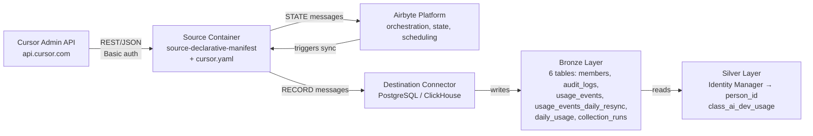
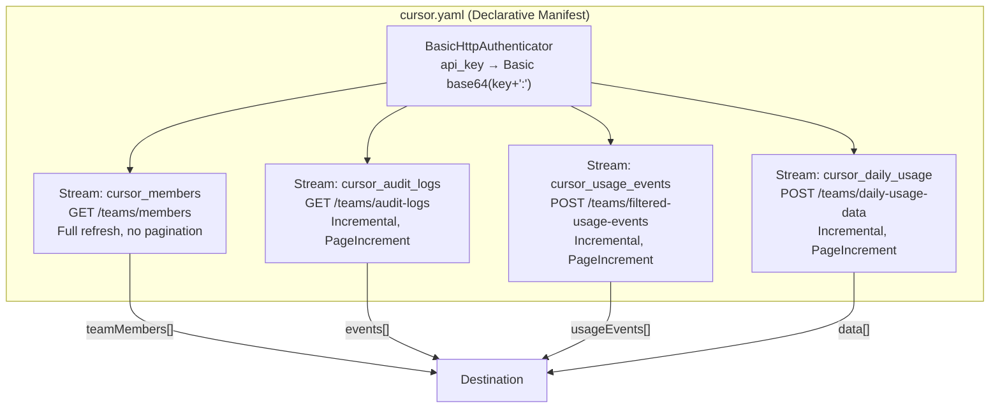
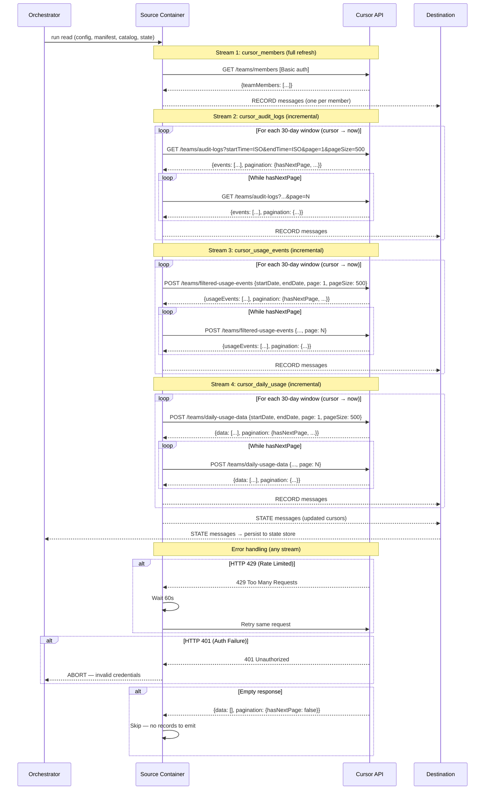

# DESIGN — Cursor Connector

- [ ] `p3` - **ID**: `cpt-insightspec-design-cursor-connector`

<!-- toc -->

- [1. Architecture Overview](#1-architecture-overview)
  - [1.1 Architectural Vision](#11-architectural-vision)
  - [1.2 Architecture Drivers](#12-architecture-drivers)
  - [1.3 Architecture Layers](#13-architecture-layers)
- [2. Principles & Constraints](#2-principles--constraints)
  - [2.1 Design Principles](#21-design-principles)
  - [2.2 Constraints](#22-constraints)
- [3. Technical Architecture](#3-technical-architecture)
  - [3.1 Domain Model](#31-domain-model)
  - [3.2 Component Model](#32-component-model)
  - [3.3 API Contracts](#33-api-contracts)
  - [3.4 Internal Dependencies](#34-internal-dependencies)
  - [3.5 External Dependencies](#35-external-dependencies)
  - [3.6 Interactions & Sequences](#36-interactions--sequences)
  - [3.7 Database schemas & tables](#37-database-schemas--tables)
  - [3.8 Deployment Topology](#38-deployment-topology)
- [4. Additional context](#4-additional-context)
  - [Identity Resolution Strategy](#identity-resolution-strategy)
  - [Silver / Gold Mappings](#silver--gold-mappings)
  - [Incremental Sync Strategy](#incremental-sync-strategy)
  - [Dual-Schedule Sync](#dual-schedule-sync)
  - [Collection Runs Monitoring](#collection-runs-monitoring)
  - [Capacity Estimates](#capacity-estimates)
  - [API Discrepancies Log](#api-discrepancies-log)
  - [Open Questions](#open-questions)
  - [Non-Applicable Domains](#non-applicable-domains)
  - [Architecture Decision Records](#architecture-decision-records)
- [5. Traceability](#5-traceability)

<!-- /toc -->

## 1. Architecture Overview

### 1.1 Architectural Vision

The Cursor Connector extracts team membership, audit logs, individual AI usage events, and daily aggregated usage from four Cursor Admin API endpoints and delivers them to the Bronze layer of the Insight platform. The connector is implemented as an Airbyte declarative manifest — a YAML file that defines all streams, authentication, pagination, incremental sync, and schemas without code.

The connector defines four data streams, one resync stream, and one monitoring stream:

1. **`cursor_members`** — team member directory via `GET /teams/members` (full refresh)
2. **`cursor_audit_logs`** — security/admin events via `GET /teams/audit-logs` (incremental, GET with query params)
3. **`cursor_usage_events`** — individual AI invocations via `POST /teams/filtered-usage-events` (hourly incremental, POST with JSON body)
4. **`cursor_usage_events_daily_resync`** — same endpoint, re-fetches previous day after 12:08:04 UTC to capture retroactive cost adjustments
5. **`cursor_daily_usage`** — daily per-user aggregated metrics via `POST /teams/daily-usage-data` (incremental, POST with JSON body)

A sixth stream (`cursor_collection_runs`) captures connector execution metadata for operational monitoring.

All four data streams share the identity key `email` (field name varies: `email` in members/daily-usage, `userEmail` in events, `user_email` in audit logs). The monitoring stream `cursor_collection_runs` does not carry a user identity field — it records connector execution metadata only.

#### System Context



### 1.2 Architecture Drivers

**PRD**: [PRD.md](./PRD.md)

#### Functional Drivers

| Requirement | Design Response |
|-------------|-----------------|
| `cpt-insightspec-fr-cursor-team-members` | Stream `cursor_members` → `GET /teams/members` (full refresh) |
| `cpt-insightspec-fr-cursor-audit-logs` | Stream `cursor_audit_logs` → `GET /teams/audit-logs` (incremental) |
| `cpt-insightspec-fr-cursor-usage-events` | Stream `cursor_usage_events` → `POST /teams/filtered-usage-events` (hourly incremental) |
| `cpt-insightspec-fr-cursor-dual-sync` | Stream `cursor_usage_events_daily_resync` → same endpoint, daily after 12:08 UTC, re-fetches previous day |
| `cpt-insightspec-fr-cursor-daily-usage` | Stream `cursor_daily_usage` → `POST /teams/daily-usage-data` (incremental) |
| `cpt-insightspec-fr-cursor-collection-runs` | Stream `cursor_collection_runs` — connector execution log |
| `cpt-insightspec-fr-cursor-deduplication` | Primary keys: `email` (members), `event_id` (audit), `unique` (events/daily) |
| `cpt-insightspec-fr-cursor-identity-key` | `email`/`userEmail` present in all streams |

#### NFR Allocation

| NFR ID | NFR Summary | Allocated To | Design Response | Verification Approach |
|--------|-------------|--------------|-----------------|----------------------|
| `cpt-insightspec-nfr-cursor-freshness` | Data in Bronze ≤ 1h (events) / ≤ 24h (others) | Orchestrator scheduling | Scheduled runs; cursor starts from last sync position | Compare latest `timestamp`/`date` in Bronze with current time |
| `cpt-insightspec-nfr-cursor-completeness` | 100% extraction per stream per run | Pagination | All endpoints paginated to exhaustion; page size 500–1000 | Compare record count with API `totalUsageEventsCount` / `totalCount` / `pagination.totalUsers` |
| `cpt-insightspec-nfr-cursor-cost-accuracy` | Cost fields reflect latest API values | Billing period resync | Daily resync re-fetches full billing period (future) | Compare `requestsCosts` sum in Bronze with Cursor dashboard totals |

### 1.3 Architecture Layers

- [ ] `p3` - **ID**: `cpt-insightspec-tech-cursor-connector`

| Layer | Responsibility | Technology |
|-------|---------------|------------|
| Source API | Cursor Admin API endpoints | REST / JSON (GET + POST) |
| Authentication | Basic auth with team API key | `Authorization: Basic base64(key + ':')` |
| Connector | Stream definitions, pagination, incremental sync | Airbyte declarative manifest (YAML) |
| Execution | Container runtime for source and destination | Airbyte Declarative Connector framework (latest) |
| Bronze | Raw data storage with source-native schema | Destination connector (PostgreSQL / ClickHouse) |

## 2. Principles & Constraints

### 2.1 Design Principles

#### One Stream per Endpoint

- [ ] `p2` - **ID**: `cpt-insightspec-principle-cursor-one-stream-per-endpoint`

Each Cursor API endpoint maps to exactly one stream. `GET /teams/members` → `cursor_members`. `GET /teams/audit-logs` → `cursor_audit_logs`. `POST /teams/filtered-usage-events` → `cursor_usage_events`. `POST /teams/daily-usage-data` → `cursor_daily_usage`. This preserves the API's data model without transformation and keeps each stream independently configurable.

#### Source-Native Schema with Nested Objects

- [ ] `p2` - **ID**: `cpt-insightspec-principle-cursor-source-native-schema`

Bronze tables preserve the original Cursor API field names in their native casing (camelCase for most fields). Nested objects (notably `tokenUsage` in usage events) are preserved as-is at Bronze level — flattening and type normalisation happen in the Silver layer. The only added fields are `collected_at`, `data_source`, and `_version` for deduplication.

### 2.2 Constraints

#### Basic Authentication

- [ ] `p2` - **ID**: `cpt-insightspec-constraint-cursor-basic-auth`

The Cursor Admin API uses Basic authentication. The API key is encoded as `base64(api_key + ':')` and sent in the `Authorization` header. This differs from simple Bearer token auth — the manifest must use `BasicHttpAuthenticator` (not `BearerAuthenticator`).

**Note**: The old manifest (cursor_old.yaml) incorrectly used `BearerAuthenticator`. The correct authenticator is `BasicHttpAuthenticator` with `username = api_key` and empty password.

#### POST Endpoints with JSON Body

- [ ] `p2` - **ID**: `cpt-insightspec-constraint-cursor-post-endpoints`

Two of the four endpoints (`filtered-usage-events`, `daily-usage-data`) use HTTP POST with a JSON request body for date range and pagination parameters. The body fields are: `startDate` (epoch ms), `endDate` (epoch ms), `page` (int), `pageSize` (int). The `/teams/filtered-usage-events` endpoint requires date values as **numeric** epoch milliseconds — sending them as strings causes HTTP 500. Airbyte's `start_time_option`/`end_time_option` with `inject_into: body_json` sends values as strings, so for this endpoint dates are placed in the requester's `request_body_json` with Jinja `| int` filter to force numeric type: `startDate: "{{ stream_interval.start_time | int }}"`. The `incremental_sync` section generates the stream interval but does NOT inject dates into the request. The `/teams/daily-usage-data` endpoint tolerates string epoch ms and uses `start_time_option`/`end_time_option` directly. Pagination fields (`page`/`pageSize`) are injected by the paginator in both cases.

#### API Rate Limiting

- [ ] `p2` - **ID**: `cpt-insightspec-constraint-cursor-rate-limiting`

The Cursor API enforces rate limits via HTTP 429 responses. The recommended retry delay is 60 seconds. Between successive API calls, a 3-second delay is recommended to avoid triggering rate limits proactively.

#### Billing Period Boundaries

- [ ] `p2` - **ID**: `cpt-insightspec-constraint-cursor-billing-period`

Cursor billing periods start on the 27th of each month at 12:08:04 UTC. Usage events within the current billing period may have `requestsCosts`, `totalCents`, and `cursorTokenFee` adjusted retroactively. The connector should account for this by re-fetching the billing period window on sync.

#### Daily Usage Returns Zero-Activity Rows

- [ ] `p2` - **ID**: `cpt-insightspec-constraint-cursor-zero-activity-rows`

The `POST /teams/daily-usage-data` endpoint returns rows for all team members for every date in the requested window, even when a user had zero activity. This means an empty response array does not indicate "no data before this date" — the connector must check actual metric values (not just array length) to determine the earliest date with real activity during backfill.

## 3. Technical Architecture

### 3.1 Domain Model

| Entity | Description |
|--------|-------------|
| `TeamMember` | A user account in the Cursor team. Key: `email`. Contains name, role, removal status. |
| `AuditEvent` | An administrative/security event. Key: `event_id`. Contains event type, user email, event data (JSON), IP address. |
| `UsageEvent` | A single AI invocation. Key: `unique` (email + timestamp). Contains model, kind, cost, billing flags, and optional `tokenUsage` nested object. |
| `DailyUsage` | One user's aggregated AI activity for one date. Key: `unique` (email + date). Contains request counts, tab metrics, code metrics, model/extension metadata. |

**Relationships**:

- `TeamMember` → provides `email` → identity key for all other entities
- `UsageEvent` → keyed by `userEmail` + `timestamp` → disaggregated detail of `DailyUsage`
- `UsageEvent.tokenUsage` → nested 1:1 object → token-level cost breakdown (nullable)
- `DailyUsage` → keyed by `email` + `date` → aggregated roll-up of `UsageEvent`
- All entities → `email`/`userEmail` → resolved to `person_id` by Identity Manager (Silver)

**Schema format**: Airbyte declarative manifest YAML with inline JSON Schema definitions per stream.
**Schema location**: `src/ingestion/connectors/ai/cursor/connector.yaml` (to be created as the connector manifest).

### 3.2 Component Model

The Cursor connector is a single declarative manifest that defines four data streams. There are no custom code components.

#### Component Diagram



#### Connector Package Structure

The Cursor connector is packaged as a self-contained unit following the standard connector package layout:

```text
src/ingestion/connectors/ai/cursor/
├── connector.yaml          # Airbyte declarative manifest (nocode)
├── descriptor.yaml         # Package metadata: streams, Silver targets
└── dbt/
    ├── to_ai_dev_usage.sql # dbt model: Bronze → Silver (class_ai_dev_usage)
    └── schema.yml          # Column documentation + dbt tests (tenant_id not_null)
```

The dbt model `to_ai_dev_usage.sql` transforms `cursor_daily_usage` and `cursor_usage_events` Bronze tables into the unified `class_ai_dev_usage` Silver table. `tenant_id` MUST be preserved and tested with a `not_null` dbt test. The `data_source` column (already present in Bronze tables as `'insight_cursor'`) MUST be carried through to Silver as the canonical source discriminator — no separate `source` column is needed.

#### Connector Package Descriptor

- [ ] `p2` - **ID**: `cpt-insightspec-component-cursor-descriptor`

The `descriptor.yaml` registers the connector package with the platform, declaring its streams, Bronze table mappings, and Silver layer targets:

```yaml
name: cursor
version: "1.0"
type: nocode

silver_targets:
  - class_ai_dev_usage

streams:
  - name: cursor_members
    bronze_table: cursor_members
    primary_key: [email]
    cursor_field: null

  - name: cursor_audit_logs
    bronze_table: cursor_audit_logs
    primary_key: [event_id]
    cursor_field: timestamp

  - name: cursor_usage_events
    bronze_table: cursor_usage_events
    primary_key: [unique]
    cursor_field: timestamp

  - name: cursor_daily_usage
    bronze_table: cursor_daily_usage
    primary_key: [unique]
    cursor_field: date

  - name: cursor_collection_runs
    bronze_table: cursor_collection_runs
    primary_key: [run_id]
    cursor_field: null
```

**Descriptor fields**:

| Field | Type | Description |
|-------|------|-------------|
| `name` | String | Unique connector identifier |
| `version` | String | Package semantic version |
| `type` | Enum | `nocode` (declarative manifest) or `cdk` (custom Python) |
| `silver_targets` | Array(String) | Silver tables this connector populates |
| `streams[].name` | String | Airbyte stream name |
| `streams[].bronze_table` | String | ClickHouse Bronze table name |
| `streams[].primary_key` | Array(String) | Deduplication key fields |
| `streams[].cursor_field` | String / null | Incremental sync cursor field (`null` for full refresh or monitoring streams) |

#### Cursor Connector Manifest

- [ ] `p2` - **ID**: `cpt-insightspec-component-cursor-manifest`

##### Why this component exists

Defines the complete Cursor connector as a YAML declarative manifest executed by the Airbyte Declarative Connector framework. No code required.

##### Responsibility scope

Defines all 5 streams with: Cursor API endpoint paths, Basic authentication, page-based pagination (page/pageSize for POST endpoints; page/pageSize query params for GET endpoints), date-range-based incremental sync, and inline JSON schemas.

##### Manifest Skeleton

The manifest follows the Airbyte declarative framework structure (latest stable version). Key structural elements:

```yaml
version: "<latest>"
type: DeclarativeSource
check:
  type: CheckStream
  stream_names: [cursor_members]

streams:
  - type: DeclarativeStream
    name: cursor_usage_events
    primary_key: [unique]
    schema_loader:
      type: InlineSchemaLoader
      schema:
        type: object
        properties:
          tenant_id: { type: string }
          userEmail: { type: string }
          timestamp: { type: string }
          # ... remaining fields per §3.7 table schema
    retriever:
      type: SimpleRetriever
      requester:
        type: HttpRequester
        url_base: https://api.cursor.com
        path: /teams/filtered-usage-events
        http_method: POST
        authenticator:
          type: BasicHttpAuthenticator
          username: "{{ config['api_key'] }}"
        request_body_json:
          startDate: "{{ stream_interval.start_time | int }}"
          endDate: "{{ stream_interval.end_time | int }}"
      record_selector:
        type: RecordSelector
        extractor:
          type: DpathExtractor
          field_path: [usageEvents]
      paginator:
        type: DefaultPaginator
        pagination_strategy:
          type: PageIncrement
          page_size: 500
          start_from_page: 1
        page_token_option:
          type: RequestOption
          inject_into: body_json
          field_name: page
    transformations:
      - type: AddFields
        fields:
          - path: [tenant_id]
            value: "{{ config['tenant_id'] }}"
          - path: [unique]
            value: "{{ record['userEmail'] }}{{ record['timestamp'] }}"
    incremental_sync:
      type: DatetimeBasedCursor
      cursor_field: timestamp
      # ... cursor configuration
  # ... remaining streams follow same pattern

spec:
  type: Spec
  connection_specification:
    type: object
    required: [tenant_id, api_key]
    properties:
      tenant_id:
        type: string
        title: Tenant ID
        order: 0
      api_key:
        type: string
        title: API Key
        airbyte_secret: true
        order: 1
```

This is a structural skeleton — the full manifest is in `src/ingestion/connectors/ai/cursor/connector.yaml`.

##### Responsibility boundaries

Orchestration, scheduling, and state storage are handled by the Airbyte platform. Silver/Gold transformations and destination-specific configuration are out of scope. Dual-schedule sync is an orchestrator concern, not a manifest responsibility.

##### Related components (by ID)

- Airbyte Declarative Connector framework (`source-declarative-manifest` image) — executes this manifest

#### tenant_id Injection Component

- [ ] `p1` - **ID**: `cpt-insightspec-component-cursor-tenant-id-injection`

Ensures every record emitted by all streams contains `tenant_id` from the connector config. Implemented as an `AddFields` transformation in the manifest, applied to every stream. See §3.3 Source Config Schema for the injection pattern.

### 3.3 API Contracts

#### Cursor Admin API Endpoints

- [ ] `p2` - **ID**: `cpt-insightspec-interface-cursor-api-endpoints`

- **Contracts**: `cpt-insightspec-contract-cursor-admin-api`
- **Technology**: REST / JSON

| Stream | Endpoint | Method | Pagination | Date Params |
|--------|----------|--------|------------|-------------|
| `cursor_members` | `GET /teams/members` | GET | None (returns all) | None |
| `cursor_audit_logs` | `GET /teams/audit-logs` | GET | Query: `page`, `pageSize` | Query: `startTime` (ISO), `endTime` (ISO) |
| `cursor_usage_events` | `POST /teams/filtered-usage-events` | POST | Body: `page`, `pageSize` | Body: `startDate` (epoch ms), `endDate` (epoch ms) |
| `cursor_daily_usage` | `POST /teams/daily-usage-data` | POST | Body: `page`, `pageSize` | Body: `startDate` (epoch ms), `endDate` (epoch ms) |

**Pagination details**:

| Stream | Response pagination object | Stop condition |
|--------|---------------------------|----------------|
| `cursor_members` | None — single response | N/A |
| `cursor_audit_logs` | `{page, pageSize, totalCount, totalPages, hasNextPage, hasPreviousPage}` | `hasNextPage = false` |
| `cursor_usage_events` | `{numPages, currentPage, pageSize, hasNextPage, hasPreviousPage}` | `hasNextPage = false` |
| `cursor_daily_usage` | `{page, pageSize, totalUsers, totalPages, hasNextPage, hasPreviousPage}` | `hasNextPage = false` |

**Response structure**:

| Stream | Response root fields | Records path |
|--------|---------------------|--------------|
| `cursor_members` | `{teamMembers: [...]}` | `teamMembers` |
| `cursor_audit_logs` | `{events: [...], pagination: {...}}` | `events` |
| `cursor_usage_events` | `{totalUsageEventsCount, usageEvents: [...], pagination: {...}, period: {...}}` | `usageEvents` |
| `cursor_daily_usage` | `{data: [...], period: {...}, pagination: {...}}` | `data` |

**Authentication**:

Basic HTTP authentication:
- Header: `Authorization: Basic base64(api_key + ':')`
- In Airbyte manifest: `BasicHttpAuthenticator` with `username: {{ config['api_key'] }}` and no password

#### Source Config Schema

- [ ] `p2` - **ID**: `cpt-insightspec-interface-cursor-source-config`

The source config (credentials) for the Cursor connector:

```json
{
  "tenant_id": "Tenant isolation identifier (UUID)",
  "api_key": "Cursor team API key"
}
```

Both fields are required. `tenant_id` is a platform invariant — every connector must accept it. `api_key` is marked `airbyte_secret: true` — it is never logged or displayed.

#### tenant_id Injection

Per the ingestion layer tenant isolation principle (see [Ingestion Layer DESIGN](../../../../domain/ingestion/specs/DESIGN.md)), every record emitted by the connector MUST contain `tenant_id`. This is achieved via an `AddFields` transformation in the manifest:

```yaml
# In spec.connection_specification:
required: [tenant_id, api_key]
properties:
  tenant_id:
    type: string
    title: Tenant ID
    description: Tenant isolation identifier
    order: 0
  api_key:
    type: string
    title: API Key
    airbyte_secret: true
    order: 1

# In each stream's transformations:
transformations:
  - type: AddFields
    fields:
      - path: [tenant_id]
        value: "{{ config['tenant_id'] }}"
```

This transformation is applied to **every stream** in the manifest, ensuring `tenant_id` is present in every record before it reaches the destination.

### 3.4 Internal Dependencies

| Component | Depends On | Interface |
|-----------|------------|-----------|
| Cursor Manifest | Airbyte Declarative Connector framework | Executed by `source-declarative-manifest` image |
| Silver pipeline | Cursor Bronze tables | Reads `email`/`userEmail`, activity fields, `tokenUsage` (JSON) |
| Identity Manager | `email`/`userEmail` fields | Resolves email → canonical `person_id` |

### 3.5 External Dependencies

#### Cursor API

| Dependency | Purpose | Notes |
|------------|---------|-------|
| `api.cursor.com` | All four endpoints | Rate-limited (HTTP 429); Basic auth |

#### Docker Hub Images

| Image | Purpose |
|-------|---------|
| `airbyte/source-declarative-manifest` | Executes the Cursor manifest |
| `airbyte/destination-postgres` (or other) | Writes to Bronze layer |

### 3.6 Interactions & Sequences

#### Incremental Sync Run

**ID**: `cpt-insightspec-seq-cursor-sync`

**Use cases**: `cpt-insightspec-usecase-cursor-incremental-sync`

**Actors**: `cpt-insightspec-actor-cursor-operator`



**Description**: The connector authenticates via Basic auth on every request. It first fetches the full team member directory (full refresh), then incrementally fetches audit logs, usage events, and daily usage for the date range from the last cursor to now. Each endpoint is paginated to exhaustion using `hasNextPage`. For POST endpoints, date range and pagination are sent in the JSON request body. For GET endpoints, they are sent as query parameters. After all streams complete, the updated cursor state is persisted.

### 3.7 Database schemas & tables

Bronze tables are created by the Airbyte destination (ClickHouse). In addition to the connector-defined columns listed below, the Airbyte destination automatically adds framework columns to every table:

| Column | Type | Description |
|--------|------|-------------|
| `_airbyte_raw_id` | String | Airbyte deduplication key — auto-generated |
| `_airbyte_extracted_at` | DateTime64 | Extraction timestamp — auto-generated |

These columns are not defined in the manifest schema but are present in all Bronze tables at runtime.

#### Table: `cursor_members`

| Field | Type | Description |
|-------|------|-------------|
| `tenant_id` | UUID | Workspace isolation key — framework-injected |
| `source_instance_id` | String | Connector instance identifier — framework-injected, DEFAULT '' |
| `id` | String | Cursor internal member ID |
| `name` | String | Member display name |
| `email` | String | Member email — primary identity key → `person_id` |
| `role` | String | Team role (e.g. `owner`, `admin`, `member`) |
| `isRemoved` | Bool | Whether the member has been removed from the team |
| `collected_at` | DateTime | Collection timestamp |
| `data_source` | String | Always `insight_cursor` |
| `_version` | Int | Deduplication version (millisecond timestamp) |
| `metadata` | String (JSON) | Full API response |

**Indexes**:
- `idx_cursor_members_email`: `(email)`

#### Table: `cursor_audit_logs`

| Field | Type | Description |
|-------|------|-------------|
| `tenant_id` | UUID | Workspace isolation key — framework-injected |
| `source_instance_id` | String | Connector instance identifier — framework-injected, DEFAULT '' |
| `event_id` | String | Unique audit event identifier — primary key |
| `timestamp` | String | Event timestamp (ISO 8601) |
| `user_email` | String | User email — identity key |
| `event_type` | String | Event type (e.g. `member_added`, `role_changed`, `settings_updated`) |
| `event_data` | String (JSON) | Event-specific payload |
| `ip_address` | String | Source IP address (nullable) |
| `collected_at` | DateTime | Collection timestamp |
| `data_source` | String | Always `insight_cursor` |
| `_version` | Int | Deduplication version (millisecond timestamp) |
| `metadata` | String (JSON) | Full API response |

**Indexes**:
- `idx_cursor_audit_logs_timestamp`: `(timestamp)`
- `idx_cursor_audit_logs_user_email`: `(user_email)`
- `idx_cursor_audit_logs_event_type`: `(event_type)`

#### Table: `cursor_usage_events`

| Field | Type | Description |
|-------|------|-------------|
| `tenant_id` | UUID | Workspace isolation key — framework-injected |
| `source_instance_id` | String | Connector instance identifier — framework-injected, DEFAULT '' |
| `unique` | String | Primary key — computed as `userEmail + timestamp` |
| `userEmail` | String | User email — identity key |
| `timestamp` | String | Event timestamp (ISO 8601 or epoch ms) |
| `kind` | String | Event type: `chat`, `completion`, `agent`, `cmd-k`, etc. |
| `model` | String | AI model used, e.g. `gpt-4o`, `claude-3.5-sonnet` |
| `maxMode` | Bool | Whether max mode was enabled |
| `requestsCosts` | Float64 | Request cost in credits |
| `isTokenBasedCall` | Bool | Billed by tokens vs per-request |
| `isFreeBugbot` | Bool | Whether this was a free Bug Bot invocation |
| `cursorTokenFee` | Float64 | Cursor platform fee |
| `tokenUsage` | String (JSON) | Nested token breakdown: `{inputTokens, outputTokens, cacheReadTokens, cacheWriteTokens, totalCents}`. Null when token detail unavailable. |
| `collected_at` | DateTime | Collection timestamp |
| `data_source` | String | Always `insight_cursor` |
| `_version` | Int | Deduplication version (millisecond timestamp) |
| `metadata` | String (JSON) | Full API response |

**Indexes**:
- `idx_cursor_usage_events_timestamp`: `(timestamp)`
- `idx_cursor_usage_events_user_email`: `(userEmail)`
- `idx_cursor_usage_events_model`: `(model)`

**Notes**:

- `tokenUsage` is preserved as a nested JSON object at Bronze level. The Silver layer is responsible for flattening `inputTokens`, `outputTokens`, `cacheReadTokens`, `cacheWriteTokens`, `totalCents` into separate columns. When `tokenUsage` is `null`, the event has no token-level detail — this is **not** the same as zero-cost and must not be treated as such.
- The `unique` key is computed as a simple concatenation of `userEmail` and `timestamp`. See [ADR-0001](ADR/0001-usage-events-dedup-key.md) for the rationale, accepted collision risk, and Silver-layer mitigation path.
- The field `isFreeBugbot` is present in the actual API but was absent from the original connector specification (`cursor.md`). Fields `isChargeable` and `isHeadless` appear in the original specification but are **not** returned by the current API — see [API Discrepancies Log](#api-discrepancies-log).

#### Table: `cursor_usage_events_daily_resync`

Same schema as `cursor_usage_events` (same API endpoint, same fields, same primary key). This stream is synced daily after 12:08:04 UTC via a separate Airbyte connection, re-fetching the previous day's events to capture retroactive cost adjustments.

**Silver deduplication rule**: For all days up to and including yesterday, the Silver dbt model takes data from `cursor_usage_events_daily_resync` (authoritative, finalized costs). For today only, data is taken from `cursor_usage_events` (near-real-time, costs may still change).

#### Table: `cursor_daily_usage`

| Field | Type | Description |
|-------|------|-------------|
| `tenant_id` | UUID | Workspace isolation key — framework-injected |
| `source_instance_id` | String | Connector instance identifier — framework-injected, DEFAULT '' |
| `unique` | String | Primary key — computed as `email + date` |
| `userId` | String | Cursor platform user ID |
| `email` | String | User email — identity key |
| `day` | String | Day label (human-readable) |
| `date` | Int64 | Unix timestamp in milliseconds |
| `isActive` | Bool | Whether user had any activity this day |
| `chatRequests` | Float64 | AI chat interactions |
| `cmdkUsages` | Float64 | Cmd+K (inline edit) usages |
| `composerRequests` | Float64 | Composer feature requests |
| `agentRequests` | Float64 | Agent mode requests |
| `bugbotUsages` | Float64 | Bug bot usages |
| `totalTabsShown` | Float64 | Tab completion suggestions shown |
| `totalTabsAccepted` | Float64 | Tab completions accepted |
| `totalAccepts` | Float64 | All AI suggestions accepted |
| `totalApplies` | Float64 | Code applications (apply to file) |
| `totalRejects` | Float64 | Suggestions rejected |
| `totalLinesAdded` | Float64 | Total lines of code added |
| `totalLinesDeleted` | Float64 | Total lines deleted |
| `acceptedLinesAdded` | Float64 | Lines added from accepted AI suggestions |
| `acceptedLinesDeleted` | Float64 | Lines deleted from accepted AI suggestions |
| `mostUsedModel` | String | Most used AI model that day |
| `tabMostUsedExtension` | String | File extension with most tab completions |
| `applyMostUsedExtension` | String | File extension with most applies |
| `clientVersion` | String | Cursor IDE version |
| `subscriptionIncludedReqs` | Float64 | Requests covered by subscription |
| `usageBasedReqs` | Float64 | Requests on usage-based billing |
| `apiKeyReqs` | Float64 | Requests using API key |
| `collected_at` | DateTime | Collection timestamp |
| `data_source` | String | Always `insight_cursor` |
| `_version` | Int | Deduplication version (millisecond timestamp) |
| `metadata` | String (JSON) | Full API response row |

**Indexes**:
- `idx_cursor_daily_usage_email_date`: `(email, date)`
- `idx_cursor_daily_usage_date`: `(date)`

**Note**: The `POST /teams/daily-usage-data` endpoint returns one row per user per date within the requested `startDate`/`endDate` window, **including zero-activity rows for all team members**. Rows are deduplicated by `(email, date)` using `_version`. The API returns numeric metric fields as numbers (not nullable) — zero means no activity, which is distinct from a missing field.

#### Table: `cursor_collection_runs`

| Field | Type | Description |
|-------|------|-------------|
| `tenant_id` | UUID | Workspace isolation key — framework-injected |
| `source_instance_id` | String | Connector instance identifier — framework-injected, DEFAULT '' |
| `run_id` | String | Unique run identifier |
| `started_at` | DateTime | Run start time |
| `completed_at` | DateTime | Run end time |
| `status` | String | `running` / `completed` / `failed` |
| `members_collected` | Number | Rows collected for `cursor_members` |
| `audit_logs_collected` | Number | Rows collected for `cursor_audit_logs` |
| `usage_events_collected` | Number | Rows collected for `cursor_usage_events` |
| `daily_usage_collected` | Number | Rows collected for `cursor_daily_usage` |
| `api_calls` | Number | Total API calls made |
| `errors` | Number | Errors encountered |
| `settings` | String (JSON) | Collection configuration (team, lookback period) |

Monitoring table — not an analytics source.

### 3.8 Deployment Topology

- [ ] `p3` - **ID**: `cpt-insightspec-topology-cursor-connector`

The Cursor connector uses one manifest and two Airbyte connections with different schedules:

```text
Package: src/ingestion/connectors/ai/cursor/
├── connector.yaml (declarative manifest — 6 streams)
├── descriptor.yaml (package metadata)
└── dbt/ (Bronze → Silver)

Connection A: cursor-{team_name}-hourly
├── Schedule: hourly (via Kestra cron)
├── Source image: airbyte/source-declarative-manifest
├── Source config: {tenant_id, api_key}
├── Streams: cursor_members, cursor_audit_logs, cursor_usage_events,
│            cursor_daily_usage, cursor_collection_runs
├── Destination: ClickHouse (Bronze)
└── State: per-stream cursors

Connection B: cursor-{team_name}-daily-resync
├── Schedule: daily after 12:08 UTC (via Kestra cron)
├── Source image: airbyte/source-declarative-manifest
├── Source config: {tenant_id, api_key}
├── Streams: cursor_usage_events_daily_resync (only)
├── Destination: ClickHouse (Bronze)
└── State: n/a (always fetches previous day)
```

## 4. Additional context

### Identity Resolution Strategy

`email` (in `cursor_members` and `cursor_daily_usage`) and `userEmail` (in `cursor_usage_events`) and `user_email` (in `cursor_audit_logs`) are the identity keys across all Cursor streams. All refer to the same user email.

The Identity Manager resolves `email`/`userEmail` → canonical `person_id` in Silver step 2. The `userId` (Cursor platform user ID) is available in `cursor_daily_usage` for Cursor-internal lookups but is not used for cross-system resolution.

**Cross-platform note**: Development teams commonly use multiple AI dev tools (Cursor, Windsurf, GitHub Copilot) simultaneously. Because all three sources use `email` as the identity key and map to the same `class_ai_dev_usage` unified table with `data_source` discriminators, Silver step 2 can aggregate total AI usage across all platforms per `person_id` without joins.

### Silver / Gold Mappings

| Bronze table | Silver target | Status |
|-------------|--------------|--------|
| `cursor_members` | Identity Manager (`email` → `person_id`) | Used for identity resolution |
| `cursor_audit_logs` | *(no unified target)* | Available for security analytics |
| `cursor_usage_events` | `class_ai_dev_usage` | Planned — event-level detail + cost |
| `cursor_daily_usage` | `class_ai_dev_usage` | Planned — daily aggregated metrics |

**`class_ai_dev_usage` field mapping** (from `cursor_daily_usage`):

| Unified field | Cursor source | Notes |
|---------------|---------------|-------|
| `source_instance_id` | configured at collection | Connector instance, e.g. `cursor-acme` |
| `user_id` | `userId` | Source-native ID |
| `email` | `email` | Identity key |
| `date` | `date` (epoch ms → date) | Report date |
| `chat_requests` | `chatRequests` | AI chat interactions |
| `agent_requests` | `agentRequests` | Agent mode requests |
| `composer_requests` | `composerRequests` | Composer feature requests |
| `inline_edit_requests` | `cmdkUsages` | Cmd+K usages |
| `tab_completions_shown` | `totalTabsShown` | Tab suggestions shown |
| `tab_completions_accepted` | `totalTabsAccepted` | Tab suggestions accepted |
| `total_lines_added` | `totalLinesAdded` | Lines of code added |
| `total_lines_deleted` | `totalLinesDeleted` | Lines deleted |
| `accepted_lines_added` | `acceptedLinesAdded` | Lines added from AI |
| `accepted_lines_deleted` | `acceptedLinesDeleted` | Lines deleted from AI |
| `most_used_model` | `mostUsedModel` | E.g. `claude-3.5-sonnet` |
| `is_active` | `isActive` | Had activity this day |
| `subscription_requests` | `subscriptionIncludedReqs` | Requests in plan |
| `usage_based_requests` | `usageBasedReqs` | Overage requests |
| `api_key_requests` | `apiKeyReqs` | API key requests |
| `bugbot_usages` | `bugbotUsages` | Bug bot usages |

**`class_ai_dev_usage` field mapping** (from `cursor_usage_events`):

| Unified field | Cursor source | Notes |
|---------------|---------------|-------|
| `email` | `userEmail` | Identity key |
| `timestamp` | `timestamp` | Event timestamp |
| `event_kind` | `kind` | `chat`, `completion`, `agent`, `cmd-k` |
| `model` | `model` | AI model used |
| `request_cost` | `requestsCosts` | Cost in credits |
| `platform_fee` | `cursorTokenFee` | Cursor platform fee |
| `is_token_based` | `isTokenBasedCall` | Billing method |
| `is_free_bugbot` | `isFreeBugbot` | Free Bug Bot flag |
| `input_tokens` | `tokenUsage.inputTokens` | From nested JSON (Silver flattens) |
| `output_tokens` | `tokenUsage.outputTokens` | From nested JSON |
| `cache_read_tokens` | `tokenUsage.cacheReadTokens` | From nested JSON |
| `cache_write_tokens` | `tokenUsage.cacheWriteTokens` | From nested JSON |
| `total_cents` | `tokenUsage.totalCents` | From nested JSON |

**Gold metrics** produced by including Cursor in `class_ai_dev_usage`:
- **AI adoption rate**: percentage of team members with `isActive = true` per week
- **Cost per user**: `requestsCosts` + `cursorTokenFee` aggregated per person per billing period
- **Tab acceptance rate**: `totalTabsAccepted / totalTabsShown` per user per week
- **AI lines ratio**: `acceptedLinesAdded / totalLinesAdded` — what fraction of code comes from AI
- **Model distribution**: breakdown of `model` usage across the team
- **Cross-tool comparison**: Cursor vs Windsurf vs Copilot adoption, cost, and acceptance rates per `person_id`

### Incremental Sync Strategy

Each incremental stream uses a date/time-based cursor:

| Stream | Cursor field | Cursor format | Start datetime (first run) | End datetime |
|--------|-------------|---------------|---------------------------|--------------|
| `cursor_audit_logs` | `timestamp` | ISO 8601 | `day_delta(-30)` | now |
| `cursor_usage_events` | `timestamp` | epoch ms | `day_delta(-30)` | now |
| `cursor_daily_usage` | `date` | epoch ms | `day_delta(-30)` | now |

On first run (empty state), each stream extracts the last 30 days (configurable). On subsequent runs, the cursor starts from the last stored position.

**Window splitting**: The Cursor API supports a maximum date range of approximately 30 days per request. For gaps larger than 30 days (e.g. after a long connector outage), the manifest should split the range into 30-day windows and fetch sequentially.

**Backfill**: On first run with an empty table, the connector probes backwards in 30-day windows to find the earliest window with data, then fetches forward from that point to now. For `cursor_daily_usage`, the probe checks actual metric values (not just array length) because the API returns zero-activity rows for all team members.

### Dual-Schedule Sync

**Ref**: `cpt-insightspec-fr-cursor-dual-sync` (defined in [PRD.md](./PRD.md))

The connector implements a dual-schedule sync for usage events via two streams and two Airbyte connections:

| Component | Connection A (hourly) | Connection B (daily resync) |
|-----------|----------------------|----------------------------|
| **Stream** | `cursor_usage_events` | `cursor_usage_events_daily_resync` |
| **Schedule** | Hourly (Kestra cron) | Daily after 12:08:04 UTC (Kestra cron) |
| **Lookback** | Incremental from cursor | Always previous day: `day_delta(-1, format='%Y-%m-%dT12:08:04Z')` → `day_delta(0, format='%Y-%m-%dT12:08:04Z')` |
| **Purpose** | Near-real-time event visibility | Capture retroactive cost adjustments |
| **Bronze table** | `cursor_usage_events` | `cursor_usage_events_daily_resync` |

**Manifest implementation**: The resync stream uses a fixed window that always fetches yesterday:

```yaml
- type: DeclarativeStream
  name: cursor_usage_events_daily_resync
  # ...same schema, auth, pagination as cursor_usage_events...
  incremental_sync:
    type: DatetimeBasedCursor
    cursor_field: timestamp
    datetime_format: "%ms"
    start_datetime:
      type: MinMaxDatetime
      datetime: "{{ day_delta(-1, format='%Y-%m-%dT12:08:04Z') }}"
    end_datetime:
      type: MinMaxDatetime
      datetime: "{{ day_delta(0, format='%Y-%m-%dT12:08:04Z') }}"
```

**Silver deduplication rule** (in `dbt/to_ai_dev_usage.sql`):

- **Yesterday and earlier**: data from `cursor_usage_events_daily_resync` (authoritative — finalized costs)
- **Today**: data from `cursor_usage_events` (near-real-time — costs may change)

This matches the production system pattern (`additional/usage-events-sync.ts`) which implements `scheduleNext()` (hourly) + `scheduleResync()` (daily at 03:00 UTC). The 12:08:04 UTC boundary aligns with the Cursor billing cycle daily cutoff.

### Collection Runs Monitoring

The `cursor_collection_runs` stream captures execution metadata for each connector run — timing, per-stream record counts, API call count, and error count. This stream is defined in the manifest alongside the four data streams. The Bronze table schema is documented in §3.7.

The collection runs table is a monitoring/operational table and is not an analytics source. It enables alerting on failed runs and tracking data completeness over time.

### Capacity Estimates

Expected data volumes for typical deployments (10–500 user teams):

| Stream | Volume per sync | Pages (pageSize=500) | Estimated sync time |
|--------|----------------|---------------------|---------------------|
| `cursor_members` | 10–500 rows | 1 (no pagination) | < 5s |
| `cursor_audit_logs` | 10–100 events/day | 1 page | < 10s |
| `cursor_usage_events` | 500–50,000 events/day; 15K–1.5M per 30-day window | 1–100 pages per window | 30s–10min per window |
| `cursor_usage_events_daily_resync` | 500–50,000 events (1 day) | 1–100 pages | 30s–10min |
| `cursor_daily_usage` | 10–500 rows/day; 300–15,000 per 30-day window | 1–30 pages per window | 10s–3min per window |

At 3-second inter-page delay and 500 records per page, a full 30-day backfill for a 200-person team takes approximately 5–15 minutes total across all streams.

**Cost considerations**: The connector makes no external compute or storage charges beyond the Airbyte platform's own resources. API call volume is proportional to team size and sync frequency.

### API Discrepancies Log

The following discrepancies were identified between the original connector specification (`cursor.md`), the old manifest (`cursor_old.yaml`), and the actual API behaviour observed in the production code (`additional/`):

| # | Area | Original spec / old manifest | Actual API (from production code) | Resolution |
|---|------|------------------------------|-----------------------------------|------------|
| 1 | **Authentication** | Bearer token (`BearerAuthenticator`) | Basic auth (`Basic base64(key + ':')`) | Use Basic auth |
| 2 | **Events: `isChargeable`** | Present in spec and old manifest schema | **Not returned** by API | Removed from schema |
| 3 | **Events: `isHeadless`** | Present in spec and old manifest schema | **Not returned** by API | Removed from schema |
| 4 | **Events: `isFreeBugbot`** | Not in spec or old manifest | **Present** in API response | Added to schema |
| 5 | **Events: `discountPercentOff`** | Present in spec (`cursor_events_token_usage` table) | **Not returned** by API | Removed from schema |
| 6 | **Daily usage pagination** | Old manifest: `NoPagination` | API supports `page`/`pageSize` pagination | Use `PageIncrement` paginator |
| 7 | **Daily usage request body** | Old manifest: only `startDate` | API expects `startDate` + `endDate` + `page` + `pageSize` | Send all four fields |
| 8 | **Events request body** | Old manifest: `date` field | API expects `startDate` + `endDate` + `page` + `pageSize` | Send correct field names |
| 9 | **Streams: members** | Not in old manifest | `GET /teams/members` endpoint exists | Added as stream |
| 10 | **Streams: audit-logs** | Not in old manifest | `GET /teams/audit-logs` endpoint exists | Added as stream |
| 11 | **Events: unique key** | Old manifest: `userEmail + timestamp` (concatenation) | Production: SHA-256 hash of `timestamp\|userEmail\|model\|kind\|inputTokens\|outputTokens` | Use simple concatenation in manifest; note stronger hash for Silver |

**Important**: The actual API may continue to evolve. The production code in `additional/` represents a verified snapshot of API behaviour. The connector specification should be re-validated against the live API before deployment.

### Open Questions

**OQ-CUR-1: Silver stream for AI dev tool usage** — No `class_ai_dev_usage` (or equivalent) Silver stream is currently defined. Cursor, Windsurf, and GitHub Copilot represent the same category but with different granularities:

- Cursor: per-event detail + daily aggregates + separate token detail (nested)
- Windsurf: per-event (with inline token fields) + daily aggregates
- GitHub Copilot: org-level only (no per-user events)

Should `class_ai_dev_usage` be a daily aggregate table (harmonised across all three sources)? Or should it be event-level for Cursor + Windsurf, with Copilot contributing only aggregate rows?

**OQ-CUR-2: `tokenUsage` null semantics** — The `tokenUsage` nested object is null for some events. The conditions under which token data is absent are unclear:

- Per-request billing (flat fee, no token count)?
- Cursor API limitation for certain model types?
- Understanding this is important for Silver cost aggregation — null `tokenUsage` must not be treated as zero-cost events.

**OQ-CUR-3: Billing period boundary handling** — Cursor billing periods start on the 27th at 12:08:04 UTC. Events near the boundary may shift between periods. Should the connector overlap sync windows across billing boundaries to ensure no events are missed?

**OQ-CUR-4: Audit log event types** — The full taxonomy of `event_type` values in `cursor_audit_logs` is not documented in the Cursor API. The Silver layer needs a known set of event types to classify security events. Should we enumerate observed types from production data?

**OQ-CUR-5: `maxMode` flag scope** — The `maxMode` boolean on usage events indicates a premium model tier was used. The pricing implications of `maxMode = true` are not documented. Should Silver cost calculations apply a multiplier or rely solely on the `requestsCosts` field?

### Non-Applicable Domains

The following checklist domains have been evaluated and are not applicable for this connector:

| Domain | Reason |
|--------|--------|
| **PERF (Performance)** | Batch data pipeline with native API pagination. No caching, connection pooling, or latency optimization needed. Rate limit handling (HTTP 429 → 60s retry) is the only performance-related concern, documented in Constraints §2.2. |
| **SEC (Security)** | Authentication is delegated to the Airbyte framework: the API key is stored as `airbyte_secret`, never logged or exposed. The declarative manifest contains no custom security logic. No user-facing endpoints, no authorization model, no data encryption beyond what the destination provides. |
| **REL (Reliability)** | Idempotent extraction via deduplication keys (`unique`, `event_id`, `email`). No distributed state, no transactions, no saga patterns. Recovery = re-run the sync; the Airbyte framework manages cursor state and retry. |
| **OPS (Operations)** | Deployed as a standard Airbyte connection — no custom infrastructure, no IaC, no observability beyond what the Airbyte platform provides (job logs, sync metrics, alerting). Deployment topology documented in §3.8. |
| **MAINT (Maintainability)** | Declarative YAML manifest with no custom code. Maintenance consists of updating field definitions when the API schema changes. No module structure, dependency injection, or layering needed. |
| **TEST (Testing)** | Declarative connector validated by the Airbyte framework's built-in checks (connection check, schema validation). No custom code to unit-test. Integration testing = run a sync against the live API. |
| **COMPL (Compliance)** | Limited but applicable. The connector extracts work emails and AI activity metrics — personal/work-linked data under GDPR. Minimum controls: (1) Data classification: emails are personal data; activity metrics are work-linked. (2) Retention and deletion: responsibility of the Airbyte platform and destination owner. (3) Masking/redaction: recommend destination-level controls if required by policy. (4) GDPR/data residency: data access controls owned by the platform operator; connector does not store data beyond transit. |
| **UX (Usability)** | No user-facing interface. The only UX surface is the Airbyte connection configuration form (two required fields: `tenant_id` and `api_key`), which is defined by the `spec` section of the manifest. |

### Architecture Decision Records

| ADR | Decision | Status |
|-----|----------|--------|
| [ADR-0001](ADR/0001-usage-events-dedup-key.md) | Usage events deduplication key: simple concatenation (`userEmail + timestamp`) over SHA-256 hash — accepted collision risk at ms precision, production parity, Silver layer can re-hash if needed | Accepted |

Additional architectural decisions documented inline:

- **Authentication mechanism** (Basic auth over Bearer): §2.2 Constraint `cpt-insightspec-constraint-cursor-basic-auth`
- **Token usage nested vs flattened**: §3.7 Table `cursor_usage_events` Notes
- **Dual-schedule sync strategy**: §4 Dual-Schedule Sync
- **API discrepancies resolution**: §4 API Discrepancies Log

## 5. Traceability

- **PRD**: [PRD.md](./PRD.md)
- **ADRs**: [ADR/](./ADR/) (none yet — see ADR Status above)
- **Source specification**: [../../cursor/cursor.md](../../cursor/cursor.md)
- **Reference implementation**: [../../cursor/additional/](../../cursor/additional/) (production code, not part of connector)
- **AI Tool domain**: [docs/components/connectors/ai/](../../)
