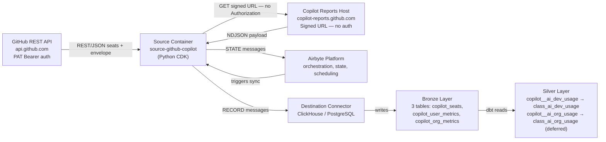
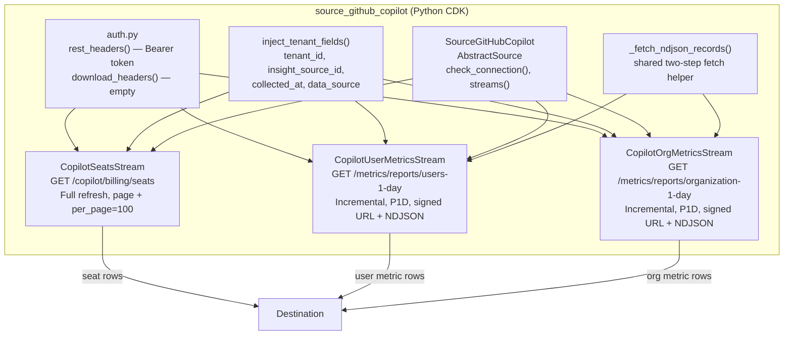
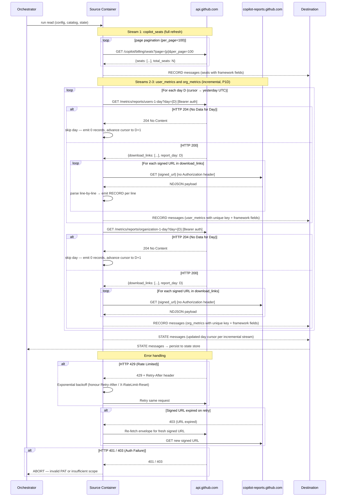

# DESIGN — GitHub Copilot Connector

- [ ] `p3` - **ID**: `cpt-insightspec-design-ghcopilot-connector`

<!-- toc -->

- [1. Architecture Overview](#1-architecture-overview)
  - [1.1 Architectural Vision](#11-architectural-vision)
  - [1.2 Architecture Drivers](#12-architecture-drivers)
  - [1.3 Architecture Layers](#13-architecture-layers)
- [2. Principles & Constraints](#2-principles--constraints)
  - [2.1 Design Principles](#21-design-principles)
  - [2.2 Constraints](#22-constraints)
- [3. Technical Architecture](#3-technical-architecture)
  - [3.1 Domain Model](#31-domain-model)
  - [3.2 Component Model](#32-component-model)
  - [3.3 API Contracts](#33-api-contracts)
  - [3.4 Internal Dependencies](#34-internal-dependencies)
  - [3.5 External Dependencies](#35-external-dependencies)
  - [3.6 Interactions & Sequences](#36-interactions--sequences)
  - [3.7 Database schemas & tables](#37-database-schemas--tables)
  - [3.8 Deployment Topology](#38-deployment-topology)
- [4. Additional context](#4-additional-context)
  - [Identity Resolution Strategy](#identity-resolution-strategy)
  - [Silver / Gold Mappings](#silver--gold-mappings)
  - [Incremental Sync Strategy](#incremental-sync-strategy)
  - [Capacity Estimates](#capacity-estimates)
  - [Non-Applicable Domains](#non-applicable-domains)
  - [Architecture Decision Records](#architecture-decision-records)
- [5. Traceability](#5-traceability)

<!-- /toc -->

## 1. Architecture Overview

### 1.1 Architectural Vision

The GitHub Copilot connector is an Airbyte Python CDK connector implemented as an `AbstractSource` with three streams. It extracts seat roster and daily usage metrics from the GitHub REST API and writes to the Bronze layer under the `bronze_github_copilot` namespace. The Python CDK is required over the declarative manifest framework due to the two-step signed-URL fetch pattern (per-request auth suppression + NDJSON parsing) — see [ADR-0001](./ADR/0001-python-cdk-over-declarative-manifest.md).

One `AbstractSource` (`SourceGitHubCopilot`) exposes three streams:

- `copilot_seats` — full-refresh seat roster with offset pagination
- `copilot_user_metrics` — incremental per-user daily usage via the two-step signed URL fetch
- `copilot_org_metrics` — incremental org-level daily aggregates via the same two-step pattern

Two dbt Silver models are defined alongside the connector:

- `copilot__ai_dev_usage` — Bronze `copilot_user_metrics` joined with `copilot_seats` to resolve `user_login` → `user_email` → `class_ai_dev_usage`
- `copilot__ai_org_usage` — Bronze `copilot_org_metrics` → `class_ai_org_usage` (**deferred** — Silver view does not yet exist; model tagged for future activation)

#### System Context



### 1.2 Architecture Drivers

**PRD**: [PRD.md](./PRD.md)

#### Functional Drivers

| Requirement | Design Response |
|-------------|-----------------|
| `cpt-insightspec-fr-ghcopilot-seats-collect` | Stream `copilot_seats` → `GET /orgs/{org}/copilot/billing/seats` (full refresh, offset pagination) |
| `cpt-insightspec-fr-ghcopilot-seats-paginate` | `page` + `per_page=100` query params; advance until empty page or fewer than 100 items |
| `cpt-insightspec-fr-ghcopilot-user-metrics-collect` | Stream `copilot_user_metrics` → `GET /orgs/{org}/copilot/metrics/reports/users-1-day?day=YYYY-MM-DD` → signed URL → NDJSON |
| `cpt-insightspec-fr-ghcopilot-signed-url-fetch` | `_fetch_ndjson_records()` shared mixin: API call → envelope → GET each signed URL without `Authorization` → parse NDJSON line-by-line |
| `cpt-insightspec-fr-ghcopilot-user-metrics-incremental` | `DatetimeBasedCursor` on `day`, `step: P1D`; first run starts from `github_start_date` (default 90 days ago) |
| `cpt-insightspec-fr-ghcopilot-org-metrics-collect` | Stream `copilot_org_metrics` → `GET /orgs/{org}/copilot/metrics/reports/organization-1-day?day=YYYY-MM-DD` → signed URL → NDJSON |
| `cpt-insightspec-fr-ghcopilot-org-metrics-incremental` | Same `DatetimeBasedCursor` pattern as user metrics |
| `cpt-insightspec-fr-ghcopilot-collection-runs` | **Deferred to Phase 2** — monitoring table produced by Argo orchestrator |
| `cpt-insightspec-fr-ghcopilot-deduplication` | Primary keys: `user_login` (seats), composite `unique` (`day\|user_login` for user metrics, `insight_source_id\|day` for org metrics) |
| `cpt-insightspec-fr-ghcopilot-tenant-tagging` | `inject_tenant_fields()` applied in each stream's `parse_response()` — injects `tenant_id`, `insight_source_id`, `collected_at`, `data_source = 'insight_github_copilot'` |
| `cpt-insightspec-fr-ghcopilot-identity-key` | `copilot_seats.user_email` primary identity key; `copilot_user_metrics.user_login` resolved to email via Silver join |
| `cpt-insightspec-fr-ghcopilot-identity-email-only` | Silver model uses only `user_email` for cross-system resolution; GitHub numeric IDs retained in Bronze only |

#### NFR Allocation

| NFR ID | NFR Summary | Allocated To | Design Response | Verification Approach |
|--------|-------------|--------------|-----------------|----------------------|
| `cpt-insightspec-nfr-ghcopilot-auth` | PAT Bearer auth; no auth on download | `rest_headers()` / `download_headers()` in `auth.py` | `Authorization: Bearer {token}` for `api.github.com`; empty headers `{}` for signed-URL download | Integration test with valid/invalid PAT |
| `cpt-insightspec-nfr-ghcopilot-rate-limiting` | Exponential backoff on 429 | `RateLimitedSession` wrapper | Inspects `Retry-After` / `X-RateLimit-Reset`; exponential backoff with jitter | Observed behaviour during backfill |
| `cpt-insightspec-nfr-ghcopilot-freshness` | Data for day D within 48h | Scheduler config | Daily schedule at 02:00 UTC; cursor covers D-1 at minimum | SLA monitoring |
| `cpt-insightspec-nfr-ghcopilot-data-source` | `data_source = 'insight_github_copilot'` on all rows | `inject_tenant_fields()` | Hard-coded constant injected in every stream's `parse_response()` | Row-level assertion in integration tests |
| `cpt-insightspec-nfr-ghcopilot-idempotent` | No duplicates on re-sync | Primary key definitions | `user_login` (seats), composite `unique` (metrics streams) as Airbyte dedup keys | Run sync twice; verify row counts unchanged |
| `cpt-insightspec-nfr-ghcopilot-schema-stability` | Stable Bronze schema; additive-only changes | `spec.json` + versioning policy | Fixed column set per stream; new API fields handled via nullable columns or pass-through JSON | Schema diff in CI |

#### Architecture Decision Records

- **ADR-0001**: [Python CDK over declarative manifest](./ADR/0001-python-cdk-over-declarative-manifest.md) — `status: accepted`

### 1.3 Architecture Layers

- [ ] `p3` - **ID**: `cpt-insightspec-tech-ghcopilot-connector`

| Layer | Responsibility | Technology |
|-------|---------------|------------|
| Source API | GitHub Copilot REST API | REST / JSON (seats) + REST / NDJSON via signed URL (metrics) |
| Authentication | PAT Bearer for `api.github.com`; no auth for `copilot-reports.github.com` | `rest_headers()` / `download_headers()` in `auth.py` |
| Connector | Stream definitions, pagination, incremental sync, NDJSON parsing | Airbyte Python CDK (`AbstractSource` + `HttpStream`) |
| Execution | Container runtime for source and destination | Python CDK Docker image |
| Bronze | Raw data storage with source-native schema | Destination connector (ClickHouse / PostgreSQL) |
| Silver | Bronze → `class_ai_*` transformations | dbt (`copilot__ai_dev_usage`, `copilot__ai_org_usage`) |

## 2. Principles & Constraints

### 2.1 Design Principles

#### Python CDK for Non-Standard Fetch Patterns

- [ ] `p1` - **ID**: `cpt-insightspec-principle-ghcopilot-python-cdk`
- **ADR**: [ADR-0001](./ADR/0001-python-cdk-over-declarative-manifest.md)

Use the Airbyte Python CDK (`AbstractSource`) when the API fetch pattern cannot be expressed in the declarative manifest framework. The Copilot reports API requires two requests with different auth behaviors (Bearer token to `api.github.com`; no auth to `copilot-reports.github.com`) and NDJSON line-by-line parsing — neither of which the declarative framework supports natively.

#### Source-Native Schema with Framework Field Injection

- [ ] `p2` - **ID**: `cpt-insightspec-principle-ghcopilot-source-native-schema`

Bronze tables preserve GitHub API field names without renaming. Boolean flags (`used_chat`, `used_agent`, `used_cli`) are retained as-is from the NDJSON payload. Framework fields (`tenant_id`, `insight_source_id`, `collected_at`, `data_source`) are injected by `inject_tenant_fields()` and are not present in the API response.

#### Email as the Sole Cross-System Identity Key

- [ ] `p2` - **ID**: `cpt-insightspec-principle-ghcopilot-email-identity`

`copilot_seats.user_email` is the only field used for cross-system identity resolution. `copilot_user_metrics.user_login` is a GitHub username, not an email, and is resolved to `user_email` exclusively through the Silver join with `copilot_seats.user_login`. GitHub's numeric user IDs are not consumed downstream for person resolution.

#### Two-Step Fetch Encapsulation

- [ ] `p2` - **ID**: `cpt-insightspec-principle-ghcopilot-two-step-fetch`

The two-step signed URL pattern is encapsulated in a shared `_fetch_ndjson_records()` method used by both `CopilotUserMetricsStream` and `CopilotOrgMetricsStream`. This method handles envelope parsing, signed-URL download (without auth header), and NDJSON iteration. `CopilotSeatsStream` does not use this method — it is a conventional offset-paginated REST stream.

### 2.2 Constraints

#### PAT Classic Required

- [ ] `p1` - **ID**: `cpt-insightspec-constraint-ghcopilot-pat-classic`

Only a GitHub Personal Access Token (classic) with `manage_billing:copilot` **and `read:org`** scopes is supported. `manage_billing:copilot` is required for the seats endpoint (`/copilot/billing/seats`); `read:org` is additionally required for the metrics reports endpoints (`/copilot/metrics/reports/*`). Only Organization Owners can create such tokens. Fine-grained PATs do not support these scopes. The connector does not support GitHub App authentication for the Copilot Admin API.

#### No Authorization Header on Signed-URL Download

- [ ] `p1` - **ID**: `cpt-insightspec-constraint-ghcopilot-no-auth-download`

Download requests to `copilot-reports.github.com` **MUST NOT** include the `Authorization` header. The signed URLs are pre-authenticated; sending auth headers to this domain may cause request failures. The `download_headers()` function returns an empty dict. This is the primary reason the connector cannot use the Airbyte declarative manifest framework.

#### Signed URLs Are Short-Lived

- [ ] `p1` - **ID**: `cpt-insightspec-constraint-ghcopilot-signed-url-expiry`

Signed download URLs expire shortly after issuance. The connector **MUST NOT** cache or store signed URLs across retry attempts; each retry of a failed download requires re-fetching the envelope from the GitHub API to obtain a fresh signed URL.

#### Incremental Step Is P1D

- [ ] `p2` - **ID**: `cpt-insightspec-constraint-ghcopilot-p1d-step`

The metrics endpoints accept a single `day=YYYY-MM-DD` query parameter — one day per request. The connector requests one day per API call. The Copilot reports API does not support multi-day range parameters; each call covers exactly one day.

#### All Endpoints Are HTTP GET

- [ ] `p2` - **ID**: `cpt-insightspec-constraint-ghcopilot-get-endpoints`

All three GitHub API endpoint calls use HTTP GET with query parameters. There are no write operations. The connector is read-only.

## 3. Technical Architecture

### 3.1 Domain Model

**Technology**: Airbyte Python CDK stream classes (Python + JSON Schema definitions in `spec.json`)

**Core Entities**:

| Entity | Description | Maps To |
|--------|-------------|---------|
| `SeatAssignment` | One assigned Copilot seat for a GitHub user. Key: `user_login`. | `copilot_seats` |
| `UserDailyMetrics` | Per-user daily code acceptance and feature engagement. Key: composite `day\|user_login`. | `copilot_user_metrics` |
| `OrgDailyMetrics` | Org-level daily aggregates across all users. Key: composite `insight_source_id\|day`. | `copilot_org_metrics` |

**Relationships**:

- `SeatAssignment.user_login` → `UserDailyMetrics.user_login` — Silver join that resolves `user_login` to `user_email`
- `SeatAssignment.user_email` → `person_id` via Identity Manager (Silver step 2)
- `OrgDailyMetrics` has no direct user attribution — org-wide aggregate only

**Schema format**: JSON Schema definitions per stream, embedded in `spec.json`.

**Schema location**: `src/ingestion/connectors/ai/github-copilot/source_github_copilot/spec.json`

### 3.2 Component Model



#### Connector Package Structure

```text
src/ingestion/connectors/ai/github-copilot/
├── README.md
├── descriptor.yaml
├── Dockerfile
├── pyproject.toml
├── source_github_copilot/
│   ├── __init__.py
│   ├── source.py               # SourceGitHubCopilot(AbstractSource)
│   ├── auth.py                 # rest_headers(), download_headers()
│   ├── streams/
│   │   ├── __init__.py
│   │   ├── seats.py            # CopilotSeatsStream
│   │   ├── user_metrics.py     # CopilotUserMetricsStream
│   │   └── org_metrics.py      # CopilotOrgMetricsStream
│   └── spec.json               # Connector spec + stream JSON Schemas
└── dbt/
    ├── schema.yml
    ├── copilot__ai_dev_usage.sql
    └── copilot__ai_org_usage.sql   # tagged + config(enabled=false) — deferred
```

#### Connector Package Descriptor

- [ ] `p2` - **ID**: `cpt-insightspec-component-ghcopilot-descriptor`

The `descriptor.yaml` at `src/ingestion/connectors/ai/github-copilot/descriptor.yaml` registers the connector with the platform. Key fields:

| Field | Value | Purpose |
|-------|-------|---------|
| `schedule` | `0 2 * * *` | Daily at 02:00 UTC |
| `dbt_select` | `tag:github-copilot+` | Selects dbt models tagged `github-copilot` and all downstream nodes |
| `workflow` | `sync` | Standard Airbyte sync workflow |
| `connection.namespace` | `bronze_github_copilot` | Bronze destination namespace |

Class-level Silver tags (`silver:class_ai_dev_usage`, `silver:class_ai_org_usage`) are intentionally not added in Phase 1 — they will be introduced alongside Silver framework changes.

#### SourceGitHubCopilot

- [ ] `p2` - **ID**: `cpt-insightspec-component-ghcopilot-source`

##### Why this component exists

Entry point for the Airbyte connector. Validates credentials, returns the stream list, and exposes the spec schema.

##### Responsibility scope

- `check_connection()`: (a) validates that `insight_source_id` is non-empty and returns `(False, "insight_source_id MUST be set via the insight.cyberfabric.com/source-id annotation; empty values cause silent dedup collision in copilot_org_metrics")` if it is blank; (b) fetches the first page of `GET /orgs/{org}/copilot/billing/seats` to validate the PAT and org slug. Returns `(True, None)` on 200; surfaces authentication errors on 401/403 and Copilot-not-enabled signals on 404.
- `streams()`: returns `[CopilotSeatsStream, CopilotUserMetricsStream, CopilotOrgMetricsStream]`.
- `spec()`: reads `spec.json` and returns `ConnectorSpecification`.

##### Responsibility boundaries

Does NOT implement stream logic, pagination, or field transformation — delegated to individual stream classes.

##### Related components (by ID)

- `cpt-insightspec-component-ghcopilot-descriptor` — package metadata
- `cpt-insightspec-component-ghcopilot-seats-stream` — seats stream
- `cpt-insightspec-component-ghcopilot-user-metrics-stream` — user metrics stream
- `cpt-insightspec-component-ghcopilot-org-metrics-stream` — org metrics stream

#### CopilotSeatsStream

- [ ] `p2` - **ID**: `cpt-insightspec-component-ghcopilot-seats-stream`

##### Why this component exists

Extracts the full seat roster (all active and pending Copilot seat assignments). Provides `user_email` — the only field that maps GitHub usernames to cross-system identity.

##### Responsibility scope

- Endpoint: `GET https://api.github.com/orgs/{org}/copilot/billing/seats`
- Sync mode: Full refresh on every run.
- Pagination: offset-style — `page` (starts at 1) + `per_page=100`; stops when the API returns fewer than 100 items.
- Auth: `Authorization: Bearer {token}` via `rest_headers()`.
- Injects framework fields via `inject_tenant_fields()`.
- Field extraction: `user_login` and `user_email` are mapped from `assignee.login` and `assignee.email` in the API response — the seats endpoint nests identity fields under the `assignee` sub-object, not at the top level.
- Primary key: `user_login`.

##### Responsibility boundaries

Does NOT join with metrics streams — that join is owned by the Silver dbt model.

##### Related components (by ID)

- `cpt-insightspec-component-ghcopilot-source` — parent `AbstractSource`

#### CopilotUserMetricsStream

- [ ] `p2` - **ID**: `cpt-insightspec-component-ghcopilot-user-metrics-stream`

##### Why this component exists

Extracts per-user daily Copilot usage metrics — the primary input for `class_ai_dev_usage`. One API call per day requested (P1D step).

##### Responsibility scope

- Step 1 endpoint: `GET https://api.github.com/orgs/{org}/copilot/metrics/reports/users-1-day?day={YYYY-MM-DD}` with Bearer auth.
- Step 1 response: `{"download_links": [...], "report_day": "YYYY-MM-DD"}`.
- Step 2: For each URL in `download_links`, `GET {signed_url}` via `download_headers()` (no auth header). Parse each line as a JSON object — one record per line.
- Sync mode: Incremental; cursor field `day` (YYYY-MM-DD); advances from `max(day)` to yesterday UTC.
- Injects framework fields and composite `unique` key (`{day}|{user_login}`) per record.

##### Responsibility boundaries

Does NOT resolve `user_login` to `user_email` — owned by the Silver dbt model. Does NOT cache signed URLs across retry attempts.

##### Related components (by ID)

- `cpt-insightspec-component-ghcopilot-source` — parent
- `cpt-insightspec-component-ghcopilot-org-metrics-stream` — sibling; shares `_fetch_ndjson_records()` helper

#### CopilotOrgMetricsStream

- [ ] `p2` - **ID**: `cpt-insightspec-component-ghcopilot-org-metrics-stream`

##### Why this component exists

Extracts org-level daily Copilot aggregate metrics for trend and adoption analytics. No user attribution — org-wide totals only.

##### Responsibility scope

- Step 1 endpoint: `GET https://api.github.com/orgs/{org}/copilot/metrics/reports/organization-1-day?day={YYYY-MM-DD}` with Bearer auth.
- Same two-step signed URL + NDJSON pattern as `CopilotUserMetricsStream` via `_fetch_ndjson_records()`.
- Sync mode: Incremental; cursor field `day`; same P1D step as user metrics.
- Composite `unique` key: `{insight_source_id}|{day}` — `insight_source_id` discriminates between multiple org connections within the same tenant.

##### Responsibility boundaries

Does NOT feed `class_ai_dev_usage` — its Silver target is `class_ai_org_usage` (deferred). Its Bronze data is available but not yet consumed by any activated Silver model.

##### Related components (by ID)

- `cpt-insightspec-component-ghcopilot-source` — parent
- `cpt-insightspec-component-ghcopilot-user-metrics-stream` — sibling; shares `_fetch_ndjson_records()` helper

#### dbt Transformation Models

- [ ] `p2` - **ID**: `cpt-insightspec-component-ghcopilot-dbt`

##### Why these components exist

Two SQL transformations that route the connector's Bronze streams to cross-provider Silver streams.

##### `copilot__ai_dev_usage.sql`

Reads from `copilot_user_metrics`; LEFT JOINs `copilot_seats` on `copilot_user_metrics.user_login = copilot_seats.user_login` to obtain `user_email`. Sets `data_source = 'insight_github_copilot'`, `provider = 'github'`, `client = 'copilot'`. `person_id` is NULL at Silver step 1; resolved in step 2 via Identity Manager. Materialization: `incremental`, unique key: `unique_id`.

**NULL `user_email` policy**: The dbt model **MUST** filter `WHERE user_email IS NOT NULL` before writing to `class_ai_dev_usage`, since the Cursor and Windsurf staging models contributing to the same Silver view assume a non-null `email` column. Rows where `user_login` has no matching seat (transient race condition — seat removed between seat fetch and metrics fetch) are dropped from Silver but retained in Bronze (`copilot_user_metrics`). Bronze rows recover automatically on the next seat roster sync once the user re-appears in `copilot_seats`. Tracked in PRD OQ-COP-1.

##### `copilot__ai_org_usage.sql`

**Status: DEFERRED** — `class_ai_org_usage` Silver view does not yet exist. The model file is present and tagged `tag:github-copilot`, `tag:silver:class_ai_org_usage`, but includes `{{ config(enabled=false) }}` in its config block to prevent execution despite being matched by `dbt_select: tag:github-copilot+`. Will be activated (by removing `enabled=false`) in a separate PR alongside the `class_ai_org_usage` Silver view creation.

**Tracking**: PRD OQ-COP-2 owns the `class_ai_org_usage` view-creation question. A dedicated GitHub issue **MUST** be filed under `cyberfabric/insight` referencing OQ-COP-2 before this model is activated; the issue link is to be added here once filed (target: Q3 2026 per PRD §13).

#### Extension Points & Stability Zones

**Extension points**:
- **New stream**: create a class in `streams/`, register in `SourceGitHubCopilot.streams()`, add JSON Schema to `spec.json`. The `_fetch_ndjson_records()` helper is reusable for any two-step signed URL pattern.
- **New dbt Silver model**: add a `.sql` file to `dbt/`, tag it `tag:github-copilot` to include it in the platform `dbt_select`.

**Stability zones**:
- **Stable (external contract)**: Bronze namespace `bronze_github_copilot`, stream names (`copilot_*`), `copilot_seats.user_email`, `copilot_user_metrics.user_login`, `inject_tenant_fields()` signature.
- **Internal (may change without notice)**: `_fetch_ndjson_records()` helper implementation, `auth.py` function signatures.

### 3.3 API Contracts

#### GitHub Copilot Admin API Endpoints

- [ ] `p2` - **ID**: `cpt-insightspec-interface-ghcopilot-api-endpoints`

- **Contracts**: `cpt-insightspec-contract-ghcopilot-github-api`
- **Technology**: REST / JSON (seats) + REST / NDJSON via signed URL (metrics)

| Stream | Step | Endpoint | Method | Pagination / Pattern |
|--------|------|----------|--------|---------------------|
| `copilot_seats` | — | `GET /orgs/{org}/copilot/billing/seats?page={p}&per_page=100` | GET | Offset: `page` + `per_page=100`; stop at `< 100` items |
| `copilot_user_metrics` | 1 | `GET /orgs/{org}/copilot/metrics/reports/users-1-day?day=YYYY-MM-DD` | GET | One call per day (P1D); returns envelope |
| `copilot_user_metrics` | 2 | `{signed_url}` (`copilot-reports.github.com`) | GET | None — full NDJSON payload per URL |
| `copilot_org_metrics` | 1 | `GET /orgs/{org}/copilot/metrics/reports/organization-1-day?day=YYYY-MM-DD` | GET | One call per day (P1D); returns envelope |
| `copilot_org_metrics` | 2 | `{signed_url}` (`copilot-reports.github.com`) | GET | None — full NDJSON payload per URL |

**Response structures**:

| Stream | Step 1 Response | Step 2 Response |
|--------|-----------------|-----------------|
| `copilot_seats` | `{"seats": [...], "total_seats": N}` | — |
| `copilot_user_metrics` | `{"download_links": [...], "report_day": "YYYY-MM-DD"}` | NDJSON: one JSON object per line |
| `copilot_org_metrics` | `{"download_links": [...], "report_day": "YYYY-MM-DD"}` | NDJSON: one JSON object per line |

**Authentication**:

- Step 1 (`api.github.com`): `Authorization: Bearer {github_token}`
- Step 2 (`copilot-reports.github.com`): **no `Authorization` header** — signed URLs are pre-authenticated

**API Evolution Policy**:

- Target: GitHub REST API v3.
- Field additions from GitHub: non-breaking — new nullable columns passthrough (`additionalProperties: true` in JSON Schema).
- Field removals / renames: require Bronze schema migration (see NFR `cpt-insightspec-nfr-ghcopilot-schema-stability`).
- Endpoint deprecation: monitor GitHub API changelog; the prior `/orgs/{org}/copilot/metrics` endpoint was decommissioned 2026-04-02 — this connector targets only the replacement reports API endpoints.

#### Source Config Schema

- [ ] `p2` - **ID**: `cpt-insightspec-interface-ghcopilot-source-config`

Config fields (defined in `spec.json`):

| Field | Required | Secret | Description |
|-------|----------|--------|-------------|
| `tenant_id` | Yes | No | Tenant isolation identifier (UUID) |
| `github_token` | Yes | Yes | PAT (classic) with `manage_billing:copilot` and `read:org` scopes |
| `github_org` | Yes | No | GitHub organization slug (e.g. `my-company`) |
| `insight_source_id` | **Yes** | No | Connector instance identifier — **must be non-empty** (validated by `check_connection()`); injected by the platform from the `insight.cyberfabric.com/source-id` annotation on the K8s Secret |
| `github_start_date` | No | No | Earliest date for metrics backfill (YYYY-MM-DD). Default: 90 days ago |

`github_token` is marked `airbyte_secret: true` and is never logged.

### 3.4 Internal Dependencies

| Component | Depends On | Interface |
|-----------|------------|-----------|
| `SourceGitHubCopilot` | Airbyte Python CDK (`AbstractSource`) | Executed by Python CDK runner |
| `copilot__ai_dev_usage` dbt model | `copilot_user_metrics` + `copilot_seats` Bronze tables | SQL read + LEFT JOIN on `login = user_login` |
| `copilot__ai_org_usage` dbt model | `copilot_org_metrics` Bronze table | SQL read (deferred) |
| Silver pipeline | `copilot_seats.user_email` | `user_email` → `person_id` via Identity Manager |
| Identity Manager (Silver step 2) | `user_email` from Silver step 1 | Resolves email → canonical `person_id` |

### 3.5 External Dependencies

#### GitHub REST API

| Dependency | Purpose | Notes |
|------------|---------|-------|
| `api.github.com` | All three step-1 endpoint calls (seats + metrics envelopes) | Rate-limited 5,000 req/hr; PAT Bearer auth |

#### GitHub Copilot Reports Host

| Dependency | Purpose | Notes |
|------------|---------|-------|
| `copilot-reports.github.com` | NDJSON payload download | No auth header; signed URLs expire; separate from GitHub REST API |

#### Docker Hub Images

| Image | Purpose |
|-------|---------|
| `source-github-copilot` (custom Python CDK image) | Executes the connector |
| `airbyte/destination-clickhouse` (or other) | Writes to Bronze layer |

### 3.6 Interactions & Sequences

#### Incremental Sync Run

**ID**: `cpt-insightspec-seq-ghcopilot-sync`

**Use cases**: `cpt-insightspec-usecase-ghcopilot-incremental-sync`

**Actors**: `cpt-insightspec-actor-ghcopilot-scheduler`, `cpt-insightspec-actor-ghcopilot-github-api`



### 3.7 Database schemas & tables

Bronze tables are created by the destination (ClickHouse). In addition to connector-defined columns, the destination adds framework columns to every table:

| Column | Type | Description |
|--------|------|-------------|
| `_airbyte_raw_id` | String | Airbyte dedup key — auto-generated |
| `_airbyte_extracted_at` | DateTime64 | Extraction timestamp — auto-generated |

#### Table: `copilot_seats`

**ID**: `cpt-insightspec-dbtable-ghcopilot-seats`

| Field | Type | Description |
|-------|------|-------------|
| `tenant_id` | String | Tenant isolation key — framework-injected |
| `insight_source_id` | String | Connector instance identifier — framework-injected, DEFAULT '' |
| `user_login` | String | GitHub username of the seat holder — primary key |
| `user_email` | String | Work email from linked GitHub account — primary identity key → `person_id` |
| `plan_type` | String | `business` / `enterprise` / `unknown` |
| `pending_cancellation_date` | String (nullable) | Cancellation date (ISO 8601), NULL if not cancelling |
| `last_activity_at` | String (nullable) | Last recorded Copilot activity (ISO 8601) |
| `last_activity_editor` | String (nullable) | Editor used in last activity (e.g. `vscode`, `jetbrains`) |
| `last_authenticated_at` | String (nullable) | Timestamp of last GitHub Copilot authentication (ISO 8601) |
| `created_at` | String (nullable) | When the seat was assigned (ISO 8601) |
| `updated_at` | String (nullable) | Last seat record update (ISO 8601) — **deprecated by GitHub** |
| `collected_at` | String | Collection timestamp (UTC ISO 8601) — framework-injected |
| `data_source` | String | Always `insight_github_copilot` — framework-injected |

**PK**: `user_login`. Full refresh — one row per seat per sync.

**Query patterns**: full-replace on every sync; Silver join reads by `user_login` (`login = user_login`). _ClickHouse sorting key recommendation: `(tenant_id, user_login)`._

---

#### Table: `copilot_user_metrics`

**ID**: `cpt-insightspec-dbtable-ghcopilot-user-metrics`

| Field | Type | Description |
|-------|------|-------------|
| `tenant_id` | String | Tenant isolation key — framework-injected |
| `insight_source_id` | String | Connector instance identifier — framework-injected, DEFAULT '' |
| `unique` | String | Composite key: `{day}\|{user_login}` |
| `user_login` | String | GitHub username (source-native: API field `user_login`) — joins to `copilot_seats.user_login` for email resolution |
| `day` | String | Metric date (YYYY-MM-DD) — incremental cursor |
| `loc_added_sum` | Number (nullable) | Lines of code added via Copilot suggestions |
| `code_acceptance_activity_count` | Number (nullable) | Number of accepted code completion suggestions |
| `user_initiated_interaction_count` | Number (nullable) | User-initiated interactions (chat turns, completions triggered) |
| `used_chat` | Boolean (nullable) | Whether the user used Copilot Chat (IDE) on this day |
| `used_agent` | Boolean (nullable) | Whether the user used agent mode on this day |
| `used_cli` | Boolean (nullable) | Whether the user used Copilot CLI on this day |
| `collected_at` | String | Collection timestamp (UTC ISO 8601) — framework-injected |
| `data_source` | String | Always `insight_github_copilot` — framework-injected |

**PK**: `unique`. Granularity: one row per `(day, user_login)`. Incremental.

**Query patterns**: Silver model reads by `user_login` for identity join; incremental loads filter by `day`. _ClickHouse sorting key recommendation: `(tenant_id, day, user_login)`._

---

#### Table: `copilot_org_metrics`

**ID**: `cpt-insightspec-dbtable-ghcopilot-org-metrics`

| Field | Type | Description |
|-------|------|-------------|
| `tenant_id` | String | Tenant isolation key — framework-injected |
| `insight_source_id` | String | Connector instance identifier — framework-injected, **required non-empty** (validated by `check_connection()`) |
| `unique` | String | Composite key: `{insight_source_id}\|{day}` — `insight_source_id` discriminates between multiple org connections per tenant; **MUST** be non-empty to prevent silent collision when multiple connections are configured for the same tenant |
| `day` | String | Metric date (YYYY-MM-DD) — incremental cursor |
| `total_code_acceptance_activity_count` | Number (nullable) | Total accepted code suggestions across all users — **provisional** |
| `total_loc_added_sum` | Number (nullable) | Total lines of AI-generated code added across all users — **provisional** |
| `total_active_user_count` | Number (nullable) | Users with at least one Copilot interaction on this day — **provisional** |
| `total_engaged_user_count` | Number (nullable) | Users with substantive engagement (threshold defined by GitHub) — **provisional** |
| `total_used_chat_count` | Number (nullable) | Users who used Copilot Chat on this day — **provisional** |
| `total_used_agent_count` | Number (nullable) | Users who used agent mode on this day — **provisional** |
| `total_used_cli_count` | Number (nullable) | Users who used Copilot CLI on this day — **provisional** |
| `collected_at` | String | Collection timestamp (UTC ISO 8601) — framework-injected |
| `data_source` | String | Always `insight_github_copilot` — framework-injected |

> **Provisional**: Org-level metric field names are inferred from GitHub API documentation; the live reports endpoint may use different naming conventions. JSON Schema must include `additionalProperties: true` to passthrough unexpected fields. Confirm exact field names against live API before Silver model activation.

**PK**: `unique`. Granularity: one row per `(insight_source_id, day)`. Incremental.

**Query patterns**: incremental loads filter by `day`; `insight_source_id` component of `unique` discriminates multi-org tenants. _ClickHouse sorting key recommendation: `(tenant_id, insight_source_id, day)`._

---

#### Orchestrator-Produced Table: `copilot_collection_runs`

**[DEFERRED to Phase 2]** Produced by the Argo orchestrator pipeline, not by the Airbyte connector in Phase 1. Consistent with `claude-admin`, `claude-enterprise`, and `confluence` connectors. Monitoring table — not an analytics source.

| Field | Type | Description |
|-------|------|-------------|
| `tenant_id` | String | Framework-injected |
| `insight_source_id` | String | Framework-injected |
| `run_id` | String | Unique run identifier — primary key |
| `started_at` | DateTime | Run start time |
| `completed_at` | DateTime | Run end time |
| `status` | String | `running` / `completed` / `failed` |
| `seats_collected` | Number | Rows collected for `copilot_seats` |
| `user_metrics_collected` | Number | Rows collected for `copilot_user_metrics` |
| `org_metrics_collected` | Number | Rows collected for `copilot_org_metrics` |
| `api_calls` | Number | Total API calls made |
| `errors` | Number | Errors encountered |
| `settings` | String (JSON) | Collection configuration |

### 3.8 Deployment Topology

- [ ] `p3` - **ID**: `cpt-insightspec-topology-ghcopilot-connector`

```text
Package: src/ingestion/connectors/ai/github-copilot/
├── source_github_copilot/    (Python CDK source)
├── descriptor.yaml
└── dbt/                      (Bronze → Silver)

Connection: github-copilot-{org_name}-daily
├── Schedule: daily 02:00 UTC (via orchestrator cron)
├── Source image: source-github-copilot (Python CDK)
├── Source config: {tenant_id, github_token, github_org, github_start_date?, insight_source_id?}
├── Streams: 3 (copilot_seats, copilot_user_metrics, copilot_org_metrics)
├── Destination: ClickHouse Bronze (namespace: bronze_github_copilot)
└── State: per-stream day cursors (user_metrics, org_metrics)
```

## 4. Additional context

### Identity Resolution Strategy

`copilot_seats.user_email` is the sole cross-system identity key emitted by this connector. `copilot_user_metrics.user_login` is a GitHub username — not an email — and is resolved to `user_email` exclusively through the Silver join in `copilot__ai_dev_usage.sql`.

**Login-to-email resolution gap**: If a user appears in `copilot_user_metrics` but not in `copilot_seats` (transient race condition when seat roster sync and metrics sync occur close together), `user_email` will be NULL for those rows in Silver. These rows are retained in Bronze but excluded from Silver identity resolution. The gap resolves automatically on the next seat roster sync.

**Cross-platform note**: The same user typically appears in this connector (`user_email` from `copilot_seats`), the `cursor` connector, the `claude-admin` connector (Claude Code usage), and the `windsurf` connector. All use `email` as the identity key and map to the same `person_id` via the Identity Manager in Silver step 2, enabling per-person aggregation across AI dev tools without additional join mapping.

### Silver / Gold Mappings

#### User Metrics → `class_ai_dev_usage`

| Bronze (`copilot_user_metrics` + `copilot_seats`) | Silver (`class_ai_dev_usage`) | Transformation |
|--------------------------------------------------|-------------------------------|---------------|
| `tenant_id`, `insight_source_id` | Pass through | — |
| `day` | `report_date` | Rename |
| `copilot_seats.user_email` | `email` | LEFT JOIN on `user_login = user_login` |
| `user_login` | `user_login` | Retained as secondary identifier |
| `loc_added_sum` | `lines_added` | Rename |
| `code_acceptance_activity_count` | `code_acceptances` | Rename |
| `user_initiated_interaction_count` | `interactions` | Rename |
| `used_chat`, `used_agent`, `used_cli` | `used_chat`, `used_agent`, `used_cli` | Pass through (Copilot-specific — see migration note below) |
| — | `person_id` | NULL at Silver step 1; resolved in step 2 |
| — | `provider` | `'github'` constant |
| — | `client` | `'copilot'` constant |
| `data_source` | `data_source` | `'insight_github_copilot'` |

**`class_ai_dev_usage` schema alignment**: The unified Silver view `class_ai_dev_usage` is **not yet defined** in the codebase (per Cursor PRD OQ-CUR-1, claude-admin OQ-CADM-3). When the view is created, it **MUST** include `used_chat`, `used_agent`, `used_cli` as nullable Boolean columns — these are Copilot-specific signals not produced by the Cursor, Windsurf, or Claude Code staging models, which will leave them NULL. No retrofit migration of existing Cursor/Windsurf staging models is required, because the view does not yet exist; both the view definition and the three contributing staging models (`cursor`, `windsurf`, `copilot__ai_dev_usage`) **MUST** be activated together in a coordinated PR. This is captured by Cursor OQ-CUR-1 / claude-admin OQ-CADM-3.

#### Org Metrics → `class_ai_org_usage` (deferred)

| Bronze (`copilot_org_metrics`) | Silver (`class_ai_org_usage`) | Transformation |
|-------------------------------|-------------------------------|---------------|
| `tenant_id`, `insight_source_id` | Pass through | — |
| `day` | `report_date` | Rename |
| `total_code_acceptance_activity_count` | `total_code_acceptances` | Rename |
| `total_loc_added_sum` | `total_lines_added` | Rename |
| `total_active_user_count` | `total_active_users` | Rename |
| `total_used_chat_count`, `total_used_agent_count`, `total_used_cli_count` | Feature engagement columns | Pass through |
| — | `provider` | `'github'` constant |
| — | `tool` | `'copilot'` constant |
| `data_source` | `data_source` | `'insight_github_copilot'` |

**Status**: Deferred — `class_ai_org_usage` Silver view does not yet exist. Activated when the view is created.

#### Silver/Gold Summary

| Bronze table | Silver target | Status |
|-------------|--------------|--------|
| `copilot_seats` | Identity resolution input (`user_email` join dimension) | Active |
| `copilot_user_metrics` | `class_ai_dev_usage` via `copilot__ai_dev_usage` | Active |
| `copilot_org_metrics` | `class_ai_org_usage` via `copilot__ai_org_usage` | Deferred (Silver view pending) |
| `copilot_collection_runs` | Monitoring only | Deferred to Phase 2 |

**Gold**: Per-developer Copilot adoption metrics (acceptance rate, lines added) alongside Cursor and Claude Code in `class_ai_dev_usage`; seat utilization analysis from `copilot_seats`; org-level trend dashboards from `class_ai_org_usage` (deferred).

### Incremental Sync Strategy

| Stream | Sync mode | Cursor field | Cursor format | Start (first run) | End |
|--------|-----------|-------------|---------------|-------------------|-----|
| `copilot_seats` | Full refresh | — | — | — | — |
| `copilot_user_metrics` | Incremental | `day` | `YYYY-MM-DD` | `github_start_date` (default 90 days ago) | Yesterday UTC |
| `copilot_org_metrics` | Incremental | `day` | `YYYY-MM-DD` | `github_start_date` (same) | Yesterday UTC |

All incremental streams use `step: P1D` — one API call per day. The Copilot reports API does not support multi-day range parameters. On subsequent runs, the cursor resumes from the last stored `day`. Data for day `D` is available from the reports API approximately 24h after end-of-day `D` UTC; the 48h freshness budget (`cpt-insightspec-nfr-ghcopilot-freshness`) provides adequate headroom.

**Data availability**: The Copilot reports API only has data from **2025-10-10** onwards; requests for earlier dates return HTTP 204 (no content), which the connector treats as a skip (0 records, cursor advances). The default `github_start_date` of 90 days ago is safe once the connector is configured after 2026-01-08.

### Capacity Estimates

Expected data volumes for typical deployments:

| Stream | Volume per sync | Estimated sync time |
|--------|----------------|---------------------|
| `copilot_seats` | 50–2,000 rows | < 30s |
| `copilot_user_metrics` | 10–500 rows/day | < 5s/day (one signed URL download per day) |
| `copilot_org_metrics` | 1 row/day | < 2s/day |

A full daily incremental sync for a 200-person team (catching up 1 day) takes approximately 30–60 seconds. A 90-day backfill (first run) takes approximately 15–30 minutes, bounded by the 5,000 req/hr rate limit.

**Cost**: No additional compute cost beyond the existing Airbyte connector infrastructure. The connector is I/O-bound (HTTP fetches); no GPU or specialized compute is required.

### Non-Applicable Domains

| Domain | Reason |
|--------|--------|
| **DATA (Data Architecture)** | Bronze table schemas and primary keys are defined in §3.7. Data partitioning, replication, and archival are managed by the destination operator (ClickHouse / PostgreSQL configuration) — outside connector scope. Data lineage is captured in §4 Silver/Gold Mappings. Data ownership: the destination operator is the data controller; this connector acts as a data processor on their behalf. Data quality monitoring is delegated to the destination operator. |
| **PERF (Performance)** | Batch data pipeline; one API call per stream per day. Rate-limit handling is the only performance concern and is addressed in NFR `cpt-insightspec-nfr-ghcopilot-rate-limiting`. |
| **SEC (Security)** | No user-facing surface; no data mutation. Minimal threat model: (1) PAT stored as `airbyte_secret: true` — never logged; rotated via K8s Secret; (2) all data in transit is HTTPS (`api.github.com` and `copilot-reports.github.com`); (3) `manage_billing:copilot` and `read:org` scopes are read-only — no write operations possible; (4) signed URLs are short-lived and GitHub-generated; the connector assumes GitHub API integrity and issues no additional domain verification. |
| **SAFE (Safety)** | Pure data-extraction pipeline with no interaction with physical systems. |
| **REL (Reliability)** | Idempotent extraction via deduplication keys; retry logic addresses transient GitHub API failures. Framework-managed state and scheduling. |
| **UX (Usability)** | No user-facing interface; configuration is a K8s Secret and Airbyte connection form. |
| **MAINT (Maintainability)** | Python CDK source is < 500 lines of domain-specific code; shared patterns (`auth.py`, `inject_tenant_fields()`, `_fetch_ndjson_records()`) minimize duplication. |
| **COMPL (Compliance)** | Work emails are personal data; retention, deletion, and access controls are delegated to the destination operator. |
| **OPS (Operations)** | Deployed as a standard Airbyte connection. Phase 1 observability signals: sync failure surfaced by Airbyte sync status; HTTP 401/403 indicates PAT expiry or insufficient scope; HTTP 429 rate saturation indicates backfill volume spike; `check_connection()` validates credential and org access on each connection setup. Freshness gap: `copilot_user_metrics.max(day)` > 48h behind UTC indicates a missed sync. The `collection_runs` monitoring table (per-stream record counts, API call totals, error counts) is produced by the Argo orchestrator in Phase 2. |
| **TEST (Testing)** | Acceptance criteria in PRD §9; integration tests validate connection check and row-level assertions. Airbyte framework provides connector acceptance tests (CATs). |

### Architecture Decision Records

| ADR | Status | Decision |
|-----|--------|----------|
| [ADR-0001](./ADR/0001-python-cdk-over-declarative-manifest.md) | accepted | Python CDK over declarative manifest — two technical constraints (auth header suppression + NDJSON parsing) make the declarative framework inapplicable |

Future decisions (e.g., handling `download_links` arrays with multiple shards, routing class-level Silver tags) will be captured under `specs/ADR/`.

## 5. Traceability

- **PRD**: [PRD.md](./PRD.md)
- **ADRs**: [ADR-0001 — Python CDK over declarative manifest](./ADR/0001-python-cdk-over-declarative-manifest.md)
- **Connector source**: `src/ingestion/connectors/ai/github-copilot/source_github_copilot/`
- **Connector descriptor**: `src/ingestion/connectors/ai/github-copilot/descriptor.yaml`
- **dbt source + models**: `src/ingestion/connectors/ai/github-copilot/dbt/schema.yml`, `dbt/copilot__ai_dev_usage.sql`, `dbt/copilot__ai_org_usage.sql`
- **AI Tool domain**: [docs/components/connectors/ai/](../../)
- **Sibling connectors**: [cursor](../../cursor/specs/DESIGN.md), [claude-admin](../../claude-admin/specs/DESIGN.md), [windsurf](../../windsurf/specs/DESIGN.md)
