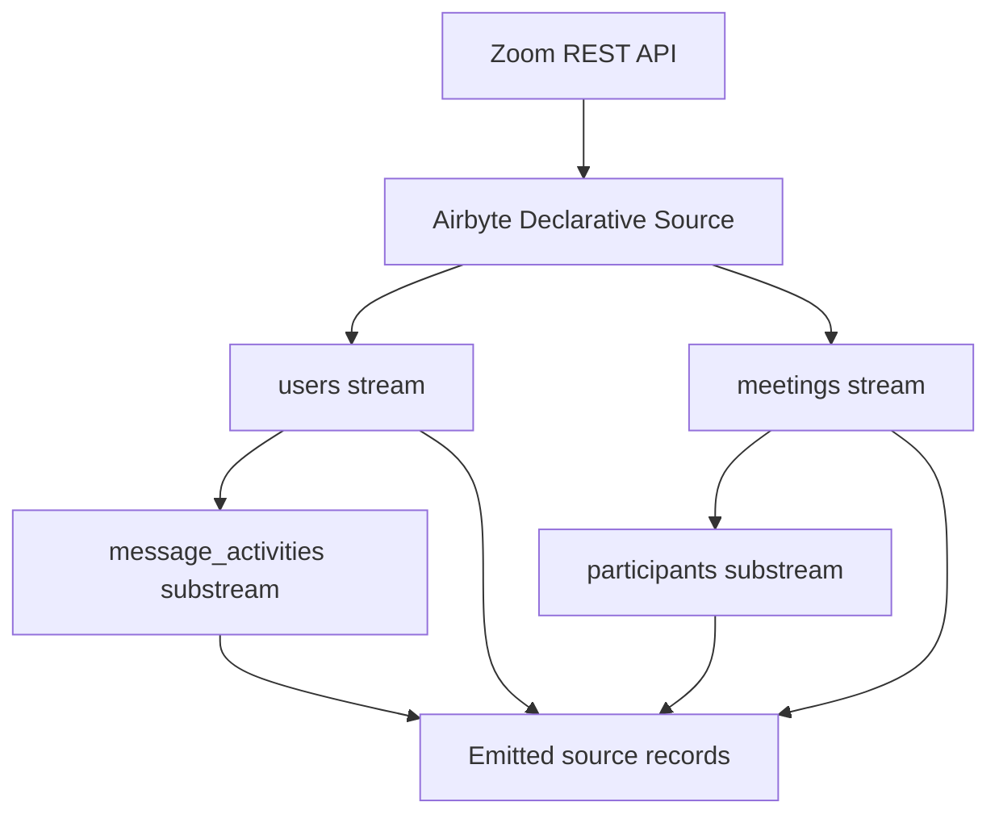
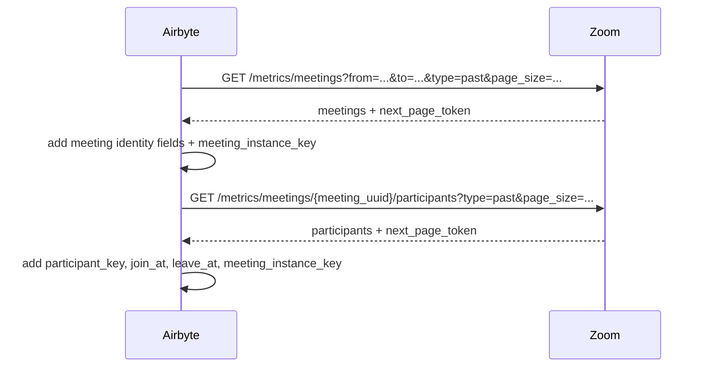
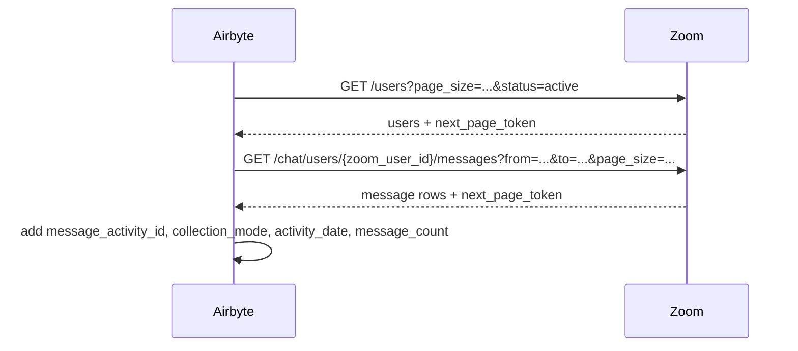

# Technical Design — Zoom Connector

<!-- toc -->

- [1. Architecture Overview](#1-architecture-overview)
  - [1.1 Architectural Vision](#11-architectural-vision)
  - [1.2 Architecture Drivers](#12-architecture-drivers)
  - [1.3 Architecture Layers](#13-architecture-layers)
- [2. Principles & Constraints](#2-principles--constraints)
  - [2.1 Design Principles](#21-design-principles)
  - [2.2 Constraints](#22-constraints)
- [3. Technical Architecture](#3-technical-architecture)
  - [3.1 Domain Model](#31-domain-model)
  - [3.2 Component Model](#32-component-model)
  - [3.3 API Contracts](#33-api-contracts)
  - [3.4 Internal Dependencies](#34-internal-dependencies)
  - [3.5 External Dependencies](#35-external-dependencies)
  - [3.6 Interactions & Sequences](#36-interactions--sequences)
  - [3.7 Database schemas & tables](#37-database-schemas--tables)
  - [3.8 Deployment Topology](#38-deployment-topology)
- [4. Additional context](#4-additional-context)
  - [Source Collection Strategy](#source-collection-strategy)
  - [Incremental Discovery Strategy](#incremental-discovery-strategy)
  - [Incremental Enrichment Strategy](#incremental-enrichment-strategy)
  - [Endpoint Usage Strategy](#endpoint-usage-strategy)
  - [Identity Model](#identity-model)
  - [Record Linkage Model](#record-linkage-model)
  - [Deduplication and Idempotence Approach](#deduplication-and-idempotence-approach)
  - [Retry, Replay, and Overlap-Window Behavior](#retry-replay-and-overlap-window-behavior)
  - [Run Logging and Observability Model](#run-logging-and-observability-model)
  - [Assumptions and Risks That Affect Implementation](#assumptions-and-risks-that-affect-implementation)
- [5. Traceability](#5-traceability)

<!-- /toc -->

- [ ] `p3` - **ID**: `cpt-insightspec-design-zoom-connector`

## 1. Architecture Overview

### 1.1 Architectural Vision

The current Zoom connector implementation is a declarative Airbyte source manifest with four source streams: `users`, `meetings`, `participants`, and `message_activities`. The executable manifest targets Airbyte declarative manifest version `6.60.9` (manifest yaml format documentation: https://docs.airbyte.com/platform/connector-development/config-based/understanding-the-yaml-file/yaml-overview), and the design is intentionally kept aligned to that runtime format so the connector can be regenerated reproducibly from specification artifacts without relying on hidden orchestration logic.

The current implementation preserves the approved product scope:
- `users` for identity and attribution support
- `meetings` for meeting discovery
- `participants` for per-meeting attendance evidence
- `message_activities` for user-scoped message activity

The implementation does not currently model a separate capability resolver, enrichment queue, run-log table, or optional message-to-meeting linkage. It uses straightforward declarative HTTP collection with transformations, pagination, and one stateful incremental cursor on `meetings`.

### 1.2 Architecture Drivers

#### Functional Drivers

| Requirement | Current design response |
|-------------|-------------------------|
| `cpt-insightspec-fr-zoom-meeting-discovery` | Implement `meetings` stream over `GET /metrics/meetings` with stateful incremental collection. |
| `cpt-insightspec-fr-zoom-meeting-participants` | Implement `participants` as a child stream of `meetings`, keyed by `meeting_uuid`. |
| `cpt-insightspec-fr-zoom-message-activity` | Implement `message_activities` as a separate child stream of `users` using `GET /chat/users/{zoom_user_id}/messages`. |
| `cpt-insightspec-fr-zoom-message-collection-strategy` | Keep message collection independent from meeting enrichment and do not require meeting-scoped message linkage. |
| `cpt-insightspec-fr-zoom-user-identity-support` | Implement `users` over `GET /users` and retain `zoom_user_id`, `email`, and display attributes. |
| `cpt-insightspec-fr-zoom-incremental-collection` | Configure stateful incremental sync only for `meetings`; other streams are bounded reads or child streams driven by parent output. |

#### NFR Allocation

| NFR / quality concern | Current design response |
|-----------------------|-------------------------|
| Freshness | `meetings` uses stateful incremental sync; messages use a bounded request window from `start_date` to `now` |
| Idempotence | Primary keys are defined for all four streams and deterministic identity is built in transformations |
| Operational visibility | Per-record technical fields plus Airbyte runtime state; no connector-emitted run table |
| Simplicity / reproducibility | All implemented behavior is expressed directly in the declarative manifest |

### 1.3 Architecture Layers

| Layer | Responsibility | Current implementation |
|-------|---------------|------------------------|
| Source access | Authenticate and call Zoom APIs | `base_requester` with Server-to-Server OAuth |
| Stream execution | Read records, paginate, partition substreams | Airbyte declarative runtime |
| Light normalization | Add keys and technical metadata | `transformations` in manifest |
| Persistence handoff | Emit records to destination | Airbyte source output contract |

## 2. Principles & Constraints

### 2.1 Design Principles

#### Manifest-Driven Simplicity

- [ ] `p2` - **ID**: `cpt-insightspec-principle-zoom-manifest-driven`

The specification must describe only behavior that the current declarative manifest actually implements or that can be deterministically derived from it.

#### Meeting-First Identity

- [ ] `p2` - **ID**: `cpt-insightspec-principle-zoom-meeting-identity`

Meeting records use a canonical non-null `meeting_instance_key` derived from the strongest available source identifier, while preserving `meeting_series_id`, `meeting_occurrence_id`, and `meeting_uuid`.

#### Separate Message Flow

- [ ] `p2` - **ID**: `cpt-insightspec-principle-zoom-separate-message-flow`

Message activity is collected from a user-scoped message endpoint and is not coupled to meeting enrichment in the current implementation.

#### Minimal Technical Enrichment

- [ ] `p2` - **ID**: `cpt-insightspec-principle-zoom-light-normalization`

The current manifest performs light normalization only: stable keys, `tenant_id`, `_airbyte_data_source`, and `_airbyte_collected_at`. It does not implement downstream analytics modeling inside the connector.

### 2.2 Constraints

#### Zoom Scope Dependency

- [ ] `p2` - **ID**: `cpt-insightspec-constraint-zoom-scopes`

The message stream depends on Team Chat scopes for `GET /chat/users/{zoom_user_id}/messages`. Missing scopes will block `message_activities` even when meetings and participants work.

#### Partial Incremental Support

- [ ] `p2` - **ID**: `cpt-insightspec-constraint-zoom-partial-incremental`

The current manifest implements Airbyte stateful incremental sync only for `meetings`. `participants` is driven by `meetings`, `users` is a paginated bounded read, and `message_activities` currently uses a request window from `start_date` to `now`.

#### No Connector-Managed Run Table

- [ ] `p2` - **ID**: `cpt-insightspec-constraint-zoom-no-run-table`

The current manifest does not emit `zoom_collection_runs` or per-row `run_id` metadata. Observability is limited to Airbyte runtime behavior plus per-record technical fields.

## 3. Technical Architecture

### 3.1 Domain Model

| Entity | Implemented by | Notes |
|--------|----------------|-------|
| ZoomUser | `users` stream | Lightweight identity support only |
| ZoomMeeting | `meetings` stream | Incremental source of meeting records |
| ZoomMeetingParticipant | `participants` stream | Child stream of `meetings` by `meeting_uuid` |
| ZoomMessageActivity | `message_activities` stream | Child stream of `users` by `zoom_user_id` |

**Relationships**:
- `ZoomMeeting` -> `ZoomMeetingParticipant`: one-to-many by `meeting_instance_key`
- `ZoomUser` -> `ZoomMessageActivity`: one-to-many by `zoom_user_id`
- `ZoomUser` may be joined downstream to `participants` by `zoom_user_id` or `email` when source payloads allow it
- No implemented meeting linkage exists for `message_activities` in the current manifest

**Implemented meeting identity model**:
- `meeting_series_id = record['id']`
- `meeting_occurrence_id = record.get('occurrence_id')`
- `meeting_uuid = record.get('uuid')`
- `meeting_instance_key` uses:
  1. `zoom:uuid:{meeting_uuid}`
  2. else `zoom:occurrence:{meeting_series_id}:{meeting_occurrence_id}`
  3. else `zoom:series-window:{meeting_series_id}:{strongest_available_time}`

### 3.2 Component Model

#### Declarative Stream Components

- [ ] `p2` - **ID**: `cpt-insightspec-component-zoom-declarative-stream-model`

##### Why this component exists

The current implementation is intentionally limited to the components that are directly represented in the declarative manifest. This keeps the specification reproducible and avoids assuming hidden runtime orchestration.

##### Responsibility scope

- Define the shared requester and authentication behavior
- Define the four implemented streams and their relationships
- Define pagination, transformations, and the single implemented stateful incremental cursor

##### Responsibility boundaries

- Does not introduce an external capability resolver
- Does not introduce an explicit enrichment queue or run table
- Does not describe behavior that is absent from the current manifest

##### Related components (by ID)

- `cpt-insightspec-principle-zoom-manifest-driven`
- `cpt-insightspec-principle-zoom-meeting-identity`
- `cpt-insightspec-principle-zoom-separate-message-flow`

| Component | Type | Responsibility |
|-----------|------|----------------|
| `base_requester` | Shared requester | Zoom base URL, OAuth, default headers |
| `users` | root stream | Active Zoom users, paginated |
| `meetings` | root stream | Meeting discovery with stateful incremental cursor |
| `participants` | child stream | Per-meeting participant attendance, driven by `meetings` |
| `message_activities` | child stream | Per-user messages, driven by `users` |

This is the complete current component model. No additional runtime components are assumed by the specification.

### 3.3 API Contracts

The connector exposes no public API. Its implementation contract is the declarative source manifest and the Zoom REST endpoints it calls.

### 3.4 Internal Dependencies

| Dependency | Usage |
|------------|-------|
| Airbyte declarative runtime | Executes manifest, pagination, substreams, and stateful incremental cursor for `meetings` |
| Destination configured in Airbyte | Receives emitted records |

### 3.5 External Dependencies

| Dependency | Usage |
|------------|-------|
| Zoom Server-to-Server OAuth | Access token acquisition using `account_id`, `client_id`, and `client_secret` |
| `GET /users` | `users` stream |
| `GET /metrics/meetings` | `meetings` stream |
| `GET /metrics/meetings/{meeting_uuid}/participants` | `participants` stream |
| `GET /chat/users/{zoom_user_id}/messages` | `message_activities` stream |

### 3.6 Interactions & Sequences

#### Meetings and Participants

- [ ] `p2` - **ID**: `cpt-insightspec-seq-zoom-meetings-participants`

#### Users and Messages

- [ ] `p2` - **ID**: `cpt-insightspec-seq-zoom-users-messages`

### 3.7 Database schemas & tables

- [ ] `p3` - **ID**: `cpt-insightspec-db-zoom-bronze-model`

The current manifest emits four logical source entities. The table names below are conceptual Bronze names used in project documentation; the manifest stream names are `users`, `meetings`, `participants`, and `message_activities`.

#### Table: `zoom_users`

| Column | Type | Description |
|--------|------|-------------|
| `tenant_id` | String | Value copied from `config['insight_tenant_id']` |
| `zoom_user_id` | String | Source-native Zoom user identifier |
| `email` | String | User email when present |
| `first_name` | String | User first name |
| `last_name` | String | User last name |
| `display_name` | String | User display name |
| `type` | Int | Zoom account type |
| `status` | String | User status |
| `timezone` | String | User timezone |
| `_airbyte_data_source` | String | Always `insight_zoom` |
| `_airbyte_collected_at` | DateTime | Ingestion timestamp |

#### Table: `zoom_meetings`

| Column | Type | Description |
|--------|------|-------------|
| `tenant_id` | String | Value copied from `config['insight_tenant_id']` |
| `meeting_instance_key` | String | Canonical non-null meeting key |
| `meeting_series_id` | String | Source meeting series identifier |
| `meeting_occurrence_id` | String | Source occurrence identifier |
| `meeting_uuid` | String | Source meeting UUID |
| `identity_strength` | String | `uuid`, `occurrence`, or `fallback` |
| `host_user_id` | String | Host user identifier when present in payload |
| `topic` | String | Meeting topic when present |
| `meeting_type` | String / Int | Source meeting type field |
| `scheduled_start_at` | DateTime | Scheduled start when present |
| `actual_start_at` | DateTime | Actual start when present |
| `actual_end_at` | DateTime | Actual end when present |
| `duration_seconds` | Int | Duration when present/derivable in payload |
| `discovered_at` | DateTime | Discovery timestamp when present |
| `enrichment_status` | String | Currently set to `pending` by manifest |
| `limitation_code` | String | Limitation marker when present |
| `source_endpoint` | String | Source endpoint when present |
| `_airbyte_data_source` | String | Always `insight_zoom` |
| `_airbyte_collected_at` | DateTime | Ingestion timestamp |

#### Table: `zoom_meeting_participants`

| Column | Type | Description |
|--------|------|-------------|
| `tenant_id` | String | Value copied from `config['insight_tenant_id']` |
| `meeting_instance_key` | String | Canonical parent meeting key |
| `meeting_series_id` | String | Source meeting series identifier when present |
| `meeting_occurrence_id` | String | Source occurrence identifier when present |
| `meeting_uuid` | String | Parent meeting UUID from partition context |
| `participant_key` | String | Derived from id, user_id, email, or name |
| `zoom_user_id` | String | Source participant user identifier when present |
| `email` | String | Participant email when present |
| `display_name` | String | Participant display name when present |
| `join_at` | DateTime | Join time |
| `leave_at` | DateTime | Leave time |
| `attendance_duration_seconds` | Int | Source attendance duration |
| `attendance_status` | String | Attendance status when present |
| `_airbyte_data_source` | String | Always `insight_zoom` |
| `_airbyte_collected_at` | DateTime | Ingestion timestamp |

#### Table: `zoom_message_activity`

| Column | Type | Description |
|--------|------|-------------|
| `tenant_id` | String | Value copied from `config['insight_tenant_id']` |
| `message_activity_id` | String | Source event ID or deterministic fallback key |
| `zoom_user_id` | String | Parent user identifier from partition context |
| `email` | String | Email when present in payload |
| `activity_date` | DateTime | `date`, `message_time`, or `timestamp` from payload |
| `channel_type` | String | Source channel type or `direct` fallback |
| `message_count` | Int | Source count or `1` fallback |
| `aggregation_level` | String | Source aggregation level when present |
| `collection_mode` | String | Always `separate_chat_flow` |
| `source_endpoint` | String | Always `chat/users/{userId}/messages` in current implementation |
| `_airbyte_data_source` | String | Always `insight_zoom` |
| `_airbyte_collected_at` | DateTime | Ingestion timestamp |

There is no implemented `zoom_collection_runs` table in the current manifest.

### 3.8 Deployment Topology

The connector is deployed as a declarative Airbyte source configuration executed by the Airbyte platform. No Zoom-specific standalone service is assumed.

## 4. Additional context

### Source Collection Strategy

The current manifest uses one shared requester and four streams:
- `users` reads active users directly
- `meetings` reads meetings directly
- `participants` fans out from `meetings`
- `message_activities` fans out from `users`

### Incremental Discovery Strategy

Only `meetings` is configured as a stateful incremental stream. It uses:
- `DatetimeBasedCursor`
- `cursor_field = end_time`
- `from` / `to` request parameters
- `lookback_window = P7D`
- `step = P30D`

This is the only Airbyte-managed cursor strategy currently implemented in the manifest.

### Incremental Enrichment Strategy

The current manifest does not implement a separate enrichment queue or state machine. Instead:
- `meetings` is the discovery stream
- `participants` is fetched as a child stream for emitted meeting rows

This provides practical meeting/participant collection without introducing extra orchestration components.

### Endpoint Usage Strategy

Implemented endpoints:
- `GET /users`
- `GET /metrics/meetings`
- `GET /metrics/meetings/{meeting_uuid}/participants`
- `GET /chat/users/{zoom_user_id}/messages`

The current implementation also passes:
- `status=active` for `users`
- `type=past` for `meetings`
- `type=past` for `participants`
- `page_size` where supported
- `from` / `to` only for `meetings` incremental windows and `message_activities` request windows

### Identity Model

People:
- `zoom_user_id` is the source-native identity anchor
- `email` is the preferred downstream cross-source join key when present

Meetings:
- `meeting_series_id`
- `meeting_occurrence_id`
- `meeting_uuid`
- derived `meeting_instance_key`

### Record Linkage Model

Implemented strong linkages:
- `meetings` -> `participants` through `meeting_instance_key`
- `users` -> `message_activities` through `zoom_user_id`

Not implemented in current manifest:
- direct `message_activities` -> `meetings` linkage fields
- run-level linkage fields such as `run_id`

### Deduplication and Idempotence Approach

Implemented primary keys:
- `users`: `zoom_user_id`
- `meetings`: `meeting_instance_key`
- `participants`: `(meeting_instance_key, participant_key, join_at)`
- `message_activities`: `message_activity_id`

The manifest does not currently define `_version` markers or a run table.

### Retry, Replay, and Overlap-Window Behavior

Implemented retry behavior comes from `base_error_handler`:
- `429` and `503` use `Retry-After`
- `500`, `502`, `504` retry with exponential backoff

`meetings` additionally uses a 7-day lookback window in its incremental cursor configuration.

### Run Logging and Observability Model

The current manifest exposes only per-record technical metadata:
- `tenant_id`
- `_airbyte_data_source`
- `_airbyte_collected_at`

There is no implemented source-emitted run log stream.

### Assumptions and Risks That Affect Implementation

- Team Chat scopes are still required for `message_activities`
- Message activity is currently implemented only through `chat/users/{zoom_user_id}/messages`
- `message_activities` is not yet configured as a stateful Airbyte incremental stream
- Some schema fields remain source-pass-through and may be null depending on payload quality
- The specification intentionally mirrors the current manifest rather than a more ambitious future runtime

## 5. Traceability

| Artifact | Role |
|---------|------|
| [PRD.md](./PRD.md) | Product intent and scope |
| [DESIGN.md](./DESIGN.md) | Current implementation-aligned technical design |
| [zoom.md](../zoom.md) | Standalone connector reference aligned to this design |
| [`manifest.yaml`](/Users/voltenko/Projects/Work/insight/src/connectors/collaboration/zoom/manifest.yaml) | Source of truth for executable current implementation |
