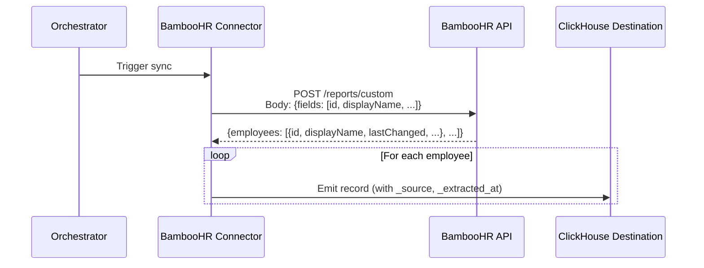
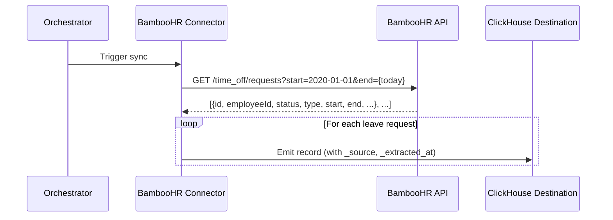

# DESIGN — BambooHR Connector

- [ ] `p1` - **ID**: `cpt-insightspec-design-bhr-connector`

> Version 1.0 — March 2026
> Based on: HR Directory domain (`docs/components/connectors/hr-directory/README.md`), [PRD.md](./PRD.md)

<!-- toc -->

- [1. Architecture Overview](#1-architecture-overview)
  - [1.1 Architectural Vision](#11-architectural-vision)
  - [1.2 Architecture Drivers](#12-architecture-drivers)
  - [1.3 Architecture Layers](#13-architecture-layers)
- [2. Principles & Constraints](#2-principles--constraints)
  - [2.1 Design Principles](#21-design-principles)
  - [2.2 Constraints](#22-constraints)
- [3. Technical Architecture](#3-technical-architecture)
  - [3.1 Domain Model](#31-domain-model)
  - [3.2 Component Model](#32-component-model)
  - [3.3 API Contracts](#33-api-contracts)
  - [3.4 Internal Dependencies](#34-internal-dependencies)
  - [3.5 External Dependencies](#35-external-dependencies)
  - [3.6 Interactions & Sequences](#36-interactions--sequences)
  - [3.7 Database schemas & tables](#37-database-schemas--tables)
  - [3.8 Deployment Topology](#38-deployment-topology)
- [4. Additional context](#4-additional-context)
  - [Identity Resolution Strategy](#identity-resolution-strategy)
  - [Silver / Gold Mappings](#silver--gold-mappings)
  - [Source-Specific Considerations](#source-specific-considerations)
- [5. Traceability](#5-traceability)
- [6. Non-Applicability Statements](#6-non-applicability-statements)

<!-- /toc -->

---

## 1. Architecture Overview

### 1.1 Architectural Vision

The BambooHR connector is an Airbyte declarative manifest connector (YAML, no custom code) that extracts HR directory data from the BambooHR REST API v1. It produces three Bronze streams:

1. **`employees`** — employee directory via the custom report endpoint (`POST /reports/custom`), collecting insights-relevant fields only.
2. **`leave_requests`** — time-off requests via `GET /time_off/requests` with fixed date range.
3. **`meta_fields`** — field metadata (standard + custom field definitions) via `GET /meta/fields`.

**Authentication**: API key injected as `Authorization: Basic {base64(key:x)}` header via `BasicHttpAuthenticator`.

**Pagination**: None. BambooHR returns full datasets per request. The custom report and time-off endpoints are bounded by account size and date range respectively.

**Sync mode**: Full refresh on all streams. BambooHR returns current-state records only — no reliable incremental mechanism. The `lastChanged` field is collected to enable future client-side incremental sync if needed.

**Downstream**: Bronze data feeds the Identity Manager (`workEmail` → `person_id`) and the HR Silver ETL Job (`class_people`, `class_org_units`).

### 1.2 Architecture Drivers

#### Functional Drivers

| Requirement | Design Response |
|-------------|-----------------|
| `cpt-insightspec-fr-bhr-collect-employees` | Stream `employees` → `POST /reports/custom` |
| `cpt-insightspec-fr-bhr-collect-leave-requests` | Stream `leave_requests` → `GET /time_off/requests?start={start}&end={end}` |
| `cpt-insightspec-fr-bhr-collect-meta-fields` | Stream `meta_fields` → `GET /meta/fields` |
| `cpt-insightspec-fr-bhr-deduplication` | Primary keys: `id` (employees, leave requests), `unique` (meta fields) |
| `cpt-insightspec-fr-bhr-identity-key` | `workEmail` field included in employee custom report field list |
| `cpt-insightspec-fr-bhr-incremental-sync` | Full refresh on all streams; `lastChanged` retained for future incremental |
| `cpt-insightspec-fr-bhr-fault-tolerance` | `CompositeErrorHandler` with 429/503 rate-limit handling + 5XX retry with exponential backoff |
| `cpt-insightspec-fr-bhr-collection-runs` | Airbyte framework emits collection metadata per sync; routed to `collection_runs` |

#### NFR Allocation

| NFR ID | NFR Summary | Allocated To | Design Response | Verification Approach |
|--------|-------------|-------------|-----------------|----------------------|
| `cpt-insightspec-nfr-bhr-auth-flexibility` | API key + company domain configurable | `spec.connection_specification` | `api_key` (secret) and `company_domain` in spec properties | Verify config fields present in spec |
| `cpt-insightspec-nfr-bhr-rate-limit-compliance` | Honour BambooHR rate limits | `CompositeErrorHandler` | `WaitTimeFromHeader` on `Retry-After` for 429/503 with `ExponentialBackoffStrategy` fallback; `ExponentialBackoffStrategy` for 5XX | Simulate 503 with Retry-After; verify connector waits |
| `cpt-insightspec-nfr-bhr-schema-compliance` | Source-native field names at Bronze | `InlineSchemaLoader` | Schemas use BambooHR camelCase field names; no `KeysToSnakeCase` transformation | Compare schema fields to API response fields |
| `cpt-insightspec-nfr-bhr-idempotent-writes` | Deterministic output for same cursor | Primary keys + cursor | Same `lastChanged` cursor produces same filtered record set | Run twice with same state; verify identical output |

### 1.3 Architecture Layers

| Layer | Responsibility | Technology |
|-------|---------------|------------|
| Source API | BambooHR REST API v1 endpoints | REST / JSON |
| Authentication | API key via Authorization header | `BasicHttpAuthenticator` |
| Connector | Stream definitions, incremental sync, error handling | Airbyte declarative manifest (YAML) |
| Execution | Container runtime | Airbyte Declarative Connector framework (CDK v6.44+) |
| Bronze | Raw data storage with source-native schema | Destination connector (ClickHouse) |

---

## 2. Principles & Constraints

### 2.1 Design Principles

#### One Stream per Endpoint

- [ ] `p1` - **ID**: `cpt-insightspec-principle-bhr-one-stream-per-endpoint`

Each stream maps to exactly one BambooHR API endpoint. This keeps the manifest simple, debuggable, and aligned with Airbyte's stream-per-resource model.

#### Source-Native Schema

- [ ] `p1` - **ID**: `cpt-insightspec-principle-bhr-source-native-schema`

Bronze tables preserve BambooHR's native field names (camelCase) and data types. No renaming, no type coercion, no enum normalisation. Schema transformations are the Silver layer's responsibility.

#### Full-Dataset Extraction

- [ ] `p2` - **ID**: `cpt-insightspec-principle-bhr-full-dataset`

BambooHR endpoints return complete datasets (no pagination). The connector fetches the full response on every run. This is a BambooHR API design constraint, not a connector choice.

### 2.2 Constraints

#### No Pagination Available

- [ ] `p1` - **ID**: `cpt-insightspec-constraint-bhr-no-pagination`

The custom report and time-off endpoints do not support pagination. The connector uses `NoPagination` and relies on BambooHR's bounded response sizes (limited by account employee count and date range).

#### Current-State Only for Employees

- [ ] `p1` - **ID**: `cpt-insightspec-constraint-bhr-current-state`

BambooHR returns only the current state of employee records. Historical snapshots require periodic full syncs with `_extracted_at` timestamps. SCD Type 2 history is constructed at the Silver layer.

#### Full Refresh Only

- [ ] `p2` - **ID**: `cpt-insightspec-constraint-bhr-full-refresh`

All streams use full refresh sync. The custom report endpoint does not support server-side filtering. The `lastChanged` field is collected to enable future client-side incremental sync if response sizes become a concern.

---

## 3. Technical Architecture

### 3.1 Domain Model

**Core Entities**:

| Entity | API Source | Bronze Stream | Description |
|--------|-----------|--------------|-------------|
| Employee | `POST /reports/custom` | `employees` | Current-state employee record with insights-relevant HR attributes |
| Leave Request | `GET /time_off/requests` | `leave_requests` | Time-off request with dates, type, status, and amount |
| Field Metadata | `GET /meta/fields` | `meta_fields` | Field definitions (standard + custom) for schema discovery |

**Relationships**:
- Employee `1:N` Leave Request (via `employeeId`)
- Field Metadata describes the schema of Employee records

### 3.2 Component Model

#### BambooHR Connector Manifest

- [ ] `p1` - **ID**: `cpt-insightspec-component-bhr-manifest`

##### Why this component exists

Defines the complete BambooHR connector as a YAML declarative manifest — the single artifact required to extract HR data from BambooHR into the Insight platform's Bronze layer.

##### Responsibility scope

Defines 3 streams with: API key auth via `Authorization` header, POST request for custom reports, GET requests for time-off and metadata, `NoPagination` (full dataset responses), full refresh sync on all streams, `CompositeErrorHandler` for 429/503/5XX, `AddFields` for `tenant_id`, `_source`, and `_extracted_at`, and inline JSON schemas for all streams.

##### Responsibility boundaries

Does not handle orchestration, scheduling, or state storage (managed by Airbyte/Orchestrator). Does not perform Silver/Gold transformations. Does not implement identity resolution. Does not write to Bronze tables (handled by the destination connector).

##### Related components (by ID)

None within this artifact. At runtime, the connector is executed by the Airbyte platform and its Bronze output is consumed by dbt for Silver transformations (see Ingestion Layer DESIGN).

### 3.3 API Contracts

#### BambooHR REST API v1

- [ ] `p1` - **ID**: `cpt-insightspec-interface-bhr-api-v1`

**Base URL**: `https://{domain}.bamboohr.com/api/v1/`

**Authentication**: API key via `BasicHttpAuthenticator`
- Config value `api_key` is the raw BambooHR API key (used as username; password is `x`)
- `BasicHttpAuthenticator` base64-encodes `{api_key}:x` and injects as `Authorization: Basic {encoded}` header

**Rate Limits**: Undocumented numeric limits. 503 with optional `Retry-After` header on throttling. 429 on account-level limits.

---

##### Endpoint: POST /reports/custom

| Aspect | Detail |
|--------|--------|
| Method | `POST` |
| Path | `/reports/custom` |
| Query params | none (format defaults to JSON) |
| Request body | JSON: `{"title": "...", "fields": ["id", "displayName", ...]}` |
| Response | `{"fields": [...], "employees": [{...}, ...]}` |
| Record path | `employees` |
| Auth | HTTP Basic |

**Request body — field list**:

```json
{
  "title": "Insight Employee Sync",
  "fields": [
    "id", "displayName", "firstName", "lastName", "workEmail", "employeeNumber",
    "jobTitle", "department", "division", "status", "employmentHistoryStatus",
    "supervisor", "supervisorEId", "supervisorEmail",
    "location", "country", "city",
    "hireDate", "originalHireDate", "terminationDate", "lastChanged",
    "payType", "standardHoursPerWeek"
  ]
}
```

---

##### Endpoint: GET /time_off/requests

| Aspect | Detail |
|--------|--------|
| Method | `GET` |
| Path | `/time_off/requests` |
| Query params | `start` (YYYY-MM-DD, required), `end` (YYYY-MM-DD, required) |
| Response | JSON array of request objects |
| Record path | root array (`[]`) |
| Auth | HTTP Basic |

**Response fields**: `id`, `employeeId`, `status` (object), `name`, `start`, `end`, `created`, `type` (object), `amount` (object), `dates` (object), `notes` (object).

---

##### Endpoint: GET /meta/fields

| Aspect | Detail |
|--------|--------|
| Method | `GET` |
| Path | `/meta/fields` |
| Query params | none |
| Response | JSON array of field definition objects |
| Record path | root array (`[]`) |
| Auth | HTTP Basic |

**Response fields**: `id`, `name`, `type`, `alias`, `deprecated` (optional).

---

#### Source Config Schema

```json
{
  "type": "object",
  "required": ["tenant_id", "api_key", "domain"],
  "properties": {
    "tenant_id": {
      "type": "string",
      "format": "uuid",
      "title": "Tenant ID",
      "description": "Tenant isolation identifier (UUID)"
    },
    "api_key": {
      "type": "string",
      "title": "API Key",
      "description": "BambooHR API key (raw key — connector handles base64 encoding)",
      "airbyte_secret": true
    },
    "domain": {
      "type": "string",
      "title": "Domain",
      "description": "BambooHR subdomain (e.g., 'acme' from acme.bamboohr.com)"
    }
  }
}
```

### 3.4 Internal Dependencies

| Dependency Module | Interface Used | Purpose |
|-------------------|---------------|---------|
| Identity Manager | Downstream consumer | Reads `workEmail` from `employees` Bronze table for person resolution |
| HR Silver ETL Job | Downstream consumer | Reads all Bronze streams to produce `class_people` and `class_org_units` |

### 3.5 External Dependencies

| Dependency | Interface Used | Purpose |
|-----------|---------------|---------|
| BambooHR REST API v1 | HTTPS / JSON | Source system for employee, leave, and metadata extraction |
| Airbyte Declarative Connector framework (CDK v6.44+) | Container runtime | Executes the YAML manifest |
| ClickHouse destination connector | Airbyte protocol | Writes extracted records to Bronze tables |

### 3.6 Interactions & Sequences

#### Employee Collection — Full Refresh

**ID**: `cpt-insightspec-seq-bhr-employee-sync`



#### Leave Request Collection — Full Refresh with Date Range

**ID**: `cpt-insightspec-seq-bhr-leave-sync`



### 3.7 Database schemas & tables

#### Table: `employees`

- [ ] `p1` - **ID**: `cpt-insightspec-dbtable-bhr-employees`

| Column | Type | Description |
|--------|------|-------------|
| `tenant_id` | UUID | Tenant identifier — injected by framework; partitions all data by customer |
| `source_instance_id` | String | Source instance identifier (e.g. `bamboohr-acme`) — injected by connector |
| `id` | String | PK: BambooHR employee ID |
| `displayName` | String | Full display name |
| `firstName` | String | First/given name |
| `lastName` | String | Last/family name |
| `workEmail` | String | Work email — identity key for cross-system person resolution |
| `employeeNumber` | String | Company-assigned employee number |
| `jobTitle` | String | Job title (freeform) — role analytics |
| `department` | String | Department name — org hierarchy dimension |
| `division` | String | Division name — org hierarchy dimension |
| `status` | String | Account status (`Active`, `Inactive`) |
| `employmentHistoryStatus` | String | Employment type (e.g., `Full-Time`, `Part-Time`, `Terminated`) — workforce composition |
| `supervisor` | String | Supervisor display name |
| `supervisorEId` | String | Supervisor BambooHR employee ID — org hierarchy |
| `supervisorEmail` | String | Supervisor work email — org hierarchy + identity resolution |
| `location` | String | Office location or `Remote` — geographic distribution |
| `country` | String | Country — geographic distribution |
| `city` | String | City — geographic distribution |
| `hireDate` | String | Employment start date (YYYY-MM-DD) — tenure analytics |
| `originalHireDate` | String | Original hire date for rehires (YYYY-MM-DD) — tenure analytics |
| `terminationDate` | String | Employment end date (YYYY-MM-DD); null if active — attrition analytics |
| `lastChanged` | DateTime | Last modification timestamp |
| `payType` | String | Pay type (e.g., `Salary`, `Hourly`) — workforce composition |
| `standardHoursPerWeek` | String | Standard weekly hours — FTE calculation |
| `_source` | String | `bamboohr` — connector identifier |
| `_extracted_at` | DateTime | Extraction timestamp (UTC) |

---

#### Table: `leave_requests`

- [ ] `p1` - **ID**: `cpt-insightspec-dbtable-bhr-leave-requests`

| Column | Type | Description |
|--------|------|-------------|
| `tenant_id` | UUID | Tenant identifier — injected by framework; partitions all data by customer |
| `source_instance_id` | String | Source instance identifier (e.g. `bamboohr-acme`) — injected by connector |
| `id` | String | PK: BambooHR time-off request ID |
| `employeeId` | String | BambooHR employee ID — joins to `employees.id` |
| `name` | String | Employee display name |
| `status` | String (JSON) | Status object: `{"lastChanged": "...", "lastChangedByUserId": "...", "status": "..."}` |
| `start` | String | Leave start date (YYYY-MM-DD) |
| `end` | String | Leave end date (YYYY-MM-DD) |
| `created` | String | Request creation date (YYYY-MM-DD) |
| `type` | String (JSON) | Leave type object: `{"id": "...", "name": "...", "icon": "..."}` |
| `amount` | String (JSON) | Amount object: `{"unit": "days", "amount": "5"}` |
| `dates` | String (JSON) | Per-day breakdown (source-native nested object) |
| `notes` | String (JSON) | Notes metadata (source-native nested object) |
| `_source` | String | `bamboohr` — data lineage tag |
| `_extracted_at` | DateTime | Collection timestamp (UTC) |

---

#### Table: `meta_fields`

- [ ] `p2` - **ID**: `cpt-insightspec-dbtable-bhr-meta-fields`

| Column | Type | Description |
|--------|------|-------------|
| `tenant_id` | UUID | Tenant identifier — injected by framework; partitions all data by customer |
| `source_instance_id` | String | Source instance identifier (e.g. `bamboohr-acme`) — injected by connector |
| `id` | Number | BambooHR field ID (source identifier) |
| `name` | String | Field display name |
| `type` | String | Field data type (e.g., `text`, `list`, `date`, `employee`) |
| `alias` | String | Field alias/API name (e.g., `firstName`, `department`, `customField1`) |
| `unique` | String | PK: derived deduplication key (`'d' + id` if deprecated, else `id`) |
| `deprecated` | Boolean | Whether the field is deprecated |
| `_source` | String | `bamboohr` — data lineage tag |
| `_extracted_at` | DateTime | Collection timestamp (UTC) |

---

#### Table: `collection_runs`

- [ ] `p1` - **ID**: `cpt-insightspec-dbtable-bhr-collection-runs`

| Column | Type | Description |
|--------|------|-------------|
| `run_id` | String | Unique run identifier |
| `started_at` | DateTime | Run start time |
| `completed_at` | DateTime | Run end time |
| `status` | String | `running` / `completed` / `failed` |
| `employees_collected` | Number | Records collected for `employees` |
| `leave_requests_collected` | Number | Records collected for `leave_requests` |
| `meta_fields_collected` | Number | Records collected for `meta_fields` |
| `api_calls` | Number | API calls made |
| `errors` | Number | Errors encountered |
| `settings` | String (JSON) | Collection configuration |

Monitoring table — not an analytics source.

### 3.8 Deployment Topology

- [ ] `p1` - **ID**: `cpt-insightspec-topology-bhr-deployment`

```
Connection: bamboohr-{domain}
├── Source image: airbyte/source-declarative-manifest
├── Manifest: src/ingestion/connectors/hr-directory/bamboohr/connector.yaml
├── Descriptor: src/ingestion/connectors/hr-directory/bamboohr/descriptor.yaml
├── Source config: tenant_id, api_key, domain
├── Configured catalog: 3 streams (all full refresh)
│   ├── employees
│   ├── leave_requests
│   └── meta_fields
├── Destination image: airbyte/destination-clickhouse
├── Destination config: host, port, database, schema, credentials
└── Sync mode: full refresh (no state)
```

---

## 4. Additional context

### Identity Resolution Strategy

`workEmail` from `employees` is the primary identity signal. The Identity Manager maps it to the canonical `person_id` used across all Silver streams. `supervisorEmail` enables org hierarchy construction without requiring `person_id` resolution of managers first.

BambooHR `id` and `supervisorEId` are BambooHR-internal identifiers — retained for lineage but not used as cross-system join keys.

### Silver / Gold Mappings

| Bronze table | Silver target | Status |
|-------------|--------------|--------|
| `employees` | Identity Manager (`workEmail` → `person_id`) | Direct feed |
| `employees` | `class_people` | Via HR Silver ETL Job |
| `employees` | `class_org_units` | Department data extracted for org hierarchy |
| `leave_requests` | `class_people` | Leave periods captured as status transitions in SCD2 |
| `meta_fields` | Custom Attributes Normalizer | Field metadata for custom attribute mapping |

### Source-Specific Considerations

1. **Current-state only**: BambooHR returns the latest state of each employee. The `_extracted_at` timestamp on each record, combined with destination's `ReplacingMergeTree` or SCD2 at Silver, provides the historical dimension.

2. **Nested response objects**: Leave requests contain nested `status`, `type`, `amount`, `dates`, and `notes` objects. These are stored as JSON strings in Bronze, preserving the full source-native structure for Silver-layer extraction.

3. **Custom report field list**: The employee field list is hardcoded in the manifest. To add custom fields, the manifest must be updated with additional field names (discovered via `meta_fields`).

4. **Department hierarchy**: BambooHR does not expose a dedicated departments endpoint with parent-child relationships. Department names are available inline in employee records. Org hierarchy construction from department data requires the Silver layer to infer relationships from `department` + `division` fields or from `supervisorEmail` chains.

---

## 5. Traceability

- **PRD**: [PRD.md](./PRD.md)
- **Domain README**: [../../README.md](../../README.md) — HR Silver Layer design
- **Connector Framework DESIGN**: [../../../../domain/connector/specs/DESIGN.md](../../../../domain/connector/specs/DESIGN.md)
- **ADR directory**: [./ADR/](./ADR/)

---

## 6. Non-Applicability Statements

- **Custom Python components**: Not required. All BambooHR extraction patterns are handled by declarative manifest components.
- **OAuth 2.0**: Not implemented. API key authentication is sufficient for read-only extraction.
- **Pagination**: Not applicable. BambooHR endpoints return complete datasets.
- **Webhook / real-time streaming**: Not applicable. BambooHR does not offer webhooks for data change notifications.
- **Write operations**: Not applicable. The connector is read-only.
