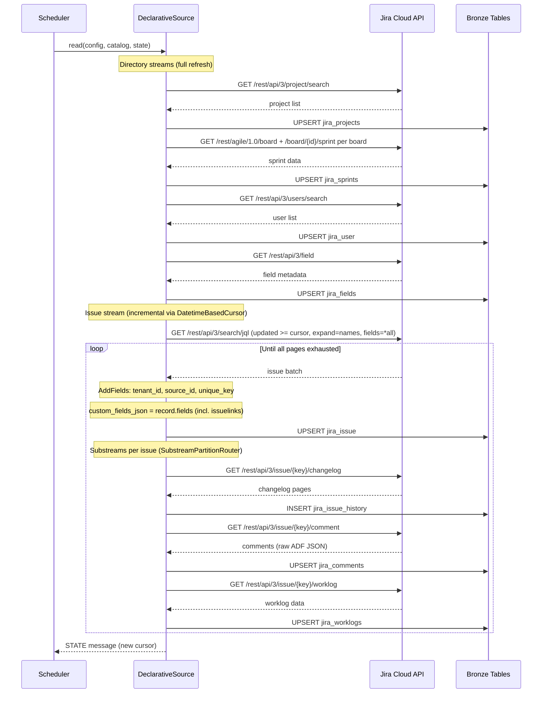
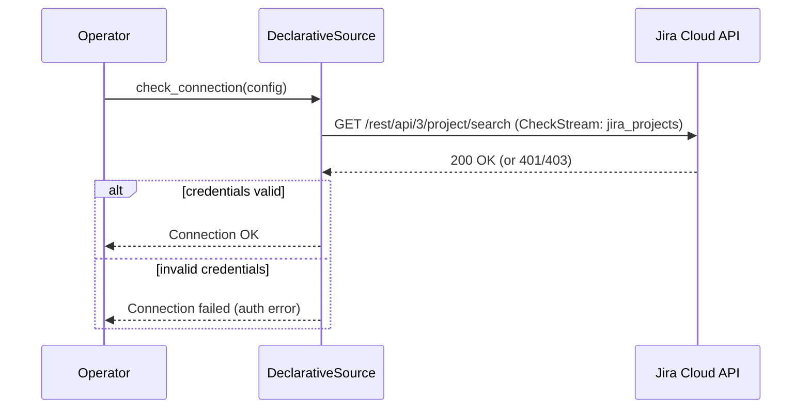

# DESIGN — Jira Connector

> Version 1.2 — April 2026
> Revised: aligned with upstream Connector Framework spec §4.1–§4.10 (config naming, unique_key, descriptor format)
> Based on: [PRD.md](./PRD.md), [`jira.md`](../jira.md), [Connector Framework DESIGN](../../../../domain/connector/specs/DESIGN.md)

<!-- toc -->

- [1. Architecture Overview](#1-architecture-overview)
  - [1.1 Architectural Vision](#11-architectural-vision)
  - [1.2 Architecture Drivers](#12-architecture-drivers)
  - [1.3 Architecture Layers](#13-architecture-layers)
- [2. Principles & Constraints](#2-principles--constraints)
  - [2.1 Design Principles](#21-design-principles)
  - [2.2 Constraints](#22-constraints)
- [3. Technical Architecture](#3-technical-architecture)
  - [3.1 Domain Model](#31-domain-model)
  - [3.2 Component Model](#32-component-model)
  - [3.3 API Contracts](#33-api-contracts)
  - [3.4 Internal Dependencies](#34-internal-dependencies)
  - [3.5 External Dependencies](#35-external-dependencies)
  - [3.6 Interactions & Sequences](#36-interactions--sequences)
  - [3.7 Database schemas & tables](#37-database-schemas--tables)
- [4. Additional context](#4-additional-context)
  - [API Details](#api-details)
  - [Field Mapping to Bronze Schema](#field-mapping-to-bronze-schema)
  - [Collection Strategy](#collection-strategy)
  - [Identity Resolution Details](#identity-resolution-details)
  - [Phase 1 Limitations and Future Work](#phase-1-limitations-and-future-work)
  - [Incremental Sync Cursor and Datetime Format](#incremental-sync-cursor-and-datetime-format)
  - [Jira API Documentation References](#jira-api-documentation-references)
- [5. Traceability](#5-traceability)
- [6. Non-Applicability Statements](#6-non-applicability-statements)

<!-- /toc -->

---

## 1. Architecture Overview

### 1.1 Architectural Vision

The Jira connector is an Airbyte declarative (nocode) YAML manifest that extracts issue data, field change history, worklogs, comments, sprint metadata, project directory, issue links, custom fields, and user directory from the Jira REST API. It writes all data to per-source Bronze tables in the shared analytical store (ClickHouse), following the `jira_*` Bronze schema defined in [`jira.md`](../jira.md). The declarative approach is consistent with all other connectors in the project (m365, bamboohr, claude-api).

Phase 1 targets Jira Cloud only (REST API v3). Server/Data Center support is deferred to a future iteration (separate manifest or CDK migration).

Comment body is stored as raw ADF JSON in Bronze; plain text extraction is deferred to the Silver/dbt layer. Changelog entries are fetched exclusively via a dedicated `SubstreamPartitionRouter` per issue (`/rest/api/3/issue/{key}/changelog`); they are NOT inlined in the JQL search response. Worklogs are fetched per-issue via `SubstreamPartitionRouter` (`/rest/api/3/issue/{key}/worklog`), following the same parent-child stream pattern as comments and changelog.

Incremental collection uses the issue `updated` timestamp as the primary cursor via JQL queries. Child streams (changelog, worklogs, comments) are scoped by the parent issue set returned by the incremental query. All custom fields (including story points and issue links) are stored as raw JSON in `custom_fields_json` on `jira_issue`; story points extraction is deferred to Silver/dbt based on `jira_projects.style`. Directory streams (projects, sprints, users) are full-refresh on each run.

Every emitted record includes `tenant_id` and `source_id` for multi-tenant isolation and multi-instance disambiguation.

### 1.2 Architecture Drivers

**PRD Reference**: [PRD.md](./PRD.md)

#### Functional Drivers

| Requirement | Design Response |
|-------------|-----------------|
| `cpt-insightspec-fr-jira-issue-extraction` | `DeclarativeStream issues` with JQL `HttpRequester`; writes to `jira_issue` |
| `cpt-insightspec-fr-jira-changelog-extraction` | Changelog fetched via dedicated `SubstreamPartitionRouter` per issue (`/rest/api/3/issue/{key}/changelog`); each changelog entry stored with `items` as JSON array in `jira_issue_history`. **Note**: `issue_jira_id` is NOT available at Bronze level due to `SubstreamPartitionRouter` limitation (can only pass `id_readable` as partition field) — must be resolved via JOIN with `jira_issue` in Silver/dbt |
| `cpt-insightspec-fr-jira-custom-fields` | All custom fields from the issue response stored as raw JSON in `custom_fields_json` field on `jira_issue`; denormalization to `jira_issue_ext` key-value rows deferred to Silver/dbt layer. `jira_fields` stream provides field metadata (`schema.type`) for Silver enrichment of `custom_fields_json` and changelog `items` |
| `cpt-insightspec-fr-jira-story-points-detection` | All custom fields (including story points) stored in `custom_fields_json`; story points extraction deferred to Silver/dbt layer based on `jira_projects.style` — no connector-level configuration needed |
| `cpt-insightspec-fr-jira-worklog-extraction` | `DeclarativeStream worklogs` per issue via `SubstreamPartitionRouter` (`/rest/api/3/issue/{key}/worklog`); writes to `jira_worklogs` |
| `cpt-insightspec-fr-jira-comment-extraction` | `DeclarativeStream comments` per issue via `SubstreamPartitionRouter`; raw ADF JSON stored; conversion deferred to Silver; writes to `jira_comments` |
| `cpt-insightspec-fr-jira-sprint-extraction` | `DeclarativeStream sprints` via Agile API: list boards then list sprints per board via `SubstreamPartitionRouter`; writes to `jira_sprints`. **Note**: `board_name` and `project_key` are NOT available at Bronze level due to `SubstreamPartitionRouter` limitation (can only pass `board_id` as partition field) — must be resolved via JOIN with boards/projects data in Silver/dbt |
| `cpt-insightspec-fr-jira-sprint-history` | Sprint assignment changes captured via changelog entries where `field_name = "Sprint"` — stored in `jira_issue_history` alongside other field changes |
| `cpt-insightspec-fr-jira-project-extraction` | `DeclarativeStream projects` via `GET /rest/api/3/project/search`; writes to `jira_projects` |
| `cpt-insightspec-fr-jira-issue-links` | Issue links included in `custom_fields_json` (via `fields.issuelinks` in the full issue response); denormalization to `jira_issue_links` table deferred to Silver/dbt |
| `cpt-insightspec-fr-jira-user-extraction` | `DeclarativeStream users` via `GET /rest/api/3/users/search`; writes to `jira_user` |
| `cpt-insightspec-fr-jira-collection-runs` | Sync monitoring handled by Airbyte platform sync logs; `jira_collection_runs` table not implemented at connector level |
| `cpt-insightspec-fr-jira-deduplication` | Upsert keyed on natural PKs per table; `ReplacingMergeTree(_version)` at storage level |
| `cpt-insightspec-fr-jira-incremental-sync` | `DatetimeBasedCursor` on issue `updated` field; JQL `updated >= "{cursor}"` for delta extraction |
| `cpt-insightspec-fr-jira-identity-key` | Cloud-only — always `accountId` as `user_id`; extracted via DPath from user objects in each stream |
| `cpt-insightspec-fr-jira-instance-context` | `AddFields` transformation injects `tenant_id`, `source_id`, and `unique_key` on every record (per Connector Framework spec §4.6) |

#### NFR Allocation

| NFR ID | NFR Summary | Allocated To | Design Response | Verification Approach |
|--------|-------------|--------------|-----------------|----------------------|
| `cpt-insightspec-nfr-jira-freshness` | Data in Bronze ≤ 24h after scheduled run | Declarative manifest + orchestrator | Connector completes within scheduled window; orchestrator triggers daily | Monitor via Airbyte sync logs |
| `cpt-insightspec-nfr-jira-completeness` | All issues matching scope extracted per run | Declarative manifest + `DatetimeBasedCursor` | JQL pagination exhausts all pages; cursor updated only on success; failed runs retryable | Compare `issues_collected` count against JQL `totalResults` |
| `cpt-insightspec-nfr-jira-utc-timestamps` | All timestamps stored in UTC | Declarative transformations | Timestamps are ISO 8601 from Jira API; stored as-is in Bronze | Schema test: zero non-UTC timestamps in Bronze |

### 1.3 Architecture Layers

```text
┌─────────────────────────────────────────────────────────────────────┐
│  Orchestrator / Scheduler (Kestra / Airbyte)                        │
│  (triggers Jira connector sync)                                     │
└─────────────────────────────┬───────────────────────────────────────┘
                              │
┌─────────────────────────────▼───────────────────────────────────────┐
│  Jira Connector (Airbyte DeclarativeSource YAML manifest)            │
│  ├── issues stream (JQL search, expand=names, fields=*all)           │
│  │   ├── issue_history substream (per-issue /changelog endpoint)     │
│  │   ├── comments substream (per-issue /comment endpoint)            │
│  │   └── worklogs substream (per-issue /worklog endpoint)            │
│  │   Note: custom fields (incl. issue links) in custom_fields_json   │
│  ├── projects stream (full refresh /project/search)                  │
│  ├── sprints stream (boards → sprints, full refresh)                 │
│  ├── users stream (full refresh /users/search)                       │
│  └── jira_fields stream (full refresh /field)                        │
└─────────────────────────────┬───────────────────────────────────────┘
                              │ Airbyte Protocol (RECORD, STATE, LOG)
┌─────────────────────────────▼───────────────────────────────────────┐
│  Bronze Tables (ClickHouse — ReplacingMergeTree)                     │
│  jira_issue, jira_issue_history, jira_worklogs,                      │
│  jira_comments, jira_projects, jira_sprints,                         │
│  jira_user, jira_fields                                              │
└──────────────────────────────────────────────────────────────────────┘
```

| Layer | Responsibility | Technology |
|-------|---------------|------------|
| Orchestration | Trigger, schedule, state management | Kestra / Airbyte platform |
| Collection | REST pagination, JQL queries, cursor management, retry | Airbyte DeclarativeSource (YAML manifest) |
| Transformation | `AddFields` for `tenant_id`, `source_id`, `unique_key` injection (per spec §4.6); DPath extraction | Declarative transformations |
| Storage | Upsert to Bronze tables | ClickHouse `ReplacingMergeTree(_version)` |

---

## 2. Principles & Constraints

### 2.1 Design Principles

#### Bronze-Only Output

- [ ] `p1` - **ID**: `cpt-insightspec-principle-jira-bronze-only`

The Jira connector writes exclusively to `jira_*` Bronze tables via the declarative YAML manifest. No Silver or Gold layer logic exists in the connector. Cross-source unification into `class_task_tracker_*` Silver tables and identity resolution (`email` → `person_id`) are responsibilities of downstream pipeline stages.

#### Incremental by Default

- [ ] `p1` - **ID**: `cpt-insightspec-principle-jira-incremental`

Every collection run is incremental by default. The `updated` timestamp from the last successful run serves as the JQL cursor via `DatetimeBasedCursor`. Full collection is the degenerate case of an incremental run with no prior cursor. Child streams are scoped by the parent issue set, not independently cursored.

#### Fault Tolerance Over Completeness

- [ ] `p2` - **ID**: `cpt-insightspec-principle-jira-fault-tolerance`

A partial collection run that extracts most issues is preferable to a run that halts on first error. Non-fatal errors (individual issue changelog failures, worklog fetch errors, 404 for deleted entities) are logged and skipped. Fatal errors (401 authentication failure, 403 insufficient permissions) halt the run immediately. Progress is checkpointed via Airbyte platform sync state.

#### Cloud-First

- [ ] `p1` - **ID**: `cpt-insightspec-principle-jira-env-abstraction`

Phase 1 targets Jira Cloud only (REST API v3). Server/Data Center support (REST API v2) is deferred to a future iteration. This simplifies the manifest by eliminating environment detection, dual pagination strategies, and Server-specific identity anchor selection.

#### Declarative-First

- [ ] `p1` - **ID**: `cpt-insightspec-principle-jira-declarative-first`

Consistent with project convention, the Jira connector uses a nocode YAML manifest (Airbyte DeclarativeSource). All other connectors in the project (m365, bamboohr, claude-api) follow this pattern. Features that cannot be expressed declaratively are deferred to future iterations or downstream layers rather than falling back to CDK Python in Phase 1.

### 2.2 Constraints

#### Jira REST API v3 (Cloud)

- [ ] `p1` - **ID**: `cpt-insightspec-constraint-jira-api-version`

Phase 1 targets Jira Cloud REST API v3 exclusively. Cloud uses cursor-based pagination (`nextPageToken`) for issue search and offset-based (`startAt`/`maxResults`) for other endpoints. Server/Data Center REST API v2 support is deferred to a future iteration.

#### Airbyte Declarative Manifest Compliance

- [ ] `p1` - **ID**: `cpt-insightspec-constraint-jira-airbyte-cdk`

The connector MUST be a valid Airbyte DeclarativeSource YAML manifest. It MUST emit valid Airbyte Protocol messages (RECORD, STATE, LOG). Every emitted record MUST include `tenant_id`.

> **Manifest version**: `6.60.9` — pinned to match the `airbyte/source-declarative-manifest:latest` Docker image CDK version.

#### Rate Limit Budget

- [ ] `p1` - **ID**: `cpt-insightspec-constraint-jira-rate-limit`

Jira Cloud enforces burst rate limits (per-second) and hourly quotas (points-based). The connector MUST respect `Retry-After` headers on HTTP 429 responses and implement exponential backoff with jitter. Concurrent child requests (changelog, worklog, comment fetches) MUST be limited via `ConcurrencyLevel` in the manifest to prevent rate limit exhaustion during bulk update windows.

#### No Silver Layer Logic

- [ ] `p1` - **ID**: `cpt-insightspec-constraint-jira-no-silver`

The connector writes only to Bronze tables. Cross-source unification, enum normalization, and identity resolution are owned by the task-tracking domain pipeline and the Identity Manager. This constraint ensures the connector remains source-specific and composable.

---

## 3. Technical Architecture

### 3.1 Domain Model

**Technology**: Declarative stream schemas (JSON Schema files)

**Core Entities**:

| Entity | Description | Maps To |
|--------|-------------|---------|
| `JiraInstance` | Connection configuration: URL, credentials, project scope | Connector config (spec section) |
| `JiraIssue` | Issue with core fields: `id`, `key`, `project`, `issuetype`, `reporter`, `story_points`, `duedate`, `parent`, `created`, `updated` | `jira_issue` |
| `JiraChangelog` | Per-issue changelog entries with `items[]` array; each item is a field change with `from`/`to` + display strings | `jira_issue_history` (one row per field change) |
| `JiraWorklog` | Time entry: `id`, `issueKey`, `author`, `started`, `timeSpentSeconds`, `comment` | `jira_worklogs` |
| `JiraComment` | Issue comment: `id`, `issueKey`, `author`, `created`, `updated`, `body` (raw ADF JSON) | `jira_comments` |
| `JiraSprint` | Sprint metadata: `id`, `boardId`, `name`, `state`, `startDate`, `endDate`, `completeDate` | `jira_sprints` |
| `JiraProject` | Project directory: `id`, `key`, `name`, `lead`, `projectTypeKey`, `style`, `archived` | `jira_projects` |
| `JiraIssueLink` | Dependency relationship between two issues with typed link | `jira_issue.custom_fields_json` (within `fields.issuelinks`; denormalized to `jira_issue_links` in Silver/dbt) |
| `JiraUser` | User record: `accountId`, `emailAddress`, `displayName`, `accountType`, `active` | `jira_user` |
| `JiraField` | Field metadata: `id`, `name`, `schema.type`, `custom` flag | `jira_fields` |
| `JiraCustomField` | Per-issue custom field value as key-value pair | `jira_issue.custom_fields_json` (JSON column, denormalized to `jira_issue_ext` in Silver/dbt) |
| `CollectionState` | Cursor state: `last_updated_at` timestamp, run counters | Airbyte platform sync state (no `jira_collection_runs` table) |

These entities map to declarative stream schemas defined as JSON Schema files within the manifest package.

**Relationships**:
- `JiraInstance` 1:N → `JiraProject`
- `JiraProject` 1:N → `JiraIssue`
- `JiraIssue` 1:N → `JiraChangelog`, `JiraWorklog`, `JiraComment`, `JiraIssueLink`, `JiraCustomField`
- `JiraInstance` 1:N → `JiraSprint` (via boards)
- `JiraInstance` 1:N → `JiraUser`
- `JiraInstance` 1:N → `JiraField`

### 3.2 Component Model

#### Jira Connector Manifest

- [ ] `p1` - **ID**: `cpt-insightspec-component-jira-connector`

##### Why this component exists

The single declarative YAML manifest (`connector.yaml`) defines all streams, authentication, pagination, transformations, and concurrency settings for the Jira connector. It serves as the entry point for the Airbyte DeclarativeSource runtime.

##### Responsibility scope

- Defines all stream configurations: issues, issue_history, comments, worklogs, projects, sprints, users, jira_fields. Issue links and custom fields are embedded as JSON columns on `jira_issue`.
- Configures `ApiKeyAuthenticator` with Basic Auth (email:token base64-encoded).
- Configures named `OffsetIncrement` paginators with hardcoded `page_size` values per endpoint: `paginator` (50, projects/comments), `agile_paginator` (50, boards/sprints), `child_paginator` (100, changelog/worklogs), `user_paginator` (200, user directory). `CursorPagination` for JQL search (`nextPageToken`); page size passed as `request_parameters.maxResults` (not `page_size` on paginator). **Note**: `OffsetIncrement.page_size` does NOT support Jinja templates — only numeric values.
- Configures `DatetimeBasedCursor` on issue `updated` field for incremental sync.
- Configures `SubstreamPartitionRouter` for changelog, comments, and worklogs (parent-child stream pattern per issue).
- Configures `AddFields` transformations for `tenant_id`, `source_id`, and `unique_key` injection on every record (per Connector Framework spec §4.6).
- Configures `ConcurrencyLevel` to control fan-out for child stream requests.
- Defines the connection specification (config schema) in the `spec` section.

##### Responsibility boundaries

- Does NOT implement custom Python logic — all behavior is expressed declaratively in YAML.
- Does NOT perform Silver or Gold layer transformations.
- Does NOT auto-detect or extract story points (all custom fields stored as raw JSON in `custom_fields_json`; extraction deferred to Silver/dbt).
- Does NOT convert ADF to plain text (raw ADF JSON stored in Bronze; conversion deferred to Silver).

##### Related components (by ID)

- All stream definitions are contained within the single manifest file.

---

#### Auth Configuration

- [ ] `p2` - **ID**: `cpt-insightspec-component-jira-api-client`

##### Why this component exists

Encapsulates authentication configuration for Jira Cloud REST API requests within the declarative manifest.

##### Responsibility scope

- `ApiKeyAuthenticator` with Basic Auth: `Authorization: Basic base64({email}:{api_token})`.
- Applied globally to all streams via the manifest's `requester` definitions.
- Handles HTTP error responses: 401/403 halt the run; 404 skips the entity; 429 triggers backoff; 5xx retries with exponential backoff.

##### Responsibility boundaries

- Does NOT manage credentials storage (owned by Airbyte platform secret management).
- Does NOT implement Server/DC authentication methods (deferred).

##### Related components (by ID)

- `cpt-insightspec-component-jira-connector` — configured within the manifest

---

#### Field Extraction and Transformation

- [ ] `p2` - **ID**: `cpt-insightspec-component-jira-field-mapper`

##### Why this component exists

Translates Jira API response objects to Bronze schema fields using DPath extractors and `AddFields` transformations within the declarative manifest.

##### Responsibility scope

- DPath extractors map Jira API JSON paths to Bronze schema field names (e.g., `fields.project.key` → `project_key`).
- `AddFields` injects `tenant_id`, `source_id`, and `unique_key` on every record.
- All custom fields (including story points and issue links) stored as raw JSON in `custom_fields_json` on `jira_issue`; denormalization deferred to Silver/dbt.

##### Responsibility boundaries

- Does NOT convert ADF to plain text (raw ADF JSON stored as-is).
- Does NOT resolve user identities beyond extracting `accountId`.
- Does NOT call external services.

##### Related components (by ID)

- `cpt-insightspec-component-jira-connector` — configured within the manifest

---

#### Story Points Resolution (Deferred to Silver/dbt)

- [ ] `p2` - **ID**: `cpt-insightspec-component-jira-story-points-detector`

##### Why this component exists

Story points field IDs differ between Classic (`customfield_10033`) and Next-gen (`customfield_10016`) projects. Rather than configuring or auto-detecting the correct field per project at the connector level, all custom fields are stored as raw JSON in `custom_fields_json` on `jira_issue`. Story points extraction happens in the Silver/dbt layer by joining with `jira_projects.style`.

##### Responsibility scope

- Connector stores all issue fields (including all custom fields) as raw JSON in `custom_fields_json`.
- No story points logic exists at the connector level.
- Silver/dbt layer extracts story points based on project style:
  - Next-gen → `customfield_10016`
  - Classic → `customfield_10033` (or instance-specific field)

##### Responsibility boundaries

- Does NOT extract story points at Bronze level.
- Does NOT require operator to configure a story points field ID.
- All story points resolution is deferred to Silver/dbt.

##### Related components (by ID)

- `cpt-insightspec-component-jira-field-mapper` — stores raw fields JSON

---

#### Identity Extraction

- [ ] `p2` - **ID**: `cpt-insightspec-component-jira-identity-extractor`

##### Why this component exists

Extracts user identity attributes from Jira Cloud API user objects via DPath extractors in the declarative manifest.

##### Responsibility scope

- Extracts `accountId` as `user_id` from all user references (reporter, assignee, changelog author, worklog author, comment author).
- Extracts `emailAddress` when available (nullable — suppressed by default on Cloud due to Atlassian privacy controls).
- Extracts `displayName` and `accountType`.

##### Responsibility boundaries

- Does NOT call the Identity Manager (that is Silver step 2).
- Does NOT handle Server/DC `key`-based identity (Cloud-only in Phase 1).
- Does NOT write to the database independently.

##### Related components (by ID)

- `cpt-insightspec-component-jira-connector` — configured within stream schemas

---

#### ADF Storage

- [ ] `p3` - **ID**: `cpt-insightspec-component-jira-adf-extractor`

##### Why this component exists

In Phase 1, Atlassian Document Format (ADF) JSON from Jira Cloud REST API v3 comment bodies is stored as raw JSON in `jira_comments.body`. Plain text extraction is deferred to the Silver/dbt layer.

##### Responsibility scope

- Comment body field stores the raw ADF JSON tree as a string.
- No transformation is applied to the ADF content at the Bronze level.

##### Responsibility boundaries

- Does NOT convert ADF to plain text (deferred to Silver/dbt).
- Does NOT interpret mention references or resolve media.

##### Related components (by ID)

- `cpt-insightspec-component-jira-field-mapper` — ADF stored via DPath extraction in the manifest

---

### 3.3 API Contracts

- [ ] `p2` - **ID**: `cpt-insightspec-interface-jira-connector-api`

**Technology**: Airbyte DeclarativeSource YAML manifest

**Contracts**: `cpt-insightspec-contract-jira-rest-api`

**Entry Point**: The manifest `spec` section defines the `connection_specification` JSON Schema that Airbyte uses to render the configuration form and validate operator input.

**Configuration schema** (`connection_specification`):

| Field | Type | Description |
|-------|------|-------------|
| `jira_instance_url` | str | Jira Cloud instance URL (e.g., `https://myorg.atlassian.net`) |
| `jira_email` | str | User email for API token authentication |
| `jira_api_token` | str (airbyte_secret) | Jira Cloud API token |
| `insight_tenant_id` | str | Insight tenant identifier — injected into every record |
| `insight_source_id` | str | Instance discriminator (e.g., `jira-team-alpha`) |
| `jira_project_keys` | str | **Required.** Comma-separated project keys — Jira Cloud does not allow unbounded JQL queries |
| `jira_start_date` | str | Earliest date to sync issues from, `YYYY-MM-DD` (default `2020-01-01`) |
| `jira_page_size` | int | Page size for JQL search only (default 50, max 100). Passed as `request_parameters.maxResults` on the search stream. All other paginators use hardcoded `page_size` values optimized per endpoint API max: `paginator` 50 (projects, comments), `agile_paginator` 50 (boards, sprints), `child_paginator` 100 (changelog, worklogs), `user_paginator` 200 (user directory) |

---

### 3.4 Internal Dependencies

| Dependency Module | Interface Used | Purpose |
|-------------------|----------------|---------|
| Airbyte declarative manifest runtime | `DeclarativeSource`, stream definitions, `AirbyteMessage` | Connector framework |
| `descriptor.yaml` | Declarative stream/table metadata | Package registration |

**Dependency Rules**:
- No circular dependencies between streams.
- The manifest is the single source of truth for all stream definitions.
- All inter-stream relationships are expressed via `SubstreamPartitionRouter`.

---

### 3.5 External Dependencies

#### Jira REST API v3 (Cloud)

| Aspect | Value |
|--------|-------|
| Base URL | `https://{instance}.atlassian.net/rest/api/3/` |
| Auth | `Authorization: Basic base64({email}:{api_token})` |
| Pagination | Cursor-based (`nextPageToken`) for search; offset-based (`startAt`) for all other endpoints |
| Rate limiting | Burst (per-second) + hourly quota; `Retry-After` header on 429 |

#### Jira Software Agile REST API v1

| Aspect | Value |
|--------|-------|
| Base URL | `{base_url}/rest/agile/1.0/` |
| Endpoints | `/board` (list boards), `/board/{id}/sprint` (list sprints) |
| Pagination | Offset-based (`startAt`) |

#### Identity Manager Service

| Aspect | Value |
|--------|-------|
| Interface | Not called directly by this connector |
| Role | Resolves `jira_user.email` → `person_id` in Silver step 2 |
| Criticality | Downstream — connector emits Bronze records regardless of identity resolution |

#### Destination Store (ClickHouse)

| Aspect | Value |
|--------|-------|
| Engine | `ReplacingMergeTree(_version)` |
| Write pattern | Upsert keyed on natural primary keys per table |
| Standard columns | `tenant_id`, `source_id`, `unique_key`, `_version` on all tables |

---

### 3.6 Interactions & Sequences

#### Incremental Collection Run

**ID**: `cpt-insightspec-seq-jira-incremental`

**Use cases**: `cpt-insightspec-usecase-jira-incremental-sync`

**Actors**: `cpt-insightspec-actor-jira-operator`, `cpt-insightspec-actor-jira-api`



---

#### Connection Check

**ID**: `cpt-insightspec-seq-jira-connection-check`

**Use cases**: `cpt-insightspec-usecase-jira-configure`

**Actors**: `cpt-insightspec-actor-jira-operator`



---

### 3.7 Database schemas & tables

- [ ] `p2` - **ID**: `cpt-insightspec-db-jira-bronze`

All Bronze table schemas are defined in [`jira.md`](../jira.md). The schemas are authoritative — this section provides a summary reference and primary key definitions.

| Table | PK (natural) | Cursor / Sync Strategy |
|-------|-------------|------------------------|
| `jira_issue` | `(tenant_id, source_id, id_readable)` | `updated` — incremental via JQL |
| `jira_issue_history` | `(tenant_id, source_id, changelog_id)` | Child of `jira_issue` — one record per changelog entry; `items` stored as JSON array. `field_id` is inside `items` (not a top-level Bronze column). `issue_jira_id` resolved via JOIN on `id_readable` |
| `jira_worklogs` | `(tenant_id, source_id, worklog_id)` | Child of `jira_issue` — per-issue fetch via SubstreamPartitionRouter |
| `jira_comments` | `(tenant_id, source_id, comment_id)` | Child of `jira_issue` — per-issue fetch |
| `jira_projects` | `(tenant_id, source_id, project_id)` | Full refresh each run |
| `jira_sprints` | `(tenant_id, source_id, sprint_id)` | Full refresh each run. `board_name` and `project_key` removed from Bronze (resolve via JOIN with boards/projects in Silver/dbt) |
| `jira_user` | `(tenant_id, source_id, account_id)` | Full refresh each run |
| `jira_fields` | `(tenant_id, source_id, field_id)` | Full refresh each run. Field metadata for Silver enrichment |

All streams use `unique_key` as the primary key in the connector manifest. The `unique_key` value follows the pattern `{tenant_id}-{source_id}-{natural_key}`, where `natural_key` is the stream-specific identifier (e.g., `id` for projects, `accountId` for users, `key` for issues). The composite `(tenant_id, source_id, natural_key)` columns remain as the logical natural key for reference and JOINs.

All tables use `ReplacingMergeTree(_version)` with `_version = toUnixTimestamp64Milli(now64())` for deduplication.

> **Note**: `jira_issue_ext` and `jira_issue_links` Bronze tables from the original specification ([`jira.md`](../jira.md)) are not populated by the connector in Phase 1. All custom fields and issue links are stored in `custom_fields_json` on `jira_issue` (since `fields: "*all"` returns the full `fields` object including `issuelinks`) and denormalized to separate tables in Silver/dbt. Sync monitoring is handled by the Airbyte platform; `jira_collection_runs` is not implemented at the connector level.
>
> **Note on schema types**: All stream schemas use `{}` (any type) for property types instead of specific types (string, integer, etc.). This is intentional because Airbyte `AddFields` transformations may return values with varying types depending on the source data (e.g., a field could be string or number). ClickHouse handles typing at the destination level via column definitions.

---

## 4. Additional context

### API Details

**Issue Search (Primary Endpoint)**:

| Aspect | Cloud (v3) |
|--------|-----------|
| Endpoint | `/rest/api/3/search/jql` |
| Pagination | `CursorPagination` (`nextPageToken`). **Note**: `CursorPagination` in Airbyte does NOT accept a `page_size` parameter — page size must be passed as a `request_parameter` (`maxResults`) on the stream requester instead |
| Max page size | 100 |
| Deep pagination limit | None (cursor-based) |
| `expand` support | `names`, `renderedFields`, `changelog` (not used — changelog fetched via dedicated substream) |
| `fields` parameter | `*all` — returns all issue fields including custom fields |

**JQL for Incremental Sync**:

```sql
project IN ({project_keys}) AND updated >= "{last_cursor}" ORDER BY updated ASC
```

The connector overlaps the cursor window by 1 hour (`lookback_window: PT1H`) to account for issues updated during the previous sync run. Deduplication at the storage level (`ReplacingMergeTree`) handles the overlap.

**Key Endpoints by Stream**:

| Stream | Endpoint | Pagination | Notes |
|--------|----------|-----------|-------|
| Issues | `/rest/api/3/search/jql` | `CursorPagination` (`nextPageToken`); `maxResults` passed as `request_parameter`, not `page_size` on paginator | Primary incremental stream |
| Changelog | `/rest/api/3/issue/{key}/changelog` | Offset (max 100/page) | Substream per issue via `SubstreamPartitionRouter` |
| Worklogs | `/rest/api/3/issue/{key}/worklog` | Offset (max 100/page) | Substream per issue via `SubstreamPartitionRouter` |
| Comments | `/rest/api/3/issue/{key}/comment` | Offset (max 50/page) | Per-issue (N+1) |
| Projects | `/rest/api/3/project/search` | Offset | Full refresh |
| Boards | `/rest/agile/1.0/board` | Offset (`startAt`) | Full refresh |
| Sprints | `/rest/agile/1.0/board/{id}/sprint` | Offset (`startAt`) | Full refresh per board |
| Users | `/rest/api/3/users/search` | Offset (max 1000/page) | Full refresh |
| Fields | `/rest/api/3/field` | None (single response) | Full refresh stream `jira_fields` |

**Rate Limit Handling**:

| HTTP Status | Response |
|-------------|----------|
| 401, 403 | Halt, log, notify operator |
| 404 | Skip entity, log warning, continue |
| 429 | Inspect `Retry-After` header; sleep until reset; retry |
| 5xx | Exponential backoff with jitter (max configurable attempts) |

**Authentication Headers**:

```http
# Cloud (API token)
Authorization: Basic base64({email}:{api_token})
Content-Type: application/json
Accept: application/json
```

---

### Field Mapping to Bronze Schema

**Issue** → `jira_issue`:

| Bronze Field | Jira API Path | Notes |
|-------------|---------------|-------|
| `source_id` | config (`insight_source_id`) | Injected via `AddFields` per spec §4.6 |
| `unique_key` | computed | `{tenant_id}-{source_id}-{natural_key}` per spec §4.6 |
| `jira_id` | `id` | Internal numeric ID |
| `id_readable` | `key` | Human-readable key (e.g., `PROJ-123`) |
| `project_key` | `fields.project.key` | |
| `issue_type` | `fields.issuetype.name` | |
| `reporter_id` | `fields.reporter.accountId` | Cloud-only — always `accountId` |
| `due_date` | `fields.duedate` | Nullable |
| `parent_id` | `fields.parent.key` | Nullable; replaces deprecated `fields.customfield_10014` (Epic Link) |
| `created` | `fields.created` | ISO 8601 from API |
| `updated` | `fields.updated` | ISO 8601 from API; cursor for incremental sync |

These mappings are expressed as DPath extractors and `AddFields` transformations in the YAML manifest.

**Changelog entry** → `jira_issue_history` (one row per `items[]` element):

| Bronze Field | Jira API Path | Notes |
|-------------|---------------|-------|
| `id_readable` | Parent issue `key` | Partition field from `SubstreamPartitionRouter` |
| ~~`issue_jira_id`~~ | ~~Parent issue `id`~~ | **Removed from Bronze** — `SubstreamPartitionRouter` can only pass one parent key (`id_readable`); `issue_jira_id` must be resolved via JOIN with `jira_issue` on `id_readable` in Silver/dbt |
| `author_account_id` | `author.accountId` | Cloud-only — always `accountId` |
| `changelog_id` | `id` | Groups related field changes |
| `created_at` | `created` | ISO 8601 from API |
| `field_id` | `items[].fieldId` | Machine-readable |
| `field_name` | `items[].field` | Human-readable |
| `value_from` | `items[].from` | Raw value (ID) |
| `value_from_string` | `items[].fromString` | Display value |
| `value_to` | `items[].to` | Raw value (ID) |
| `value_to_string` | `items[].toString` | Display value |

---

### Collection Strategy

**Changelog Collection**: Changelog entries are fetched exclusively via the dedicated per-issue changelog endpoint (`/rest/api/3/issue/{key}/changelog`) as a substream using `SubstreamPartitionRouter`. The JQL search uses `expand=names` (not `expand=changelog`), so no changelog data is inlined in the search response. Each changelog entry is stored with its `items` array serialized as JSON in `jira_issue_history`.

**Worklog Collection**: Worklogs are fetched per-issue via `SubstreamPartitionRouter` (`/rest/api/3/issue/{key}/worklog`), following the same parent-child stream pattern as comments and changelog. This is an N+1 pattern (one API call per issue), consistent with all other substreams.

**Data Duplication Note (`fields: "*all"`)**: The JQL search uses `fields: "*all"`, which returns all issue fields including inline comments and worklogs (first ~20 entries each). This creates partial duplication with the dedicated comment and worklog substreams. The substreams are authoritative (they paginate through all entries); the inline data in `custom_fields_json` is supplementary and should not be relied upon for completeness.

**Field Metadata Collection**: `jira_fields` is a reference table (1 API call per sync, ~100 rows). It provides `schema.type` metadata needed by dbt Silver models to correctly parse multi-value custom fields and changelog deltas. Fields: `unique_key`, `tenant_id`, `source_id`, `field_id` (from `id`), `name`, `custom` (boolean), `schema_type` (from `schema.type`), `schema_items` (from `schema.items`), `schema_custom` (from `schema.custom`).

**Concurrency Control**: Child stream requests (changelog, comments, worklogs) are limited by `ConcurrencyLevel` (default: 3) in the manifest. This is a static concurrency ceiling that prevents rate limit exhaustion during bulk update windows.

**Error Handling and Fault Tolerance**:
- Per-issue errors during child stream collection (changelog, worklog, comment) are logged and skipped — the issue itself is still written to `jira_issue`.
- Sync monitoring is handled by the Airbyte platform sync logs.
- Fatal errors (auth failure, total rate limit exhaustion) halt the run.

---

### Identity Resolution Details

**User ID**: Cloud-only — always `accountId` (Atlassian-wide, immutable).

**Email availability**: Conditional — suppressed by default on Cloud due to Atlassian privacy controls. Many users will have `null` email.

**Resolution chain** (Silver step 2, not in this connector):

```text
jira_issue_history.author_account_id
  → jira_user.account_id
    → jira_user.email (when available)
      → Identity Manager → person_id
```

Same chain applies to `jira_worklogs.author_account_id`, `jira_comments.author_account_id`, `jira_issue.reporter_id`, and `jira_projects.lead_account_id`.

**Cross-platform identity**: `accountId` is shared across the Atlassian platform (Jira, Confluence, Bitbucket Cloud). When `email` is unavailable on Cloud, `accountId` can serve as a within-Atlassian resolution key. The Identity Manager stores it as an isolated node until email becomes available for cross-system linking.

---

### Phase 1 Limitations and Future Work

| Limitation | Description | Future Resolution |
|-----------|-------------|-------------------|
| Cloud-only (v3) | Server/Data Center REST API v2 is not supported | Separate manifest or CDK migration in a future iteration |
| All custom fields stored as raw JSON | Story points and other custom fields in `custom_fields_json`; resolved in Silver/dbt based on `jira_projects.style` — no connector-level configuration needed | Selective extraction at connector level if needed |
| Comment body stored as raw ADF JSON | No plain text extraction at Bronze level | ADF-to-text conversion in Silver/dbt layer |
| No reconciliation mode | Hard-deleted entities in Jira are not detected by incremental sync | Periodic full reconciliation mode in a future iteration |
| No adaptive throttling | `ConcurrencyLevel` is static — does not adjust based on 429 response rate | Adaptive throttling requires CDK Python (`ThrottledFanOut` pattern) |
| SubstreamPartitionRouter can only pass one parent key | `issue_jira_id`, `board_name`, `project_key` not available on substreams at Bronze level | Resolved via JOINs in Silver/dbt; CDK migration would allow passing arbitrary parent fields |
| Cursor datetime format is minute-precision | `%Y-%m-%d %H:%M` — Jira JQL accepts `yyyy-MM-dd` and `yyyy-MM-dd HH:mm` only (no seconds, no ISO); full ISO timestamps preserved in Bronze `updated` field | Second-level precision if Jira JQL adds support |
| Connector Builder UI testing limits | Substream testing limited to first 5 parent partitions and 5 pages each; full sync required for complete validation | N/A — Airbyte platform limitation |
| `jira_issue_ext` and `jira_issue_links` not separate tables | All custom fields and issue links stored in `custom_fields_json` on `jira_issue`; denormalized in Silver/dbt | Separate streams if declarative manifest adds nested array flattening, or CDK migration |
| `jira_collection_runs` not implemented | Sync monitoring handled by Airbyte platform sync logs; no connector-level run tracking table | Custom run tracking if needed beyond Airbyte platform capabilities |
| URN-based surrogate key not implemented | `urn:jira:{tenant_id}:{source_id}:{issue_key}` not generated at connector level | Deferred to Silver/dbt or future connector iteration |

---

### Incremental Sync Cursor and Datetime Format

Jira JQL only accepts dates in `yyyy-MM-dd` or `yyyy-MM-dd HH:mm` format. The Jira API returns `updated` timestamps in full ISO format (e.g., `2026-04-04T11:38:37.225+0300`). The connector handles this mismatch using Airbyte's `cursor_datetime_formats` (input) and `datetime_format` (output) separation:

1. **Bronze `updated` field**: stores the **full ISO timestamp** from Jira without truncation — no data loss
2. **`cursor_datetime_formats`**: parses the ISO timestamp from records (`%Y-%m-%dT%H:%M:%S.%f%z`, `%Y-%m-%d %H:%M`, `%Y-%m-%d`)
3. **`datetime_format`**: formats cursor for JQL as `%Y-%m-%d %H:%M` — compatible with Jira JQL parser (minute precision)
4. **`cursor_granularity`**: `PT1M` (one minute) — matches the JQL output format
5. **`lookback_window`**: `PT1H` — overlaps by one hour to catch edge cases; deduplication handled by `ReplacingMergeTree(_version)` at storage level
6. **`start_datetime`**: configurable via `jira_start_date` config field (default: `2020-01-01`)

---

### Jira API Documentation References

| Resource | URL |
|----------|-----|
| Jira Cloud REST API v3 (main) | https://developer.atlassian.com/cloud/jira/platform/rest/v3/intro/ |
| Issue Search (JQL) — new endpoint | https://developer.atlassian.com/cloud/jira/platform/rest/v3/api-group-issue-search/#api-rest-api-3-search-jql-get |
| Issue Changelog | https://developer.atlassian.com/cloud/jira/platform/rest/v3/api-group-issues/#api-rest-api-3-issue-issueidorkey-changelog-get |
| Worklogs | https://developer.atlassian.com/cloud/jira/platform/rest/v3/api-group-issue-worklogs/ |
| Comments | https://developer.atlassian.com/cloud/jira/platform/rest/v3/api-group-issue-comments/ |
| Projects | https://developer.atlassian.com/cloud/jira/platform/rest/v3/api-group-projects/#api-rest-api-3-project-search-get |
| Users | https://developer.atlassian.com/cloud/jira/platform/rest/v3/api-group-users/#api-rest-api-3-users-search-get |
| Fields (custom field metadata) | https://developer.atlassian.com/cloud/jira/platform/rest/v3/api-group-issue-fields/#api-rest-api-3-field-get |
| Jira Software Agile REST API (boards, sprints) | https://developer.atlassian.com/cloud/jira/software/rest/intro/ |
| Atlassian Document Format (ADF) | https://developer.atlassian.com/cloud/jira/platform/apis/document/structure/ |
| Rate Limiting | https://developer.atlassian.com/cloud/jira/platform/rate-limiting/ |
| User Privacy & GDPR | https://developer.atlassian.com/cloud/jira/platform/user-privacy-developer-guide/ |
| API Deprecation Notices | https://developer.atlassian.com/cloud/jira/platform/deprecation-notice/ |
| Search endpoint migration guide | https://developer.atlassian.com/changelog/#CHANGE-2046 |

---

## 5. Traceability

- **PRD**: [PRD.md](./PRD.md)
- **Bronze table schemas**: [`jira.md`](../jira.md)
- **Connector Framework**: [`docs/domain/connector/specs/DESIGN.md`](../../../../domain/connector/specs/DESIGN.md)
- **Connector Framework** (config naming §4.1, AddFields §4.6, descriptor §4.10): [`docs/domain/connector/specs/DESIGN.md`](../../../../domain/connector/specs/DESIGN.md)
- **Task Tracking domain**: [`docs/components/connectors/task-tracking/`](../)

---

## 6. Non-Applicability Statements

The following DESIGN checklist domains are intentionally omitted from this document. Each entry explains why.

| Domain | Disposition | Reason |
|--------|-------------|--------|
| PERF-DESIGN-002 — Scalability Architecture | Not applicable | Batch pull connector. Horizontal/vertical scaling is owned by the Airbyte platform and orchestrator infrastructure, not the connector design. |
| PERF-DESIGN-003 — Latency Optimization | Not applicable | Batch connector with no real-time latency requirements. Data freshness is bounded by scheduling frequency (daily), not connector latency. |
| PERF-DESIGN-004 — Resource Efficiency | Not applicable | Resource consumption is bounded by Jira API rate limits, not connector-side compute. Memory usage is linear in page size (max 100 issues). |
| SEC-DESIGN-001 — Authentication Architecture | Deferred to deployment | API token storage, rotation, and secret management are owned by the Airbyte platform secret management system. The connector receives credentials via config injection. |
| SEC-DESIGN-002 — Authorization Architecture | Not applicable | The connector operates with a single Jira API credential. Access control to Bronze tables is owned by the destination platform (ClickHouse RBAC). |
| SEC-DESIGN-003 — Data Protection (tokens at rest) | Deferred to deployment | Credential encryption at rest is controlled by the Airbyte platform. Bronze table encryption is owned by the ClickHouse deployment. |
| SEC-DESIGN-004 — Security Boundaries | Not applicable | Single-direction data pull from Jira API to Bronze. No inbound attack surface. Network segmentation is owned by deployment infrastructure. |
| SEC-DESIGN-005 — Threat Modeling | Not applicable | Internal ETL tool pulling task metadata from an organization's own Jira instance. Formal threat model deferred to the platform security team. |
| SEC-DESIGN-006 — Audit & Compliance | Not applicable | Airbyte platform sync logs provide extraction audit trail. Log aggregation and retention are platform responsibilities. |
| REL-DESIGN-003 — Data Consistency | Addressed in design | Upsert semantics with `ReplacingMergeTree(_version)` ensure idempotent writes. Documented in §3.7 and §4 Collection Strategy. |
| REL-DESIGN-004 — Recovery Architecture | Not applicable | The connector owns no persistent state beyond Bronze table rows and Airbyte-managed cursor state. Recovery = re-run from cursor. |
| REL-DESIGN-005 — Resilience Patterns | Not applicable | Fault tolerance and retry are documented in §2.1 and §4. No canary/blue-green deployment patterns apply to a batch connector. |
| DATA-DESIGN-003 — Data Governance | Not applicable | Data lineage, catalog integration, and master data management are owned by the Gold-layer platform team, not individual connectors. |
| INT-DESIGN-003 — Event Architecture | Not applicable | Pull-only batch connector. No event bus, message broker, or pub/sub integration. |
| INT-DESIGN-004 — API Versioning/Evolution | Not applicable | The connector targets stable Jira REST API v3 (Cloud). Internal API versioning is not applicable. Jira API deprecation handling is a future operational concern. |
| OPS-DESIGN-001 — Deployment Architecture | Not applicable | Deployment topology, container strategy, and environment promotion are owned by the Airbyte platform infrastructure. |
| OPS-DESIGN-002 — Observability Architecture | Not applicable | Logging aggregation, distributed tracing, and alerting are platform responsibilities. The connector emits structured Airbyte LOG messages; sync monitoring is handled by the Airbyte platform. |
| OPS-DESIGN-003 — Infrastructure as Code | Not applicable | IaC is owned by the platform infrastructure team. |
| OPS-DESIGN-004 — SLO / Observability Targets | Not applicable | SLIs/SLOs are defined at the platform level. Connector-level targets are expressed as PRD SMART goals (§1.3 of PRD.md). |
| MAINT-DESIGN-001 — Code Organization | Addressed in design | Manifest structure follows Airbyte declarative connector conventions. Component model in §3.2 defines stream boundaries. |
| MAINT-DESIGN-002 — Technical Debt | Not applicable | New design; no known technical debt at time of writing. |
| MAINT-DESIGN-003 — Documentation Strategy | Not applicable | Documentation strategy is owned by the platform-level PRD and engineering wiki. |
| TEST-DESIGN-002 — Testing Strategy | Deferred to DECOMPOSITION | Unit, integration, and E2E test approach will be documented in the DECOMPOSITION artifact when implementation is planned. |
| COMPL-DESIGN-001 — Compliance Architecture | Not applicable | The connector collects task metadata and work activity data. Work emails in `jira_user` are personal data under GDPR; retention and data subject rights are platform/destination operator responsibilities, not connector responsibilities. |
| COMPL-DESIGN-002 — Privacy Architecture | Not applicable | Comment body content may contain sensitive information. The connector extracts it for collaboration analytics. Access controls, retention, and privacy impact assessment are platform responsibilities. |
| UX-DESIGN-001 — User-Facing Architecture | Not applicable | Configuration is a credential form and project filter in the Airbyte UI. No end-user UX or accessibility requirements. |
| ARCH-DESIGN-010 — Capacity and Cost Budgets | Not applicable | Capacity planning and cost estimation are platform-level concerns. Connector resource consumption is bounded by Jira API rate limits (documented in §2.2 and §3.5). |
