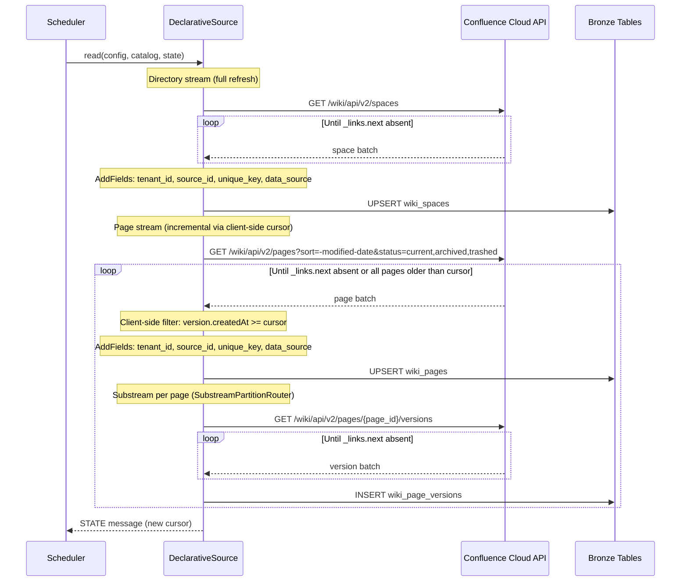
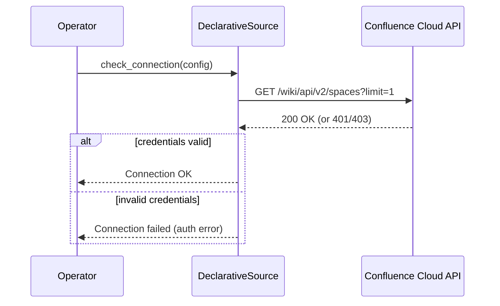

# DESIGN — Confluence Connector

> Version 1.2 — April 2026 (Aligned with upstream Connector Framework spec §4.1-§4.10)
> Based on: [PRD.md](./PRD.md), [`confluence.md`](../confluence.md), [Wiki Unified Schema](../../README.md), [Connector Framework DESIGN](../../../../domain/connector/specs/DESIGN.md)

<!-- toc -->

- [1. Architecture Overview](#1-architecture-overview)
  - [1.1 Architectural Vision](#11-architectural-vision)
  - [1.2 Architecture Drivers](#12-architecture-drivers)
  - [1.3 Architecture Layers](#13-architecture-layers)
- [2. Principles & Constraints](#2-principles--constraints)
  - [2.1 Design Principles](#21-design-principles)
  - [2.2 Constraints](#22-constraints)
- [3. Technical Architecture](#3-technical-architecture)
  - [3.1 Domain Model](#31-domain-model)
  - [3.2 Component Model](#32-component-model)
  - [3.3 API Contracts](#33-api-contracts)
  - [3.4 Internal Dependencies](#34-internal-dependencies)
  - [3.5 External Dependencies](#35-external-dependencies)
  - [3.6 Interactions & Sequences](#36-interactions--sequences)
  - [3.7 Database schemas & tables](#37-database-schemas--tables)
- [4. Additional context](#4-additional-context)
  - [API Details](#api-details)
  - [API Corrections vs PRD](#api-corrections-vs-prd)
  - [Field Mapping to Bronze Schema](#field-mapping-to-bronze-schema)
  - [Collection Strategy](#collection-strategy)
  - [Identity Resolution Details](#identity-resolution-details)
  - [Phase 1 Limitations and Future Work](#phase-1-limitations-and-future-work)
  - [Incremental Sync Cursor and Datetime Format](#incremental-sync-cursor-and-datetime-format)
  - [Confluence API Documentation References](#confluence-api-documentation-references)
- [5. Traceability](#5-traceability)
- [6. Non-Applicability Statements](#6-non-applicability-statements)

<!-- /toc -->

---

## 1. Architecture Overview

### 1.1 Architectural Vision

The Confluence connector is an Airbyte declarative (no-code) YAML manifest that extracts space directory, page metadata, and version history from the Atlassian Confluence REST API (Cloud) and writes all data to per-source Bronze tables in the shared analytical store (ClickHouse), following the unified `wiki_*` Bronze schema defined in [`confluence.md`](../confluence.md) and [`README.md`](../../README.md). The declarative approach is consistent with all other connectors in the project (m365, bamboohr, claude-api, jira).

Phase 1 targets Confluence Cloud only. The connector uses REST API v2 for spaces, pages, and page versions. Server/Data Center support is deferred to a future iteration.

Email resolution from Atlassian `accountId` is deferred to the Silver/dbt layer in Phase 1. The connector emits `accountId` as `author_id` / `last_editor_id` on all user-attributed fields; email is resolved downstream via JOIN with `jira_user` (which shares the same Atlassian `accountId` namespace).

> **wiki_users stream NOT implemented in Phase 1.** Confluence v2 API has no batch user lookup or list-all-users endpoint suitable for declarative manifests. User identity resolution happens in Silver via JOIN with `jira_user` (shared Atlassian accountId namespace).

Version history is stored as raw version records in `wiki_page_versions`. Expansion to per-user per-day edit activity rows (`wiki_page_activity`) is deferred to Silver/dbt. Analytics endpoints (per-user view data, Premium tier only) are deferred to Phase 2.

Incremental collection uses `sort=-modified-date` with client-side cursor filtering (`is_client_side_incremental: true`) on the `wiki_pages` stream. The PRD's `lastModifiedAfter` parameter does NOT exist on the v2 `/pages` endpoint — this is an API correction documented in Section 4. The full-refresh `wiki_spaces` directory stream is collected on every run (`wiki_users` is not implemented in Phase 1 — see §4).

Every emitted record includes `tenant_id`, `source_id`, and `unique_key` (pattern: `{tenant_id}-{source_id}-{natural_key}`) for multi-tenant isolation, multi-instance disambiguation, and global deduplication.

### 1.2 Architecture Drivers

**PRD Reference**: [PRD.md](./PRD.md)

#### Functional Drivers

| Requirement | Design Response |
|-------------|-----------------|
| `cpt-insightspec-fr-conf-space-extraction` | `DeclarativeStream wiki_spaces` via `GET /wiki/api/v2/spaces`; full refresh; writes to `wiki_spaces` |
| `cpt-insightspec-fr-conf-page-extraction` | `DeclarativeStream wiki_pages` via `GET /wiki/api/v2/pages?sort=-modified-date&status=current,archived,trashed`; incremental via `DatetimeBasedCursor` on `version.createdAt` with `is_client_side_incremental: true`; writes to `wiki_pages`. **API correction**: `lastModifiedAfter` does NOT exist on this endpoint — client-side cursor used instead |
| `cpt-insightspec-fr-conf-edit-activity` | `DeclarativeStream wiki_page_versions` as substream of `wiki_pages` via `SubstreamPartitionRouter`; fetches `GET /wiki/api/v2/pages/{page_id}/versions`; writes raw version records. **Deferred**: expansion to `wiki_page_activity` (one row per edit per user per day) happens in Silver/dbt, not at connector level |
| `cpt-insightspec-fr-conf-view-analytics` | **Deferred to Phase 2**. Analytics endpoints live under v1 (`/wiki/rest/api/analytics/...`), not v2. Per-page iteration is expensive. `view_count` and `distinct_viewers` are NULL in Phase 1 |
| `cpt-insightspec-fr-conf-email-resolution` | **Deferred to Silver/dbt**. Connector emits `accountId` only; email resolved via JOIN with `jira_user` (same Atlassian `accountId`). Phase 2: dedicated `/wiki/rest/api/user/bulk` resolution (max 100 IDs per request, not 200 as PRD states) |
| `cpt-insightspec-fr-conf-deduplication` | Upsert keyed on natural PKs per table; `ReplacingMergeTree(_airbyte_extracted_at)` at storage level (framework-managed) |
| `cpt-insightspec-fr-conf-incremental-sync` | `DatetimeBasedCursor` on `updated_at` (mapped from `version.createdAt`) with `is_client_side_incremental: true`; pages sorted by `-modified-date` (descending) so fresh records appear on early pages. Note: `is_client_side_incremental` does NOT support early termination — pagination runs until `_links.next` is absent; cursor correctness relies on Airbyte computing `max(cursor)` across all emitted records |
| `cpt-insightspec-fr-conf-identity-key` | Cloud-only — always `accountId` as `user_id`; extracted via DPath from `authorId` and `version.authorId` fields |
| `cpt-insightspec-fr-conf-instance-context` | `AddFields` transformation injects `tenant_id`, `source_id`, `unique_key`, and `data_source` on every record |
| `cpt-insightspec-fr-conf-utc-timestamps` | Confluence API returns ISO 8601 timestamps; stored as-is in Bronze |
| `cpt-insightspec-fr-conf-collection-runs` | Sync monitoring handled by Airbyte platform sync logs; `confluence_collection_runs` table not implemented at connector level in Phase 1 |

#### NFR Allocation

| NFR ID | NFR Summary | Allocated To | Design Response | Verification Approach |
|--------|-------------|--------------|-----------------|----------------------|
| `cpt-insightspec-nfr-conf-freshness` | Data in Bronze within 24h of scheduled run | Declarative manifest + orchestrator | Connector completes within scheduled window; orchestrator triggers daily | Monitor via Airbyte sync logs |
| `cpt-insightspec-nfr-conf-completeness` | All pages matching scope extracted per run | Declarative manifest + `DatetimeBasedCursor` | Client-side incremental cursor exhausts all pages sorted by `-modified-date`; cursor updated only on success; failed runs retryable | Compare page counts against Confluence space page totals |

### 1.3 Architecture Layers

```text
+---------------------------------------------------------------------------+
|  Orchestrator / Scheduler (Argo Workflows / Airbyte)                              |
|  (triggers Confluence connector sync)                                     |
+-------------------------------------+-------------------------------------+
                                      |
+-------------------------------------v-------------------------------------+
|  Confluence Connector (Airbyte DeclarativeSource YAML manifest)           |
|  +-- wiki_spaces stream (full refresh, GET /wiki/api/v2/spaces)           |
|  +-- wiki_pages stream (incremental, GET /wiki/api/v2/pages)              |
|  |   +-- wiki_page_versions substream (per-page /versions)                |
+-------------------------------------+-------------------------------------+
                                      | Airbyte Protocol (RECORD, STATE, LOG)
+-------------------------------------v-------------------------------------+
|  Bronze Tables (ClickHouse - ReplacingMergeTree)                          |
|  wiki_spaces, wiki_pages, wiki_page_versions                              |
|  (all with data_source = 'insight_confluence')                            |
+---------------------------------------------------------------------------+
```

| Layer | Responsibility | Technology |
|-------|---------------|------------|
| Orchestration | Trigger, schedule, state management | Argo Workflows / Airbyte platform |
| Collection | REST pagination, cursor management, retry | Airbyte DeclarativeSource (YAML manifest) |
| Transformation | `AddFields` for `tenant_id`, `source_id`, `unique_key`, `data_source` injection; DPath extraction | Declarative transformations |
| Storage | Upsert to Bronze tables | ClickHouse `ReplacingMergeTree(_airbyte_extracted_at)` (framework-managed) |

---

## 2. Principles & Constraints

### 2.1 Design Principles

#### Bronze-Only Output

- [ ] `p1` - **ID**: `cpt-insightspec-principle-conf-bronze-only`

The Confluence connector writes exclusively to `wiki_*` Bronze tables via the declarative YAML manifest. No Silver or Gold layer logic exists in the connector. Email resolution (JOIN with `jira_user`), version-to-activity expansion (one row per edit per user per day), and cross-source unification into Silver `class_wiki_*` tables are responsibilities of downstream dbt pipeline stages.

#### Incremental by Default

- [ ] `p1` - **ID**: `cpt-insightspec-principle-conf-incremental`

The `wiki_pages` stream is incremental by default. The `updated_at` timestamp (mapped from `version.createdAt`) from the last successful run serves as the client-side cursor via `DatetimeBasedCursor` with `is_client_side_incremental: true`. Pages are sorted by `-modified-date` so the connector reads the most recently modified pages first. Full collection is the degenerate case of an incremental run with no prior cursor. The `wiki_page_versions` substream is scoped by the parent page set returned by the incremental query. The `wiki_spaces` directory stream is full-refresh on each run.

#### Fault Tolerance Over Completeness

- [ ] `p2` - **ID**: `cpt-insightspec-principle-conf-fault-tolerance`

A partial collection run that extracts most pages is preferable to a run that halts on first error. Non-fatal errors (individual page version fetch failures, 404 for deleted pages) are logged and skipped. Fatal errors (401 authentication failure, 403 insufficient permissions) halt the run immediately. Progress is checkpointed via Airbyte platform sync state.

#### Cloud-First

- [ ] `p1` - **ID**: `cpt-insightspec-principle-conf-cloud-first`

Phase 1 targets Confluence Cloud only (REST API v2 for spaces/pages/versions, v1 for user lookup). Server/Data Center support is deferred to a future iteration. This simplifies the manifest by eliminating environment detection and Server-specific authentication or pagination strategies.

#### Declarative-First

- [ ] `p1` - **ID**: `cpt-insightspec-principle-conf-declarative-first`

Consistent with project convention, the Confluence connector uses a no-code YAML manifest (Airbyte DeclarativeSource). All other connectors in the project (m365, bamboohr, claude-api, jira) follow this pattern. Features that cannot be expressed declaratively (email resolution via batch User API lookup, version-to-activity row expansion) are deferred to downstream dbt layers rather than falling back to CDK Python in Phase 1.

### 2.2 Constraints

#### Confluence REST API v2 (Cloud)

- [ ] `p1` - **ID**: `cpt-insightspec-constraint-conf-api-version`

Phase 1 targets Confluence Cloud REST API v2 for spaces, pages, and page versions. All v2 endpoints use cursor-based pagination via `_links.next` with a maximum of 250 results per page. REST API v1 user bulk endpoint (`/wiki/rest/api/user/bulk`) is deferred to Phase 2.

#### Airbyte Declarative Manifest Compliance

- [ ] `p1` - **ID**: `cpt-insightspec-constraint-conf-airbyte-cdk`

The connector MUST be a valid Airbyte DeclarativeSource YAML manifest. It MUST emit valid Airbyte Protocol messages (RECORD, STATE, LOG). Every emitted record MUST include `tenant_id`, `source_id`, and `unique_key` per Connector Framework §4.6.

> **Manifest version**: `6.60.9` — pinned to match the `airbyte/source-declarative-manifest:latest` Docker image CDK version.

#### Rate Limit Budget

- [ ] `p1` - **ID**: `cpt-insightspec-constraint-conf-rate-limit`

Atlassian Confluence Cloud enforces a points-based rate limit model (since March 2026): 100K-150K base points plus per-user points per hour. The connector MUST respect `Retry-After` headers on HTTP 429 responses and implement exponential backoff with jitter. Both HTTP 429 and HTTP 503 are used for rate limiting by Atlassian.

#### No Silver Layer Logic

- [ ] `p1` - **ID**: `cpt-insightspec-constraint-conf-no-silver`

The connector writes only to Bronze tables. Email resolution, version-to-activity expansion, cross-source unification, and identity resolution are owned by the wiki domain dbt pipeline and the Identity Manager. This constraint ensures the connector remains source-specific and composable.

#### Client-Side Incremental Cursor

- [ ] `p1` - **ID**: `cpt-insightspec-constraint-conf-client-side-incremental`

The v2 `/pages` endpoint does NOT support a `lastModifiedAfter` query parameter (the PRD incorrectly assumed this existed). Incremental sync is achieved via `sort=-modified-date` combined with `is_client_side_incremental: true` on the `DatetimeBasedCursor`. This means the connector fetches all pages sorted by modification date descending and filters client-side based on the stored cursor. On large instances, this results in reading more pages than strictly necessary but ensures correctness.

---

## 3. Technical Architecture

### 3.1 Domain Model

**Technology**: Declarative stream schemas (JSON Schema files)

**Core Entities**:

| Entity | Description | Maps To |
|--------|-------------|---------|
| `ConfluenceInstance` | Connection configuration: URL, credentials, space scope | Connector config (spec section) |
| `ConfluenceSpace` | Space directory: `id`, `name`, `description`, `type`, `status`, `url` | `wiki_spaces` |
| `ConfluencePage` | Page metadata: `id`, `spaceId`, `title`, `status`, `authorId`, `version`, `parentId` | `wiki_pages` |
| `ConfluencePageVersion` | Version history entry: `number`, `authorId`, `createdAt`, `message`, `minorEdit` | `wiki_page_versions` |
| `CollectionState` | Cursor state: `last_updated_at` timestamp | Airbyte platform sync state |

These entities map to declarative stream schemas defined as JSON Schema files within the manifest package.

**Relationships**:
- `ConfluenceInstance` 1:N -> `ConfluenceSpace`
- `ConfluenceSpace` 1:N -> `ConfluencePage`
- `ConfluencePage` 1:N -> `ConfluencePageVersion`
- `ConfluencePage` N:1 -> `ConfluenceUser` (via `authorId`, `version.authorId`)

### 3.2 Component Model

#### Confluence Connector Manifest

- [ ] `p1` - **ID**: `cpt-insightspec-component-conf-connector`

##### Why this component exists

The single declarative YAML manifest (`connector.yaml`) defines all streams, authentication, pagination, transformations, and error handling settings for the Confluence connector. It serves as the entry point for the Airbyte DeclarativeSource runtime.

##### Responsibility scope

- Defines all stream configurations: `wiki_spaces`, `wiki_pages`, `wiki_page_versions`.
- Configures `BasicHttpAuthenticator` with Basic Auth (`email:api_token` base64-encoded).
- Configures `CursorPagination` for all v2 endpoints (cursor-based via `_links.next`).
- Configures `DatetimeBasedCursor` on `updated_at` field (mapped from `version.createdAt`) for incremental sync with `is_client_side_incremental: true`.
- Configures `SubstreamPartitionRouter` for `wiki_page_versions` (parent-child stream pattern per page).
- Configures `AddFields` transformations for `tenant_id`, `source_id`, `unique_key`, and `data_source` injection on every record.
- Defines the connection specification (config schema) in the `spec` section.

##### Responsibility boundaries

- Does NOT implement custom Python logic — all behavior is expressed declaratively in YAML.
- Does NOT perform Silver or Gold layer transformations.
- Does NOT resolve email from `accountId` (deferred to Silver/dbt).
- Does NOT expand versions into per-user per-day activity rows (deferred to Silver/dbt).
- Does NOT collect analytics data (deferred to Phase 2).

##### Related components (by ID)

- All stream definitions are contained within the single manifest file.

---

#### Auth Configuration

- [ ] `p2` - **ID**: `cpt-insightspec-component-conf-api-client`

##### Why this component exists

Encapsulates authentication configuration for Confluence Cloud REST API requests within the declarative manifest.

##### Responsibility scope

- `BasicHttpAuthenticator` with Basic Auth: `Authorization: Basic base64({email}:{api_token})`.
- Applied globally to all streams via the manifest's `requester` definitions.
- Handles HTTP error responses via a `DefaultErrorHandler` wired into `base_requester`: 401/403 halt the run (FAIL); 429 and 503 retry with `WaitTimeFromHeader` backoff on `Retry-After` (Atlassian uses 503 for throttling per §2.2); 404 and other unhandled responses follow Airbyte's default behaviour (skip/fail respectively).

##### Responsibility boundaries

- Does NOT manage credentials storage (owned by Airbyte platform secret management).
- Does NOT implement OAuth 2.0 (Basic Auth only in Phase 1).

##### Related components (by ID)

- `cpt-insightspec-component-conf-connector` — configured within the manifest

---

#### Field Extraction and Transformation

- [ ] `p2` - **ID**: `cpt-insightspec-component-conf-field-mapper`

##### Why this component exists

Translates Confluence API response objects to Bronze schema fields using DPath extractors and `AddFields` transformations within the declarative manifest.

##### Responsibility scope

- DPath extractors map Confluence API JSON paths to Bronze schema field names (e.g., `version.createdAt` -> `updated_at`, `spaceId` -> `space_id`).
- `AddFields` injects `tenant_id`, `source_id`, `unique_key`, and `data_source` on every record.
- Status mapping: `current` -> `active` for spaces.

##### Responsibility boundaries

- Does NOT resolve user identities beyond extracting `accountId`.
- Does NOT call external services.
- Does NOT expand nested objects beyond what is needed for Bronze fields.

##### Related components (by ID)

- `cpt-insightspec-component-conf-connector` — configured within the manifest

---

#### Identity Extraction

- [ ] `p2` - **ID**: `cpt-insightspec-component-conf-identity-extractor`

##### Why this component exists

Extracts user identity attributes from Confluence Cloud API page and version objects via DPath extractors in the declarative manifest. In Phase 1, only `accountId` is extracted; email resolution is deferred to Silver/dbt.

##### Responsibility scope

- Extracts `authorId` as `author_id` from page responses.
- Extracts `version.authorId` as `last_editor_id` from page responses.
- Extracts `authorId` from version history responses.
- Does NOT emit `wiki_users` records in Phase 1 (no batch user lookup endpoint suitable for declarative manifests).

##### Responsibility boundaries

- Does NOT call the User API bulk endpoint (deferred to Phase 2).
- Does NOT call the Identity Manager (that is Silver step 2).
- Does NOT resolve email from `accountId` at connector level.

##### Related components (by ID)

- `cpt-insightspec-component-conf-connector` — configured within stream schemas

---

### 3.3 API Contracts

- [ ] `p2` - **ID**: `cpt-insightspec-interface-conf-connector-api`

**Technology**: Airbyte DeclarativeSource YAML manifest

**Contracts**: `cpt-insightspec-contract-conf-rest-api`

**Entry Point**: The manifest `spec` section defines the `connection_specification` JSON Schema that Airbyte uses to render the configuration form and validate operator input.

**Configuration schema** (`connection_specification`):

| Field | Type | Description |
|-------|------|-------------|
| `confluence_instance_url` | str | Confluence Cloud instance URL (e.g., `https://myorg.atlassian.net`) |
| `confluence_email` | str | User email for API token authentication |
| `confluence_api_token` | str (airbyte_secret) | Atlassian API token |
| `insight_tenant_id` | str | Insight tenant identifier — injected into every record |
| `insight_source_id` | str | Instance discriminator (e.g., `confluence-acme`) |
| `confluence_start_date` | str | Earliest date for incremental sync, `YYYY-MM-DD` (default `2020-01-01`) |
| `confluence_page_size` | int | Page size for API requests (default 100, max 250) |

---

### 3.4 Internal Dependencies

| Dependency Module | Interface Used | Purpose |
|-------------------|----------------|---------|
| Airbyte declarative manifest runtime | `DeclarativeSource`, stream definitions, `AirbyteMessage` | Connector framework |
| `descriptor.yaml` | Connector descriptor: `schedule`, `workflow`, `dbt_select`, `connection.namespace` | Package registration per Connector Framework §4.10 |

> **Phase 1 dbt scope**: `descriptor.yaml` ships with `dbt_select: ""` and `silver_targets: []`. Silver models for `class_wiki_pages` and `class_wiki_activity` are deferred to Phase 2 (see §3.7 note on `wiki_page_activity`). `dbt/schema.yml` contains Bronze source declarations only — no staging or Silver models. The Argo `dbt` step is therefore a deliberate no-op until Phase 2 lands Silver routing.

**Dependency Rules**:
- No circular dependencies between streams.
- The manifest is the single source of truth for all stream definitions.
- All inter-stream relationships are expressed via `SubstreamPartitionRouter`.

---

### 3.5 External Dependencies

#### Confluence REST API v2 (Cloud)

| Aspect | Value |
|--------|-------|
| Base URL | `https://{instance}.atlassian.net/wiki/api/v2/` |
| Auth | `Authorization: Basic base64({email}:{api_token})` |
| Pagination | Cursor-based via `_links.next`; max 250 results/page |
| Rate limiting | Points-based model (100K-150K base + per-user points/hr); `Retry-After` header on 429 |

#### Confluence REST API v1 (User Lookup — Phase 2)

| Aspect | Value |
|--------|-------|
| Base URL | `https://{instance}.atlassian.net/wiki/rest/api/` |
| Endpoints | `/user/bulk?accountId=...` (batch user profile lookup, max 100 IDs per request) |
| Status | Deferred to Phase 2 — not used in the Phase 1 manifest |

#### Identity Manager Service

| Aspect | Value |
|--------|-------|
| Interface | Not called directly by this connector |
| Role | Resolves `jira_user.email` -> `person_id` in Silver step 2 |
| Criticality | Downstream — connector emits Bronze records regardless of identity resolution |

#### Destination Store (ClickHouse)

| Aspect | Value |
|--------|-------|
| Engine | `ReplacingMergeTree(_airbyte_extracted_at)` — framework-managed; see §3.7 |
| Write pattern | Upsert keyed on natural primary keys per table |
| Standard columns | `tenant_id`, `source_id`, `unique_key`, `data_source`, `collected_at` injected by manifest; `_airbyte_extracted_at`, `_airbyte_raw_id`, `_airbyte_meta`, `_airbyte_generation_id` auto-added by the destination framework |

---

### 3.6 Interactions & Sequences

#### Incremental Collection Run

**ID**: `cpt-insightspec-seq-conf-incremental`

**Use cases**: `cpt-insightspec-usecase-conf-incremental-sync`

**Actors**: `cpt-insightspec-actor-conf-operator`, `cpt-insightspec-actor-conf-api`



**Description**: The incremental collection run fetches spaces as full refresh, then pages sorted by descending modification date with client-side cursor filtering. For each page in the incremental window, version history is fetched as a substream.

---

#### Connection Check

**ID**: `cpt-insightspec-seq-conf-connection-check`

**Use cases**: `cpt-insightspec-usecase-conf-configure`

**Actors**: `cpt-insightspec-actor-conf-operator`



---

### 3.7 Database schemas & tables

- [ ] `p2` - **ID**: `cpt-insightspec-db-conf-bronze`

All Bronze table schemas are defined in [`confluence.md`](../confluence.md) and the unified wiki schema in [`README.md`](../../README.md). The schemas are authoritative — this section provides a summary reference and primary key definitions.

| Table | PK | `unique_key` pattern | Cursor / Sync Strategy |
|-------|-----|----------------------|------------------------|
| `wiki_spaces` | `[unique_key]` | `{tenant_id}-{source_id}-{space_id}` | Full refresh each run |
| `wiki_pages` | `[unique_key]` | `{tenant_id}-{source_id}-{page_id}` | `updated_at` (from `version.createdAt`) — incremental via client-side cursor |
| `wiki_page_versions` | `[unique_key]` | `{tenant_id}-{source_id}-{page_id}-{version_number}` | Child of `wiki_pages` — scoped by parent page set |

All tables are created by the Airbyte ClickHouse destination as `ReplacingMergeTree(_airbyte_extracted_at) ORDER BY unique_key`. Airbyte's destination framework auto-generates `_airbyte_extracted_at` (DateTime64) on every row and uses it as the version column — no custom `_version` field is injected by the manifest. This matches the project-wide convention (jira, zoom, and the AI connectors all rely on the same framework-managed deduplication). Additional framework-generated columns present at runtime: `_airbyte_raw_id`, `_airbyte_meta`, `_airbyte_generation_id`.

> **Note on schema types**: Stream schemas use explicit typed property definitions to enable ClickHouse destination to create tables with correct column types: `["string", "null"]` for most fields, `["boolean", "null"]` for `minor_edit`, and `["integer", "null"]` for `version_number` (in both `wiki_pages` and `wiki_page_versions`, since the Confluence v2 API returns `version.number` as an integer). All schemas include `required: [unique_key, tenant_id, source_id]` and `additionalProperties: true`.
>
> **Note on `wiki_page_activity`**: The PRD defines a `wiki_page_activity` table with per-user per-day edit and view counts. In Phase 1, this table is NOT populated by the connector. Raw version records are stored in `wiki_page_versions`; expansion to `wiki_page_activity` (one row per edit per user per day) is deferred to Silver/dbt. View activity (analytics) is deferred to Phase 2.
>
> **Note on `confluence_collection_runs`**: Sync monitoring is handled by the Airbyte platform sync logs in Phase 1. The connector-specific `confluence_collection_runs` table is not implemented at the connector level.

---

## 4. Additional context

### API Details

**Spaces Endpoint**:

| Aspect | Value |
|--------|-------|
| Endpoint | `GET /wiki/api/v2/spaces` |
| Pagination | Cursor-based (`_links.next`); max 250/page |
| Filters | `type`, `status`, `keys` (comma-separated space keys) |

**Pages Endpoint (Primary Incremental Stream)**:

| Aspect | Value |
|--------|-------|
| Endpoint | `GET /wiki/api/v2/pages` |
| Pagination | Cursor-based (`_links.next`); max 250/page |
| Sort | `sort=-modified-date` (descending modification order) |
| Status filter | `status=current,archived,trashed` |
| Space filter | Query parameter is `space-id` (kebab-case), NOT `spaceId` (camelCase) — confirmed via live API testing (API correction #8) |
| Version data | v2 returns `version` object by default — `expand=version` is NOT needed |

**Page Versions Endpoint (Substream)**:

| Aspect | Value |
|--------|-------|
| Endpoint | `GET /wiki/api/v2/pages/{page_id}/versions` |
| Pagination | Cursor-based (`_links.next`) |
| Fields | `number`, `authorId`, `createdAt`, `message`, `minorEdit` |

**Rate Limit Handling**:

| HTTP Status | Response |
|-------------|----------|
| 401, 403 | Halt, log, notify operator |
| 404 | Skip entity, log warning, continue |
| 429 | Inspect `Retry-After` header; sleep until reset; retry |
| 503 | Treat as rate limit (Atlassian uses 503 for throttling); exponential backoff |
| 5xx (other) | Exponential backoff with jitter (max configurable attempts) |

**Authentication Headers**:

```http
Authorization: Basic base64({email}:{api_token})
Content-Type: application/json
Accept: application/json
```

---

### API Corrections vs PRD

The following corrections to the PRD assumptions were identified during API validation and are incorporated into this design:

| # | PRD Assumption | Actual API Behavior | Impact on Design |
|---|----------------|---------------------|------------------|
| 1 | `lastModifiedAfter` parameter exists on `/wiki/api/v2/pages` | This parameter does NOT exist on the v2 `/pages` endpoint | Use `sort=-modified-date` + `is_client_side_incremental: true` for incremental sync |
| 2 | `expand=version` needed on `/pages` to get version data | v2 returns the `version` object by default; no expand parameter needed | Simplifies the page request — no expand parameter in the manifest |
| 3 | Analytics endpoints are under v2 | Analytics endpoints live under v1 (`/wiki/rest/api/analytics/...`), not v2 | Deferred to Phase 2; documented as v1 dependency |
| 4 | User bulk endpoint accepts up to 200 IDs | Maximum is 100 IDs per request | Phase 2 user resolution must batch in groups of 100, not 200 |
| 5 | Rate limits are per-second (10 req/s) | Points-based model since March 2026: 100K-150K base + per-user points/hr | Backoff strategy remains the same; budget awareness differs |
| 6 | Pagination uses `cursor` parameter | All v2 endpoints use `_links.next` URL for cursor-based pagination; max 250 results/page | `CursorPagination` follows `_links.next` in the manifest |
| 7 | `spaces.createdAt` is NOT available in v2 (PRD and `confluence.md` assumed NULL) | `GET /wiki/api/v2/spaces` DOES return `createdAt` (ISO 8601 UTC timestamp, e.g. `2026-04-07T10:53:10.028Z`). Additional undocumented fields also present: `spaceOwnerId`, `homepageId`, `authorId`, `currentActiveAlias`, `icon` | `wiki_spaces.created_at` can be populated from `spaces[].createdAt`; corrects both PRD and `confluence.md` |
| 8 | Pages endpoint query parameter uses camelCase `spaceId` | The v2 `/pages` endpoint uses kebab-case `space-id` as the query parameter name (confirmed via live testing) | Manifest must use `space-id` (kebab-case), not `spaceId` (camelCase), in query parameters |

---

### Field Mapping to Bronze Schema

**Space** -> `wiki_spaces`:

| Bronze Field | Confluence API Path | Notes |
|-------------|---------------------|-------|
| `source_id` | config | Injected via `AddFields` from connector config |
| `unique_key` | computed | `{tenant_id}-{source_id}-{space_id}` — injected via `AddFields` |
| `space_id` | `id` | Confluence space ID |
| `name` | `name` | Space display name |
| `description` | `description.plain.value` | Plain text description |
| `space_type` | `type` | `global` / `personal` |
| `status` | `status` | Mapped: `current` -> `active`, `archived` -> `archived` |
| `created_at` | `createdAt` | ISO 8601 UTC timestamp — confirmed available in v2 (API correction #7) |
| `url` | `_links.webui` | Web URL of space |
| `collected_at` | emission time | `now()` at record emission |
| `data_source` | `insight_confluence` | Injected via `AddFields` |
| `tenant_id` | config | Injected via `AddFields` |

**Page** -> `wiki_pages`:

| Bronze Field | Confluence API Path | Notes |
|-------------|---------------------|-------|
| `source_id` | config | Injected via `AddFields` |
| `unique_key` | computed | `{tenant_id}-{source_id}-{page_id}` — injected via `AddFields` |
| `page_id` | `id` | Confluence page ID |
| `space_id` | `spaceId` | Parent space ID |
| `title` | `title` | Page title |
| `status` | `status` | `current` / `archived` / `trashed` |
| `author_id` | `authorId` | Atlassian `accountId` of creator |
| `author_email` | NULL | Not populated in Phase 1 — resolved in Silver via JOIN with `jira_user` |
| `last_editor_id` | `version.authorId` | `accountId` of last version author |
| `last_editor_email` | NULL | Not populated in Phase 1 — resolved in Silver |
| `created_at` | `createdAt` | ISO 8601 |
| `updated_at` | `version.createdAt` | Timestamp of latest version; incremental cursor field |
| `published_at` | NULL | No Confluence equivalent — always NULL |
| `archived_at` | NULL | Not exposed via v2 pages endpoint — always NULL |
| `version_number` | `version.number` | Current version number |
| `parent_page_id` | `parentId` | NULL for top-level pages |
| `view_count` | NULL | Not populated in Phase 1 — analytics deferred to Phase 2 |
| `distinct_viewers` | NULL | Not populated in Phase 1 — analytics deferred to Phase 2 |
| `collected_at` | emission time | `now()` at record emission |
| `data_source` | `insight_confluence` | Injected via `AddFields` |
| `tenant_id` | config | Injected via `AddFields` |

> **Additional fields discovered via live API testing**: The v2 `/pages` endpoint also returns `ownerId`, `lastOwnerId`, `parentType`, `position`, and `body` fields not documented in the original specification. These fields are not mapped to Bronze columns in Phase 1 but are available for future use.

**Page Version** -> `wiki_page_versions`:

| Bronze Field | Confluence API Path | Notes |
|-------------|---------------------|-------|
| `source_id` | config | Injected via `AddFields` |
| `unique_key` | computed | `{tenant_id}-{source_id}-{page_id}-{version_number}` — injected via `AddFields` |
| `page_id` | parent partition | From `SubstreamPartitionRouter` parent page `id` |
| `version_number` | `number` | Version sequence number |
| `author_id` | `authorId` | `accountId` of version author |
| `created_at` | `createdAt` | ISO 8601; UTC |
| `message` | `message` | Version message / commit note |
| `minor_edit` | `minorEdit` | Boolean indicating minor edit |
| `collected_at` | emission time | `now()` at record emission |
| `data_source` | `insight_confluence` | Injected via `AddFields` |
| `tenant_id` | config | Injected via `AddFields` |

> **Note on `wiki_users`**: The `wiki_users` stream is NOT implemented in Phase 1. Confluence v2 API has no batch user lookup or list-all-users endpoint suitable for declarative manifests. User identity resolution happens in Silver via JOIN with `jira_user` (shared Atlassian accountId namespace).

---

### Collection Strategy

**Incremental Pages Collection**: Pages are fetched from `GET /wiki/api/v2/pages?sort=-modified-date&status=current,archived,trashed`. The `DatetimeBasedCursor` uses `version.createdAt` (mapped to `updated_at`) as the cursor field with `is_client_side_incremental: true`. The connector reads pages in descending modification order and filters client-side against the stored cursor. This means all pages are fetched from the API on each run, but only records newer than the cursor are emitted as RECORD messages. On large instances, this is less efficient than server-side filtering but is the only option given the v2 API constraints.

**Descending Sort Order Rationale**: The `wiki_pages` stream uses `sort=-modified-date` (descending) with `is_client_side_incremental: true`. This is intentional: descending order puts recently modified pages first, so the client-side cursor filter encounters fresh records on the first pagination page. Note: `is_client_side_incremental` does **not** support early termination — pagination always runs until `_links.next` is absent. The benefit of descending order is that interrupted syncs still capture the most recent changes. Airbyte updates the cursor to `max(updated_at)` across all received records regardless of sort order, so cursor correctness is maintained. Ascending order would require paginating through all historical pages before reaching fresh data -- inefficient for large instances (10K+ pages).

**Version History Collection**: Version history is fetched per-page via `SubstreamPartitionRouter` (`GET /wiki/api/v2/pages/{page_id}/versions`). This is an N+1 pattern (one API call chain per page in the incremental window). Raw version records are stored in `wiki_page_versions`. Expansion to `wiki_page_activity` (one row per edit per user per day) is deferred to Silver/dbt.

> **Data preservation note**: `wiki_page_versions` is a `full_refresh` substream scoped to the parent page set from the incremental `wiki_pages` query. On each sync, only versions for *changed* pages are re-fetched. Versions for unchanged pages are **not deleted** because the Airbyte connection uses `full_refresh | append` destination sync mode (not `overwrite`). Combined with `ReplacingMergeTree(_airbyte_extracted_at) ORDER BY unique_key`, duplicate version rows from overlapping syncs are deduplicated at merge time. There is **no data loss risk** under normal operation — versions from prior syncs remain in Bronze until explicitly purged.

**User Identity Resolution**: There is no `wiki_users` stream in Phase 1. Confluence v2 API has no batch user lookup or list-all-users endpoint suitable for declarative manifests. User identity resolution happens in Silver via:
1. JOIN with `jira_user` table (same Atlassian `accountId` across Jira and Confluence)
2. Future Phase 2: dedicated user resolution via `GET /wiki/rest/api/user/bulk`

**Space Filtering**: All visible spaces are synced. Space-level filtering via `confluence_space_keys` was removed from Phase 1 scope because the config field was declared but never referenced by any stream definition. Space filtering may be re-introduced in a future iteration if per-space page requests are implemented.

**Concurrency**: The manifest uses default Airbyte concurrency settings. The `SubstreamPartitionRouter` for versions processes pages sequentially to avoid rate limit exhaustion.

**Error Handling and Fault Tolerance**:
- Per-page errors during version history collection are logged and skipped — the page itself is still written to `wiki_pages`.
- Sync monitoring is handled by the Airbyte platform sync logs.
- Fatal errors (auth failure, total rate limit exhaustion) halt the run.

---

### Identity Resolution Details

**User ID**: Cloud-only — always `accountId` (Atlassian-wide, immutable).

**Email availability**: NOT available at connector level in Phase 1. Confluence v2 page and version responses return only `authorId` (opaque `accountId`), not email.

**Resolution chain** (Silver/dbt, not in this connector):

```text
wiki_pages.author_id (accountId)
  -> jira_user.account_id (same Atlassian accountId)
    -> jira_user.email (when available)
      -> Identity Manager -> person_id
```

Same chain applies to `wiki_pages.last_editor_id` and `wiki_page_versions.author_id`.

**Cross-platform identity**: `accountId` is shared across the Atlassian platform (Jira, Confluence, Bitbucket Cloud). Since the Jira connector already collects `jira_user` with email, the Silver layer can resolve Confluence user emails by joining on `accountId`. This avoids the need for a dedicated User API call in the Confluence connector Phase 1.

---

### Phase 1 Limitations and Future Work

| Limitation | Description | Future Resolution |
|-----------|-------------|-------------------|
| Cloud-only (v2/v1) | Server/Data Center is not supported | Separate manifest or CDK migration in a future iteration |
| No email resolution at connector level | `accountId` only; `email = null` on all user-attributed fields | Phase 2: dedicated `GET /wiki/rest/api/user/bulk` resolution (max 100 IDs); Silver: JOIN with `jira_user` |
| No analytics (view data) | `view_count`, `distinct_viewers`, per-user view activity all NULL. **Discovery**: live testing against a Free-plan instance showed that `GET /wiki/rest/api/analytics/content/{id}/viewers` returned HTTP 200 with aggregate count (`{"id":720897,"count":0}`) instead of the expected 403. The aggregate viewers count endpoint may work on all tiers; the per-user viewers list may still be Premium-only. Tier detection logic may need refinement — requires further investigation | Phase 2: analytics endpoints under v1 (`/wiki/rest/api/analytics/...`); tier detection logic should be validated against multiple plan types before implementation |
| No `wiki_page_activity` at connector level | Version history stored as raw records in `wiki_page_versions` | Silver/dbt expands versions to per-user per-day edit counts in `wiki_page_activity` |
| Client-side incremental cursor | All pages fetched from API; filtered client-side against cursor | Efficient if Atlassian adds server-side `lastModifiedAfter` in future API versions |
| No reconciliation mode | Permanently purged pages not detected by incremental sync | Periodic full-refresh reconciliation run (weekly) in a future iteration |
| No `confluence_collection_runs` table | Sync monitoring via Airbyte platform only | Custom run tracking if needed beyond Airbyte platform capabilities |
| No `wiki_users` stream | wiki_users stream NOT implemented in Phase 1. Confluence v2 API has no batch user lookup or list-all-users endpoint suitable for declarative manifests. User identity resolution happens in Silver via JOIN with `jira_user` (shared Atlassian accountId namespace) | Phase 2: User API bulk resolution via `GET /wiki/rest/api/user/bulk`; Silver: JOIN with `jira_user` |
| No blog post extraction | Blog posts (`GET /blogposts`) excluded from scope | Future v1.1 extension using same schema |
| No page comments | Footer and inline comments excluded from scope | Future iteration via `GET /pages/{id}/footer-comments` |
| No space filtering on pages endpoint | `confluence_space_keys` config field removed from Phase 1 -- declared but never referenced by any stream. All visible spaces are synced | Re-introduce in future iteration if per-space page requests are implemented |
| URN-based surrogate key not implemented | Not generated at connector level | Deferred to Silver/dbt or future connector iteration |
| `confluence_start_date` config deviation | `confluence_start_date` config field deviates from Connector Framework SS4.4 (which says start dates should be computed, not configured). This is intentional: Confluence v2 API has no `lastModifiedAfter` parameter, so client-side incremental filtering relies on a configurable start date for the initial sync. Subsequent runs use Airbyte STATE | N/A -- intentional deviation |
| View analytics deferred (PRD SS5.2) | Per-user view analytics (`/analytics/content/{id}/viewers`) is Premium-only and requires per-page iteration under v1 API. Deferred to Phase 2 | Phase 2: analytics endpoints under v1 (`/wiki/rest/api/analytics/...`) |
| User directory deferred (PRD SS5.3) | Email resolution from `accountId` via User API bulk endpoint not implemented. Connector emits `accountId` only | Silver: JOIN with `jira_user`; Phase 2: dedicated `/wiki/rest/api/user/bulk` resolution |
| Collection runs deferred (PRD SS5.4) | `confluence_collection_runs` table not implemented at connector level. Sync monitoring handled by Airbyte platform sync logs | Custom run tracking if needed beyond Airbyte platform capabilities |

---

### Incremental Sync Cursor and Datetime Format

Confluence v2 API returns timestamps in ISO 8601 format (e.g., `2026-04-01T14:30:00.000Z`). The connector handles cursor management as follows:

1. **Bronze `updated_at` field**: stores the full ISO timestamp from `version.createdAt` without truncation
2. **`cursor_datetime_formats`**: parses the ISO timestamp from records (`%Y-%m-%dT%H:%M:%S.%fZ`, `%Y-%m-%dT%H:%M:%S.%f%z`)
3. **`datetime_format`**: `%Y-%m-%dT%H:%M:%S.%fZ` — full ISO format for cursor state
4. **`is_client_side_incremental`**: `true` — cursor filtering happens client-side since the API has no `lastModifiedAfter` parameter
5. **`start_datetime`**: configurable via `confluence_start_date` config field (default: `2020-01-01`)
6. **Sort order**: `sort=-modified-date` ensures newest pages are fetched first

---

### Confluence API Documentation References

| Resource | URL |
|----------|-----|
| Confluence Cloud REST API v2 (main) | https://developer.atlassian.com/cloud/confluence/rest/v2/intro/ |
| Spaces — List Spaces | https://developer.atlassian.com/cloud/confluence/rest/v2/api-group-space/#api-spaces-get |
| Pages — List Pages | https://developer.atlassian.com/cloud/confluence/rest/v2/api-group-page/#api-pages-get |
| Page Versions | https://developer.atlassian.com/cloud/confluence/rest/v2/api-group-page/#api-pages-id-versions-get |
| User Bulk Lookup (v1) | https://developer.atlassian.com/cloud/confluence/rest/v1/api-group-users/#api-wiki-rest-api-user-bulk-get |
| Analytics (Premium, v1) | https://developer.atlassian.com/cloud/confluence/rest/v1/api-group-analytics/ |
| Rate Limiting | https://developer.atlassian.com/cloud/confluence/rate-limiting/ |
| Authentication (API tokens) | https://support.atlassian.com/atlassian-account/docs/manage-api-tokens-for-your-atlassian-account/ |
| Atlassian Account ID | https://developer.atlassian.com/cloud/confluence/rest/v2/intro/#auth |

---

## 5. Traceability

- **PRD**: [PRD.md](./PRD.md)
- **Bronze table schemas**: [`confluence.md`](../confluence.md)
- **Unified wiki schema**: [`README.md`](../../README.md)
- **Connector Framework**: [`docs/domain/connector/specs/DESIGN.md`](../../../../domain/connector/specs/DESIGN.md) — §4.1 (config naming), §4.6 (mandatory fields: `tenant_id`, `source_id`, `unique_key`), §4.10 (descriptor format)
- **Wiki domain**: [`docs/components/connectors/wiki/`](../../)

---

## 6. Non-Applicability Statements

The following DESIGN checklist domains are intentionally omitted from this document. Each entry explains why.

| Domain | Disposition | Reason |
|--------|-------------|--------|
| PERF-DESIGN-002 — Scalability Architecture | Not applicable | Batch pull connector. Horizontal/vertical scaling is owned by the Airbyte platform and orchestrator infrastructure, not the connector design. |
| PERF-DESIGN-003 — Latency Optimization | Not applicable | Batch connector with no real-time latency requirements. Data freshness is bounded by scheduling frequency (daily), not connector latency. |
| PERF-DESIGN-004 — Resource Efficiency | Not applicable | Resource consumption is bounded by Confluence API rate limits, not connector-side compute. Memory usage is linear in page size (max 250 pages). |
| SEC-DESIGN-001 — Authentication Architecture | Deferred to deployment | API token storage, rotation, and secret management are owned by the Airbyte platform secret management system. The connector receives credentials via config injection. |
| SEC-DESIGN-002 — Authorization Architecture | Not applicable | The connector operates with a single Confluence API credential. Access control to Bronze tables is owned by the destination platform (ClickHouse RBAC). |
| SEC-DESIGN-003 — Data Protection (tokens at rest) | Deferred to deployment | Credential encryption at rest is controlled by the Airbyte platform. Bronze table encryption is owned by the ClickHouse deployment. |
| SEC-DESIGN-004 — Security Boundaries | Not applicable | Single-direction data pull from Confluence API to Bronze. No inbound attack surface. Network segmentation is owned by deployment infrastructure. |
| SEC-DESIGN-005 — Threat Modeling | Not applicable | Internal ETL tool pulling wiki metadata from an organization's own Confluence instance. Formal threat model deferred to the platform security team. |
| SEC-DESIGN-006 — Audit & Compliance | Not applicable | Airbyte platform sync logs provide extraction audit trail. Log aggregation and retention are platform responsibilities. |
| REL-DESIGN-003 — Data Consistency | Addressed in design | Upsert semantics with `ReplacingMergeTree(_airbyte_extracted_at)` ensure idempotent writes (framework-managed). Documented in Section 3.7 and Section 4 Collection Strategy. |
| REL-DESIGN-004 — Recovery Architecture | Not applicable | The connector owns no persistent state beyond Bronze table rows and Airbyte-managed cursor state. Recovery = re-run from cursor. |
| REL-DESIGN-005 — Resilience Patterns | Not applicable | Fault tolerance and retry are documented in Section 2.1 and Section 4. No canary/blue-green deployment patterns apply to a batch connector. |
| DATA-DESIGN-003 — Data Governance | Not applicable | Data lineage, catalog integration, and master data management are owned by the Gold-layer platform team, not individual connectors. |
| INT-DESIGN-003 — Event Architecture | Not applicable | Pull-only batch connector. No event bus, message broker, or pub/sub integration. |
| INT-DESIGN-004 — API Versioning/Evolution | Not applicable | The connector targets stable Confluence REST API v2 (Cloud). Internal API versioning is not applicable. Confluence API deprecation handling is a future operational concern. |
| OPS-DESIGN-001 — Deployment Architecture | Not applicable | Deployment topology, container strategy, and environment promotion are owned by the Airbyte platform infrastructure. |
| OPS-DESIGN-002 — Observability Architecture | Not applicable | Logging aggregation, distributed tracing, and alerting are platform responsibilities. The connector emits structured Airbyte LOG messages; sync monitoring is handled by the Airbyte platform. |
| OPS-DESIGN-003 — Infrastructure as Code | Not applicable | IaC is owned by the platform infrastructure team. |
| OPS-DESIGN-004 — SLO / Observability Targets | Not applicable | SLIs/SLOs are defined at the platform level. Connector-level targets are expressed as PRD SMART goals (Section 1.3 of PRD.md). |
| MAINT-DESIGN-001 — Code Organization | Addressed in design | Manifest structure follows Airbyte declarative connector conventions. Component model in Section 3.2 defines stream boundaries. |
| MAINT-DESIGN-002 — Technical Debt | Not applicable | New design; no known technical debt at time of writing. |
| MAINT-DESIGN-003 — Documentation Strategy | Not applicable | Documentation strategy is owned by the platform-level PRD and engineering wiki. |
| TEST-DESIGN-002 — Testing Strategy | Deferred to DECOMPOSITION | Unit, integration, and E2E test approach will be documented in the DECOMPOSITION artifact when implementation is planned. |
| COMPL-DESIGN-001 — Compliance Architecture | Not applicable | The connector collects wiki metadata and version history. User `accountId` values emitted by the connector are personal data under GDPR; retention and data subject rights are platform/destination operator responsibilities, not connector responsibilities. |
| COMPL-DESIGN-002 — Privacy Architecture | Not applicable | No page body/content is extracted — only metadata and version history. Access controls, retention, and privacy impact assessment are platform responsibilities. |
| UX-DESIGN-001 — User-Facing Architecture | Not applicable | Configuration is a credential form in the Airbyte UI (space filtering removed from Phase 1 scope). No end-user UX or accessibility requirements. |
| ARCH-DESIGN-010 — Capacity and Cost Budgets | Not applicable | Capacity planning and cost estimation are platform-level concerns. Connector resource consumption is bounded by Confluence API rate limits (documented in Section 2.2 and Section 3.5). |
