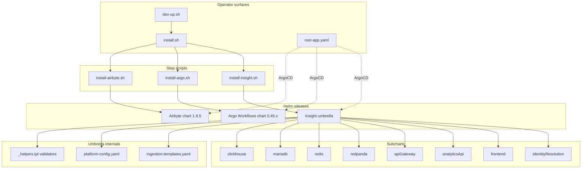
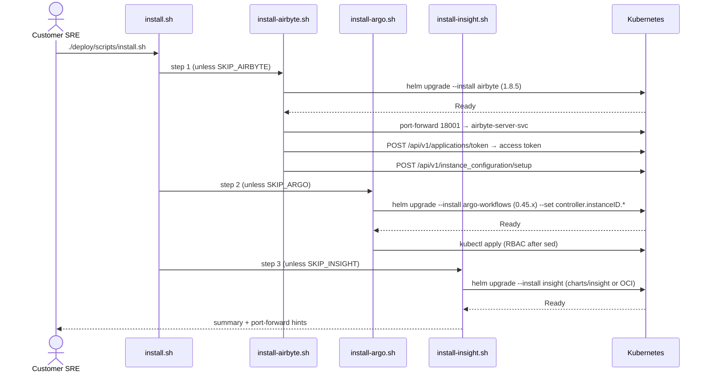
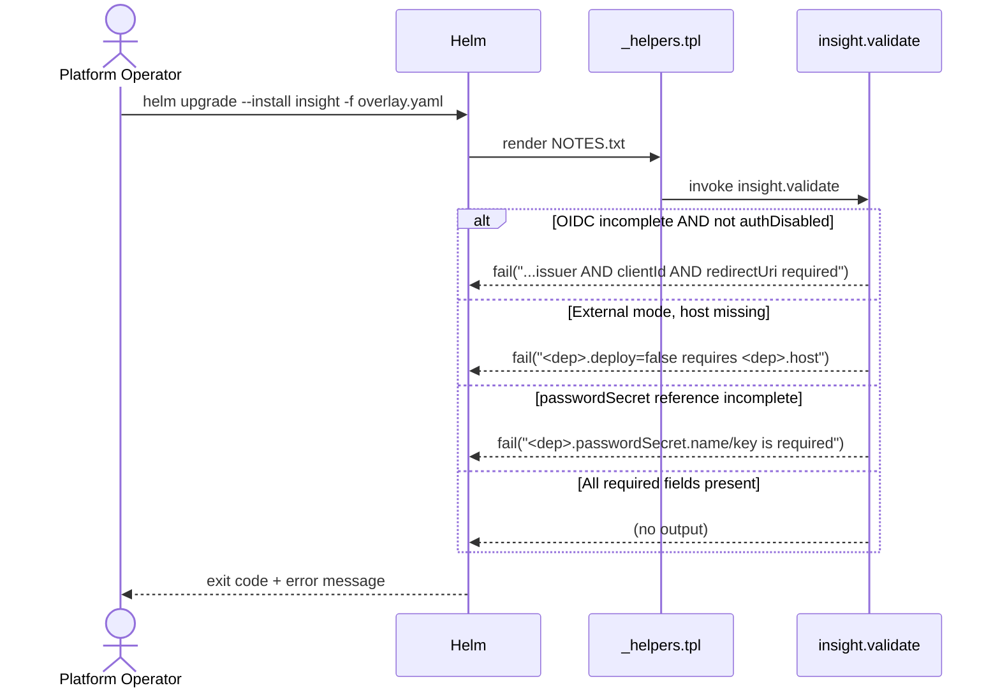
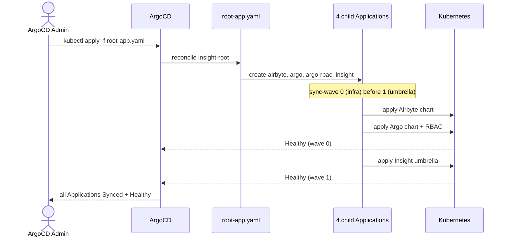

# Technical Design — Deployment

## Table of Contents

1. [1. Architecture Overview](#1-architecture-overview)
   - [1.1 Architectural Vision](#11-architectural-vision)
   - [1.2 Architecture Drivers](#12-architecture-drivers)
   - [1.3 Architecture Layers](#13-architecture-layers)
2. [2. Principles & Constraints](#2-principles--constraints)
   - [2.1 Design Principles](#21-design-principles)
   - [2.2 Constraints](#22-constraints)
3. [3. Technical Architecture](#3-technical-architecture)
   - [3.1 Domain Model](#31-domain-model)
   - [3.2 Component Model](#32-component-model)
   - [3.3 API Contracts](#33-api-contracts)
   - [3.4 Internal Dependencies](#34-internal-dependencies)
   - [3.5 External Dependencies](#35-external-dependencies)
   - [3.6 Interactions & Sequences](#36-interactions--sequences)
   - [3.7 Database schemas & tables](#37-database-schemas--tables)
4. [4. Additional context](#4-additional-context)
5. [5. Traceability](#5-traceability)

## 1. Architecture Overview

### 1.1 Architectural Vision

The Deployment subsystem is a three-layer distribution pipeline. Layer one is a set of artifacts: the Insight umbrella Helm chart, the two engine dependencies (Airbyte and Argo Workflows) pinned by version, and the application service images. Layer two is the canonical installer — four shell scripts that drive `helm upgrade --install` against a target namespace in a deterministic Airbyte → Argo → Insight order, with idempotent re-runs and per-step skip flags. Layer three is the developer wrapper `dev-up.sh` that wraps the canonical installer with image-build, Kind bootstrap and port-forward concerns so that a contributor can reach a running stack from a fresh checkout in one command.

All three layers converge on the same umbrella chart and the same curated values files, so imperative (customer SRE), declarative (enterprise ArgoCD) and developer paths render identical Kubernetes manifests. The umbrella is deliberately thin: it does not own CRDs or controllers; it orchestrates subcharts and emits one bridge object (`{release}-platform` ConfigMap) plus Argo `WorkflowTemplate` objects. Every infra dependency is pluggable — `<dep>.deploy: true` installs the bundled subchart, `<dep>.deploy: false` skips it and lets consumers point at an externally-provided instance via the same flat `<dep>.host` / `.port` / `.passwordSecret` shape used in either mode. A fail-fast validator enforces the contract at render time.

The subsystem is designed around a single-namespace deployment model: Airbyte, Argo Workflows and the umbrella are three separate Helm releases that all target the same Kubernetes namespace. Tenant separation on a shared cluster is achieved by choosing distinct namespaces, with `controller.instanceID` scoping Argo workflows per install. This trades flexibility (no cross-namespace DNS) for simplicity (no cross-namespace RBAC, no secret mirroring, one axis of isolation to reason about).

### 1.2 Architecture Drivers

**ADRs**: none dedicated to this subsystem yet; historical related decisions live under `docs/domain/ingestion/specs/ADR/` (`0002-argo-over-kestra.md`, `0003-k8s-secrets-credentials.md`).

#### Functional Drivers

| Requirement | Design Response |
|-------------|-----------------|
| `cpt-insightspec-fr-dep-umbrella-chart` | Umbrella chart `charts/insight/` with eight declared dependencies in `Chart.yaml` (four infra subcharts with `condition: <alias>.deploy` + four app-service subcharts, of which identity-resolution is the only one gated). Chart renders through a single `helm install`. |
| `cpt-insightspec-fr-dep-mandatory-apps` | API Gateway, Analytics API and Frontend are declared without a `condition:` in `Chart.yaml`; only Identity Resolution carries `condition: identityResolution.deploy`. |
| `cpt-insightspec-fr-dep-optional-identity-resolution` | `identityResolution.deploy: false` is the default in `values.yaml`; subchart renders only when explicitly enabled. |
| `cpt-insightspec-fr-dep-ingestion-templates` | `templates/ingestion/*.yaml` are first-class Helm templates that consume the umbrella's named helpers (`insight.clickhouse.fqdn`, `insight.airbyte.url`, …) directly. Argo expression syntax is escaped with backticks to survive Helm templating. Gated by `ingestion.templates.enabled`. |
| `cpt-insightspec-fr-dep-platform-configmap` | `templates/platform-config.yaml` emits a single ConfigMap named `{release}-platform`; every pod in the namespace can consume it via `envFrom`. |
| `cpt-insightspec-fr-dep-external-mode` | Each infra block in `values.yaml` has the SAME unified shape (`<dep>.deploy`, `<dep>.host`, `<dep>.port`, `<dep>.passwordSecret`); `<dep>.deploy: false` skips the bundled subchart but consumers still read the same fields. The `Chart.yaml` dependency carries `condition: <alias>.deploy`. |
| `cpt-insightspec-fr-dep-fail-fast-validation` | `insight.validate` template in `_helpers.tpl` — invoked from `NOTES.txt` on every install — calls `fail` on missing required fields across OIDC, external-mode infra, and bundled-infra passwords. |
| `cpt-insightspec-fr-dep-service-resolution-helpers` | Named helpers per dependency (`insight.clickhouse.host/port/fqdn/url`, `insight.mariadb.*`, `insight.redis.*`, `insight.redpanda.brokers`, `insight.airbyte.url`, app-service host helpers) return internal DNS when bundled, external host verbatim otherwise, without appending the cluster suffix to an external hostname. |
| `cpt-insightspec-fr-dep-canonical-installer` | `deploy/scripts/install.sh` orchestrator calls the three step scripts in order and honours `SKIP_AIRBYTE` / `SKIP_ARGO` / `SKIP_INSIGHT` flags. |
| `cpt-insightspec-fr-dep-idempotent-installs` | Every step script uses `helm upgrade --install`; no chart deletion, no destructive kubectl operations. |
| `cpt-insightspec-fr-dep-chart-source-switch` | `install-insight.sh` branches on `CHART_SOURCE={local,oci}`; OCI mode requires `INSIGHT_VERSION`. |
| `cpt-insightspec-fr-dep-layered-values` | `INSIGHT_VALUES_FILES` parsed as a colon-separated list; applied left-to-right as `-f` arguments; back-compat `INSIGHT_VALUES` appended last. |
| `cpt-insightspec-fr-dep-airbyte-setup` | `install-airbyte.sh` opens a temporary port-forward to the Airbyte server, mints an access token from `airbyte-auth-secrets/instance-admin-*`, and calls `POST /api/v1/instance_configuration/setup`. |
| `cpt-insightspec-fr-dep-argo-instance-id` | `install-argo.sh` sets `controller.workflowNamespaces[0]=$NAMESPACE`, `controller.instanceID.enabled=true`, `controller.instanceID.explicitID=$RELEASE-$NAMESPACE` via `--set`. |
| `cpt-insightspec-fr-dep-gitops-app-of-apps` | `deploy/gitops/root-app.yaml` owns four child Applications; sync-wave 0 for Airbyte + Argo + RBAC, sync-wave 1 for Insight. |
| `cpt-insightspec-fr-dep-gitops-multi-source` | Each `deploy/gitops/*-application.yaml` uses `sources: [ {repoURL: <chart>}, {repoURL: <this-repo>, ref: values} ]` and references `valueFiles: ["$values/..."]`. |
| `cpt-insightspec-fr-dep-dev-wrapper` | `dev-up.sh` scripts the Kind bootstrap, backend image builds + `kind load`, frontend build from `insight-front_symlink` with arch-aware fallback, applies `deploy/values-dev.yaml` via `INSIGHT_VALUES_FILES`, and opens the documented port-forwards. |
| `cpt-insightspec-fr-dep-dev-namespace-param` | `dev-up.sh`, `dev-down.sh` and `init.sh` read `INSIGHT_NAMESPACE` (default `insight`). |
| `cpt-insightspec-fr-dep-single-namespace-model` | `install-airbyte.sh`, `install-argo.sh` and `install-insight.sh` all target `INSIGHT_NAMESPACE`; GitOps manifests hard-code `namespace: insight` (forkable). No cross-namespace RBAC is created. |
| `cpt-insightspec-fr-dep-empty-credentials-default` | `charts/insight/values.yaml` ships no inline passwords. With `credentials.autoGenerate=true` (default) the umbrella creates `insight-db-creds` on first install via `lookup` + `randAlphaNum 24` and reuses it on every upgrade; with `autoGenerate=false` the operator must pre-create the Secret. OIDC fields are empty and the validator refuses any render that doesn't either set `apiGateway.oidc.existingSecret` or all three of `issuer`/`clientId`/`redirectUri`. |
| `cpt-insightspec-fr-dep-dev-overlay-isolation` | Eval credentials live only in `deploy/values-dev.yaml`; applied via `INSIGHT_VALUES_FILES` by `dev-up.sh` exclusively. |

#### NFR Allocation

| NFR ID | NFR Summary | Allocated To | Design Response | Verification Approach |
|--------|-------------|--------------|-----------------|----------------------|
| `cpt-insightspec-nfr-dep-install-time` | Install time ≤ 15 min (dev) / ≤ 25 min (prod). | Canonical installer + dev wrapper | Parallel `helm --wait`; no sequential kubectl polls outside Argo setup; per-step skip flags avoid redundant work. | Time-box the documented end-to-end flow on a reference laptop; fail the acceptance criterion if exceeded. |
| `cpt-insightspec-nfr-dep-tenant-isolation` | Two namespaced installs do not observe each other. | `install-argo.sh` + umbrella helpers | `controller.instanceID.explicitID=$RELEASE-$NAMESPACE`, `controller.workflowNamespaces[0]=$NAMESPACE`; no ClusterRole / ClusterRoleBinding created by any installer; all Secrets, ConfigMaps and Workflow objects live in the tenant namespace only. | Integration test: install into two namespaces, create a Workflow in one, verify the other Argo controller does not execute it. |
| `cpt-insightspec-nfr-dep-fail-fast` | Render aborts with a readable message on missing required fields. | Umbrella `insight.validate` template + inline `required` helpers | `_helpers.tpl` defines `insight.validate` that calls `fail "…"` on each missing field class; helpers wrap host/port lookups in `{{ required "..." .Values... }}`. | Unit test: `helm template` with deliberately empty fields returns non-zero and the error message names the field. |

### 1.3 Architecture Layers

```
                        ┌──────────────────────────────────────┐
                        │           Operator surfaces           │
                        │                                       │
Dev Wrapper ─────────▶ ─┤ dev-up.sh   install.sh   ArgoCD App  │
                        │   (dev)    (canonical)    (GitOps)    │
                        └─────────────────┬────────────────────┘
                                          │
                                          ▼
                        ┌──────────────────────────────────────┐
                        │        Canonical step scripts         │
                        │                                       │
                        │  install-airbyte.sh  install-argo.sh  │
                        │          install-insight.sh          │
                        └───────┬────────────┬────────────┬────┘
                                │            │            │
                      ┌─────────▼───┐ ┌──────▼─────┐ ┌────▼──────────┐
                      │ Airbyte Chart│ │ Argo Chart │ │ Insight       │
                      │   (1.8.5)    │ │  (0.45.x)  │ │ Umbrella      │
                      └──────────────┘ └────────────┘ └───────────────┘
                                                      │
                                                      ▼
                         ┌──────────────────────────────────────────┐
                         │ Infra subcharts (bundled OR external via │
                         │     `<dep>.deploy` + `<dep>.host/.port`) │
                         │                                          │
                         │   clickhouse | mariadb | redis | redpanda│
                         │                                          │
                         │ App subcharts (mandatory: apiGateway,    │
                         │ analyticsApi, frontend; optional:        │
                         │ identityResolution)                      │
                         └──────────────────────────────────────────┘
```

| Layer | Responsibility | Technology |
|-------|---------------|------------|
| Operator surfaces | Expose one command per audience: developer bring-up, customer install, enterprise GitOps. | Bash, ArgoCD `Application` YAML. |
| Canonical step scripts | Pin chart versions, apply curated values files, invoke `helm upgrade --install`, wire `controller.instanceID`, complete Airbyte's setup wizard, render supplemental Argo RBAC. | Bash, Helm, kubectl. |
| Umbrella chart | Aggregate subcharts, emit `{release}-platform` ConfigMap, emit Argo `WorkflowTemplate` objects, run fail-fast validation, bridge bundled/external mode via helpers. | Helm chart (apiVersion v2), Go-template helpers. |
| Subcharts | Ship the actual Kubernetes workloads (StatefulSets, Deployments, Services, HPAs). | Bitnami / Bitnamilegacy (MariaDB, Redis), upstream Redpanda, local wrapper for ClickHouse, in-repo charts for app services. |

## 2. Principles & Constraints

### 2.1 Design Principles

#### One releasable unit

- [ ] `p1` - **ID**: `cpt-insightspec-principle-dep-one-releasable-unit`

The product is the umbrella chart. Everything that is installed together must be declared as a dependency of that chart or as a separate pinned release driven by a canonical installer. No ad-hoc `kubectl apply` steps survive between the installer and the cluster — if it has to exist, it either goes into the chart or into a step script with a pinned version.

**ADRs**: none.

#### Single source of truth for values

- [ ] `p1` - **ID**: `cpt-insightspec-principle-dep-single-values`

Each infra and application component has exactly one curated values file. Imperative installers (`deploy/scripts/install-*.sh`) and declarative ArgoCD Applications (via the `$values` multi-source pattern) must render from the same file so the three release paths converge byte-for-byte on manifest output.

**ADRs**: none.

#### Fail fast, never silently

- [ ] `p1` - **ID**: `cpt-insightspec-principle-dep-fail-fast`

No helper returns a silent default. Every required field surfaces either through `{{ required "..." }}` at call sites or through explicit `fail` checks in `insight.validate`. A misconfigured install must not reach the cluster.

**ADRs**: none.

#### Same-namespace simplicity

- [ ] `p2` - **ID**: `cpt-insightspec-principle-dep-same-namespace`

Airbyte, Argo Workflows and the umbrella share a single Kubernetes namespace. Multi-tenant separation is achieved by choosing distinct namespaces per install. No cross-namespace service DNS, no cross-namespace RBAC, no Secret mirroring — one axis of isolation only.

**ADRs**: none.

#### Convergent paths

- [ ] `p2` - **ID**: `cpt-insightspec-principle-dep-convergent-paths`

The developer wrapper, the canonical installer and the GitOps path share the step scripts and the umbrella chart. Dev-only behaviour is confined to overlay values and to wrapper logic (Kind bootstrap, image build, port-forwards). A change that breaks the customer install surfaces on the developer path first.

**ADRs**: none.

### 2.2 Constraints

#### Kubernetes 1.27+ target

- [ ] `p1` - **ID**: `cpt-insightspec-constraint-dep-k8s-version`

The umbrella chart declares `kubeVersion: ">=1.27.0-0"`. Customers on older Kubernetes cannot use the chart without backporting Pod spec defaults. Below 1.27 the ClickHouse and Redpanda subcharts lose features the chart relies on.

**ADRs**: none.

#### Helm 3.14+ and ArgoCD 2.6+ on the GitOps path

- [ ] `p1` - **ID**: `cpt-insightspec-constraint-dep-tooling-versions`

OCI chart pulls and multi-source ArgoCD Applications both require modern tooling. Helm 3.14+ is required for OCI. ArgoCD 2.6+ is required for multi-source; downgrading silently drops the values file reference and breaks reconciliation.

**ADRs**: none.

#### Bitnami registry migration workaround

- [ ] `p2` - **ID**: `cpt-insightspec-constraint-dep-bitnami-legacy`

MariaDB and Redis subcharts point at `docker.io/bitnamilegacy/*` under `global.security.allowInsecureImages: true`, because Bitnami moved free images off `docker.io/bitnami/*` in 2025. This is a tactical workaround; enterprise customers are expected to mirror the images to their own registry.

**ADRs**: none.

#### Airbyte version policy

- [ ] `p2` - **ID**: `cpt-insightspec-constraint-dep-airbyte-version-policy`

Airbyte chart pinned to 1.8.5 (app 1.8.5). Chart 1.9.x is intentionally skipped because its bundled app is 2.0.x-alpha and is not production-grade. Upgrades happen in dedicated PRs with regression tests over ingestion workflows.

**ADRs**: none.

#### Frontend is linux/amd64 only (for now)

- [ ] `p3` - **ID**: `cpt-insightspec-constraint-dep-frontend-amd64`

The published `ghcr.io/cyberfabric/insight-front` image ships only a linux/amd64 manifest. The dev wrapper works around this by rebuilding from the sibling `insight-front` checkout on arm64 hosts. Production installs on amd64 clusters are unaffected.

**ADRs**: none.

#### Release name default is `insight`

- [ ] `p3` - **ID**: `cpt-insightspec-constraint-dep-release-name-default`

The canonical `values.yaml` hard-codes the `insight-` prefix in a handful of app-service inline URLs (for example `analyticsApi.database.url`). Installing under a non-default release name requires overriding those URLs in an overlay. The long-term migration to `envFrom: {release}-platform` removes this constraint; noted as an open item.

**ADRs**: none.

## 3. Technical Architecture

### 3.1 Domain Model

Deployment has no runtime domain model — it neither stores nor serves data. The artifacts it manipulates are Kubernetes and Helm resources. The relevant entity set is:

- **Release**: a Helm release (Airbyte, Argo Workflows, or the Insight umbrella). Each release is uniquely identified by `(namespace, release-name)`.
- **Dependency**: an entry in the umbrella `Chart.yaml` — identified by `name`, optionally `alias`, `version`, `repository`, and (for infra) `condition: <alias>.deploy`.
- **Values file**: a YAML file that parameterises a release. Each infra / app / engine component has one curated values file plus optional overlays.
- **Platform ConfigMap**: the single bridge object emitted by the umbrella. Maps resolved infra coordinates into environment variables for every pod in the namespace.
- **Infra contract**: a single flat `<dep>` block (`deploy`, `host`, `port`, `database`, `username`, `passwordSecret`) — same shape whether the umbrella runs the dep itself or consumes an externally-provided one.

Relationships:

- A **Release** consumes one or more **Values files** (canonical + overlays, applied left-to-right).
- A **Release** declares zero or more **Dependencies** (Helm subcharts).
- The **Platform ConfigMap** is owned by the umbrella Release and is mounted via `envFrom` by every pod in the namespace.
- An **External contract** is active when the matching `Dependency.condition` evaluates to false.

### 3.2 Component Model



#### Umbrella Chart

- [ ] `p1` - **ID**: `cpt-insightspec-component-dep-umbrella-chart`

##### Why this component exists

Customers, platform operators and the developer team all need a single Helm artifact that represents "Insight, ready to install". Shipping seven independent subcharts forces the operator to understand chart versioning, order of installation and inter-chart value wiring — none of that is product value. The umbrella chart concentrates those concerns in one place so that consumers interact with one artifact and one values contract.

##### Responsibility scope

- Declares every subchart the platform requires as a dependency in `Chart.yaml`, with versions pinned for first-party charts (`0.1.0`) and bounded for third-party ones (`~20.0.0`, `~21.0.0`, `~5.0.0`).
- Renders the service-resolution helpers in `_helpers.tpl`, the fail-fast `insight.validate` template, the `{release}-platform` ConfigMap and the Argo `WorkflowTemplate` bridge.
- Exposes one top-level values contract covering global, infra, app-service and ingestion concerns.

##### Responsibility boundaries

- Does not ship CRDs or controllers.
- Does not install Airbyte or Argo Workflows — those are separate Helm releases driven by the canonical installer.
- Does not create ClusterRoles, ClusterRoleBindings or any cross-namespace resources.
- Does not own runtime behaviour of the subcharts; their configuration lives in their own values blocks exposed here.

##### Related components (by ID)

- `cpt-insightspec-component-dep-service-resolution-helpers` — delegates to for host/port/URL resolution.
- `cpt-insightspec-component-dep-platform-configmap` — owns and renders.
- `cpt-insightspec-component-dep-ingestion-template-bridge` — owns and renders.
- `cpt-insightspec-component-dep-canonical-installer` — called by to render and apply.

#### Service Resolution Helpers (`_helpers.tpl`)

- [ ] `p1` - **ID**: `cpt-insightspec-component-dep-service-resolution-helpers`

##### Why this component exists

Every piece of the stack that needs to reach ClickHouse / MariaDB / Redis / Redpanda / Airbyte needs the same answer to "what is the host, what is the port?". Left to subcharts, that answer drifts — one subchart hard-codes a DNS name while another reads from a different values field and a third accidentally double-appends `.svc.cluster.local`. Centralising the resolution makes "bundled or external?" a single decision with a single implementation.

##### Responsibility scope

- Defines named helpers per dependency: `insight.clickhouse.host`, `insight.clickhouse.port`, `insight.clickhouse.fqdn`, `insight.clickhouse.url`, `insight.clickhouse.database`, matching helpers for MariaDB / Redis / Redpanda, a single `insight.airbyte.url`, and per-app-service `insight.<app>.host` helpers for DRY.
- Defines `insight.fullname`, `insight.labels` and the `insight.validate` fail-fast check.
- Handles the bundled-vs-external branch inside each helper so callers are oblivious.

##### Responsibility boundaries

- Returns no silent defaults; every missing field fails rendering via `{{ required "..." }}` or `{{ fail "..." }}`.
- Does not resolve credentials (only coordinates); credentials are Secret references handled at the subchart level.
- Does not handle cross-namespace DNS (outside the single-namespace model by design).

##### Related components (by ID)

- `cpt-insightspec-component-dep-umbrella-chart` — called by.
- `cpt-insightspec-component-dep-platform-configmap` — calls for all entries.
- `cpt-insightspec-component-dep-ingestion-templates` — calls helpers directly via `include`: `insight.clickhouse.fqdn`, `insight.clickhouse.port`, `insight.airbyte.url`.

#### Platform ConfigMap Bridge (`platform-config.yaml`)

- [ ] `p2` - **ID**: `cpt-insightspec-component-dep-platform-configmap`

##### Why this component exists

Every pod in the namespace needs the same set of resolved coordinates. Pushing those through each subchart's own values block duplicates state and creates drift between the infra subchart's DNS and what the consuming app service thinks is its DNS. A single ConfigMap owned by the umbrella is the cheapest bridge.

##### Responsibility scope

- Emits one ConfigMap named `{release}-platform` with keys `CLICKHOUSE_HOST`, `CLICKHOUSE_PORT`, `CLICKHOUSE_URL`, `CLICKHOUSE_DATABASE`, `MARIADB_*`, `REDIS_*`, `REDPANDA_BROKERS`, `AIRBYTE_API_URL`, `AIRBYTE_JWT_SECRET_NAME`, `AIRBYTE_JWT_SECRET_KEY`, `INSIGHT_*_HOST`.
- Uses service-resolution helpers exclusively — no hardcoded strings.

##### Responsibility boundaries

- Does not store credentials. Passwords and tokens live in Secrets referenced by `<dep>.passwordSecret.name` (and key); the umbrella auto-generates `insight-db-creds` when `credentials.autoGenerate=true`.
- Does not mount itself; subcharts are responsible for adding `envFrom: configMapRef: name: {release}-platform`.

##### Related components (by ID)

- `cpt-insightspec-component-dep-service-resolution-helpers` — depends on.
- `cpt-insightspec-component-dep-umbrella-chart` — owned by.

#### Ingestion Templates (`templates/ingestion/*.yaml`)

- [ ] `p2` - **ID**: `cpt-insightspec-component-dep-ingestion-templates`

##### Why this component exists

`WorkflowTemplate` objects need the umbrella's resolved dependency URLs (ClickHouse FQDN, Airbyte API URL, default container images) at install time. Earlier iterations stored them as raw files under `files/ingestion/` and substituted `__SENTINEL__` placeholders via `.Files.Get` + `replace`; that approach was opaque, lint-unfriendly, and accumulated a bespoke escaping ritual. Reviewers asked for first-class Helm templating. So the files now live under `templates/ingestion/` and use the umbrella's named helpers directly.

##### Responsibility scope

- One file per Argo `WorkflowTemplate`, rendered as a normal Helm template.
- Calls helpers like `{{ include "insight.clickhouse.fqdn" . }}` and `{{ include "insight.airbyte.url" . }}` to embed resolved URLs.
- Escapes Argo's own `{{ }}` expressions with backtick raw-string literals (`{{ ` + "`" + `"{{inputs.parameters.foo}}"` + "`" + ` }}`) so they survive Helm's pipeline.
- Gates everything behind `ingestion.templates.enabled` so operators without Argo CRDs present can render the rest of the umbrella.

##### Responsibility boundaries

- Does not define workflow business logic — Argo executes the steps once registered.
- Does not register the templates with the controller — that is Argo's concern once the CRDs are present.

##### Related components (by ID)

- `cpt-insightspec-component-dep-service-resolution-helpers` — depends on.
- `cpt-insightspec-component-dep-umbrella-chart` — owned by.

#### Canonical Installer (`deploy/scripts/install*.sh`)

- [ ] `p1` - **ID**: `cpt-insightspec-component-dep-canonical-installer`

##### Why this component exists

A Helm chart alone is not a product install — customers need the orchestration (Airbyte, Argo, umbrella, in that order, against the same namespace), the Airbyte setup-wizard completion, the supplemental Argo RBAC, and the chart-source switch (local checkout vs. OCI). Putting all of that in one orchestrator and three step scripts gives customers a single command, gives advanced operators per-step control, and gives the dev wrapper something to call.

##### Responsibility scope

- `install.sh` orchestrates the three step scripts and honours `SKIP_AIRBYTE` / `SKIP_ARGO` / `SKIP_INSIGHT`.
- `install-airbyte.sh` pins the chart version, applies the curated values file, and completes the setup wizard via the Airbyte REST API.
- `install-argo.sh` pins the chart version, sets `controller.workflowNamespaces[0]=$NAMESPACE`, `controller.instanceID.enabled=true`, `controller.instanceID.explicitID=$RELEASE-$NAMESPACE`, renders the supplemental RBAC by substituting `${NAMESPACE}` / `${WORKFLOW_SA}` placeholders via `sed`, and applies it.
- `install-insight.sh` resolves `CHART_SOURCE` (`local` or `oci`), expands `INSIGHT_VALUES_FILES` (colon-separated) plus back-compat `INSIGHT_VALUES`, and runs `helm upgrade --install`.

##### Responsibility boundaries

- Does not provision the Kubernetes cluster itself — the dev wrapper does that for Kind; production installs assume an existing cluster.
- Does not create Secrets on behalf of the operator — those are either already present (external mode, production) or supplied via values (dev overlay).

##### Related components (by ID)

- `cpt-insightspec-component-dep-umbrella-chart` — invokes through Helm.
- `cpt-insightspec-component-dep-dev-wrapper` — called by.

#### GitOps Manifests (`deploy/gitops/`)

- [ ] `p2` - **ID**: `cpt-insightspec-component-dep-gitops-manifests`

##### Why this component exists

Enterprise customers standardise on ArgoCD. They need one Application manifest that owns the platform and drives upgrades from Git, not a shell installer. The multi-source `$values` pattern lets the same curated values files serve both the imperative and declarative paths.

##### Responsibility scope

- `root-app.yaml` — the App-of-Apps parent that owns the other four.
- `airbyte-application.yaml`, `argo-application.yaml`, `argo-rbac-application.yaml`, `insight-application.yaml` — one Application per release.
- `insight-values.yaml` — GitOps-specific overlay (OIDC, ingress, TLS).
- Sync-wave annotations on the children enforce infra-then-umbrella ordering via the App-of-Apps parent.

##### Responsibility boundaries

- Does not provision ArgoCD itself — that is a prerequisite.
- Does not own the chart content; it references the chart from OCI or Git and the values files from `deploy/`.

##### Related components (by ID)

- `cpt-insightspec-component-dep-umbrella-chart` — references.
- `cpt-insightspec-component-dep-canonical-installer` — parallel declarative path to.

#### Dev Wrapper (`dev-up.sh`)

- [ ] `p3` - **ID**: `cpt-insightspec-component-dep-dev-wrapper`

##### Why this component exists

Developers iterate faster when the platform bring-up is one command. The wrapper adds what customers do not need — cluster bootstrap, image builds from source, Kind image loading, port-forwards — while delegating the actual install to the same canonical installer that customers run. That keeps dev and customer paths convergent.

##### Responsibility scope

- Bootstraps a Kind cluster named `insight` if absent.
- Builds backend images and loads them with `kind load docker-image`.
- Builds the frontend image from the sibling `insight-front` checkout with native-arch try + `linux/amd64` fallback; on pull-only paths uses `docker pull --platform`.
- Sets `INSIGHT_VALUES_FILES` to include `deploy/values-dev.yaml`.
- Sets `DEV_MODE=1` so `install-argo.sh` picks up `deploy/argo/values-dev.yaml` (auth-mode=server for eval).
- Opens port-forwards for Frontend :8003, API Gateway :8080, Airbyte UI :8002, Airbyte API :8001, Argo UI :2746, ClickHouse HTTP :8123.
- `dev-down.sh` tears the cluster down; `init.sh` bootstraps `.env.*` defaults.

##### Responsibility boundaries

- Not for customer use. `dev-up.sh` is explicitly advertised as internal-only; customers are pointed at `deploy/scripts/install.sh`.
- Does not persist state outside the Kind cluster; nothing leaks to the host.

##### Related components (by ID)

- `cpt-insightspec-component-dep-canonical-installer` — calls.
- `cpt-insightspec-component-dep-umbrella-chart` — indirectly via the installer.

### 3.3 API Contracts

#### Umbrella values contract

- [ ] `p1` - **ID**: `cpt-insightspec-interface-dep-values-contract`

- **Contracts**: `cpt-insightspec-contract-dep-argocd`.
- **Technology**: YAML keys read by Helm; machine-validatable via `charts/insight/values.schema.json`.
- **Location**: [charts/insight/values.yaml](../../../../charts/insight/values.yaml) and [charts/insight/values.schema.json](../../../../charts/insight/values.schema.json).

**Endpoints Overview**:

| Section | Key(s) | Description | Stability |
|---------|--------|-------------|-----------|
| global | `global.imagePullSecrets`, `global.storageClass`, `global.security.allowInsecureImages` | Cluster-wide knobs consumed by every subchart. | unstable |
| airbyte | `airbyte.releaseName`, `airbyte.apiUrl`, `airbyte.jwtSecret.{name,key}` | External coordinates for the separately-installed Airbyte release. | unstable |
| ingestion | `ingestion.templates.enabled` | Gate for emitting Argo WorkflowTemplates. | unstable |
| credentials | `credentials.autoGenerate` | Toggle umbrella-managed `insight-db-creds` (random passwords on first install, reused on upgrade via `lookup`). | unstable |
| clickhouse | `clickhouse.deploy`, `clickhouse.host`, `clickhouse.port`, `clickhouse.database`, `clickhouse.username`, `clickhouse.passwordSecret.{name,key}` | Unified shape — bundled when `deploy=true`, external otherwise. | unstable |
| mariadb | `mariadb.deploy`, `mariadb.host`, `mariadb.port`, `mariadb.database`, `mariadb.username`, `mariadb.passwordSecret.{name,key}` | Unified shape — bundled or external. | unstable |
| redis | `redis.deploy`, `redis.host`, `redis.port`, `redis.passwordSecret.{name,key}` | Unified shape — bundled or external. | unstable |
| redpanda | `redpanda.deploy`, `redpanda.brokers`, `redpanda.tls.*`, `redpanda.auth.sasl.*` | Unified shape — bundled or external. | unstable |
| apiGateway | `apiGateway.replicaCount`, `apiGateway.image.*`, `apiGateway.oidc.*`, `apiGateway.authDisabled`, `apiGateway.ingress.*`, `apiGateway.proxy.routes` | Mandatory API Gateway service. | unstable |
| analyticsApi | `analyticsApi.replicaCount`, `analyticsApi.image.*` | Mandatory Analytics API service; reads DB/Redis/CH coordinates from auto-generated `insight-analytics-api-config` Secret. | unstable |
| identityResolution | `identityResolution.deploy`, `identityResolution.replicaCount`, `identityResolution.image.*` | Optional Identity Resolution stub (off by default). | unstable |
| frontend | `frontend.replicaCount`, `frontend.image.*`, `frontend.ingress.*`, `frontend.oidc.*` | Mandatory Frontend SPA. | unstable |

#### Installer environment contract

- [ ] `p2` - **ID**: `cpt-insightspec-interface-dep-installer-env`

- **Technology**: shell environment variables read by the step scripts.
- **Location**: [deploy/scripts/install.sh](../../../../deploy/scripts/install.sh), [deploy/scripts/install-airbyte.sh](../../../../deploy/scripts/install-airbyte.sh), [deploy/scripts/install-argo.sh](../../../../deploy/scripts/install-argo.sh), [deploy/scripts/install-insight.sh](../../../../deploy/scripts/install-insight.sh).

**Endpoints Overview**:

| Variable | Used by | Description | Stability |
|----------|---------|-------------|-----------|
| `INSIGHT_NAMESPACE` | all | Target Kubernetes namespace (default `insight`). | stable |
| `SKIP_AIRBYTE`, `SKIP_ARGO`, `SKIP_INSIGHT` | install.sh | Skip per step. | stable |
| `AIRBYTE_RELEASE`, `AIRBYTE_VERSION`, `AIRBYTE_VALUES`, `AIRBYTE_SETUP_EMAIL`, `AIRBYTE_SETUP_ORG` | install-airbyte.sh | Airbyte release knobs. | stable |
| `ARGO_RELEASE`, `ARGO_VERSION`, `ARGO_VALUES`, `ARGO_RBAC` | install-argo.sh | Argo Workflows release knobs. | stable |
| `INSIGHT_RELEASE`, `INSIGHT_VERSION`, `CHART_SOURCE`, `OCI_REF`, `INSIGHT_VALUES`, `INSIGHT_VALUES_FILES`, `HELM_EXTRA_ARGS` | install-insight.sh | Umbrella install knobs. | stable |
| `DEV_MODE` | install-argo.sh | When `1`, merges `deploy/argo/values-dev.yaml`. | stable |
| `EXTRA_VALUES_FILE` | install-airbyte.sh, install-argo.sh | Additional `-f` file for prod overlays. | stable |

### 3.4 Internal Dependencies

| Dependency Module | Interface Used | Purpose |
|-------------------|----------------|---------|
| `src/backend/services/api-gateway/helm` | Helm subchart | Mandatory app service shipped under `apiGateway` alias. |
| `src/backend/services/analytics-api/helm` | Helm subchart | Mandatory app service shipped under `analyticsApi` alias. |
| `src/backend/services/identity/helm` | Helm subchart | Optional identity-resolution stub under `identityResolution` alias. |
| `src/frontend/helm` | Helm subchart | Mandatory SPA shipped under `frontend` alias. |
| `helmfile/charts/clickhouse` | Helm subchart (local wrapper) | ClickHouse OLAP store. |
| `charts/insight/templates/ingestion/*.yaml` | First-class Helm templates | Ingestion WorkflowTemplate sources, gated by `ingestion.templates.enabled`; consume umbrella helpers directly via `include`. |
| `src/ingestion/airbyte-toolkit/lib/env.sh` | Read `AIRBYTE_API_URL` from the platform ConfigMap | Ingestion scripts consume Airbyte coordinates from the ConfigMap rather than hard-coding. |

**Dependency Rules**:

- No cross-namespace resources — everything stays in the release namespace.
- No subchart reaches outside its own values block to read another subchart's values; coordination goes through service-resolution helpers and the platform ConfigMap.
- App-service subcharts must not duplicate DNS resolution logic; the long-term migration is to read the platform ConfigMap via `envFrom`. In the interim, inline URLs in `values.yaml` are acknowledged as technical debt.

### 3.5 External Dependencies

#### Airbyte

| Dependency Module | Interface Used | Purpose |
|-------------------|----------------|---------|
| `airbyte/airbyte` chart 1.8.5 | Helm release | Data extraction engine; installed as a separate release in the same namespace. |

#### Argo Workflows

| Dependency Module | Interface Used | Purpose |
|-------------------|----------------|---------|
| `argo/argo-workflows` chart 0.45.x | Helm release | Workflow engine for ingestion pipelines; installed as a separate release in the same namespace. |

#### ArgoCD (GitOps path only)

| Dependency Module | Interface Used | Purpose |
|-------------------|----------------|---------|
| ArgoCD 2.6+ | `argoproj.io/v1alpha1 Application` manifests | Declarative install and upgrade driver; required for the enterprise path, optional otherwise. |

#### Bitnami Helm charts (MariaDB, Redis)

| Dependency Module | Interface Used | Purpose |
|-------------------|----------------|---------|
| `oci://registry-1.docker.io/bitnamicharts/mariadb` ~20.0.0 | Helm subchart | Bundled operational DB. Images pulled from `bitnamilegacy`. |
| `oci://registry-1.docker.io/bitnamicharts/redis` ~21.0.0 | Helm subchart | Bundled cache. Images pulled from `bitnamilegacy`. |

#### Redpanda

| Dependency Module | Interface Used | Purpose |
|-------------------|----------------|---------|
| `redpanda` chart ~5.0.0 | Helm subchart | Kafka-compatible event bus. |

#### OCI chart registry

| Dependency Module | Interface Used | Purpose |
|-------------------|----------------|---------|
| `oci://ghcr.io/cyberfabric/charts/insight` | Helm OCI pull | Published umbrella chart consumed by customer installers and GitOps Applications. |

**Dependency Rules**:

- Third-party chart versions are pinned; upgrades happen in dedicated PRs with regression tests.
- No third-party chart is allowed to create ClusterRole / ClusterRoleBinding owned by Insight — all RBAC is namespace-scoped.
- The `global.security.allowInsecureImages` flag is set true solely to work around the Bitnami registry migration; it is not a licence to pull arbitrary images.

### 3.6 Interactions & Sequences

#### Canonical install sequence

- [ ] `p1` - **ID**: `cpt-insightspec-seq-dep-canonical-install`

**Use cases**: `cpt-insightspec-usecase-dep-production-install`, `cpt-insightspec-usecase-dep-platform-tenant`.

**Actors**: `cpt-insightspec-actor-customer-sre`, `cpt-insightspec-actor-helm`, `cpt-insightspec-actor-kubernetes`, `cpt-insightspec-actor-airbyte-engine`, `cpt-insightspec-actor-argo-workflows`.



**Description**: A single `install.sh` drives the three releases against one namespace in a deterministic order. Each step is independently re-runnable; Airbyte's setup wizard is completed via API post-chart-Ready; Argo's `controller.instanceID` is bound to release+namespace for multi-tenant scoping.

#### Fail-fast validation path

- [ ] `p1` - **ID**: `cpt-insightspec-seq-dep-fail-fast-validation`

**Use cases**: `cpt-insightspec-usecase-dep-platform-tenant`.

**Actors**: `cpt-insightspec-actor-platform-operator`, `cpt-insightspec-actor-helm`.



**Description**: The `insight.validate` template runs on every install through `NOTES.txt`. It aborts rendering with a field-specific message before any manifest reaches the cluster. This covers three classes of misconfiguration: partial OIDC, incomplete external-mode contract, missing bundled-infra password.

#### GitOps App-of-Apps reconciliation

- [ ] `p2` - **ID**: `cpt-insightspec-seq-dep-gitops-reconciliation`

**Use cases**: `cpt-insightspec-usecase-dep-gitops`.

**Actors**: `cpt-insightspec-actor-argocd-admin`, `cpt-insightspec-actor-argocd`, `cpt-insightspec-actor-kubernetes`.



**Description**: The App-of-Apps root owns four children. Sync-wave annotations between children of one parent Application are honoured by ArgoCD; sibling Applications applied directly under the ArgoCD root are not. The canonical GitOps path is the App-of-Apps manifest.

#### Developer inner loop

- [ ] `p3` - **ID**: `cpt-insightspec-seq-dep-dev-inner-loop`

**Use cases**: `cpt-insightspec-usecase-dep-eval-install`, `cpt-insightspec-usecase-dep-dev-inner-loop`.

**Actors**: `cpt-insightspec-actor-platform-developer`, `cpt-insightspec-actor-kubernetes`.

```mermaid
sequenceDiagram
    actor Dev as Platform Developer
    participant DevUp as dev-up.sh
    participant Kind as Kind
    participant Inst as install.sh
    participant K8s as Cluster

    Dev->>DevUp: ./dev-up.sh --env local
    DevUp->>Kind: kind create cluster --name insight (if absent)
    DevUp->>DevUp: docker build backend + frontend
    DevUp->>Kind: kind load docker-image <images>
    DevUp->>Inst: SKIP_AIRBYTE=0 INSIGHT_VALUES_FILES=deploy/values-dev.yaml DEV_MODE=1 ./install.sh
    Inst->>K8s: install airbyte + argo (dev auth) + umbrella
    K8s-->>DevUp: Ready
    DevUp->>DevUp: open port-forwards (UI :8003, API :8080, Argo :2746, ...)
    DevUp-->>Dev: ready; open http://localhost:8003
```

**Description**: The dev wrapper composes cluster bootstrap, image build, image load and the canonical installer. `DEV_MODE=1` and `INSIGHT_VALUES_FILES=deploy/values-dev.yaml` are the only dev-specific deviations; everything else is the customer code path.

### 3.7 Database schemas & tables

Not applicable. The Deployment subsystem stores no data; it manipulates Kubernetes resources only. Runtime data stores (ClickHouse, MariaDB, Redpanda) are introduced by subcharts but their schemas are owned elsewhere (Backend DESIGN for MariaDB; Ingestion Layer DESIGN and Connector DESIGNs for ClickHouse).

## 4. Additional context

**Lessons learned from the first-run debugging cycle.** The `DEVLOG.md` at the repo root captures the twelve issues discovered during the first end-to-end run of `dev-up.sh` on a fresh Apple-Silicon laptop. The ones that fed back into the design:

1. Airbyte auth was off in the curated values. Now `global.auth.enabled: true`; the chart generates a random admin password on first install into `airbyte-auth-secrets/instance-admin-password`. The dev wrapper and installer both pick it up.
2. The Airbyte webapp port-forward was missing from `dev-up.sh`. Now port 8002 is opened; prod installs are expected to disable the webapp or gate it behind an OIDC-proxy ingress.
3. DB passwords are not auto-generated. Canonical `values.yaml` intentionally leaves infra credentials empty; dev bring-up supplies eval values via `deploy/values-dev.yaml`. This is a deliberate choice over `randAlphaNum` hooks because reproducibility across dev runs beats marginal "security" on a throwaway cluster.
4. Frontend image is linux/amd64 only. The dev wrapper builds from the sibling `insight-front` checkout on arm64 hosts with a `docker pull --platform linux/amd64` fallback; follow-up is to publish multi-arch images (infra team).
5. Argo's chart expects `controller.instanceID` as a sub-object (`enabled` + `explicitID`), not a plain string. The installer uses the dotted-key form.
6. Argo's supplemental RBAC requires a namespace-scoped Role + Binding for the workflow service account. Shipped as `deploy/argo/rbac.yaml` with `${NAMESPACE}` / `${WORKFLOW_SA}` placeholders that `install-argo.sh` substitutes via `sed` so `envsubst` is not a hard prerequisite.
7. The umbrella chart's internal DNS references are keyed off `.Release.Name`; a non-default release name breaks inline URLs in `values.yaml`. Acknowledged as tech debt; the planned follow-up migrates all app services to read the platform ConfigMap via `envFrom` so inline URLs disappear from values.

**Known gaps**:

- **Release automation.** Versions are pinned in `Chart.yaml` and image tags but there is no CI pipeline that couples `git tag vX.Y.Z` to image build + chart package + OCI push. Releases today are manual. Planned.
- **Credential propagation.** Resolved as of this PR: the umbrella generates `insight-db-creds` (raw passwords) plus `insight-analytics-api-config` and `insight-identity-resolution-config` (full DSNs assembled from helpers + the generated passwords). App services consume these via `envFrom: secretRef: ...`. Inline URLs in `values.yaml` are gone. Remaining follow-up: migrate the few subcharts that still read inline `auth.password` from values to read the umbrella-managed Secret via the same `<dep>.passwordSecret.name/key` reference (bitnami's `auth.existingSecret` knob).
- **Airbyte webapp gating in production.** Canonical values do not disable the webapp; a production overlay is expected but not shipped. Needs an opinionated prod overlay as a follow-up.
- **Identity Resolution MVP stub.** The `insight-identity-resolution` subchart exists but is a stub that crashloops on empty bronze. Default `identityResolution.deploy: false` mitigates accidental activation; a real error message at startup is a Backend-side improvement.
- **`rbac-insight.yaml` vs `rbac.yaml`.** The dev/canonical path uses placeholder-substituted `rbac.yaml`; the GitOps path references a pre-rendered `rbac-insight.yaml`. Keeping these synchronised is manual. Planned follow-up is a single templated RBAC source that both paths consume.
- **Frontend multi-arch.** As noted, published as linux/amd64 only. Infra team owns the CI change.

**Open questions**:

- Should the canonical installer support an `--offline` / `--air-gapped` flag that skips OCI pulls and expects images + chart to be pre-loaded into the customer registry?
- Should the App-of-Apps manifest set `syncPolicy.automated.prune: true`? It simplifies rollback-by-revert but makes accidental deletion of an Application more destructive.
- Should `controller.instanceID.explicitID` include a stable random component to survive namespace rename across clusters?

## 5. Traceability

- **PRD**: [PRD.md](./PRD.md)
- **ADRs**: none specific to Deployment; related decisions under `docs/domain/ingestion/specs/ADR/`.
- **Related designs**:
  - [docs/components/backend/specs/DESIGN.md](../../backend/specs/DESIGN.md) — Backend architecture; consumes the platform ConfigMap and `credentialsSecret` references emitted by this subsystem.
  - [docs/domain/ingestion/specs/DESIGN.md](../../../domain/ingestion/specs/DESIGN.md) — Ingestion architecture; the `WorkflowTemplate` files under `charts/insight/templates/ingestion/` originate from the ingestion subsystem and are emitted by this subsystem's umbrella as first-class Helm templates.
  - [docs/components/airbyte-toolkit/specs/DESIGN.md](../../airbyte-toolkit/specs/DESIGN.md) — Toolkit that consumes `AIRBYTE_API_URL` and the JWT Secret from the platform ConfigMap.
