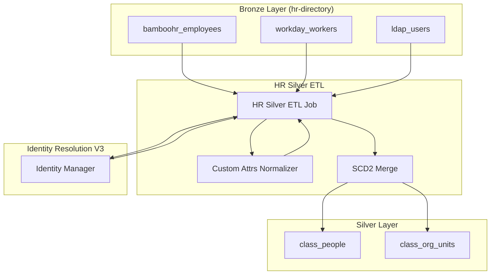
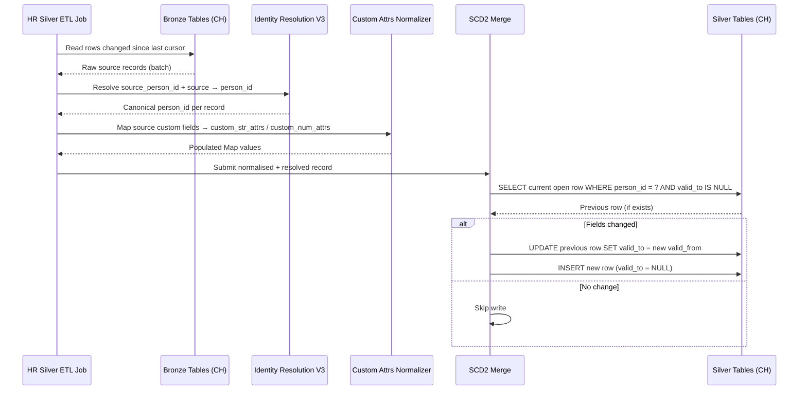
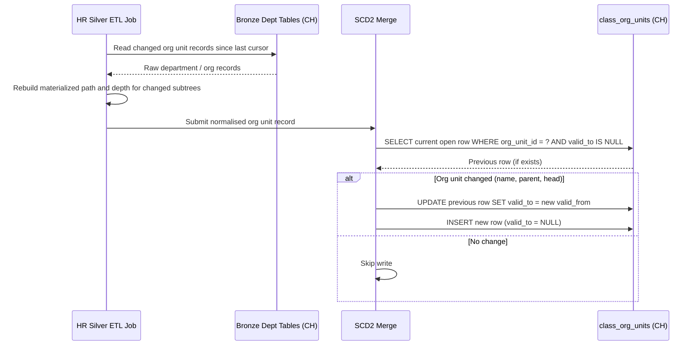

# Technical Design — HR Silver Layer

<!-- toc -->

- [1. Architecture Overview](#1-architecture-overview)
  - [1.1 Architectural Vision](#11-architectural-vision)
  - [1.2 Architecture Drivers](#12-architecture-drivers)
    - [Functional Drivers](#functional-drivers)
    - [NFR Allocation](#nfr-allocation)
  - [1.3 Architecture Layers](#13-architecture-layers)
- [2. Principles & Constraints](#2-principles-constraints)
  - [2.1 Design Principles](#21-design-principles)
    - [SCD Type 2 Immutability](#scd-type-2-immutability)
    - [Canonical Identity](#canonical-identity)
    - [Extensibility by Configuration](#extensibility-by-configuration)
  - [2.2 Constraints](#22-constraints)
    - [Workspace ID Mandatory](#workspace-id-mandatory)
    - [No Overlapping Intervals](#no-overlapping-intervals)
    - [Source Priority](#source-priority)
- [3. Technical Architecture](#3-technical-architecture)
  - [3.1 Domain Model](#31-domain-model)
  - [3.2 Component Model](#32-component-model)
    - [HR Silver ETL Job](#hr-silver-etl-job)
      - [Why this component exists](#why-this-component-exists)
      - [Responsibility scope](#responsibility-scope)
      - [Responsibility boundaries](#responsibility-boundaries)
      - [Related components (by ID)](#related-components-by-id)
    - [SCD2 Merge](#scd2-merge)
      - [Why this component exists](#why-this-component-exists-1)
      - [Responsibility scope](#responsibility-scope-1)
      - [Responsibility boundaries](#responsibility-boundaries-1)
      - [Related components (by ID)](#related-components-by-id-1)
    - [Custom Attributes Normalizer](#custom-attributes-normalizer)
      - [Why this component exists](#why-this-component-exists-2)
      - [Responsibility scope](#responsibility-scope-2)
      - [Responsibility boundaries](#responsibility-boundaries-2)
      - [Related components (by ID)](#related-components-by-id-2)
  - [3.3 API Contracts](#33-api-contracts)
  - [3.4 Internal Dependencies](#34-internal-dependencies)
  - [3.5 External Dependencies](#35-external-dependencies)
    - [ClickHouse](#clickhouse)
    - [Identity Resolution V3 (PostgreSQL / MariaDB)](#identity-resolution-v3-postgresql-mariadb)
  - [3.6 Interactions & Sequences](#36-interactions-sequences)
    - [Bronze to Silver Ingestion — class_people](#bronze-to-silver-ingestion-classpeople)
    - [Org Unit Hierarchy Rebuild](#org-unit-hierarchy-rebuild)
  - [3.7 Database Schemas & Tables](#37-database-schemas-tables)
    - [Table: `class_people`](#table-classpeople)
    - [Table: `class_org_units`](#table-classorgunits)
- [4. Additional Context](#4-additional-context)
  - [PII Handling](#pii-handling)
  - [Table Sizing and Retention](#table-sizing-and-retention)
  - [Sections Not Applicable](#sections-not-applicable)
- [5. Traceability](#5-traceability)

<!-- /toc -->

## 1. Architecture Overview

### 1.1 Architectural Vision

The HR Silver Layer transforms raw HR directory data from Bronze source tables (BambooHR, Workday, LDAP/Active Directory) into two canonical, workspace-isolated Silver tables: `class_people` and `class_org_units`. Both tables follow the SCD Type 2 pattern: each row captures a point-in-time snapshot of a person or organisational unit, with `valid_from`/`valid_to` interval semantics. The current state of any entity is always the row where `valid_to IS NULL`.

The design makes the HR domain the authoritative source for person identity and organisational structure within the Insight platform. `class_people` serves as the canonical person registry consumed by all other Silver streams that carry `person_id`. `class_org_units` provides the org hierarchy needed for hierarchical scoping of metrics — the depth, path, and head of each organisational unit — data that cannot be reliably derived from `class_people` alone.

Extensibility for company-specific HR attributes is handled natively via two typed Map columns (`custom_str_attrs`, `custom_num_attrs`), eliminating schema migrations when a workspace adds a new custom HR field.

### 1.2 Architecture Drivers

**ADRs**: `cpt-insightspec-adr-workspace-isolation`

#### Functional Drivers

| Requirement | Design Response |
|---|---|
| Multi-source HR unification (BambooHR, Workday, LDAP) | HR Silver ETL Job normalises source-specific schemas into unified `class_people` and `class_org_units` schemas |
| Canonical person identity across all Silver streams | `person_id` resolved by Identity Resolution V3 before SCD2 merge; all other Silver tables foreign-key to `class_people.person_id` |
| Org hierarchy traversal for metric scoping | `class_org_units` carries `parent_org_unit_id`, `path` (materialized), `depth`, and `head_person_id`; supports arbitrary depth |
| Company-specific HR attributes without schema migrations | `custom_str_attrs Map(String, String)` and `custom_num_attrs Map(String, Float64)` carry per-workspace custom fields |
| Historical state for tenure and org change analytics | SCD Type 2: each org move, status change, or title change produces a new row; full history is queryable |

#### NFR Allocation

| NFR ID | NFR Summary | Allocated To | Design Response | Verification Approach |
|---|---|---|---|---|
| `cpt-insightspec-nfr-tenant-isolation` | Zero cross-workspace data leakage | `workspace_id` column on both Silver tables | `workspace_id` is a partition key component on `class_people` and `class_org_units`; DataScopeFilter injects `workspace_id = ?` predicate on every query | Integration tests asserting no cross-workspace rows returned under adversarial queries |
| `cpt-insightspec-nfr-query-performance` | Sub-second queries for org-scoped metrics | ClickHouse partition pruning | `(workspace_id, valid_to)` partition key enables pruning for current-state queries (`WHERE valid_to IS NULL`); `path LIKE '/company/eng/%'` enables subtree scoping | Query benchmarks on representative dataset sizes |

### 1.3 Architecture Layers

```
┌──────────────────────────────────────────────────────────────┐
│  Bronze Layer (ClickHouse)                                   │
│  bamboohr_employees │ workday_workers │ ldap_users           │
└─────────────────────────────┬────────────────────────────────┘
                              │  HR Silver ETL Job
                              ▼
┌──────────────────────────────────────────────────────────────┐
│  Identity Resolution V3 (PostgreSQL / MariaDB)               │
│  source_person_id + source → canonical person_id             │
└─────────────────────────────┬────────────────────────────────┘
                              │  SCD2 Merge
                              ▼
┌──────────────────────────────────────────────────────────────┐
│  Silver Layer (ClickHouse)                                   │
│  class_people  │  class_org_units                            │
└─────────────────────────────┬────────────────────────────────┘
                              │  Direct ClickHouse reads
                              ▼
┌──────────────────────────────────────────────────────────────┐
│  Gold Layer (ClickHouse) — out of scope for this design      │
└──────────────────────────────────────────────────────────────┘
```

- [ ] `p3` - **ID**: `cpt-insightspec-tech-hr-silver-stack`

| Layer | Responsibility | Technology |
|---|---|---|
| Bronze | Raw HR records, source-native schema, one row per API object | ClickHouse |
| Identity Resolution | Maps source-native user IDs to canonical `person_id` | PostgreSQL / MariaDB |
| Silver ETL | Normalisation, SCD2 merge, custom attribute mapping | Platform ETL runtime |
| Silver | Canonical HR tables: `class_people`, `class_org_units` | ClickHouse |
| Gold | Derived HR metrics (tenure, org size, headcount trends) | ClickHouse — out of scope |

## 2. Principles & Constraints

### 2.1 Design Principles

#### SCD Type 2 Immutability

- [ ] `p2` - **ID**: `cpt-insightspec-principle-scd2-immutability`

Silver rows are never updated in place. Every state change (org move, title change, status change) produces a new row with a new `valid_from`. The previous open row receives `valid_to = new valid_from`. This preserves full history and makes point-in-time queries deterministic.

**ADRs**: `cpt-insightspec-adr-workspace-isolation`

#### Canonical Identity

- [ ] `p2` - **ID**: `cpt-insightspec-principle-canonical-identity`

All person references in Silver use the resolved `person_id` assigned by Identity Resolution V3. Source-native identifiers (`source_person_id`) are retained for lineage and debugging but must not be used as join keys outside the HR Silver domain.

#### Extensibility by Configuration

- [ ] `p2` - **ID**: `cpt-insightspec-principle-extensibility-by-config`

Company-specific HR attributes are stored in typed Map columns (`custom_str_attrs`, `custom_num_attrs`). Adding a new workspace-specific attribute requires no schema migration — only a mapping rule in the Custom Attributes Normalizer configuration for that workspace.

### 2.2 Constraints

#### Workspace ID Mandatory

- [ ] `p2` - **ID**: `cpt-insightspec-constraint-hr-workspace-id-mandatory`

Every row in `class_people` and `class_org_units` must carry `workspace_id`. The HR Silver ETL Job must reject any row where `workspace_id` cannot be resolved.

**ADRs**: `cpt-insightspec-adr-workspace-isolation`

#### No Overlapping Intervals

- [ ] `p2` - **ID**: `cpt-insightspec-constraint-no-overlapping-intervals`

For a given (`person_id`, `workspace_id`) pair, no two rows in `class_people` may have overlapping `[valid_from, valid_to)` intervals. Exactly one row per person may have `valid_to IS NULL` (the current state). The SCD2 Merge component enforces this invariant before writing to ClickHouse.

#### Source Priority

- [ ] `p2` - **ID**: `cpt-insightspec-constraint-hr-source-priority`

When two Bronze sources provide conflicting records for the same person in the same time window, the HR Silver ETL Job applies source priority as defined in IDENTITY_RESOLUTION_V3. Higher-priority source data overwrites lower-priority data; no field-level merge across sources occurs.

## 3. Technical Architecture

### 3.1 Domain Model

**Technology**: ClickHouse column-oriented tables

**Location**: [README.md](./README.md) (this document, Section 3.7)

**Core Entities**:

| Entity | Description | Schema |
|---|---|---|
| PersonRecord | A point-in-time snapshot of a person's HR state within a workspace | Section 3.7 — `class_people` |
| OrgUnitRecord | A point-in-time snapshot of an organisational unit's state within a workspace | Section 3.7 — `class_org_units` |

**Relationships**:

- `PersonRecord` → `OrgUnitRecord`: each person record references the org unit the person belonged to during the validity interval (`org_unit_id`)
- `PersonRecord` → `PersonRecord`: each person record references their direct manager (`manager_person_id` → `person_id` of a current PersonRecord)
- `OrgUnitRecord` → `OrgUnitRecord`: each org unit record references its parent (`parent_org_unit_id`)
- `OrgUnitRecord` → `PersonRecord`: each org unit record references its head (`head_person_id` → `person_id` of a current PersonRecord)

**Invariants**:

- `valid_to IS NULL` identifies the current row for any entity
- `valid_from < valid_to` whenever `valid_to IS NOT NULL`
- No two rows for the same (`person_id`, `workspace_id`) pair may overlap

### 3.2 Component Model



#### HR Silver ETL Job

- [ ] `p2` - **ID**: `cpt-insightspec-component-hr-silver-etl`

##### Why this component exists

Coordinates the full Bronze-to-Silver pipeline for the hr-directory domain. Without a dedicated orchestrator, source-specific normalisation logic, identity resolution calls, and SCD2 merge operations would be scattered across unrelated jobs.

##### Responsibility scope

Reads new and changed rows from all hr-directory Bronze tables since the last successful run cursor. Normalises source-specific field names and values into the unified `class_people` and `class_org_units` schemas. Delegates custom attribute mapping to the Custom Attributes Normalizer. Calls Identity Resolution V3 to obtain `person_id` for each source record. Passes resolved records to SCD2 Merge.

##### Responsibility boundaries

Does not perform identity resolution logic internally — delegates entirely to Identity Resolution V3. Does not make Gold layer writes. Does not modify Bronze tables.

##### Related components (by ID)

- `cpt-insightspec-component-scd2-merge` — calls for each resolved person and org unit record
- `cpt-insightspec-component-custom-attrs-normalizer` — calls for each record to populate Map columns

---

#### SCD2 Merge

- [ ] `p2` - **ID**: `cpt-insightspec-component-scd2-merge`

##### Why this component exists

Enforces the SCD Type 2 invariants on ClickHouse writes. ClickHouse does not enforce uniqueness or update-in-place semantics natively; this component provides the correctness guarantee.

##### Responsibility scope

For each incoming resolved record: queries the current open row for (`person_id`, `workspace_id`); compares field values; if changed, closes the previous row by setting `valid_to = new valid_from` and inserts the new row with `valid_to = NULL`; if unchanged, skips the write. Enforces the no-overlapping-intervals constraint (`cpt-insightspec-constraint-no-overlapping-intervals`) before every write.

##### Responsibility boundaries

Does not decide which source record wins when two sources conflict — that decision is made by HR Silver ETL Job using source priority (`cpt-insightspec-constraint-hr-source-priority`). Does not write to Bronze tables. Does not resolve `person_id`.

##### Related components (by ID)

- `cpt-insightspec-component-hr-silver-etl` — called by

---

#### Custom Attributes Normalizer

- [ ] `p2` - **ID**: `cpt-insightspec-component-custom-attrs-normalizer`

##### Why this component exists

Company-specific HR attributes (e.g., `functional_team`, `division`, `mother_tongue`) vary across workspaces. Centralising the mapping logic prevents per-source proliferation of special-case code in the ETL Job.

##### Responsibility scope

Reads a per-workspace mapping configuration that declares which source fields map to which Map keys and whether the value is string or numeric. Produces populated `custom_str_attrs Map(String, String)` and `custom_num_attrs Map(String, Float64)` values for each person record.

##### Responsibility boundaries

Does not write to Silver tables directly. Does not modify source field values — only categorises and routes them into the appropriate Map.

##### Related components (by ID)

- `cpt-insightspec-component-hr-silver-etl` — called by

### 3.3 API Contracts

Not applicable. `class_people` and `class_org_units` are internal ClickHouse tables consumed directly by Gold layer analytics jobs via native ClickHouse queries. No external API is exposed for this layer. Authentication and authorisation for query-time access are handled by the Permission Architecture (see [PERMISSION_DESIGN.md](../permissions/PERMISSION_DESIGN.md)).

### 3.4 Internal Dependencies

| Dependency Module | Interface Used | Purpose |
|---|---|---|
| Identity Resolution V3 | Internal service call | Resolves `source_person_id + source` → canonical `person_id` |
| Bronze hr-directory tables | ClickHouse direct read | Source of raw HR records (`bamboohr_employees`, `workday_workers`, `ldap_users`) |
| Permission Architecture (DataScopeFilter) | Query predicate injection | Enforces `workspace_id` isolation on all Silver reads by Gold layer |

**Dependency Rules**:

- No circular dependencies
- HR Silver ETL Job calls Identity Resolution V3; does not implement identity resolution internally
- DataScopeFilter operates at query time; HR Silver ETL Job writes `workspace_id` into every row at ingest time

### 3.5 External Dependencies

#### ClickHouse

| Dependency | Interface Used | Purpose |
|---|---|---|
| ClickHouse cluster | Native ClickHouse client | Stores both Bronze (read) and Silver (write) hr-directory tables |

ClickHouse partition pruning on `(workspace_id, valid_to)` is the primary performance mechanism for current-state queries. All `class_people` and `class_org_units` queries from the Gold layer are expected to include `WHERE workspace_id = ? AND valid_to IS NULL` to leverage pruning.

#### Identity Resolution V3 (PostgreSQL / MariaDB)

| Dependency | Interface Used | Purpose |
|---|---|---|
| Identity Manager | Internal service API | Maps source-native user identifiers to canonical `person_id`; email is the primary identity signal |

### 3.6 Interactions & Sequences

#### Bronze to Silver Ingestion — class_people

**ID**: `cpt-insightspec-seq-hr-bronze-to-silver`

**Actors**: HR Silver ETL Job, Identity Resolution V3, SCD2 Merge, ClickHouse Silver



**Description**: The ETL Job reads changed Bronze rows since the last run cursor, resolves person identity, normalises custom attributes, then delegates SCD2 state management to the Merge component. Only rows with field changes produce Silver writes.

---

#### Org Unit Hierarchy Rebuild

**ID**: `cpt-insightspec-seq-org-unit-hierarchy-resolve`

**Actors**: HR Silver ETL Job, SCD2 Merge, ClickHouse Silver



**Description**: When org structure changes, the ETL Job recomputes the materialized `path` and `depth` for all affected subtrees before submitting records to SCD2 Merge. A parent rename propagates path updates to all descendant org units.

### 3.7 Database Schemas & Tables

#### Table: `class_people`

**Schema** (ClickHouse):

| Field | Type | Description |
|---|---|---|
| `person_id` | String | Canonical person ID (from Identity Resolution V3) |
| `workspace_id` | String | Tenant identifier — partition key component |
| `valid_from` | DateTime | Start of this state snapshot (UTC) |
| `valid_to` | DateTime | End of this state snapshot (UTC); NULL = current row |
| `source` | String | Origin system: `bamboohr` / `workday` / `ldap` |
| `source_person_id` | String | Native ID in the source system (for lineage) |
| `employee_number` | String | Company-assigned HR employee number |
| `display_name` | String | Full display name |
| `first_name` | String | Given name |
| `last_name` | String | Family name |
| `email` | String | Primary work email address |
| `job_title` | String | Freeform job title as provided by source |
| `department_name` | String | Department name at time of this snapshot |
| `org_unit_id` | String | FK → `class_org_units.org_unit_id` (resolved at valid_from) |
| `manager_person_id` | String | `person_id` of direct manager; empty string if none |
| `status` | String | `active` / `on_leave` / `terminated` |
| `employment_type` | String | `full_time` / `part_time` / `contractor` |
| `hire_date` | DateTime | Employment start date |
| `termination_date` | DateTime | Employment end date; NULL if not terminated |
| `location` | String | Office location or `Remote` |
| `country` | String | ISO 3166-1 alpha-2 country code |
| `fte` | Float64 | FTE fraction (0.0–1.0); NULL if not provided by source |
| `custom_str_attrs` | Map(String, String) | Workspace-specific string attributes (e.g. `functional_team`, `division`) |
| `custom_num_attrs` | Map(String, Float64) | Workspace-specific numeric attributes (e.g. scores, targets) |
| `ingested_at` | DateTime | Timestamp when this row was written by the ETL Job |

**PK**: (`workspace_id`, `person_id`, `valid_from`)

**Partition key**: (`workspace_id`, `valid_to`) — supports pruning for current-state queries

**Constraints**:

- No two rows for the same (`person_id`, `workspace_id`) may have overlapping `[valid_from, valid_to)` intervals
- Exactly one row per (`person_id`, `workspace_id`) may have `valid_to IS NULL`

**Additional info**: Current-state query pattern: `WHERE workspace_id = ? AND valid_to IS NULL`. Point-in-time query: `WHERE workspace_id = ? AND valid_from <= ? AND (valid_to > ? OR valid_to IS NULL)`.

---

#### Table: `class_org_units`

**Schema** (ClickHouse):

| Field | Type | Description |
|---|---|---|
| `org_unit_id` | String | Canonical org unit ID |
| `workspace_id` | String | Tenant identifier — partition key component |
| `valid_from` | DateTime | Start of this state snapshot (UTC) |
| `valid_to` | DateTime | End of this state snapshot (UTC); NULL = current row |
| `source` | String | Origin system: `bamboohr` / `workday` / `ldap` |
| `source_org_unit_id` | String | Native org unit ID in the source system |
| `name` | String | Org unit name at time of this snapshot |
| `unit_type` | String | `department` / `division` / `team` / `tribe` / `squad` — freeform |
| `parent_org_unit_id` | String | FK → `class_org_units.org_unit_id`; empty string if root |
| `depth` | Int | Distance from root (0 = root org unit) |
| `path` | String | Materialized path e.g. `/company/engineering/backend` |
| `head_person_id` | String | `person_id` of the org unit head; empty string if none |
| `ingested_at` | DateTime | Timestamp when this row was written by the ETL Job |

**PK**: (`workspace_id`, `org_unit_id`, `valid_from`)

**Partition key**: (`workspace_id`, `valid_to`)

**Constraints**:

- No two rows for the same (`org_unit_id`, `workspace_id`) may have overlapping `[valid_from, valid_to)` intervals
- `path` must be consistent with the `parent_org_unit_id` chain; recomputed by HR Silver ETL Job on every org change

**Additional info**: Subtree scoping query pattern: `WHERE workspace_id = ? AND valid_to IS NULL AND path LIKE '/company/engineering/%'`.

## 4. Additional Context

### PII Handling

`class_people` contains personally identifiable information: `email`, `first_name`, `last_name`, `display_name`. A dedicated PII data protection design covering data masking, anonymisation for non-production environments, and retention policy is out of scope for this document and deferred to a separate design artifact.

### Table Sizing and Retention

`class_people` grows linearly with workspace count and employee turnover rate. For a workspace with 1,000 active employees and 20% annual turnover, approximately 1,200 rows accumulate per year per workspace (1,000 current + 200 historical snapshots). At 100 workspaces this is 120,000 rows per year — well within ClickHouse operational range. No automated retention policy is required at the Silver layer; historical rows are the source of truth for tenure and org-change analytics. Gold layer views must filter to `valid_to IS NULL` for current-state metrics to minimise scan cost.

### Sections Not Applicable

- **API Contracts (3.3)**: No external API is exposed. Silver tables are consumed via direct ClickHouse reads by Gold layer jobs. AuthN/AuthZ is delegated to Permission Architecture.
- **Security Architecture**: Authentication and authorisation are fully handled by the Permission Architecture (`cpt-insightspec-component-data-scope-filter`). This design contributes only the `workspace_id` column on all Silver tables as its tenant isolation mechanism.
- **Operations / Deployment**: Deployment topology and orchestration of the HR Silver ETL Job are out of scope for this schema design document.
- **Usability (UX)**: No user-facing interface is part of this component.
- **Compliance (GDPR/PII)**: Compliance controls (consent, data subject rights, retention) are deferred to a dedicated PII design artifact.

## 5. Traceability

- **PERMISSION_DESIGN**: [../permissions/PERMISSION_DESIGN.md](../permissions/PERMISSION_DESIGN.md)
- **ADR-002 Workspace Isolation**: [../permissions/ADR_002_WORKSPACE_ISOLATION.md](../permissions/ADR_002_WORKSPACE_ISOLATION.md)
- **Identity Resolution V3**: [../IDENTITY_RESOLUTION_V3.md](../IDENTITY_RESOLUTION_V3.md)
- **Connectors Reference**: [../../CONNECTORS_REFERENCE.md](../../CONNECTORS_REFERENCE.md)

This design directly implements:

- `cpt-insightspec-nfr-tenant-isolation` — `workspace_id` on all Silver tables, partition key for DataScopeFilter injection
- `cpt-insightspec-nfr-query-performance` — `(workspace_id, valid_to)` partition key; materialized `path` for subtree scoping
- `cpt-insightspec-adr-workspace-isolation` — logical isolation via `workspace_id` predicate injection
