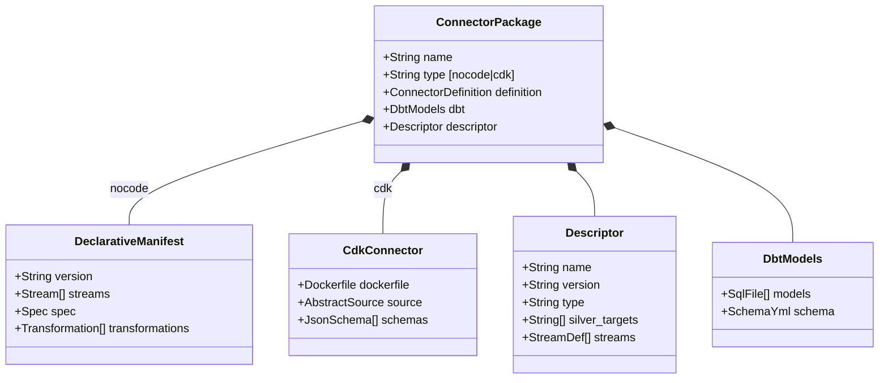
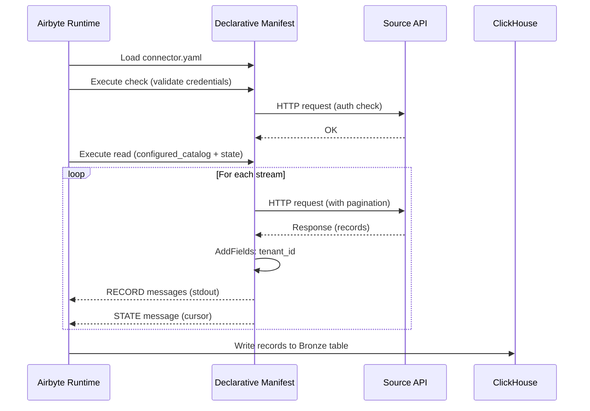
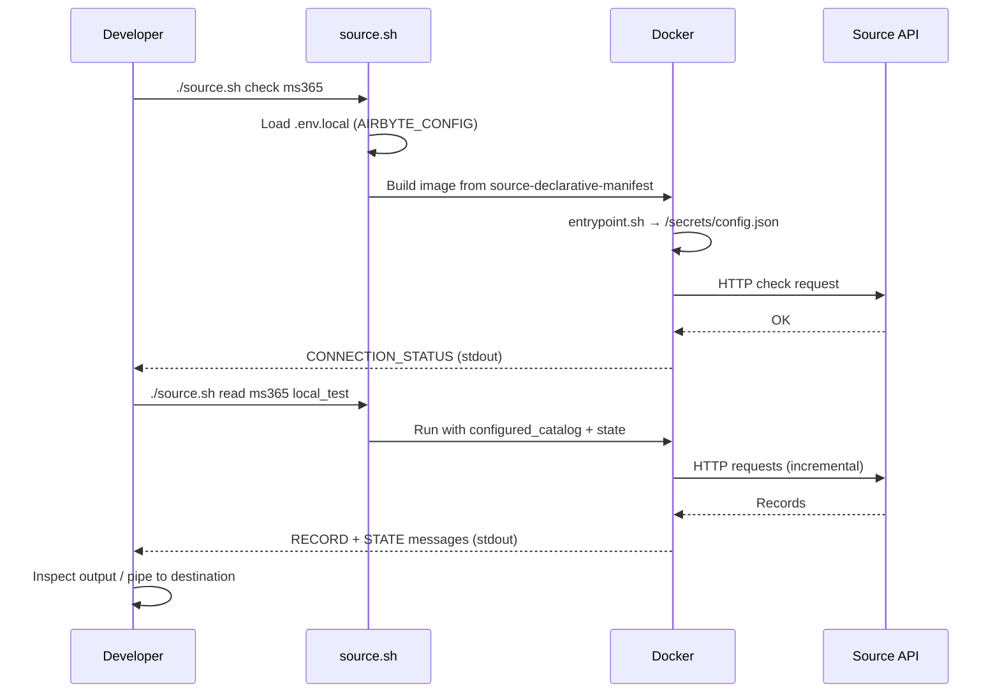

# DESIGN — Airbyte Connector Development

<!-- toc -->

- [1. Architecture Overview](#1-architecture-overview)
  - [1.1 Architectural Vision](#11-architectural-vision)
  - [1.2 Architecture Drivers](#12-architecture-drivers)
  - [1.3 Architecture Layers](#13-architecture-layers)
- [2. Principles & Constraints](#2-principles--constraints)
  - [2.1 Design Principles](#21-design-principles)
  - [2.2 Constraints](#22-constraints)
- [3. Technical Architecture](#3-technical-architecture)
  - [3.1 Domain Model](#31-domain-model)
  - [3.2 Component Model](#32-component-model)
  - [3.3 API Contracts](#33-api-contracts)
  - [3.4 Internal Dependencies](#34-internal-dependencies)
  - [3.5 External Dependencies](#35-external-dependencies)
  - [3.6 Interactions & Sequences](#36-interactions--sequences)
  - [3.7 Database schemas & tables](#37-database-schemas--tables)
- [4. Connector Development Guide](#4-connector-development-guide)
  - [4.1 Connector Types Comparison](#41-connector-types-comparison)
  - [4.2 Connector Package Structure](#42-connector-package-structure)
  - [4.3 Declarative Manifest (Nocode)](#43-declarative-manifest-nocode)
  - [4.4 CDK Connector (Python)](#44-cdk-connector-python)
  - [4.5 Descriptor YAML Schema](#45-descriptor-yaml-schema)
  - [4.6 dbt Models (Bronze to Silver)](#46-dbt-models-bronze-to-silver)
- [5. Deployment & Debugging](#5-deployment--debugging)
  - [5.1 Production Registration](#51-production-registration)
  - [5.2 Local Development: Full Stack (Docker Compose)](#52-local-development-full-stack-docker-compose)
  - [5.3 Local Development: Ultra-Light (source.sh)](#53-local-development-ultra-light-sourcesh)
  - [5.4 Running dbt Locally](#54-running-dbt-locally)
- [6. Open Questions](#6-open-questions)
  - [OQ-ABC-01: Standard Fields Beyond tenant_id](#oq-abc-01-standard-fields-beyond-tenantid)
  - [OQ-ABC-02: Connector Package Versioning](#oq-abc-02-connector-package-versioning)
  - [OQ-ABC-03: CI/CD Pipeline for Connector Validation](#oq-abc-03-cicd-pipeline-for-connector-validation)
  - [OQ-ABC-04: Destination Configuration for Ultra-Light Mode](#oq-abc-04-destination-configuration-for-ultra-light-mode)
- [7. Traceability](#7-traceability)

<!-- /toc -->

## 1. Architecture Overview

### 1.1 Architectural Vision

This document describes how to develop, test, and deploy Airbyte connectors for the Insight platform. Two connector types are supported: **nocode** (Airbyte declarative YAML manifests) and **CDK** (Python connectors using Airbyte's Connector Development Kit). Both types are packaged as self-contained connector packages that include the connector definition, dbt models for Bronze-to-Silver transformation, and a descriptor YAML.

This document is the development guide for connector authors. For the overall ingestion architecture, see [Ingestion Layer DESIGN](../../ingestion/specs/DESIGN.md).

### 1.2 Architecture Drivers

#### Functional Drivers

| Requirement | Design Response |
|-------------|-----------------|
| `cpt-insightspec-fr-ing-nocode-connector` | Declarative manifest architecture — YAML-first connector definition with inline schemas, authentication, pagination, and incremental sync |
| `cpt-insightspec-fr-ing-cdk-connector` | Python CDK architecture — `AbstractSource` subclass with full programmatic control for complex extraction scenarios |
| `cpt-insightspec-fr-ing-tenant-id` | `tenant_id` injection patterns — `AddFields` transformation in manifests; explicit injection in CDK `parse_response()` |
| `cpt-insightspec-fr-ing-package-structure` | Connector package directory layout — `connector.yaml` + `descriptor.yaml` + `dbt/` in a single directory |
| `cpt-insightspec-fr-ing-incremental-sync` | Cursor-based sync patterns — `DatetimeBasedCursor` for datetime fields; `CursorPagination` for sequential tokens |

#### NFR Allocation

| NFR | Component | Verification |
|-----|-----------|-------------|
| `cpt-insightspec-nfr-ing-tenant-isolation` | `tenant_id` injection in manifest/CDK | Verify every emitted record contains `tenant_id` |
| `cpt-insightspec-nfr-ing-idempotency` | Primary key + cursor field in descriptor | Re-run sync; verify no duplicates after OPTIMIZE TABLE FINAL |

### 1.3 Architecture Layers

```
┌──────────────────────────────────────────────────────┐
│              CONNECTOR PACKAGE (monorepo)             │
│                                                      │
│  ┌────────────────────────────────────────────────┐  │
│  │  connector.yaml  OR  src/source_{name}/        │  │
│  │  (nocode manifest)    (CDK implementation)     │  │
│  └────────────────────────┬───────────────────────┘  │
│                           │                          │
│  ┌────────────────────────┴───────────────────────┐  │
│  │  descriptor.yaml                               │  │
│  │  name · type · silver_targets · streams        │  │
│  └────────────────────────────────────────────────┘  │
│                                                      │
│  ┌────────────────────────────────────────────────┐  │
│  │  dbt/                                          │  │
│  │  to_{domain}.sql · schema.yml                  │  │
│  └────────────────────────────────────────────────┘  │
└──────────────────────────────────────────────────────┘

                 RUNTIME EXECUTION
┌──────────────────────────────────────────────────────┐
│  Airbyte Runtime → Bronze (ClickHouse)               │
│  dbt-clickhouse  → Silver step 1 (ClickHouse)        │
└──────────────────────────────────────────────────────┘
```

## 2. Principles & Constraints

### 2.1 Design Principles

#### Declarative-First

- [ ] `p1` - **ID**: `cpt-insightspec-principle-abc-declarative-first`

Prefer nocode declarative manifests. Use CDK (Python) only when the declarative approach cannot express the required logic.

**Why**: Faster development, easier review, simpler maintenance.

#### Mandatory tenant_id

- [ ] `p1` - **ID**: `cpt-insightspec-principle-abc-tenant-id-mandatory`

Every record emitted by any connector MUST contain `tenant_id`. This is not optional — it is a platform invariant.

**Why**: All downstream layers depend on `tenant_id` for tenant isolation.

#### Self-Contained Package

- [ ] `p1` - **ID**: `cpt-insightspec-principle-abc-package-self-contained`

A connector package includes everything needed: connector definition + dbt models + descriptor.

**Why**: Enables independent development and testing.

#### Silver Targets Known at Design Time

- [ ] `p1` - **ID**: `cpt-insightspec-principle-abc-silver-targets-known`

The connector author declares which Silver tables the connector will populate in the descriptor YAML.

**Why**: Enables package validation and dependency tracking.

### 2.2 Constraints

#### Airbyte Protocol Compliance

- [ ] `p1` - **ID**: `cpt-insightspec-constraint-abc-airbyte-protocol`

All connectors MUST emit valid Airbyte Protocol messages (RECORD, STATE, LOG, etc.).

#### Monorepo Storage

- [ ] `p1` - **ID**: `cpt-insightspec-constraint-abc-monorepo`

All connector packages reside in the `src/ingestion/connectors/` directory of the project monorepo.

## 3. Technical Architecture

### 3.1 Domain Model



### 3.2 Component Model

#### Connector Package

- [ ] `p1` - **ID**: `cpt-insightspec-component-abc-package`

##### Why this component exists

Self-contained unit of connector functionality: extraction definition + transformation models + metadata descriptor. Enables connector authors to develop, test, and deploy connectors independently.

##### Responsibility scope

- Contains connector definition (nocode manifest or CDK code)
- Contains dbt models for Bronze-to-Silver transformation
- Contains descriptor YAML declaring capabilities (Silver targets, streams)
- Provides all artifacts needed for local testing and production deployment

##### Responsibility boundaries

- Does NOT manage Airbyte connection configuration (Terraform does)
- Does NOT define orchestration schedules (Kestra does)
- Does NOT manage credentials (Airbyte secret management does)

##### Related components (by ID)

- `cpt-insightspec-component-ing-airbyte` — Airbyte executes the connector at runtime
- `cpt-insightspec-component-ing-dbt` — dbt runs the package's transformation models
- `cpt-insightspec-component-ing-terraform` — Terraform creates connections using the connector

### 3.3 API Contracts

#### Airbyte Protocol

Connectors communicate via Airbyte Protocol v2 — structured JSON messages emitted to stdout:

| Message Type | Purpose |
|-------------|---------|
| `RECORD` | Data record with stream name, data payload (including `tenant_id`), and emitted_at timestamp |
| `STATE` | Incremental sync cursor for resumable extraction |
| `LOG` | Connector execution log messages |
| `TRACE` | Detailed execution tracing and error reporting |
| `CATALOG` | Stream schema discovery results (response to `discover` command) |
| `SPEC` | Connector specification — configuration schema (response to `spec` command) |

#### Connector Commands

| Command | Input | Output |
|---------|-------|--------|
| `spec` | None | SPEC message with `connectionSpecification` JSON schema |
| `check` | Config JSON | CONNECTION_STATUS message (succeeded/failed) |
| `discover` | Config JSON | CATALOG message with available streams and schemas |
| `read` | Config JSON + Configured Catalog + State | RECORD and STATE messages |

#### Descriptor YAML Contract

See [section 4.5](#45-descriptor-yaml-schema) for the full schema.

### 3.4 Internal Dependencies

| From | To | Mechanism |
|------|----|-----------|
| Connector Package | Airbyte Runtime | Airbyte Protocol (stdout JSON) |
| Connector Package dbt models | ClickHouse Bronze tables | SQL via dbt-clickhouse adapter |
| Descriptor YAML | Ingestion pipeline | Metadata for validation and dependency tracking |

### 3.5 External Dependencies

| Dependency | Version Constraint | Purpose |
|-----------|-------------------|---------|
| `airbyte/source-declarative-manifest` | Latest stable | Base Docker image for nocode connectors |
| Airbyte Python CDK (`airbyte-cdk`) | Latest stable | Python SDK for CDK connectors |
| `dbt-clickhouse` | Latest stable adapter | SQL transformations on ClickHouse |
| Docker | 20.10+ | Container runtime for local debugging |

### 3.6 Interactions & Sequences

#### Nocode Connector Execution

**ID**: `cpt-insightspec-seq-abc-nocode-execution`



#### Ultra-Light Local Debugging

**ID**: `cpt-insightspec-seq-abc-ultralight-debug`



### 3.7 Database schemas & tables

#### Bronze Tables (created by Airbyte destination)

Naming: Tables match Airbyte stream names directly (e.g., `email_activity`, `teams_activity`). Tables are created in a database namespace specified in the Airbyte connection settings (via Terraform).

Every Bronze table includes:

| Column | Type | Description |
|--------|------|-------------|
| `tenant_id` | String | Tenant isolation — injected by connector |
| `_airbyte_raw_id` | String | Airbyte deduplication key |
| `_airbyte_extracted_at` | DateTime64 | Extraction timestamp |
| Source-specific fields | Various | Preserved from source API response |

#### Silver Tables (created by dbt models)

Naming: `class_{domain}` (e.g., `class_comms_events`, `class_people`)

`tenant_id` MUST be preserved. Additional `source` column SHOULD identify the connector.

## 4. Connector Development Guide

### 4.1 Connector Types Comparison

| Aspect | Nocode (Declarative) | CDK (Python) |
|--------|---------------------|--------------|
| Definition format | YAML manifest (`connector.yaml`) | Python classes extending `AbstractSource` |
| Base image | `airbyte/source-declarative-manifest` | Custom Docker image |
| Use when | Standard REST/GraphQL APIs with common auth/pagination | Complex auth, multi-step extraction, binary data, custom logic |
| Development time | Hours | Days |
| `tenant_id` injection | `AddFields` transformation in manifest | Explicit in `parse_response()` method |
| Local debugging | `source.sh` (ultra-light) or Airbyte platform | `pytest` + `source.sh` or Airbyte platform |
| Registration | Airbyte API (upload manifest) | Airbyte API (Docker image reference) |

### 4.2 Connector Package Structure

```
src/ingestion/connectors/
  {class}/{source}/
    connector.yaml              # Nocode: Airbyte declarative manifest
    descriptor.yaml             # Package metadata (required for all types)
    dbt/
      to_{domain}.sql           # dbt model(s) transforming Bronze → Silver
      schema.yml                # Column documentation + dbt tests
    # CDK connector additionally:
    src/
      source_{source}/
        __init__.py
        source.py               # AbstractSource implementation
        schemas/                # JSON schemas for streams
          {stream}.json
      setup.py
      Dockerfile
```

### 4.3 Declarative Manifest (Nocode)

#### Manifest Structure

The declarative manifest (`connector.yaml`) follows Airbyte's low-code framework:

```yaml
version: "7.0.4"
type: DeclarativeSource
check:
  type: CheckStream
  stream_names: ["{primary_stream}"]
streams:
  - type: DeclarativeStream
    name: "{stream_name}"
    primary_key: ["{key_field}"]
    schema_loader:
      type: InlineSchemaLoader
      schema:
        type: object
        properties:
          tenant_id: { type: string }
          # ... source-specific fields
    retriever:
      type: SimpleRetriever
      requester:
        type: HttpRequester
        url_base: "https://api.example.com"
        path: "/v1/{endpoint}"
        authenticator:
          # auth configuration
        http_method: GET
      record_selector:
        type: RecordSelector
        extractor:
          type: DpathExtractor
          field_path: ["data"]
      paginator:
        # pagination configuration
    incremental_sync:
      type: DatetimeBasedCursor
      cursor_field: "{cursor_field}"
      datetime_format: "%Y-%m-%d"
      start_datetime:
        type: MinMaxDatetime
        datetime: "{{ config['start_date'] }}"
      step: P1D
    transformations:
      - type: AddFields
        fields:
          - path: [tenant_id]
            value: "{{ config['tenant_id'] }}"
spec:
  type: Spec
  connection_specification:
    type: object
    required: [tenant_id]
    properties:
      tenant_id:
        type: string
        title: Tenant ID
        description: Tenant isolation identifier
        order: 0
      # ... source-specific config
```

#### tenant_id Injection (Nocode)

Every manifest MUST include:

1. `tenant_id` in `spec.connection_specification.properties` as a required field
2. An `AddFields` transformation adding `tenant_id` to every record:

```yaml
transformations:
  - type: AddFields
    fields:
      - path: [tenant_id]
        value: "{{ config['tenant_id'] }}"
```

#### Authentication Patterns

- OAuth2 client credentials (MS365 Graph API — `SessionTokenAuthenticator` with `login_requester`)
- API key in header (`api_key` in config)
- Bearer token
- Basic auth (username/password)

#### Pagination Patterns

- Cursor-based (OData `@odata.nextLink`, `skiptoken`)
- Offset/limit (`offset` + `limit` parameters)
- Page number (`page` parameter)
- Link header (`Link: <url>; rel="next"`)

#### Incremental Sync Patterns

- `DatetimeBasedCursor` — cursor on datetime field with configurable step (e.g., `P1D`)
- `CursorPagination` — cursor on sequential ID or token

### 4.4 CDK Connector (Python)

#### When to Use CDK

Use CDK when the declarative manifest cannot express:

- Multi-step authentication flows (OAuth2 with custom token exchange)
- Requests that depend on results of previous requests (discover then fetch)
- Binary data extraction or processing
- Complex record transformation logic beyond `AddFields`
- Rate limiting with complex backoff strategies
- WebSocket or streaming data sources

#### Structure

```python
from airbyte_cdk.sources import AbstractSource
from airbyte_cdk.models import AirbyteStream

class Source{Name}(AbstractSource):
    def check_connection(self, logger, config) -> Tuple[bool, Optional[str]]:
        # Validate credentials and connectivity
        ...

    def streams(self, config) -> List[AirbyteStream]:
        tenant_id = config["tenant_id"]  # Required
        return [
            Stream1(tenant_id=tenant_id, ...),
            Stream2(tenant_id=tenant_id, ...),
        ]
```

#### tenant_id in CDK

Every stream MUST inject `tenant_id` into every record:

```python
class Stream1(HttpStream):
    def __init__(self, tenant_id: str, **kwargs):
        super().__init__(**kwargs)
        self.tenant_id = tenant_id

    def parse_response(self, response, **kwargs):
        for record in response.json()["data"]:
            record["tenant_id"] = self.tenant_id
            yield record
```

The `spec.json` MUST include `tenant_id` as a required property:

```json
{
  "connectionSpecification": {
    "required": ["tenant_id"],
    "properties": {
      "tenant_id": {
        "type": "string",
        "title": "Tenant ID",
        "order": 0
      }
    }
  }
}
```

#### Testing CDK Connectors

```bash
# Unit tests
cd src/ingestion/connectors/{class}/{source}/src
pytest tests/

# Integration test
python -m source_{source} check --config config.json
python -m source_{source} discover --config config.json
python -m source_{source} read --config config.json --catalog configured_catalog.json --state state.json
```

### 4.5 Descriptor YAML Schema

Every connector package MUST include `descriptor.yaml`:

```yaml
# Connector package descriptor
name: ms365                           # Unique connector name
version: "1.0"                        # Package version
type: nocode                          # "nocode" or "cdk"

# Silver layer targets this connector populates
silver_targets:
  - class_comms_events
  - class_people

# Stream definitions mapping to Bronze tables
streams:
  - name: email_activity              # Airbyte stream name
    bronze_table: email_activity      # ClickHouse Bronze table name
    primary_key: [unique]             # Deduplication key
    cursor_field: reportRefreshDate   # Incremental sync cursor
  - name: teams_activity
    bronze_table: teams_activity
    primary_key: [unique]
    cursor_field: reportRefreshDate
```

### 4.6 dbt Models (Bronze to Silver)

Each connector package includes dbt models in `dbt/`:

#### Model Structure

```sql
-- src/ingestion/connectors/collaboration/m365/dbt/to_comms_events.sql
{{ config(materialized='view') }}

SELECT
    tenant_id,
    e.userPrincipalName AS user_email,
    e.sendCount AS emails_sent,
    (COALESCE(t.privateChatMessageCount, 0) + COALESCE(t.teamChatMessageCount, 0)) AS messages_sent,
    CAST(e.reportRefreshDate AS Date) AS activity_date,
    'ms365' AS source
FROM {{ source('bronze', 'email_activity') }} e
JOIN {{ source('bronze', 'teams_activity') }} t
    ON e.userPrincipalName = t.userPrincipalName
    AND e.reportRefreshDate = t.reportRefreshDate
WHERE e.tenant_id = t.tenant_id
```

#### schema.yml

```yaml
version: 2

sources:
  - name: bronze
    schema: raw
    tables:
      - name: email_activity
      - name: teams_activity

models:
  - name: class_comms_events
    description: "Unified communication events from MS365"
    columns:
      - name: tenant_id
        description: "Tenant isolation field"
        tests:
          - not_null
      - name: user_email
        description: "User email (source-native identifier)"
      - name: activity_date
        description: "Date of activity"
        tests:
          - not_null
```

#### Key Rules

- `tenant_id` MUST be preserved in all Silver tables
- `tenant_id` MUST have a `not_null` dbt test
- Models SHOULD use `source()` references for Bronze tables
- Models SHOULD add a `source` column identifying the connector

## 5. Deployment & Debugging

### 5.1 Production Registration

#### Nocode Connectors

Upload manifest to Airbyte via API:

```bash
curl -X POST "$AIRBYTE_URL/api/public/v1/sources" \
  -H "Authorization: Bearer $TOKEN" \
  -d '{
    "workspaceId": "...",
    "name": "ms365",
    "definitionId": "SOURCE_DECLARATIVE_MANIFEST_DEF_ID",
    "configuration": {...}
  }'
```

#### CDK Connectors

1. Build Docker image: `docker build -t myorg/source-{name}:latest .`
2. Push to container registry
3. Register with Airbyte via API using the image reference

#### Connection Management

Connections are managed via Terraform, not through the Airbyte UI:

```bash
cd terraform/
terraform plan
terraform apply
```

### 5.2 Local Development: Full Stack (Docker Compose)

Full stack includes Airbyte, Kestra, ClickHouse, and dbt for end-to-end testing:

```yaml
# docker-compose.yml (simplified)
services:
  airbyte-server:
    image: airbyte/airbyte:latest
    ports: ["8000:8000"]
  clickhouse:
    image: clickhouse/clickhouse-server:latest
    ports: ["8123:8123", "9000:9000"]
  kestra:
    image: kestra/kestra:latest
    ports: ["8080:8080"]
```

Workflow:

1. `docker compose up` — start all services
2. Register connector with local Airbyte
3. Create connection via Airbyte UI or API
4. Trigger sync manually or via Kestra
5. Run `dbt run` against local ClickHouse
6. Verify Silver tables

### 5.3 Local Development: Ultra-Light (source.sh)

For rapid nocode connector iteration **without the full Airbyte platform**. Based on the existing prototype tooling in `monitor/insights_concept/airbyte_cli/`.

#### Prerequisites

- Docker installed and running
- Connector manifest (`connector.yaml`) written
- Credentials configured in `.env.local`

#### Directory Layout

```
src/ingestion/connectors/
  {class}/{source}/
    connector.yaml                    # Declarative manifest
    .env.local                        # Credentials (git-ignored)
    example.env.local                 # Template for credentials
    catalog.json                      # Full stream catalog (from discover)
    connections/
      {connection_name}/
        configured_catalog.json       # Which streams to sync
        state.json                    # Incremental sync state
```

#### Credentials File (.env.local)

```bash
AIRBYTE_CONFIG='{"tenant_id":"tenant-123","client_id":"...","client_secret":"...","azure_tenant_id":"..."}'
```

The `AIRBYTE_CONFIG` environment variable must be a valid JSON string containing all connector configuration fields, including `tenant_id`.

#### Commands

**Check** — Validate credentials and connectivity:

```bash
./source.sh check {connector}
```

Runs the connector's `check` command inside Docker. Returns success/failure and error message.

**Discover** — List available streams and their schemas:

```bash
./source.sh discover {connector}
```

Returns the full catalog (all available streams with field definitions). Save output to `catalog.json` for reference.

**Read** — Extract data incrementally:

```bash
./source.sh read {connector} {connection}
```

Reads data using the `configured_catalog.json` and `state.json` from `connections/{connection}/`. Outputs Airbyte Protocol JSON messages to stdout — one message per line.

#### How It Works

1. `source.sh` reads the connector manifest from `src/ingestion/connectors/{class}/{connector}/connector.yaml`
2. Loads credentials from the connector's `.env.local` (or connection-level `.env.local`)
3. Builds a minimal Docker image from `airbyte/source-declarative-manifest:latest` with a custom entrypoint
4. The entrypoint (`entrypoint.sh`) writes `AIRBYTE_CONFIG` to `/secrets/config.json` (tmpfs — not persisted to disk)
5. Docker runs the Airbyte source command (`check`, `discover`, or `read`)
6. Output streams to stdout as Airbyte Protocol JSON messages

The Dockerfile and entrypoint are minimal:

```dockerfile
ARG BASE_IMAGE=airbyte/source-declarative-manifest:latest
FROM ${BASE_IMAGE}
ARG AIRBYTE_COMMAND=source-declarative-manifest
ENV AIRBYTE_COMMAND=${AIRBYTE_COMMAND}

COPY entrypoint.sh /usr/local/bin/airbyte_entrypoint.sh
ENTRYPOINT ["/bin/sh", "/usr/local/bin/airbyte_entrypoint.sh"]
```

```sh
#!/usr/bin/env sh
set -eu
if [ -n "${AIRBYTE_CONFIG:-}" ]; then
  mkdir -p /secrets
  printf '%s' "$AIRBYTE_CONFIG" > /secrets/config.json
fi
command_name="${AIRBYTE_COMMAND:-source-declarative-manifest}"
exec "$command_name" "$@"
```

#### Piping to a Destination

For integration testing, pipe source output to a local destination:

```bash
./source.sh read ms365 local_test | \
  ./destination.sh postgres monitor _raw_ms365_test configured_catalog.json
```

The destination script:

- Reads Airbyte Protocol messages from stdin
- Parses `AIRBYTE_CONFIG` from its own `.env.local`
- Filters by message type (RECORD, STATE by default)
- Writes to the target database with the specified namespace/schema

#### State Management

After a successful read, capture the latest STATE message to update `state.json`:

```bash
./source.sh read ms365 local_test | tee output.jsonl | \
  grep '"type":"STATE"' | tail -1 | jq '.state' > src/ingestion/connectors/collaboration/m365/connections/local_test/state.json
```

This enables resumable incremental syncs in the ultra-light mode.

#### Example: MS365 Connector

```bash
# 1. Check credentials
./source.sh check ms365

# 2. Discover available streams
./source.sh discover ms365 > src/ingestion/connectors/collaboration/m365/catalog.json

# 3. Read email and teams activity (incremental)
./source.sh read ms365 monitor_postgres

# 4. Inspect output
cat output.jsonl | jq 'select(.type=="RECORD") | .record.data | keys'
# Should include: tenant_id, userPrincipalName, sendCount, reportRefreshDate, ...
```

### 5.4 Running dbt Locally

```bash
# Configure profiles.yml for local ClickHouse
# profiles.yml
# my_profile:
#   target: dev
#   outputs:
#     dev:
#       type: clickhouse
#       host: localhost
#       port: 8123
#       schema: silver
#       user: default

# Run specific connector models
dbt run --select connectors.ms365

# Run all Bronze-to-Silver models
dbt run --select tag:bronze_to_silver

# Test tenant_id not null
dbt test --select connectors.ms365
```

## 6. Open Questions

### OQ-ABC-01: Standard Fields Beyond tenant_id

Should all connectors emit additional standard fields beyond `tenant_id`? Candidates: `_extracted_at` (extraction timestamp), `_source` (connector name). Trade-off: more consistency vs. more boilerplate in manifests.

### OQ-ABC-02: Connector Package Versioning

How are connector packages versioned within the monorepo? Options: Git tag, `descriptor.yaml` version field, or no explicit versioning (latest commit = current version).

### OQ-ABC-03: CI/CD Pipeline for Connector Validation

Should there be an automated CI pipeline that validates connector packages (manifest syntax, descriptor completeness, dbt model compilation, `tenant_id` presence)?

### OQ-ABC-04: Destination Configuration for Ultra-Light Mode

The current `destination.sh` supports PostgreSQL. Need to add ClickHouse destination support for local testing that matches production storage.

## 7. Traceability

| Design Element | PRD Requirement |
|---------------|----------------|
| Declarative manifest architecture | `cpt-insightspec-fr-ing-nocode-connector` |
| CDK connector architecture | `cpt-insightspec-fr-ing-cdk-connector` |
| `tenant_id` injection patterns | `cpt-insightspec-fr-ing-tenant-id` |
| Connector package structure | `cpt-insightspec-fr-ing-package-structure` |
| Monorepo storage | `cpt-insightspec-fr-ing-package-monorepo` |
| Incremental sync patterns | `cpt-insightspec-fr-ing-incremental-sync` |
| Secret management in `.env.local` | `cpt-insightspec-fr-ing-secret-management` |
| Airbyte API registration | `cpt-insightspec-fr-ing-airbyte-api-custom` |

- **Ingestion PRD**: [../../ingestion/specs/PRD.md](../../ingestion/specs/PRD.md)
- **Ingestion DESIGN**: [../../ingestion/specs/DESIGN.md](../../ingestion/specs/DESIGN.md)
- **Prototype source.sh**: Based on existing tooling in `monitor/insights_concept/airbyte_cli/`
