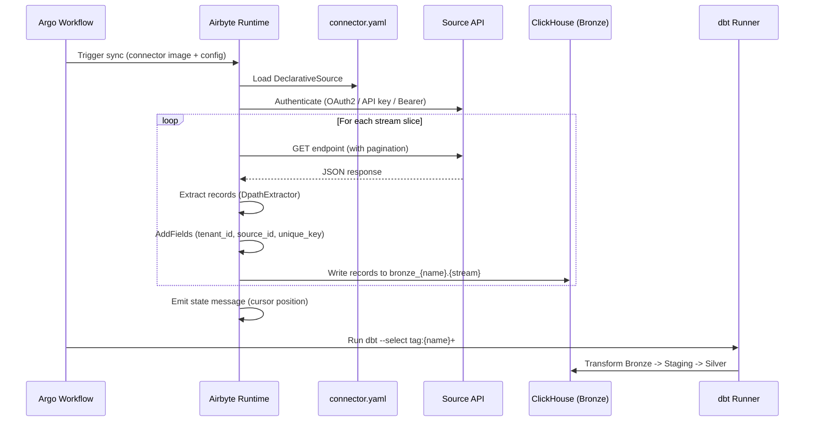
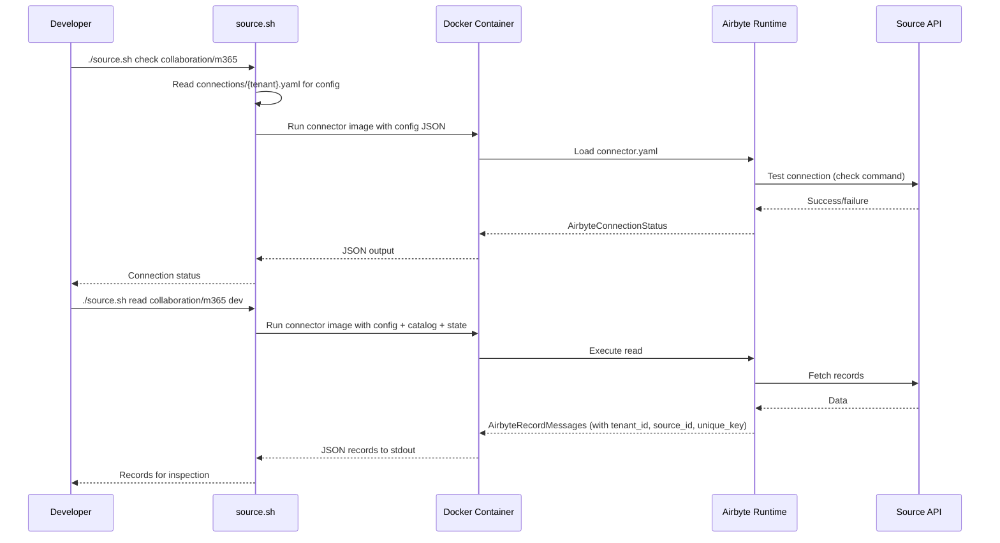

# Technical Design -- Insight Connector Specification

- [ ] `p3` - **ID**: `cpt-insightspec-design-cn`

<!-- toc -->

- [1. Architecture Overview](#1-architecture-overview)
  - [1.1 Architectural Vision](#11-architectural-vision)
  - [1.2 Architecture Drivers](#12-architecture-drivers)
  - [1.3 Architecture Layers](#13-architecture-layers)
- [2. Principles & Constraints](#2-principles--constraints)
  - [2.1 Design Principles](#21-design-principles)
  - [2.2 Constraints](#22-constraints)
- [3. Technical Architecture](#3-technical-architecture)
  - [3.1 Domain Model](#31-domain-model)
  - [3.2 Component Model](#32-component-model)
  - [3.3 API Contracts](#33-api-contracts)
  - [3.4 Internal Dependencies](#34-internal-dependencies)
  - [3.5 External Dependencies](#35-external-dependencies)
  - [3.6 Interactions & Sequences](#36-interactions--sequences)
  - [3.7 Database schemas & tables](#37-database-schemas--tables)
- [4. Connector Development Guide](#4-connector-development-guide)
  - [4.1 Config Field Naming Rules](#41-config-field-naming-rules)
  - [4.2 Manifest Structure](#42-manifest-structure)
  - [4.3 Authentication Patterns](#43-authentication-patterns)
  - [4.4 Incremental Sync Patterns](#44-incremental-sync-patterns)
  - [4.5 Pagination Patterns](#45-pagination-patterns)
  - [4.6 AddFields (tenant_id + source_id + unique_key)](#46-addfields-tenantid--sourceid--uniquekey)
  - [4.7 Schema Rules](#47-schema-rules)
  - [4.8 Raw Data Field for Configurable Streams](#48-raw-data-field-for-configurable-streams)
  - [4.9 CDK Connector Guide](#49-cdk-connector-guide)
  - [4.10 Descriptor YAML Schema](#410-descriptor-yaml-schema)
  - [4.11 Connector Package Structure](#411-connector-package-structure)
  - [4.12 Development Workflow](#412-development-workflow)
  - [4.13 dbt Model Rules](#413-dbt-model-rules)
  - [4.14 Common Pitfalls](#414-common-pitfalls)
  - [4.15 Deployment Pitfalls](#415-deployment-pitfalls)
  - [4.16 Correct Deployment Order](#416-correct-deployment-order)
- [5. Traceability](#5-traceability)
  - [Requirement Coverage](#requirement-coverage)

<!-- /toc -->

## 1. Architecture Overview

### 1.1 Architectural Vision

The Insight Connector architecture implements a self-contained pipeline package model where each connector encapsulates everything needed to extract data from an external source and deliver it through the Medallion Architecture (Bronze, Staging, Silver). A connector package bundles the extraction component (Airbyte manifest or CDK source), a descriptor declaring orchestration metadata, dbt transformation models, and a credentials template. This packaging approach ensures that adding a new data source requires no changes to the platform framework -- only a new self-contained package.

The architecture strongly favors declarative connectors (nocode) implemented as Airbyte low-code YAML manifests. CDK (Python) connectors are reserved for cases where the declarative approach cannot express the required logic. This decision minimizes maintenance burden, reduces the skill floor for connector authorship, and ensures that structural integration concerns (authentication, pagination, rate limiting) are handled uniformly by the Airbyte framework rather than re-implemented per connector.

Every record flowing through the system carries mandatory `tenant_id` and `source_id` fields, injected at extraction time, which propagate through all layers. Combined with a composite `unique_key` that includes both identifiers, this ensures tenant isolation and cross-instance deduplication from Bronze through Silver, without relying on downstream logic to enforce these invariants.

### 1.2 Architecture Drivers

Requirements that significantly influence architecture decisions.

**ADRs**: See [ADR/0001-connector-integration-protocol.md](ADR/0001-connector-integration-protocol.md)

#### Functional Drivers

| Requirement | Design Response |
|-------------|------------------|
| `cpt-insightspec-fr-cn-common-concerns` | Airbyte framework handles auth, pagination, rate limiting; connectors declare behavior, not implement it |
| `cpt-insightspec-fr-cn-connector-spec` | Declarative YAML manifests (`connector.yaml`) describe extraction behavior without code |
| `cpt-insightspec-fr-cn-incremental-sync` | `DatetimeBasedCursor` with computed dates; cursor stored externally by Airbyte |
| `cpt-insightspec-fr-cn-idempotent-extraction` | `unique_key` with `tenant_id` + `source_id` prefix; `ReplacingMergeTree` deduplication in Bronze |
| `cpt-insightspec-fr-cn-raw-storage` | Per-connector Bronze namespace (`bronze_{name}`) preserving source-native schema |
| `cpt-insightspec-fr-cn-standard-metadata` | `AddFields` transformation injects `tenant_id`, `source_id`, `unique_key` on every record |
| `cpt-insightspec-fr-cn-custom-fields` | `additionalProperties: true` on all schemas; `raw_data` field for tenant-configurable streams |
| `cpt-insightspec-fr-cn-cross-source-unification` | dbt Silver models with `union_by_tag` combining connectors into canonical `class_{domain}` tables |
| `cpt-insightspec-fr-cn-data-lineage` | Silver records retain `tenant_id`, `source_id`, and `source` column tracing back to Bronze |
| `cpt-insightspec-fr-cn-connector-sdk` | CDK connector path for complex extraction; published SDK contract with `AbstractSource` |

#### NFR Allocation

| NFR | Summary | Allocated To | Design Response | Verification |
|---|---|---|---|---|
| Idempotency | Re-running with the same cursor produces identical results | `ConnectorFramework` | Cursor read at start; written only on success; Bronze table uses `ReplacingMergeTree(_version)` | Run same cursor twice; verify row count unchanged |
| Error isolation | One connector failure does not affect others | `OrchestratorAdapter` | Each connector runs in an isolated container; failures logged to `collection_runs`; no shared state | Kill one connector mid-run; verify others continue |
| Rate limit compliance | Never exceed source system declared limits | `ConnectorFramework` | Exponential backoff with jitter on 429/503; connector declares `rate_limiting` params in manifest | Load test against mock source returning 429 |
| Resource quotas | Bounded resource per run | Connector execution context | K8s resource limits on Argo workflow pods | Pod resource metrics |
| Schema stability | Connector schema changes don't silently break downstream | `ConnectorManifest` | Semantic versioning on `connector.yaml`; schema changes require a version bump | Schema change without version bump fails validation |
| Semantic propagation | New fields reach dashboard metric catalog without manual work | `DataCatalogSync` | Schema sync triggered on connector registration; semantic metadata auto-populates Semantic Dictionary | Register new connector; verify metric appears in catalog |
| Privacy by default | Content fields (message text, email body) never collected | `ConnectorManifest` + SDK | Fields must be explicitly declared to be collected; no wildcard field capture | Audit connector manifest; confirm no undeclared content fields present in Bronze |
| Data freshness | Bronze data within 2x schedule | Orchestrator + connector | Cron schedule in `descriptor.yaml`; consecutive failure alerting | Freshness monitoring per connector |
| Observability | Health check + structured metrics | Connector execution context | Airbyte protocol status messages; Argo workflow status | Health endpoint + metric export |

#### Architecture Decision Records

| ADR | Decision | Status |
|-----|----------|--------|
| `cpt-insightspec-adr-connector-integration-protocol` | Use stdout JSON-per-line protocol for connector-to-system data delivery — language-agnostic, runner-mediated, backend-enforced integrity | proposed |
| `cpt-insightspec-adr-connector-responsibility-scope` | Connectors are thin extractors (Airbyte-style) — extract raw data to stdout, no DB dependencies, dbt handles all transformations | proposed |
| `cpt-insightspec-adr-connector-message-protocol` | Airbyte-compatible message protocol subset (RECORD, STATE, LOG, CATALOG, SPEC, CONNECTION_STATUS) with Insight extensions (METRIC, PROGRESS) | proposed |

### 1.3 Architecture Layers

```
+---------------------------------------------------------------------+
|                        Source APIs (External)                        |
|  M365 Graph  |  GitHub  |  Jira  |  BambooHR  |  GitLab  |  ...    |
+------+--------+----+-----+---+----+-----+------+----+-----+---------+
       |             |         |           |           |
       v             v         v           v           v
+---------------------------------------------------------------------+
|                   Extraction Layer (Airbyte)                        |
|  Nocode Manifests (connector.yaml)  |  CDK Sources (Python)        |
|  AddFields: tenant_id, source_id, unique_key                       |
+------+--------------------------------------------------------------+
       |
       v
+---------------------------------------------------------------------+
|                   Bronze Layer (ClickHouse)                         |
|  bronze_m365.*  |  bronze_github.*  |  bronze_jira.*  |  ...       |
|  ReplacingMergeTree, per-connector namespace                        |
+------+--------------------------------------------------------------+
       |
       v
+---------------------------------------------------------------------+
|                   Staging Layer (dbt)                                |
|  staging.m365__comms_events  |  staging.github__commits  |  ...    |
|  Per-connector incremental models, dedup + rename                   |
+------+--------------------------------------------------------------+
       |
       v
+---------------------------------------------------------------------+
|                   Silver Layer (dbt)                                 |
|  silver.class_comms_events  |  silver.class_commits  |  ...        |
|  union_by_tag across connectors, canonical domain schemas           |
+---------------------------------------------------------------------+
```

- [ ] `p3` - **ID**: `cpt-insightspec-tech-cn-layers`

| Layer | Responsibility | Technology |
|-------|---------------|------------|
| Extraction | Pull data from source APIs, inject mandatory fields | Airbyte (nocode manifest / CDK) |
| Bronze | Store raw source data with source-native schema | ClickHouse (ReplacingMergeTree) |
| Staging | Per-connector dedup, rename, incremental processing | dbt-clickhouse |
| Silver | Cross-source unification into canonical domain schemas | dbt-clickhouse (union_by_tag) |

## 2. Principles & Constraints

### 2.1 Design Principles

#### Declarative-First

- [ ] `p2` - **ID**: `cpt-insightspec-principle-cn-declarative-first`

Connectors MUST be implemented as declarative YAML manifests (nocode) unless the Airbyte low-code framework cannot express the required extraction logic. CDK (Python) connectors are used only when declarative approach is insufficient -- for example, multi-step authentication, binary data, complex transformations, or request chaining. This minimizes maintenance burden and ensures consistent behavior across connectors.

**ADRs**: See [ADR/0001-connector-integration-protocol.md](ADR/0001-connector-integration-protocol.md)

#### Mandatory tenant_id and source_id

- [ ] `p2` - **ID**: `cpt-insightspec-principle-cn-mandatory-tenant-source`

Every record emitted by every connector MUST contain `tenant_id` (from `insight_tenant_id` config) and `source_id` (from `insight_source_id` config). These fields are injected at extraction time via `AddFields` (nocode) or `parse_response` (CDK) and propagate unchanged through Bronze, Staging, and Silver. This ensures tenant isolation and multi-instance disambiguation are enforced at the data layer, not by downstream logic.

**ADRs**: See [ADR/0001-connector-integration-protocol.md](ADR/0001-connector-integration-protocol.md)

#### Self-Contained Package

- [ ] `p2` - **ID**: `cpt-insightspec-principle-cn-self-contained-package`

Each connector is a complete, self-contained package containing the extraction component, descriptor, dbt models, and credentials template. Adding a new data source requires only adding a new package directory -- no changes to the framework, orchestrator, or shared code. This enables independent development, testing, and deployment of connectors.

#### Config Field Prefixes

- [ ] `p2` - **ID**: `cpt-insightspec-principle-cn-config-prefixes`

Config fields use source-specific prefixes (`insight_*`, `azure_*`, `github_*`, `jira_*`, `bamboohr_*`) to prevent collisions. The platform fields `insight_tenant_id` and `insight_source_id` are always required. Source-specific fields use a prefix matching the source name. Bare field names (`tenant_id`, `client_id`) are never used in config.

#### Schema from Real Data

- [ ] `p2` - **ID**: `cpt-insightspec-principle-cn-schema-from-real-data`

Schemas MUST be generated from real API responses using `generate-schema.sh`, not invented manually. Generated schemas are used as the basis for `InlineSchemaLoader` definitions in the manifest. This prevents schema drift and ensures the connector accurately reflects the source API structure.

### 2.2 Constraints

#### Airbyte Protocol Compliance

- [ ] `p2` - **ID**: `cpt-insightspec-constraint-cn-airbyte-protocol`

All connectors MUST comply with the Airbyte protocol. Nocode connectors use Airbyte's declarative manifest format (`DeclarativeSource`). CDK connectors extend `AbstractSource`. Both types respond to standard commands: `spec`, `check`, `discover`, `read`. The Airbyte protocol defines the wire format, message types, and state management contract.

**ADRs**: See [ADR/0001-connector-integration-protocol.md](ADR/0001-connector-integration-protocol.md)

#### Monorepo Storage

- [ ] `p2` - **ID**: `cpt-insightspec-constraint-cn-monorepo`

All connector packages are stored in a single monorepo under `connectors/{category}/{name}/`. This enables shared tooling, consistent testing workflows, and atomic cross-connector changes. Connector packages must not have cross-dependencies -- each package is independently deployable.

#### Unique Key Includes tenant_id and source_id

- [ ] `p2` - **ID**: `cpt-insightspec-constraint-cn-unique-key-composite`

The `unique_key` field MUST include `tenant_id` and `source_id` as the leading components of the composite key. Pattern: `{tenant_id}-{source_id}-{natural_key_fields}`. This prevents collisions between tenants and between multiple instances of the same connector, ensuring deduplication correctness across the entire platform.

## 3. Technical Architecture

### 3.1 Domain Model

**Technology**: YAML + Python (Airbyte CDK)

**Location**: [`connectors/`](../../../../connectors/)

**Core Entities**:

| Entity | Description | Schema |
|--------|-------------|--------|
| InsightConnector | Complete pipeline package: extraction + descriptor + dbt + credentials | `connectors/{category}/{name}/` |
| AirbyteManifest | Declarative extraction definition (nocode) | `connector.yaml` |
| Descriptor | Orchestration metadata: schedule, streams, Silver targets | `descriptor.yaml` |
| DbtModels | Bronze-to-Staging-to-Silver transformation models | `dbt/*.sql` + `dbt/schema.yml` |
| TenantConfig | Per-tenant credentials and connection settings | `connections/{tenant}.yaml` |

**Relationships**:
- InsightConnector contains exactly one AirbyteManifest (nocode) or one CDK Source (Python)
- InsightConnector contains exactly one Descriptor
- InsightConnector contains one or more DbtModels
- Descriptor references AirbyteManifest streams by name
- TenantConfig provides runtime credentials to InsightConnector

### 3.2 Component Model

#### Connector Package

- [ ] `p2` - **ID**: `cpt-insightspec-component-cn-connector-package`

##### Why this component exists

Encapsulates all artifacts needed for a single data source integration into a deployable unit, enabling independent development, testing, and versioning of connectors without framework changes.

##### Responsibility scope

Owns the complete lifecycle of data extraction from one source type: manifest/source definition, orchestration metadata (descriptor), Bronze-to-Silver transformations (dbt models), and credential documentation (example YAML).

##### Responsibility boundaries

Does NOT own orchestration scheduling (Argo Workflows), credential storage (connections/{tenant}.yaml is gitignored), or Silver-layer union models (shared dbt models). Does NOT implement framework-level concerns (auth protocols, pagination engines).

##### Related components (by ID)

- `cpt-insightspec-component-cn-airbyte-manifest` -- contains (nocode variant)
- `cpt-insightspec-component-cn-cdk-connector` -- contains (CDK variant)
- `cpt-insightspec-component-cn-dbt-models` -- contains
- `cpt-insightspec-component-cn-descriptor` -- contains

#### Airbyte Manifest (Nocode)

- [ ] `p2` - **ID**: `cpt-insightspec-component-cn-airbyte-manifest`

##### Why this component exists

Provides a declarative, zero-code approach to defining data extraction logic, reducing connector development to YAML configuration and eliminating the need for custom Python code in the common case.

##### Responsibility scope

Declares the complete extraction behavior: API endpoints, authentication, pagination, record selection, field transformations (AddFields for tenant_id, source_id, unique_key), incremental sync cursors, and inline schemas.

##### Responsibility boundaries

Does NOT handle orchestration, dbt transformations, or credential management. Relies on the Airbyte runtime to execute the declared behavior. Does NOT define Bronze table structure (determined by schema + Airbyte destination).

##### Related components (by ID)

- `cpt-insightspec-component-cn-connector-package` -- contained by
- `cpt-insightspec-component-cn-descriptor` -- streams referenced by descriptor

#### CDK Connector (Python)

- [ ] `p2` - **ID**: `cpt-insightspec-component-cn-cdk-connector`

##### Why this component exists

Handles extraction scenarios that exceed the declarative manifest capabilities: multi-step authentication, binary data processing, request chaining, complex backoff strategies, or WebSocket sources.

##### Responsibility scope

Implements `AbstractSource` with `check_connection` and `streams` methods. Each stream injects `tenant_id`, `source_id`, and `unique_key` in `parse_response`. Provides `spec.json` with `insight_tenant_id` and `insight_source_id` as required properties.

##### Responsibility boundaries

Does NOT duplicate framework concerns (basic auth, pagination) that the CDK already provides. Does NOT own orchestration or dbt transformations. Must comply with the same Airbyte protocol contract as nocode connectors.

##### Related components (by ID)

- `cpt-insightspec-component-cn-connector-package` -- contained by
- `cpt-insightspec-component-cn-descriptor` -- streams referenced by descriptor

#### dbt Models

- [ ] `p2` - **ID**: `cpt-insightspec-component-cn-dbt-models`

##### Why this component exists

Transforms raw Bronze data into Staging (per-connector dedup and rename) and contributes to Silver (cross-source union into canonical domain schemas). Separates semantic mapping from extraction logic.

##### Responsibility scope

Per-connector models in `dbt/` transform Bronze tables to Staging format. Tags (`tag:{connector_name}`) enable selective execution. Schema definitions (`schema.yml`) declare source references, column documentation, and tests (e.g., `not_null` on `tenant_id`).

##### Responsibility boundaries

Does NOT own Silver union models (those live in shared `dbt/silver/` using `union_by_tag`). Does NOT modify Bronze data. Does NOT handle identity resolution (Silver retains source-native user IDs).

##### Related components (by ID)

- `cpt-insightspec-component-cn-connector-package` -- contained by
- `cpt-insightspec-component-cn-descriptor` -- `dbt_select` references model tags

#### Descriptor YAML

- [ ] `p2` - **ID**: `cpt-insightspec-component-cn-descriptor`

##### Why this component exists

Provides the orchestration and connection metadata that links the extraction component to the scheduling system and downstream transformations, acting as the single source of truth for how this connector operates within the platform.

##### Responsibility scope

Declares: connector name and version, cron schedule, workflow template, `dbt_select` expression, and connection namespace (`bronze_{name}`). Does NOT declare streams or Silver targets -- stream definitions and sync modes are owned by the Airbyte connector (manifest or CDK source) and discovered automatically via `airbyte discover`.

##### Responsibility boundaries

Does NOT contain extraction logic (that is in the manifest/CDK source). Does NOT contain credentials (those are in `connections/{tenant}.yaml`). Does NOT define dbt model SQL (that is in `dbt/`).

##### Related components (by ID)

- `cpt-insightspec-component-cn-connector-package` -- contained by
- `cpt-insightspec-component-cn-airbyte-manifest` -- references streams from
- `cpt-insightspec-component-cn-dbt-models` -- references via `dbt_select`

### 3.3 API Contracts

- [ ] `p2` - **ID**: `cpt-insightspec-interface-cn-airbyte-protocol`

- **Contracts**: `cpt-insightspec-contract-ing-airbyte-protocol`
- **Technology**: Airbyte Protocol (JSON over stdout/stdin)
- **Location**: Defined by Airbyte CDK and declarative framework

**Endpoints Overview** (connector commands):

| Method | Path | Description | Stability |
|--------|------|-------------|-----------|
| `spec` | N/A (CLI command) | Returns connector specification (config schema) | stable |
| `check` | N/A (CLI command) | Validates credentials and connectivity | stable |
| `discover` | N/A (CLI command) | Returns available streams and their schemas | stable |
| `read` | N/A (CLI command) | Extracts records from configured streams | stable |

All connectors (nocode and CDK) respond to these four commands. The Airbyte protocol defines message types: `AirbyteMessage`, `AirbyteCatalog`, `AirbyteRecordMessage`, `AirbyteStateMessage`.

### 3.4 Internal Dependencies

| Dependency Module | Interface Used | Purpose |
|-------------------|----------------|----------|
| Connector Orchestrator (Argo Workflows) | Workflow templates + cron triggers | Schedules and executes connector sync runs |
| dbt Silver union models | `union_by_tag` macro | Combines per-connector Staging output into canonical Silver tables |
| `apply-connections.sh` | Shell script reading `descriptor.yaml` | Provisions Airbyte connections from descriptor metadata |
| `generate-schema.sh` | Shell script | Generates JSON schemas from real API responses |
| `generate-catalog.sh` | Shell script | Generates configured catalog for local testing |

### 3.5 External Dependencies

#### Airbyte

| Dependency Module | Interface Used | Purpose |
|-------------------|---------------|---------|
| Airbyte CDK | Python SDK (`airbyte_cdk`) | Runtime for CDK connectors; base classes (`AbstractSource`, `HttpStream`) |
| Airbyte Declarative Framework | YAML manifest schema (`DeclarativeSource`) | Runtime for nocode connectors; handles auth, pagination, cursors |
| Airbyte Destination (ClickHouse) | Airbyte protocol | Writes extracted records to Bronze ClickHouse tables |

#### dbt-clickhouse

| Dependency Module | Interface Used | Purpose |
|-------------------|---------------|---------|
| dbt-clickhouse adapter | dbt CLI | Executes Bronze-to-Staging-to-Silver transformations against ClickHouse |

#### Docker

| Dependency Module | Interface Used | Purpose |
|-------------------|---------------|---------|
| Docker | Container runtime | Runs Airbyte connectors in isolated containers for local testing and production |

### 3.6 Interactions & Sequences

#### Nocode Connector Execution

**ID**: `cpt-insightspec-seq-cn-nocode-execution`

**Use cases**: `cpt-insightspec-usecase-cn-configure-monitor`

**Actors**: `cpt-insightspec-actor-cn-source-api`, `cpt-insightspec-actor-cn-workspace-admin`



**Description**: The orchestrator triggers the connector image with tenant config. The Airbyte runtime loads the declarative manifest, authenticates, iterates over stream slices with pagination, injects mandatory fields, and writes to Bronze. After extraction, dbt transforms the data through Staging to Silver.

#### Local Debugging with source.sh

**ID**: `cpt-insightspec-seq-cn-local-debug`

**Use cases**: `cpt-insightspec-usecase-cn-develop-connector`

**Actors**: `cpt-insightspec-actor-cn-platform-engineer`



**Description**: The developer uses `source.sh` to run connector commands locally in Docker. The script reads credentials from `connections/{tenant}.yaml`, passes them as config JSON to the containerized Airbyte runtime, and outputs results to stdout for inspection.

### 3.7 Database schemas & tables

- [ ] `p3` - **ID**: `cpt-insightspec-db-cn-medallion`

#### Bronze Tables

**ID**: `cpt-insightspec-dbtable-cn-bronze`

Bronze tables live in a per-connector namespace: `bronze_{connector_name}` (e.g., `bronze_m365`). Table names match Airbyte stream names.

**Schema** (example: `bronze_m365.email_activity`):

| Column | Type | Description |
|--------|------|-------------|
| `tenant_id` | String | Tenant isolation identifier, injected by `AddFields` |
| `source_id` | String | Connector instance identifier, injected by `AddFields` |
| `unique_key` | String | Composite dedup key: `{tenant_id}-{source_id}-{natural_key}` |
| `_airbyte_raw_id` | String | Airbyte deduplication key (auto-generated) |
| `_airbyte_extracted_at` | DateTime64 | Extraction timestamp (auto-generated) |
| `reportRefreshDate` | String | Source-specific: report date |
| `userPrincipalName` | Nullable(String) | Source-specific: user email |
| `sendCount` | Nullable(Int64) | Source-specific: emails sent count |
| *(additional source fields)* | Various | Preserved from source API response |

**PK**: `unique_key`

**Constraints**: `tenant_id` NOT NULL, `source_id` NOT NULL, `unique_key` NOT NULL

**Additional info**: Engine = `ReplacingMergeTree` with epoch ms versioning for deduplication.

#### Staging Tables

**ID**: `cpt-insightspec-dbtable-cn-staging`

Staging tables live in the `staging` namespace with a per-connector prefix: `staging.{connector}__{domain_table}` (e.g., `staging.m365__comms_events`). These are per-connector incremental models that dedup and rename Bronze fields for Silver consumption.

**Schema** (example: `staging.m365__comms_events`):

| Column | Type | Description |
|--------|------|-------------|
| `tenant_id` | String | Preserved from Bronze |
| `source_id` | String | Preserved from Bronze |
| `user_email` | String | Renamed from `userPrincipalName` |
| `emails_sent` | Int64 | From `sendCount` |
| `messages_sent` | Int64 | Computed from Teams chat counts |
| `activity_date` | Date | Cast from `reportRefreshDate` |
| `source` | String | Literal connector name (e.g., `'m365'`) |

**PK**: Inherited from Bronze `unique_key` via dedup

**Constraints**: `tenant_id` NOT NULL, `source_id` NOT NULL, `activity_date` NOT NULL

#### Silver Tables

**ID**: `cpt-insightspec-dbtable-cn-silver`

Silver tables live in the `silver` namespace with canonical domain names: `silver.class_{domain}` (e.g., `silver.class_comms_events`). These are union models combining Staging output from multiple connectors via `union_by_tag`.

**Schema** (example: `silver.class_comms_events`):

| Column | Type | Description |
|--------|------|-------------|
| `tenant_id` | String | Preserved from Staging |
| `source_id` | String | Preserved from Staging |
| `user_email` | String | Canonical user identifier (source-native) |
| `emails_sent` | Nullable(Int64) | Email send count (NULL if source does not provide) |
| `messages_sent` | Nullable(Int64) | Chat/message count (NULL if source does not provide) |
| `activity_date` | Date | Activity date |
| `source` | String | Originating connector (e.g., `'m365'`, `'slack'`) |

**PK**: `tenant_id` + `source_id` + `user_email` + `activity_date` + `source`

**Constraints**: `tenant_id` NOT NULL, `source_id` NOT NULL, `activity_date` NOT NULL

**Additional info**: Silver retains source-native user identifiers. Identity resolution (`person_id`) is applied at query time or in Gold, not in Silver.

#### Mandatory Column Definitions

All layers enforce these columns:

| Column | Injected At | Pattern |
|--------|-------------|---------|
| `tenant_id` | Extraction (AddFields / parse_response) | `{{ config['insight_tenant_id'] }}` |
| `source_id` | Extraction (AddFields / parse_response) | `{{ config['insight_source_id'] }}` |
| `unique_key` | Extraction (AddFields / parse_response) | `{{ config['insight_tenant_id'] }}-{{ config['insight_source_id'] }}-{{ record['field1'] }}-{{ record['field2'] }}` |

## 4. Connector Development Guide

### 4.1 Config Field Naming Rules

Config fields use prefixes to prevent collisions:

| Prefix | Usage | Examples |
|--------|-------|----------|
| `insight_*` | Platform fields (mandatory) | `insight_tenant_id`, `insight_source_id` |
| `azure_*` | Azure / M365 credentials | `azure_tenant_id`, `azure_client_id`, `azure_client_secret` |
| `github_*` | GitHub credentials | `github_token`, `github_org` |
| `jira_*` | Jira credentials | `jira_domain`, `jira_api_token`, `jira_email` |
| `bamboohr_*` | BambooHR credentials | `bamboohr_api_key`, `bamboohr_subdomain` |

Rules:

- `insight_tenant_id` and `insight_source_id` are ALWAYS required in `spec.connection_specification`
- Source-specific fields use a prefix matching the source name
- NEVER use bare `tenant_id`, `client_id`, or `source_id` in config -- always prefixed
- Secrets use `airbyte_secret: true` in the spec

Spec example:

```yaml
spec:
  type: Spec
  connection_specification:
    type: object
    $schema: http://json-schema.org/draft-07/schema#
    required:
      - insight_tenant_id
      - insight_source_id
      - azure_client_id
      - azure_client_secret
      - azure_tenant_id
    properties:
      insight_tenant_id:
        type: string
        title: Insight Tenant ID
        description: Tenant isolation identifier
        order: 0
      insight_source_id:
        type: string
        title: Insight Source ID
        description: Unique identifier for this connector instance
        order: 1
      azure_client_id:
        type: string
        title: Azure Client ID
        order: 2
      azure_client_secret:
        type: string
        title: Azure Client Secret
        airbyte_secret: true
        order: 3
      azure_tenant_id:
        type: string
        title: Azure Tenant ID
        order: 4
    additionalProperties: true
```

### 4.2 Manifest Structure

Use `definitions` with `$ref` for reusable components:

```yaml
version: 7.0.4
type: DeclarativeSource

check:
  type: CheckStream
  stream_names: [email_activity]

definitions:
  linked:
    SimpleRetriever:
      paginator:
        # reusable paginator
    HttpRequester:
      request_body:
        # reusable auth body
      authenticator:
        # reusable auth config
      request_parameters:
        # reusable query params

streams:
  - type: DeclarativeStream
    name: email_activity
    primary_key: [unique_key]
    retriever:
      type: SimpleRetriever
      paginator:
        $ref: "#/definitions/linked/SimpleRetriever/paginator"
      record_selector:
        type: RecordSelector
        extractor:
          type: DpathExtractor
          field_path: [value]
      requester:
        type: HttpRequester
        http_method: GET
        authenticator:
          # ...
        request_parameters:
          $ref: "#/definitions/linked/HttpRequester/request_parameters"
        url: "https://graph.microsoft.com/beta/reports/..."
    schema_loader:
      type: InlineSchemaLoader
      schema:
        # ...
    transformations:
      - type: AddFields
        fields:
          - path: [tenant_id]
            value: "{{ config['insight_tenant_id'] }}"
          - path: [source_id]
            value: "{{ config['insight_source_id'] }}"
          - path: [unique_key]
            value: "{{ config['insight_tenant_id'] }}-{{ config['insight_source_id'] }}-{{ record['userPrincipalName'] }}-{{ record['reportRefreshDate'] }}"
    incremental_sync:
      # ...

spec:
  type: Spec
  connection_specification:
    # ...
```

### 4.3 Authentication Patterns

| Pattern | When to use | Example |
|---------|------------|---------|
| OAuth2 client credentials | M365 Graph API | `SessionTokenAuthenticator` with `login_requester` |
| API key in header | Simple REST APIs | `ApiKeyAuthenticator` |
| Bearer token | Pre-generated tokens | `BearerAuthenticator` |
| Basic auth | Username/password APIs | `BasicHttpAuthenticator` |

M365 OAuth2 example:

```yaml
authenticator:
  type: SessionTokenAuthenticator
  login_requester:
    type: HttpRequester
    url: "https://login.microsoftonline.com/{{ config['azure_tenant_id'] }}/oauth2/v2.0/token"
    http_method: GET
    request_body:
      type: RequestBodyUrlEncodedForm
      value:
        scope: https://graph.microsoft.com/.default
        client_id: "{{ config['azure_client_id'] }}"
        grant_type: client_credentials
        client_secret: "{{ config['azure_client_secret'] }}"
  session_token_path: [access_token]
  expiration_duration: PT1H
  request_authentication:
    type: Bearer
```

### 4.4 Incremental Sync Patterns

Use `DatetimeBasedCursor` with computed dates. Start and end dates are NEVER passed via config -- always computed from current date:

```yaml
incremental_sync:
  type: DatetimeBasedCursor
  cursor_field: reportRefreshDate
  datetime_format: "%Y-%m-%d"
  cursor_granularity: P1D
  start_datetime:
    type: MinMaxDatetime
    datetime: "{{ (today_utc() - duration('P27D')).strftime('%Y-%m-%d') }}"
    datetime_format: "%Y-%m-%d"
  end_datetime:
    type: MinMaxDatetime
    datetime: "{{ (today_utc() - duration('P2D')).strftime('%Y-%m-%d') }}"
    datetime_format: "%Y-%m-%d"
  step: P1D
  lookback_window: P0D
```

Rules:

- `step` should match API granularity (P1D for daily reports)
- `end_datetime` accounts for data lag (e.g., 2 days for MS Graph API)
- `lookback_window: P0D` to avoid re-fetching already-synced data
- `cursor_granularity` matches `step`

### 4.5 Pagination Patterns

**OData `@odata.nextLink`** (M365, SharePoint):

```yaml
paginator:
  type: DefaultPaginator
  page_token_option:
    type: RequestPath
  pagination_strategy:
    type: CursorPagination
    cursor_value: "{{ response.get('@odata.nextLink', '') }}"
    stop_condition: "{{ not response.get('@odata.nextLink') }}"
```

**Offset/limit**:

```yaml
paginator:
  type: DefaultPaginator
  page_size_option:
    type: RequestOption
    inject_into: request_parameter
    field_name: limit
  page_token_option:
    type: RequestOption
    inject_into: request_parameter
    field_name: offset
  pagination_strategy:
    type: OffsetIncrement
    page_size: 100
```

**Cursor-based** (opaque token):

```yaml
paginator:
  type: DefaultPaginator
  page_token_option:
    type: RequestOption
    inject_into: request_parameter
    field_name: cursor
  pagination_strategy:
    type: CursorPagination
    cursor_value: "{{ response['next_cursor'] }}"
    stop_condition: "{{ not response.get('next_cursor') }}"
```

### 4.6 AddFields (tenant_id + source_id + unique_key)

Every manifest MUST include an `AddFields` transformation injecting all three mandatory fields:

```yaml
transformations:
  - type: AddFields
    fields:
      - type: AddedFieldDefinition
        path: [tenant_id]
        value: "{{ config['insight_tenant_id'] }}"
      - type: AddedFieldDefinition
        path: [source_id]
        value: "{{ config['insight_source_id'] }}"
      - type: AddedFieldDefinition
        path: [unique_key]
        value: "{{ config['insight_tenant_id'] }}-{{ config['insight_source_id'] }}-{{ record['userPrincipalName'] }}-{{ record['reportRefreshDate'] }}"
```

The `unique_key` pattern is always: `{{ config['insight_tenant_id'] }}-{{ config['insight_source_id'] }}-{{ record['field1'] }}-{{ record['field2'] }}`. Choose natural key fields from the source system.

### 4.7 Schema Rules

Schemas MUST be generated from real API data using `./scripts/generate-schema.sh {name}`.

Use `InlineSchemaLoader` with explicit field definitions:

```yaml
schema_loader:
  type: InlineSchemaLoader
  schema:
    type: object
    $schema: http://json-schema.org/schema#
    properties:
      tenant_id:
        type: string
      source_id:
        type: string
      unique_key:
        type: string
      reportRefreshDate:
        type: string
      userPrincipalName:
        type: [string, "null"]
      sendCount:
        type: [number, "null"]
    required:
      - unique_key
      - tenant_id
      - source_id
      - reportRefreshDate
    additionalProperties: true
```

Rules:

- `additionalProperties: true` on every schema for forward compatibility
- `tenant_id`, `source_id`, and `unique_key` are required string fields in every schema
- Use nullable types (`type: [string, "null"]`) only where the API actually returns null values -- do not make all fields nullable by default
- Do not invent fields -- derive from real API responses via `generate-schema.sh`
- **Dynamic-key objects** -- when a JSON object uses dynamic keys (keys that are data values, not fixed field names), the schema MUST use `additionalProperties: true` on that object and MUST NOT list individual sample keys in `properties`. Common examples: date-keyed objects (`{"2022-07-04": "1", "2022-07-05": "1"}`), ID-keyed maps, locale-keyed translations. This is a common Builder pitfall: `autoImportSchema` generates schema from a sample response and hardcodes sample keys as properties, producing a schema that rejects keys not seen in the sample.

### 4.8 Raw Data Field for Configurable Streams

For sources where fields are tenant-configurable (e.g., BambooHR custom fields):

- Unpack known/standard fields as top-level columns in the schema
- Add a `raw_data` field (type: `object`) containing the full original API response
- This allows downstream consumers to access any field without schema changes

```yaml
properties:
  tenant_id:
    type: string
  source_id:
    type: string
  unique_key:
    type: string
  employee_id:
    type: [string, "null"]
  first_name:
    type: [string, "null"]
  last_name:
    type: [string, "null"]
  raw_data:
    type: [object, "null"]
    description: "Full API response for accessing custom/tenant-specific fields"
additionalProperties: true
```

### 4.9 CDK Connector Guide

Use CDK when the declarative manifest cannot express:

- Multi-step authentication flows (OAuth2 with custom token exchange)
- Requests that depend on results of previous requests (discover then fetch)
- Binary data extraction or processing
- Complex record transformation logic beyond `AddFields`
- Rate limiting with complex backoff strategies
- WebSocket or streaming data sources

Source structure:

```python
from airbyte_cdk.sources import AbstractSource
from airbyte_cdk.models import AirbyteStream

class Source{Name}(AbstractSource):
    def check_connection(self, logger, config) -> Tuple[bool, Optional[str]]:
        # Validate credentials and connectivity
        ...

    def streams(self, config) -> List[AirbyteStream]:
        tenant_id = config["insight_tenant_id"]
        source_id = config["insight_source_id"]
        return [
            Stream1(tenant_id=tenant_id, source_id=source_id, ...),
            Stream2(tenant_id=tenant_id, source_id=source_id, ...),
        ]
```

Every stream MUST inject `tenant_id`, `source_id`, and `unique_key` into every record:

```python
class Stream1(HttpStream):
    def __init__(self, tenant_id: str, source_id: str, **kwargs):
        super().__init__(**kwargs)
        self.tenant_id = tenant_id
        self.source_id = source_id

    def parse_response(self, response, **kwargs):
        for record in response.json()["data"]:
            record["tenant_id"] = self.tenant_id
            record["source_id"] = self.source_id
            record["unique_key"] = f"{self.tenant_id}-{self.source_id}-{record['id']}"
            yield record
```

The `spec.json` MUST include `insight_tenant_id` and `insight_source_id` as required properties.

### 4.10 Descriptor YAML Schema

Every Insight Connector package MUST include `descriptor.yaml`:

```yaml
name: m365
version: "1.0"

# Orchestration
schedule: "0 2 * * *"
workflow: sync
dbt_select: "tag:m365+"

# Connection config (used by apply-connections.sh)
connection:
  namespace: "bronze_m365"
```

All streams from the manifest are synced automatically. Sync mode is determined by Airbyte discover: `incremental` if supported, otherwise `full_refresh`.

Field reference:

| Field | Required | Description |
|-------|----------|-------------|
| `name` | Yes | Unique connector name |
| `version` | Yes | Package version |
| `schedule` | Yes | Cron expression for automated sync |
| `workflow` | Yes | Workflow template name |
| `dbt_select` | Yes | dbt selector for transformations (use `+` suffix for downstream, e.g., `tag:m365+`) |
| `connection.namespace` | Yes | ClickHouse database per connector (`bronze_{name}`, e.g., `bronze_m365`) |

**Prohibited fields** (MUST NOT appear in `descriptor.yaml`):

| Field | Reason |
|-------|--------|
| `streams` | Stream definitions are owned by the Airbyte connector (manifest or CDK source). `apply-connections.sh` discovers streams via Airbyte `discover` command. Duplicating them in the descriptor creates drift risk and maintenance burden. |
| `silver_targets` | Silver table targets are determined by dbt model tags (`dbt_select`), not by an explicit list. The dbt DAG is the source of truth for which Silver tables a connector populates. |

### 4.11 Connector Package Structure

```
connectors/{category}/{name}/
  connector.yaml              # Airbyte declarative manifest (nocode only)
  Dockerfile                  # Docker build (CDK only)
  source_{name}/              # Python source code (CDK only)
    source.py                 #   AbstractSource implementation
    spec.json                 #   Connection specification
    streams/                  #   Stream implementations
  descriptor.yaml             # Schedule, dbt_select, workflow, connection namespace (no streams)
  README.md                   # Connector documentation and K8s Secret fields
  schemas/                    # Generated JSON schemas per stream
    {stream_name}.json
  dbt/
    to_{domain}.sql           # Bronze -> Staging -> Silver model
    schema.yml                # Source + column docs + tests
  connections/
    dev/
      configured_catalog.json # For local testing
      state.json              # Incremental sync state
```

CDK connectors additionally contain:

```
connectors/{category}/{name}/
  src/
    source_{name}/
      __init__.py
      source.py               # AbstractSource implementation
      schemas/
        {stream}.json
    setup.py
    Dockerfile
```

Credentials are never stored in the connector package:

1. K8s Secret example files live in `src/ingestion/secrets/connectors/{name}.yaml.example` (tracked in repo)
2. Real secrets are in `src/ingestion/secrets/connectors/{name}.yaml` (gitignored)
3. `apply-connections.sh` discovers secrets by label and injects credentials into Airbyte

### 4.12 Development Workflow

#### Nocode (declarative YAML)

| Step | Command | What it does |
|------|---------|-------------|
| 1 | Create directory | `connectors/{category}/{name}/` with `connector.yaml`, `descriptor.yaml`, `README.md` |
| 2 | Write manifest | Use `definitions` + `$ref` pattern. Include AddFields for `tenant_id`, `source_id`, `unique_key` |
| 3 | Create K8s Secret | Copy from `secrets/connectors/{name}.yaml.example`, fill in real values, apply with `kubectl apply` |
| 4 | Validate | `./tools/declarative-connector/source.sh validate {cat}/{name}` |
| 5 | Check | `./tools/declarative-connector/source.sh check {cat}/{name}` |
| 6 | Discover | `./tools/declarative-connector/source.sh discover {cat}/{name}` |
| 7 | Generate schema | `./scripts/generate-schema.sh {name}` -- saves to `schemas/` |
| 8 | Generate catalog | `./scripts/generate-catalog.sh {name}` -- saves configured catalog |
| 9 | Read | `./tools/declarative-connector/source.sh read {cat}/{name} dev` |
| 10 | Verify | Every record has `tenant_id`, `source_id`, `unique_key` |

#### CDK (Python)

| Step | Command | What it does |
|------|---------|-------------|
| 1 | Create directory | `connectors/{category}/{name}/` with `Dockerfile`, `source_{name}/`, `descriptor.yaml` |
| 2 | Write source | Implement `AbstractSource` with `check`, `streams`. Inject `tenant_id`, `source_id`, `unique_key` in records |
| 3 | Write spec | `source_{name}/spec.json` with `insight_tenant_id`, `insight_source_id` required, prefixed config fields |
| 4 | Create K8s Secret | Copy from `secrets/connectors/{name}.yaml.example`, fill in real values, apply |
| 5 | Build + register | `./scripts/build-connector.sh {cat}/{name}` — Docker build → Kind load → Airbyte definition |
| 6 | Create connection | `./scripts/apply-connections.sh <tenant>` — source + connection via discover |
| 7 | Sync | `./run-sync.sh {name} <tenant>` — Argo workflow (sync + dbt) |
| 8 | Verify | Every record has `tenant_id`, `source_id`, `unique_key` |

#### Reset (breaking changes)

| Step | Command | What it does |
|------|---------|-------------|
| 1 | Reset | `./scripts/reset-connector.sh {name} <tenant>` — deletes connection, source, definition; drops Bronze tables; cleans state |
| 2 | Rebuild | `./scripts/build-connector.sh {cat}/{name}` (CDK) or `./scripts/upload-manifests.sh {cat}/{name}` (nocode) |
| 3 | Reconnect | `./scripts/apply-connections.sh <tenant>` |
| 4 | Re-sync | `./run-sync.sh {name} <tenant>` |

### 4.13 dbt Model Rules

- Per-connector models live in `connectors/{category}/{name}/dbt/`
- Shared union models (combining multiple connectors into one Silver table) live in `dbt/silver/`
- Tags: `tag:{connector_name}` for selective execution via `dbt run --select tag:m365`
- `dbt_select` in descriptor uses `+` suffix for downstream: `tag:m365+`
- `tenant_id` `not_null` test is required on every model

Silver model example (M365 comms_events):

```sql
-- connectors/collaboration/m365/dbt/to_comms_events.sql
{{ config(materialized='view') }}

SELECT
    tenant_id,
    source_id,
    e.userPrincipalName AS user_email,
    e.sendCount AS emails_sent,
    (COALESCE(t.privateChatMessageCount, 0)
     + COALESCE(t.teamChatMessageCount, 0)) AS messages_sent,
    CAST(e.reportRefreshDate AS Date) AS activity_date,
    'm365' AS source
FROM {{ source('bronze', 'email_activity') }} e
JOIN {{ source('bronze', 'teams_activity') }} t
    ON e.userPrincipalName = t.userPrincipalName
    AND e.reportRefreshDate = t.reportRefreshDate
WHERE e.tenant_id = t.tenant_id
  AND e.source_id = t.source_id
```

### 4.14 Common Pitfalls

| Problem | Cause | Fix |
|---------|-------|-----|
| `no stream slices were found` | `start_date` in future or after `end_date` | Fix date computation in `incremental_sync` |
| `json is not a valid format value` | `$format=json` instead of `$format=application/json` | Use full MIME type: `application/json` |
| `Unexpected UTF-8 BOM` | API returns CSV with BOM instead of JSON | Add `$format: application/json` to `request_parameters` |
| `Validation against declarative_component_schema.yaml schema failed` | Invalid manifest structure | Check error details for the specific invalid field |
| Records missing `tenant_id` | Forgot `AddFields` transformation | Add `AddFields` with `insight_tenant_id` to every stream |
| Duplicate records across instances | `unique_key` does not include `tenant_id` + `source_id` | Prefix `unique_key` with `config['insight_tenant_id']` + `config['insight_source_id']` |
| Config collision (`tenant_id` ambiguous) | Bare field name without prefix | Use `insight_tenant_id`, `azure_tenant_id`, etc. |
| Builder UI shows wrong test values | Airbyte rebuilds test config from spec on manifest update | Re-enter test values manually in Builder UI |
| Schema rejects valid records with new keys | `autoImportSchema` hardcoded sample dynamic keys (dates, IDs) as `properties` | Replace object `properties` with `additionalProperties: true`; do not enumerate dynamic keys |

### 4.15 Deployment Pitfalls

| Problem | Cause | Fix |
|---------|-------|-----|
| ClickHouse destination NPE `getCursor` | Cursor field (e.g. `end_time`) missing from inline schema | Run `generate-schema.sh`, update manifest inline schemas to match |
| `full_refresh` + `overwrite` NPE | ClickHouse destination v2 bug | Always use `destinationSyncMode: append_dedup` |
| Stale schema after manifest update | Source created with old definition ID | `update-connections.sh` detects this and recreates source |
| Duplicate definitions in Airbyte | Old upload-manifests.sh created new definition each time | Fixed: updates definition in-place, ID stored in `.airbyte-state.yaml` |
| Built-in vs custom connector name collision | Built-in "Zoom" found before custom "zoom" | Eliminated: scripts use definition ID from state, not name lookup |
| Source config validation error | Source uses old definition with different spec fields | Re-run `update-connectors.sh` then `update-connections.sh` (auto-detects change) |
| State out of sync | `.airbyte-state.yaml` doesn't match Airbyte | Run `./scripts/sync-airbyte-state.sh` to re-fetch all IDs |

### 4.16 Correct Deployment Order

1. **Local first**: `source.sh validate` → `check` → `discover` → `generate-schema.sh` → `read`
2. **Verify schema**: all cursor fields present, all streams have data
3. **Upload**: `update-connectors.sh` — updates definition in-place, saves ID to `.airbyte-state.yaml`
4. **Connect**: `update-connections.sh <tenant>` — reads definition ID from state, handles create/update/recreate
5. **Sync**: `run-sync.sh <name> <tenant>` — reads connection ID from state → `logs.sh -f latest`
6. **Debug**: `logs.sh airbyte latest` for Airbyte-level errors
7. **State recovery**: `sync-airbyte-state.sh` if `.airbyte-state.yaml` is missing or stale

## 5. Traceability

- **PRD**: [PRD.md](./PRD.md)
- **ADRs**: [ADR/](./ADR/)
  - [ADR-0001: Connector Integration Protocol](./ADR/0001-connector-integration-protocol.md)

### Requirement Coverage

| Design Element | PRD Requirement |
|---------------|----------------|
| Declarative manifest architecture | `cpt-insightspec-fr-cn-connector-spec` |
| CDK connector architecture | `cpt-insightspec-fr-cn-connector-sdk` |
| `tenant_id` + `source_id` injection patterns | `cpt-insightspec-fr-cn-standard-metadata` |
| Connector package structure | `cpt-insightspec-fr-cn-connector-spec` |
| Monorepo storage | `cpt-insightspec-constraint-cn-monorepo` |
| Incremental sync patterns | `cpt-insightspec-fr-cn-incremental-sync` |
| Credential management via connections/{tenant}.yaml | `cpt-insightspec-fr-cn-config-authz` |
| Airbyte protocol compliance | `cpt-insightspec-contract-cn-source-api` |
| `unique_key` with `tenant_id` + `source_id` | `cpt-insightspec-fr-cn-idempotent-extraction` |
| Per-connector namespace isolation | `cpt-insightspec-fr-cn-raw-storage` |
| Bronze raw data preservation | `cpt-insightspec-fr-cn-raw-storage` |
| Silver cross-source unification | `cpt-insightspec-fr-cn-cross-source-unification` |
| Custom fields support (`raw_data`, `additionalProperties`) | `cpt-insightspec-fr-cn-custom-fields` |
| Data lineage (source column in Silver) | `cpt-insightspec-fr-cn-data-lineage` |
| Common integration concerns (auth, pagination, rate limiting) | `cpt-insightspec-fr-cn-common-concerns` |
