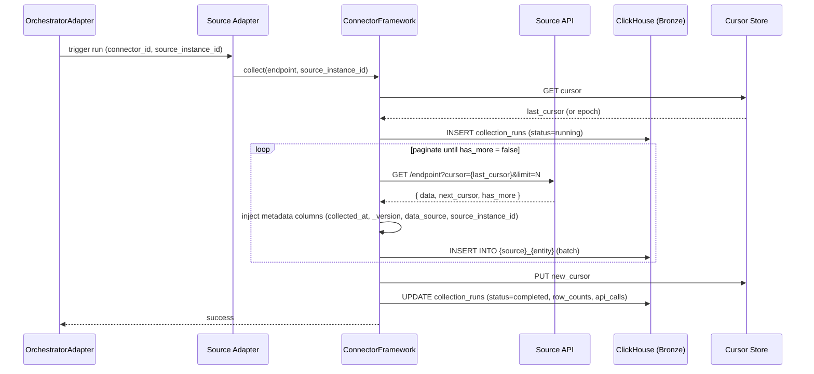
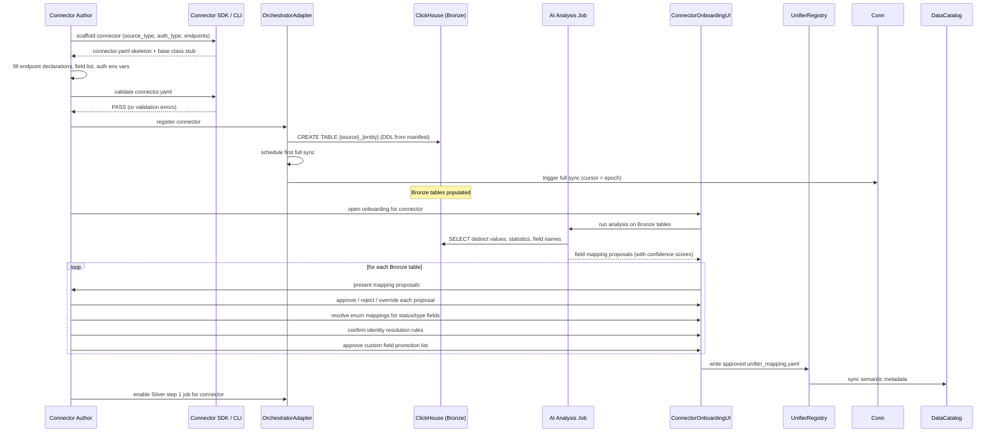

# DESIGN — Connector Framework

> Canonical synthesis of:
> - `inbox/architecture/CONNECTORS_ARCHITECTURE.md` (connector ecosystem, contract, unifier, semantic metadata)
> - `inbox/architecture/CONNECTOR_AUTOMATION.md` (automation boundary, SDK design, AI-assisted onboarding)
> - `inbox/CONNECTORS_REFERENCE.md` §How Data Flows, §Custom Fields Pattern, §Open Questions (architecture sections only)

<!-- toc -->

- [1. Architecture Overview](#1-architecture-overview)
  - [1.1 Architectural Vision](#11-architectural-vision)
  - [1.2 Architecture Drivers](#12-architecture-drivers)
  - [1.3 Architecture Layers](#13-architecture-layers)
- [2. Principles & Constraints](#2-principles--constraints)
  - [2.1 Design Principles](#21-design-principles)
  - [2.2 Constraints](#22-constraints)
- [3. Technical Architecture](#3-technical-architecture)
  - [3.1 Domain Model](#31-domain-model)
  - [3.2 Component Model](#32-component-model)
  - [3.3 API Contracts](#33-api-contracts)
  - [3.4 Internal Dependencies](#34-internal-dependencies)
  - [3.5 External Dependencies](#35-external-dependencies)
  - [3.6 Interactions & Sequences](#36-interactions--sequences)
  - [3.7 Database schemas & tables](#37-database-schemas--tables)
- [4. Additional context](#4-additional-context)
  - [Connector Authorship Tiers](#connector-authorship-tiers)
  - [Automation Boundary in Detail](#automation-boundary-in-detail)
  - [Connector Manifest Schema](#connector-manifest-schema)
  - [Unifier Schema and Semantic Metadata](#unifier-schema-and-semantic-metadata)
  - [Extraction Patterns](#extraction-patterns)
  - [Custom Fields Pattern](#custom-fields-pattern)
  - [Cross-Domain Join Tables](#cross-domain-join-tables)
  - [AI-Assisted Silver Layer Mapping](#ai-assisted-silver-layer-mapping)
  - [Data Flow Patterns](#data-flow-patterns)
  - [Security Considerations](#security-considerations)
  - [New Connector Checklist](#new-connector-checklist)
- [5. Open Questions](#5-open-questions)
  - [OQ-CN-01: Medallion naming — `{source}_{entity}` vs `raw_{source}_{entity}` for Bronze](#oq-cn-01-medallion-naming--sourceentity-vs-rawsourceentity-for-bronze)
  - [OQ-CN-02: Pipeline model — Medallion (Bronze/Silver/Gold) vs dbt-Mart](#oq-cn-02-pipeline-model--medallion-bronzesilvergold-vs-dbt-mart)
  - [OQ-CN-03: Git Bronze schema — per-source tables vs unified `git_*` table with `data_source`](#oq-cn-03-git-bronze-schema--per-source-tables-vs-unified-git-table-with-datasource)
  - [OQ-CN-04: Git streams layer — separate PostgreSQL intermediate layer](#oq-cn-04-git-streams-layer--separate-postgresql-intermediate-layer)
  - [OQ-CN-05: `class_task_tracker_activities` — numeric IDs vs text names for author/assignee](#oq-cn-05-classtasktrackeractivities--numeric-ids-vs-text-names-for-authorassignee)
  - [OQ-CN-06: Silver step 1 naming — `class_` prefix vs `_enriched` suffix](#oq-cn-06-silver-step-1-naming--class-prefix-vs-enriched-suffix)
  - [OQ-CN-07: AI API connectors — per-key vs per-person usage attribution at Silver](#oq-cn-07-ai-api-connectors--per-key-vs-per-person-usage-attribution-at-silver)
  - [OQ-CN-08: Planned sources — Linear, Slack, MCP, Jenkins, Zendesk](#oq-cn-08-planned-sources--linear-slack-mcp-jenkins-zendesk)
- [6. Traceability](#6-traceability)

<!-- /toc -->

---

## 1. Architecture Overview

### 1.1 Architectural Vision

The Connector Framework is the data ingestion subsystem of the Insight platform. It collects raw data from source systems (version control, task trackers, HR systems, communication tools, AI dev tools, CRM) and delivers it into the Medallion Architecture — Bronze → Silver → Gold — where it becomes analytically useful.

The framework separates three distinct concerns:

1. **Structural mechanics** (auth, pagination, rate limiting, run logging, DDL generation): uniform across all connectors; generated or inherited from the base framework; no connector should re-implement these.
2. **Bronze layer** (raw extraction): per-connector configuration of endpoints, field selection, cursor field, and structural quirks. Largely declarative; largely automatable.
3. **Silver layer** (semantic mapping): cross-source unification, enum normalisation, unit conversions, identity resolution rules, privacy decisions. Requires human authorship; AI-assisted but not automated.

A connector is not just an API client — it is a semantic bridge that must correctly model what data from a given source means in the context of the platform's analytical goals. The structural part can be generated; the semantic part cannot be skipped.

With 2,000+ potential customers each using different tooling stacks, the connector architecture must support three authorship tiers: first-party (platform team), community (open-source contributors), and self-service (customers integrating proprietary tools). The connector contract — `connector.yaml` manifest + base class — is the public SDK surface.

### 1.2 Architecture Drivers

#### Functional Drivers

| Requirement | Design Response |
|---|---|
| Collect data from heterogeneous source APIs | `ConnectorFramework` — base class with pluggable auth, pagination, retry |
| Incremental extraction without full reload | Cursor-based sync: cursor stored per `(connector_id, source_instance_id)`; injected per run |
| Handle multiple instances of the same source | `source_instance_id` on every Bronze row; declared in connector runtime config |
| Normalize cross-source data for analytics | `UnifierRegistry` — domain schemas mapping source fields to unified `class_*` Silver tables |
| Propagate semantic context to dashboards | Semantic metadata in unifier fields flows to Data Catalog → Semantic Dictionary automatically |
| Enable new connector authorship without platform access | Versioned `connector.yaml` manifest + `BaseConnector` published as SDK |
| Audit every extraction run | `{source}_collection_runs` table generated per connector; records run timing, row counts, errors |
| Quarantine custom fields without schema changes | `{source}_{entity}_ext` key-value table pattern; Silver `Map(String,String)` + `Map(String,Float64)` |
| Support AI-assisted Silver mapping for new connectors | `ConnectorOnboardingUI` — reads Bronze, presents AI proposals; human approves or overrides |

#### NFR Allocation

| NFR | Summary | Allocated To | Design Response | Verification |
|---|---|---|---|---|
| Idempotency | Re-running with the same cursor produces identical results | `ConnectorFramework` | Cursor read at start; written only on success; Bronze table uses `ReplacingMergeTree(_version)` | Run same cursor twice; verify row count unchanged |
| Error isolation | One connector failure does not affect others | `OrchestratorAdapter` | Each connector runs in an isolated container; failures logged to `collection_runs`; no shared state | Kill one connector mid-run; verify others continue |
| Rate limit compliance | Never exceed source system declared limits | `ConnectorFramework` | Exponential backoff with jitter on 429/503; connector declares `rate_limiting` params in manifest | Load test against mock source returning 429 |
| Schema stability | Connector schema changes don't silently break downstream | `ConnectorManifest` | Semantic versioning on `connector.yaml`; schema changes require a version bump | Schema change without version bump fails validation |
| Semantic propagation | New fields reach dashboard metric catalog without manual work | `DataCatalogSync` | Schema sync triggered on connector registration; semantic metadata auto-populates Semantic Dictionary | Register new connector; verify metric appears in catalog |
| Privacy by default | Content fields (message text, email body) never collected | `ConnectorManifest` + SDK | Fields must be explicitly declared to be collected; no wildcard field capture | Audit connector manifest; confirm no undeclared content fields present in Bronze |

### 1.3 Architecture Layers

```
┌──────────────────────────────────────────────────────────────────────────────────┐
│                          EXTERNAL DATA SOURCES                                    │
│  Git (GitLab, GitHub, Bitbucket) · Task (YouTrack, Jira) · Comm (M365, Zulip)   │
│  HR (BambooHR, Workday, LDAP) · AI (Cursor, Copilot, Claude, ChatGPT) · CRM     │
└───────────────────────────────────┬──────────────────────────────────────────────┘
                                    │ HTTP / API / Git clone
                                    ▼
┌──────────────────────────────────────────────────────────────────────────────────┐
│                            CONNECTOR LAYER                                        │
│  ┌─────────────────────────────────────────────────────────────────────────┐    │
│  │  Source Adapters  (one per source)                                       │    │
│  │  ┌───────────────┐  ┌───────────────┐  ┌───────────────┐  ┌──────────┐  │    │
│  │  │ git connector │  │ task connector│  │ hr connector  │  │ ...      │  │    │
│  │  └───────┬───────┘  └───────┬───────┘  └───────┬───────┘  └────┬─────┘  │    │
│  │          └─────────────────┴───────────────────┴───────────────┘        │    │
│  │                                     │ extends BaseConnector              │    │
│  │                      ┌──────────────▼────────────────┐                  │    │
│  │                      │  ConnectorFramework            │                  │    │
│  │                      │  auth · pagination · retry     │                  │    │
│  │                      │  cursor · metadata injection   │                  │    │
│  │                      │  DDL generation · run logging  │                  │    │
│  │                      └──────────────┬────────────────┘                  │    │
│  └─────────────────────────────────────┼───────────────────────────────────┘    │
└───────────────────────────────────────┼──────────────────────────────────────────┘
                                        │
                                        ▼
┌──────────────────────────────────────────────────────────────────────────────────┐
│  BRONZE — per-source raw tables                            {source}_{entity}      │
│  e.g. github_commits · youtrack_issue_history · bamboohr_employees               │
│  ReplacingMergeTree(_version) · standard metadata columns · _ext sidecar tables  │
└───────────────────────────────────────┬──────────────────────────────────────────┘
                                        │
                        ┌───────────────┴──────────────────────────┐
                        │ also feeds                                │
                        ▼                                          ▼
         ┌──────────────────────────┐               ┌────────────────────────────┐
         │  UNIFIER LAYER            │               │  IDENTITY MANAGER          │
         │  UnifierRegistry          │               │  (PostgreSQL / MariaDB)    │
         │  domain YAML schemas      │               │  person_id resolution      │
         │  source field mappings    │               │  from HR connector output  │
         │  semantic metadata        │               └───────────┬────────────────┘
         └──────────────┬───────────┘                           │ person_id
                        │ Silver step 1                          │ lookup
                        ▼                                       │
┌──────────────────────────────────────────────────────────────────────────────────┐
│  SILVER step 1 — unified class_* tables                    class_{domain}         │
│  class_commits · class_task_tracker_activities · class_people · class_comms       │
│  source-native user IDs; cross-source normalised schema                           │
└───────────────────────────────────────┬──────────────────────────────────────────┘
                                        │ Silver step 2: identity enrichment job
                                        ▼
┌──────────────────────────────────────────────────────────────────────────────────┐
│  SILVER step 2 — identity-resolved class_* tables                                │
│  same table names; canonical person_id replaces source-native user IDs           │
└───────────────────────────────────────┬──────────────────────────────────────────┘
                                        │
                                        ▼
┌──────────────────────────────────────────────────────────────────────────────────┐
│  GOLD — derived metrics                                    domain-specific names  │
│  status_periods · throughput · wip_snapshots · person_activity_summary           │
│  No raw events. Reads exclusively from Silver class_* tables.                     │
└──────────────────────────────────────────────────────────────────────────────────┘
```

| Layer | Responsibility | Technology |
|---|---|---|
| Bronze | Raw archive per source; append-only; source-native schema | ClickHouse `ReplacingMergeTree` |
| Silver step 1 | Cross-source unification into `class_*` schemas; source-native user IDs | ClickHouse |
| Silver step 2 | Identity enrichment; `person_id` replaces source-native user IDs | ClickHouse (join via Identity Manager) |
| Gold | Pre-aggregated analytics; no raw events; workspace-isolated | ClickHouse `SummingMergeTree` / `AggregatingMergeTree` |
| Identity Manager | Canonical person registry; alias resolution; SCD2 history | PostgreSQL or MariaDB — see `docs/domain/identity-resolution/specs/DESIGN.md` |

---

## 2. Principles & Constraints

### 2.1 Design Principles

#### Bronze Is Never Queried at Gold Level

- [ ] `p1` - **ID**: `cpt-insightspec-principle-cn-bronze-isolation`

All data must pass through Silver before reaching Gold. Bronze contains source-native identifiers — `person_id` has not been assigned. Workspace isolation (`workspace_id`) is guaranteed only at Silver and above. Gold queries read exclusively from `class_*` Silver tables.

Exception: org-level aggregates that cannot be attributed to an individual (e.g. org-level GitHub Copilot totals) still pass through a Silver table keyed by `(workspace_id, date)` — they do not bypass Silver.

#### Stateless Connectors by Default

- [ ] `p1` - **ID**: `cpt-insightspec-principle-cn-stateless`

Connectors do not maintain internal state. The cursor — the only state they need — is stored in the cursor store (not in the connector process) and read at the start of each run. This makes connectors horizontally scalable, restartable without data loss, and safe to re-deploy without losing position.

#### Idempotent Extraction

- [ ] `p1` - **ID**: `cpt-insightspec-principle-cn-idempotent`

Re-running a connector with the same cursor must produce the same Bronze rows. ClickHouse `ReplacingMergeTree(_version)` deduplicates on re-ingestion; `_version` is set to epoch milliseconds at collection time. The cursor is written only after a successful run — a failed run leaves the cursor unchanged and the next run retries from the same position.

#### Schema Versioning

- [ ] `p2` - **ID**: `cpt-insightspec-principle-cn-schema-versioning`

Every `connector.yaml` carries a semantic version. Breaking schema changes (column removal, type narrowing, rename) require a major version bump. Minor additions (new optional columns) require a minor bump. Downstream Silver jobs validate that the connector version they depend on is within the declared compatible range.

#### Error Isolation

- [ ] `p1` - **ID**: `cpt-insightspec-principle-cn-error-isolation`

Each connector runs in an isolated container. A network failure, rate limit exhaustion, or unexpected API response from one source must not affect collection from other sources. Errors are logged to `{source}_collection_runs` with status `failed` and a structured error payload; monitoring alerts fire on consecutive failures.

### 2.2 Constraints

#### Automation Boundary at Bronze/Silver

- [ ] `p1` - **ID**: `cpt-insightspec-constraint-cn-automation-boundary`

The Bronze/Silver boundary is the automation boundary. Bronze is a structural problem — declarative manifests, generated DDL, framework-owned auth/pagination/retry. Silver is a semantic problem — it requires human authorship of field mappings, enum equivalence, unit conversions, identity rules, and privacy decisions. No part of the Silver mapping contract may be applied automatically without explicit human approval.

#### Semantic Decisions Are Never Automated

- [ ] `p1` - **ID**: `cpt-insightspec-constraint-cn-no-semantic-auto`

AI may draft Silver mapping proposals — field-to-column candidates, enum clustering, unit detection, identity key suggestions. These proposals are never applied without human review and approval in the Connector Onboarding UI. The final Silver contract must have every field mapped, every enum resolved, and every identity rule declared by a human. AI eliminates the blank-page problem; it does not eliminate authorship.

#### Stable `source_instance_id`

- [ ] `p1` - **ID**: `cpt-insightspec-constraint-cn-stable-instance-id`

Every Bronze row carries `source_instance_id` — the human-readable, stable identifier of the specific source instance (e.g. `jira-acme-prod`, `youtrack-virtuozzo-prod`). This value is effectively a stable foreign key across all Bronze tables for a given instance. Changing `source_instance_id` after historical data has been collected breaks all historical joins and requires a full Bronze re-ingestion. It must be named deliberately by the connector author and treated as immutable once production data exists.

---

## 3. Technical Architecture

### 3.1 Domain Model

**Core concepts:**

| Concept | Description |
|---|---|
| **Connector** | A configured, deployed source adapter. Identified by `(connector_id, source_instance_id, workspace_id)` |
| **Source Adapter** | Code implementing the source-specific API client and extraction logic; extends `BaseConnector` |
| **Connector Manifest** (`connector.yaml`) | Declarative contract: identity, auth type, endpoints, pagination, capabilities, rate limits |
| **Endpoint** | One API resource path; has a cursor field, primary key, and entity type mapping |
| **Bronze Table** | ClickHouse `ReplacingMergeTree` table receiving raw rows from one connector endpoint |
| **Ext Table** | Companion key-value table (`{source}_{entity}_ext`) for custom fields |
| **Collection Run** | One execution of a connector's extraction loop; recorded in `{source}_collection_runs` |
| **Cursor** | The high-water mark for incremental sync; stored externally; read at run start, written on success |
| **Unifier** | Domain YAML schema defining canonical Silver fields, source mappings, and semantic metadata |
| **Silver Class Table** | ClickHouse `class_{domain}` table receiving normalised rows from one or more Bronze sources |
| **Semantic Metadata** | Per-field annotations (display name, description, aggregation rule, concepts, applicable teams) that propagate to the Data Catalog and Semantic Dictionary |

**Relationships:**

```
Workspace 1:N ──► Connector 1:1 ──► ConnectorManifest
                      │
                      ├──1:N──► Endpoint 1:1──► Bronze Table
                      │              └──0:1──► Ext Table
                      │
                      └──1:N──► CollectionRun
                                    └── cursor (per endpoint)

Unifier 1:N──► UnifierField 1:N──► SourceMapping (source, path)
                    └──1:1──► SemanticMetadata
                                  └──propagates to──► DataCatalog ──► SemanticDictionary
```

### 3.2 Component Model

#### ConnectorFamework (BaseConnector)

- [ ] `p1` - **ID**: `cpt-insightspec-component-cn-framework`

##### Why this component exists

All structural mechanics are identical across every connector in the platform — auth header injection, pagination loops, retry on rate limit, cursor management, metadata column injection, run logging. A connector author implementing any of these concerns is doing unnecessary work and introducing a drift risk. The base framework owns all of them.

##### Responsibility scope

- `collect(endpoint, cursor)` — main extraction loop: paginate until exhausted, write rows to Bronze, update run log.
- Auth: declares `auth_type` in manifest; framework handles all token lifecycle (API key injection, OAuth 2.0 token refresh, HTTP Basic construction). No auth logic in connector source code.
- Pagination: three standard patterns (`offset`, `cursor_token`, `none`) declared in manifest; framework implements all three.
- Rate limiting: exponential backoff with jitter on 429/503; connector declares `rate_limiting` block in manifest.
- Cursor management: reads last successful cursor at run start; writes new cursor on successful completion; leaves cursor unchanged on failure.
- Metadata column injection: `collected_at`, `data_source`, `source_instance_id`, `_version` are populated by the framework on every row; connectors never write these.
- Run logging: writes to `{source}_collection_runs` on start, updates on completion or failure.
- Bronze DDL generation: generates `CREATE TABLE IF NOT EXISTS` DDL from the field declaration in the manifest; connectors never hand-write DDL.

##### Responsibility boundaries

- Does NOT implement source-specific extraction logic (that is the Source Adapter's job).
- Does NOT decide which endpoints to call, which fields to keep, or how to handle structural quirks (multi-step calls, associations) — those are declared in the manifest.

##### Related components (by ID)

- `cpt-insightspec-component-cn-manifest` — manifest is the configuration input to the framework
- `cpt-insightspec-component-cn-orchestrator` — invokes the framework per schedule

---

#### ConnectorManifest

- [ ] `p1` - **ID**: `cpt-insightspec-component-cn-manifest`

##### Why this component exists

The manifest (`connector.yaml`) is the single declaration of everything structural about a connector — it is the boundary between what the SDK handles and what the connector author is responsible for. A connector whose manifest is valid has declared all structural decisions; the remaining work is semantic (Silver mapping).

##### Responsibility scope

- Declares connector identity (`id`, `name`, `version`, `source_type`).
- Declares required and optional environment variables (credentials, instance URLs).
- Declares capabilities (`incremental_sync`, `full_refresh`, `schema_discovery`).
- Declares endpoints: each has `name`, `entity_type`, `cursor_field`, `primary_key`, `pagination` type, and a field list with names and ClickHouse types.
- Declares auth type and credential env var names.
- Declares rate limit parameters.
- Declares `has_custom_fields: true` to trigger `_ext` table generation.
- Versioned with semantic versioning; schema validated by the SDK CLI before submission.

##### Responsibility boundaries

- Does NOT contain extraction logic (that is Source Adapter code).
- Does NOT contain Silver mapping decisions (those belong in `unifier_mapping.yaml`).

##### Related components (by ID)

- `cpt-insightspec-component-cn-framework` — reads manifest at runtime
- `cpt-insightspec-component-cn-unifier` — companion `unifier_mapping.yaml` provides the Silver contract

---

#### UnifierRegistry

- [ ] `p2` - **ID**: `cpt-insightspec-component-cn-unifier`

##### Why this component exists

Multiple source systems produce data about the same domain concept (e.g. commits from GitHub, GitLab, and Bitbucket; issues from YouTrack and Jira). Without a unified schema, each source's Silver table has different column names — cross-source analytics are impossible. The Unifier provides the canonical schema for each domain and the per-source mapping to it.

##### Responsibility scope

- Maintains domain YAML schemas (`domain.yaml`) for each Silver domain: `code`, `task`, `communication`, `organization`, `ai_tools`, `quality`.
- Each domain defines entities (e.g. `commit`, `merge_request`, `task`) with fields that carry semantic metadata.
- Per-connector `unifier_mapping.yaml` declares which Bronze field maps to which Unifier field (with source path and type conversion).
- Enum normalisation tables map source-specific vocabulary to canonical Silver values.
- Source field mappings:
  ```
  task.id → youtrack: "idReadable", jira: "key", linear: "identifier"
  commit.author_email → gitlab: "author_email", github: "commit.author.email"
  ```
- Extensibility: new domains added by creating a `domain.yaml` and registering it; existing connectors are unaffected.

##### Responsibility boundaries

- Does NOT contain extraction logic.
- Does NOT contain auth, pagination, or retry logic.

##### Related components (by ID)

- `cpt-insightspec-component-cn-datacatalog` — semantic metadata from unifier fields is synced to Data Catalog
- `cpt-insightspec-component-cn-onboarding-ui` — proposals presented in the Onboarding UI map to unifier fields

---

#### OrchestratorAdapter

- [ ] `p2` - **ID**: `cpt-insightspec-component-cn-orchestrator`

##### Why this component exists

Connectors must run on a schedule, in the right order, with correct retry policies, with workspace isolation, and without interfering with each other. Embedding scheduling logic in connectors would violate statelessness and make deployment management impossible at scale.

##### Responsibility scope

- Schedules connector runs (cron-based per connector per workspace).
- Manages per-workspace connector lifecycle: enable, disable, trigger ad-hoc run.
- Enforces collection frequency constraints declared in manifests (e.g. M365 ≤ 7-day window — a connector that has not run within the declared `max_gap_days` triggers an alert).
- Monitors `collection_runs` tables and fires alerts on consecutive failures.
- Registers new connectors from manifests (add to schedule, provision container).
- Technology: AirByte (connector protocol) + Dagster (orchestration and scheduling).

##### Responsibility boundaries

- Does NOT implement extraction logic.
- Does NOT write to Bronze tables directly.

##### Related components (by ID)

- `cpt-insightspec-component-cn-framework` — invokes BaseConnector per run

---

#### DataCatalogSync

- [ ] `p2` - **ID**: `cpt-insightspec-component-cn-datacatalog`

##### Why this component exists

Analysts and AI agents need to know what each field means, how to aggregate it, and which business concepts it relates to. This context must be defined once at the source (the Unifier schema), not re-entered manually in every downstream tool.

##### Responsibility scope

- On connector registration: extracts field definitions + semantic metadata from `unifier_mapping.yaml`.
- Writes to Data Catalog: table metadata, column definitions, semantic annotations.
- Syncs to Semantic Dictionary: initial metric population with `display_name`, `description`, `aggregation_type`, `concepts`, `applicable_teams`.
- Propagation rules:

| Unifier field | Propagates to | Override policy |
|---|---|---|
| `display_name` | Semantic Dictionary → `metric.display_name` | Analyst can override |
| `description` | Semantic Dictionary → `metric.description` | Analyst can extend |
| `aggregation.type` | Semantic Dictionary → `metric.aggregation_type` | Analyst can override |
| `concepts` | Semantic Dictionary → `metric.concepts` (initial set) | Analyst can add |
| `applicable_teams` | Semantic Dictionary → `metric.applies_to` | Analyst can modify |
| `lineage.calculation` | Data Catalog → `field.calculation_hint` | Immutable |

- Discovery engine: flags new fields for analyst review; high-confidence fields auto-approved.

##### Responsibility boundaries

- Does NOT own the Semantic Dictionary (that is the Analytics Layer).
- Does NOT write to Bronze or Silver tables.

##### Related components (by ID)

- `cpt-insightspec-component-cn-unifier` — source of semantic metadata

---

#### ConnectorOnboardingUI

- [ ] `p2` - **ID**: `cpt-insightspec-component-cn-onboarding-ui`

##### Why this component exists

Silver mapping decisions are semantic — they require human authorship. A text-editor / YAML diff workflow is error-prone and creates an invisible blank-page problem (every new connector author must figure out the same decisions from scratch). The Onboarding UI converts semantic decisions from open-ended authorship into structured proposal review.

##### Responsibility scope

- Triggered after Bronze sync has run for a new connector.
- Runs AI analysis job: reads Bronze tables in ClickHouse; computes field-to-Silver-column mapping proposals with confidence scores; clusters enum values; detects unit patterns; suggests identity key candidates.
- Presents proposals in a structured review interface (Mapping screen, Enum mapping screen, Custom field promotion screen, Identity resolution screen).
- Records every approval, rejection, and manual override as part of the connector's semantic contract.
- Outputs a complete `unifier_mapping.yaml` — every field mapped, every enum resolved, every identity rule declared.
- If no existing Silver class matches (>30% unmapped fields), initiates new class definition flow: AI drafts `class_{domain}` schema; operator reviews; schema registered in UnifierRegistry.

##### Responsibility boundaries

- Does NOT apply any proposal automatically without explicit human approval.
- Does NOT write to Bronze tables.

##### Related components (by ID)

- `cpt-insightspec-component-cn-unifier` — proposals target unifier fields; approved mappings written to `unifier_mapping.yaml`

---

### 3.3 API Contracts

- [ ] `p2` - **ID**: `cpt-insightspec-interface-cn-extraction`

**Technology**: REST / HTTP JSON — standard extraction interface

**Extraction endpoint** (standardized across all connectors that support schema discovery):

```
GET /extract?cursor={timestamp}&limit={n}

Response:
{
  "data":        [...],     // array of records
  "next_cursor": "string",  // cursor for next page
  "has_more":    boolean    // more pages available
}
```

**Cursor store contract** (internal, connector framework ↔ orchestrator):

```
GET  /cursors/{connector_id}/{source_instance_id}/{endpoint_name}  → { cursor: "..." }
PUT  /cursors/{connector_id}/{source_instance_id}/{endpoint_name}  ← { cursor: "...", run_id: "..." }
```

---

### 3.4 Internal Dependencies

| Dependency | Interface | Purpose |
|---|---|---|
| `{source}_collection_runs` | ClickHouse write | Run audit log per connector |
| `{source}_{entity}` Bronze tables | ClickHouse write | Raw data archive |
| `{source}_{entity}_ext` | ClickHouse write | Custom field archive |
| `class_*` Silver tables | ClickHouse write (via Silver job) | Unified domain tables |
| Identity Manager (`alias` table) | RDBMS read | `person_id` lookup for Silver step 2 |
| Cursor store | Key-value read/write | Incremental sync position |

---

### 3.5 External Dependencies

#### Source Systems (external APIs)

| Category | Examples | Notes |
|---|---|---|
| Version control | GitLab, GitHub, Bitbucket | Git clone + REST API |
| Task tracking | YouTrack, Jira | REST; full changelog endpoint is a separate call per issue |
| Communication | M365, Zulip | M365: 7–30 day retention window — mandatory alert if run gap > 7 days |
| HR / Directory | BambooHR, Workday, LDAP | Identity seeding source for Identity Manager |
| AI dev tools | Cursor, Windsurf, GitHub Copilot, Claude, ChatGPT, OpenAI | Per-user or org-level; token usage data |
| CRM | HubSpot, Salesforce | Contacts are external customers — NOT resolved to `person_id` |
| Quality | Allure TestOps | Test launches + per-test results; cross-domain join via `external_issue_id` |

Per-source Bronze schemas are documented in `docs/components/connectors/{category}/{source}/`.

#### ClickHouse (Bronze / Silver / Gold store)

| Aspect | Value |
|---|---|
| Bronze table engine | `ReplacingMergeTree(_version)` |
| Order key | `({primary_key}, source_instance_id)` |
| Silver class engine | ClickHouse (query-time JOIN for Silver step 2 via Identity Manager Dictionary) |
| Gold engine | `SummingMergeTree` or `AggregatingMergeTree` depending on metric type |

#### AirByte / Dagster (Orchestration)

| Aspect | Value |
|---|---|
| Extraction protocol | AirByte connector protocol (standardized connector interface) |
| Scheduling | Dagster — cron-based; per workspace per connector |
| Isolation | One container per connector run |
| Retry | Configured per connector in manifest; default 3 attempts with exponential backoff |

---

### 3.6 Interactions & Sequences

#### Standard Incremental Sync Run

**ID**: `cpt-insightspec-seq-cn-incremental-sync`



---

#### Connector Onboarding (New Source)

**ID**: `cpt-insightspec-seq-cn-onboarding`



---

#### Silver Step 2 — Identity Enrichment

**ID**: `cpt-insightspec-seq-cn-silver-step2`

```mermaid
sequenceDiagram
    participant S2Job as Silver Step 2 Job
    participant CH as ClickHouse (Silver step 1)
    participant Dict as identity_alias Dictionary
    participant RDBMS as Identity Manager RDBMS

    RDBMS -->> Dict: (Bootstrap completed; alias table current)

    S2Job ->> CH: SELECT rows from class_{domain} WHERE person_id IS NULL
    loop for each row
        S2Job ->> Dict: dictGet('identity_alias', 'person_id', (alias_type, alias_value, source_system, tenant_id))
        alt resolved
            Dict -->> S2Job: person_id
            S2Job ->> CH: UPDATE class_{domain} SET person_id = resolved_person_id
        else unmapped
            S2Job ->> CH: SET person_id = NULL (row remains in Silver; Gold filters via IS NOT NULL where required)
        end
    end
```

---

### 3.7 Database schemas & tables

- [ ] `p1` - **ID**: `cpt-insightspec-db-cn-bronze`

#### Bronze table (framework-generated template)

Every Bronze table is generated from the connector manifest's field declarations. The DDL pattern is:

```sql
CREATE TABLE IF NOT EXISTS {source}_{entity}
(
    source_instance_id  String,
    -- connector-declared fields (names and types from manifest):
    {field_name}        {ClickHouse_type},
    -- ...
    -- framework-injected metadata columns (never declared by connector author):
    collected_at        DateTime64(3),
    data_source         String  DEFAULT '',
    _version            UInt64
)
ENGINE = ReplacingMergeTree(_version)
ORDER BY ({primary_key_fields}, source_instance_id)
SETTINGS index_granularity = 8192;
```

**Framework-injected metadata columns** (identical across all connectors):

| Column | Type | Value |
|---|---|---|
| `collected_at` | `DateTime64(3)` | Timestamp of the collection run; set by framework at write time |
| `data_source` | `String` | Connector's canonical `id` from manifest (e.g. `insight_youtrack`) |
| `source_instance_id` | `String` | Runtime instance identifier (e.g. `youtrack-acme-prod`) |
| `_version` | `UInt64` | Epoch milliseconds at collection time; deduplication sort key |

**Standard field type mapping** (inference by framework):

| API / OpenAPI type | Inferred ClickHouse type | Notes |
|---|---|---|
| `string` | `String` | |
| `integer` (non-negative) | `UInt64` | |
| `integer` (signed) | `Int64` | |
| `number` (float) | `Float64` | |
| `boolean` | `Bool` | |
| ISO 8601 datetime | `DateTime64(3)` | |
| Date-only `YYYY-MM-DD` | `Date` | |
| Unix ms timestamp | `DateTime64(3)` | Requires explicit declaration; not inferable from JSON type |
| ID fields with `{n}-{m}` format (e.g. YouTrack `1-234`) | `String` | Requires explicit declaration; looks like `Int64` without domain knowledge |

#### Extension table (`_ext`) — framework-generated on `has_custom_fields: true`

```sql
CREATE TABLE IF NOT EXISTS {source}_{entity}_ext
(
    source_instance_id  String,
    entity_id           String,
    field_id            String,
    field_name          String,
    field_value         String,
    value_type          String,   -- 'string' | 'number' | 'user' | 'enum' | 'json'
    collected_at        DateTime64(3),
    data_source         String,
    _version            UInt64
)
ENGINE = ReplacingMergeTree(_version)
ORDER BY (source_instance_id, entity_id, field_id);
```

Schema is identical across all `_ext` tables; declaring `has_custom_fields: true` in the manifest is the only connector-author action required.

#### Collection runs table (framework-generated)

```sql
CREATE TABLE IF NOT EXISTS {source}_collection_runs
(
    run_id          String,
    started_at      DateTime64(3),
    completed_at    DateTime64(3),
    status          String,    -- 'running' | 'completed' | 'failed'
    api_calls       Float64,
    errors          Float64,
    settings        String,    -- JSON: cursor, config snapshot
    -- per-entity count fields declared in manifest:
    {entity}_collected  UInt64,  -- one per endpoint
    ...
)
ENGINE = MergeTree()
ORDER BY (started_at, run_id);
```

Common core is 100% generated; per-entity count field names are declared as additive metadata in the manifest.

#### Silver class tables (`class_*`)

Silver table schemas are defined by the UnifierRegistry domain YAML. All Silver class tables include:

| Column | Type | Notes |
|---|---|---|
| `source` | `String` | Source system name (e.g. `youtrack`, `github`) |
| `source_instance_id` | `String` | Instance identifier |
| `person_id` | `String NULL` | Canonical person ID from Identity Manager (NULL until Silver step 2) |
| `ingestion_date` | `DateTime64(3)` | Cursor for incremental downstream sync |
| `_version` | `UInt64` | ReplacingMergeTree dedup key |
| `custom_str_attrs` | `Map(String, String)` | Promoted custom string attributes |
| `custom_num_attrs` | `Map(String, Float64)` | Promoted custom numeric attributes |

Domain-specific fields (e.g. `task_id`, `commit_hash`, `event_date`, `state_ref`) are defined per domain in the UnifierRegistry. Full Silver schemas for each domain are documented in the corresponding connector component specs under `docs/components/connectors/`.

---

## 4. Additional context

### Connector Authorship Tiers

The platform supports three tiers, each with different ownership and maintenance expectations:

| Tier | Author | Maintenance | Examples |
|---|---|---|---|
| **First-party** | Constructor / Cyber Fabric engineering | Fully maintained by platform team | GitLab, YouTrack, BambooHR, M365, Zulip |
| **Community** | Open-source contributors | Community-maintained; reviewed by platform team | Bitbucket, Linear, custom HR systems |
| **Self-service** | Customers | Customer-owned; platform provides SDK and validation | Internal proprietary tools, niche SaaS products |

The Connector SDK (versioned `connector.yaml` schema + `BaseConnector` + validation CLI + local dev harness) is the public interface for community and self-service tiers. A connector that passes SDK validation can be submitted for review without access to platform internals.

---

### Automation Boundary in Detail

```
┌─────────────────────────────────────────────────────────┐
│  BRONZE LAYER                               ✅ Automatable│
│  Which endpoints to call     → declared in manifest      │
│  Auth, pagination, retry     → framework                 │
│  Metadata columns            → framework-injected        │
│  Bronze DDL                  → generated from field list │
│  _ext table structure        → generated on declaration  │
│  collection_runs table       → 100% generated            │
│                                                          │
│  Manual residue at Bronze:                               │
│  endpoint selection · field selection · structural quirks│
│  (multi-step calls, associations, history endpoints)     │
└──────────────────────────┬──────────────────────────────┘
                           │ Bronze data in ClickHouse
           ╔═══════════════╪═══════════════╗
           ║  AUTOMATION   │  BOUNDARY     ║
           ╚═══════════════╪═══════════════╝
                           │
                    ┌──────▼───────┐
                    │  AI ANALYSIS │  🤖 reads Bronze, drafts proposals
                    └──────┬───────┘
                           │  proposals (not applied automatically)
                    ┌──────▼───────┐
                    │  ONBOARDING  │  👤 human reviews, approves, overrides
                    │     UI       │
                    └──────┬───────┘
                           │ approved semantic contract
┌──────────────────────────▼──────────────────────────────┐
│  SILVER LAYER                          ❌ Cannot automate │
│  Enum equivalence    🤖→👤 AI drafts, human confirms     │
│  Unit normalisation  🤖→👤 AI detects, human confirms    │
│  Derived fields      ❌ Multi-step API logic, manual     │
│  Identity rules      ❌ Internal vs external, policy     │
│  Privacy decisions   ❌ Content collection, always manual│
│  New class approval  ❌ Platform-level judgment           │
└─────────────────────────────────────────────────────────┘
```

**What cannot be automated (representative examples):**

| Problem | Why it requires human judgment |
|---|---|
| Custom field names per instance | YouTrack story points field is named `SP`, `Estimation`, or `Story Points` depending on the instance — not visible in API schema |
| Derived fields (`is_won`, `duration`, `disposition`) | Require multi-step API calls or cross-resource lookups not present in the primary object schema |
| Multi-step collection (associations, history) | `youtrack_issue_history`, `hubspot_associations` are separate endpoints not referenced from the primary object schema |
| Unit normalisation | `hs_call_duration` is in milliseconds, `DurationInMinutes` is minutes, `duration.minutes` is minutes — unit is in vendor docs, not in API schema |
| Status/enum normalisation | `"Resolved"` in YouTrack ≠ always `done`; depends on per-instance workflow configuration |
| Identity rules (internal vs external) | HubSpot contacts are customers, not employees — resolving them to `person_id` corrupts the identity store |
| Privacy/content decisions | Zulip message text, M365 email body are accessible but deliberately excluded |
| `source_instance_id` naming | Human-assigned, must be stable and meaningful in context |
| Data retention constraints | M365 7–30 day window is in vendor documentation, not in API schema |

---

### Connector Manifest Schema

```yaml
connector:
  id: {source}_connector           # unique identifier
  name: ""                         # human-readable
  version: "1.0.0"                 # semantic version; bumped on breaking change
  source_type: ""                  # git | task | communication | hr | ai | crm | quality

  config:
    required_env_vars: []          # credential and instance URL vars
    optional_env_vars: []

  capabilities:
    incremental_sync: true         # supports cursor-based extraction
    full_refresh: false            # supports full reload
    schema_discovery: false        # can detect schema changes

  auth:
    type: ""                       # api_key | basic | oauth2
    # auth params declared here; framework handles all token lifecycle

  rate_limiting:
    requests_per_window: 100
    window_seconds: 10
    backoff_initial_ms: 1000
    backoff_max_ms: 60000
    backoff_multiplier: 2.0

  collection_frequency:
    default_cron: "0 */6 * * *"   # every 6 hours
    max_gap_days: null             # null = no constraint; set to 7 for M365

  endpoints:
    - name: ""                     # endpoint name, e.g. "issues"
      entity_type: ""              # maps to Unifier domain entity
      cursor_field: ""             # field used for incremental sync
      cursor_injection: ""         # query_param | jql | filter_api | none
      cursor_param: ""             # param name for cursor injection
      primary_key: ""              # unique identifier field(s)
      has_custom_fields: false     # generates _ext table if true
      pagination:
        type: ""                   # offset | cursor_token | none
        # type-specific params declared here
      fields:
        - name: ""
          type: ""                 # ClickHouse type
          nullable: false
```

---

### Unifier Schema and Semantic Metadata

```yaml
domain: task
description: "Task tracking — issues, changelogs, sprints"

entities:
  task:
    fields:
      - name: task_id
        type: String
        source_mappings:
          youtrack: "idReadable"
          jira: "key"
          linear: "identifier"
        semantic:
          display_name: "Task ID"
          description: "Human-readable task identifier"
          category: task
          aggregation: { type: COUNT }
          concepts: ["Delivery", "Task Flow"]
          applicable_teams: ["Dev", "PM"]

      - name: status
        type: String
        source_mappings:
          youtrack: "state"
          jira: "status.name"
        enum_normalisation:
          # declared in per-connector unifier_mapping.yaml
          # e.g. youtrack "Resolved" → done, "In Progress" → in_progress
        semantic:
          display_name: "Status"
          description: "Current lifecycle state of the task"
          aggregation: { type: NONE }
          concepts: ["Task Flow", "WIP"]
```

---

### Extraction Patterns

The framework implements three pagination patterns. Connectors declare which applies; no pagination code in connector source:

| Pattern | Declaration | Sources |
|---|---|---|
| Offset/limit | `pagination: { type: offset, skip_param: "$skip", limit_param: "$top" }` | YouTrack, Jira |
| Cursor token | `pagination: { type: cursor_token, cursor_path: "paging.next.after" }` | HubSpot |
| No pagination | `pagination: { type: none }` | M365 Graph report endpoints |

**Incremental cursor** — declared per endpoint:
```yaml
cursor_field: updated
cursor_injection: query_param
cursor_param: updatedAfter
```
Framework reads cursor from store → injects → collects → writes cursor on success.

**Multi-step collection** (manual — not automatable): some connectors require a per-entity secondary API call (e.g. `GET /api/issues/{id}/activities` for YouTrack issue history, `GET /crm/v3/objects/{id}/associations/{type}` for HubSpot associations). These secondary loops are implemented in the Source Adapter, not in the framework.

---

### Custom Fields Pattern

**Bronze** — `_ext` key-value table (one per entity type with custom fields):

```
source_instance_id  String   -- which instance
entity_id           String   -- parent entity key
field_id            String   -- machine ID from source API
field_name          String   -- display name (e.g. "Squad", "Customer")
field_value         String   -- all values stored as string; JSON for complex
value_type          String   -- string | number | user | enum | json
```

Schema is identical across all `_ext` tables. Generated on `has_custom_fields: true` in manifest.

**Silver** — `Map` columns on every Silver class table that represents a customisable entity:

```sql
custom_str_attrs   Map(String, String)    -- promoted string custom fields
custom_num_attrs   Map(String, Float64)   -- promoted numeric custom fields
```

During Silver step 1 ETL, a per-workspace **Custom Attributes Configuration** file declares which `field_name` values from `_ext` to promote and whether each is `string` or `numeric`. Only configured fields are promoted; all others remain queryable in Bronze `_ext`.

Map key names (e.g. `squad`, `customer`, `sp_actual`) are stable once production data exists — changing a key name breaks all historical queries.

**HR exception**: `class_people` populates `custom_str_attrs` / `custom_num_attrs` directly from BambooHR/Workday custom employee fields in the main employee API response — no Bronze `_ext` table needed.

---

### Cross-Domain Join Tables

Some connectors produce reference tables that exist to enable a JOIN at Gold query time — not a Silver stream row.

| Table | Purpose | Cross-domain JOIN target |
|---|---|---|
| `{git}_ticket_refs` | Ticket IDs extracted from commit messages and PR descriptions | `class_task_tracker_activities.task_id` → cycle time |
| `allure_defects.external_issue_id` | Allure defects linked to tracker tickets | `class_task_tracker_activities` → quality + delivery correlation |

**Rule**: if a table's purpose is to enable a JOIN (not to produce a Silver stream row), it is marked `Cross-domain join → {target}.{key}` in the connector spec — not declared as a Silver target.

---

### AI-Assisted Silver Layer Mapping

The `ConnectorOnboardingUI` runs an AI analysis job on Bronze data and presents structured proposals. AI narrows the decision space; it does not replace authorship.

**What AI proposes:**
- Field → Silver column candidates (with confidence score and reasoning)
- Enum normalisation clusters (distinct Bronze values mapped to canonical Silver values; unmapped values always flagged)
- Unit conversion detection (field name + value range → probable unit; human confirms from API docs)
- Custom field promotion recommendations (`custom_str_attrs` / `custom_num_attrs` / `DROP`)
- Identity key candidates (email-shaped fields; likely external entity warning)

**What remains manual regardless of AI assistance:**

| Decision | Why AI cannot make it |
|---|---|
| Internal vs external entity | Business context (HubSpot contacts = customers, not employees) |
| Privacy exclusions | Content collection is a policy decision |
| Final enum normalisation for ambiguous values | `"Awaiting Info"` — `open` or a separate state? Only the workflow author knows |
| Fallback identity strategy | When email is suppressed (Jira Cloud), fallback choice is a product decision |
| New Silver class approval | Whether a new entity type warrants a new class requires platform judgment |
| Unit disambiguation below confidence threshold | Requires reading vendor API documentation |

---

### Data Flow Patterns

Three physical extraction patterns, selected per connector:

**API-based (standard)** — most connectors:
```
Source API  --HTTP/API-->  Connector Pod (stateless)  --batch write-->  ClickHouse Bronze
```

**File-based (Git)** — version control connectors:
```
GitLab/GitHub  --clone/pull-->  Local disk (git repos)  --parse-->  ClickHouse Bronze
```

**Webhook-based (real-time)** — optional for supported sources:
```
Source  --webhook-->  Webhook Handler  --queue-->  Kafka/Queue  --consumer-->  ClickHouse Bronze
```

---

### Security Considerations

- **Credential management**: all secrets via environment variables or secret manager; never in `connector.yaml` or source code.
- **Data privacy**: private message content never extracted (only metadata/counts). PII handling per data classification policy. Connector manifest must explicitly declare any content fields; no wildcard capture.
- **Access logging**: all data access logged for audit.
- **Network isolation**: connectors run in isolated containers; no cross-connector network access.
- **Rate limiting**: connectors must not overload source systems; exponential backoff enforced by framework.

---

### New Connector Checklist

```
□ connector.yaml             — manifest: endpoints, auth type, pagination, rate limits
□ unifier_mapping.yaml       — field mappings + enum normalisation + identity rules
                               (produced via Onboarding UI after Bronze sync)
□ src/client.py              — API client; multi-step collection; derived fields
□ src/extractor.py           — data extraction loop (calls BaseConnector)
□ src/transformer.py         — apply unifier mapping (generated from unifier_mapping.yaml)
□ identity/aliases_{source}.yaml  — identity resolution rules (internal vs external,
                               fallback strategy for suppressed emails)
□ tests/                     — unit + integration tests
□ Dockerfile                 — containerized deployment
```

Steps 1, 3–5, and 8 are structural — largely generated by the SDK. Steps 2, 6, and 7 are semantic — authored by the connector author.

---

## 5. Open Questions

### OQ-CN-01: Medallion naming — `{source}_{entity}` vs `raw_{source}_{entity}` for Bronze

**Source of divergence**: `CONNECTORS_REFERENCE.md` (v2.13) uses `{source}_{entity}` Bronze naming (e.g. `github_commits`, `youtrack_issue_history`). `CONNECTORS_ARCHITECTURE.md` uses `raw_{source}_{entity}` (e.g. `raw_gitlab_commits`, `raw_youtrack_issues`).

**Question**: Which convention is canonical? Per-connector specs in `docs/components/connectors/` must use a single scheme consistently.

**Current approach**: `{source}_{entity}` (without `raw_` prefix) is used in this document and in the Connector Reference v2.13 as the more recent specification.

---

### OQ-CN-02: Pipeline model — Medallion (Bronze/Silver/Gold) vs dbt-Mart

**Source of divergence**: `CONNECTORS_REFERENCE.md` describes Bronze → Silver (`class_*`) → Gold. `CONNECTORS_ARCHITECTURE.md` describes Raw Tables → dbt (Staging → Intermediate → Mart) → Materialized Views, with a separate Unifier Layer feeding a Semantic Dictionary.

The two documents also differ on Identity Resolution placement: Reference puts it in PostgreSQL/MariaDB (RDBMS); Architecture puts it in ClickHouse Dictionaries.

**Question**: Which pipeline model is canonical for implementation? The answer affects table naming, Gold layer naming (`status_periods` vs `mart_dev_activity`), identity resolution storage, and whether the Unifier Layer is a runtime component or a code-generation step.

**Current approach**: This document adopts the Medallion model (`class_*` Silver naming, RDBMS for Identity Resolution) consistent with `CONNECTORS_REFERENCE.md` and `docs/domain/identity-resolution/specs/DESIGN.md`. `CONNECTORS_ARCHITECTURE.md` dbt-mart framing is noted as an alternative and may represent an earlier design iteration.

---

### OQ-CN-03: Git Bronze schema — per-source tables vs unified `git_*` table with `data_source`

**Source of divergence**: `CONNECTORS_REFERENCE.md` defines separate per-source Bronze tables (`github_commits`, `bitbucket_commits`, `gitlab_commits`). `connectors/git/schema.dbml` (PR #1) defines a single unified table `git_commits` with a `data_source` discriminator field (`insight_github` / `insight_bitbucket_server` / `insight_gitlab`).

**Question**: Per-source tables (explicit source-specific fields, UNION needed for cross-source queries) or unified table with `data_source` (simpler queries, nullable source-specific fields)?

**Current approach**: Unresolved. Per-connector component specs under `docs/components/connectors/git/` should resolve this before production implementation.

---

### OQ-CN-04: Git streams layer — separate PostgreSQL intermediate layer

**Source of divergence**: `streams/raw_git/*.md` (PR #3) defines a PostgreSQL schema (`git.commit`, `git.author`, `git.repo`, etc.) with auto-increment IDs and FK relationships, structurally incompatible with both the ClickHouse Bronze model and the per-source table model in `schema.dbml`.

**Question**: Is this a separate intermediate layer between the connector and Bronze, a legacy design, or a GitLab-specific implementation? If intermediate, it is undocumented in the pipeline diagram and needs to be integrated.

---

### OQ-CN-05: `class_task_tracker_activities` — numeric IDs vs text names for author/assignee

**Source of divergence**: `CONNECTORS_REFERENCE.md` defines `event_author_raw` (`UInt64`) and `assignee_raw` (`UInt64`) — numeric source-system IDs resolved to `person_id` in Silver step 2, with ClickHouse Dictionaries (`status_dict`, `type_dict`) for ID → text resolution. `streams/stream_task_tracker/task_tracker_activities.md` (PR #3) uses `event_author` (`text`) and `assignee` (`text`) — human-readable names stored directly.

**Question**: Which representation is canonical for Silver step 1? Numeric IDs require Dictionary infrastructure; text names are denormalized but simpler. The choice affects table size at scale and the Dictionary infrastructure requirement.

---

### OQ-CN-06: Silver step 1 naming — `class_` prefix vs `_enriched` suffix

**Source of divergence**: `CONNECTORS_REFERENCE.md` uses `class_{domain}` (e.g. `class_commits`, `class_task_tracker`, `class_communication_metrics`). `IDENTITY_RESOLUTION_V3.md` uses `{entity}_enriched` (e.g. `commits_enriched`).

**Question**: Which naming convention is canonical? All Silver step 1 and step 2 tables, Silver step 2 enrichment jobs, Gold queries, and identity resolution jobs must use a single scheme.

**Current approach**: `class_{domain}` is used in this document and `CONNECTORS_REFERENCE.md` v2.13 as the more recent specification. `_enriched` is treated as superseded.

---

### OQ-CN-07: AI API connectors — per-key vs per-person usage attribution at Silver

**Source of divergence**: `claude_api_daily_usage` and `openai_api_daily_usage` aggregate by `api_key_id`, not by user. Per-request user attribution requires callers to pass `X-Anthropic-User-Id` / `user` field — optional conventions, not enforced.

**Question**: Should the Silver `class_ai_api_usage` carry a nullable `person_id` (resolved only when the attribution header is present)? Or is per-key usage tracked separately from per-person IDE tool usage, with no unification at Silver? How is cost attributed when one API key is shared across a team?

---

### OQ-CN-08: Planned sources — Linear, Slack, MCP, Jenkins, Zendesk

**Source of divergence**: `CONNECTORS_ARCHITECTURE.md` mentions Linear (task tracking), Slack (communication), MCP / AI Assistant (ai_tools) as sources in its diagrams but without Bronze table schemas. Jenkins, SonarQube, Zendesk, and 1C are mentioned in `CONNECTOR_AUTOMATION.md` as challenging cases.

**Question**: Which of these are actively planned (have owners and timelines) vs. illustrative mentions in architecture diagrams? Before the `docs/components/connectors/` folder is considered complete, planned sources need placeholder specs.

---

## 6. Traceability

- **Source architecture**: `inbox/architecture/CONNECTORS_ARCHITECTURE.md` — connector ecosystem strategy, contract, unifier domains, semantic metadata, data flow patterns, cross-domain joins
- **Source automation**: `inbox/architecture/CONNECTOR_AUTOMATION.md` — automation boundary analysis, SDK design, what can/cannot be automated, AI-assisted onboarding (§7)
- **Source reference** (architecture sections): `inbox/CONNECTORS_REFERENCE.md` — §How Data Flows, §Custom Fields Pattern, §Open Questions (architectural OQs only); per-source Bronze schemas documented in `docs/components/connectors/`
- **Related domain**: `docs/domain/identity-resolution/specs/DESIGN.md` — Identity Manager (Silver step 2 dependency)
- **Per-source specs**: `docs/components/connectors/{category}/{source}/specs/` — connector-specific PRD and DESIGN documents with Bronze table schemas and API details
