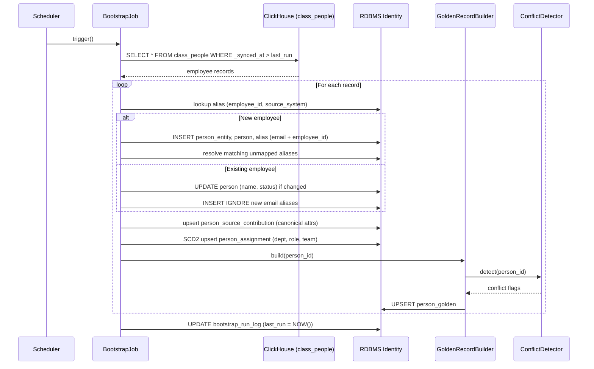
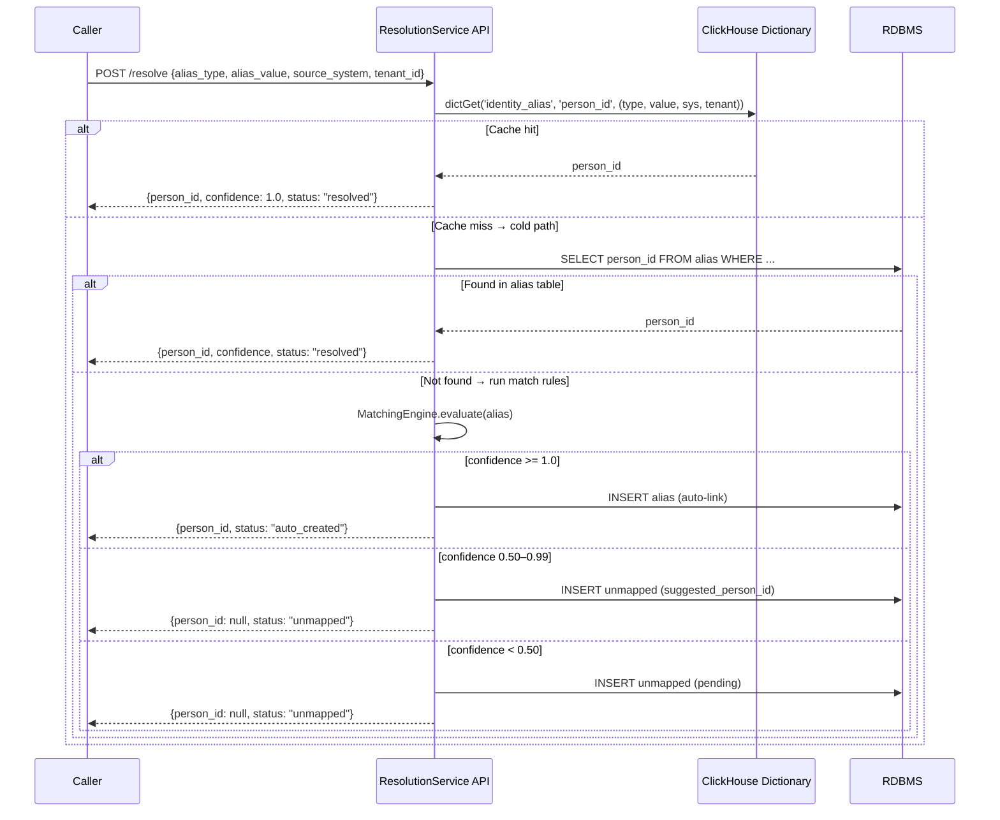
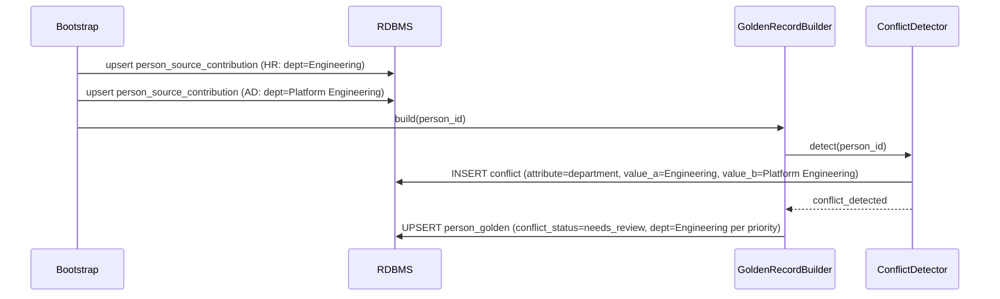

# DESIGN — Identity Resolution

> Version 1.0 — March 2026
> Canonical synthesis of:
> - `inbox/architecture/IDENTITY_RESOLUTION_V2.md` (V2 — MariaDB-focused reference)
> - `inbox/architecture/IDENTITY_RESOLUTION_V3.md` (V3 — Silver layer contract, PostgreSQL support added)
> - `inbox/architecture/IDENTITY_RESOLUTION_V4.md` (V4 — current canonical; Golden Record, Source Federation, multi-tenancy)
> - `inbox/IDENTITY_RESOLUTION.md` (ClickHouse-native min-propagation algorithm)
> - `inbox/architecture/EXAMPLE_IDENTITY_PIPELINE.md` (end-to-end walkthrough)

<!-- toc -->

- [1. Architecture Overview](#1-architecture-overview)
  - [1.1 Architectural Vision](#11-architectural-vision)
  - [1.2 Architecture Drivers](#12-architecture-drivers)
  - [1.3 Architecture Layers](#13-architecture-layers)
- [2. Principles & Constraints](#2-principles--constraints)
  - [2.1 Design Principles](#21-design-principles)
  - [2.2 Constraints](#22-constraints)
- [3. Technical Architecture](#3-technical-architecture)
  - [3.1 Domain Model](#31-domain-model)
  - [3.2 Component Model](#32-component-model)
  - [3.3 API Contracts](#33-api-contracts)
  - [3.4 Internal Dependencies](#34-internal-dependencies)
  - [3.5 External Dependencies](#35-external-dependencies)
  - [3.6 Interactions & Sequences](#36-interactions--sequences)
  - [3.7 Database schemas & tables](#37-database-schemas--tables)
- [4. Additional context](#4-additional-context)
  - [Min-Propagation Algorithm (ClickHouse-Native)](#min-propagation-algorithm-clickhouse-native)
  - [Matching Engine Phases](#matching-engine-phases)
  - [Golden Record Pattern](#golden-record-pattern)
  - [Org Hierarchy & SCD Type 2](#org-hierarchy--scd-type-2)
  - [Merge and Split Operations](#merge-and-split-operations)
  - [ClickHouse Integration](#clickhouse-integration)
  - [End-to-End Walkthrough: Anna Ivanova](#end-to-end-walkthrough-anna-ivanova)
  - [End-to-End Walkthrough: Alexei Vavilov (Min-Propagation)](#end-to-end-walkthrough-alexei-vavilov-min-propagation)
  - [Deployment](#deployment)
  - [Operational Considerations](#operational-considerations)
- [5. Open Questions](#5-open-questions)
  - [OQ-IR-01: API field naming — `is_enabled` vs `sync_enabled`](#oq-ir-01-api-field-naming--isenabled-vs-syncenabled)
  - [OQ-IR-02: Relationship between Min-Propagation (ClickHouse-native) and RDBMS Bootstrap approach](#oq-ir-02-relationship-between-min-propagation-clickhouse-native-and-rdbms-bootstrap-approach)
  - [OQ-IR-03: RDBMS choice — PostgreSQL vs MariaDB](#oq-ir-03-rdbms-choice--postgresql-vs-mariadb)
  - [OQ-IR-04: `department` / `team` as legacy flat-string assignment types](#oq-ir-04-department--team-as-legacy-flat-string-assignment-types)
  - [OQ-IR-05: Permissions / RBAC relationship to Identity Resolution](#oq-ir-05-permissions--rbac-relationship-to-identity-resolution)
  - [OQ-IR-06: Silver table naming — V3 (`raw_*`) vs V4 (`class_*`)](#oq-ir-06-silver-table-naming--v3-raw-vs-v4-class)
  - [OQ-IR-07: Fuzzy name matching — finding missing links](#oq-ir-07-fuzzy-name-matching--finding-missing-links)
- [6. Traceability](#6-traceability)

<!-- /toc -->

---

## 1. Architecture Overview

### 1.1 Architectural Vision

Identity Resolution is the process of mapping disparate identity signals — emails, usernames, employee IDs, system-specific handles — from multiple source systems into canonical person records. This enables cross-system analytics: correlating a person's Git commits with their Jira tasks, calendar events, and HR data.

The service sits **between Silver step 1 (unified class_\* tables) and Silver step 2 (identity-resolved)** in the Medallion Architecture. Connectors write raw data to per-source Bronze tables; Bronze is unified into `class_*` Silver step 1 tables (ClickHouse); the Bootstrap Job reads `class_people` and seeds the RDBMS identity store; the Resolution Service then enriches all other `class_*` tables with `person_id`.

```
CONNECTORS → Bronze (per-source) → Silver step 1 (class_*) → [Bootstrap] → RDBMS Identity
                                                                                     ↓
Silver step 2 (class_* + person_id) ←────── Dictionary / External Engine ───────────┘
                                                                                     ↓
Gold (person_activity_*, team_velocity_*, ...)
```

**Key capabilities (V4 canonical):**
- Multi-alias support: one person → many identifiers across systems
- Full history preservation: SCD Type 2 on `person` and `person_assignment`
- Department / team transfers with correct historical attribution
- Name changes, email changes, account migrations
- Merge / split operations with rollback support via `merge_audit`
- RDBMS-agnostic: PostgreSQL or MariaDB InnoDB
- Source Federation: combine data from multiple HR / directory systems
- Golden Record Pattern: assemble best attribute values with configurable source priority
- Conflict Detection: identify and flag when sources disagree
- Silver Layer Contract: defined schemas for `class_people`, `class_commits`, `class_task_tracker_activities` with append-only ingestion

### 1.2 Architecture Drivers

#### Functional Drivers

| Requirement | Design Response |
|---|---|
| Resolve aliases from all connectors to `person_id` | `ResolutionService` — two-phase lookup (hot path: alias table; cold path: match rules) |
| Seed identity from HR/directory sources | `BootstrapJob` reads `class_people` (Silver step 1), creates `person` + `alias` rows in RDBMS |
| Assemble best-value Golden Record per person | `GoldenRecordBuilder` — configurable source priority per attribute |
| Detect and flag conflicting attribute values | `ConflictDetector` — writes to `conflict` table; flags record for operator review |
| Merge two incorrectly split person records | `ResolutionService.merge()` — ACID transaction + snapshot in `merge_audit` |
| Split a wrongly merged record | `ResolutionService.split()` — restore from `merge_audit.snapshot_before` |
| Enrich ClickHouse Silver with `person_id` at query time | `ClickHouseSyncAdapter` — dictionary + external engine |
| Track org history across transfers | `person_assignment` SCD Type 2 + `person_entity` FK anchor |
| Support multiple HR sources and tenants | `source_system` column + `tenant_id` on all tables |
| Handle unresolvable aliases without blocking pipeline | `unmapped` table — pending queue with operator workflow |

#### NFR Allocation

| NFR | Summary | Allocated To | Design Response | Verification |
|---|---|---|---|---|
| ACID for merge / split | No partial state on identity mutations | RDBMS (PostgreSQL / MariaDB InnoDB) | All merges in transactions with rollback | Merge + rollback integration tests |
| Alias lookup latency | Hot-path resolve < 1 ms | ClickHouse Dictionary | Dictionary cached in ClickHouse memory; reloads every 30–60 s | Benchmark with 10K/s lookup rate |
| End-to-end SLA (standard) | Person appears in dashboards < 60 min after HR sync | Bootstrap + Dictionary sync | Bootstrap runs on schedule; dictionary reload TTL ≤ 60 s | Monitor `alias_lookup_lag` metric |
| Idempotency | Bootstrap re-runs produce no duplicates | `BootstrapJob` | Natural key `(employee_id, source_system)` + `INSERT IGNORE` / upsert | Run bootstrap 3× on same data; verify row counts |
| No fuzzy auto-link | Zero false-positive merges from fuzzy rules | `MatchingEngine` | Fuzzy rules disabled by default; never trigger auto-link | Audit test: enable fuzzy; assert no auto-link |
| Multi-tenancy isolation | No cross-tenant data leaks | All RDBMS tables | `tenant_id` on `person_entity`, `alias`, `org_unit_entity`, all child tables; RLS on PostgreSQL | Cross-tenant resolution query returns empty |
| GDPR erasure | Hard purge within SLA on right-to-erasure request | `ResolutionService.purge()` | Cascading deletion order; ClickHouse `is_deleted` flag; legal hold check | Purge test; verify ClickHouse tombstone propagation |

### 1.3 Architecture Layers

```
┌──────────────────────────────────────────────────────────────────────────────────────────┐
│                                      DATA PIPELINE                                        │
├──────────────────────────────────────────────────────────────────────────────────────────┤
│                                                                                           │
│  CONNECTORS        BRONZE              SILVER step 1       SILVER step 2    GOLD          │
│  ──────────        ──────              ─────────────       ─────────────    ────          │
│                                        (unified)           (+ person_id)                  │
│  ┌─────────┐    ┌───────────────┐    ┌───────────────┐                   ┌──────────┐    │
│  │ GitLab  │───▶│ git_commits   │───▶│ class_commits │──┐  class_commits │ person_  │    │
│  │ GitHub  │    └───────────────┘    └───────────────┘  │  (+ person_id)─▶│ activity │    │
│  └─────────┘                                            │                │ summary  │    │
│                                                         │                └──────────┘    │
│  ┌─────────┐    ┌───────────────┐    ┌───────────────┐  │                                │
│  │ Jira    │───▶│ jira_issue    │───▶│ class_task_   │──┤  ┌─────────────────────────┐   │
│  │YouTrack │    │ youtrack_issue│    │ tracker_      │  ├─▶│   IDENTITY RESOLUTION   │   │
│  └─────────┘    └───────────────┘    │ activities    │  │  │                         │   │
│                                      └───────────────┘  │  │  BootstrapJob           │   │
│  ┌─────────┐    ┌───────────────┐    ┌───────────────┐  │  │  ResolutionService      │   │
│  │ M365    │───▶│ ms365_email   │───▶│ class_comms   │──┘  │  GoldenRecordBuilder    │   │
│  │ Zulip   │    │ zulip_messages│    │ _events       │     │  MatchingEngine         │   │
│  └─────────┘    └───────────────┘    └───────────────┘     │  ConflictDetector       │   │
│                                                             └────────────┬────────────┘   │
│  ┌─────────┐    ┌───────────────┐    ┌───────────────┐                  │                │
│  │BambooHR │───▶│ bamboohr_     │───▶│ class_people  │──── Bootstrap ──▶│                │
│  │ Workday │    │ employees     │    │               │                  │                │
│  └─────────┘    │ workday_      │    └───────────────┘           ┌──────▼──────┐         │
│                 │ workers       │                                 │ PostgreSQL  │         │
│                 └───────────────┘                                 │  or MariaDB │         │
│                                                                   └──────┬──────┘         │
│                                             Dictionary / Ext Engine      │                │
│                                             ════════════════════════     │                │
│                                             ClickHouse reads RDBMS ◀────┘                │
└──────────────────────────────────────────────────────────────────────────────────────────┘
```

| Layer | Responsibility | Technology |
|---|---|---|
| Bronze | Raw data archive, append-only | ClickHouse (ReplacingMergeTree / MergeTree) |
| Silver step 1 | Cross-source unified `class_*` tables | ClickHouse |
| Identity (RDBMS) | Canonical persons, aliases, org history, Golden Record | PostgreSQL (preferred, V3+) or MariaDB InnoDB (V2) |
| Silver step 2 | `class_*` tables enriched with `person_id` | ClickHouse (JOIN via Dictionary or External Engine) |
| Gold | Pre-aggregated person / team / project analytics | ClickHouse (SummingMergeTree, AggregatingMergeTree) |

---

## 2. Principles & Constraints

### 2.1 Design Principles

#### System-Agnostic Seeding

- [ ] `p1` - **ID**: `cpt-insightspec-principle-ir-system-agnostic`

No HR system is architecturally privileged. BambooHR, Workday, LDAP, or a CSV import — any connector that conforms to the `class_people` Silver contract can seed the Person Registry. The system where salaries are stored (typically the most accurate employee source) is a deployment recommendation, not an architectural constraint.

#### Immutable History

- [ ] `p1` - **ID**: `cpt-insightspec-principle-ir-immutable-history`

All changes are versioned. Merges are reversible via `merge_audit` snapshots. Assignments use SCD Type 2 (`valid_from` / `valid_to`). Aliases carry temporal ownership (`owned_from` / `owned_until`). Nothing is hard-deleted in normal operation; GDPR erasure is a controlled purge procedure.

#### Explicit Alias Ownership

- [ ] `p1` - **ID**: `cpt-insightspec-principle-ir-explicit-ownership`

Every alias belongs to exactly one person at any point in time. No ambiguous many-to-many mappings. The partial unique index on `alias` enforces that no two active aliases share the same `(alias_type, alias_value, source_system, tenant_id)`.

#### Fail-Safe Defaults

- [ ] `p2` - **ID**: `cpt-insightspec-principle-ir-fail-safe`

Unknown identities are quarantined in the `unmapped` table, never auto-linked below the confidence threshold. Pipeline execution continues; records with unresolved `person_id` are visible in analytics as `UNRESOLVED` but do not corrupt resolved metrics.

#### Conservative Matching

- [ ] `p2` - **ID**: `cpt-insightspec-principle-ir-conservative-matching`

Deterministic matching first (exact email, exact HR ID). Fuzzy matching is opt-in per rule and **never triggers auto-link** — always routes to human review. This decision is based on production experience: fuzzy name matching (e.g., "Alexey Petrov" ~ "Alex Petrov") produced false-positive merges and was removed from the default ruleset.

### 2.2 Constraints

#### RDBMS for Identity, ClickHouse for Analytics

- [ ] `p1` - **ID**: `cpt-insightspec-constraint-ir-dual-db`

ACID transactions are required for merge / split atomicity and SCD Type 2 correctness. ClickHouse lacks row-level transactions. Therefore: canonical identity data lives in PostgreSQL or MariaDB; ClickHouse accesses it read-only via the External Engine or Dictionary for analytical JOINs.

#### No Fuzzy Auto-Link

- [ ] `p1` - **ID**: `cpt-insightspec-constraint-ir-no-fuzzy-autolink`

Fuzzy matching rules (Jaro-Winkler, Soundex) MUST NEVER trigger automatic alias creation. They may only generate suggestions for human review. This constraint is non-negotiable after production incidents.

#### Half-Open Temporal Intervals

- [ ] `p1` - **ID**: `cpt-insightspec-constraint-ir-half-open-intervals`

All temporal ranges use `[valid_from, valid_to)` half-open intervals. `valid_from` is inclusive (`>=`), `valid_to` is exclusive (`<`). `BETWEEN` is prohibited on temporal columns. `valid_to IS NULL` means "current / open-ended". This prevents double-attribution on boundary dates when one version closes and another opens on the same day.

---

## 3. Technical Architecture

### 3.1 Domain Model

**Technology**: PostgreSQL or MariaDB InnoDB

**Core Entities**:

| Entity | Description | Key Fields |
|---|---|---|
| `person_entity` | Immutable identity anchor; all FKs reference this | `person_id` (UUID), `tenant_id` |
| `person` | SCD Type 2 versioned record of person state | `person_id → person_entity`, `valid_from`, `valid_to`, `display_name`, `status` |
| `alias` | Many-to-one mapping of source identifiers to `person_id` | `alias_type`, `alias_value`, `source_system`, `owned_from`, `owned_until`, `status` |
| `org_unit_entity` | Immutable org unit anchor | `org_unit_id`, `tenant_id` |
| `org_unit` | SCD Type 2 org hierarchy node | `name`, `code`, `parent_id → org_unit_entity`, `path`, `depth`, `valid_from`, `valid_to` |
| `person_assignment` | Temporal assignment: person ↔ org unit / role / team | `assignment_type`, `assignment_value`, `org_unit_id`, `valid_from`, `valid_to`, `source_system` |
| `person_source_contribution` | Source record contributing to Golden Record | `source_system`, `raw_attributes` (JSON), `record_hash`, `last_changed_at` |
| `person_golden` | Derived read model — best-value attributes across sources | `display_name`, `email`, `username`, `role`, `org_unit_id`, `manager_person_id`, `location` |
| `match_rule` | Configurable matching rule | `rule_type`, `weight`, `is_enabled`, `phase`, `condition_type`, `config` (JSON), `updated_by` |
| `conflict` | Detected attribute disagreement between sources | `person_id`, `attribute_name`, `source_a`, `value_a`, `source_b`, `value_b`, `status` |
| `unmapped` | Unresolvable alias queue | `alias_type`, `alias_value`, `source_system`, `status`, `suggested_person_id`, `suggestion_confidence` |
| `merge_audit` | Full snapshot audit trail for merge / split | `action`, `target_person_id`, `source_person_id`, `snapshot_before`, `snapshot_after`, `performed_by` |
| `person_availability` | Leave / capacity periods | `person_id`, `period_type`, `start_date`, `end_date`, `source_system` |
| `person_name_history` | Name change audit trail | `person_id`, `previous_name`, `new_name`, `changed_at`, `reason`, `source_system` |

**Relationships**:
- `person_entity` 1:N → `person` (SCD2 versions)
- `person_entity` 1:N → `alias` (multiple identifiers)
- `person_entity` 1:N → `person_assignment`
- `person_entity` 1:N → `person_source_contribution`
- `person_entity` 1:1 → `person_golden` (derived)
- `org_unit_entity` 1:N → `org_unit` (SCD2 versions)
- `org_unit_entity` ← `person_assignment.org_unit_id`
- `person_entity` ← `merge_audit.target_person_id` (nullable, `ON DELETE SET NULL`)

### 3.2 Component Model

#### BootstrapJob

- [ ] `p1` - **ID**: `cpt-insightspec-component-ir-bootstrap`

##### Why this component exists

Seeds the Person Registry from HR/directory Silver data. Without it, the alias table is empty and no resolution can happen. Runs on schedule after each HR connector sync.

##### Responsibility scope

- Reads `class_people` (Silver step 1) filtered by `_synced_at > last_run`.
- For each record: creates `person_entity` + `person` + initial `alias` rows if new; updates status / display name if changed; adds new email aliases as they appear.
- Looks up existing aliases across all sources before minting a new `person_entity` (cross-source bootstrap lookup — V4 change #18).
- Writes canonical attribute names (`role`, `org_unit_id`, `manager_person_id`) to `person_source_contribution`; delegates Golden Record assembly to `GoldenRecordBuilder`.
- Auto-resolves `unmapped` entries that match newly created email aliases.
- Populates `person_assignment` from `class_people.department` / `team` / `role` using SCD Type 2 semantics.
- Supports parallel partition-by-source worker pool with advisory locks (V4 — bootstrap parallelization).

##### Responsibility boundaries

- Does NOT implement the Resolution Service API.
- Does NOT handle merge / split or conflict resolution — hands off to `ConflictDetector`.

##### Related components (by ID)

- `cpt-insightspec-component-ir-golden-record-builder` — called to rebuild Golden Record after each upsert
- `cpt-insightspec-component-ir-conflict-detector` — called when source contributions disagree

---

#### ResolutionService

- [ ] `p1` - **ID**: `cpt-insightspec-component-ir-resolution-service`

##### Why this component exists

Entry point for all alias resolution requests (hot path and cold path), merge / split operations, unmapped queue management, and GDPR purge.

##### Responsibility scope

- `resolve(alias_type, alias_value, source_system, tenant_id)` → `person_id` or `null`
- Hot path: direct alias table lookup (covers ~90% after bootstrap).
- Cold path: evaluates enabled `match_rule` rows; applies confidence thresholds.
- `merge(source_person_id, target_person_id, reason, performed_by)` — ACID transaction, snapshot → `merge_audit`.
- `split(audit_id, performed_by)` — restores from `merge_audit.snapshot_before`.
- `batch_resolve([{alias_type, alias_value, source_system}])` — bulk resolution for Silver enrichment.
- `purge(person_id, performed_by)` — GDPR hard purge: cascading deletion, ClickHouse `is_deleted` propagation, legal hold check.
- Exposes idempotency keys on mutating endpoints (`Idempotency-Key` header, 24 h TTL server-side dedup — V4 change #2).

##### Responsibility boundaries

- Does NOT build Golden Records directly (delegated to `GoldenRecordBuilder`).
- Does NOT run the Bootstrap Job.

##### Related components (by ID)

- `cpt-insightspec-component-ir-matching-engine`
- `cpt-insightspec-component-ir-golden-record-builder`

---

#### GoldenRecordBuilder

- [ ] `p2` - **ID**: `cpt-insightspec-component-ir-golden-record-builder`

##### Why this component exists

Assembles the best-value `person_golden` record from all `person_source_contribution` rows for a person, using configurable per-attribute source priority rules.

##### Responsibility scope

- `build(person_id)` — reads all `person_source_contribution` rows; applies `ATTRIBUTE_RULES` priority table; writes `person_golden`.
- `completeness_score(person_id)` — fraction of non-null canonical attributes.
- Tracks per-attribute source in `person_golden.*_source` columns.
- `person_golden` is declared as a derived read model — never independently authored; always rebuilt from contributions (V4 change #19).
- `record_hash`, `previous_attributes`, `last_changed_at` track change-level provenance on `person_source_contribution` (V4 change #20).

##### Responsibility boundaries

- Does NOT write to `alias`, `person`, or `person_assignment` directly.

##### Related components (by ID)

- `cpt-insightspec-component-ir-conflict-detector` — called when source priority cannot resolve a disagreement

---

#### MatchingEngine

- [ ] `p2` - **ID**: `cpt-insightspec-component-ir-matching-engine`

##### Why this component exists

Evaluates configurable match rules against candidate persons for cold-path resolution and suggestion generation.

##### Responsibility scope

- Loads enabled `match_rule` rows ordered by `sort_order`.
- Evaluates each rule (exact, normalization, cross-system, fuzzy).
- Computes composite confidence: `SUM(rule.weight × match_score) / SUM(all_rule.weight)`.
- Applies thresholds: `≥ 1.0` → auto-link; `0.50–0.99` → suggestion; `< 0.50` → unmapped.
- Email normalization pipeline: lowercase → trim → remove plus-tags → apply domain aliases.
- Fuzzy rules (Jaro-Winkler, Soundex) are disabled by default; when enabled, NEVER trigger auto-link.
- `match_rule_audit` table tracks `updated_by` and timestamps for rule changes (V4 change #5).

##### Responsibility boundaries

- Does NOT write to `alias` or `person` directly — returns confidence + candidate `person_id` to caller.

##### Related components (by ID)

- `cpt-insightspec-component-ir-resolution-service` — calls this component on cold path

---

#### ConflictDetector

- [ ] `p2` - **ID**: `cpt-insightspec-component-ir-conflict-detector`

##### Why this component exists

Detects and records when two or more source contributions provide different values for the same canonical attribute (e.g., HR says `department=Engineering`, AD says `department=Platform Engineering`).

##### Responsibility scope

- `detect(person_id)` — compares `person_source_contribution` rows per attribute; writes to `conflict` table when values disagree.
- Flags `person_golden.conflict_status = 'needs_review'` when unresolved conflicts exist.
- `SOURCE_COLUMN_MAP` aligns canonical attribute names to source-specific column names (V4 change #89).

##### Responsibility boundaries

- Does NOT auto-resolve conflicts — creates a flag for operator review.

##### Related components (by ID)

- `cpt-insightspec-component-ir-golden-record-builder` — called after conflict detection

---

#### ClickHouseSyncAdapter

- [ ] `p2` - **ID**: `cpt-insightspec-component-ir-ch-sync`

##### Why this component exists

Makes RDBMS identity data available to ClickHouse Silver enrichment jobs and dashboards without a separate ETL pipeline.

##### Responsibility scope

- Configures ClickHouse External Database (`CREATE DATABASE identity_ext ENGINE = MySQL(...)`).
- Configures ClickHouse Dictionary `identity_alias` — keyed by `(alias_type, alias_value, source_system, tenant_id)`, WHERE `status = 'active' AND owned_until IS NULL`.
- Dictionary reload TTL: 30–60 s (standard); sub-second propagation via `pg_notify` → `SYSTEM RELOAD DICTIONARY` (V4 change #13).
- Maintains local replica tables (`person_golden_local`, `person_assignment_local`) for offline Gold marts; `is_deleted` column for tombstone propagation (V4 change #21).
- Exposes views `person_golden_active` and `person_assignment_active` filtering `is_deleted = 0` (V4 change #34).
- CDC alternative: Debezium CDC from RDBMS → Kafka → ClickHouse as alternative to polling (V4 change #7).

##### Responsibility boundaries

- Does NOT write to RDBMS identity tables.

##### Related components (by ID)

- `cpt-insightspec-component-ir-resolution-service` — ClickHouse reads resolved identities produced by this service

---

### 3.3 API Contracts

- [ ] `p2` - **ID**: `cpt-insightspec-interface-ir-api`

**Technology**: REST / HTTP JSON

**Base path**: `/api/identity/`

**Resolution endpoints**:

| Method | Path | Description |
|---|---|---|
| `POST` | `/resolve` | Resolve single alias → `person_id` |
| `POST` | `/batch-resolve` | Bulk resolution for Silver enrichment |
| `POST` | `/merge` | Merge two person records (ACID) |
| `POST` | `/split` | Split (rollback) a previous merge by `audit_id` |
| `GET` | `/unmapped` | List unmapped aliases (filterable by status) |
| `POST` | `/unmapped/:id/resolve` | Link unmapped to existing person or create new |
| `POST` | `/unmapped/:id/ignore` | Mark unmapped as ignored |
| `GET` | `/persons/:id` | Get person + Golden Record |
| `GET` | `/persons/:id/aliases` | List all aliases for a person |
| `POST` | `/persons/:id/aliases` | Add alias manually |
| `DELETE` | `/persons/:id/aliases/:alias_id` | Deactivate alias |
| `GET` | `/rules` | List match rules |
| `PUT` | `/rules/:id` | Update match rule (weight, config, enabled) |
| `POST` | `/purge` | GDPR hard purge for a person |

**`POST /resolve` request / response**:

```json
// Request
{ "alias_type": "email", "alias_value": "john.smith@corp.com", "source_system": "gitlab-prod", "tenant_id": "t1" }

// Response (resolved)
{ "person_id": "uuid-1234", "confidence": 1.0, "status": "resolved" }

// Response (auto-created)
{ "person_id": "uuid-5678", "confidence": 1.0, "status": "auto_created" }

// Response (unmapped)
{ "person_id": null, "status": "unmapped" }
```

**Error codes**:

| HTTP | Error | Condition |
|---|---|---|
| 400 | `invalid_alias_type` | Unknown alias type |
| 404 | `audit_not_found` | Split attempted on missing audit record |
| 409 | `merge_conflict` | Circular merge detected |
| 409 | `already_rolled_back` | Split attempted on already-rolled-back audit record |
| 409 | `alias_already_exists` | Duplicate alias creation attempt |

> **OQ-IR-01** — See [§5 Open Questions](#5-open-questions).

---

### 3.4 Internal Dependencies

| Dependency | Interface | Purpose |
|---|---|---|
| `class_people` (Silver step 1) | SQL read | Bootstrap source data |
| `class_commits` (Silver step 1) | SQL read | Source of commit author aliases |
| `class_task_tracker_activities` | SQL read | Source of task assignee aliases |
| `person_entity`, `person`, `alias` | SQL read/write | Core identity tables (RDBMS) |
| `person_assignment` | SQL read/write | Org history (RDBMS) |
| `person_golden` | SQL write | Derived read model (RDBMS) |
| `match_rule` | SQL read | Matching configuration |
| `unmapped`, `conflict`, `merge_audit` | SQL read/write | Resolution workflow tables |

---

### 3.5 External Dependencies

#### HR / Directory Sources (Bronze)

| Aspect | Value |
|---|---|
| Bronze tables | `bamboohr_employees`, `workday_workers`, `ldap_users`, … |
| Silver step 1 table | `class_people` |
| Minimum required fields | `employee_id`, `primary_email`, `display_name`, `status`, `source_system` |
| Optional fields | `department`, `team`, `title`, `manager_employee_id`, `start_date`, `end_date` |

#### ClickHouse (Analytics Store)

| Aspect | Value |
|---|---|
| Read access | External Database Engine (`MySQL` protocol) |
| Hot-path access | Dictionary `identity_alias` (cached, reloads 30–60 s) |
| Write access | Local replica tables (`person_golden_local`, `person_assignment_local`) via sync |
| CDC alternative | Debezium → Kafka → ClickHouse |

#### RDBMS (PostgreSQL or MariaDB)

| Aspect | Value |
|---|---|
| Preferred (V3+) | PostgreSQL — RLS, partial unique indexes, `DEFERRABLE` FK constraints |
| Supported (V2) | MariaDB InnoDB — generated column workarounds for RLS and partial uniqueness |
| FK style | `DEFERRABLE INITIALLY DEFERRED` (PostgreSQL); application-level fallback (MariaDB) |

---

### 3.6 Interactions & Sequences

#### Full Bootstrap Run

**ID**: `cpt-insightspec-seq-ir-bootstrap-full`



---

#### Alias Resolution (Hot Path)

**ID**: `cpt-insightspec-seq-ir-resolve-hot`



---

#### Incremental Bootstrap with Conflict

**ID**: `cpt-insightspec-seq-ir-conflict`



---

### 3.7 Database schemas & tables

- [ ] `p1` - **ID**: `cpt-insightspec-db-ir-rdbms`

All schemas below are valid for both PostgreSQL and MariaDB unless noted. Key differences are called out inline.

#### Table: `person_entity`

**ID**: `cpt-insightspec-dbtable-ir-person-entity`

Immutable identity anchor. All other tables FK to this.

| Column | Type | Notes |
|---|---|---|
| `person_id` | UUID / CHAR(36) | PK |
| `tenant_id` | VARCHAR(100) | Tenant isolation |
| `created_at` | TIMESTAMP | Immutable after insert |

#### Table: `person`

**ID**: `cpt-insightspec-dbtable-ir-person`

SCD Type 2 versioned person record.

| Column | Type | Notes |
|---|---|---|
| `id` | INT / BIGINT | PK (surrogate) |
| `person_id` | UUID / CHAR(36) | FK → `person_entity` |
| `display_name` | VARCHAR(255) | |
| `status` | ENUM | `active`, `inactive`, `external`, `bot`, `deleted` |
| `display_name_source` | ENUM | `manual`, `hr`, `git`, `communication`, `auto` |
| `valid_from` | TIMESTAMP | Half-open interval start (inclusive) |
| `valid_to` | TIMESTAMP NULL | Half-open interval end (exclusive); NULL = current |
| `version` | INT | Incremented on each change |
| `created_at` | TIMESTAMP | |
| `updated_at` | TIMESTAMP | |

**Indexes**: Partial unique `idx_person_current` on `(person_id) WHERE valid_to IS NULL` (PG) / generated column `valid_to_key` + unique key (MariaDB).

#### Table: `alias`

**ID**: `cpt-insightspec-dbtable-ir-alias`

| Column | Type | Notes |
|---|---|---|
| `id` | INT | PK |
| `person_id` | UUID / CHAR(36) | FK → `person_entity` |
| `alias_type` | VARCHAR(50) | `email`, `github_username`, `gitlab_id`, `jira_user`, `youtrack_id`, `bamboo_id`, `workday_id`, `ldap_dn`, `platform_id`, `username` |
| `alias_value` | VARCHAR(500) | |
| `source_system` | VARCHAR(100) | e.g. `gitlab-prod`, `jira-projecta`, `bamboohr` |
| `tenant_id` | VARCHAR(100) | |
| `confidence` | DECIMAL(3,2) | Default 1.00 |
| `status` | ENUM | `active`, `inactive` |
| `owned_from` | TIMESTAMP | Temporal alias ownership start |
| `owned_until` | TIMESTAMP NULL | NULL = currently owned |
| `created_at` | TIMESTAMP | |
| `created_by` | VARCHAR(100) | |

**Indexes**:
- Partial unique `idx_alias_current_owner` on `(alias_type, alias_value, source_system, tenant_id) WHERE owned_until IS NULL` (PG) / generated-column trick (MariaDB)
- `idx_alias_lookup (alias_type, alias_value, source_system, status)`

#### Table: `org_unit_entity`

**ID**: `cpt-insightspec-dbtable-ir-org-unit-entity`

Immutable org unit anchor; all `org_unit` SCD2 rows FK to this.

| Column | Type | Notes |
|---|---|---|
| `org_unit_id` | UUID / CHAR(36) | PK |
| `tenant_id` | VARCHAR(100) | |

#### Table: `org_unit`

**ID**: `cpt-insightspec-dbtable-ir-org-unit`

SCD Type 2 organizational hierarchy node.

| Column | Type | Notes |
|---|---|---|
| `id` | INT | PK (surrogate) |
| `org_unit_id` | UUID / CHAR(36) | FK → `org_unit_entity` |
| `name` | VARCHAR(255) | |
| `code` | VARCHAR(100) | |
| `parent_id` | UUID NULL | FK → `org_unit_entity` |
| `path` | TEXT | Materialized path e.g. `/company/engineering/platform` |
| `depth` | INT | Nesting level |
| `valid_from` | TIMESTAMP | |
| `valid_to` | TIMESTAMP NULL | NULL = current |

**Re-org handling**: close old version + insert new version (SCD2 pattern); use event time (not `valid_from`) for historical hierarchy queries (V4 change #95).

#### Table: `person_assignment`

**ID**: `cpt-insightspec-dbtable-ir-person-assignment`

Temporal assignment linking a person to an org unit, role, team, manager, etc.

| Column | Type | Notes |
|---|---|---|
| `id` | INT | PK |
| `person_id` | UUID / CHAR(36) | FK → `person_entity` |
| `assignment_type` | ENUM | `org_unit`, `role`, `department`, `team`, `functional_team`, `manager`, `project`, `location`, `cost_center` |
| `assignment_value` | VARCHAR(255) | String value (legacy flat types) |
| `org_unit_id` | UUID NULL | FK → `org_unit_entity` (for `assignment_type = 'org_unit'`) |
| `valid_from` | TIMESTAMP | Half-open, inclusive |
| `valid_to` | TIMESTAMP NULL | Half-open, exclusive; NULL = current |
| `source_system` | VARCHAR(50) | `bamboohr`, `workday`, `manual`, `ldap` |
| `created_at` | TIMESTAMP | |

> **Note**: V2 used column named `source`; renamed to `source_system` in V4 (change #46) for consistency with the source registry.

#### Table: `person_source_contribution`

**ID**: `cpt-insightspec-dbtable-ir-source-contribution`

One row per (person, source_system) pair — records what each source says about a person.

| Column | Type | Notes |
|---|---|---|
| `id` | INT | PK |
| `person_id` | UUID / CHAR(36) | FK → `person_entity` |
| `source_system` | VARCHAR(100) | |
| `tenant_id` | VARCHAR(100) | |
| `raw_attributes` | JSON | Canonical attribute names: `role`, `org_unit_id`, `manager_person_id`, `username`, `location` |
| `record_hash` | VARCHAR(64) | SHA-256 of `raw_attributes` for change detection |
| `previous_attributes` | JSON NULL | Previous snapshot |
| `last_changed_at` | TIMESTAMP | |

#### Table: `person_golden`

**ID**: `cpt-insightspec-dbtable-ir-person-golden`

Derived read model. Always rebuilt by `GoldenRecordBuilder`; never independently authored.

| Column | Type | Notes |
|---|---|---|
| `person_id` | UUID / CHAR(36) | FK → `person_entity` (PK) |
| `tenant_id` | VARCHAR(100) | |
| `display_name` | VARCHAR(255) | |
| `display_name_source` | VARCHAR(50) | Source that provided `display_name` |
| `email` | VARCHAR(500) | |
| `email_source` | VARCHAR(50) | |
| `username` | VARCHAR(255) | |
| `username_source` | VARCHAR(50) | |
| `role` | VARCHAR(255) | Canonical name for `title` / job role |
| `role_source` | VARCHAR(50) | |
| `manager_person_id` | UUID NULL | FK → `person_entity` |
| `manager_person_id_source` | VARCHAR(50) | |
| `org_unit_id` | UUID NULL | FK → `org_unit_entity` |
| `org_unit_id_source` | VARCHAR(50) | |
| `location` | VARCHAR(255) | |
| `location_source` | VARCHAR(50) | |
| `completeness_score` | FLOAT | Fraction of non-null canonical attributes |
| `conflict_status` | ENUM | `clean`, `needs_review` |
| `updated_at` | TIMESTAMP | |

#### Table: `match_rule`

**ID**: `cpt-insightspec-dbtable-ir-match-rule`

| Column | Type | Notes |
|---|---|---|
| `id` | INT | PK |
| `name` | VARCHAR(100) | Unique |
| `rule_type` | ENUM | `exact`, `normalization`, `cross_system`, `fuzzy` |
| `weight` | DECIMAL(3,2) | |
| `is_enabled` | BOOL | Default `true` |
| `phase` | ENUM | `B1`, `B2`, `B3` |
| `condition_type` | VARCHAR(50) | `email_exact`, `email_normalize`, `username_cross`, `name_fuzzy`, etc. |
| `config` | JSON | Rule-specific parameters |
| `sort_order` | INT | Evaluation order |
| `updated_by` | VARCHAR(100) | Change tracking (V4 change #5) |
| `updated_at` | TIMESTAMP | |

> Note: V2 used `is_enabled` (TINYINT); V4 API renames to `sync_enabled` in the API contract but DDL column is `is_enabled` (V4 change #63). See OQ-IR-04.

#### Table: `unmapped`

**ID**: `cpt-insightspec-dbtable-ir-unmapped`

| Column | Type | Notes |
|---|---|---|
| `id` | INT | PK |
| `alias_type` | VARCHAR(50) | |
| `alias_value` | VARCHAR(500) | |
| `source_system` | VARCHAR(100) | |
| `tenant_id` | VARCHAR(100) | |
| `status` | ENUM | `pending`, `in_review`, `resolved`, `ignored`, `auto_created` |
| `suggested_person_id` | UUID NULL | |
| `suggestion_confidence` | DECIMAL(3,2) NULL | |
| `resolved_person_id` | UUID NULL | |
| `resolved_at` | TIMESTAMP NULL | |
| `resolved_by` | VARCHAR(100) NULL | |
| `resolution_type` | ENUM NULL | `linked`, `new_person`, `ignored` |
| `first_seen` | TIMESTAMP | |
| `last_seen` | TIMESTAMP | |
| `occurrence_count` | INT | |

> Note: V3 called this table `unmapped_alias`; renamed to `unmapped` in V4 (change #39) to match DDL. All references should use `unmapped`.

#### Table: `merge_audit`

**ID**: `cpt-insightspec-dbtable-ir-merge-audit`

| Column | Type | Notes |
|---|---|---|
| `id` | INT | PK |
| `action` | ENUM | `merge`, `split`, `alias_add`, `alias_remove`, `status_change` |
| `target_person_id` | UUID NULL | FK → `person_entity` (nullable, `ON DELETE SET NULL`) |
| `source_person_id` | UUID NULL | FK → `person_entity` (nullable for non-merge actions) |
| `snapshot_before` | JSON | Full state snapshot for rollback |
| `snapshot_after` | JSON | |
| `reason` | TEXT | |
| `performed_by` | VARCHAR(100) | |
| `performed_at` | TIMESTAMP | (V4 corrected from `created_at` — change #42) |
| `rolled_back` | BOOL | Default false |
| `rolled_back_at` | TIMESTAMP NULL | |
| `rolled_back_by` | VARCHAR(100) NULL | |

#### Table: `conflict`

**ID**: `cpt-insightspec-dbtable-ir-conflict`

| Column | Type | Notes |
|---|---|---|
| `id` | INT | PK |
| `person_id` | UUID / CHAR(36) | FK → `person_entity` |
| `tenant_id` | VARCHAR(100) | |
| `attribute_name` | VARCHAR(100) | Canonical attribute name |
| `source_a` | VARCHAR(100) | |
| `value_a` | TEXT | |
| `source_b` | VARCHAR(100) | |
| `value_b` | TEXT | |
| `status` | ENUM | `open`, `resolved`, `ignored` |
| `resolved_by` | VARCHAR(100) NULL | |
| `resolved_at` | TIMESTAMP NULL | |

---

## 4. Additional context

### Min-Propagation Algorithm (ClickHouse-Native)

> Source: `inbox/IDENTITY_RESOLUTION.md`

This is the **alternative implementation** of identity grouping — runs entirely in ClickHouse on `(token, rid)` pairs. The V2–V4 architecture uses RDBMS + Bootstrap instead; this algorithm was the earlier approach and may still be used for bulk initial grouping or as a verification tool.

**Input**: table of `(token, rid)` pairs where:
- `token` — a value identifying a person (username, email, work_email, etc.)
- `rid` = `cityHash64(source, source_id)` — deterministic hash per source account

**Algorithm**:
1. **Initialize** — assign each `rid` its own value as group ID.
2. **Iterate** (default 20 passes):
   - For each token, find the **minimum** group ID among all rids sharing that exact token.
   - Propagate that minimum to every rid associated with that token.
3. **Converge** — all transitively connected rids share the same minimum group ID.
4. **Rank** — `dense_rank()` converts raw group IDs to sequential `profile_group_id` values.

Matching is always on **full token values** — no substring matching.

**Enrichment steps** applied before the algorithm:
1. **Manual identity pairs** — synthetic bridge records from a seed table (last resort).
2. **First-name aliases** — unidirectional seed table (e.g., `alexei` ↔ `alexey`). Applied only when the whole word matches (word boundaries, not substring).
3. **Email domain aliases** — seed table of equivalent domains. Records on any listed domain get synthetic variants for all other listed domains.

**Augmented groups step**: runs algorithm twice (full: real + synthetic; natural: real only). Only keeps synthetic records that actually bridged distinct natural groups — prevents synthetic inflation.

**Blacklist**: generic tokens (`admin`, `test`, `bot`, `root`) and usernames ≤ 3 characters are excluded.

**Data sources** (token fields):

| Source | Token fields | Notes |
|---|---|---|
| Git | `author`, `email` | Lowercased |
| Zulip | `full_name`, `email` | |
| GitLab | `username`, `email`, `commit_email`, `public_email` | Multiple emails per user |
| Constructor | `username`, `full_name`, `email` | |
| BambooHR | `first_name + last_name`, `work_email` | Dots replaced with spaces in names |
| HubSpot | `first_name + last_name`, `email` | From users + owners tables |
| YouTrack | `username`, `email` | |

> **OQ-IR-02** — See [§5 Open Questions](#5-open-questions): relationship between this algorithm and the V4 Bootstrap/RDBMS approach.

---

### Matching Engine Phases

**Phase B1 — Deterministic (MVP, auto-link threshold = 1.0)**:

| Rule | Confidence | Description |
|---|---|---|
| `email_exact` | 1.0 | Identical email |
| `hr_id_match` | 1.0 | Identical HR employee ID |
| `username_same_sys` | 0.95 | Same username within same system type |

**Phase B2 — Normalization & Cross-System (auto-link threshold ≥ 0.95)**:

| Rule | Confidence | Description |
|---|---|---|
| `email_case_norm` | 0.95 | Case-insensitive email match |
| `email_plus_tag` | 0.93 | Email match ignoring `+tag` suffix |
| `email_domain_alias` | 0.92 | Same local part, known domain alias |
| `username_cross_sys` | 0.85 | Same username across related systems (GitLab ↔ GitHub ↔ Jira) |
| `email_to_username` | 0.72 | Email local part matches username in another system |

**Phase B3 — Fuzzy (disabled by default, NEVER auto-link)**:

| Rule | Confidence | Description |
|---|---|---|
| `name_jaro_winkler` | 0.75 | Jaro-Winkler similarity ≥ 0.95 |
| `name_soundex` | 0.60 | Phonetic matching (Soundex) |

**Email normalization pipeline**:
```
Input: "John.Doe+test@Constructor.TECH"
  1. lowercase        → "john.doe+test@constructor.tech"
  2. trim whitespace  → "john.doe+test@constructor.tech"
  3. remove plus tags → "john.doe@constructor.tech"
  4. domain alias     → also matches "john.doe@constructor.dev"
```

---

### Golden Record Pattern

The Golden Record is the single best-value view of a person assembled from all source contributions.

**Source priority** (highest to lowest) for `display_name`:

| Priority | Source | Example |
|---|---|---|
| 1 | `manual` | Administrator override |
| 2 | `hr` | BambooHR, Workday |
| 3 | `git` | Git commit author name |
| 4 | `communication` | Zulip, Slack, M365 |
| 5 | `auto` | First value seen |

Per-attribute `_source` columns in `person_golden` record which source provided each value.

`completeness_score` = fraction of non-null canonical attributes (`display_name`, `email`, `username`, `role`, `org_unit_id`, `manager_person_id`, `location`).

**Canonical attribute vocabulary** (V4 change #23 — Two-Stage Naming):
- Bronze / interchange names: `department`, `team`, `manager`, `title`
- Canonical (stored in `person_golden` and `person_source_contribution`): `org_unit_id`, `role`, `manager_person_id`, `username`, `location`
- Bootstrap resolves Bronze names → canonical names during contribution upsert.

---

### Org Hierarchy & SCD Type 2

SCD Type 2 stores historical changes by versioning rows with `[valid_from, valid_to)` half-open intervals.

**Current state query**:
```sql
SELECT * FROM person_assignment WHERE valid_to IS NULL;
```

**Point-in-time query** (half-open, correct):
```sql
SELECT * FROM person_assignment
WHERE valid_from <= '2026-02-15'
  AND (valid_to IS NULL OR valid_to > '2026-02-15');
```

**Join facts by event date** (correct team attribution through transfers):
```sql
SELECT c.*, pa.assignment_value AS department
FROM commits c
JOIN person_assignment pa
  ON c.person_id = pa.person_id
  AND c.commit_date >= pa.valid_from
  AND (pa.valid_to IS NULL OR c.commit_date < pa.valid_to)
WHERE pa.assignment_type = 'department';
```

**Org hierarchy queries** must always append `AND ou.valid_to IS NULL` to prevent stale version joins (V4 change #27).

**Re-org handling** (SCD2 pattern — V4 change #29):
1. Close old version: `UPDATE org_unit SET valid_to = :event_time WHERE org_unit_id = :id AND valid_to IS NULL`
2. Insert new version: `INSERT INTO org_unit (..., valid_from, valid_to) VALUES (..., :event_time, NULL)`

---

### Merge and Split Operations

**Merge** — combines two person records under a single `person_id` (ACID transaction):
```
BEGIN;
1. Snapshot current state of A and B → merge_audit.snapshot_before
2. UPDATE alias SET person_id = 'target' WHERE person_id = 'source'
3. UPDATE person SET status = 'deleted', version = version + 1 WHERE person_id = 'source'
4. UPDATE person SET version = version + 1 WHERE person_id = 'target'
5. INSERT merge_audit (snapshot_after, performed_by, performed_at)
COMMIT;
```

**Split (rollback)** — restores previous state from `merge_audit.snapshot_before`:
```
BEGIN;
1. Load snapshot_before from merge_audit WHERE id = :audit_id
2. Assert rolled_back = false (prevent double rollback)
3. Restore alias → person_id mappings from snapshot
4. Restore person records (reactivate, reset version)
5. Mark audit record: rolled_back = true, rolled_back_at = NOW()
6. Create new merge_audit record for the split action
COMMIT;
```

ACID guarantee: if any step fails, the entire operation rolls back. This is the primary reason for RDBMS over ClickHouse for identity data.

---

### ClickHouse Integration

**External Database Engine** (real-time, all tables):
```sql
CREATE DATABASE identity_ext
ENGINE = MySQL('mariadb-host:3306', 'identity', 'ch_reader', '***');
-- Access as: identity_ext.person, identity_ext.alias, ...
```

**Dictionary** (hot-path alias lookup, cached):
```xml
<dictionary>
  <name>identity_alias</name>
  <source><mysql>
    <where>status = 'active' AND owned_until IS NULL</where>
  </mysql></source>
  <lifetime><min>30</min><max>60</max></lifetime>
  <layout><complex_key_hashed/></layout>
</dictionary>
```

Dictionary reload: every 30–60 s (standard path). Sub-second propagation: `pg_notify` → `SYSTEM RELOAD DICTIONARY` (V4 change #13).

**Silver step 2 enrichment** (dict lookup):
```sql
SELECT
  c.*,
  dictGetOrDefault('identity_alias', 'person_id',
    tuple(c.author_email_type, c.author_email, c.source_system, c.tenant_id), '') AS person_id
FROM bronze.git_commits c;
```

**Local replica tables** (`person_golden_local`, `person_assignment_local`) carry `is_deleted` column for tombstone propagation. Views `person_golden_active` and `person_assignment_active` filter `is_deleted = 0`.

**CDC alternative** (V4 change #7): Debezium CDC from RDBMS → Kafka → ClickHouse. Enables sub-60-s end-to-end latency without polling.

---

### End-to-End Walkthrough: Anna Ivanova

> Source: `inbox/architecture/EXAMPLE_IDENTITY_PIPELINE.md`

**Sources**: BambooHR (E123, anna.ivanova@acme.com, Engineering), Active Directory (aivanova, after name change: anna.smirnova@acme.com, Platform Engineering), GitHub (annai), GitLab (ivanova.anna), Jira (aivanova).

**Bronze**: All records ingested as-is into `bamboohr_employees`, `git_commits`, `jira_issues`.

**Silver step 1**: Unified into `class_people`, `class_commits`, `class_task_tracker_activities`.

**Bootstrap**: Creates `person_id = 1001` with aliases: `employee_id:E123`, `email:anna.ivanova@acme.com`, `github_id:annai`, `gitlab_id:ivanova.anna`, `jira_user:aivanova`, `ad_id:aivanova`, `email:anna.smirnova@acme.com`.

**Conflict detected**: BambooHR says `department=Engineering`; AD says `department=Platform Engineering`. Golden Record sets `conflict_status=needs_review`; HR source wins by priority, but operator review is triggered.

**Org assignment** (SCD2):
```
Engineering   valid_from=2022-01-01, valid_to=2025-12-31
Platform Eng  valid_from=2026-01-01, valid_to=NULL
```

**Silver step 2**: `class_commits` enriched with `person_id=1001`; all commits from GitHub and GitLab linked.

**Gold**: `person_activity_summary` shows 59 commits, 5 issues, correctly attributed to `Platform Engineering` for Q1 2026 queries.

---

### End-to-End Walkthrough: Alexei Vavilov (Min-Propagation)

> Source: `inbox/IDENTITY_RESOLUTION.md`

**Sources**: BambooHR (`b1`: alexei vavilov, Alexei.Vavilov@alemira.com), Git commits (c1–c3: author=he4et, various personal emails), YouTrack (`y1`: Alexey Vavilov, a.vavilov@constructor.tech).

**After name alias enrichment** (`alexei` ↔ `alexey`): BambooHR and YouTrack get synthetic tokens for each other's name spelling.

**After domain alias enrichment** (`gmail.com`, `alemira.com`, `constructor.tech` grouped): Git c3 and YouTrack share `a.vavilov@gmail.com`.

**Min-propagation result**: `h1` (BambooHR), `h2`, `h3`, `h4` (Git), `h5` (YouTrack) → all merged into `profile_group_id = 1`.

---

### Deployment

**Docker Compose (standard)**:
```yaml
services:
  mariadb:  # or postgres
    image: mariadb:11  # or postgres:16
    environment: { MARIADB_DATABASE: identity, ... }
    volumes: [mariadb_data:/var/lib/mysql]

  resolution-service:
    build: ./services/identity-resolution
    environment: { RDBMS_HOST: mariadb, CLICKHOUSE_HOST: clickhouse }
    depends_on: [mariadb, clickhouse]
```

**Resource requirements**:

| Component | CPU | RAM | Disk |
|---|---|---|---|
| RDBMS (identity workload) | 0.5 cores | 256 MB | < 100 MB |
| Resolution Service | 0.5 cores | 256 MB | — |
| ClickHouse External Engine | (shared) | (shared) | — |

**Kubernetes**: RDBMS as StatefulSet or managed DB (RDS, Cloud SQL). Resolution Service as Deployment with horizontal scaling.

---

### Operational Considerations

**Monitoring metrics**:
- `unmapped_rate` — fraction of aliases with no resolved `person_id` (alert if > 20%)
- `alias_lookup_lag` — time from HR sync to alias visible in ClickHouse Dictionary
- `sync_lag` — time from RDBMS commit to ClickHouse local replica update
- `conflict_rate` — rate of new `conflict` table entries

**SLA targets** (V4 corrected — change #22):
- Alias lookup latency: < 1 min (after new alias committed to RDBMS)
- Dashboard visibility: < 10 min (CDC path) / < 60 min (standard polling path)

**Availability**:
- Resolution Service handles leave / capacity via `person_availability` table.
- Out of scope: authentication / authorization, metric storage, connector orchestration, payroll data, performance reviews.

---

## 5. Open Questions

### OQ-IR-01: API field naming — `is_enabled` vs `sync_enabled`

**Source of divergence**: V4 change #63 renames API field `is_enabled` → `sync_enabled` and `source_type` → `system_type` in the API contract (Section 14.6 of V4). However, the DDL for `match_rule` still uses column name `is_enabled`. It is unclear whether `sync_enabled` is the API-layer serialization name only or whether the DDL column was also renamed.

**Question**: Should `match_rule.is_enabled` be renamed to `sync_enabled` in DDL, or is `sync_enabled` only the API field name with `is_enabled` in DDL?

**Current approach**: DDL uses `is_enabled`; API contract uses `sync_enabled`. Mapper layer translates.

---

### OQ-IR-02: Relationship between Min-Propagation (ClickHouse-native) and RDBMS Bootstrap approach

**Source of divergence**: `inbox/IDENTITY_RESOLUTION.md` describes a full identity grouping algorithm running natively in ClickHouse using `(token, rid)` pairs, `cityHash64`, and min-propagation. V2–V4 architecture uses RDBMS + Bootstrap + match rules instead.

**Question**: Are these two approaches mutually exclusive alternatives, or is the min-propagation algorithm intended to be used as a bulk initial-seeding step before the RDBMS-based incremental approach takes over? Can the min-propagation output be imported into the RDBMS alias table?

**Current approach**: Treated as a separate earlier implementation. V4 is the canonical incremental approach.

---

### OQ-IR-03: RDBMS choice — PostgreSQL vs MariaDB

**Source of divergence**: V2 used MariaDB InnoDB exclusively. V3 added PostgreSQL as an alternative. V4 treats PostgreSQL as preferred (Row-Level Security, partial unique indexes, `DEFERRABLE` FK constraints are native) and MariaDB as supported via workarounds (generated columns for partial uniqueness, application-level FK deferral).

**Question**: Is MariaDB still a first-class deployment target, or is it now legacy/deprecated in favor of PostgreSQL? Does the implementation need to maintain full parity with MariaDB, or only PostgreSQL?

**Current approach**: Both documented with their differences. No official deprecation of MariaDB.

---

### OQ-IR-04: `department` / `team` as legacy flat-string assignment types

**Source of divergence**: V4 change #15 documents `department` and `team` as valid `assignment_type` values in `person_assignment` for legacy bootstrap before org_unit mapping is configured. V4 change #87 (Two-Stage Naming) clarifies Bronze uses `department`/`team` interchange names while Bootstrap resolves to canonical `org_unit_id`. However, V2 Section 18.2 lists `department` and `team` as first-class assignment types with no deprecation note.

**Question**: At what point should flat-string `department`/`team` assignment types be considered legacy vs. standard? Should new deployments skip flat-string types and go directly to `org_unit` from day one, or is the flat-string bootstrap path intentional for orgs without org_unit hierarchy configured?

**Current approach**: Flat-string types are valid for bootstrap; canonical `org_unit` type is used once `org_unit` hierarchy is configured.

---

### OQ-IR-05: Permissions / RBAC relationship to Identity Resolution

**Source of divergence**: `inbox/architecture/permissions/PERMISSION_DESIGN.md` and `PERMISSION_PRD.md` define a Permission Architecture that operates *on top of* identity resolution — it uses `person_id` and `org_unit` from identity as input but controls *data access visibility*, not identity itself. The relationship between identity and permissions is referenced but not formally specified in the identity resolution documents.

**Question**: Should the Identity Resolution DESIGN formally define the interface/contract that the Permission Architecture consumes (e.g., which tables/fields are guaranteed stable), or is this left to the Permission Architecture to document?

**Current approach**: Referenced as related but out of scope of identity resolution design. See `docs/architecture/permissions/PERMISSION_DESIGN.md`.

---

### OQ-IR-06: Silver table naming — V3 (`raw_*`) vs V4 (`class_*`)

**Source of divergence**: V2 and V3 used `raw_people`, `raw_commits`, `raw_tasks` as Bronze table names and enriched Silver tables like `commits_enriched`. V4 introduced `class_people`, `class_commits`, `class_task_tracker_activities`, `class_communication_events` as the Silver step 1 unified schema (with `class_*_history` and `class_*_latest` two-table pattern). V3 Architecture Overview diagram still shows `raw_*` table names.

**Question**: Should V3 references to `raw_*` Bronze tables be treated as legacy? Are there active deployments relying on `raw_commits` or `raw_people` table names that need a migration path?

**Current approach**: V4 `class_*` names are canonical. V3 diagrams are superseded. No migration path is currently documented.

---

### OQ-IR-07: Fuzzy name matching — finding missing links

**Source of divergence**: `inbox/IDENTITY_RESOLUTION.md` (Section "Ideas: Finding Missing Links") describes a fuzzy last-name search in email local parts that ranks candidates by character-level similarity. This is described as producing a **review list only** (no auto-merge). V2/V3/V4 document Jaro-Winkler and Soundex as Phase B3 rules (also review-only). These appear to be two different fuzzy mechanisms targeting the same problem.

**Question**: Are the character-level email-local-part fuzzy search and the Jaro-Winkler name matching intended as complementary techniques or alternatives? Should both be implemented in the Matching Engine, or is one obsoleted by the other?

**Current approach**: Both documented. No implementation decision made.

---

## 6. Traceability

- **Source V2**: `inbox/architecture/IDENTITY_RESOLUTION_V2.md` — MariaDB reference; matching engine, merge/split, API, phases B1–B4
- **Source V3**: `inbox/architecture/IDENTITY_RESOLUTION_V3.md` — Silver layer contract, PostgreSQL added, Bronze → Silver position
- **Source V4 (canonical)**: `inbox/architecture/IDENTITY_RESOLUTION_V4.md` — Golden Record, Source Federation, Conflict Detection, multi-tenancy, SCD2 corrections, `person_entity` anchor
- **Source algorithm**: `inbox/IDENTITY_RESOLUTION.md` — ClickHouse-native min-propagation, token/rid model
- **Source walkthrough**: `inbox/architecture/EXAMPLE_IDENTITY_PIPELINE.md` — end-to-end example: Anna Ivanova, org hierarchy, operator involvement
- **Related**: `docs/architecture/permissions/PERMISSION_DESIGN.md` — permission architecture consuming identity data
- **Connectors**: `docs/components/connectors/hr-directory/` — HR connector specifications (sources for Bootstrap)
