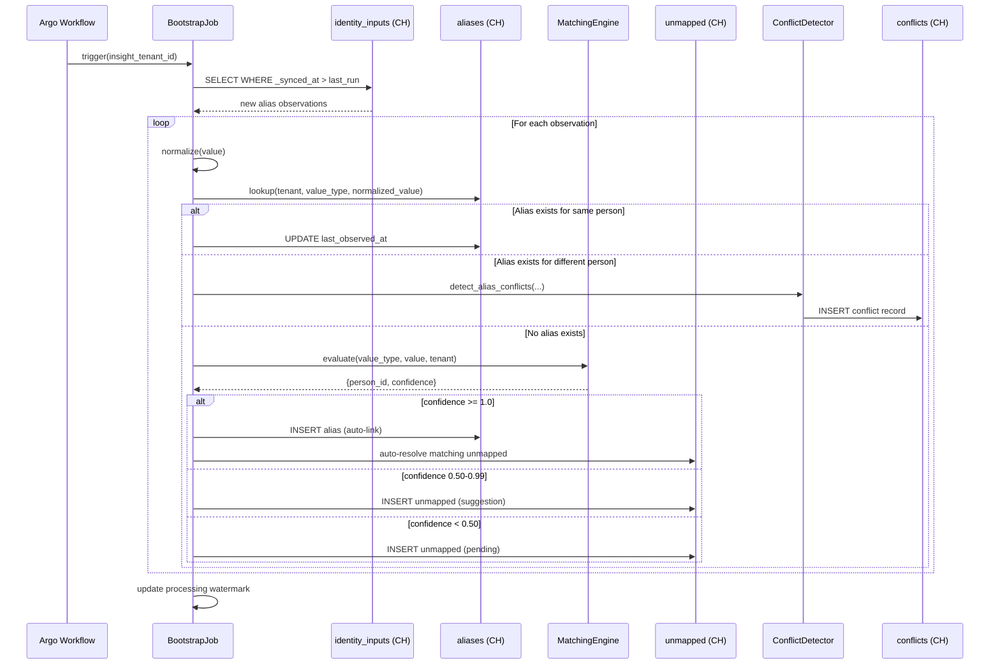
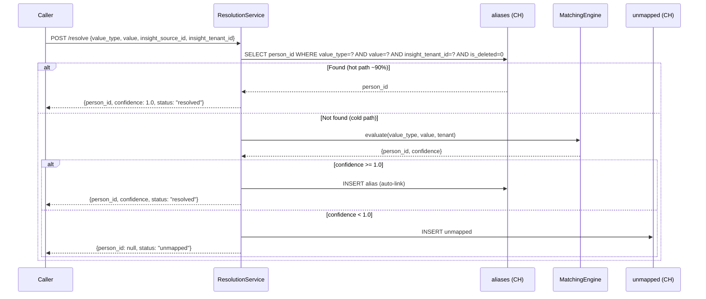
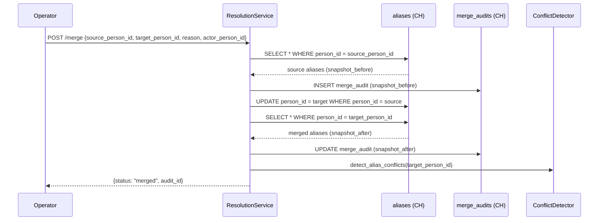

# Technical Design — Identity Resolution


<!-- toc -->

- [1. Architecture Overview](#1-architecture-overview)
  - [1.1 Architectural Vision](#11-architectural-vision)
  - [1.2 Architecture Drivers](#12-architecture-drivers)
  - [1.3 Architecture Layers](#13-architecture-layers)
- [2. Principles & Constraints](#2-principles--constraints)
  - [2.1 Design Principles](#21-design-principles)
  - [2.2 Constraints](#22-constraints)
- [3. Technical Architecture](#3-technical-architecture)
  - [3.1 Domain Model](#31-domain-model)
  - [3.2 Component Model](#32-component-model)
  - [3.3 API Contracts](#33-api-contracts)
  - [3.4 Internal Dependencies](#34-internal-dependencies)
  - [3.5 External Dependencies](#35-external-dependencies)
  - [3.6 Interactions & Sequences](#36-interactions--sequences)
  - [3.7 Database Schemas & Tables](#37-database-schemas--tables)
- [4. Additional Context](#4-additional-context)
  - [4.1 Min-Propagation Algorithm (ClickHouse-Native)](#41-min-propagation-algorithm-clickhouse-native)
  - [4.2 Matching Engine Phases](#42-matching-engine-phases)
  - [4.3 Merge and Split Operations](#43-merge-and-split-operations)
  - [4.4 ClickHouse Integration Patterns](#44-clickhouse-integration-patterns)
  - [4.5 End-to-End Walkthrough: Anna Ivanova](#45-end-to-end-walkthrough-anna-ivanova)
  - [4.6 End-to-End Walkthrough: Alexei Vavilov (Min-Propagation)](#46-end-to-end-walkthrough-alexei-vavilov-min-propagation)
  - [4.7 Deployment](#47-deployment)
  - [4.8 Operational Considerations](#48-operational-considerations)
- [5. Implementation Recommendations](#5-implementation-recommendations)
  - [REC-IR-01: ClickHouse atomicity for merge/split (Phase 3+)](#rec-ir-01-clickhouse-atomicity-for-mergesplit-phase-3)
  - [REC-IR-02: Incremental watermark for identity inputs (Phase 2)](#rec-ir-02-incremental-watermark-for-identity-inputs-phase-2)
  - [REC-IR-03: Shared unmapped table for all domains — RESOLVED](#rec-ir-03-shared-unmapped-table-for-all-domains--resolved)
  - [REC-IR-04: Temporary tenant and source ID derivation via sipHash128 (Phase 1)](#rec-ir-04-temporary-tenant-and-source-id-derivation-via-siphash128-phase-1)
  - [REC-IR-05: Explicit canonical id emission per connector (Phase 2)](#rec-ir-05-explicit-canonical-id-emission-per-connector-phase-2)
- [6. Traceability](#6-traceability)

<!-- /toc -->

- [ ] `p3` - **ID**: `cpt-insightspec-ir-design-identity-resolution`

> Version 2.0 — April 2026
> Rewrite: domain-split (identity-resolution only), ClickHouse-native, PR #55 naming conventions
---

## 1. Architecture Overview

### 1.1 Architectural Vision

Identity Resolution maps disparate identity signals — emails, usernames, employee IDs, platform-specific handles — from all connected source systems into canonical person records stored in the Person domain. It operates as the bridge between raw connector data and a unified person model: connectors emit alias observations into the `identity_inputs` table; the BootstrapJob processes those observations into the `aliases` table; and the ResolutionService exposes a query API for downstream consumers to resolve any alias to a `person_id`.

The analytical tables of this domain are ClickHouse-native — `identity_inputs`, `aliases`, `match_rules`, `unmapped`, `conflicts`, `merge_audits`, `alias_gdpr_deleted` all reside in ClickHouse. Merge/split atomicity, previously achieved via RDBMS transactions, is handled through idempotent operations and audit-trail patterns in ClickHouse (snapshot-before/after in `merge_audits`). SCD Type 2 history for org units is managed by dbt macros in the org-chart domain and is out of scope for this design.

In addition to the analytical ClickHouse store, this domain owns one MariaDB table — `persons` (see §3.7) — which records the history of identity-field observations per person in a CRUD-friendly, transactional store. The Person domain reads from it to build its golden record; it is initialised by a one-shot seed from `identity_inputs` (see ADR-0002) and maintained by operator edits and the Bootstrap Pipeline going forward.

This domain is deliberately narrow: it owns alias-to-person mapping and the `persons` identity-attribute history table. Golden record assembly, person-level conflict detection, availability, and org hierarchy all belong to the person and org-chart domains. Identity Resolution produces `aliases` rows and `persons` observations; the person domain consumes them.

### 1.2 Architecture Drivers


#### Functional Drivers

| Requirement | Design Response |
|---|---|
| Collect alias observations from all connectors | `identity_inputs` table — each connector writes one row per changed alias value |
| Resolve aliases to `person_id` | `ResolutionService` — hot-path lookup in `aliases`; cold-path evaluation via `match_rules` |
| Seed aliases from HR/directory sources | `BootstrapJob` reads `identity_inputs` since last run, creates/updates `aliases` rows |
| Configure matching rules per tenant | `match_rules` table — rule_type, weight, phase, is_enabled; operator-editable via API |
| Quarantine unresolvable aliases | `unmapped` table — pending queue with operator resolution workflow |
| Detect alias-level conflicts | `ConflictDetector` — writes to `conflicts` when same alias maps to multiple persons |
| Merge two person alias sets | `ResolutionService.merge()` — reassigns aliases + snapshot in `merge_audits` |
| Split a wrongly merged alias set | `ResolutionService.split()` — restores from `merge_audits.snapshot_before` |
| GDPR hard erasure of alias data | `ResolutionService.purge()` — moves alias rows to `alias_gdpr_deleted`, removes from `aliases` |

#### NFR Allocation

| NFR ID | NFR Summary | Allocated To | Design Response | Verification Approach |
|---|---|---|---|---|
| `cpt-insightspec-ir-nfr-alias-lookup-latency` | Alias lookup < 50 ms p99 | `aliases` table + ResolutionService | Direct ClickHouse lookup on ordered key `(insight_tenant_id, value_type, value)` | Benchmark with 10K/s lookup rate |
| `cpt-insightspec-ir-nfr-bootstrap-throughput` | Bootstrap processes 100K inputs/run | BootstrapJob | Batch processing with configurable chunk size; ClickHouse bulk inserts | Load test with 100K identity_inputs rows |
| `cpt-insightspec-ir-nfr-idempotency` | Bootstrap re-runs produce no duplicates | BootstrapJob | Natural key dedup on `(insight_tenant_id, value_type, value, insight_source_id)` in `aliases` | Run bootstrap 3x on same data; verify row counts |
| `cpt-insightspec-ir-nfr-no-fuzzy-autolink` | Zero false-positive merges from fuzzy rules | MatchingEngine | Fuzzy rules disabled by default; never trigger auto-link | Audit test: enable fuzzy; assert no auto-link |
| `cpt-insightspec-ir-nfr-tenant-isolation` | No cross-tenant data leaks | All tables | `insight_tenant_id` as first column in all ORDER BY keys | Cross-tenant resolution query returns empty |
| `cpt-insightspec-ir-nfr-gdpr-erasure` | Hard purge within SLA | ResolutionService.purge() | Move to `alias_gdpr_deleted`; remove from `aliases`; propagate `is_deleted` | Purge test; verify alias no longer resolvable |
| `cpt-insightspec-ir-nfr-merge-safety` | Merge/split operations are auditable and reversible | ResolutionService + merge_audits | Full snapshot_before/snapshot_after; idempotent operations | Merge + split round-trip test |

### 1.3 Architecture Layers

- [ ] `p3` - **ID**: `cpt-insightspec-ir-tech-layers`

```
┌──────────────────────────────────────────────────────────────────────────────┐
│                         IDENTITY RESOLUTION DOMAIN                           │
├──────────────────────────────────────────────────────────────────────────────┤
│                                                                              │
│  CONNECTORS              BOOTSTRAP INPUTS          ALIASES                   │
│  ──────────              ────────────────          ───────                   │
│                                                                              │
│  ┌──────────┐     ┌────────────────────┐     ┌──────────────────┐           │
│  │ GitLab   │────▶│                    │     │                  │           │
│  │ GitHub   │     │                    │     │    aliases        │           │
│  │ Jira     │     │  identity_inputs  │────▶│    (resolved)    │───────┐   │
│  │ BambooHR │     │  (alias signals)   │     │                  │       │   │
│  │ Zoom     │     │                    │     └──────────────────┘       │   │
│  │ M365     │────▶│                    │            │                   │   │
│  └──────────┘     └────────────────────┘            │                   │   │
│                            │                   ┌────▼─────┐             │   │
│                            │                   │unmapped  │             │   │
│                   ┌────────▼────────┐          │(pending) │             │   │
│                   │  BootstrapJob   │          └──────────┘             │   │
│                   │  MatchingEngine │                                   │   │
│                   │  ConflictDetect │     ┌──────────────┐             │   │
│                   └─────────────────┘     │  conflicts   │             │   │
│                                           │  merge_audits│             │   │
│                          API Layer        └──────────────┘             │   │
│                   ┌─────────────────┐                                  │   │
│                   │ResolutionService│◀─── POST /api/identity/resolve   │   │
│                   │  /api/identity/ │                                  │   │
│                   └─────────────────┘                                  │   │
│                                                                        │   │
│  ──── Cross-Domain ──────────────────────────────────────────────────  │   │
│                                                                        │   │
│       aliases.person_id ──FK──▶ persons.person_id (Person Domain) ◀───┘   │
│                                                                              │
└──────────────────────────────────────────────────────────────────────────────┘
```

| Layer | Responsibility | Technology |
|---|---|---|
| Ingestion | Connectors write alias observations to `identity_inputs` | ClickHouse (MergeTree) |
| Processing | BootstrapJob resolves inputs into aliases; MatchingEngine evaluates rules | Argo Workflows (Phase 2+, not yet built) |
| Storage (analytical) | aliases, match_rules, unmapped, conflicts, merge_audits | ClickHouse (ReplacingMergeTree, MergeTree) |
| Storage (identity history) | `persons` (observation history), `account_person_map` (stable account→person binding) | MariaDB (InnoDB) |
| API | Person lookup + migration runner | Rust (`identity-resolution` service, axum) |
| Cross-domain | `aliases.person_id` references `persons.person_id` in person domain | Logical FK (no physical constraint) |

---

## 2. Principles & Constraints

### 2.1 Design Principles

#### Alias-Centric Resolution

- [ ] `p2` - **ID**: `cpt-insightspec-ir-principle-alias-centric`

Identity resolution is fundamentally an alias mapping problem. Every identity signal from every source system is an alias — an `(value_type, value)` pair that maps to a person. The architecture treats all signals uniformly: an email, a username, an employee ID, and a platform-specific handle are all aliases with different types. This uniform treatment simplifies the resolution pipeline and makes adding new alias types a configuration change, not an architecture change.


#### Storage Split — ClickHouse Analytical + MariaDB Identity History

- [ ] `p2` - **ID**: `cpt-insightspec-ir-principle-ch-native`

Analytical identity-resolution tables (`identity_inputs`, `aliases`, `match_rules`, `unmapped`, `conflicts`, `merge_audits`, `alias_gdpr_deleted`) reside in ClickHouse. ClickHouse's ReplacingMergeTree provides last-writer-wins semantics for alias updates; merge/split safety is achieved through idempotent snapshot-based operations with full audit trails rather than ACID transactions.

Identity-attribute history (`persons`) and the stable source-account-to-`person_id` binding (`account_person_map`) live in MariaDB and are owned by the Rust `identity-resolution` service — transactional semantics and CRUD-friendly access are required there, and the dataset is tenant-metadata-scale rather than event-stream-scale. See §3.7 and ADR-0002 (stable `person_id` via account-to-person mapping) / ADR-0006 (service-owned migrations).


#### Domain Isolation

- [ ] `p2` - **ID**: `cpt-insightspec-ir-principle-domain-isolation`

Identity resolution owns alias-to-person mapping and the `persons` / `account_person_map` identity-history tables, and nothing else. Person-level golden-record assembly, person-level conflict detection, org hierarchy, and assignments belong to their respective domains. This boundary is enforced by table ownership: identity resolution writes only to its own tables and references `persons.person_id` as the logical FK target for aliases.


#### Fail-Safe Defaults

- [ ] `p2` - **ID**: `cpt-insightspec-ir-principle-fail-safe`

Unknown identities are quarantined in the `unmapped` table, never auto-linked below the confidence threshold. Pipeline execution continues; records with unresolved `person_id` are visible in analytics as `UNRESOLVED` but do not corrupt resolved data. The system never blocks data flow due to unresolved identities.


#### Conservative Matching

- [ ] `p2` - **ID**: `cpt-insightspec-ir-principle-conservative-matching`

Deterministic matching first (exact email, exact HR ID). Fuzzy matching is opt-in per rule and **never triggers auto-link** — always routes to human review. This decision is based on production experience: fuzzy name matching produced false-positive merges and was removed from the default ruleset.


### 2.2 Constraints

#### Storage Split: Analytical in ClickHouse, Identity-History in MariaDB

- [ ] `p2` - **ID**: `cpt-insightspec-ir-constraint-storage-split`

Analytical tables (`identity_inputs`, `aliases`, `match_rules`, `unmapped`, `conflicts`, `merge_audits`, `alias_gdpr_deleted`) are stored in ClickHouse — optimised for read-heavy analytical queries; merge/split atomicity is achieved through idempotent snapshot-based operations, not ACID transactions.

The identity-attribute history table (`persons`) is stored in MariaDB (see §3.7) — a CRUD-friendly transactional store is the right fit for row-level operator edits, audit trails, and the backend APIs that read it. Schema is owned and applied by the `identity-resolution` Rust service itself via its embedded SeaORM `Migrator` (see [ADR-0006](../../ingestion/specs/ADR/0006-service-owned-migrations.md)).


#### PR #55 Naming Conventions

- [ ] `p2` - **ID**: `cpt-insightspec-ir-constraint-naming`

All tables and columns follow the PR #55 glossary naming conventions:
- Table names: plural (`aliases`, `conflicts`, `match_rules`)
- PK: `id UUID DEFAULT generateUUIDv7()`
- Tenant: `insight_tenant_id UUID`
- Source: `insight_source_id UUID` + `insight_source_type LowCardinality(String)`
- Source account: `source_account_id String`
- Temporal: `effective_from` / `effective_to` (not valid_from/valid_to, owned_from/owned_until)
- Observation: `first_observed_at` / `last_observed_at` (not first_seen/last_seen)
- Actor: `actor_person_id UUID` (not performed_by VARCHAR)
- Timestamps: `DateTime64(3, 'UTC')`
- Soft-delete: `is_deleted UInt8`
- Booleans: `is_` prefix, `UInt8`
- Strings: `String` or `LowCardinality(String)` for low-cardinality
- No `Nullable` unless semantically needed; use empty string or zero sentinel
- Signal naming: `value_type` / `value` (not signal_type/signal_value)


#### Domain Boundary Constraints

- [ ] `p2` - **ID**: `cpt-insightspec-ir-constraint-domain-boundary`

Identity resolution owns:
- All `identity_inputs` / `aliases` / matching / conflict / merge tables in ClickHouse (§2.1, §3.x)
- The MariaDB `persons` identity-attribute history table (§3.7) and its one-shot seed (ADR-0002)

Identity resolution does NOT own or write to:
- The Person-domain **golden record** (derived from `persons` observations by the person domain)
- `person_availability` (person domain)
- `org_units` table (org-chart domain)
- `person_assignments` table (org-chart domain)
- Any permission/RBAC tables (separate domain)

The person domain reads `persons` observations to build its golden record; identity resolution links aliases to `person_id`s. `person_id` is a random UUIDv7 minted at first observation of each source-account and persisted in `account_person_map`; it is the stable join key across both domains and never re-derived from mutable attributes (see ADR-0002).


#### No Fuzzy Auto-Link

- [ ] `p2` - **ID**: `cpt-insightspec-ir-constraint-no-fuzzy-autolink`

Fuzzy matching rules (Jaro-Winkler, Soundex) MUST NEVER trigger automatic alias creation. They may only generate suggestions for human review. This constraint is non-negotiable after production incidents with false-positive merges.


#### Half-Open Temporal Intervals

- [ ] `p2` - **ID**: `cpt-insightspec-ir-constraint-half-open-intervals`

All temporal ranges use `[effective_from, effective_to)` half-open intervals. `effective_from` is inclusive (`>=`), `effective_to` is exclusive (`<`). `BETWEEN` is prohibited on temporal columns. `effective_to = '1970-01-01'` (zero sentinel) means "current / open-ended" in ClickHouse (no Nullable).


---

## 3. Technical Architecture

### 3.1 Domain Model

**Technology**: ClickHouse

**Core Entities**:

| Entity | Description | Key |
|---|---|---|
| `identity_inputs` | Alias observations from connectors — one row per changed alias value per source | `(insight_tenant_id, insight_source_id, value_type, value)` |
| `aliases` | Resolved alias-to-person mapping — many-to-one from source identifiers to `person_id` | `(insight_tenant_id, value_type, value, insight_source_id)` |
| `match_rules` | Configurable matching rules for the MatchingEngine | `id` |
| `unmapped` | Unresolvable alias queue — pending for operator resolution | `id` |
| `conflicts` | Alias-level attribute disagreements between sources | `id` |
| `merge_audits` | Full snapshot audit trail for merge/split operations | `id` |
| `alias_gdpr_deleted` | GDPR erasure archive — moved from `aliases` on purge | `id` |

**Relationships**:
- `identity_inputs` → (processed by BootstrapJob) → `aliases`
- `aliases.person_id` → `persons.person_id` (logical FK — stable identity, not the auto-increment row PK)
- `unmapped.resolved_person_id` → `persons.person_id` (logical FK)
- `conflicts.person_id` → `persons.person_id` (logical FK)
- `merge_audits.target_person_id` → `persons.person_id` (logical FK)

### 3.2 Component Model

```
┌───────────────────────────────────────────────────────────┐
│                  Identity Resolution                       │
│                                                            │
│  ┌──────────────┐    ┌────────────────┐                   │
│  │BootstrapJob  │───▶│MatchingEngine  │                   │
│  │(scheduled)   │    │(rule evaluator)│                   │
│  └──────┬───────┘    └───────┬────────┘                   │
│         │                    │                             │
│         ▼                    ▼                             │
│  ┌──────────────────────────────────────┐                 │
│  │       ResolutionService (API)        │                 │
│  │  POST /resolve  POST /merge  etc.   │                 │
│  └──────────────────┬───────────────────┘                 │
│                     │                                      │
│         ┌───────────▼───────────┐                         │
│         │  ConflictDetector     │                         │
│         │  (alias conflicts)    │                         │
│         └───────────────────────┘                         │
└───────────────────────────────────────────────────────────┘
```

#### BootstrapJob

- [ ] `p2` - **ID**: `cpt-insightspec-ir-component-bootstrap-job`

##### Why this component exists

Processes alias observations from `identity_inputs` into resolved `aliases` rows. Without it, the alias table remains empty and no resolution can happen. Runs on schedule (Argo Workflow) after connector syncs complete.

##### Responsibility scope

- Reads `identity_inputs` rows where `_synced_at > last_run` for the tenant.
- For each input: normalizes the alias value (email/username → `lower(trim())`; others → `trim()`).
- Looks up existing aliases matching `(insight_tenant_id, value_type, normalized_value)`.
- If no match found: evaluates MatchingEngine rules; if confidence ≥ threshold → creates alias linked to matched person; otherwise → inserts into `unmapped`.
- If match found: updates `last_observed_at`, `source_account_id` if changed.
- Auto-resolves `unmapped` entries that match newly created aliases.
- Records processing watermark for incremental runs.

##### Responsibility boundaries

- Does NOT create person records here. The MariaDB `persons` history is owned and written by the identity-resolution service itself via the `seed-persons-from-identity-input.py` one-shot script (ADR-0002) and, in future, operator merge/split flows. BootstrapJob assumes those records exist and only resolves aliases against them.
- Does NOT build golden records or detect person-level conflicts — those belong to the person domain (which reads `persons` and projects a golden view; see person-domain DESIGN).
- Does NOT expose API endpoints — that is ResolutionService.

##### Related components (by ID)

- `cpt-insightspec-ir-component-matching-engine` — called for cold-path alias evaluation
- `cpt-insightspec-ir-component-conflict-detector` — called when same alias maps to multiple persons

---

#### ResolutionService

- [ ] `p2` - **ID**: `cpt-insightspec-ir-component-resolution-service`

##### Why this component exists

Entry point for all alias resolution requests (hot path and cold path), merge/split operations, unmapped queue management, match rule configuration, and GDPR purge. Exposes the `/api/identity/` REST API.

##### Responsibility scope

- `resolve(value_type, value, insight_source_id, insight_tenant_id)` → `person_id` or null.
- Hot path: direct `aliases` table lookup (covers ~90% after bootstrap).
- Cold path: evaluates enabled `match_rules` via MatchingEngine; applies confidence thresholds.
- `batch_resolve([...])` — bulk resolution for pipeline enrichment.
- `merge(source_person_id, target_person_id, reason, actor_person_id)` — reassigns all aliases from source to target; snapshots before/after in `merge_audits`.
- `split(audit_id, actor_person_id)` — restores alias mappings from `merge_audits.snapshot_before`.
- `purge(person_id, actor_person_id)` — GDPR hard purge: moves aliases to `alias_gdpr_deleted`; removes from `aliases`.
- Unmapped queue: list, resolve (link to person or create new), ignore.
- Match rules: list, update (weight, config, is_enabled).
- Idempotency keys on mutating endpoints (`Idempotency-Key` header, 24h TTL).

##### Responsibility boundaries

- Does NOT run the BootstrapJob (scheduled separately via Argo).
- Does NOT manage person records, golden records, or person-level attributes.

##### Related components (by ID)

- `cpt-insightspec-ir-component-matching-engine` — called on cold-path resolution
- `cpt-insightspec-ir-component-conflict-detector` — called after merge to detect alias conflicts

---

#### MatchingEngine

- [ ] `p2` - **ID**: `cpt-insightspec-ir-component-matching-engine`

##### Why this component exists

Evaluates configurable match rules against candidate persons for cold-path resolution and suggestion generation. Separates matching logic from the resolution workflow.

##### Responsibility scope

- Loads enabled `match_rules` rows ordered by `sort_order`.
- Evaluates each rule (exact, normalization, cross_system, fuzzy) against the input alias.
- Computes composite confidence: `SUM(rule.weight * match_score) / SUM(all_rule.weight)`.
- Applies thresholds: `>= 1.0` → auto-link; `0.50–0.99` → suggestion; `< 0.50` → unmapped.
- Email normalization pipeline: lowercase → trim → remove plus-tags → apply domain aliases.
- Fuzzy rules (Jaro-Winkler, Soundex) are disabled by default; when enabled, NEVER trigger auto-link.

##### Responsibility boundaries

- Does NOT write to `aliases` directly — returns confidence + candidate `person_id` to caller (BootstrapJob or ResolutionService).

##### Related components (by ID)

- `cpt-insightspec-ir-component-resolution-service` — calls this on cold path
- `cpt-insightspec-ir-component-bootstrap-job` — calls this during input processing

---

#### ConflictDetector

- [ ] `p2` - **ID**: `cpt-insightspec-ir-component-conflict-detector`

##### Why this component exists

Detects alias-level conflicts — when the same alias value appears linked to different persons across sources, or when a merge operation would create contradictory alias mappings.

##### Responsibility scope

- `detect_alias_conflicts(value_type, value, insight_tenant_id)` — checks if the same `(value_type, value)` is claimed by multiple persons; writes to `conflicts` table.
- Called by BootstrapJob when a new alias observation matches an alias already owned by a different person.
- Called by ResolutionService after merge to verify no contradictory alias mappings were created.

##### Responsibility boundaries

- Does NOT detect person-level attribute conflicts (display_name disagreements, role disagreements) — that belongs to the person domain.
- Does NOT auto-resolve conflicts — creates a record for operator review.

##### Related components (by ID)

- `cpt-insightspec-ir-component-bootstrap-job` — calls this during input processing
- `cpt-insightspec-ir-component-resolution-service` — calls this after merge operations

---

### 3.3 API Contracts

- [ ] `p2` - **ID**: `cpt-insightspec-ir-interface-api`

- **Technology**: REST / HTTP JSON
- **Base path**: `/api/identity/`

**Endpoints Overview**:

| Method | Path | Description | Stability |
|---|---|---|---|
| `POST` | `/resolve` | Resolve single alias → `person_id` | stable |
| `POST` | `/batch-resolve` | Bulk resolution for pipeline enrichment | stable |
| `POST` | `/merge` | Merge two person alias sets | stable |
| `POST` | `/split` | Split (rollback) a previous merge by `audit_id` | stable |
| `GET` | `/unmapped` | List unmapped aliases (filterable by status) | stable |
| `POST` | `/unmapped/:id/resolve` | Link unmapped to existing person or create new | stable |
| `POST` | `/unmapped/:id/ignore` | Mark unmapped as ignored | stable |
| `GET` | `/persons/:id/aliases` | List all aliases for a person (cross-domain ref) | stable |
| `POST` | `/persons/:id/aliases` | Add alias manually | stable |
| `DELETE` | `/persons/:id/aliases/:alias_id` | Deactivate alias | stable |
| `GET` | `/rules` | List match rules | stable |
| `PUT` | `/rules/:id` | Update match rule (weight, config, is_enabled) | stable |
| `POST` | `/purge` | GDPR hard purge for a person's aliases | stable |

**`POST /resolve` request / response**:

```json
// Request
{
  "value_type": "email",
  "value": "john.smith@corp.com",
  "insight_source_id": "550e8400-e29b-41d4-a716-446655440000",
  "insight_source_type": "gitlab",
  "insight_tenant_id": "660e8400-e29b-41d4-a716-446655440001"
}

// Response (resolved)
{ "person_id": "uuid-1234", "confidence": 1.0, "status": "resolved" }

// Response (unmapped)
{ "person_id": null, "status": "unmapped" }
```

**Error codes**:

| HTTP | Error | Condition |
|---|---|---|
| 400 | `invalid_value_type` | Unknown alias type |
| 404 | `audit_not_found` | Split attempted on missing audit record |
| 409 | `merge_conflict` | Circular merge detected |
| 409 | `already_rolled_back` | Split attempted on already-rolled-back audit record |
| 409 | `alias_already_exists` | Duplicate alias creation attempt |

---

### 3.4 Internal Dependencies

| Dependency Module | Interface Used | Purpose |
|---|---|---|
| Identity-resolution `persons` (MariaDB) | Logical FK (`aliases.person_id → persons.person_id`) | Alias-to-person mapping target. Owned and written by this domain via the seed (ADR-0002) and future operator flows; the person domain reads from it to build its golden record |
| Identity-resolution seed | One-shot Python script | Initial population of `persons` from `identity_inputs`; runs at bootstrap (and again on operator demand for new connectors). See ADR-0002 |
| Connector sync events | Argo Workflow trigger | BootstrapJob runs after connector sync completes |
| dbt models (Bronze → Silver) | ClickHouse tables | Connectors populate `identity_inputs` via `identity_inputs_from_history` macro applied to `fields_history` models |

**Dependency Rules**:
- No circular dependencies between identity-resolution and person domains
- Identity resolution writes only to its own tables; references person domain via logical FK
- Person domain does not depend on identity resolution internals; only consumes `aliases` as read

---

### 3.5 External Dependencies

#### ClickHouse (Storage Engine)

| Aspect | Value |
|---|---|
| Engine | All tables use MergeTree family (ReplacingMergeTree for aliases, MergeTree for others) |
| Version | 24.x+ (for `generateUUIDv7()` support) |
| Access | Direct read/write from ResolutionService and BootstrapJob |
| Connection | Native ClickHouse protocol (clickhouse-driver) or HTTP interface |

#### Argo Workflows (Orchestration)

| Aspect | Value |
|---|---|
| Purpose | Schedules BootstrapJob runs after connector syncs |
| Trigger | Post-sync workflow completion event |
| Environment | Kind K8s cluster (per PR #45 migration) |

---

### 3.6 Interactions & Sequences

#### Bootstrap Input Processing

**ID**: `cpt-insightspec-ir-seq-bootstrap-processing`



---

#### Alias Resolution (Hot Path)

**ID**: `cpt-insightspec-ir-seq-resolve-hot`



---

#### Merge Operation

**ID**: `cpt-insightspec-ir-seq-merge`



---

### 3.7 Database Schemas & Tables

- [ ] `p3` - **ID**: `cpt-insightspec-ir-db-schemas`

Analytical tables (`identity_inputs`, `aliases`, `match_rules`, `unmapped`, `conflicts`, `merge_audits`, `alias_gdpr_deleted`) are in ClickHouse; identity-history tables (`persons`, `account_person_map`) are in MariaDB and owned by the Rust `identity-resolution` service (see §3.7, ADR-0002, ADR-0006). Naming follows PR #55 conventions. For ClickHouse tables: no Nullable unless semantically required; use empty string (`''`) or zero sentinel (`'1970-01-01'`) instead.

#### Table: `identity_inputs`

**ID**: `cpt-insightspec-ir-dbtable-identity-inputs`

Alias observations from connectors. Each row represents one changed alias value from one source.

**Population mechanism**: Connectors populate this table via dbt models using the shared `identity_inputs_from_history` macro. Each connector declares:
- `identity_fields` — mapping of source field names to alias types (e.g., `workEmail → email`, `employeeNumber → employee_id`)
- `deactivation_condition` — SQL expression that detects entity deactivation (e.g., `field_name = 'status' AND new_value = 'Inactive'`), which emits DELETE rows for all identity fields

The macro reads from the connector's `fields_history` model (field-level change log from snapshots) and produces:
- **UPSERT** rows when an identity-relevant field changes
- **DELETE** rows (with empty `value`) when the deactivation condition is met

Per-connector staging tables (e.g., `staging.bamboohr__identity_inputs`) are unified into a single `identity.identity_inputs` view via `union_by_tag('silver:identity_inputs')`.

The models are incremental (`append` strategy): each run processes only `fields_history` rows with `updated_at` newer than the last `_synced_at` in the target table.

| Column | Type | Description |
|---|---|---|
| `id` | `UUID DEFAULT generateUUIDv7()` | PK |
| `insight_tenant_id` | `UUID` | Tenant isolation |
| `insight_source_id` | `UUID` | Source system ID from connector config |
| `insight_source_type` | `LowCardinality(String)` | Source type (e.g., `bamboohr`, `gitlab`, `zoom`) |
| `source_account_id` | `String` | Raw account ID from the external system |
| `value_type` | `LowCardinality(String)` | `id`, `email`, `username`, `employee_id`, `display_name`, `platform_id` |
| `value` | `String` | The alias value as received from source |
| `value_field_name` | `String` | Fully-qualified source field: `bronze_{descriptor.name}.{table}.{field}[.json_path]` |
| `operation_type` | `LowCardinality(String)` | `UPSERT` or `DELETE` |
| `effective_from` | `DateTime64(3, 'UTC')` | When this alias became effective (optional; `'1970-01-01'` if unknown) |
| `effective_to` | `DateTime64(3, 'UTC')` | When this alias ceased (optional; `'1970-01-01'` if still active) |
| `_synced_at` | `DateTime64(3, 'UTC')` | Ingestion timestamp |
| `created_at` | `DateTime64(3, 'UTC')` | Row creation time |

**PK**: `id`

**ORDER BY**: `(insight_tenant_id, insight_source_id, value_type, value, _synced_at)`

**Engine**: `MergeTree`

**Normalization rules**: email/username → `lower(trim())`; others → `trim()`. Applied by BootstrapJob at read time, not at write time (raw values preserved in this table).

**Example**:

| insight_tenant_id | insight_source_id | insight_source_type | source_account_id | value_type | value | value_field_name | operation_type |
|---|---|---|---|---|---|---|---|
| `t-001` | `src-bamboo` | `bamboohr` | `E123` | `email` | `anna.ivanova@acme.com` | `bronze_bamboohr.employees.workEmail` | `UPSERT` |
| `t-001` | `src-bamboo` | `bamboohr` | `E123` | `employee_id` | `E123` | `bronze_bamboohr.employees.id` | `UPSERT` |
| `t-001` | `src-gitlab` | `gitlab` | `42` | `email` | `anna.ivanova@acme.com` | `bronze_gitlab.users.email` | `UPSERT` |
| `t-001` | `src-gitlab` | `gitlab` | `42` | `username` | `aivanova` | `bronze_gitlab.users.username` | `UPSERT` |

---

#### Table: `aliases`

**ID**: `cpt-insightspec-ir-dbtable-aliases`

Resolved alias-to-person mapping. Each row links one `(value_type, value)` from one source to one person.

| Column | Type | Description |
|---|---|---|
| `id` | `UUID DEFAULT generateUUIDv7()` | PK |
| `insight_tenant_id` | `UUID` | Tenant isolation |
| `person_id` | `UUID` | Logical FK → `persons.person_id` |
| `value_type` | `LowCardinality(String)` | `id`, `email`, `username`, `employee_id`, `display_name`, `platform_id` |
| `value` | `String` | Normalized alias value |
| `value_field_name` | `String` | Fully-qualified source field path (from identity_inputs) |
| `insight_source_id` | `UUID` | Source system that provided this alias |
| `insight_source_type` | `LowCardinality(String)` | Source type |
| `source_account_id` | `String` | Raw account ID in the source system |
| `confidence` | `Float32` | Match confidence (1.0 = exact) |
| `is_active` | `UInt8` | 1 = active, 0 = deactivated |
| `effective_from` | `DateTime64(3, 'UTC')` | When this alias mapping became effective |
| `effective_to` | `DateTime64(3, 'UTC')` | When this alias mapping ceased (`'1970-01-01'` = current) |
| `first_observed_at` | `DateTime64(3, 'UTC')` | First time this alias was seen from this source |
| `last_observed_at` | `DateTime64(3, 'UTC')` | Last time this alias was confirmed from this source |
| `created_at` | `DateTime64(3, 'UTC')` | Row creation time |
| `updated_at` | `DateTime64(3, 'UTC')` | Last modification time |
| `is_deleted` | `UInt8` | Soft-delete flag (0 = active, 1 = deleted) |

**PK**: `id`

**ORDER BY**: `(insight_tenant_id, value_type, value, insight_source_id, id)`

**Engine**: `ReplacingMergeTree(updated_at)`

**Constraints**:
- Logical uniqueness: one active alias per `(insight_tenant_id, value_type, value, insight_source_id)` at any time — enforced at application level since ClickHouse lacks unique constraints
- `is_deleted = 1` rows are excluded from resolution lookups

**Example**:

| insight_tenant_id | person_id | value_type | value | insight_source_type | confidence | is_active |
|---|---|---|---|---|---|---|
| `t-001` | `p-1001` | `email` | `anna.ivanova@acme.com` | `bamboohr` | 1.0 | 1 |
| `t-001` | `p-1001` | `employee_id` | `E123` | `bamboohr` | 1.0 | 1 |
| `t-001` | `p-1001` | `username` | `aivanova` | `gitlab` | 0.95 | 1 |

---

#### Table: `persons` (MariaDB)

**ID**: `cpt-insightspec-ir-dbtable-persons-mariadb`

Identity-attribute observation history for persons, stored in MariaDB. Each row represents one observed value of one named attribute for one source-account at one moment in time — an SCD-style append-only log. Every connector emits a `value_type='id'` observation (value = `source_account_id`) in addition to its attribute observations, which makes `persons` the **authoritative source of truth** for the account→person binding (see ADR-0002). Attribute value types include `id` (binding anchor), `email`, `display_name`, `employee_id`, `platform_id`, and is extensible to any custom field (e.g., `functional_team`).

**Database**: MariaDB, database `identity` — dedicated to identity-resolution-domain tables, reached via the service's `database_url` configuration. The service does not assume co-location with any other MariaDB database; any other service owning MariaDB tables configures its own connection independently. Each backend service owns and applies its own schema — see [ADR-0006](../../ingestion/specs/ADR/0006-service-owned-migrations.md).

**DDL**: `src/backend/services/identity/src/Insight.Identity.Infrastructure/Migrations/001_persons.sql` (applied at service startup via DbUp)

##### Columns

| Column | Type | Description |
|---|---|---|
| `id` | `BIGINT UNSIGNED AUTO_INCREMENT` | PK (row identifier for operator references) |
| `value_type` | `VARCHAR(50) NOT NULL` | Attribute kind — canonical: `id`, `email`, `username`, `display_name`. Known custom: `employee_id`, `platform_id`, etc. (free-form, extensible) |
| `insight_source_type` | `VARCHAR(100) NOT NULL` | Source system: `bamboohr`, `zoom`, `cursor`, `claude_admin`, `gitlab`, etc. |
| `insight_source_id` | `BINARY(16) NOT NULL` | Connector instance UUID (temporary: sipHash128 from Bronze string `source_id` until `sources` table exists — see REC-IR-04) |
| `insight_tenant_id` | `BINARY(16) NOT NULL` | Tenant UUID (temporary: sipHash128 from Bronze string `tenant_id` until `tenants` table exists — see REC-IR-04) |
| `value_id` | `VARCHAR(320) COLLATE utf8mb4_bin NULL` | Value for `value_type IN ('id', 'email', 'username')`. Strict byte comparison; hot-path lookup target. Size 320 covers RFC 5321/5322 email maximum (64 local + `@` + 255 domain). `username` is id-like (case-sensitive in most platforms) and routes here for strict-equality lookup |
| `value_full_text` | `VARCHAR(512) COLLATE utf8mb4_unicode_ci NULL` | Value for `value_type='display_name'`. Case- and accent-insensitive collation for operator search; leaves room for future FULLTEXT index |
| `value` | `TEXT NULL` | Catch-all value for any other `value_type` (e.g., `employee_id`, `platform_id`, `functional_team`, custom attributes). Not directly indexed |
| `value_effective` | `TEXT GENERATED ALWAYS AS (COALESCE(value_id, value_full_text, value)) STORED` | Human-readable coalesce of the three value columns; **not indexed** (display only). Use it from SELECTs when you want the actual value without knowing the routing rules |
| `value_hash` | `CHAR(64) COLLATE ascii_bin GENERATED ALWAYS AS (SHA2(COALESCE(value_id, value_full_text, value), 256)) STORED` | SHA-256 hex of the routed value. Fixed-width, fully indexable, collision-free regardless of value length. Used in the natural-key UNIQUE so `INSERT IGNORE` re-runs are idempotent even for catch-all `TEXT` values longer than any prefix limit |
| `person_id` | `BINARY(16) NOT NULL` | Person UUID (random UUIDv7). Stable; never re-derived from attribute values. See ADR-0002 |
| `author_person_id` | `BINARY(16) NOT NULL` | Person UUID of who/what made this change. Sentinel `00000000-0000-0000-0000-000000000000` = auto-minted by seed; real operator UUIDs for future merge/split flows |
| `reason` | `TEXT NOT NULL DEFAULT ''` | Optional change-reason comment. Empty for normal seed observations; `pending-iresolution` flags rows produced when an unknown account's email already exists in `persons` (see ADR-0002 §6) |
| `created_at` | `TIMESTAMP(6) NOT NULL DEFAULT CURRENT_TIMESTAMP(6)` | When this record was inserted (microsecond precision; MariaDB stores `TIMESTAMP` internally as UTC). The seed sets it from each observation's `identity_inputs._synced_at`, not from the seed wall-clock, so chronology in `persons` reflects when the source actually saw each value |

**Hardcoded routing by `value_type`** (applied in seed + dbt macro):

| `value_type` values | target column |
|---|---|
| `id`, `email`, `username` | `value_id` |
| `display_name` | `value_full_text` |
| anything else | `value` |

Exactly one of `(value_id, value_full_text, value)` is populated per normal row; the other two are NULL. All-three-NULL is reserved for future "attribute unset at source" events (not emitted by the initial seed).

**UUID representation**: all UUID columns are stored as `BINARY(16)` (SeaORM `.uuid()` default on MariaDB, matches `analytics-api` convention). Python clients must pass **`uuid.UUID.bytes`** (the 16-byte raw form) — passing the `uuid.UUID` object directly makes the driver fall back to `str(UUID)` (36 chars) which `BINARY(16)` silently truncates to ASCII, corrupting the column. For human-readable reads in SQL use `CAST(col AS UUID)` (MariaDB 10.7+) or build the textual form from `HEX(col)`. Note: MySQL 8's `BIN_TO_UUID()` is **not** available in MariaDB.

**Primary key**: `id` (auto-increment integer — MariaDB convention for append-only observation history).

**Indexes**:
- `idx_value_id (insight_tenant_id, value_type, value_id)` — hot-path reverse lookup: find person(s) by id / email. Full column indexed (320 × 4 bytes utf8mb4 = 1280 bytes, well under InnoDB's 3072-byte key budget)
- `idx_value_full_text (insight_tenant_id, value_type, value_full_text)` — secondary lookup by display name. Full column indexed (512 × 4 bytes = 2048 bytes, still within budget). Collation `utf8mb4_unicode_ci` enables case/accent-insensitive search
- `idx_person_id (person_id)` — list all attributes for a person
- `idx_tenant_person (insight_tenant_id, person_id)` — tenant-scoped person lookup
- `idx_source (insight_source_type, insight_source_id)` — filter by source system + instance
- `uq_person_observation (insight_tenant_id, person_id, insight_source_type, insight_source_id, value_type, value_hash)` UNIQUE — enforces the natural observation key. The generated `value_hash` column (SHA-256 hex of the coalesced value) gives a fixed-width, collision-free discriminator regardless of value length, which is required because (a) MariaDB treats `NULL` as distinct in UNIQUE keys and (b) catch-all `TEXT` values cannot be fully indexed by prefix without truncation collisions. Combined with `INSERT IGNORE` in the seed, this guarantees idempotent re-runs

##### Semantics — append-only observation history (SCD-style)

`persons` is **append-only**. A change to a person's attribute does **not** update an existing row; it inserts a new row with a later `created_at`. The "current" value of any field is the row with the latest `created_at` for that `(insight_tenant_id, person_id, value_type)` triple (or, for multi-valued fields, the latest non-empty row per source).

Field-change example for a single person (`p-1001`) — the populated value column depends on `value_type` per the hardcoded routing:

| id | value_type | value_id | value_full_text | value | insight_source_type | created_at |
|---|---|---|---|---|---|---|
| 1 | `id` | `bamboo-emp-1001` | NULL | NULL | `bamboohr` | 2026-04-01 |
| 2 | `email` | `anna.ivanova@acme.com` | NULL | NULL | `bamboohr` | 2026-04-01 |
| 5 | `display_name` | NULL | `Anna Ivanova` | NULL | `bamboohr` | 2026-04-01 |
| 8 | `employee_id` | NULL | NULL | `CKSGP0042` | `bamboohr` | 2026-04-01 |
| 120 | `display_name` | NULL | `Anna Ivanova-Petrova` | NULL | `bamboohr` | 2026-07-15 |

Row 120 supersedes row 5 as the current `display_name` for person `p-1001` (latest by `created_at`); row 5 is retained as history. Row 1 (the `value_type='id'` binding) is emitted automatically by the connector's dbt macro on every activity — on first sync it anchors the account→person binding; on subsequent syncs it is deduped by the UNIQUE key.

---

#### Table: `account_person_map` (MariaDB)

**ID**: `cpt-insightspec-ir-dbtable-account-person-map`

**SCD2 materialized cache** of the source-account → `person_id` binding, derived deterministically from `persons` rows where `value_type='id'`. Never the source of truth; rebuilt from scratch at the end of every seed run (and by future operator flows). Exists purely for fast lookup and temporal "as of date T" queries — equivalent to a window-function scan over `persons.value_type='id'`, but O(1)–O(rows-in-tenant) instead of O(observations-in-tenant).

**Database**: MariaDB, database `identity` (same as `persons`). Defined in `src/backend/services/identity/src/Insight.Identity.Infrastructure/Migrations/002_account_person_map.sql` (applied at service startup via DbUp).

##### Columns

| Column | Type | Description |
|---|---|---|
| `insight_tenant_id` | `BINARY(16) NOT NULL` | Tenant UUID |
| `insight_source_type` | `VARCHAR(100) NOT NULL` | Source system: `bamboohr`, `zoom`, etc. |
| `insight_source_id` | `BINARY(16) NOT NULL` | Connector instance UUID |
| `source_account_id` | `VARCHAR(320) NOT NULL` | Source-native account identifier (same type as `persons.value_id`, same domain) |
| `person_id` | `BINARY(16) NOT NULL` | Person UUID (random UUIDv7); derived from `persons.person_id` of the opening observation |
| `author_person_id` | `BINARY(16) NOT NULL` | Forwarded from the `persons` observation. Sentinel `00000000-0000-0000-0000-000000000000` = auto-minted by seed |
| `reason` | `VARCHAR(50) NOT NULL` | `initial-bootstrap` \| `new-account` \| `operator-merge` \| ... — forwarded from the `persons` observation |
| `valid_from` | `TIMESTAMP(6) NOT NULL` | When this binding became current (microsecond precision; = `created_at` of the opening `persons` observation). Sub-second precision is required because `valid_from` is part of the PRIMARY KEY — second-level resolution would risk PK collisions for closely-spaced events |
| `valid_to` | `TIMESTAMP(6) NULL` | When this binding ended (= next observation's `created_at`). `NULL` = currently active binding |

**Primary key**: `(insight_tenant_id, insight_source_type, insight_source_id, source_account_id, valid_from)` — one row per historical binding period. An account with N historical bindings has N rows; the latest has `valid_to = NULL`.

**Indexes**:
- `idx_current (insight_tenant_id, insight_source_type, insight_source_id, source_account_id, valid_to)` — fast "current binding" lookup via `WHERE valid_to IS NULL`
- `idx_person_id (person_id)` — list all accounts currently bound to a person
- `idx_tenant_person (insight_tenant_id, person_id)` — tenant-scoped person accounts
- `idx_valid_from (insight_tenant_id, valid_from)` — "bindings changed in date range" queries for dashboards

##### Semantics

- `persons` is the **source of truth**; `account_person_map` is **derived**. Drift is impossible by construction because rebuild re-derives every row from `persons`.
- **"Current binding"**: `WHERE valid_to IS NULL`.
- **"Binding as of date T"**: `WHERE valid_from <= T AND (valid_to > T OR valid_to IS NULL)` — one row per source-account, O(log N) range lookup.
- **"Full history of an account"**: all rows with the account's PK tuple, ordered by `valid_from`.
- **Rebuild** (at the end of every seed run + every future operator flow) — **atomic two-table swap**. MariaDB `TRUNCATE` is DDL and implicitly commits, so it cannot participate in a transaction; the seed builds the new state into a sibling `account_person_map_next` and atomically swaps with `RENAME TABLE`:
  ```sql
  CREATE TABLE account_person_map_next LIKE account_person_map;

  INSERT INTO account_person_map_next
      (insight_tenant_id, insight_source_type, insight_source_id, source_account_id,
       person_id, author_person_id, reason, valid_from, valid_to)
  SELECT
      insight_tenant_id, insight_source_type, insight_source_id,
      value_id AS source_account_id,
      person_id, author_person_id, reason,
      created_at AS valid_from,
      LEAD(created_at) OVER (
          PARTITION BY insight_tenant_id, insight_source_type, insight_source_id, value_id
          ORDER BY created_at
      ) AS valid_to
  FROM persons WHERE value_type = 'id' AND value_id IS NOT NULL;

  RENAME TABLE
      account_person_map      TO account_person_map_old,
      account_person_map_next TO account_person_map;
  DROP TABLE account_person_map_old;
  ```
  The `RENAME TABLE` pair is atomic in MariaDB; concurrent readers see either the old or the new map, never an empty intermediate.

See ADR-0002 for the full decision record (why a derived cache instead of a second authoritative table, alternatives considered).

---

##### Initial seed (idempotent upsert from `identity_inputs`)

**Scripts** — two-file split by separation of concerns, colocated with the identity-resolution service at `src/backend/services/identity/seed/`:

| File | Role | Responsibilities |
|---|---|---|
| `seed-persons.sh` | Environment orchestrator (bash) | Resolve ClickHouse password from the `clickhouse-credentials` K8s secret (fallback to env); compute `MARIADB_URL` from local-cluster defaults (URL-encoded credentials); start `kubectl port-forward svc/insight-mariadb 3306:3306` if port 3306 is not open; `pip install pymysql` if missing; invoke the Python script. Does **not** apply DDL. |
| `seed-persons-from-identity-input.py` | Pure data transform (Python) | HTTP-read `identity.identity_inputs` from ClickHouse (`FORMAT JSONEachRow`) with a bounded timeout; load known bindings (`value_type='id'` rows) + existing emails (`value_type='email'` rows) from `persons`; assign `person_id` per account via three-mode logic (known / initial-bootstrap / steady-state-new); `INSERT IGNORE` observations into `persons`; rebuild `account_person_map` from `persons` as SCD2. Reports counts for each mode and skip reason. |

**Rationale for the split**:
- Bash is the right tool for kubectl, port-forwards, and secret lookup. Python is the right tool for typed grouping, mapping lookup, UUID minting, and parameterised DB writes.
- The Python script is **independently runnable** — set `CLICKHOUSE_*` and `MARIADB_URL` env vars, ensure the DDL is already applied (by the identity-resolution service startup / `migrate` subcommand), and run `python3 seed-persons-from-identity-input.py`. Used by CI, by non-Kind environments, and for dry runs.
- The Python script is **testable in isolation** — the ClickHouse HTTP call and the pymysql connection are the only external dependencies and are trivially mockable; bash is not.

**Schema ownership**: the `persons` and `account_person_map` table DDL
lives inside the identity service at
`src/backend/services/identity/src/Insight.Identity.Infrastructure/Migrations/`
(`001_persons.sql`, `002_account_person_map.sql`) and is applied by the
service's own DbUp migrator at startup. See
[ADR-0006](../../ingestion/specs/ADR/0006-service-owned-migrations.md)
for the service-owned-migrations policy. The seed scripts here operate
on the already-created tables; they never issue `CREATE`, `ALTER`,
`TRUNCATE`, or `DELETE`.

**Process** (data flow executed by the Python script):

1. Read all rows from `identity.identity_inputs` (ClickHouse) where `operation_type = 'UPSERT'` and `value` is non-empty. Order by `_synced_at DESC` within each source-account so that the latest email observation is picked deterministically in step 5.
2. Group observations by `(insight_tenant_id, insight_source_type, insight_source_id, source_account_id)` — a "source account" = one user in one connector instance.
3. Connect to MariaDB. Load known bindings: for each source-account key, find the latest `value_type='id'` observation in `persons` and capture its `person_id`. This becomes the **known-account** set.
4. Load existing emails: run `SELECT insight_tenant_id, LOWER(TRIM(value_id)) FROM persons WHERE value_type='email' AND value_id IS NOT NULL AND value_id != ''` and collect into a `(tenant, normalized_email)` set. The set is empty on the very first run (initial bootstrap) and non-empty afterwards; the same code path handles both — there is no mode flag.
5. For each source-account in `identity_inputs`:
   - **Known account** (present in step 3 set): reuse the mapped `person_id`. Observations go to `persons` via `INSERT IGNORE` (dedupe on UNIQUE key); no new binding.
   - **Unknown account, no email observed**: skip. Email remains the sole identity anchor for this seed.
   - **Unknown account, email absent from step 4 set**: mint a new `person_id` (random UUIDv7). `reason=''`. Within the same run, two new accounts sharing this new email still share one `person_id` (email-automerge within the run); on a fresh-tenant run this is the initial-bootstrap behaviour as a special case.
   - **Unknown account, email already present in step 4 set**: **mint a fresh isolated `person_id`** (visibly NOT merged with the existing email-bearer) and write all observations with `reason='pending-iresolution'`. Each pending account gets its own `person_id` (no intra-run automerge among pending accounts), so the future Identity-Resolution operator flow has per-account granularity. The IRes flow scans for `reason='pending-iresolution'` rows and prompts a per-account decision (link to existing email-bearer / keep separate / merge).
6. Write observations to `persons` via `INSERT IGNORE`. Routing rules (hardcoded in the seed, mirrored by the dbt macro):
   - `value_type IN ('id', 'email')` → `value_id = value`, others NULL
   - `value_type = 'display_name'` → `value_full_text = value`, others NULL
   - otherwise → `value = value`, others NULL

   `author_person_id` is the all-zero sentinel `00000000-0000-0000-0000-000000000000` for auto-minted bindings; the `uq_person_observation` UNIQUE key (on `value_hash`) dedupes re-runs. `created_at` is taken from each observation's `identity_inputs._synced_at`, not from the seed wall-clock, so chronology in `persons` reflects the source's view of when each value was seen.
7. **Rebuild `account_person_map`** from `persons.value_type='id'` observations via `TRUNCATE` + `INSERT ... SELECT ... LEAD()` (see the account_person_map Semantics block for the SQL). Atomic single transaction. Drift relative to `persons` is impossible by construction.

**Re-run semantics**: idempotent on `persons` (UNIQUE key dedupe), bit-identical on `account_person_map` (deterministic rebuild from same `persons` state). Adding a new source between runs creates new accounts; steady-state mode decides each one (skip-existing-email or new-person).

See [ADR-0002](ADR/0002-stable-person-id-via-persons-observations.md) for the full decision record.

**Safety / idempotency**:
- Re-running the script is **safe**: the `account_person_map` lookup keeps `person_id` stable across runs, and `INSERT IGNORE` on `persons` skips duplicates.
- Steady-state re-runs with new sources **do not auto-merge** the new sources' accounts into existing persons — each gets a fresh `person_id`. Merging is an operator-driven workflow (future work).
- The script never issues `TRUNCATE`, `DELETE`, or `UPDATE` against `persons`. `account_person_map` is rebuilt via an atomic rename-swap (`CREATE account_person_map_next` → `INSERT ... LEAD()` → `RENAME TABLE account_person_map TO account_person_map_old, account_person_map_next TO account_person_map` → `DROP TABLE IF EXISTS account_person_map_old`); the rename is the only window where readers see the cache change, and it is atomic. Wipe-and-reseed of `persons` is an explicit operator action outside this script.

**Prerequisites and ordering** (end-to-end bootstrap):

1. Connector secrets applied (`./secrets/apply.sh`).
2. `./dev-up.sh` (or the canonical `deploy/scripts/install.sh`) — installs Airbyte + Argo Workflows + the Insight umbrella chart. The umbrella's `identity-db-init-job` Helm pre-install Job provisions the `identity` MariaDB database and grants. The identity-resolution pod then starts and applies its sea-orm migrations (including the `persons` table) at startup via `run_migrations(&db)` in `main.rs`.
3. `./src/ingestion/run-init.sh` — runs ClickHouse migrations, registers connectors, creates Airbyte connections, syncs Argo flows.
4. Airbyte sync produces Bronze data (`./sync-all.sh` + wait).
5. dbt models run to populate `identity.identity_inputs` (`dbt run --select +identity_inputs`).
6. Seed run (`./src/backend/services/identity/seed/seed-persons.sh`) — invokes the Python seed.

---

#### Table: `match_rules`

**ID**: `cpt-insightspec-ir-dbtable-match-rules`

Configurable matching rules evaluated by the MatchingEngine.

| Column | Type | Description |
|---|---|---|
| `id` | `UUID DEFAULT generateUUIDv7()` | PK |
| `insight_tenant_id` | `UUID` | Tenant isolation |
| `name` | `String` | Human-readable rule name (unique per tenant) |
| `rule_type` | `LowCardinality(String)` | `exact`, `normalization`, `cross_system`, `fuzzy` |
| `weight` | `Float32` | Rule weight for composite confidence |
| `is_enabled` | `UInt8` | 1 = enabled, 0 = disabled |
| `phase` | `LowCardinality(String)` | `B1`, `B2`, `B3` |
| `condition_type` | `LowCardinality(String)` | `email_exact`, `email_normalize`, `username_cross`, `name_fuzzy`, etc. |
| `config` | `String` | JSON — rule-specific parameters |
| `sort_order` | `UInt32` | Evaluation order |
| `actor_person_id` | `UUID` | Who last modified this rule |
| `created_at` | `DateTime64(3, 'UTC')` | Row creation time |
| `updated_at` | `DateTime64(3, 'UTC')` | Last modification time |

**PK**: `id`

**ORDER BY**: `(insight_tenant_id, sort_order, id)`

**Engine**: `ReplacingMergeTree(updated_at)`

---

#### Table: `unmapped`

**ID**: `cpt-insightspec-ir-dbtable-unmapped`

Observations that could not be resolved above the confidence threshold. Shared by identity-resolution domain (alias-level) and person domain (person-attribute-level) — differentiated by `value_type` values. Pending operator review.

| Column | Type | Description |
|---|---|---|
| `id` | `UUID DEFAULT generateUUIDv7()` | PK |
| `insight_tenant_id` | `UUID` | Tenant isolation |
| `insight_source_id` | `UUID` | Source system ID |
| `insight_source_type` | `LowCardinality(String)` | Source type |
| `source_account_id` | `String` | Raw account ID from the source system |
| `value_type` | `LowCardinality(String)` | Value type (identity: `id`, `email`, `username`, `employee_id`, `platform_id`; person-attribute: `display_name`, `role`, `location`, etc.) |
| `value` | `String` | Alias value |
| `status` | `LowCardinality(String)` | `pending`, `in_review`, `resolved`, `ignored`, `auto_created` |
| `suggested_person_id` | `UUID` | Best-match person (zero UUID if none) |
| `suggestion_confidence` | `Float32` | Confidence of the suggestion (0.0 if none) |
| `resolved_person_id` | `UUID` | Person linked after resolution (zero UUID if unresolved) |
| `resolved_at` | `DateTime64(3, 'UTC')` | When resolved (`'1970-01-01'` if unresolved) |
| `resolved_by_person_id` | `UUID` | Who resolved (zero UUID if unresolved) |
| `resolution_type` | `LowCardinality(String)` | `linked`, `new_person`, `ignored`, empty string if unresolved |
| `first_observed_at` | `DateTime64(3, 'UTC')` | First time this unmapped alias was seen |
| `last_observed_at` | `DateTime64(3, 'UTC')` | Last time this unmapped alias was seen |
| `occurrence_count` | `UInt32` | Number of times this alias appeared |
| `created_at` | `DateTime64(3, 'UTC')` | Row creation time |
| `updated_at` | `DateTime64(3, 'UTC')` | Last modification time |

**PK**: `id`

**ORDER BY**: `(insight_tenant_id, status, value_type, value, id)`

**Engine**: `ReplacingMergeTree(updated_at)`

---

#### Table: `conflicts`

**ID**: `cpt-insightspec-ir-dbtable-conflicts`

Alias-level conflicts — when the same alias value is claimed by multiple persons.

| Column | Type | Description |
|---|---|---|
| `id` | `UUID DEFAULT generateUUIDv7()` | PK |
| `insight_tenant_id` | `UUID` | Tenant isolation |
| `person_id_a` | `UUID` | First person claiming the alias |
| `person_id_b` | `UUID` | Second person claiming the alias |
| `value_type` | `LowCardinality(String)` | Conflicting alias type |
| `value` | `String` | Conflicting alias value |
| `insight_source_id_a` | `UUID` | Source instance providing person A's claim |
| `insight_source_type_a` | `LowCardinality(String)` | Source type for person A's claim |
| `insight_source_id_b` | `UUID` | Source instance providing person B's claim |
| `insight_source_type_b` | `LowCardinality(String)` | Source type for person B's claim |
| `status` | `LowCardinality(String)` | `open`, `resolved`, `ignored` |
| `resolved_by_person_id` | `UUID` | Who resolved (zero UUID if unresolved) |
| `resolved_at` | `DateTime64(3, 'UTC')` | When resolved (`'1970-01-01'` if unresolved) |
| `created_at` | `DateTime64(3, 'UTC')` | Row creation time |
| `updated_at` | `DateTime64(3, 'UTC')` | Last modification time |

**PK**: `id`

**ORDER BY**: `(insight_tenant_id, status, value_type, value, id)`

**Engine**: `ReplacingMergeTree(updated_at)`

---

#### Table: `merge_audits`

**ID**: `cpt-insightspec-ir-dbtable-merge-audits`

Full snapshot audit trail for merge/split operations. Late phase — schema only.

> **REC-IR-01**: ClickHouse lacks row-level transactions. When implementing merge/split, use application-level advisory locking with idempotent two-step operations, or a lightweight coordination service (e.g., Redis lock) to serialize per person_id. If atomicity proves insufficient, consider MariaDB for this table only. See §5.

| Column | Type | Description |
|---|---|---|
| `id` | `UUID DEFAULT generateUUIDv7()` | PK |
| `insight_tenant_id` | `UUID` | Tenant isolation |
| `action` | `LowCardinality(String)` | `merge`, `split`, `alias_add`, `alias_remove`, `status_change` |
| `target_person_id` | `UUID` | Person receiving aliases (merge target) |
| `source_person_id` | `UUID` | Person losing aliases (merge source; zero UUID for non-merge actions) |
| `snapshot_before` | `String` | JSON — full alias state before operation |
| `snapshot_after` | `String` | JSON — full alias state after operation |
| `reason` | `String` | Human-readable reason for the operation |
| `actor_person_id` | `UUID` | Who performed the operation |
| `performed_at` | `DateTime64(3, 'UTC')` | When the operation was performed |
| `is_rolled_back` | `UInt8` | 1 = rolled back, 0 = active |
| `rolled_back_at` | `DateTime64(3, 'UTC')` | When rolled back (`'1970-01-01'` if not) |
| `rolled_back_by_person_id` | `UUID` | Who rolled back (zero UUID if not) |
| `created_at` | `DateTime64(3, 'UTC')` | Row creation time |

**PK**: `id`

**ORDER BY**: `(insight_tenant_id, target_person_id, performed_at, id)`

**Engine**: `MergeTree`

---

#### Table: `alias_gdpr_deleted`

**ID**: `cpt-insightspec-ir-dbtable-alias-gdpr-deleted`

Archive table for GDPR-purged aliases. Structure mirrors `aliases` with additional purge metadata. Late phase — schema only.

| Column | Type | Description |
|---|---|---|
| `id` | `UUID` | Original alias ID |
| `insight_tenant_id` | `UUID` | Tenant isolation |
| `person_id` | `UUID` | Person whose aliases were purged |
| `value_type` | `LowCardinality(String)` | Original alias type |
| `value` | `String` | Original alias value |
| `value_field_name` | `String` | Original source field path |
| `insight_source_id` | `UUID` | Original source system ID |
| `insight_source_type` | `LowCardinality(String)` | Original source type |
| `purged_at` | `DateTime64(3, 'UTC')` | When the purge was executed |
| `purged_by_person_id` | `UUID` | Who executed the purge |
| `created_at` | `DateTime64(3, 'UTC')` | Original alias creation time |

**PK**: `id`

**ORDER BY**: `(insight_tenant_id, person_id, purged_at, id)`

**Engine**: `MergeTree`

**TTL**: Consider adding TTL for automatic expiry per retention policy (organization-specific).

---

## 4. Additional Context

### 4.1 Min-Propagation Algorithm (ClickHouse-Native)

> Source: `inbox/IDENTITY_RESOLUTION.md`

This is an **alternative implementation** of identity grouping — runs entirely in ClickHouse on `(token, rid)` pairs. The primary architecture uses BootstrapJob + MatchingEngine for incremental resolution; the min-propagation algorithm may be used for bulk initial grouping or as a verification tool to detect grouping inconsistencies.

**Input**: table of `(token, rid)` pairs where:
- `token` — a value identifying a person (username, email, work_email, etc.), mapped from `value` in `identity_inputs`
- `rid` = `cityHash64(insight_source_type, source_account_id)` — deterministic hash per source account

**Algorithm**:
1. **Initialize** — assign each `rid` its own value as group ID.
2. **Iterate** (default 20 passes):
   - For each token, find the **minimum** group ID among all rids sharing that exact token.
   - Propagate that minimum to every rid associated with that token.
3. **Converge** — all transitively connected rids share the same minimum group ID.
4. **Rank** — `dense_rank()` converts raw group IDs to sequential `profile_group_id` values.

Matching is always on **full token values** — no substring matching.

**Enrichment steps** applied before the algorithm:
1. **Manual identity pairs** — synthetic bridge records from a seed table (last resort).
2. **First-name aliases** — unidirectional seed table (e.g., `alexei` ↔ `alexey`). Applied only when the whole word matches (word boundaries, not substring).
3. **Email domain aliases** — seed table of equivalent domains. Records on any listed domain get synthetic variants for all other listed domains.

**Augmented groups step**: runs algorithm twice (full: real + synthetic; natural: real only). Only keeps synthetic records that actually bridged distinct natural groups — prevents synthetic inflation.

**Blacklist**: generic tokens (`admin`, `test`, `bot`, `root`) and usernames ≤ 3 characters are excluded.

**Data sources** (token fields derived from `identity_inputs.value_type` / `value`):

| Source (`insight_source_type`) | Token fields (`value_type`) | Notes |
|---|---|---|
| `git` | `username`, `email` | Lowercased |
| `zulip` | `display_name`, `email` | |
| `gitlab` | `username`, `email` | Multiple emails per user |
| `constructor` | `username`, `display_name`, `email` | |
| `bamboohr` | `display_name`, `email` | Dots replaced with spaces in names |
| `hubspot` | `display_name`, `email` | From users + owners tables |
| `youtrack` | `username`, `email` | |

Min-propagation and the BootstrapJob are **complementary**: min-propagation is a bulk seed / verification tool; BootstrapJob is the primary incremental path.

---

### 4.2 Matching Engine Phases

The MatchingEngine (`cpt-insightspec-ir-component-matching-engine`) evaluates rules in three phases, stored in the `match_rules` table. Rules are ordered by `sort_order` within each phase.

**Value type vocabulary** (stored in `aliases.value_type` and `identity_inputs.value_type`). The `value_type` field is a free-form string, not an enum — the canonical list below is extensible, and connectors may emit any custom value-type on top.

**Canonical** (recognised throughout this domain and routed to indexed columns in `persons`):

| `value_type` | Description | Normalization |
|---|---|---|
| `id` | Canonical binding observation — value equals `source_account_id`. Emitted by every connector per ADR-0002. | `trim()` |
| `email` | Email address | `lower(trim())`, remove plus-tags, domain alias expansion |
| `username` | Platform username / login | `lower(trim())` |
| `display_name` | Human-readable full name | `trim()` |

**Known custom** (examples; connectors may define their own and the list is open-ended — all such values land in `persons.value` TEXT catch-all):

| `value_type` | Description | Normalization |
|---|---|---|
| `employee_id` | HR-system business identifier (e.g., BambooHR `CKSGP0002`) distinct from the connector's internal account id | `trim()` |
| `platform_id` | Platform-specific opaque identifier where distinct from `source_account_id`. If equal to `source_account_id`, use `id` instead. | `trim()` |

**Phase B1 — Deterministic (MVP, auto-link threshold = 1.0)**:

| Rule (`condition_type`) | Confidence | Description |
|---|---|---|
| `email_exact` | 1.0 | Identical email after normalization |
| `hr_id_match` | 1.0 | Identical `employee_id` from same `insight_source_type` |
| `username_same_sys` | 0.95 | Same username within same `insight_source_type` |

**Phase B2 — Normalization & Cross-System (auto-link threshold >= 0.95)**:

| Rule (`condition_type`) | Confidence | Description |
|---|---|---|
| `email_case_norm` | 0.95 | Case-insensitive email match |
| `email_plus_tag` | 0.93 | Email match ignoring `+tag` suffix |
| `email_domain_alias` | 0.92 | Same local part, known domain alias |
| `username_cross_sys` | 0.85 | Same username across related systems (GitLab <-> GitHub <-> Jira) |
| `email_to_username` | 0.72 | Email local part matches username in another system |

**Phase B3 — Fuzzy (disabled by default, NEVER auto-link)**:

| Rule (`condition_type`) | Confidence | Description |
|---|---|---|
| `name_jaro_winkler` | 0.75 | Jaro-Winkler similarity >= 0.95 on `display_name` |
| `name_soundex` | 0.60 | Phonetic matching (Soundex) on `display_name` |

**Confidence thresholds**:
- `>= 1.0` — auto-link: create alias in `aliases` table
- `0.50–0.99` — suggestion: insert into `unmapped` with `suggested_person_id`
- `< 0.50` — unmapped: insert into `unmapped` as pending (no suggestion)

**Email normalization pipeline**:
```
Input: "John.Doe+test@Constructor.TECH"
  1. lowercase        → "john.doe+test@constructor.tech"
  2. trim whitespace  → "john.doe+test@constructor.tech"
  3. remove plus tags → "john.doe@constructor.tech"
  4. domain alias     → also matches "john.doe@constructor.dev"
```

---

### 4.3 Merge and Split Operations

> Late-phase implementation. Schema defined in §3.7 (`merge_audits` table); operational flow described here.

**Merge** — combines two person alias sets under a single `person_id`:

1. Snapshot current aliases for both `source_person_id` and `target_person_id` → `merge_audits.snapshot_before` (JSON)
2. Update all `aliases` rows: `SET person_id = target_person_id WHERE person_id = source_person_id`
3. Notify person domain that `source_person_id` aliases have been reassigned (domain event)
4. Snapshot merged alias state → `merge_audits.snapshot_after`
5. Run `ConflictDetector` on `target_person_id` to detect any new alias conflicts
6. Record `merge_audits` row with `action = 'merge'`, `actor_person_id`, `performed_at`

**Split (rollback)** — restores alias mappings from `merge_audits.snapshot_before`:

1. Load `snapshot_before` from `merge_audits` WHERE `id = :audit_id`
2. Assert `is_rolled_back = 0` (prevent double rollback)
3. Restore alias → person_id mappings from snapshot (insert/update aliases)
4. Notify person domain of alias reassignment
5. Mark audit record: `is_rolled_back = 1`, `rolled_back_at`, `rolled_back_by_person_id`
6. Create new `merge_audits` record with `action = 'split'`

**Idempotency**: All operations use idempotency keys. If a merge/split request is replayed with the same `Idempotency-Key`, the existing `merge_audits` record is returned without re-executing.

**ClickHouse considerations**: Unlike RDBMS ACID transactions, ClickHouse merge/split operations are implemented as a sequence of idempotent writes. The `snapshot_before` / `snapshot_after` JSON payloads enable full state reconstruction if any step fails. The `is_rolled_back` flag prevents double-execution.

---

### 4.4 ClickHouse Integration Patterns

Since all identity resolution tables are native ClickHouse tables, there is no External Database Engine or RDBMS sync layer. Integration patterns are simplified:

**Dictionary for hot-path alias lookup** (optional optimization):

A ClickHouse Dictionary can be created from the `aliases` table for sub-millisecond lookups in analytical queries (e.g., enriching Silver step 2 tables with `person_id`):

```xml
<dictionary>
  <name>identity_alias</name>
  <source>
    <clickhouse>
      <table>aliases</table>
      <where>is_active = 1 AND is_deleted = 0</where>
    </clickhouse>
  </source>
  <lifetime><min>30</min><max>60</max></lifetime>
  <layout><complex_key_hashed/></layout>
  <structure>
    <key>
      <attribute><name>insight_tenant_id</name><type>UUID</type></attribute>
      <attribute><name>value_type</name><type>String</type></attribute>
      <attribute><name>value</name><type>String</type></attribute>
    </key>
    <attribute><name>person_id</name><type>UUID</type><null_value>00000000-0000-0000-0000-000000000000</null_value></attribute>
  </structure>
</dictionary>
```

**Silver step 2 enrichment** (dict lookup in dbt/SQL):

```sql
SELECT
  c.*,
  dictGetOrDefault('identity_alias', 'person_id',
    tuple(c.insight_tenant_id, 'email', c.author_email),
    toUUID('00000000-0000-0000-0000-000000000000')) AS person_id
FROM silver.class_commits c
```

**Direct table join** (alternative to Dictionary, no cache lag):

```sql
SELECT c.*, a.person_id
FROM silver.class_commits c
LEFT JOIN aliases a
  ON a.insight_tenant_id = c.insight_tenant_id
  AND a.value_type = 'email'
  AND a.value = c.author_email
  AND a.is_active = 1
  AND a.is_deleted = 0
```

The Dictionary approach trades a 30-60s cache lag for faster lookup in high-throughput analytical queries. The direct join approach is always consistent. Choice depends on query pattern and volume.

---

### 4.5 End-to-End Walkthrough: Anna Ivanova

> Source: `inbox/architecture/EXAMPLE_IDENTITY_PIPELINE.md`

**Sources**: BambooHR (employee_id: E123, email: anna.ivanova@acme.com), Active Directory (username: aivanova, email after name change: anna.smirnova@acme.com), GitHub (username: annai), GitLab (username: ivanova.anna), Jira (username: aivanova).

**Step 1 — dbt `identity_inputs_from_history` generates rows from `fields_history`**:

| `insight_source_type` | `source_account_id` | `value_type` | `value` | `value_field_name` |
|---|---|---|---|---|
| `bamboohr` | `E123` | `employee_id` | `E123` | `bronze_bamboohr.employees.id` |
| `bamboohr` | `E123` | `email` | `anna.ivanova@acme.com` | `bronze_bamboohr.employees.workEmail` |
| `ad` | `aivanova` | `username` | `aivanova` | `bronze_ad.users.sAMAccountName` |
| `ad` | `aivanova` | `email` | `anna.smirnova@acme.com` | `bronze_ad.users.mail` |
| `github` | `42` | `username` | `annai` | `bronze_github.users.login` |
| `gitlab` | `17` | `username` | `ivanova.anna` | `bronze_gitlab.users.username` |
| `jira` | `aivanova` | `username` | `aivanova` | `bronze_jira.users.name` |

**Step 2 — BootstrapJob processes inputs**:

1. BambooHR `employee_id:E123` — Phase 1 MVP: dbt seed creates person `id = p-1001` in `persons` table (person domain). BootstrapJob creates alias `(employee_id, E123) → p-1001`.
2. BambooHR `email:anna.ivanova@acme.com` — MatchingEngine B1 `email_exact` → confidence 1.0 → auto-link to `p-1001`.
3. AD `username:aivanova` — no exact match → MatchingEngine B2 → no match → `unmapped` (pending).
4. AD `email:anna.smirnova@acme.com` — no exact match → `unmapped` (pending). (Later: operator links to `p-1001`.)
5. GitHub `username:annai` — no match → `unmapped` (pending).
6. GitLab `username:ivanova.anna` — no match → `unmapped` (pending).
7. Jira `username:aivanova` — matches AD username cross-system (B2 `username_cross_sys`, confidence 0.85) → `unmapped` with suggestion `p-1001`.

**Step 3 — Operator resolves unmapped**:

Operator reviews unmapped queue, links `aivanova` (AD), `anna.smirnova@acme.com` (AD), `annai` (GitHub), `ivanova.anna` (GitLab), `aivanova` (Jira) to `p-1001`. All become active aliases.

**Step 4 — Alias conflict detected**:

Both BambooHR and AD claim `email` alias for `p-1001` but with different values (`anna.ivanova@acme.com` vs `anna.smirnova@acme.com`). This is NOT an alias conflict (different values = different aliases, both valid). If both sources claimed the **same** email value for **different** persons, ConflictDetector would flag it.

> **Note**: Person-level attribute conflicts (BambooHR says `department=Engineering`, AD says `department=Platform Engineering`) are detected by the **person domain**, not identity resolution. Identity resolution only handles alias-level conflicts.

**Step 5 — Silver step 2 enrichment**:

`class_commits` enriched with `person_id = p-1001` via Dictionary or direct join on `aliases`. All commits from GitHub (`annai`) and GitLab (`ivanova.anna`) now linked to `p-1001`.

**Result**: Person `p-1001` has 7 aliases across 5 sources, all correctly resolved. Gold analytics attribute all activity to one person.

---

### 4.6 End-to-End Walkthrough: Alexei Vavilov (Min-Propagation)

> Source: `inbox/IDENTITY_RESOLUTION.md`

This walkthrough demonstrates the min-propagation algorithm (§4.1) as a verification mechanism.

**Sources**: BambooHR (`source_account_id: b1`, `display_name: alexei vavilov`, `email: Alexei.Vavilov@alemira.com`), Git commits (`source_account_id: c1–c3`, `username: he4et`, various personal emails), YouTrack (`source_account_id: y1`, `display_name: Alexey Vavilov`, `email: a.vavilov@constructor.tech`).

**Token extraction from `identity_inputs`**:

| `insight_source_type` | `source_account_id` | `value_type` | `value` (token) |
|---|---|---|---|
| `bamboohr` | `b1` | `display_name` | `alexei vavilov` |
| `bamboohr` | `b1` | `email` | `alexei.vavilov@alemira.com` |
| `git` | `c1` | `username` | `he4et` |
| `git` | `c2` | `email` | `he4et@gmail.com` |
| `git` | `c3` | `email` | `a.vavilov@gmail.com` |
| `youtrack` | `y1` | `display_name` | `alexey vavilov` |
| `youtrack` | `y1` | `email` | `a.vavilov@constructor.tech` |

**After name alias enrichment** (`alexei` <-> `alexey`): BambooHR and YouTrack get synthetic tokens for each other's name spelling.

**After domain alias enrichment** (`gmail.com`, `alemira.com`, `constructor.tech` grouped): Git c3 and YouTrack share `a.vavilov@gmail.com`.

**Min-propagation result**: `rid(b1)`, `rid(c1)`, `rid(c2)`, `rid(c3)`, `rid(y1)` → all converge to same minimum group ID → `profile_group_id = 1`.

**Verification**: Compare min-propagation grouping with BootstrapJob + MatchingEngine results. If they disagree, investigate which aliases are missing or incorrectly linked.

---

### 4.7 Deployment

**Hybrid storage** — ClickHouse for analytical identity tables, MariaDB for transactional identity-history (`persons`, `account_person_map`).

**Kubernetes (production)**:

| Component | Type | Resources |
|---|---|---|
| ClickHouse | StatefulSet (shared cluster) | Per cluster sizing |
| MariaDB | StatefulSet (Bitnami chart, shared cluster) | Per cluster sizing |
| identity-resolution | Deployment (horizontal scaling) — Rust `axum` service | 0.5 CPU, 256 MB RAM per replica |
| identity-resolution migrate | InitContainer / one-shot Job — applies MariaDB schema via embedded SeaORM `Migrator` | 0.1 CPU, 64 MB RAM |
| BootstrapJob (Phase 2+, not yet built) | Argo WorkflowTemplate (scheduled) | 0.5 CPU, 512 MB RAM per run |

**identity-resolution** is a stateless Rust (axum) service. It owns the MariaDB `identity` database — `persons` (observation history) and `account_person_map` (SCD2 cache rebuilt from `persons.value_type='id'`) — with migrations applied at startup via SeaORM `Migrator` (see ADR-0006). The service does not read Bronze tables directly; observation history flows in through `identity.identity_inputs` (populated by the per-connector dbt models that use the `identity_inputs_from_history` macro), is projected into `persons` by the seed, and is consumed at runtime via the `account_person_map` cache. Horizontal scaling via Kubernetes replicas.

**Initial `persons` seed** is a one-shot script (`src/backend/services/identity/seed/seed-persons-from-identity-input.py`) that reads ClickHouse `identity.identity_inputs` and writes MariaDB `persons` + `account_person_map`. Idempotent via `INSERT IGNORE`. See ADR-0002.

**BootstrapJob** (Phase 2+) will run as an Argo Workflow, triggered post-connector-sync. Each run is idempotent — safe to retry on failure.

**Environment**: Kind K8s cluster with Argo Workflows (per PR #45 migration).

---

### 4.8 Operational Considerations

**Monitoring metrics**:

| Metric | Description | Alert Threshold |
|---|---|---|
| `unmapped_rate` | Fraction of aliases with no resolved `person_id` | > 20% |
| `bootstrap_processing_lag` | Time from `identity_inputs._synced_at` to alias creation in `aliases` | > 30 min |
| `conflict_rate` | Rate of new `conflicts` table entries per hour | > 10/hour |
| `resolution_latency_p99` | p99 latency of `POST /resolve` endpoint | > 50 ms |
| `merge_audit_count` | Number of merge/split operations per day | Informational |

**SLA targets**:
- Alias lookup latency (hot path): < 50 ms p99
- Bootstrap processing: < 30 min after connector sync completes
- Dashboard visibility (Silver step 2 enrichment): < 60 min after alias creation

**Capacity planning**:
- `identity_inputs`: grows linearly with connector syncs. Each sync produces O(changed_accounts * aliases_per_account) rows. TTL-based expiry recommended after processing.
- `aliases`: grows with total unique (value_type, value, source) combinations. Expected < 1M rows for 10K persons across 10 sources.
- `merge_audits`: grows with operator activity. Low volume, no TTL needed.

**Cross-domain references**:
- Golden Record Pattern — see **person domain DESIGN** (person attributes, source priority, completeness scoring)
- Org Hierarchy & SCD Type 2 — see **org-chart domain DESIGN** (org_units, person_assignments, temporal queries)

---

## 5. Implementation Recommendations

Recommendations for later implementation phases. Not blocking for current scope.

### REC-IR-01: ClickHouse atomicity for merge/split (Phase 3+)

Merge/split operations require moving aliases between persons atomically with a snapshot in `merge_audits`. ClickHouse does not support row-level transactions. When implementing merge/split (late phase), use one of:
- Application-level advisory locking + idempotent two-step operations (mark source aliases → verify → move)
- Lightweight coordination service (e.g., Redis lock) to serialize merge/split per person_id
- If atomicity proves insufficient, consider introducing MariaDB for `merge_audits` only, with ClickHouse for read-path

### REC-IR-02: Incremental watermark for identity inputs (Phase 2)

BootstrapJob tracks "last run" position to process only new `identity_inputs` rows. Recommended mechanism: dbt incremental model with `_synced_at` as the cursor column, using ClickHouse `ReplacingMergeTree` to ensure idempotent re-processing. Store the high-watermark in a dedicated ClickHouse table (`bootstrap_watermarks`) keyed by `(insight_tenant_id, job_name)`, updated atomically at end of each successful run.

### REC-IR-03: Shared unmapped table for all domains — RESOLVED

**Decision**: Use a single shared `unmapped` table (owned by IR domain) for both alias-level and person-attribute-level unmapped observations. See [ADR-0001: Shared unmapped table](../../person/specs/ADR/0001-shared-unmapped-table.md) (`cpt-ir-adr-shared-unmapped`) for full rationale.

Reason: identical structure (both carry `insight_tenant_id`, `insight_source_id`, `insight_source_type`, `source_account_id`, `value_type`, `value`) and common data origin (`identity_inputs`). Differentiation by `value_type` values is sufficient — identity value types (`id`, `email`, `username`, `employee_id`, `platform_id`) vs person-attribute types (`display_name`, `role`, `location`, etc.). No separate `person_unmapped` table needed.

### REC-IR-04: Temporary tenant and source ID derivation via sipHash128 (Phase 1)

Phase 1 seed and connector models derive `insight_tenant_id` (UUID) and `insight_source_id` (UUID) from Bronze string `tenant_id` / `source_id` using `toUUID(UUIDNumToString(sipHash128(coalesce(<col>, ''))))`. This is a **temporary** deterministic hash that produces a stable UUID from the raw identifier.

**Formula**: `toUUID(UUIDNumToString(sipHash128(coalesce(<col>, ''))))`
- `sipHash128(...)` — deterministic 128-bit hash (returns `FixedString(16)`)
- `UUIDNumToString(...)` — formats the 16 bytes as a UUID-shaped string
- `toUUID(...)` — parses the string into ClickHouse `UUID` type — **required**: without this outer cast the value is `String` and breaks `UNION ALL` in `identity.identity_inputs` view (error `NO_COMMON_TYPE: UUID, UUID, String, String`). Both the `identity_inputs_from_history` macro (connector models) and all seed models must emit UUID.

**Why temporary**: The PR #55 convention requires `insight_tenant_id` / `insight_source_id` to be real UUIDv7 foreign keys referencing future `tenants` / `sources` tables. Until those exist, the deterministic hash ensures:
- The same Bronze identifier always produces the same UUID across all models.
- No collision risk within realistic tenant counts (sipHash128 is 128-bit).
- The value is query-joinable across `persons`, `account_person_map`, `aliases`, and `identity_inputs`.

**Migration path**: When `tenants` / `sources` tables are created, replace all `toUUID(UUIDNumToString(sipHash128(...)))` calls with a lookup join (e.g., `JOIN tenants t ON t.external_id = cm.tenant_id`). All affected files are marked with `-- TEMPORARY: sipHash128` comments. Search: `grep -r "TEMPORARY.*sipHash128" src/ingestion/`.

**Affected files** (Phase 1):
- `dbt/macros/identity_inputs_from_history.sql` — computes both for bamboohr/zoom connector models
- `dbt/identity/seed_persons_from_cursor.sql`, `seed_persons_from_claude_admin.sql` — compute the hash
- `dbt/identity/seed_aliases_from_cursor.sql`, `seed_aliases_from_claude_admin.sql` — use it in tenant-scoped JOINs
- `dbt/identity/seed_identity_inputs_from_cursor.sql`, `seed_identity_inputs_from_claude_admin.sql` — compute the hash
- `scripts/adhoc/seed_from_cursor_manual.sql`, `scripts/adhoc/seed_from_claude_admin_manual.sql` — ad-hoc Play UI testing SQL (point-in-time snapshots, not kept in sync with dbt models)

### REC-IR-05: Explicit canonical id emission per connector (Phase 2)

**Status**: deferred to follow-up PR.

**Context**: the `identity_inputs_from_history` dbt macro currently emits the canonical `value_type='id'` binding observation via two implicit CTEs (`id_upserts`, `id_deletes`) in addition to the per-field `upserts`/`deletes` blocks driven by the connector's `identity_fields` list. Connectors that go through the macro (BambooHR, Zoom, future) get this row automatically; connectors that bypass the macro (`seed_identity_inputs_from_cursor`, `seed_identity_inputs_from_claude_admin`, plus the `scripts/adhoc/seed_from_*_manual.sql` companions) emit it explicitly as a UNION-ALL branch. The contract that "every connector emits a `value_type='id'` observation" is therefore convention-driven, not declarative at the call site.

**Why follow up**: a connector author looking at `zoom__identity_inputss.sql` sees `identity_fields=[email, employee_id, display_name]` and no mention of the account identifier itself. The relationship is invisible without reading the macro. The macro also hardcodes `value_field_name = '{source_type}.entity_id'` for the implicit row instead of the canonical `bronze_<src>.<table>.id` path that explicit entries produce elsewhere.

**Recommended Phase-2 cleanup**:

1. Add `{'field': 'id', 'value_type': 'id', 'value_field_name': 'bronze_<src>.<table>.id'}` explicitly to every connector's `identity_fields` list — Bamboo, Zoom, and any future macro-using connector.
2. Remove `id_upserts` / `id_deletes` from `identity_inputs_from_history`. The per-field `upserts` / `deletes` blocks already handle every declared field uniformly, so the macro becomes simpler and the connector's contract becomes fully explicit.
3. Validate in CI (or in the macro itself) that every connector's `identity_fields` contains exactly one entry with `value_type='id'` — turns the convention into an enforceable contract.

**Why not now**: orthogonal to the schema split, SCD2 cache, and email-conflict policy work in this PR. Bundling would balloon the diff and mix code-style concerns with semantic ones. No bug today — the canonical row IS emitted correctly for every existing connector (verified file-by-file).

**Source**: mitasovr review on commit `bec6c98`, Zoom-thread clarification on `zoom__identity_inputss.sql:15`.

## 6. Traceability

- **PRD**: [PRD.md](./PRD.md)
- **DECOMPOSITION**: [DECOMPOSITION.md](./DECOMPOSITION.md)
- **Features**: features/ (to be created from DECOMPOSITION entries)
- **Source V2**: `inbox/architecture/IDENTITY_RESOLUTION_V2.md` — MariaDB reference; matching engine, merge/split, API, phases B1–B3
- **Source V3**: `inbox/architecture/IDENTITY_RESOLUTION_V3.md` — Silver layer contract, PostgreSQL added, Bronze → Silver position
- **Source V4 (canonical)**: `inbox/architecture/IDENTITY_RESOLUTION_V4.md` — Golden Record, Source Federation, Conflict Detection, multi-tenancy, SCD2 corrections
- **Source algorithm**: `inbox/IDENTITY_RESOLUTION.md` — ClickHouse-native min-propagation, token/rid model
- **Source walkthrough**: `inbox/architecture/EXAMPLE_IDENTITY_PIPELINE.md` — end-to-end example: Anna Ivanova
- **Related (person domain)**: Person domain DESIGN — golden record, person attributes, person-level conflicts
- **Related (org-chart domain)**: Org-chart domain DESIGN — org_units, person_assignments, SCD Type 2 hierarchy
- **Related (permissions)**: `docs/architecture/permissions/PERMISSION_DESIGN.md` — permission architecture consuming identity data
- **Connectors**: `docs/components/connectors/hr-directory/` — HR connector specifications (sources for Bootstrap)
