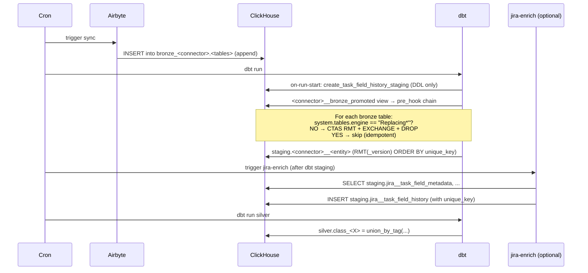

# Technical Design — Ingestion Data Flow


<!-- toc -->

- [1. Architecture Overview](#1-architecture-overview)
  - [1.1 Architectural Vision](#11-architectural-vision)
  - [1.2 Architecture Drivers](#12-architecture-drivers)
  - [1.3 Architecture Layers](#13-architecture-layers)
- [2. Principles & Constraints](#2-principles--constraints)
  - [2.1 Design Principles](#21-design-principles)
  - [2.2 Constraints](#22-constraints)
- [3. Technical Architecture](#3-technical-architecture)
  - [3.1 Domain Model](#31-domain-model)
  - [3.2 Component Model](#32-component-model)
  - [3.3 API Contracts](#33-api-contracts)
  - [3.4 Internal Dependencies](#34-internal-dependencies)
  - [3.5 External Dependencies](#35-external-dependencies)
  - [3.6 Interactions & Sequences](#36-interactions--sequences)
  - [3.7 Database schemas & tables](#37-database-schemas--tables)
  - [3.8 Deployment Topology](#38-deployment-topology)
- [4. Additional context](#4-additional-context)
  - [Why not append-only Silver via dbt-clickhouse `delete+insert`?](#why-not-append-only-silver-via-dbt-clickhouse-deleteinsert)
  - [Why bronze MergeTree as default (not RMT immediately)](#why-bronze-mergetree-as-default-not-rmt-immediately)
  - [Why `unique_key` String, not a ClickHouse UUID](#why-uniquekey-string-not-a-clickhouse-uuid)
- [5. Traceability](#5-traceability)

<!-- /toc -->

- [x] `p1` - **ID**: `cpt-dataflow-design-pipeline`
## 1. Architecture Overview

### 1.1 Architectural Vision

The Ingestion Data Flow defines how data moves from external systems (SaaS APIs, databases, files) into Constructor Insight's analytics warehouse (ClickHouse). The pipeline has three named stages — **bronze**, **staging**, **silver** — each with a strict contract for engine type, ordering, deduplication, and ownership. Every stage uses `ReplacingMergeTree(_version)` with `ORDER BY (unique_key)` so background merges and `FINAL`/`argMax` reads collapse duplicates deterministically.

The most important property of this pipeline is **single-column dedup discipline**: every connector emits a `unique_key` String field (formula `{tenant}-{source}-{natural_keys}`), and that single column is the ORDER BY for every downstream RMT table. This eliminates per-table composite-key bookkeeping, makes the silver UNION ALL between connectors safe (each connector emits globally unique keys), and gives every analyst the same simple read pattern: `SELECT * FROM silver.X FINAL`.

The other defining property is **Rust ↔ dbt boundary**: where SQL is too clumsy (event-sourced reconstruction, stateful field-history derivation), a Rust binary owns the transform but dbt owns the DDL. The Rust output stages a single table that dbt unions into silver via an ephemeral pass-through model — no extra physical objects, no double dedup.

### 1.2 Architecture Drivers

**ADRs**:
- `cpt-dataflow-adr-rmt-with-version-and-unique-key`
- `cpt-dataflow-adr-promote-bronze-to-rmt`
- `cpt-dataflow-adr-ephemeral-rust-passthrough`
- `cpt-dataflow-adr-unique-key-formula`

#### Functional Drivers

| Requirement | Design Response |
|-------------|------------------|
| Pipeline must produce dedup'd silver tables without extra read-time cost | Every silver model is `ReplacingMergeTree(_version)` + `ORDER BY (unique_key)`; consumers read via `FINAL` or `argMax` |
| New SaaS connectors must integrate without re-engineering downstream | Connector contract: emit `unique_key` per the project formula → silver `union_by_tag` picks it up automatically |
| Some Jira derivations are infeasible in pure SQL | Rust `jira-enrich` binary writes to a dbt-owned staging table; silver consumes it via ephemeral pass-through |

#### NFR Allocation

| NFR | Allocated To | Design Response | Verification |
|-----|--------------|-----------------|--------------|
| Bronze sync robustness against OOM | Airbyte connectors | Always `destinationSyncMode='append'` (never `append_dedup` / `overwrite`) | `connect.sh` enforces dest_sync_mode literal; per `cpt-dataflow-constraint-airbyte-append` |
| Dedup determinism | RMT engine choice | `ReplacingMergeTree(_version)` resolves duplicates by max `_version` | `cpt-dataflow-principle-rmt-with-version` mandates this for every RMT model |
| Cross-connector silver consistency | unique_key contract | Every connector concatenates `tenant-source-natural` so silver UNION ALL never collides between connectors | `cpt-dataflow-principle-unique-key-formula` |

### 1.3 Architecture Layers

- [x] `p1` - **ID**: `cpt-dataflow-tech-clickhouse-stack`

```
┌─────────────────────────────────────────────────────────────────────────────┐
│                      EXTERNAL SOURCES (SaaS APIs, OAuth)                      │
└────────────────────────────────────┬─────────────────────────────────────────┘
                                     │
                    ┌────────────────┴───────────────────┐
                    │                                    │
                    ▼ (Airbyte sync, append-only)        ▼ (Custom CDK / built-in)
┌─────────────────────────────────────────────────────────────────────────────┐
│  BRONZE — schemas: bronze_<connector>                                        │
│   • Engine: MergeTree (post-promote: ReplacingMergeTree(_airbyte_extracted_at)) │
│   • ORDER BY: (unique_key)                                                   │
│   • Each row carries `unique_key` String = "{tenant}-{source}-{natural}"     │
│   • Sync mode: append (NEVER append_dedup or overwrite — see ADR-0002 ctx)   │
│   • Promoted from MT to RMT on first dbt run via promote_bronze_to_rmt       │
└────────────────────────────────────┬─────────────────────────────────────────┘
                                     │
                                     ▼ (dbt: connectors/*/dbt/*.sql)
┌─────────────────────────────────────────────────────────────────────────────┐
│  STAGING — schema: staging                                                    │
│   • Engine: ReplacingMergeTree(_version) for every dbt-managed model         │
│   • ORDER BY: (unique_key) — propagated from bronze or computed for explodes │
│   • Materialization mix: incremental (most), table (heavy projections),      │
│     view (thin pass-through), ephemeral (Rust-owned tables)                  │
│   • Per-connector model name: <connector>__<entity>                          │
│   • Tagged 'silver:<class_name>' so silver union_by_tag finds them           │
└────────────────────────────────────┬─────────────────────────────────────────┘
                                     │
                                     ▼ (dbt: silver/<domain>/*.sql)
┌─────────────────────────────────────────────────────────────────────────────┐
│  SILVER — schema: silver (or identity for identity_inputs)                   │
│   • Engine: ReplacingMergeTree(_version) — versionless RMT only for          │
│     full-refresh tables whose upstream lacks `_version`                      │
│   • ORDER BY: (unique_key) — ALWAYS, even for SCD2 (extend the key with     │
│     valid_from in staging projection if needed)                              │
│   • Cross-connector: union_by_tag('silver:<class>') concatenates UNION ALL   │
│   • Read pattern (downstream): FINAL or argMax(... ORDER BY _version)        │
└─────────────────────────────────────────────────────────────────────────────┘
```

| Layer | Responsibility | Technology |
|-------|---------------|------------|
| Bronze | Raw API objects, append-only | ClickHouse RMT(_airbyte_extracted_at), Airbyte / custom CDK |
| Staging | Per-connector projection / cleanup / explode | ClickHouse RMT(_version), dbt |
| Silver | Cross-connector unified entities | ClickHouse RMT(_version), dbt + union_by_tag |
| Rust enrich | Stateful event reconstruction (Jira changelogs) | Rust binary, writes one staging table |

## 2. Principles & Constraints

### 2.1 Design Principles

#### RMT(_version) + ORDER BY (unique_key) on every dbt-managed model

- [x] `p1` - **ID**: `cpt-dataflow-principle-rmt-with-version`

Every dbt model that materializes a table or incremental in staging or silver MUST declare:

```python
{{ config(
    engine='ReplacingMergeTree(_version)',
    order_by=['unique_key'],
    settings={'allow_nullable_key': 1},
    ...
) }}
```

The only sanctioned exceptions are **versionless RMT** for `materialized='table'` models whose staging upstream does not expose a `_version` column (full-refresh class-tables: `class_ai_*`, `class_hr_events`, `class_wiki_*`, `class_people`, `class_hr_working_hours`, `mtr_git_*`). For those: `engine='ReplacingMergeTree'` + `order_by=['unique_key']`. Composite ORDER BY is **forbidden** — the natural key must be encoded into `unique_key` in staging.

**ADRs**: `cpt-dataflow-adr-rmt-with-version-and-unique-key`

#### Connectors write per-connector staging; silver unions via `union_by_tag`

- [x] `p1` - **ID**: `cpt-dataflow-principle-staging-then-union`

A connector MUST NOT write directly to silver schema. Instead it writes to `staging.<connector>__<entity>` (a per-connector dbt model) tagged `silver:<class_name>`. Silver class-models are bodies-of `union_by_tag('silver:<class_name>')` which discovers all tagged staging models at compile time and concatenates them via UNION ALL.

This pattern guarantees:
- Adding a new connector = adding new staging models with the right tag (no silver edit)
- Silver schema is uniform regardless of source set
- Per-source cleanup / type coercion stays local to its connector

**ADRs**: `cpt-dataflow-adr-rmt-with-version-and-unique-key`

#### Bronze is promoted MergeTree → ReplacingMergeTree on first dbt run

- [x] `p1` - **ID**: `cpt-dataflow-principle-promote-bronze`

Airbyte creates bronze tables as plain `MergeTree`. To get deterministic dedup over `_airbyte_extracted_at` (full-refresh syncs append every row on every sync) every bronze table MUST be migrated to `ReplacingMergeTree(_airbyte_extracted_at) ORDER BY (unique_key)` on first dbt run.

The migration is performed by the macro `promote_bronze_to_rmt(table, order_by)` (always called with `order_by='unique_key'`). It is idempotent, atomic via `EXCHANGE TABLES`, and per-connector orchestrated through a bootstrap dbt model (e.g., `jira__bronze_promoted`) that all other connector staging models declare as upstream via `-- depends_on:`.

**ADRs**: `cpt-dataflow-adr-promote-bronze-to-rmt`

#### Ephemeral materialization for Rust-owned staging pass-through

- [x] `p1` - **ID**: `cpt-dataflow-principle-ephemeral-passthrough`

When a staging table is written by something other than dbt (currently: the Rust `jira-enrich` binary writes `staging.jira__task_field_history`), the dbt-side pass-through must use `materialized='ephemeral'`. The model exists only to attach the `silver:<class>` tag for `union_by_tag` discovery; dbt inlines the SELECT as a CTE in any downstream model and creates no DB object.

This avoids creating a redundant view next to the Rust-owned table, while preserving the multi-source extensibility of `union_by_tag`.

**ADRs**: `cpt-dataflow-adr-ephemeral-rust-passthrough`

#### Incremental materialization is the default; `table` only when justified

- [x] `p1` - **ID**: `cpt-dataflow-principle-incremental-default`

Every dbt model that produces append-or-event-style data MUST be `materialized='incremental'` with `incremental_strategy='append'`, RMT(_version), and a `WHERE _version > (SELECT max(_version) FROM {{ this }})` filter. Full-refresh `materialized='table'` is allowed ONLY in three cases:

1. **Full-refresh source with current-state semantics**. Upstream is a full-refresh API (e.g. BambooHR, Salesforce reference tables) and the model represents "current state per entity" with no event history kept at this layer. Examples: `class_people`, `class_hr_working_hours`. Bronze is rebuilt on every sync; silver mirroring it as a table is the simplest correct option.
2. **Aggregation that must scan all data**. The model performs heavy GROUP BY / multi-CTE join over fact tables and recomputes from scratch is cleaner than incremental aggregation (which would require careful boundary logic for late-arriving events). Examples: `mtr_git_person_totals`, `mtr_git_person_weekly`.
3. **Explode/fan-out staging models** where bronze grain is one row → many output rows, AND the bronze upstream is full-refresh + overwrite (no incremental cursor). Recomputing from full bronze is acceptable. Example: `jira__changelog_items` (explodes one Jira changelog into many field changes).

Any silver `class_*` / `fct_*` model NOT in those three categories MUST be incremental. If the upstream staging model lacks a `_version` column to power the incremental filter, the staging model itself MUST be amended to project `_version` (typically `toUnixTimestamp64Milli(_airbyte_extracted_at)` for Airbyte-synced data).

**ADRs**: `cpt-dataflow-adr-rmt-with-version-and-unique-key`

#### unique_key formula is `{tenant}-{source}-{natural_keys}`

- [x] `p1` - **ID**: `cpt-dataflow-principle-unique-key-formula`

Every connector-emitted record MUST carry a `unique_key` String column computed as:

```
{insight_tenant_id}-{insight_source_id}-{record_natural_key_parts}
```

The formula puts tenant first (multi-tenant safety), source second (multi-instance safety), then natural-key parts (entity uniqueness within a source). For SCD2 grains, `unique_key` MUST also encode the version axis (e.g., `valid_from`, `_synced_at`, or event_id) — staging projection extends the bronze unique_key as needed.

For rows produced outside Airbyte (Rust binaries, dbt explode models that fan one bronze row into many), the producer MUST compute `unique_key` using the same formula.

**ADRs**: `cpt-dataflow-adr-unique-key-formula`

### 2.2 Constraints

#### Airbyte connectors always run with `destinationSyncMode='append'`

- [x] `p1` - **ID**: `cpt-dataflow-constraint-airbyte-append`

`append_dedup` and `overwrite` are forbidden. Both buffer the entire stream in memory until `STREAM_COMPLETE` and OOM on large streams; both lose all data if the destination pod dies mid-stream.

The cost of `append`-only is that full-refresh streams accumulate N copies per entity across syncs — this is mitigated by `cpt-dataflow-principle-promote-bronze` (RMT collapses duplicates by `_airbyte_extracted_at` on merge or `FINAL`).

Configuration is enforced in `src/ingestion/airbyte-toolkit/connect.sh` — every Airbyte connection is created with `dest_sync_mode = "append"`, no exceptions.

**ADRs**: `cpt-dataflow-adr-promote-bronze-to-rmt`

## 3. Technical Architecture

### 3.1 Domain Model

The pipeline operates on three logical entities, each with a per-stage representation:

| Entity | Bronze | Staging | Silver |
|---|---|---|---|
| Person observation | `bamboohr.employees`, `cursor.cursor_members`, ... | `bamboohr__identity_inputs`, `cursor__identity_inputs` (UPSERT/DELETE events) | `identity.identity_inputs` |
| Activity event | `m365.teams_activity`, `zoom.participants`, ... | `m365__collab_meeting_activity`, `zoom__collab_meeting_activity` | `silver.class_collab_meeting_activity` |
| Field history | `jira.jira_issue_history`, `jira.jira_issue` | `jira__task_field_history` (Rust-written) | `silver.class_task_field_history` |

### 3.2 Component Model

#### Bronze Layer

- [x] `p1` - **ID**: `cpt-dataflow-component-bronze`

##### Why this component exists

Raw API ingestion. Connector writes minimally-transformed JSON-decoded rows into per-connector schemas so all subsequent transforms work from a single source of truth that mirrors the upstream API.

##### Responsibility scope

- Sync data from external systems
- Add `unique_key` String per `cpt-dataflow-principle-unique-key-formula`
- Add `insight_tenant_id` and `insight_source_id` to every row
- Persist via `destinationSyncMode='append'`
- Tables MUST be promoted to RMT(_airbyte_extracted_at) on first dbt run

##### Responsibility boundaries

- Does NOT clean / cast / dedup data (deferred to staging)
- Does NOT join across streams (silver concern)
- Does NOT decide retention / lifecycle (deployment concern)

##### Related components (by ID)

- `cpt-dataflow-component-staging` — produces input for

#### Staging Layer

- [x] `p1` - **ID**: `cpt-dataflow-component-staging`

##### Why this component exists

Per-connector cleanup, type coercion, projection, and dedup. Staging models hide bronze idiosyncrasies (Airbyte JSON envelopes, raw timestamp strings, custom_fields blobs) behind a normalized per-connector schema that silver can union without further per-source logic.

##### Responsibility scope

- Project bronze rows into the canonical staging shape (one row per logical entity at the staging grain)
- Carry `unique_key` forward (or compute one for explode models that fan-out bronze rows)
- Set `_version` (typically `toUnixTimestamp64Milli(_airbyte_extracted_at)` for incremental / `now64()` for full-refresh)
- Materialize as RMT(_version) ORDER BY (unique_key) — always
- Tag with `silver:<class>` for `union_by_tag` discovery in silver

##### Responsibility boundaries

- Does NOT cross connectors (silver does that)
- Does NOT compute downstream metrics (gold concern, currently absent)
- For Rust-written tables: dbt owns DDL only; the table itself is populated by the Rust binary

##### Related components (by ID)

- `cpt-dataflow-component-bronze` — reads from
- `cpt-dataflow-component-silver` — emits to (via union_by_tag tag)
- `cpt-dataflow-component-rust-enrich` — receives from (for jira__task_field_history)

#### Silver Layer

- [x] `p1` - **ID**: `cpt-dataflow-component-silver`

##### Why this component exists

Cross-connector unified entities. Analytics, gold metrics, and external consumers read silver — never staging or bronze. Silver gives one schema per logical concept (`class_git_commits`, `class_task_comments`, etc.) regardless of which connectors are configured.

##### Responsibility scope

- Combine staging models tagged `silver:<class>` via `union_by_tag` into a single table
- RMT(_version) ORDER BY (unique_key) for every model
- Define the read contract: consumers MUST use `FINAL` or `argMax(... ORDER BY _version)` to dedup at read time

##### Responsibility boundaries

- Does NOT add per-connector logic (push that to staging)
- Does NOT pre-aggregate (pre-aggregation belongs in gold / metric catalog, currently absent)

##### Related components (by ID)

- `cpt-dataflow-component-staging` — reads from (tag-discovered)

#### Rust Enrich Binary

- [x] `p1` - **ID**: `cpt-dataflow-component-rust-enrich`

##### Why this component exists

Some staging derivations are too complex for SQL — specifically, Jira's event-sourced field history requires per-issue forward-state reconstruction across changelog entries with multiple delta shapes (single-set / native-multi-add-remove / legacy-snapshot). The Rust binary `jira-enrich` performs this transformation with type-safe pattern matching and produces one row per (issue × field × event).

##### Responsibility scope

- Read from dbt-produced staging tables (`jira__task_field_metadata`, `jira_changelog_items`, `jira__issue_field_snapshot`) and bronze (`jira_issue` snapshots)
- Apply delta parsing + state reconstruction
- INSERT into `staging.jira__task_field_history` (one row per (issue × field × event))
- Compute `unique_key` per the project formula: `{insight_source_id}-{data_source}-{id_readable}-{field_id}-{event_id}`

##### Responsibility boundaries

- Does NOT own DDL — dbt's `create_task_field_history_staging` macro creates the table
- Does NOT have CREATE / ALTER privileges in ClickHouse — only INSERT / SELECT
- Does NOT write to silver — dbt unions via ephemeral pass-through

##### Related components (by ID)

- `cpt-dataflow-component-staging` — writes to one staging table
- `cpt-dataflow-component-silver` — populates one silver class via ephemeral pass-through

### 3.3 API Contracts

Not applicable. This DESIGN describes the data-flow architecture between layers (bronze → staging → silver), not a public-facing service API. The interfaces between layers are SQL contracts (column lists, RMT engine semantics, `unique_key` formula) documented in §3.7 and the linked ADRs.

### 3.4 Internal Dependencies

| Dependency Module | Interface Used | Purpose |
|---|---|---|
| `cypilot/config/rules/architecture.md` | rule reference | Agent-time guidance pointing back to this DESIGN |
| `docs/domain/connector/specs/DESIGN.md` | conceptual peer | Connector framework (this doc covers data flow inside the framework) |
| `docs/domain/identity-resolution/specs/DESIGN.md` | downstream consumer | Identity Manager reads `silver.identity_inputs` |
| `docs/components/connectors/task-tracking/jira/specs/DESIGN.md` | implementation peer | Jira connector concrete details |

### 3.5 External Dependencies

#### ClickHouse

| Dependency | Interface | Purpose |
|---|---|---|
| ClickHouse server (≥ 22.7 for `EXCHANGE TABLES`) | HTTP / Native protocol | Storage backend for bronze/staging/silver |
| `system.columns` / `system.tables` | metadata views | Read by `promote_bronze_to_rmt` macro and Rust schema validator |

#### Airbyte

| Dependency | Interface | Purpose |
|---|---|---|
| Airbyte API | REST | Source / destination / connection management via `connect.sh` |
| Airbyte ClickHouse destination | wire protocol | Bronze table writer (always `append` mode) |

### 3.6 Interactions & Sequences

#### Pipeline Stages

##### Stage 1 — Bronze sync

- [x] `p1` - **ID**: `cpt-dataflow-seq-bronze-sync`

Trigger: scheduled Airbyte connection run.

```
Airbyte source → Airbyte destination (ClickHouse) → bronze_<connector>.<table>
   (every row enriched with insight_tenant_id, insight_source_id, unique_key)
```

Engine after first dbt run: `ReplacingMergeTree(_airbyte_extracted_at) ORDER BY (unique_key)`. Sync mode: always `append` per `cpt-dataflow-constraint-airbyte-append`.

##### Stage 2 — Bronze promotion (dbt on-run-start)

- [x] `p1` - **ID**: `cpt-dataflow-seq-bronze-promotion`

Trigger: every `dbt run` (idempotent — no-op if already RMT).

Per-connector bootstrap models (e.g., `jira__bronze_promoted`) call `` for each bronze table. The macro:

1. Looks up engine in `system.tables`
2. If "Replacing*" → log + skip (idempotent)
3. Otherwise: `CREATE TABLE __rmt_swap ENGINE = ReplacingMergeTree(_airbyte_extracted_at) ORDER BY (unique_key) AS SELECT * FROM <tbl>`
4. `EXCHANGE TABLES <tbl> AND __rmt_swap` (atomic, CH 22.7+)
5. `DROP TABLE __rmt_swap` (now holds old MT data)

Bootstrap model `materialized='view'` body is a 1-row `SELECT 1 AS promoted` marker; all other connector staging models declare `-- depends_on: {{ ref('<connector>__bronze_promoted') }}` so dbt's DAG fires the migration before any model reads bronze.

##### Stage 3 — Connector staging

- [x] `p1` - **ID**: `cpt-dataflow-seq-connector-staging`

Trigger: dbt run, after bronze promotion.

```
bronze_<connector>.<table>
    │ (dbt model: connectors/<...>/<connector>__<entity>.sql)
    │   - SELECT u.unique_key AS unique_key, ...
    │   - cast / null-norm / dedup-via-LIMIT-1-BY-_airbyte_raw_id
    │   - toUnixTimestamp64Milli(_airbyte_extracted_at) AS _version
    │   - tag: 'silver:<class>'
    ▼
staging.<connector>__<entity>   (RMT(_version) ORDER BY (unique_key))
```

Materialization choice:
- `incremental` + `append` — when bronze is itself incremental and we want delta processing (most common)
- `table` — for explode models (fan-out N rows per bronze row, full-refresh is cheaper than computing incremental boundary)
- `view` — for thin projections over already-deduplicated bronze (full-refresh + overwrite case, rare)
- `ephemeral` — see Stage 5 (Rust-owned tables only)

##### Stage 4 — Silver union

- [x] `p1` - **ID**: `cpt-dataflow-seq-silver-union`

Trigger: dbt run, after connector staging.

```
staging.<connector1>__<entity>   ┐
staging.<connector2>__<entity>   ├─→ union_by_tag('silver:<class>') (UNION ALL)
staging.<connector3>__<entity>   ┘                  │
                                                    ▼
                            silver.<class>          (RMT(_version) ORDER BY (unique_key))
```

Silver model body:

```sql
{{ config(
    materialized='incremental',
    incremental_strategy='append',
    schema='silver',
    engine='ReplacingMergeTree(_version)',
    order_by=['unique_key'],
    settings={'allow_nullable_key': 1},
    tags=['silver']
) }}

SELECT * FROM (
    {{ union_by_tag('silver:<class>') }}
)

WHERE _version > (SELECT max(_version) FROM {{ this }})

```

For full-refresh class-tables whose staging lacks `_version`: drop `incremental_strategy` and version-based filter, use `materialized='table'` + `engine='ReplacingMergeTree'` (versionless).

##### Stage 5 — Rust-owned staging (Jira field history)

- [x] `p1` - **ID**: `cpt-dataflow-seq-rust-staging`

Special case for `silver.class_task_field_history`:

```
bronze_jira.jira_issue_history (raw API)
        │
        ▼
staging.jira_changelog_items (dbt explode)        ┐
staging.jira__task_field_metadata (dbt project)   ├─→ Rust jira-enrich reads
staging.jira__issue_field_snapshot (dbt UNION)    ┘   (+ bronze_jira.jira_issue FINAL)
        │ (Rust applies delta parsing + state reconstruction
        │  + computes unique_key = "{src}-{ds}-{id_readable}-{field_id}-{event_id}")
        ▼
staging.jira__task_field_history   (RMT(_version) ORDER BY (unique_key))
        │ (DDL: dbt macro `create_task_field_history_staging` in on-run-start)
        │ (Data: Rust INSERT-only; no CREATE/ALTER privileges)
        ▼
jira__task_field_history.sql       (dbt model, materialized='ephemeral'
                                    — no DB object, dbt inlines as CTE)
        │ (tagged silver:class_task_field_history)
        ▼
silver.class_task_field_history    (RMT(_version) ORDER BY (unique_key))
```

The dbt-side ephemeral model exists ONLY as a tag carrier — body is `SELECT * FROM source('staging_jira', 'jira__task_field_history')`. It creates no view/table in CH; dbt inlines it as CTE wherever it's `ref()`'d. This is the minimal non-zero footprint compatible with `union_by_tag`'s tag-based discovery.

The macro `union_by_tag` was extended to handle ephemeral models without checking `adapter.get_relation` (which returns None for ephemeral by definition).

#### Rust ↔ dbt Boundary

The boundary between Rust and dbt for the field history pipeline:

| Concern | Owner | Mechanism |
|---|---|---|
| DDL of `staging.jira__task_field_history` | dbt | macro `create_task_field_history_staging` in `on-run-start` |
| INSERT data | Rust binary `jira-enrich` | `clickhouse-client::insert::<FieldHistoryInsert>` |
| `unique_key` computation | Rust binary | `format!("{}-{}-{}-{}-{}", insight_source_id, data_source, id_readable, field_id, event_id)` in `From<FieldHistoryRecord>` |
| Schema validation at startup | Rust binary | reads `system.columns`, fails fast if expected columns missing |
| Tag attachment for silver | dbt ephemeral model | `tags=['jira', 'silver:class_task_field_history']` |
| Silver union | dbt | `union_by_tag('silver:class_task_field_history')` |

ClickHouse permissions: the Rust binary's CH role has `INSERT` + `SELECT` on `staging.jira__task_field_history` and `SELECT` on the bronze/staging inputs. It does NOT have `CREATE` / `ALTER` / `DROP`.

#### Full pipeline run (single connector)

**ID**: `cpt-dataflow-seq-full-run`



**Description**: End-to-end pipeline run from Airbyte sync trigger through bronze promotion, dbt staging models, optional Rust enrich, and silver union.

### 3.7 Database schemas & tables

- [x] `p1` - **ID**: `cpt-dataflow-db-pipeline-tables`

This DESIGN does not define new application tables — it documents the **engine, ORDER BY, and ownership conventions** for tables produced by other components. The actual table list per connector is in each connector's DESIGN. The convention table:

| Layer | Schema | Engine after first dbt run | ORDER BY | Owner of DDL | Owner of INSERT |
|---|---|---|---|---|---|
| Bronze | `bronze_<connector>` | `ReplacingMergeTree(_airbyte_extracted_at)` | `(unique_key)` | dbt (via `promote_bronze_to_rmt` macro) | Airbyte |
| Staging (per-connector) | `staging` | `ReplacingMergeTree(_version)` | `(unique_key)` | dbt | dbt |
| Staging (Rust-owned) | `staging` | `ReplacingMergeTree(_version)` | `(unique_key)` | dbt (via `create_task_field_history_staging` macro) | Rust binary |
| Silver | `silver` (or `identity`) | `ReplacingMergeTree(_version)` or versionless `ReplacingMergeTree` | `(unique_key)` | dbt | dbt |

#### Table: bronze_<connector>.<entity> (post-promotion)

**ID**: `cpt-dataflow-dbtable-bronze`

**Schema** (essential columns for dedup and traceability):

| Column | Type | Description |
|---|---|---|
| unique_key | String | `{insight_tenant_id}-{insight_source_id}-{natural_key_parts}` — see `cpt-dataflow-adr-unique-key-formula` |
| insight_tenant_id | String | Multi-tenant key, prefix of unique_key |
| insight_source_id | String | Connector instance ID, secondary prefix of unique_key |
| _airbyte_extracted_at | DateTime64(3) | Sync timestamp; serves as `_version` after promotion |
| _airbyte_raw_id | String | Per-row UUID from Airbyte |
| ... source-native columns ... | various | API-specific fields |

**PK**: `unique_key` (after promotion).

**Constraints**: `unique_key` MUST follow the project formula and MUST be set on every row.

#### Table: staging.<connector>__<entity>

**ID**: `cpt-dataflow-dbtable-staging`

**Schema** (canonical fields):

| Column | Type | Description |
|---|---|---|
| unique_key | String | Propagated from bronze, or computed for explode models |
| insight_source_id | String | Source instance |
| data_source | String | Source-type discriminator |
| ... entity-specific fields ... | various | Cleaned / type-coerced projection of bronze |
| _version | UInt64 | `toUnixTimestamp64Milli(_airbyte_extracted_at)` for incremental, `now64()` ms for full-refresh |

**PK**: `unique_key`.

**Constraints**: `engine='ReplacingMergeTree(_version)'`, `order_by=['unique_key']`. See `cpt-dataflow-adr-rmt-with-version-and-unique-key`.

#### Table: silver.<class>

**ID**: `cpt-dataflow-dbtable-silver`

**Schema**: same shape as the staging models unioned via `union_by_tag`.

**PK**: `unique_key` (cross-connector unique by formula).

**Constraints**: `engine='ReplacingMergeTree(_version)'`, `order_by=['unique_key']`. Read pattern: `SELECT … FROM silver.<class> FINAL` or `argMax(... ORDER BY _version)`.

### 3.8 Deployment Topology

- [x] `p1` - **ID**: `cpt-dataflow-topology-runtime`

| Component | Runtime | Frequency | Coupling |
|---|---|---|---|
| Airbyte connector workers | k8s pods, scheduled | per-connector cron (1-24h typical) | Independent per connection |
| dbt run | k8s job, scheduled | after Airbyte syncs complete | Reads bronze; promotes + builds staging + builds silver |
| `jira-enrich` Rust binary | k8s job, scheduled | after dbt staging completes (Jira-specific) | Reads dbt staging tables; writes `staging.jira__task_field_history` |
| ClickHouse | k8s StatefulSet | continuous | Storage backend |

The chain: dbt run (bronze promotion + staging) → `jira-enrich` job → second dbt run filtered to silver task-tracking. Currently scheduled by a top-level cron (Argo Workflows — see `docs/domain/ingestion/specs/ADR/0002-argo-over-kestra.md`).

## 4. Additional context

### Why not append-only Silver via dbt-clickhouse `delete+insert`?

`delete+insert` was tried and reverted. Reasons:
- It stacks two dedup mechanisms (LIGHTWEIGHT DELETE + RMT merge)
- LIGHTWEIGHT DELETE is more expensive than INSERT and doesn't win anything when RMT already collapses on merge
- Read-time `FINAL` / `argMax` is the canonical CH idiom and doesn't require the producer to know anything about the consumer's read pattern

### Why bronze MergeTree as default (not RMT immediately)

Airbyte's destination connector creates tables as plain MergeTree by default. Without modifying Airbyte, the cleanest path to RMT bronze is a dbt-managed migration on first run. Future improvement: contribute an option to Airbyte's CH destination to accept RMT engine declarations.

### Why `unique_key` String, not a ClickHouse UUID

String `unique_key` is human-readable in queries / logs / debugging, can be partially indexed by `LIKE 'tenant-x%'`, and matches the record-level natural keys exposed in upstream APIs. UUID would force a hash function, lose human readability, and gain nothing measurable.

## 5. Traceability

- **PRD**: not applicable (this is a cross-cutting design, not a feature spec)
- **ADRs**: [ADR/](./ADR/)
  - [ADR-0001: ReplacingMergeTree(_version) + ORDER BY (unique_key)](./ADR/0001-rmt-with-version-and-unique-key.md)
  - [ADR-0002: Promote bronze MergeTree → RMT on first dbt run](./ADR/0002-promote-bronze-to-rmt.md)
  - [ADR-0003: Ephemeral materialization for Rust-owned staging pass-through](./ADR/0003-ephemeral-rust-passthrough.md)
  - [ADR-0004: unique_key formula = {tenant}-{source}-{natural_keys}](./ADR/0004-unique-key-formula.md)
- **Project rule** (agent-loaded): [cypilot/config/rules/architecture.md](../../../../cypilot/config/rules/architecture.md) §dbt Materialization Conventions
