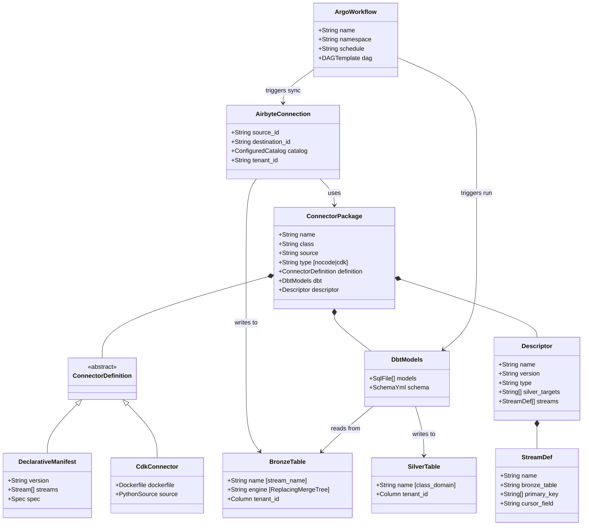
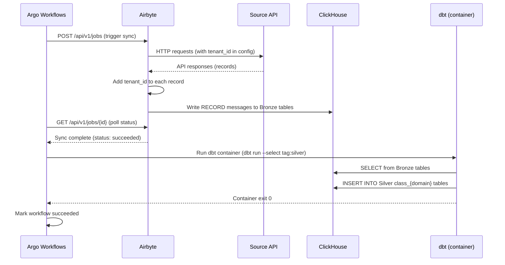
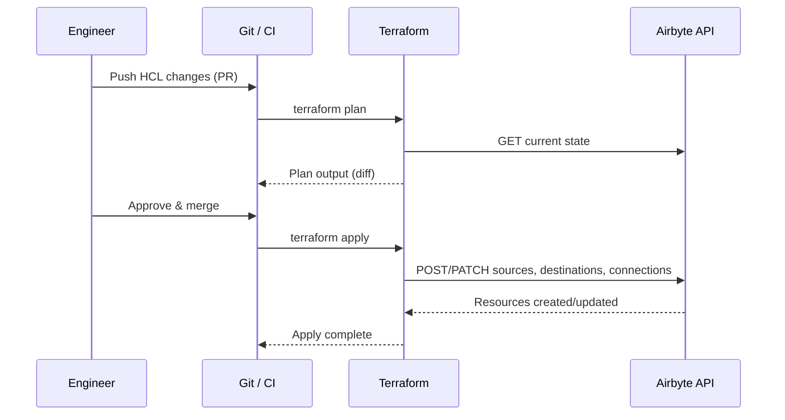

# DESIGN -- Ingestion Layer

<!-- toc -->

- [1. Architecture Overview](#1-architecture-overview)
  - [1.1 Architectural Vision](#11-architectural-vision)
  - [1.2 Architecture Drivers](#12-architecture-drivers)
  - [1.3 Architecture Layers](#13-architecture-layers)
- [2. Principles & Constraints](#2-principles--constraints)
  - [2.1 Design Principles](#21-design-principles)
  - [2.2 Constraints](#22-constraints)
- [3. Technical Architecture](#3-technical-architecture)
  - [3.1 Domain Model](#31-domain-model)
  - [3.2 Component Model](#32-component-model)
  - [3.3 API Contracts](#33-api-contracts)
  - [3.4 Internal Dependencies](#34-internal-dependencies)
  - [3.5 External Dependencies](#35-external-dependencies)
  - [3.6 Interactions & Sequences](#36-interactions--sequences)
  - [3.7 Database schemas & tables](#37-database-schemas--tables)
  - [3.8 Connector Package Structure](#38-connector-package-structure)
- [4. Deployment](#4-deployment)
  - [4.1 Production (Kubernetes + Helm)](#41-production-kubernetes--helm)
  - [4.2 Local Development (Kind K8s Cluster)](#42-local-development-kind-k8s-cluster)
  - [4.3 Ultra-Light Connector Debugging](#43-ultra-light-connector-debugging)
  - [4.4 Schema Migrations](#44-schema-migrations)
- [5. Additional Context](#5-additional-context)
  - [5.1 Superseded Components](#51-superseded-components)
- [6. Open Questions](#6-open-questions)
  - [OQ-ING-01: ClickHouse Destination Normalization Mode](#oq-ing-01-clickhouse-destination-normalization-mode)
  - [OQ-ING-02: ~~Kestra Flow Granularity~~ (RESOLVED)](#oq-ing-02-kestra-flow-granularity-resolved)
  - [OQ-ING-03: MariaDB Destination Use Cases](#oq-ing-03-mariadb-destination-use-cases)
  - [OQ-ING-04: Gold Layer Ownership](#oq-ing-04-gold-layer-ownership)
  - [OQ-ING-05: Connector Package Versioning](#oq-ing-05-connector-package-versioning)
- [7. Traceability](#7-traceability)

<!-- /toc -->

---

## 1. Architecture Overview

### 1.1 Architectural Vision

The Ingestion Layer provides the complete data pipeline from external source APIs to unified Silver step 1 tables, built on industry-standard open-source tools. Airbyte handles data extraction through both nocode declarative manifests and Python CDK connectors. Argo Workflows orchestrates the pipeline lifecycle -- scheduling syncs via CronWorkflows, managing dependencies between extraction and transformation via DAG templates, and handling retries with configurable retry strategies. dbt-clickhouse transforms raw Bronze data into unified Silver schemas. Terraform manages Airbyte connection configuration as code.

This layer replaces the previously designed custom Orchestrator and custom Connector Framework with a simpler, more maintainable stack that requires no custom runtime code.

### 1.2 Architecture Drivers

#### Functional Drivers

| Requirement | Design Response |
|---|---|
| `cpt-insightspec-fr-ing-airbyte-extract` | Airbyte Platform with ClickHouse destination handles extraction and loading |
| `cpt-insightspec-fr-ing-nocode-connector` | Airbyte declarative manifests (YAML) with `source-declarative-manifest` base image |
| `cpt-insightspec-fr-ing-cdk-connector` | Airbyte Python CDK with custom Docker images |
| `cpt-insightspec-fr-ing-tenant-id` | `AddFields` transformation in manifests; explicit injection in CDK `read_records()` |
| `cpt-insightspec-fr-ing-incremental-sync` | Airbyte cursor-based incremental sync with persisted state |
| `cpt-insightspec-fr-ing-kestra-scheduling` | Argo CronWorkflows with cron triggers for scheduled execution |
| `cpt-insightspec-fr-ing-kestra-dependency` | Argo DAG templates with explicit task dependencies: sync -> dbt |
| `cpt-insightspec-fr-ing-bronze-storage` | ClickHouse `ReplacingMergeTree` with Airbyte stream name as table name |
| `cpt-insightspec-fr-ing-dbt-bronze-to-silver` | Per-package dbt models producing `class_{domain}` tables |
| `cpt-insightspec-fr-ing-terraform-connections` | Airbyte Terraform provider for connection management |
| `cpt-insightspec-fr-ing-package-structure` | Self-contained connector packages: manifest + dbt + descriptor |

#### NFR Allocation

| NFR | Component | Verification |
|-----|-----------|-------------|
| `cpt-insightspec-nfr-ing-idempotency` | ClickHouse ReplacingMergeTree | Re-run sync; verify no duplicates after OPTIMIZE TABLE FINAL |
| `cpt-insightspec-nfr-ing-error-isolation` | Argo per-task execution in DAG | Fail one connector; verify others succeed |
| `cpt-insightspec-nfr-ing-tenant-isolation` | Connector-level tenant_id injection | Query tables; verify no missing/incorrect tenant_id |
| `cpt-insightspec-nfr-ing-observability` | Argo UI + Airbyte UI | Verify executions visible within 1 minute |

#### Architecture Decision Records

| ADR | Decision |
|-----|----------|
| [ADR-0001](ADR/0001-kestra-over-airflow.md) `cpt-insightspec-adr-ing-kestra-over-airflow` | Use Kestra over Airflow — YAML-first, no Python dependency (superseded) |
| [ADR-0002](ADR/0002-argo-over-kestra.md) `cpt-insightspec-adr-argo-over-kestra` | Use Argo Workflows over Kestra — K8s-native, no external DB dependency |
| [ADR-0003](ADR/0003-k8s-secrets-credentials.md) `cpt-insightspec-adr-k8s-secrets-credentials` | Use K8s Secrets as primary credential source — vendor-neutral, dev/prod parity |

### 1.3 Architecture Layers

```
┌──────────────────────────────────────────────────────────────────┐
│                      EXTERNAL DATA SOURCES                       │
│  GitHub · Jira · MS365 · GitLab · Slack · BambooHR · etc.       │
└───────────────────────┬──────────────────────────────────────────┘
                        │ HTTP / REST / GraphQL
                        ▼
┌──────────────────────────────────────────────────────────────────┐
│                     AIRBYTE PLATFORM                             │
│                                                                  │
│  ┌─────────────────┐  ┌─────────────────┐  ┌────────────────┐  │
│  │ Nocode Connectors│  │ CDK Connectors  │  │ ClickHouse     │  │
│  │ (YAML manifests) │  │ (Python)        │  │ Destination    │  │
│  └────────┬────────┘  └────────┬────────┘  └───────┬────────┘  │
│           │  tenant_id         │  tenant_id         │           │
│           └────────────────────┴────────────────────┘           │
│                                                                  │
│  ┌─────────────────────────────────────────────────────────┐    │
│  │ Airbyte API  · Connection Management · Catalog Discovery │    │
│  └─────────────────────────────────────────────────────────┘    │
└───────────────────────┬──────────────────────────────────────────┘
                        │ Airbyte Protocol (RECORD, STATE)
                        ▼
┌──────────────────────────────────────────────────────────────────┐
│                    BRONZE LAYER (ClickHouse)                     │
│                                                                  │
│  Airbyte stream name tables · ReplacingMergeTree · shard-local  │
│  tenant_id in every record · source-native schema preserved     │
└───────────────────────┬──────────────────────────────────────────┘
                        │ SQL (dbt-clickhouse)
                        ▼
┌──────────────────────────────────────────────────────────────────┐
│               SILVER STEP 1 LAYER (ClickHouse)                   │
│                                                                  │
│  class_{domain} tables · unified schema · tenant_id             │
│  source-native user IDs intact (person_id added in step 2)      │
└──────────────────────────────────────────────────────────────────┘

                  ORCHESTRATION (ARGO WORKFLOWS)
        ┌──────────────────────────────────────┐
        │  CronWorkflow → Airbyte Sync → dbt   │
        │  DAG · Retry · Observability          │
        └──────────────────────────────────────┘

                INFRASTRUCTURE AS CODE (TERRAFORM)
        ┌──────────────────────────────────────┐
        │  Airbyte Connections · CI/CD Apply    │
        └──────────────────────────────────────┘
```

## 2. Principles & Constraints

### 2.1 Design Principles

#### Self-Contained Connector Packages

- [ ] `p1` - **ID**: `cpt-insightspec-principle-ing-package-self-contained`

Each connector package contains everything needed for its pipeline: connector definition (manifest or code), dbt models for Bronze-to-Silver transformation, and a descriptor YAML declaring its capabilities. No external dependencies beyond the package directory.

**Why**: Enables independent development, testing, and deployment of connectors.

#### No Custom Runtime

- [ ] `p1` - **ID**: `cpt-insightspec-principle-ing-no-custom-runtime`

Use Airbyte's connector runtime for extraction and Argo Workflows' execution engine for orchestration. No custom runner, subprocess management, or message protocol.

**Why**: Reduces maintenance burden; leverages battle-tested runtimes with community support.

#### Declarative-First

- [ ] `p1` - **ID**: `cpt-insightspec-principle-ing-declarative-first`

Prefer nocode declarative manifests for new connectors. Use CDK (Python) only when the declarative approach cannot express the required logic (complex auth, multi-step API calls, binary data).

**Why**: Declarative manifests are faster to develop, easier to review, and simpler to maintain.

#### Tenant Isolation at Source

- [ ] `p1` - **ID**: `cpt-insightspec-principle-ing-tenant-isolation`

Every record is tagged with `tenant_id` at the connector level -- before data leaves the extraction boundary. This is not a post-processing step; it is an extraction invariant.

**Why**: Guarantees tenant isolation from the earliest point in the pipeline.

#### Silver Targets Known at Design Time

- [ ] `p1` - **ID**: `cpt-insightspec-principle-ing-silver-at-design-time`

When creating a connector package, the author knows which Silver tables (`class_{domain}`) the connector will populate. The descriptor YAML declares these targets explicitly.

**Why**: Enables package-level validation and dependency tracking.

#### Airbyte Resource Identity by ID

All automation scripts identify Airbyte resources (source definitions, sources, destinations, connections, builder projects) exclusively by their Airbyte-assigned UUID stored in the state file. Name-based matching is prohibited because multiple resources can share the same name, and names are not stable across Airbyte reinstalls. If a stored ID is no longer valid (Airbyte returns 404), the resource is recreated and the new ID is saved.

**Why**: Prevents stale reference errors after Airbyte reinstalls and avoids ambiguity when multiple resources share a name.

### 2.2 Constraints

#### ClickHouse as Primary Destination

- [ ] `p1` - **ID**: `cpt-insightspec-constraint-ing-clickhouse-destination`

All Bronze and Silver data resides in ClickHouse. MariaDB is an alternative destination for specific use cases (documented separately). No other storage engines are supported.

#### Monorepo Package Storage

- [ ] `p1` - **ID**: `cpt-insightspec-constraint-ing-monorepo`

All connector packages reside in the project monorepo. No external package registry, no Git submodules, no npm/pip packages.

#### No External Connector Registry

- [ ] `p1` - **ID**: `cpt-insightspec-constraint-ing-no-external-registry`

Custom connectors are registered directly with the Airbyte instance via its API. There is no separate registry service.

#### Terraform for Connections Only

- [ ] `p1` - **ID**: `cpt-insightspec-constraint-ing-terraform-connections`

Terraform manages Airbyte connections (source + destination + catalog). Custom connector registration is handled via Airbyte API, not Terraform.

## 3. Technical Architecture

### 3.1 Domain Model



### 3.2 Component Model

#### Airbyte Platform

- [ ] `p1` - **ID**: `cpt-insightspec-component-ing-airbyte`

##### Why this component exists

Handles all data extraction from external sources, providing connector runtime, connection management, catalog discovery, and data delivery to ClickHouse.

##### Responsibility scope

- Execute nocode (declarative) and CDK (Python) connectors
- Manage source and destination configurations
- Discover source schemas (catalog)
- Deliver extracted records to ClickHouse via Airbyte Protocol
- Persist incremental sync state between runs
- Provide API for connection management and sync triggering

##### Responsibility boundaries

- Does NOT perform data transformation (that is dbt's responsibility)
- Does NOT schedule or orchestrate pipelines (that is Argo Workflows' responsibility)
- Does NOT manage its own connection configurations in version control (that is Terraform's responsibility)

##### Related components (by ID)

- `cpt-insightspec-component-ing-argo` -- Argo Workflows triggers Airbyte syncs via HTTP
- `cpt-insightspec-component-ing-terraform` -- Terraform manages Airbyte connections
- `cpt-insightspec-component-ing-clickhouse` -- ClickHouse is the sync destination

#### Argo Workflows Orchestrator

- [ ] `p1` - **ID**: `cpt-insightspec-component-ing-argo`

##### Why this component exists

Provides pipeline scheduling, task dependency management, retry handling, and execution observability. Selected over Kestra to eliminate PostgreSQL dependency — Argo stores state in K8s etcd (see [ADR-0002](ADR/0002-argo-over-kestra.md)).

##### Responsibility scope

- Schedule pipeline CronWorkflows with cron expressions
- Trigger Airbyte syncs via HTTP POST to Airbyte API
- Poll for sync completion and check status
- Trigger dbt runs via container steps (`insight-toolbox`)
- Enforce task ordering via DAG templates (sync before transform)
- Retry failed tasks with configurable backoff (`retryStrategy`)
- Provide Argo UI for monitoring and manual execution

##### Responsibility boundaries

- Does NOT execute extraction logic (Airbyte does)
- Does NOT execute transformation SQL (dbt does)
- Does NOT manage connection configurations (Terraform does)

##### Related components (by ID)

- `cpt-insightspec-component-ing-airbyte` -- triggers syncs, monitors completion
- `cpt-insightspec-component-ing-dbt` -- triggers dbt runs after sync

#### dbt-clickhouse

- [ ] `p1` - **ID**: `cpt-insightspec-component-ing-dbt`

##### Why this component exists

Transforms raw Bronze data into unified Silver step 1 tables using SQL. Each connector package includes its own dbt models.

##### Responsibility scope

- Execute Bronze-to-Silver SQL transformations
- Map source-specific fields to unified Silver schemas
- Preserve `tenant_id` in all Silver tables
- Validate data quality via dbt tests (not_null, unique, accepted_values)
- Document column definitions in schema.yml

##### Responsibility boundaries

- Does NOT extract data from external sources (Airbyte does)
- Does NOT schedule its own execution (Argo Workflows does)
- Does NOT perform identity resolution (separate domain)

##### Related components (by ID)

- `cpt-insightspec-component-ing-argo` -- Argo Workflows triggers dbt runs
- `cpt-insightspec-component-ing-clickhouse` -- dbt reads from and writes to ClickHouse

#### ClickHouse Cluster

- [ ] `p1` - **ID**: `cpt-insightspec-component-ing-clickhouse`

##### Why this component exists

Analytical storage engine for all Bronze and Silver data. Provides columnar storage, shard-local tables, and `ReplacingMergeTree` for idempotent upserts.

##### Responsibility scope

- Store Bronze tables (Airbyte stream names) with source-native schema
- Store Silver tables (`class_{domain}`) with unified schema
- Provide shard-local table placement for distributed queries
- Handle record deduplication via `ReplacingMergeTree` versioning

##### Responsibility boundaries

- Does NOT manage its own schema migrations (Airbyte destination creates Bronze; dbt creates Silver)
- Does NOT provide application-level access control (handled at platform level)

##### Related components (by ID)

- `cpt-insightspec-component-ing-airbyte` -- Airbyte writes Bronze data
- `cpt-insightspec-component-ing-dbt` -- dbt reads Bronze, writes Silver

#### Terraform

- [ ] `p1` - **ID**: `cpt-insightspec-component-ing-terraform`

##### Why this component exists

Manages Airbyte connection configurations as code, enabling version control, PR review, and CI/CD deployment of pipeline configurations.

##### Responsibility scope

- Define Airbyte sources, destinations, and connections in HCL
- Apply configurations via `terraform plan` / `terraform apply`
- Manage state in remote backend (S3/GCS)
- Run in CI/CD pipelines

##### Responsibility boundaries

- Does NOT register custom connectors (Airbyte API handles registration)
- Does NOT manage Argo WorkflowTemplate definitions (stored as YAML in Git)
- Does NOT manage ClickHouse cluster infrastructure

##### Related components (by ID)

- `cpt-insightspec-component-ing-airbyte` -- manages Airbyte connections via API

### 3.3 API Contracts

#### Airbyte Protocol

Airbyte Protocol v2 defines structured JSON messages between connectors and the platform:
- `RECORD` -- data record with stream name and fields (including `tenant_id`)
- `STATE` -- incremental sync cursor for resumable extraction
- `LOG` -- connector execution logs
- `TRACE` -- detailed execution tracing
- `CATALOG` -- stream schema discovery results
- `SPEC` -- connector specification (configuration schema)

#### Argo WorkflowTemplate / CronWorkflow YAML

Argo Workflows uses Kubernetes CRDs for workflow definitions:
```yaml
apiVersion: argoproj.io/v1alpha1
kind: CronWorkflow
metadata:
  name: m365-sync
  namespace: argo
spec:
  schedule: "0 2 * * *"
  timezone: UTC
  concurrencyPolicy: Replace
  workflowSpec:
    entrypoint: pipeline
    arguments:
      parameters:
        - name: connection_id
          value: "CONNECTION_ID"
    templates:
      - name: pipeline
        dag:
          tasks:
            - name: sync
              templateRef:
                name: airbyte-sync
                template: sync
            - name: transform
              depends: sync
              templateRef:
                name: dbt-run
                template: run
```

#### Descriptor YAML Schema

Each connector package includes `descriptor.yaml`:
```yaml
name: ms365
version: "1.0"
type: nocode
silver_targets:
  - class_comms_events
  - class_people
streams:
  - name: email_activity
    bronze_table: email_activity
    primary_key: [unique]
    cursor_field: reportRefreshDate
  - name: teams_activity
    bronze_table: teams_activity
    primary_key: [unique]
    cursor_field: reportRefreshDate
```

#### Terraform Configuration

Airbyte connections managed via Terraform:
```hcl
resource "airbyte_connection" "ms365_to_clickhouse" {
  name           = "ms365-tenant-acme"
  source_id      = airbyte_source.ms365.id
  destination_id = airbyte_destination.clickhouse.id

  configurations = {
    namespace_definition = "custom_format"
    namespace_format     = "bronze_ms365"
    streams = [
      { name = "email_activity", sync_mode = "incremental" },
      { name = "teams_activity", sync_mode = "incremental" }
    ]
  }
}
```

### 3.4 Internal Dependencies

| From | To | Mechanism |
|------|----|-----------|
| Argo Workflows | Airbyte | HTTP POST (trigger sync, poll job status) |
| Argo Workflows | dbt | Container step (dbt-clickhouse image) |
| Airbyte | ClickHouse | Airbyte ClickHouse destination (JDBC) |
| dbt | ClickHouse | dbt-clickhouse adapter (native protocol) |
| Terraform | Airbyte | Airbyte Terraform provider (REST API) |

### 3.5 External Dependencies

| Dependency | Version Constraint | Purpose |
|-----------|-------------------|---------|
| Airbyte Platform | Self-managed, latest stable | Connector runtime and connection management |
| Argo Workflows | v3.6.x, Apache 2.0 (CNCF) | Pipeline orchestration (K8s-native, state in etcd) |
| dbt-clickhouse | Latest stable adapter | SQL transformations on ClickHouse |
| Terraform + airbytehq/airbyte provider | Provider >= 1.0 | Connection configuration as code |
| ClickHouse | Cluster deployment | Analytical storage |

### 3.6 Interactions & Sequences

#### Scheduled Pipeline Run

**ID**: `cpt-insightspec-seq-ing-scheduled-pipeline`



#### Terraform Connection Management

**ID**: `cpt-insightspec-seq-ing-terraform-apply`



### 3.7 Database schemas & tables

#### Bronze Tables

Naming: Tables match Airbyte stream names directly (e.g., `commits`, `email_activity`). Tables are created in a namespace/database specified in the Airbyte connection configuration (managed via Terraform), such as `bronze_github` or `bronze_ms365`.

Engine: `ReplacingMergeTree(_version)` where `_version` is epoch milliseconds.

Required columns in every Bronze table:

| Column | Type | Description |
|--------|------|-------------|
| `tenant_id` | String | Tenant isolation -- injected by connector |
| `_airbyte_raw_id` | String | Airbyte deduplication key |
| `_airbyte_extracted_at` | DateTime64 | Extraction timestamp |
| `_version` | UInt64 | ReplacingMergeTree version (epoch ms) |

Shard-local tables: All Bronze tables use shard-local placement for distributed query execution.

#### Silver Step 1 Tables

Naming: `class_{domain}` (e.g., `class_commits`, `class_comms_events`, `class_people`)

Produced by dbt models. Unified schema across sources. `tenant_id` preserved from Bronze.

### 3.8 Connector Package Structure

```
src/ingestion/connectors/
  {class}/{source}/
    connector.yaml            # Nocode: Airbyte declarative manifest
    # OR for CDK:
    # src/
    #   source_{source}/
    #     __init__.py
    #     source.py
    #     schemas/
    #   setup.py
    #   Dockerfile
    descriptor.yaml            # Package metadata
    dbt/
      to_{domain}.sql          # dbt model(s) producing class_{domain} Silver tables
      schema.yml               # Column docs + tests
```

See [Airbyte Connector DESIGN](../../connector/specs/DESIGN.md) for detailed connector development guide.

## 4. Deployment

### 4.1 Production (Kubernetes + Helm)

PR #224 unified the deployment model: Airbyte, Argo Workflows and the Insight umbrella are three separate Helm releases that all install into the **same namespace** (default `insight`). Multi-tenant deployments use multiple namespaces — each is self-contained.

```text
K8s Cluster
└── namespace: insight (release namespace — shared by all three Helm releases)
    ├── Helm release: airbyte (chart: airbyte/airbyte)
    │   ├── Airbyte Server (API + UI)
    │   ├── Airbyte Workers (connector execution)
    │   ├── Temporal (internal orchestration)
    │   └── Airbyte-bundled PostgreSQL (Airbyte metadata)
    ├── Helm release: argo-workflows (chart: argo/argo-workflows)
    │   ├── Argo Server (API + UI)
    │   └── Argo Controller (workflow execution)
    └── Helm release: insight (chart: charts/insight, this repo)
        ├── ClickHouse (subchart helmfile/charts/clickhouse — StatefulSet)
        ├── MariaDB (Bitnami subchart — per-service databases:
        │              analytics-api owns `insight`, identity-resolution
        │              owns `identity` per ADR-0006)
        ├── Redis (Bitnami subchart — cache for API Gateway / Analytics API)
        ├── Redpanda (subchart — Kafka-compatible event broker)
        ├── Analytics API (Rust/Axum)
        ├── Identity Resolution (Rust persons-store — see ADR-0006)
        ├── API Gateway (Rust/Axum, OIDC, proxy)
        └── Frontend (SPA, nginx)
```

Key deployment decisions:
- **Single-namespace model**: Airbyte, Argo and the Insight umbrella share the release namespace; cross-release service references resolve via plain DNS (e.g. `airbyte-airbyte-server-svc.insight.svc.cluster.local:8001`). Lifecycle is still independent — each release upgrades on its own schedule.
- Argo Workflows stores state in K8s etcd — no external database required.
- Airbyte ships its own bundled PostgreSQL for connector metadata (managed by the `airbyte/airbyte` chart, not by the umbrella).
- Helm charts: Airbyte via `airbyte/airbyte`, Argo via `argo/argo-workflows`, the Insight platform via `charts/insight` in this repo. The canonical installer chain `deploy/scripts/install.sh` runs all three in order; `dev-up.sh` is the developer wrapper that builds local images and delegates to it.
- ClickHouse, MariaDB, Redis and Redpanda are all umbrella subcharts under `charts/insight/Chart.yaml` (`<dep>.deploy: true|false`). The unified shape `<dep>.host / .port / .database / .username / .passwordSecret` works whether the dep is bundled or external — see `charts/insight/values.yaml`.
- ClickHouse is a StatefulSet (`insight-clickhouse`) created by `helmfile/charts/clickhouse`; access is via Service `insight-clickhouse:8123` inside the cluster. Health probes use HTTP GET `/ping` (not `clickhouse-client` exec — avoids CLI flag parsing issues with auto-generated passwords).
- MariaDB per-service databases are provisioned via the bundled bitnami `mariadb.initdbScriptsConfigMap` (see `charts/insight/templates/mariadb-initdb-scripts.yaml`) — bitnami runs every script in that ConfigMap on the FIRST MariaDB pod boot, mounted at `/docker-entrypoint-initdb.d`. The data lives in the PVC after that, so restarts and helm upgrades are no-ops. Each owning service then runs its own SeaORM migrations at startup — see §4.4.2 and [ADR-0006](ADR/0006-service-owned-migrations.md).
- CDK connector build script (`airbyte-toolkit/build-connector.sh`) uses `CLUSTER_NAME` env var (default `insight`) for Kind image loading — not hardcoded.
- Airbyte port-forward uses `nohup ... & disown` to avoid blocking the terminal.
- Argo `dbt-run` WorkflowTemplate uses locally-built `insight-toolbox:local` image (with `imagePullPolicy: IfNotPresent`) — not `ghcr.io/cyberfabric/insight-toolbox:latest`. Local builds via `tools/toolbox/build.sh` pick up dbt model changes without requiring a registry push. Template also accepts `full_refresh` parameter (pass `--full-refresh` to recreate tables from scratch).
- CoreDNS is patched to use public DNS upstream (`8.8.8.8`, `8.8.4.4`) — WSL's `/etc/resolv.conf` points to an internal WSL nameserver that cannot reliably resolve external domains (e.g. `login.microsoftonline.com`). Patch lives in `scripts/dev/patch-coredns-wsl.sh` (idempotent, opt-out via `SKIP_COREDNS_PATCH=1`); invoked from `dev-up.sh` after Kind bootstrap and re-applied by `dev-restart.sh`.
- `dev-restart.sh` also cleans up stale Airbyte replication-job pods (from previous syncs that did not exit cleanly).
- Gold views migration (`20260422000000_gold-views.sql`) references bronze tables from optional connectors (jira, m365, zoom). When the corresponding bronze table does not yet exist (no real connector data ingested yet), `scripts/create-bronze-placeholders.sh` creates empty placeholder tables with a minimal compatible schema so the gold-views migration succeeds on a partial install.
  - **Placeholder handoff caveat**: Airbyte ClickHouse destination v2.0.8+ throws an error on the first sync if the target bronze table exists with a schema that does not match the destination's expected schema for that stream. The placeholder schemas in `create-bronze-placeholders.sh` are intentionally minimal (only the columns referenced by gold views) — they are **not** a drop-in replacement for a native Airbyte-generated table. Before enabling a previously-placeholdered connector, the operator should manually `DROP TABLE` the placeholder(s) in ClickHouse so Airbyte can create them fresh on its first sync.
  - Script runs automatically via `init.sh` before migrations.
- All credentials managed via Kubernetes Secrets (see §4.1.1).
- Service access via Ingress (PR #224): the umbrella chart configures `ingress-nginx` routes for Frontend, API Gateway, Airbyte UI and Argo UI; in `dev-up.sh --env local` the Kind cluster maps host ports 80/443 to the ingress controller. Direct port-forwards (`kubectl port-forward`) remain available for debugging.

#### 4.1.1 Infrastructure Secrets

All infrastructure and connector credentials are stored in Kubernetes Secrets. No credentials are hardcoded in production manifests.

| Secret | Namespace | Purpose | Required Keys | Created by |
|--------|-----------|---------|---------------|------------|
| `insight-db-creds` | `insight` | Auto-generated infra credentials (ClickHouse, MariaDB, Redis) | `clickhouse-password`, `mariadb-password`, `mariadb-root-password`, `redis-password` | umbrella chart `secrets.yaml` (`lookup`-based, idempotent across `helm upgrade`) |
| `airbyte-auth-secrets` | `insight` | Airbyte internal auth | `instance-admin-password`, `instance-admin-client-id`, `instance-admin-client-secret`, `jwt-signature-secret` | Helm chart (auto) |
| `insight-mariadb` | `insight` | MariaDB root + app credentials (Bitnami subchart's own Secret — read-only mirror of the relevant keys from `insight-db-creds`) | `mariadb-root-password`, `mariadb-password` | Bitnami MariaDB subchart (auto) |
| `insight-{connector}-{source-id}` | `insight` | Per-connector credentials (see [ADR-0003](ADR/0003-k8s-secrets-credentials.md)) | Connector-specific (e.g. `azure_client_id`, `azure_client_secret`) | `secrets/apply.sh` |

All Insight components share the release namespace (default `insight`); override with `INSIGHT_NAMESPACE` for non-default installs. Argo UI uses `--auth-mode=client` in production — authentication via K8s ServiceAccount Bearer tokens, no Secret required.

**Resolution order** (all scripts):
1. Read from K8s Secret — sole credential source for all environments
2. If Secret missing → skip connector with error (no inline fallback)
3. ClickHouse password: inside the StatefulSet pod, the `clickhouse` container picks up `CLICKHOUSE_USER` and `CLICKHOUSE_PASSWORD` env vars from `insight-db-creds`; ingestion scripts run `clickhouse-client` via `kubectl exec` and inherit those vars without passing `--user` / `--password` explicitly

**Connector credentials** use label-based discovery: `app.kubernetes.io/part-of: insight` label + `insight.cyberfabric.com/connector` annotation. See [ADR-0003](ADR/0003-k8s-secrets-credentials.md) for details.

#### Credential Resolution Rules

1. **K8s Secrets are the sole credential source.** Connector parameters — API keys, OAuth secrets, start dates, any configuration required by the connector spec — are stored exclusively in K8s Secrets. Tenant YAML files contain only `tenant_id`.

2. **Secret annotations define connector binding.** Each Secret carries:
   - Label `app.kubernetes.io/part-of: insight` — for discovery
   - Annotation `insight.cyberfabric.com/connector` — connector name (must match `descriptor.yaml` `name` field)
   - Annotation `insight.cyberfabric.com/source-id` — unique instance identifier

3. **No inline credential fallback.** Scripts do not fall back to reading credentials from tenant YAML. If a Secret is missing, the connector is skipped with an error.

4. **Destination password sync.** `airbyte-toolkit/connect.sh` always updates the ClickHouse destination password from the K8s Secret on every run. This ensures password rotation takes effect without recreating connections.

5. **Password rotation procedure.** Update Secret → apply to cluster → restart the ClickHouse StatefulSet (`kubectl rollout restart statefulset/insight-clickhouse -n "${INSIGHT_NAMESPACE:-insight}"`) → run `airbyte-toolkit/connect.sh` (which honours `INSIGHT_NAMESPACE`) to sync the Airbyte destination password.

6. **Destination sync modes.** `connect.sh` assigns destination sync modes based on source stream capabilities:
   - `full_refresh` streams → `overwrite` (each sync replaces all data — no duplicate accumulation)
   - `incremental` streams → `append_dedup` (appends new records, deduplicates by primary key)

### 4.2 Local Development (Kind K8s Cluster)

All services run inside a single Kind K8s cluster (`insight`), in a single namespace, using the same three-Helm-release model as production:
- Airbyte installed via Helm chart (`airbyte/airbyte`)
- Argo Workflows installed via Helm chart (`argo/argo-workflows`)
- Insight platform installed via the umbrella chart `charts/insight` — bundles ClickHouse, MariaDB, Redis, Redpanda, Analytics API, Identity Resolution, API Gateway and Frontend as subcharts. Image tags for the Rust services are filled by `dev-up.sh` from locally-built images (`kind load docker-image`).
- dbt runs as Argo container steps (`insight-toolbox`)

KUBECONFIG: `~/.kube/insight.kubeconfig`

#### Startup scripts

| Script | Purpose |
|--------|---------|
| `./dev-up.sh` | Dev wrapper: builds Docker images from `src/`, creates a local Kind cluster (or targets a dev-owned remote like virtuozzo), loads images into the cluster, and delegates to `deploy/scripts/install*.sh` to install Airbyte, Argo Workflows, and the Insight umbrella chart. Uses `.env.<env>` for configuration. Idempotent. |
| `./dev-down.sh` | Graceful stop: scales all `insight`-namespace deployments to 0, stops the Kind container. Data preserved — `./dev-restart.sh` brings everything back. |
| `./dev-restart.sh` | Quick restart after WSL/Docker crash or `./dev-down.sh`: restarts the Kind container, scales `insight`-namespace pods back to 1, re-patches CoreDNS, restores port-forwards. Falls back to `./dev-up.sh` if the cluster is gone. Lightweight — no image builds, no helm upgrade. |
| `deploy/scripts/install.sh` | Production-style installer (canonical path): chains `install-airbyte.sh` → `install-argo.sh` → `install-insight.sh` against the current kubeconfig. Used by `dev-up.sh` and end-user installs from published chart artifacts. |
| `src/ingestion/run-init.sh` | Post-deploy init: verifies secrets, runs ClickHouse migrations, registers connectors, applies Airbyte connections, syncs Argo flows. (MariaDB schema is applied per-service by each backend service's own sea-orm `Migrator` at startup — see §4.4 and [ADR-0006](ADR/0006-service-owned-migrations.md). Per-service databases beyond the umbrella default are provisioned by `charts/insight/templates/mariadb-initdb-scripts.yaml` on the first MariaDB pod boot.) |
| `src/ingestion/sync-all.sh` | Trigger Airbyte sync for all connections. Reads connection IDs from state, calls Airbyte API. Use after `run-init.sh` to start first data load, or anytime to re-sync all sources. |

**First-time setup**:
1. Copy `.env.local.example` → `.env.local`
2. Copy connector secret examples → fill credentials (`src/ingestion/secrets/connectors/`)
3. `./dev-up.sh` — full stack deployment
4. `./src/ingestion/run-init.sh` — databases, connectors, connections
5. `cd src/ingestion && ./sync-all.sh` — trigger first Airbyte sync for all connections

**After WSL/Docker crash**: `./dev-restart.sh` — one command, restores full state.

**Environment support**: `./dev-up.sh --env <name>` loads `.env.<name>` config. Supports `local` (Kind) and remote (external kubeconfig) modes.

This enables:
- Testing connector registration and sync execution
- Running full extract → transform pipeline via Argo DAG workflows
- Monitoring workflows via Argo UI
- Validating dbt models against real data
- Full backend API testing with OIDC disabled locally

### 4.3 Ultra-Light Connector Debugging

For rapid nocode connector iteration without the full Airbyte platform:
- Run connector Docker image directly with `source.sh`
- Commands: `check`, `discover`, `read`
- Mount custom manifest, pipe output to local destination

See [Airbyte Connector DESIGN](../../connector/specs/DESIGN.md) for detailed debugging workflows.

### 4.4 Schema Migrations

The project persists data in two stores with two different migration
mechanisms. **ClickHouse** schema is file-based and invoked from
`init.sh` (cluster bootstrap path); **MariaDB** schema is service-
owned — each backend service carries its own embedded `Migrator` and
applies its migrations at startup (see [ADR-0006](ADR/0006-service-owned-migrations.md)).
The two paths diverge on bookkeeping because of different evolution
patterns.

#### 4.4.1 ClickHouse migrations

- **Location**: `src/ingestion/scripts/migrations/*.sql`
- **Naming**: `YYYYMMDDHHMMSS_<description>.sql` — timestamp prefix
  enforces chronological order under lexicographic glob
- **Runner**: inline loop in `init.sh`, applied via
  `kubectl exec -i -n "${INSIGHT_NAMESPACE:-insight}" statefulset/insight-clickhouse -- clickhouse-client --multiquery`
  (override the namespace and pod selector via `INSIGHT_NAMESPACE` / `CLICKHOUSE_POD`)
- **Bookkeeping**: none — every migration is re-run on every `init.sh`
  invocation and therefore must be written idempotently
  (`CREATE ... IF NOT EXISTS`, `ALTER ... IF NOT EXISTS`, etc.)
- **Rationale**: analytics schema is mostly `CREATE TABLE` / `CREATE
  VIEW` statements where idempotency guards are free, so a
  `schema_migrations` bookkeeping table is unnecessary

#### 4.4.2 MariaDB migrations — service-owned

There is **no global MariaDB migration mechanism** in this project.
Each backend service that owns MariaDB tables carries its own
migrations inside the service codebase and applies them at startup.

- **analytics-api** (Rust): SeaORM `Migrator` at
  `src/backend/services/analytics-api/src/migration/`; tracker table
  `seaql_migrations` in the database referenced by
  `mariadb.database` (umbrella chart, default `insight`).
- **identity** (.NET 9): DbUp at
  `src/backend/services/identity/src/Insight.Identity.Infrastructure/Migrations/`
  (plain SQL files, applied via `MigrationRunner`); tracker table
  `SchemaVersions` (DbUp default) in the database referenced by
  `identity.databaseName` (umbrella chart, default `identity`).
- **Future backend services**: follow the same pattern — own
  `Migrations/` folder co-located with the service code, own tracker
  table in own database. Tooling flavour follows the service's
  language (SeaORM for Rust, DbUp for .NET).

All services invoke their migrator at startup before opening the HTTP
listener. This provides:

- **Co-location**: schema changes ship with the Rust code that depends
  on them; a service's DDL and its entity definitions never drift.
- **Database isolation**: each service lives in its own MariaDB
  database; cross-service table access is an explicit architectural
  decision, not an accident of shared-schema layout.
- **No ordering coupling between services**: no single `init.sh` step
  must run before any service starts.

Infra responsibility (umbrella chart) stays minimal: the `mariadb`
subchart provisions the MariaDB instance, and the
`mariadb.primary.initdbScriptsConfigMap` (rendered from
`charts/insight/templates/mariadb-initdb-scripts.yaml`) creates the
per-service databases (e.g. `CREATE DATABASE IF NOT EXISTS identity`)
and grants the app user access — bitnami runs the scripts on the
first MariaDB pod boot only, the data persists in the PVC, and
helm upgrades are no-ops on this front. **Schema inside each
database** is the owning service's job.

See [ADR-0006](ADR/0006-service-owned-migrations.md) for the decision
record.

#### 4.4.3 One-shot data seeds

Operator-triggered data bootstraps (e.g. the identity-resolution
`persons` seed reading from ClickHouse `identity.identity_inputs`) are
not schema migrations and do not belong under the service's SeaORM
`Migrator`. They live alongside the owning service as stand-alone
scripts and are invoked explicitly by operators after migrations run
and the underlying data source is populated.

Currently:
- `src/backend/services/identity/seed/seed-persons.sh` + `seed-persons-from-identity-input.py` — identity-resolution's one-shot seed.

## 5. Additional Context

### 5.1 Superseded Components

This design supersedes:

| Component | Document | Reason |
|-----------|----------|--------|
| Custom Orchestrator | [Orchestrator PRD](../../../components/orchestrator/specs/PRD.md) | Replaced by Argo Workflows -- see [ADR-0002](ADR/0002-argo-over-kestra.md) |
| Custom Connector Framework | [Connector Framework DESIGN](../../connector/specs/DESIGN.md) | Replaced by Airbyte connector runtime |
| Stdout JSON Protocol | [ADR-0001](../../connector/specs/ADR/0001-connector-integration-protocol.md) | Replaced by Airbyte Protocol |

These documents remain as historical reference. The ingestion layer is the current and forward-looking approach.

## 6. Open Questions

### OQ-ING-01: ClickHouse Destination Normalization Mode

Airbyte's ClickHouse destination supports different normalization modes (raw, basic, etc.). Which mode should be used for Bronze table creation? Does the destination correctly handle `ReplacingMergeTree` with version columns?

### OQ-ING-02: ~~Kestra Flow Granularity~~ (RESOLVED)

Resolved by migration to Argo Workflows. Granularity: one CronWorkflow per (connector, tenant) pair. Reusable WorkflowTemplates (`airbyte-sync`, `dbt-run`, `ingestion-pipeline`) are shared across all tenants; tenant-specific CronWorkflows reside in `src/ingestion/workflows/{tenant_id}/`.

### OQ-ING-03: MariaDB Destination Use Cases

Which specific connectors or data types require MariaDB instead of ClickHouse as destination? This needs to be documented separately when the use cases are defined.

### OQ-ING-04: Gold Layer Ownership

Is the Gold layer part of the ingestion domain or a separate domain? Currently out of scope, but the boundary needs clarification.

### OQ-ING-05: Connector Package Versioning

How are connector packages versioned within the monorepo? Is there a version field in descriptor.yaml that gates deployment, or is Git commit the version?

## 7. Traceability

| Design Element | PRD Requirement |
|---------------|----------------|
| `cpt-insightspec-component-ing-airbyte` | `cpt-insightspec-fr-ing-airbyte-extract`, `cpt-insightspec-fr-ing-nocode-connector`, `cpt-insightspec-fr-ing-cdk-connector` |
| `cpt-insightspec-component-ing-argo` | `cpt-insightspec-fr-ing-kestra-scheduling`, `cpt-insightspec-fr-ing-kestra-dependency`, `cpt-insightspec-fr-ing-kestra-retry` |
| `cpt-insightspec-component-ing-dbt` | `cpt-insightspec-fr-ing-dbt-bronze-to-silver`, `cpt-insightspec-fr-ing-dbt-clickhouse`, `cpt-insightspec-fr-ing-silver-unified-schema` |
| `cpt-insightspec-component-ing-clickhouse` | `cpt-insightspec-fr-ing-bronze-storage`, `cpt-insightspec-fr-ing-clickhouse-destination` |
| `cpt-insightspec-component-ing-terraform` | `cpt-insightspec-fr-ing-terraform-connections` |
| `cpt-insightspec-principle-ing-tenant-isolation` | `cpt-insightspec-fr-ing-tenant-id`, `cpt-insightspec-nfr-ing-tenant-isolation` |
| `cpt-insightspec-principle-ing-package-self-contained` | `cpt-insightspec-fr-ing-package-structure`, `cpt-insightspec-fr-ing-package-monorepo` |
| `cpt-insightspec-constraint-ing-terraform-connections` | `cpt-insightspec-fr-ing-terraform-connections`, `cpt-insightspec-fr-ing-airbyte-api-custom` |

- **PRD**: [PRD.md](PRD.md)
- **ADR-0001**: [ADR/0001-kestra-over-airflow.md](ADR/0001-kestra-over-airflow.md) (superseded)
- **ADR-0002**: [ADR/0002-argo-over-kestra.md](ADR/0002-argo-over-kestra.md)
- **Airbyte Connector DESIGN**: [../../connector/specs/DESIGN.md](../../connector/specs/DESIGN.md)
- **Identity Resolution DESIGN**: [../../identity-resolution/specs/DESIGN.md](../../identity-resolution/specs/DESIGN.md) -- downstream consumer
