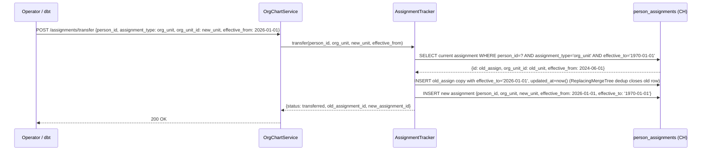
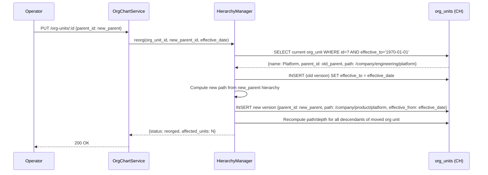

# Technical Design — Org-Chart Domain


<!-- toc -->

- [1. Architecture Overview](#1-architecture-overview)
  - [1.1 Architectural Vision](#11-architectural-vision)
  - [1.2 Architecture Drivers](#12-architecture-drivers)
  - [1.3 Architecture Layers](#13-architecture-layers)
- [2. Principles & Constraints](#2-principles--constraints)
  - [2.1 Design Principles](#21-design-principles)
  - [2.2 Constraints](#22-constraints)
- [3. Technical Architecture](#3-technical-architecture)
  - [3.1 Domain Model](#31-domain-model)
  - [3.2 Component Model](#32-component-model)
  - [3.3 API Contracts](#33-api-contracts)
  - [3.4 Internal Dependencies](#34-internal-dependencies)
  - [3.5 External Dependencies](#35-external-dependencies)
  - [3.6 Interactions & Sequences](#36-interactions--sequences)
  - [3.7 Database Schemas & Tables](#37-database-schemas--tables)
- [4. Additional Context](#4-additional-context)
  - [4.1 SCD Type 2 for Org Data](#41-scd-type-2-for-org-data)
  - [4.2 Temporal Query Patterns](#42-temporal-query-patterns)
- [5. Traceability](#5-traceability)

<!-- /toc -->

- [ ] `p3` - **ID**: `cpt-orgchart-design-orgchart`

> Version 1.0 — April 2026
> New domain: split from identity-resolution monolith. Owns organizational hierarchy and temporal person-to-org assignments.
---

## 1. Architecture Overview

### 1.1 Architectural Vision

The Org-Chart domain owns the organizational hierarchy — the tree of org units (departments, teams, divisions) and the temporal assignments of persons to those org units. It answers two core questions for analytics: "Which org unit does this person belong to right now?" and "Which org unit did this person belong to on date X?"

The architecture is built around two ClickHouse tables: `org_units` (hierarchy nodes with materialized path) and `person_assignments` (temporal links between persons and org units, roles, teams, or other organizational dimensions). Both tables use `[effective_from, effective_to)` half-open intervals for temporal correctness, ensuring that transfers, re-orgs, and role changes are attributed to the correct time period in analytics.

This domain is deliberately thin: it stores org structure and person-to-org links, but does not own person records (Person domain) or alias resolution (IR domain). It reads org data from HR connectors via dbt models or the shared `identity_inputs` table, and writes to its own tables. SCD Type 2 history is managed by dbt macros producing `*_snapshot` tables — out of scope for this design but referenced for completeness.

### 1.2 Architecture Drivers


#### Functional Drivers

| Requirement | Design Response |
|---|---|
| Maintain org unit hierarchy with parent-child relationships | `org_units` table with `parent_id` and materialized `path` column |
| Track person-to-org assignments over time | `person_assignments` table with `[effective_from, effective_to)` half-open intervals |
| Support multiple assignment types (org_unit, role, department, team, manager, etc.) | `assignment_type` enum on `person_assignments` — extensible without schema changes |
| Handle re-orgs (org unit renames, parent changes) | Close old `org_units` row (set `effective_to`), insert new row with updated attributes |
| Provide correct historical team attribution for analytics | Temporal join on `effective_from`/`effective_to` ensures commits, issues, etc. are attributed to the correct org unit at the time of the event |
| Support legacy flat-string assignments | `assignment_value` column for `department`/`team` types before `org_units` hierarchy is configured |

#### NFR Allocation

| NFR ID | NFR Summary | Allocated To | Design Response | Verification Approach |
|---|---|---|---|---|
| `cpt-orgchart-nfr-hierarchy-query-latency` | Org hierarchy traversal < 100 ms | `org_units` table | Materialized `path` column avoids recursive queries; `depth` enables level filtering | Benchmark hierarchy queries at 1000 org units |
| `cpt-orgchart-nfr-temporal-correctness` | No double-attribution on assignment boundaries | `person_assignments` | Half-open `[effective_from, effective_to)` intervals; `BETWEEN` prohibited | Boundary date tests: verify exactly one active assignment per type per date |
| `cpt-orgchart-nfr-tenant-isolation` | No cross-tenant org data leaks | All tables | `insight_tenant_id` as first column in all ORDER BY keys | Cross-tenant query returns empty |

### 1.3 Architecture Layers

- [ ] `p3` - **ID**: `cpt-orgchart-tech-layers`

```text
┌───────────────────────────────────────────────────────────────────┐
│                        ORG-CHART DOMAIN                            │
├───────────────────────────────────────────────────────────────────┤
│                                                                    │
│  INPUT                    ORG TABLES            CONSUMERS          │
│  ─────                    ──────────            ─────────          │
│                                                                    │
│  ┌─────────────┐     ┌──────────────┐                             │
│  │ HR dbt seed │────▶│  org_units   │──── Gold dashboards         │
│  │ / bootstrap │     │  (hierarchy) │     (team velocity,         │
│  └─────────────┘     └──────────────┘      dept attribution)      │
│         │                                                          │
│         │             ┌──────────────────┐                        │
│         └────────────▶│person_assignments│                        │
│                       │ (temporal links) │                        │
│                       └──────────────────┘                        │
│                                                                    │
│  COMPONENTS                                                       │
│  ──────────                                                       │
│  HierarchyManager ── org unit CRUD, re-org handling               │
│  AssignmentTracker ── temporal assignment upsert, SCD2 close/open │
│  OrgChartService ── API layer                                     │
│                                                                    │
│  ──── Cross-Domain ──────────────────────────────────────────     │
│                                                                    │
│  person_assignments.person_id ──FK──▶ persons.id (Person Domain)  │
│  persons.org_unit_id ──ref──▶ org_units.id (golden record field)  │
│                                                                    │
└───────────────────────────────────────────────────────────────────┘
```

| Layer | Responsibility | Technology |
|---|---|---|
| Ingestion | Read org hierarchy and assignment data from HR connectors via dbt or identity_inputs | ClickHouse / dbt |
| Processing | HierarchyManager manages org unit lifecycle; AssignmentTracker manages temporal assignments | Python / dbt macros |
| Storage | Org units and person assignments with temporal semantics | ClickHouse (ReplacingMergeTree) |
| API | REST endpoints for org unit CRUD, assignment queries, hierarchy traversal | Python (FastAPI) |
| Cross-domain | `person_assignments.person_id` → `persons.id`; `persons.org_unit_id` → `org_units.id` | Logical FK |

---

## 2. Principles & Constraints

### 2.1 Design Principles

#### Temporal Correctness

- [ ] `p2` - **ID**: `cpt-orgchart-principle-temporal-correctness`

All org assignments use `[effective_from, effective_to)` half-open intervals. When a person transfers from Engineering to Platform Engineering on 2026-01-01, the Engineering assignment closes with `effective_to = '2026-01-01'` and the Platform Engineering assignment opens with `effective_from = '2026-01-01'`. This ensures exactly one active assignment per type at any point in time, with no double-attribution on the boundary date. `BETWEEN` is prohibited on temporal columns.


#### Materialized Path for Hierarchy

- [ ] `p2` - **ID**: `cpt-orgchart-principle-materialized-path`

Org unit hierarchy is stored as a materialized `path` column (e.g., `/company/engineering/platform`) alongside the `parent_id` FK. This avoids recursive CTEs for hierarchy traversal — subtree queries use `path LIKE '/company/engineering/%'`. The `depth` column enables level-based filtering. Path and depth are recomputed on re-org.


#### Multi-Dimensional Assignments

- [ ] `p2` - **ID**: `cpt-orgchart-principle-multi-dimensional`

A person can have multiple concurrent assignments of different types: an `org_unit` assignment, a `role` assignment, a `manager` assignment, and a `project` assignment — all with independent temporal ranges. This enables rich organizational queries without overloading a single assignment relationship.


#### Domain Isolation

- [ ] `p2` - **ID**: `cpt-orgchart-principle-domain-isolation`

The Org-Chart domain owns org units and person assignments only. Person records belong to the Person domain. Alias resolution belongs to the IR domain. The Org-Chart domain references `persons.id` via logical FK but does not own or modify person records.


### 2.2 Constraints

#### ClickHouse-Only Storage

- [ ] `p2` - **ID**: `cpt-orgchart-constraint-ch-only`

All org-chart domain tables reside in ClickHouse. No PostgreSQL, no MariaDB. This is a project-wide decision.


#### PR #55 Naming Conventions

- [ ] `p2` - **ID**: `cpt-orgchart-constraint-naming`

All tables and columns follow PR #55 glossary conventions: plural table names, `id UUID DEFAULT generateUUIDv7()`, `insight_tenant_id UUID`, `DateTime64(3, 'UTC')` timestamps, `LowCardinality(String)` for enums, no `Nullable` unless semantically required.


#### Half-Open Temporal Intervals

- [ ] `p2` - **ID**: `cpt-orgchart-constraint-half-open-intervals`

All temporal ranges use `[effective_from, effective_to)` half-open intervals. `effective_from` is inclusive (`>=`), `effective_to` is exclusive (`<`). `BETWEEN` is prohibited on temporal columns. Zero sentinel date (`'1970-01-01'`) means "current / open-ended" in ClickHouse.


#### dbt-Managed SCD History

- [ ] `p2` - **ID**: `cpt-orgchart-constraint-dbt-history`

SCD Type 2 history for `org_units` and `person_assignments` is managed by dbt macros producing `*_snapshot` tables. The main tables store current + recently-closed state. This design defines the source table schemas; dbt owns the derived snapshot schemas.


---

## 3. Technical Architecture

### 3.1 Domain Model

**Technology**: ClickHouse

**Core Entities**:

| Entity | Description | Key |
|---|---|---|
| `org_units` | Organizational hierarchy nodes (departments, teams, divisions) with materialized path | `id UUID` |
| `person_assignments` | Temporal assignment linking a person to an org unit, role, team, manager, or other dimension | `id UUID` |

**Relationships**:
- `org_units.parent_id` → `org_units.id` (self-reference — tree structure)
- `person_assignments.person_id` → `persons.id` (Person domain, logical FK)
- `person_assignments.org_unit_id` → `org_units.id` (for `assignment_type = 'org_unit'`)
- `persons.org_unit_id` → `org_units.id` (Person domain golden record field, logical FK)

### 3.2 Component Model

```text
┌───────────────────────────────────────────────────────────┐
│                    Org-Chart Domain                         │
│                                                            │
│  ┌──────────────────┐    ┌───────────────────┐            │
│  │HierarchyManager  │    │AssignmentTracker  │            │
│  │(org unit CRUD)   │    │(temporal assign)  │            │
│  └────────┬─────────┘    └────────┬──────────┘            │
│           │                       │                        │
│           ▼                       ▼                        │
│  ┌──────────────────────────────────────────────┐         │
│  │          OrgChartService (API)                │         │
│  │  GET /org-units/:id  GET /assignments  etc.  │         │
│  └──────────────────────────────────────────────┘         │
└───────────────────────────────────────────────────────────┘
```

#### HierarchyManager

- [ ] `p2` - **ID**: `cpt-orgchart-component-hierarchy-manager`

##### Why this component exists

Manages the org unit hierarchy: creating, updating, and reorganizing org units. Handles re-org operations (parent changes, renames) by closing old versions and inserting new ones, maintaining temporal correctness and recomputing materialized paths.

##### Responsibility scope

- Create org unit with `name`, `code`, `parent_id`, computed `path` and `depth`.
- Update org unit attributes (name, code). Close current version, insert new.
- Re-org: change `parent_id`. Recompute `path` and `depth` for the moved subtree.
- Deactivate org unit: set `effective_to` to close date. Validate no active assignments remain.
- Query hierarchy: subtree by path prefix, ancestors by path decomposition, level by depth.

##### Responsibility boundaries

- Does NOT manage person records or person assignments — that is AssignmentTracker.
- Does NOT manage person attributes or golden records — that is the Person domain.

##### Related components (by ID)

- `cpt-orgchart-component-assignment-tracker` — assignments reference org_units managed by this component
- `cpt-orgchart-component-orgchart-service` — API layer that delegates to this component

---

#### AssignmentTracker

- [ ] `p2` - **ID**: `cpt-orgchart-component-assignment-tracker`

##### Why this component exists

Manages temporal person-to-org assignments. When a person transfers departments, gets a new role, or changes managers, the tracker closes the old assignment and opens a new one, preserving full history for analytics.

##### Responsibility scope

- Create assignment: `(person_id, assignment_type, assignment_value or org_unit_id, effective_from)`.
- Transfer: close current assignment of same type (set `effective_to`), create new assignment.
- SCD2 upsert pattern: close-and-insert for temporal consistency.
- Query: current assignments for a person, point-in-time assignments for a date, history for a person/type.
- Support legacy flat-string types (`department`, `team`) for bootstrap before `org_units` hierarchy is configured.

##### Responsibility boundaries

- Does NOT create or modify person records — references `persons.id` via logical FK.
- Does NOT manage org unit hierarchy — that is HierarchyManager.

##### Related components (by ID)

- `cpt-orgchart-component-hierarchy-manager` — assignments reference org_units
- `cpt-orgchart-component-orgchart-service` — API layer that delegates to this component

---

#### OrgChartService

- [ ] `p2` - **ID**: `cpt-orgchart-component-orgchart-service`

##### Why this component exists

REST API layer for org unit management, assignment queries, and hierarchy traversal. Exposes the `/api/org-chart/` endpoints.

##### Responsibility scope

- Org unit CRUD: create, update, deactivate, query hierarchy.
- Assignment management: assign person, transfer, query current/historical assignments.
- Hierarchy queries: subtree, ancestors, level.
- Delegates business logic to HierarchyManager and AssignmentTracker.

##### Responsibility boundaries

- Does NOT manage person records or golden records.
- Does NOT perform alias resolution.

##### Related components (by ID)

- `cpt-orgchart-component-hierarchy-manager` — delegated org unit operations
- `cpt-orgchart-component-assignment-tracker` — delegated assignment operations

---

### 3.3 API Contracts

- [ ] `p2` - **ID**: `cpt-orgchart-interface-api`

- **Technology**: REST / HTTP JSON
- **Base path**: `/api/org-chart/`

**Endpoints Overview**:

| Method | Path | Description | Stability |
|---|---|---|---|
| `GET` | `/org-units` | List org units (filterable by tenant, parent, depth) | stable |
| `GET` | `/org-units/:id` | Get org unit with hierarchy info | stable |
| `POST` | `/org-units` | Create org unit | stable |
| `PUT` | `/org-units/:id` | Update org unit (name, code, parent) | stable |
| `DELETE` | `/org-units/:id` | Deactivate org unit (set effective_to) | stable |
| `GET` | `/org-units/:id/subtree` | Get all descendants of an org unit | stable |
| `GET` | `/assignments` | List assignments (filterable by person, type, date) | stable |
| `POST` | `/assignments` | Create assignment | stable |
| `POST` | `/assignments/transfer` | Transfer: close current, open new assignment | stable |
| `GET` | `/persons/:id/assignments` | Get current assignments for a person | stable |
| `GET` | `/persons/:id/assignments/history` | Get assignment history for a person | stable |

---

### 3.4 Internal Dependencies

| Dependency Module | Interface Used | Purpose |
|---|---|---|
| Person domain (`persons` table) | Logical FK (`person_assignments.person_id → persons.id`) | Persons referenced in assignments |
| Person domain (`persons.org_unit_id`) | Logical FK (`persons.org_unit_id → org_units.id`) | Golden record references current org unit |
| dbt models (HR Bronze → org data) | ClickHouse tables | dbt populates org_units and person_assignments from HR connector data |
| IR domain (`identity_inputs`) | ClickHouse read (optional) | Alternative ingestion path for org data from connectors |

**Dependency Rules**:
- Org-chart domain does not depend on IR domain internals (aliases, match_rules, unmapped)
- Person domain golden record field `org_unit_id` references `org_units.id` — Person domain is a consumer
- Org-chart domain writes only to its own tables

---

### 3.5 External Dependencies

#### ClickHouse (Storage Engine)

| Aspect | Value |
|---|---|
| Engine | ReplacingMergeTree for both `org_units` and `person_assignments` |
| Version | 24.x+ (for `generateUUIDv7()` support) |
| Access | Direct read/write from OrgChartService, HierarchyManager, AssignmentTracker |

#### dbt (Transformation Engine)

| Aspect | Value |
|---|---|
| Purpose | Populate org_units from HR Bronze; manage SCD snapshots |
| Models | `org_units` seed/incremental, `org_units_snapshot` (SCD2), `person_assignments` incremental |
| Schedule | Post-connector-sync, via Argo Workflows |

---

### 3.6 Interactions & Sequences

#### Person Transfer (Re-Assignment)

**ID**: `cpt-orgchart-seq-person-transfer`



---

#### Org Unit Re-Org (Parent Change)

**ID**: `cpt-orgchart-seq-reorg`



---

### 3.7 Database Schemas & Tables

- [ ] `p3` - **ID**: `cpt-orgchart-db-schemas`

All tables are in ClickHouse. PR #55 naming conventions. No Nullable unless semantically required; use zero sentinel where applicable.

#### Table: `org_units`

**ID**: `cpt-orgchart-dbtable-org-units`

Organizational hierarchy nodes. Single merged entity (replaces v1 `org_unit_entity` + `org_unit`). Stores current and recently-closed versions for temporal queries; full SCD2 history managed by dbt.

| Column | Type | Description |
|---|---|---|
| `id` | `UUID DEFAULT generateUUIDv7()` | PK — canonical org unit identifier |
| `insight_tenant_id` | `UUID` | Tenant isolation |
| `name` | `String` | Org unit display name |
| `code` | `LowCardinality(String)` | Short code (e.g., `ENG`, `PLAT`, `HR`) |
| `parent_id` | `UUID` | FK → `org_units.id` (zero UUID = root node) |
| `path` | `String` | Materialized path: `/company/engineering/platform` |
| `depth` | `UInt16` | Nesting level (0 = root) |
| `effective_from` | `Date` | SCD2 validity start (inclusive) |
| `effective_to` | `Date` | SCD2 validity end (exclusive); `'1970-01-01'` = current |
| `created_at` | `DateTime64(3, 'UTC')` | Row creation time |
| `updated_at` | `DateTime64(3, 'UTC')` | Last modification time |

**PK**: `id`

**ORDER BY**: `(insight_tenant_id, parent_id, id)`

**Engine**: `ReplacingMergeTree(updated_at)`

**Current state query**: `WHERE effective_to = '1970-01-01'`

**Subtree query**: `WHERE path LIKE '/company/engineering/%' AND effective_to = '1970-01-01'`

**Example**:

| id | insight_tenant_id | name | code | parent_id | path | depth | effective_from | effective_to |
|---|---|---|---|---|---|---|---|---|
| `ou-001` | `t-001` | Acme Corp | `ACME` | `00000000-...` | `/acme` | 0 | `2020-01-01` | `1970-01-01` |
| `ou-002` | `t-001` | Engineering | `ENG` | `ou-001` | `/acme/engineering` | 1 | `2020-01-01` | `1970-01-01` |
| `ou-003` | `t-001` | Platform | `PLAT` | `ou-002` | `/acme/engineering/platform` | 2 | `2024-06-01` | `1970-01-01` |

---

#### Table: `person_assignments`

**ID**: `cpt-orgchart-dbtable-person-assignments`

Temporal assignment linking a person to an org unit, role, team, manager, or other organizational dimension. Uses half-open `[effective_from, effective_to)` intervals.

| Column | Type | Description |
|---|---|---|
| `id` | `UUID DEFAULT generateUUIDv7()` | PK |
| `person_id` | `UUID` | FK → `persons.id` (Person domain) |
| `insight_tenant_id` | `UUID` | Tenant isolation |
| `assignment_type` | `LowCardinality(String)` | `org_unit`, `role`, `department`, `team`, `functional_team`, `manager`, `project`, `location`, `cost_center` |
| `assignment_value` | `String` | String value for legacy flat types (e.g., `department='Engineering'` before org_units configured) |
| `org_unit_id` | `UUID` | FK → `org_units.id` (for `assignment_type = 'org_unit'`; zero UUID for non-org-unit types) |
| `effective_from` | `Date` | Half-open interval start (inclusive) |
| `effective_to` | `Date` | Half-open interval end (exclusive); `'1970-01-01'` = current |
| `insight_source_id` | `UUID` | Source system that provided this assignment |
| `insight_source_type` | `LowCardinality(String)` | Source type (e.g., `bamboohr`, `workday`, `manual`) |
| `created_at` | `DateTime64(3, 'UTC')` | Row creation time |
| `updated_at` | `DateTime64(3, 'UTC')` | Last modification time (used by ReplacingMergeTree for dedup) |

**PK**: `id`

**ORDER BY**: `(insight_tenant_id, person_id, assignment_type, effective_from, id)`

**Engine**: `ReplacingMergeTree(updated_at)`

**Close-and-insert pattern**: To close an assignment (set `effective_to`), INSERT a new version of the same row with the `effective_to` value set and a newer `updated_at`. ClickHouse background merges will deduplicate by ORDER BY key, keeping the row with the latest `updated_at`. Reads MUST use `FINAL` modifier or `argMax(effective_to, updated_at)` to see the deduplicated state before background merge completes.

**Current state query**: `WHERE person_id = ? AND effective_to = '1970-01-01'`

**Point-in-time query**: `WHERE person_id = ? AND effective_from <= '2026-02-15' AND (effective_to = '1970-01-01' OR effective_to > '2026-02-15')`

**Example**:

| id | person_id | assignment_type | assignment_value | org_unit_id | effective_from | effective_to | insight_source_type |
|---|---|---|---|---|---|---|---|
| `a-001` | `p-1001` | `org_unit` | | `ou-002` | `2022-01-01` | `2025-12-31` | `bamboohr` |
| `a-002` | `p-1001` | `org_unit` | | `ou-003` | `2026-01-01` | `1970-01-01` | `bamboohr` |
| `a-003` | `p-1001` | `role` | `Senior Engineer` | `00000000-...` | `2024-06-01` | `1970-01-01` | `bamboohr` |

---

## 4. Additional Context

### 4.1 SCD Type 2 for Org Data

SCD Type 2 history for `org_units` and `person_assignments` is managed by dbt macros:
- **`org_units_snapshot`**: Full row snapshots with `dbt_valid_from` / `dbt_valid_to` tracking every version of every org unit
- **`person_assignments_snapshot`**: Full row snapshots tracking every assignment version

The main tables (`org_units`, `person_assignments`) store current state plus recently-closed versions. The dbt snapshots provide complete history going back to initial seeding. This design defines the source table schemas; dbt owns the derived snapshot schemas.

### 4.2 Temporal Query Patterns

**Current state** (most common): Filter on sentinel `effective_to = '1970-01-01'`.

**Point-in-time** (historical attribution): Use half-open interval check:
```sql
effective_from <= target_date AND (effective_to = '1970-01-01' OR effective_to > target_date)
```

**Join facts by event date** (correct team attribution through transfers):
```sql
Join person_assignments ON event.person_id = pa.person_id
  AND event.event_date >= pa.effective_from
  AND (pa.effective_to = '1970-01-01' OR event.event_date < pa.effective_to)
WHERE pa.assignment_type = 'org_unit'
```

**Hierarchy queries must always filter `AND ou.effective_to = '1970-01-01'`** to prevent stale version joins.

**Re-org handling** (SCD2 close-and-insert):
1. Close old version: set `effective_to = event_date` on current row
2. Insert new version: new row with updated attributes and `effective_from = event_date`, `effective_to = '1970-01-01'`

---

## 5. Traceability

- **PRD**: [PRD.md](./PRD.md)
- **Features**: features/ (to be created from DECOMPOSITION entries)
- **Related (Person domain)**: Person domain DESIGN — `persons.id` referenced by `person_assignments.person_id`; `persons.org_unit_id` references `org_units.id`
- **Related (IR domain)**: Identity Resolution DESIGN — `aliases.person_id` → `persons.id` (transitive reference)
- **Source material**: Original identity-resolution v1 DESIGN — org_unit_entity, org_unit, person_assignment schemas (lines 682-731, 971-1003)
