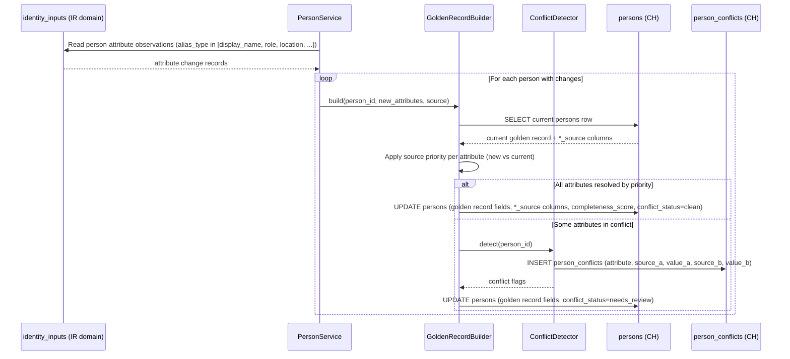
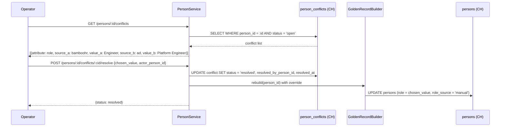

# Technical Design — Person Domain


<!-- toc -->

- [1. Architecture Overview](#1-architecture-overview)
  - [1.1 Architectural Vision](#11-architectural-vision)
  - [1.2 Architecture Drivers](#12-architecture-drivers)
  - [1.3 Architecture Layers](#13-architecture-layers)
- [2. Principles & Constraints](#2-principles--constraints)
  - [2.1 Design Principles](#21-design-principles)
  - [2.2 Constraints](#22-constraints)
- [3. Technical Architecture](#3-technical-architecture)
  - [3.1 Domain Model](#31-domain-model)
  - [3.2 Component Model](#32-component-model)
  - [3.3 API Contracts](#33-api-contracts)
  - [3.4 Internal Dependencies](#34-internal-dependencies)
  - [3.5 External Dependencies](#35-external-dependencies)
  - [3.6 Interactions & Sequences](#36-interactions--sequences)
  - [3.7 Database Schemas & Tables](#37-database-schemas--tables)
- [4. Additional Context](#4-additional-context)
  - [4.1 Golden Record Pattern](#41-golden-record-pattern)
  - [4.2 SCD Type 2 / Type 3](#42-scd-type-2--type-3)
- [5. Traceability](#5-traceability)

<!-- /toc -->

- [ ] `p3` - **ID**: `cpt-person-design-person`

> Version 1.0 — April 2026
> New domain: split from identity-resolution monolith. Owns person records, golden record assembly, person-level conflict detection, and availability.
---

## 1. Architecture Overview

### 1.1 Architectural Vision

The Person domain owns the canonical person record — the single source of truth for who a person is, what their attributes are, and which source contributed each attribute. It sits downstream of the Identity Resolution domain: IR resolves aliases to `person_id`; the Person domain owns the `persons` table that `person_id` points to.

The core challenge this domain solves is **golden record assembly**: when multiple source systems (BambooHR, Active Directory, GitLab, Jira) each contribute partial, sometimes contradictory information about the same person, the GoldenRecordBuilder component resolves these contributions into a single best-value record. Source priority rules determine which system's value wins for each attribute; conflicts that cannot be resolved by priority are flagged for operator review.

The architecture is ClickHouse-native, matching the project-wide decision. The `persons` table is a single merged entity (combining the v1 `person_entity`, `person`, and `person_golden` tables) with golden record fields inlined. SCD Type 2/Type 3 history is managed by dbt macros producing `*_snapshot` and `*_fields_history` tables — this is out of scope for this design but referenced for completeness. Person-attribute observations are read from the shared `identity_inputs` table (owned by the IR domain); the Person domain reads `identity_inputs` rows where `alias_type` corresponds to person attributes (e.g., `display_name`, `role`, `location`).

### 1.2 Architecture Drivers


#### Functional Drivers

| Requirement | Design Response |
|---|---|
| Maintain canonical person records | `persons` table — merged entity with golden record fields |
| Assemble best-value attributes from multiple sources | GoldenRecordBuilder — configurable per-attribute source priority |
| Detect conflicting attribute values between sources | ConflictDetector — flags records as `needs_review` when sources disagree |
| Track source provenance per attribute | `persons` table `*_source` columns — which source contributed each golden record attribute |
| Track availability/leave periods | `person_availability` table — temporal leave/capacity records |
| Create persons from HR seed data | dbt seed models populate `persons` from HR Bronze data |
| Expose person data for cross-domain consumption | `persons.id` is the canonical FK target for IR aliases and org-chart assignments |

#### NFR Allocation

| NFR ID | NFR Summary | Allocated To | Design Response | Verification Approach |
|---|---|---|---|---|
| `cpt-person-nfr-golden-record-freshness` | Golden record updated within 30 min of source change | GoldenRecordBuilder | Triggered by identity_inputs processing; batch update | Monitor `persons.updated_at` lag vs `identity_inputs._synced_at` |
| `cpt-person-nfr-tenant-isolation` | No cross-tenant person data leaks | All tables | `insight_tenant_id` as first column in all ORDER BY keys | Cross-tenant query returns empty |
| `cpt-person-nfr-completeness-tracking` | Completeness score always accurate | GoldenRecordBuilder | Recomputed on every golden record rebuild | Verify `completeness_score` matches non-empty attribute count |

### 1.3 Architecture Layers

- [ ] `p3` - **ID**: `cpt-person-tech-layers`

```text
┌──────────────────────────────────────────────────────────────────────┐
│                          PERSON DOMAIN                                │
├──────────────────────────────────────────────────────────────────────┤
│                                                                       │
│  SHARED INPUT                 PERSON TABLES           CONSUMERS       │
│  ────────────                 ─────────────           ─────────       │
│                                                                       │
│  ┌──────────────────┐    ┌───────────────────┐                       │
│  │ identity_inputs  │    │     persons        │──── Gold dashboards  │
│  │ (IR domain, shared)│──▶│  (golden record)   │                      │
│  └──────────────────┘    └───────────────────┘                       │
│         │                   (history via dbt                          │
│         │                    SCD2/SCD3 macros)                        │
│         │                                                             │
│         │                 ┌──────────────────┐                       │
│         └────────────────▶│person_availability│                       │
│                           └──────────────────┘                       │
│                                                                       │
│  COMPONENTS               ┌──────────────────┐                       │
│  ──────────               │person_conflicts   │                       │
│  GoldenRecordBuilder ────▶│(attribute-level)  │                       │
│  ConflictDetector ────────┘                   │                       │
│  PersonService (API) ─────────────────────────┘                       │
│                                                                       │
│  ──── Cross-Domain ─────────────────────────────────────────────     │
│                                                                       │
│  IR domain: aliases.person_id ──FK──▶ persons.id                     │
│  Org-chart: person_assignments.person_id ──FK──▶ persons.id          │
│                                                                       │
└──────────────────────────────────────────────────────────────────────┘
```

| Layer | Responsibility | Technology |
|---|---|---|
| Ingestion | Read person-attribute observations from shared `identity_inputs` | ClickHouse (read from IR domain table) |
| Processing | GoldenRecordBuilder assembles best-value records; ConflictDetector flags disagreements | Python / dbt macros |
| Storage | Person records, source contributions, availability, conflicts | ClickHouse (ReplacingMergeTree, MergeTree) |
| API | REST endpoints for person CRUD, golden record queries | Python (FastAPI) |
| Cross-domain | `persons.id` referenced by IR aliases and org-chart assignments | Logical FK (no physical constraint) |

---

## 2. Principles & Constraints

### 2.1 Design Principles

#### Source-Priority Golden Record

- [ ] `p2` - **ID**: `cpt-person-principle-source-priority`

Every person attribute has a configurable source priority ranking. When multiple sources contribute the same attribute (e.g., BambooHR and Active Directory both provide `display_name`), the highest-priority source wins. The winning source is tracked in the `*_source` column alongside the attribute value. This ensures deterministic, reproducible golden records — given the same inputs and priority configuration, the output is always the same.


#### Single Merged Entity

- [ ] `p2` - **ID**: `cpt-person-principle-single-entity`

The `persons` table is a single merged entity combining identity anchor, versioned state, and golden record fields. There is no separate `person_entity`, `person`, or `person_golden` table. This reduces JOIN complexity, simplifies cross-domain references (one table, one `id`), and aligns with ClickHouse's denormalized query patterns.


#### Conflict Transparency

- [ ] `p2` - **ID**: `cpt-person-principle-conflict-transparency`

When sources disagree on an attribute and source priority alone cannot determine the correct value, the conflict is recorded and the person's `conflict_status` is set to `needs_review`. The system never silently drops conflicting data — operators can see both values and resolve the conflict.


#### Domain Isolation

- [ ] `p2` - **ID**: `cpt-person-principle-domain-isolation`

The Person domain owns person records and nothing else. Alias-to-person mapping belongs to the Identity Resolution domain. Org hierarchy and assignments belong to the Org-Chart domain. The Person domain reads from the shared `identity_inputs` table but does not write to it. It writes only to its own tables.


### 2.2 Constraints

#### ClickHouse-Only Storage

- [ ] `p2` - **ID**: `cpt-person-constraint-ch-only`

All person domain tables reside in ClickHouse. No PostgreSQL, no MariaDB. This is a project-wide decision.


#### PR #55 Naming Conventions

- [ ] `p2` - **ID**: `cpt-person-constraint-naming`

All tables and columns follow PR #55 glossary conventions: plural table names, `id UUID DEFAULT generateUUIDv7()`, `insight_tenant_id UUID`, `insight_source_id UUID` + `insight_source_type LowCardinality(String)`, `DateTime64(3, 'UTC')` timestamps, `is_` prefix booleans as `UInt8`, `LowCardinality(String)` for enums, no `Nullable` unless semantically needed.


#### Shared identity_inputs Table

- [ ] `p2` - **ID**: `cpt-person-constraint-shared-bootstrap`

The `identity_inputs` table is owned by the Identity Resolution domain. The Person domain reads from it (filtering by person-attribute `alias_type` values like `display_name`, `role`, `location`) but does not write to it or modify its schema.


#### dbt-Managed History

- [ ] `p2` - **ID**: `cpt-person-constraint-dbt-history`

SCD Type 2/Type 3 history for the `persons` table is managed by dbt macros producing `persons_snapshot` and `persons_fields_history` tables. The Person domain DESIGN defines the `persons` table schema; dbt owns the snapshot mechanism. This design does not specify the snapshot table schemas.


---

## 3. Technical Architecture

### 3.1 Domain Model

**Technology**: ClickHouse

**Core Entities**:

| Entity | Description | Key |
|---|---|---|
| `persons` | Canonical person record with inlined golden record fields | `id UUID` |
| `person_availability` | Leave/capacity periods per person | `id UUID` |
| `person_conflicts` | Person-attribute disagreements between sources | `id UUID` |

**Relationships**:
- `persons.id` ← `aliases.person_id` (IR domain, logical FK — many aliases per person)
- `persons.id` ← `person_assignments.person_id` (org-chart domain, logical FK)
- `persons.id` → `person_availability.person_id` (1:N — multiple leave periods)
- `persons.id` → `person_conflicts.person_id` (1:N — multiple attribute conflicts)
- `persons.manager_person_id` → `persons.id` (self-reference — manager is also a person)

### 3.2 Component Model

```text
┌───────────────────────────────────────────────────────────┐
│                     Person Domain                          │
│                                                            │
│  ┌──────────────────────┐    ┌────────────────────┐       │
│  │ GoldenRecordBuilder  │───▶│ ConflictDetector    │       │
│  │ (attribute assembly) │    │ (attribute conflicts)│       │
│  └──────────┬───────────┘    └────────┬───────────┘       │
│             │                         │                    │
│             ▼                         ▼                    │
│  ┌──────────────────────────────────────────────┐         │
│  │           PersonService (API)                 │         │
│  │  GET /persons/:id  PUT /persons/:id  etc.    │         │
│  └──────────────────────────────────────────────┘         │
└───────────────────────────────────────────────────────────┘
```

#### GoldenRecordBuilder

- [ ] `p2` - **ID**: `cpt-person-component-golden-record-builder`

##### Why this component exists

Assembles the best-value `persons` record from incoming attribute observations (via `identity_inputs`), using configurable per-attribute source priority rules. Without it, person records would show arbitrary or stale attribute values without any consistency guarantee.

##### Responsibility scope

- `build(person_id)` — reads incoming attribute observations from `identity_inputs` for the person; applies per-attribute source priority; writes merged golden record fields to `persons`.
- `completeness_score(person_id)` — computes fraction of non-empty canonical attributes.
- Tracks per-attribute source in `persons.*_source` columns (e.g., `email_source = 'bamboohr'`).
- Invokes ConflictDetector when source priority alone cannot resolve a disagreement.
- Triggered after each person-attribute observation arrives via `identity_inputs` (from bootstrap pipeline or dbt models).

##### Responsibility boundaries

- Does NOT write to `aliases` table — that belongs to the IR domain.
- Does NOT manage person creation — persons are created by dbt seed (Phase 1) or PersonService API (later phases).
- Does NOT manage org hierarchy or assignments — that belongs to the org-chart domain.

##### Related components (by ID)

- `cpt-person-component-conflict-detector` — called when sources disagree on an attribute
- `cpt-person-component-person-service` — GoldenRecordBuilder is invoked by PersonService after source contribution updates

---

#### ConflictDetector

- [ ] `p2` - **ID**: `cpt-person-component-conflict-detector`

##### Why this component exists

Detects and records person-attribute-level conflicts — when two or more source contributions provide different values for the same canonical attribute (e.g., HR says `role=Engineer`, AD says `role=Platform Engineer`), and source priority alone cannot determine the correct value.

##### Responsibility scope

- `detect(person_id)` — compares attribute values from different sources (tracked via `*_source` columns and `identity_inputs` history); writes to `person_conflicts` table when values disagree and are not resolvable by priority.
- Sets `persons.conflict_status = 'needs_review'` when unresolved conflicts exist.
- Marks conflicts as `resolved` when operator provides resolution or when a higher-priority source updates.

##### Responsibility boundaries

- Does NOT detect alias-level conflicts (same alias mapped to multiple persons) — that belongs to the IR domain's ConflictDetector.
- Does NOT auto-resolve conflicts beyond source priority — creates a flag for operator review.

##### Related components (by ID)

- `cpt-person-component-golden-record-builder` — calls this when attribute disagreements found

---

#### PersonService

- [ ] `p2` - **ID**: `cpt-person-component-person-service`

##### Why this component exists

REST API layer for person record CRUD, golden record queries, conflict management, and person creation. Exposes the `/api/persons/` endpoints.

##### Responsibility scope

- `GET /persons/:id` — retrieve person with golden record fields.
- `GET /persons` — list persons with filters (tenant, status, conflict_status).
- `POST /persons` — create new person (later phases; Phase 1 uses dbt seed).
- `PUT /persons/:id` — manual attribute override (sets `*_source = 'manual'`).
- `GET /persons/:id/conflicts` — list unresolved attribute conflicts.
- `POST /persons/:id/conflicts/:id/resolve` — operator resolves a conflict.
- `GET /persons/:id/availability` — list availability periods.
- Triggers GoldenRecordBuilder after source contribution changes.

##### Responsibility boundaries

- Does NOT manage aliases — that belongs to IR domain's ResolutionService.
- Does NOT manage org assignments — that belongs to the org-chart domain.

##### Related components (by ID)

- `cpt-person-component-golden-record-builder` — triggered after source updates
- `cpt-person-component-conflict-detector` — results displayed via conflict endpoints

---

### 3.3 API Contracts

- [ ] `p2` - **ID**: `cpt-person-interface-api`

- **Technology**: REST / HTTP JSON
- **Base path**: `/api/persons/`

**Endpoints Overview**:

| Method | Path | Description | Stability |
|---|---|---|---|
| `GET` | `/persons/:id` | Get person with golden record fields | stable |
| `GET` | `/persons` | List persons (filterable by tenant, status) | stable |
| `POST` | `/persons` | Create new person | stable |
| `PUT` | `/persons/:id` | Manual attribute override | stable |
| `GET` | `/persons/:id/conflicts` | List person-attribute conflicts | stable |
| `POST` | `/persons/:id/conflicts/:id/resolve` | Resolve a conflict | stable |
| `GET` | `/persons/:id/availability` | List availability periods | stable |

---

### 3.4 Internal Dependencies

| Dependency Module | Interface Used | Purpose |
|---|---|---|
| IR domain (`identity_inputs` table) | ClickHouse read | Read person-attribute observations for golden record assembly |
| IR domain (`aliases` table) | Logical FK (`aliases.person_id → persons.id`) | IR resolves aliases to person records owned by this domain |
| Org-chart domain (`person_assignments` table) | Logical FK (`person_assignments.person_id → persons.id`) | Org-chart assigns persons to org units |
| dbt models (Bronze → Silver) | ClickHouse tables | dbt seed populates `persons` from HR Bronze data in Phase 1 MVP |

**Dependency Rules**:
- Person domain reads from `identity_inputs` but does not write to it
- Person domain writes person-attribute unmapped observations to the shared `unmapped` table (IR domain) — differentiated by `alias_type`
- Person domain does not depend on IR domain internals (aliases, match_rules)
- IR domain and org-chart domain depend on `persons.id` as a stable FK target

---

### 3.5 External Dependencies

#### ClickHouse (Storage Engine)

| Aspect | Value |
|---|---|
| Engine | ReplacingMergeTree for `persons`; MergeTree for others |
| Version | 24.x+ (for `generateUUIDv7()` support) |
| Access | Direct read/write from PersonService and GoldenRecordBuilder |

#### dbt (Transformation Engine)

| Aspect | Value |
|---|---|
| Purpose | Seed `persons` from HR Bronze (Phase 1); manage SCD snapshots |
| Models | `persons` seed, `persons_snapshot` (SCD2), `persons_fields_history` (SCD3) |
| Schedule | Post-connector-sync, via Argo Workflows |

---

### 3.6 Interactions & Sequences

#### Golden Record Assembly

**ID**: `cpt-person-seq-golden-record-assembly`



---

#### Conflict Resolution (Operator)

**ID**: `cpt-person-seq-conflict-resolution`



---

### 3.7 Database Schemas & Tables

- [ ] `p3` - **ID**: `cpt-person-db-schemas`

All tables are in ClickHouse. PR #55 naming conventions. No Nullable unless semantically required.

#### Table: `persons`

**ID**: `cpt-person-dbtable-persons`

Canonical person record with inlined golden record fields. Single merged entity (replaces v1 `person_entity` + `person` + `person_golden`).

| Column | Type | Description |
|---|---|---|
| `id` | `UUID DEFAULT generateUUIDv7()` | PK — canonical person identifier referenced by all cross-domain FKs |
| `insight_tenant_id` | `UUID` | Tenant isolation |
| `display_name` | `String` | Best-value display name from source priority |
| `display_name_source` | `LowCardinality(String)` | Source that provided `display_name` (`manual`, `hr`, `git`, `communication`, `auto`) |
| `status` | `LowCardinality(String)` | `active`, `inactive`, `external`, `bot` |
| `email` | `String` | Best-value primary email |
| `email_source` | `LowCardinality(String)` | Source that provided `email` |
| `username` | `String` | Best-value username |
| `username_source` | `LowCardinality(String)` | Source that provided `username` |
| `role` | `String` | Canonical job role / title |
| `role_source` | `LowCardinality(String)` | Source that provided `role` |
| `manager_person_id` | `UUID` | Self-reference → `persons.id` (zero UUID if unknown) |
| `manager_person_id_source` | `LowCardinality(String)` | Source that provided `manager_person_id` |
| `org_unit_id` | `UUID` | Logical FK → `org_units.id` (org-chart domain; zero UUID if unknown) |
| `org_unit_id_source` | `LowCardinality(String)` | Source that provided `org_unit_id` |
| `location` | `String` | Office / work location |
| `location_source` | `LowCardinality(String)` | Source that provided `location` |
| `completeness_score` | `Float32` | Fraction of non-empty canonical attributes (0.0–1.0) |
| `conflict_status` | `LowCardinality(String)` | `clean`, `needs_review` |
| `created_at` | `DateTime64(3, 'UTC')` | Row creation time |
| `updated_at` | `DateTime64(3, 'UTC')` | Last modification time |
| `is_deleted` | `UInt8` | Soft-delete flag (0 = active, 1 = deleted) |

**PK**: `id`

**ORDER BY**: `(insight_tenant_id, id)`

**Engine**: `ReplacingMergeTree(updated_at)`

**Golden record attributes** (canonical vocabulary):

| Attribute | Source Priority (highest → lowest) |
|---|---|
| `display_name` | `manual` > `hr` > `git` > `communication` > `auto` |
| `email` | `manual` > `hr` > `git` > `communication` > `auto` |
| `username` | `manual` > `hr` > `git` > `communication` > `auto` |
| `role` | `manual` > `hr` > `auto` |
| `manager_person_id` | `manual` > `hr` > `auto` |
| `org_unit_id` | `manual` > `hr` > `auto` |
| `location` | `manual` > `hr` > `auto` |

**Completeness score** = count of non-empty golden attributes / 7 (display_name, email, username, role, manager_person_id, org_unit_id, location).

**Example**:

| id | insight_tenant_id | display_name | display_name_source | status | email | role | completeness_score | conflict_status |
|---|---|---|---|---|---|---|---|---|
| `p-1001` | `t-001` | Anna Ivanova | `hr` | `active` | `anna.ivanova@acme.com` | `Engineer` | 0.86 | `clean` |

---

---

> **Note**: Per-source attribute snapshots are NOT stored in a dedicated table. The `persons` table stores the golden record (best-value result). Full field-level change history is maintained externally via **SCD Type 2** (row-level snapshots in `persons_snapshot` table) and **SCD Type 3** (field-level changes in `fields_history` table), both populated by dbt macros — outside this domain's scope. The `_source` columns on `persons` track which source contributed each current attribute value.

---

#### Table: `person_availability`

**ID**: `cpt-person-dbtable-person-availability`

Absence periods per person (vacation, sick leave, parental leave, etc.). Used by dashboards to normalize productivity metrics — a person without commits during a vacation period is not flagged as inactive. Absence of a record means the person is available.

| Column | Type | Description |
|---|---|---|
| `id` | `UUID DEFAULT generateUUIDv7()` | PK |
| `person_id` | `UUID` | FK → `persons.id` |
| `insight_tenant_id` | `UUID` | Tenant isolation |
| `period_type` | `LowCardinality(String)` | `vacation`, `sick_leave`, `parental_leave`, `public_holiday`, `unpaid_leave`, `other` |
| `effective_from` | `Date` | Absence start (inclusive) |
| `effective_to` | `Date` | Absence end (exclusive); `'1970-01-01'` = open-ended / unknown end |
| `insight_source_id` | `UUID` | Source system that provided this record |
| `insight_source_type` | `LowCardinality(String)` | Source type |
| `created_at` | `DateTime64(3, 'UTC')` | Row creation time |
| `updated_at` | `DateTime64(3, 'UTC')` | Last modification time |

**PK**: `id`

**ORDER BY**: `(insight_tenant_id, person_id, effective_from, id)`

**Engine**: `MergeTree`

> **Future consideration**: This table currently tracks absence periods only. It may be extended to a general-purpose availability model tracking both presence (`employed`, `contractor`) and absence periods, with `period_type` categorized into presence/absence groups. Alternatively, presence tracking may be handled by `person_assignments` in the org-chart domain (assignment_type = `employment`).

---

#### Table: `person_conflicts`

**ID**: `cpt-person-dbtable-person-conflicts`

Person-attribute-level conflicts — when two sources provide different values for the same canonical attribute and source priority cannot resolve the disagreement.

| Column | Type | Description |
|---|---|---|
| `id` | `UUID DEFAULT generateUUIDv7()` | PK |
| `person_id` | `UUID` | FK → `persons.id` |
| `insight_tenant_id` | `UUID` | Tenant isolation |
| `attribute_name` | `LowCardinality(String)` | Canonical attribute name (`display_name`, `role`, `location`, etc.) |
| `insight_source_id_a` | `UUID` | First source instance |
| `insight_source_type_a` | `LowCardinality(String)` | First source type |
| `value_a` | `String` | Value from source A |
| `insight_source_id_b` | `UUID` | Second source instance |
| `insight_source_type_b` | `LowCardinality(String)` | Second source type |
| `value_b` | `String` | Value from source B |
| `status` | `LowCardinality(String)` | `open`, `resolved`, `ignored` |
| `resolved_by_person_id` | `UUID` | Who resolved (zero UUID if unresolved) |
| `resolved_at` | `DateTime64(3, 'UTC')` | When resolved (`'1970-01-01'` if unresolved) |
| `created_at` | `DateTime64(3, 'UTC')` | Row creation time |
| `updated_at` | `DateTime64(3, 'UTC')` | Last modification time |

**PK**: `id`

**ORDER BY**: `(insight_tenant_id, person_id, status, attribute_name, id)`

> **Shared unmapped table** ([ADR-0001](./ADR/0001-shared-unmapped-table.md)): Person-attribute observations that cannot be resolved are stored in the IR domain's shared `unmapped` table (not a separate `person_unmapped`). Both domains use the same structure and data origin (`identity_inputs`). Differentiation is by `alias_type`: identity types (`email`, `username`, `employee_id`, `platform_id`) vs person-attribute types (`display_name`, `role`, `location`, etc.).

**Engine**: `ReplacingMergeTree(updated_at)`

---

## 4. Additional Context

### 4.1 Golden Record Pattern

The golden record is the single best-value view of a person assembled from all source contributions. Key aspects:

**Source priority** determines which source's value wins for each attribute. Priority is configurable per deployment. The default ranking (highest to lowest):
1. `manual` — operator override
2. `hr` — BambooHR, Workday (most authoritative for employment data)
3. `git` — Git commit author name
4. `communication` — Zulip, Slack, M365
5. `auto` — first value seen from any source

**Per-attribute `*_source` columns** in `persons` track which source provided each golden record value. This enables auditing ("why does this person show role=Engineer?") and debugging.

**Canonical attribute vocabulary** (from v4 Two-Stage Naming):
- Bronze/interchange names: `department`, `team`, `manager`, `title`
- Canonical names (stored in `persons` golden record fields): `role`, `org_unit_id`, `manager_person_id`, `username`, `location`
- The bootstrap pipeline resolves Bronze names → canonical names during contribution upsert.

**Completeness score** = fraction of non-empty canonical attributes out of the 7 tracked attributes. A person with display_name, email, and role filled has `completeness_score = 3/7 ≈ 0.43`.

### 4.2 SCD Type 2 / Type 3

SCD history for the `persons` table is managed by dbt macros, not by this domain's application code:
- **SCD Type 2**: `persons_snapshot` table — full row snapshots with `dbt_valid_from` / `dbt_valid_to`
- **SCD Type 3**: `persons_fields_history` table — per-field change tracking with previous/current values

These tables are produced by dbt's `snapshot` and custom macros. The Person domain DESIGN defines the source `persons` table schema; dbt owns the derived snapshot schemas.

---

## 5. Traceability

- **PRD**: [PRD.md](./PRD.md)
- **Features**: features/ (to be created from DECOMPOSITION entries)
- **Related (IR domain)**: [Identity Resolution DESIGN](../../identity-resolution/specs/DESIGN.md) — aliases, identity_inputs
- **Related (org-chart domain)**: Org-chart domain DESIGN — org_units, person_assignments
- **Source material**: Original identity-resolution v1 DESIGN — person_entity, person, person_golden schemas (merged into `persons`)
