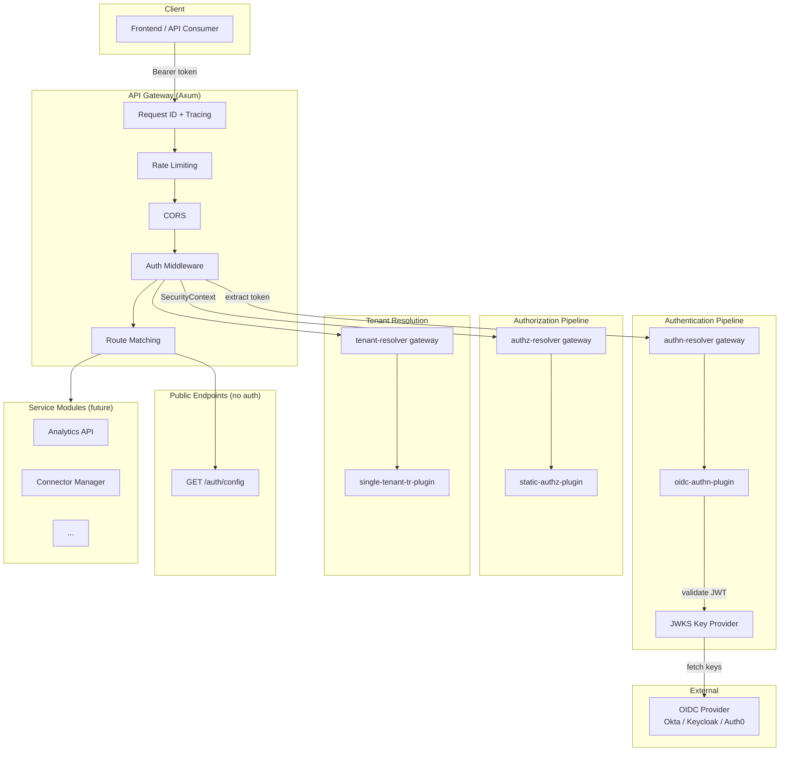
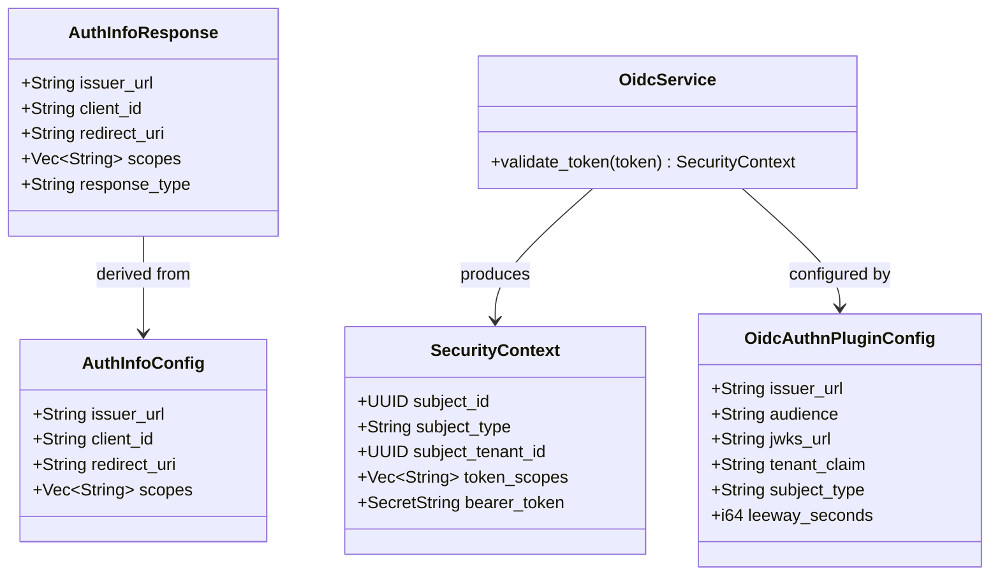
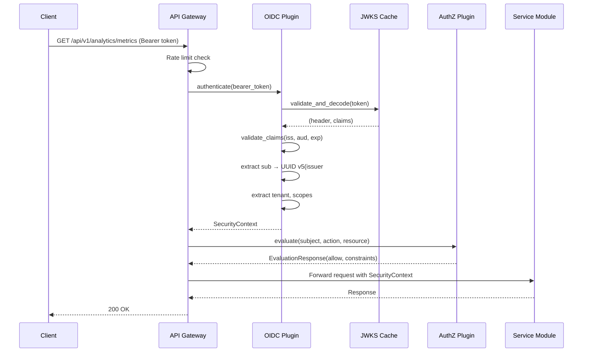
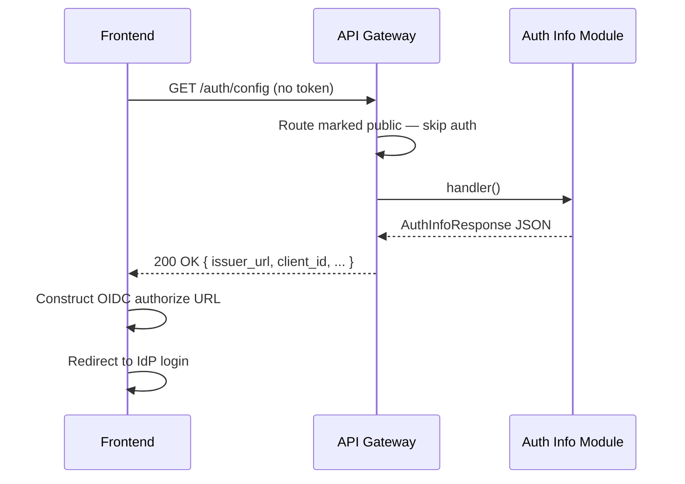

# Technical Design -- API Gateway

- [ ] `p1` - **ID**: `cpt-insightspec-design-api-gateway`

<!-- toc -->

- [1. Architecture Overview](#1-architecture-overview)
  - [1.1 Architectural Vision](#11-architectural-vision)
  - [1.2 Architecture Drivers](#12-architecture-drivers)
  - [1.3 Architecture Layers](#13-architecture-layers)
- [2. Principles & Constraints](#2-principles--constraints)
  - [2.1 Design Principles](#21-design-principles)
  - [2.2 Constraints](#22-constraints)
- [3. Technical Architecture](#3-technical-architecture)
  - [3.1 Domain Model](#31-domain-model)
  - [3.2 Component Model](#32-component-model)
  - [3.3 API Contracts](#33-api-contracts)
  - [3.4 Internal Dependencies](#34-internal-dependencies)
  - [3.5 External Dependencies](#35-external-dependencies)
  - [3.6 Interactions & Sequences](#36-interactions--sequences)
  - [3.7 Database Schemas & Tables](#37-database-schemas--tables)
  - [3.8 Deployment Topology](#38-deployment-topology)
- [4. Additional Context](#4-additional-context)
  - [JWKS Key Lifecycle](#jwks-key-lifecycle)
  - [JWT Claim Mapping](#jwt-claim-mapping)
  - [Configuration Layering](#configuration-layering)
- [5. Traceability](#5-traceability)

<!-- /toc -->

## 1. Architecture Overview

### 1.1 Architectural Vision

The API Gateway is the HTTP entry point for all Insight backend services. It is a cyberfabric-core ModKit server binary that links system modules (api-gateway, authn-resolver, authz-resolver, tenant-resolver) with an Insight-specific OIDC authentication plugin and a public auth-info endpoint.

The gateway validates every inbound request via JWT bearer tokens against the customer's OIDC provider (Okta, Keycloak, Auth0), enforces tenant isolation and RBAC via the authorization pipeline, and routes authenticated requests to service modules. It exposes OpenAPI documentation, CORS, per-route rate limiting, and RFC 9457 error responses out of the box via cyberfabric-core infrastructure.

The OIDC plugin is built as a reusable `authn-resolver` plugin using `modkit-auth` JWT/JWKS primitives, suitable for upstreaming to cyberfabric-core.

### 1.2 Architecture Drivers

#### Functional Drivers

| Requirement | Design Response |
|-------------|------------------|
| `cpt-insightspec-fr-be-oidc-auth` | OIDC plugin validates JWT tokens via JWKS key discovery; no bundled IdP |
| `cpt-insightspec-fr-be-health-checks` | Cyberfabric api-gateway exposes `/health` and `/ready` |
| `cpt-insightspec-fr-be-rbac` | AuthZ resolver pipeline enforces role-based access |
| `cpt-insightspec-fr-be-visibility-policy` | AuthZ plugin returns org-scoped constraints per request |

#### NFR Allocation

| NFR ID | NFR Summary | Allocated To | Design Response | Verification Approach |
|--------|-------------|--------------|-----------------|----------------------|
| `cpt-insightspec-nfr-be-rate-limiting` | Per-route rate limiting | api-gateway (governor) | Configurable RPS, burst, max in-flight per operation | Load test; verify 429 at threshold |
| `cpt-insightspec-nfr-be-api-versioning` | Versioned endpoints | api-gateway prefix_path | All routes under `/api/v1/` | Deploy v2; verify v1 still works |
| `cpt-insightspec-nfr-be-api-conventions` | RFC 9457, OData, pagination | api-gateway middleware | Standard error format, consistent response envelopes | Integration tests verify format |
| `cpt-insightspec-nfr-be-graceful-shutdown` | Zero message loss on deploy | ModKit CancellationToken | SIGTERM → drain → close | Rolling deploy test |
| `cpt-insightspec-nfr-be-tenant-isolation` | Tenant data isolation | authn + authz pipeline | SecurityContext carries tenant_id from JWT → AccessScope | Cross-tenant access test |

### 1.3 Architecture Layers



- [ ] `p1` - **ID**: `cpt-insightspec-tech-api-gateway-layers`

| Layer | Responsibility | Technology |
|-------|---------------|------------|
| HTTP Server | Request handling, routing, middleware | Axum (via cyberfabric api-gateway module) |
| Authentication | JWT validation, JWKS discovery | oidc-authn-plugin + modkit-auth |
| Authorization | RBAC + org scoping | authz-resolver + static-authz-plugin (custom plugin later) |
| Tenant Resolution | Workspace isolation | tenant-resolver + single-tenant-tr-plugin |
| Public Endpoints | Unauthenticated routes | auth-info module (GET /auth/config) |

## 2. Principles & Constraints

### 2.1 Design Principles

#### Reuse cyberfabric-core, Don't Reinvent

- [ ] `p1` - **ID**: `cpt-insightspec-principle-gw-reuse-cyberfabric`

The gateway is a thin binary that links cyberfabric-core system modules. All HTTP infrastructure (routing, middleware, OpenAPI, rate limiting) comes from the api-gateway module. Authentication and authorization use the existing resolver/plugin pattern. Only Insight-specific logic (OIDC plugin, auth-info endpoint) is custom code.

**Why**: Reduces maintenance burden. Bug fixes and features in cyberfabric-core benefit Insight automatically.

#### Public by Exception

- [ ] `p1` - **ID**: `cpt-insightspec-principle-gw-public-by-exception`

All routes require authentication by default (`require_auth_by_default: true`). Public routes must explicitly call `.public()` on the `OperationBuilder`. Only `/auth/config` is public.

**Why**: Prevents accidental exposure of authenticated endpoints. New modules get auth for free.

#### Plugin-Based Authentication

- [ ] `p1` - **ID**: `cpt-insightspec-principle-gw-plugin-auth`

Authentication is implemented as a pluggable `authn-resolver` plugin, not hardcoded in the gateway. The OIDC plugin can be swapped for a static plugin (dev), a different OIDC provider, or a custom enterprise auth plugin without changing the gateway binary.

**Why**: Customers have different IdPs. The plugin pattern keeps the gateway generic.

### 2.2 Constraints

#### OIDC Providers Only

- [ ] `p1` - **ID**: `cpt-insightspec-constraint-gw-oidc-only`

The gateway supports only OIDC-compliant identity providers that expose JWKS endpoints. SAML, LDAP direct auth, and API key authentication are not supported.

#### Okta JWKS Default

- [ ] `p2` - **ID**: `cpt-insightspec-constraint-gw-okta-jwks-default`

The OIDC plugin defaults to Okta's JWKS URL convention (`{issuer}/v1/keys`). Non-Okta providers (Keycloak, Auth0) must set `jwks_url` explicitly in configuration.

## 3. Technical Architecture

### 3.1 Domain Model



### 3.2 Component Model

#### OIDC AuthN Plugin

- [ ] `p1` - **ID**: `cpt-insightspec-component-gw-oidc-plugin`

##### Why this component exists

Cyberfabric-core ships only a static (dev) authn plugin. Insight needs production JWT validation against real OIDC providers.

##### Responsibility scope

Validate JWT bearer tokens using JWKS key discovery (via `modkit-auth`). Extract `sub`, tenant, and scopes from claims. Build `SecurityContext`. Register as `authn-resolver` plugin via GTS types-registry.

##### Responsibility boundaries

Does NOT handle OIDC Authorization Code flow (that's the frontend). Does NOT support client credentials exchange (use static plugin for S2S). Does NOT manage users or sessions.

##### Related components (by ID)

- `cpt-insightspec-component-gw-auth-info` -- provides: frontend uses auth-info config to redirect to the same IdP this plugin validates against

#### Auth Info Module

- [ ] `p2` - **ID**: `cpt-insightspec-component-gw-auth-info`

##### Why this component exists

The frontend needs to know where to redirect for OIDC login. This config cannot be hardcoded in the frontend build because different deployments use different IdPs.

##### Responsibility scope

Serve a single public endpoint (`GET /auth/config`) returning OIDC provider details (issuer URL, client ID, redirect URI, scopes, response type).

##### Responsibility boundaries

Does NOT perform authentication. Does NOT redirect users. Does NOT store tokens. The endpoint is read-only configuration.

##### Related components (by ID)

- `cpt-insightspec-component-gw-oidc-plugin` -- depends on: serves the same issuer_url that the OIDC plugin validates against

### 3.3 API Contracts

- [ ] `p2` - **ID**: `cpt-insightspec-interface-gw-auth-config`

- **Technology**: REST/JSON
- **Location**: `GET /auth/config` (public, no auth)

| Method | Path | Description | Auth |
|--------|------|-------------|------|
| `GET` | `/auth/config` | OIDC configuration for frontend | Public |

**Response** (200):

```json
{
  "issuer_url": "https://dev-12345.okta.com/oauth2/default",
  "client_id": "0oa1b2c3d4e5f6g7h8i9",
  "redirect_uri": "https://insight.example.com/callback",
  "scopes": ["openid", "profile", "email"],
  "response_type": "code"
}
```

### 3.4 Internal Dependencies

| Dependency Module | Interface Used | Purpose |
|-------------------|----------------|----------|
| api-gateway (cyberfabric) | Axum server, middleware pipeline | HTTP infrastructure |
| authn-resolver (cyberfabric) | Plugin gateway | Delegates auth to OIDC plugin |
| authz-resolver (cyberfabric) | Plugin gateway | Delegates authz to static/custom plugin |
| tenant-resolver (cyberfabric) | Plugin gateway | Resolves tenant from SecurityContext |
| types-registry (cyberfabric) | Plugin discovery | OIDC plugin registers via GTS |
| modkit-auth (cyberfabric) | JwksKeyProvider, validate_claims | JWT/JWKS primitives |
| modkit-http (cyberfabric) | HttpClient | JWKS endpoint HTTP calls |

### 3.5 External Dependencies

| Dependency | Protocol | Purpose |
|-----------|----------|---------|
| OIDC Provider (Okta/Keycloak/Auth0) | HTTPS (JWKS endpoint) | JWT key discovery and validation |

### 3.6 Interactions & Sequences

#### Authenticated Request Flow

**ID**: `cpt-insightspec-seq-gw-auth-flow`



#### Public Endpoint Flow



### 3.7 Database Schemas & Tables

No database. The API Gateway is stateless.

### 3.8 Deployment Topology

- [ ] `p2` - **ID**: `cpt-insightspec-topology-gw`

Deployed as a Kubernetes Deployment with per-service Helm chart (`services/api-gateway/helm/`). Scales horizontally via HPA. No persistent storage.

Configuration via:
1. YAML config file (baked into image at `/etc/insight/`)
2. Environment variable overrides (`APP__modules__<module>__config__<key>`)
3. Helm values → rendered as env vars in deployment template

## 4. Additional Context

### JWKS Key Lifecycle

The OIDC plugin uses `modkit-auth::JwksKeyProvider` which:
1. Fetches JWKS keys on startup (logs warning if IdP unreachable, does not crash)
2. Caches keys in `ArcSwap` for lock-free reads
3. Refreshes keys on a configurable interval (default: 5 minutes)
4. Uses exponential backoff on refresh failures
5. On-demand refresh with cooldown when an unknown `kid` is encountered

### JWT Claim Mapping

| JWT Claim | SecurityContext Field | Logic |
|-----------|---------------------|-------|
| `sub` | `subject_id` | UUID v5 hash of `{issuer}#{sub}` — prevents cross-IdP collision |
| `scp` (array) | `token_scopes` | Okta convention; takes priority over `scope` |
| `scope` (string) | `token_scopes` | Standard OIDC; split by whitespace |
| (neither) | `token_scopes` | Empty vec (authz layer decides) |
| `{tenant_claim}` | `subject_tenant_id` | Configurable claim name; parsed as UUID; nil if missing |

### Configuration Layering

```text
Defaults (code) → YAML file (-c flag) → Env vars (APP__*) → CLI flags (-v)
```

Each layer overrides the previous. Environment variables use double-underscore nesting: `APP__modules__oidc-authn-plugin__config__issuer_url`.

## 5. Traceability

- **Backend PRD**: `docs/components/backend/specs/PRD.md`
- **Backend DESIGN**: `docs/components/backend/specs/DESIGN.md`

This design directly addresses:

- `cpt-insightspec-fr-be-oidc-auth` -- OIDC plugin validates JWT tokens
- `cpt-insightspec-fr-be-health-checks` -- api-gateway exposes /health, /ready
- `cpt-insightspec-nfr-be-rate-limiting` -- api-gateway governor rate limiter
- `cpt-insightspec-nfr-be-api-versioning` -- prefix_path /api/v1
- `cpt-insightspec-nfr-be-api-conventions` -- RFC 9457 errors, OData conventions
- `cpt-insightspec-nfr-be-graceful-shutdown` -- ModKit CancellationToken
- `cpt-insightspec-nfr-be-tenant-isolation` -- SecurityContext carries tenant_id
- `cpt-insightspec-component-be-analytics-api` -- gateway routes to this (future)
- `cpt-insightspec-component-be-connector-manager` -- gateway routes to this (future)
